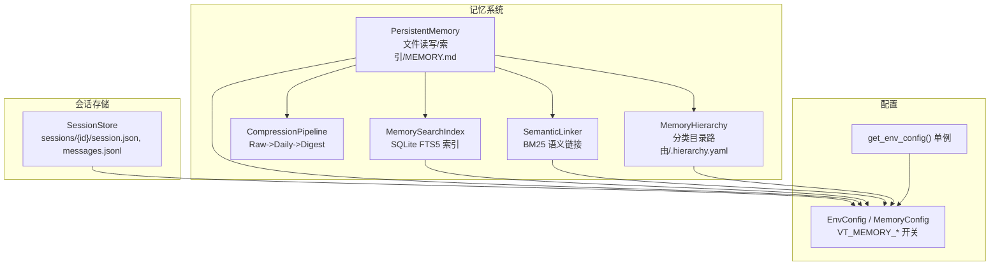
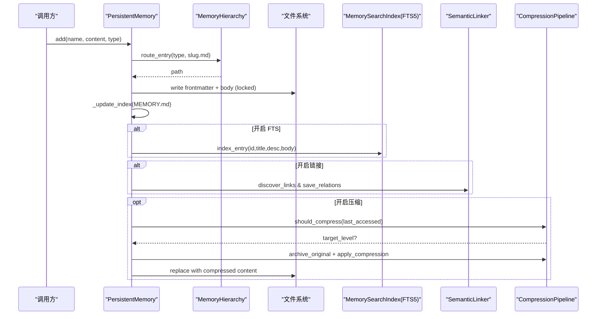
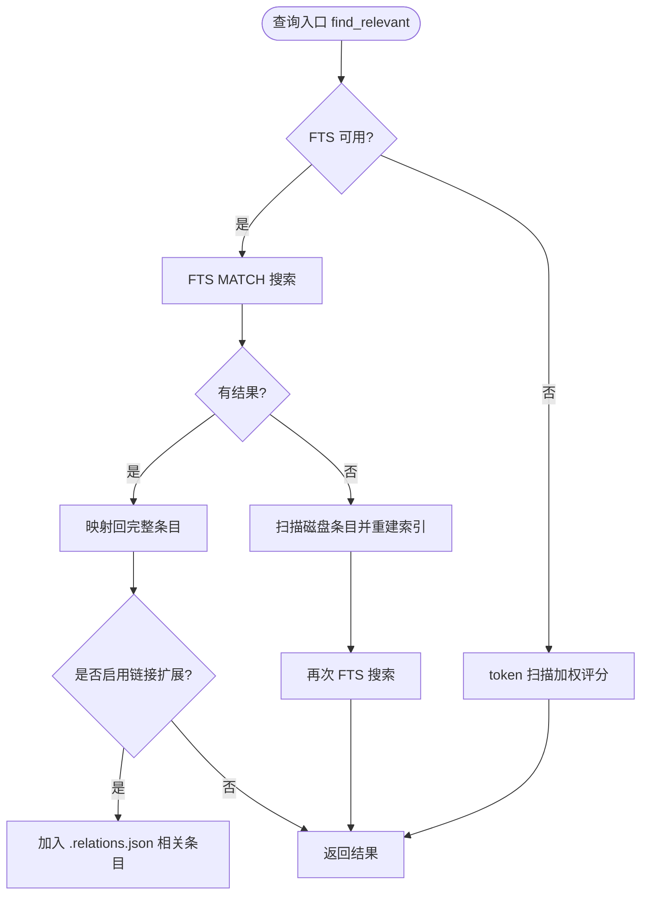
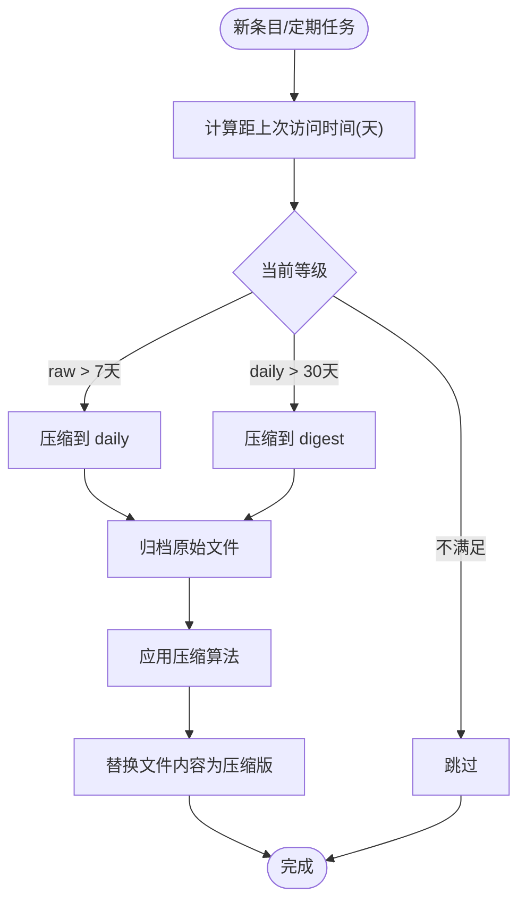
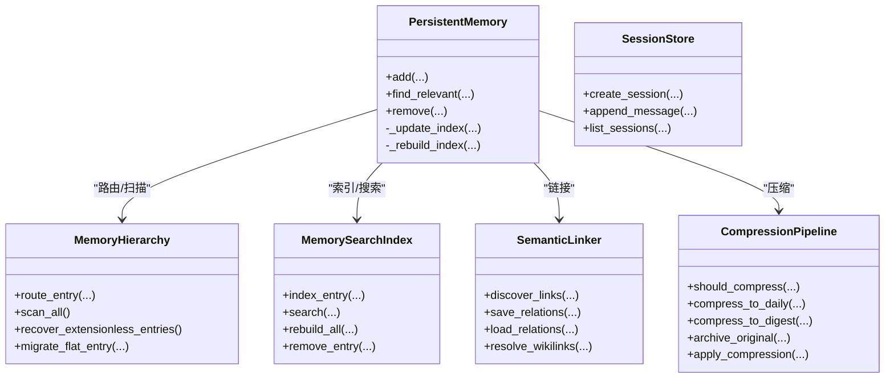

# 持久化存储引擎

<cite>
**本文引用的文件**
- [agent/src/memory/persistent.py](file://agent/src/memory/persistent.py)
- [agent/src/memory/compression.py](file://agent/src/memory/compression.py)
- [agent/src/memory/search_index.py](file://agent/src/memory/search_index.py)
- [agent/src/memory/hierarchy.py](file://agent/src/memory/hierarchy.py)
- [agent/src/memory/semantic_links.py](file://agent/src/memory/semantic_links.py)
- [agent/src/session/store.py](file://agent/src/session/store.py)
- [agent/src/config/env_schema.py](file://agent/src/config/env_schema.py)
- [agent/src/config/accessor.py](file://agent/src/config/accessor.py)
</cite>

## 目录
1. [简介](#简介)
2. [项目结构](#项目结构)
3. [核心组件](#核心组件)
4. [架构总览](#架构总览)
5. [详细组件分析](#详细组件分析)
6. [依赖关系分析](#依赖关系分析)
7. [性能考量](#性能考量)
8. [故障诊断与排错](#故障诊断与排错)
9. [结论](#结论)
10. [附录：配置与基准](#附录：配置与基准)

## 简介
本技术文档聚焦 Vibe-Trading 的“持久化存储引擎”，围绕数据存储格式、索引机制、查询优化策略、文件组织结构、元数据管理、版本控制、写入流程、并发访问控制、事务处理、压缩存储、增量更新、批量操作优化、性能基准与调优参数、迁移工具、备份恢复流程、故障诊断方法，以及与文件系统的安全交互和权限控制进行系统化说明。该引擎以本地文件系统为核心，结合 SQLite FTS5 全文检索、BM25 语义链接、分层目录路由与三级压缩流水线，提供跨会话可持久化的记忆与运行态数据管理能力。

## 项目结构
持久化存储相关代码主要位于 agent/src/memory（记忆系统）与 agent/src/session（会话存储），并通过 agent/src/config 统一的环境配置开关驱动功能特性。

图表来源
- [agent/src/memory/persistent.py:196-637](file://agent/src/memory/persistent.py#L196-L637)
- [agent/src/memory/hierarchy.py:34-436](file://agent/src/memory/hierarchy.py#L34-L436)
- [agent/src/memory/compression.py:160-353](file://agent/src/memory/compression.py#L160-L353)
- [agent/src/memory/search_index.py:113-481](file://agent/src/memory/search_index.py#L113-L481)
- [agent/src/memory/semantic_links.py:158-372](file://agent/src/memory/semantic_links.py#L158-L372)
- [agent/src/session/store.py:16-259](file://agent/src/session/store.py#L16-L259)
- [agent/src/config/env_schema.py:461-563](file://agent/src/config/env_schema.py#L461-L563)
- [agent/src/config/accessor.py:1-113](file://agent/src/config/accessor.py#L1-L113)

章节来源
- [agent/src/memory/persistent.py:196-637](file://agent/src/memory/persistent.py#L196-L637)
- [agent/src/memory/hierarchy.py:34-436](file://agent/src/memory/hierarchy.py#L34-L436)
- [agent/src/memory/compression.py:160-353](file://agent/src/memory/compression.py#L160-L353)
- [agent/src/memory/search_index.py:113-481](file://agent/src/memory/search_index.py#L113-L481)
- [agent/src/memory/semantic_links.py:158-372](file://agent/src/memory/semantic_links.py#L158-L372)
- [agent/src/session/store.py:16-259](file://agent/src/session/store.py#L16-L259)
- [agent/src/config/env_schema.py:461-563](file://agent/src/config/env_schema.py#L461-L563)
- [agent/src/config/accessor.py:1-113](file://agent/src/config/accessor.py#L1-L113)

## 核心组件
- PersistentMemory：基于文件的跨会话记忆存储，维护 MEMORY.md 索引，支持去重、重要性衰减、关键词搜索、FTS5 回退等。
- MemoryHierarchy：按 memory_type 将 .md 文件路由到分类子目录，并生成 .hierarchy.yaml 摘要，支持扁平历史兼容与修复无后缀条目。
- CompressionPipeline：三级压缩（raw/daily/digest），使用 TF-IDF 句子评分提取关键句，归档原始内容，估算信息保留率。
- MemorySearchIndex：SQLite FTS5 全文检索索引，支持 O(log n) 级别搜索、CJK 分词增强、自动重建、WAL 模式。
- SemanticLinker：基于 BM25 的语义链接发现与持久化，侧车文件 .relations.json，支持 wikilink 引用解析。
- SessionStore：会话级 JSON/JSONL 持久化，append-only 消息日志，原子写入与 fsync 保障。
- 配置层：通过 EnvConfig/MemoryConfig 集中管理 VT_MEMORY_* 开关，支持 off/on/full 预设与逐字段覆盖。

章节来源
- [agent/src/memory/persistent.py:196-637](file://agent/src/memory/persistent.py#L196-L637)
- [agent/src/memory/hierarchy.py:34-436](file://agent/src/memory/hierarchy.py#L34-L436)
- [agent/src/memory/compression.py:160-353](file://agent/src/memory/compression.py#L160-L353)
- [agent/src/memory/search_index.py:113-481](file://agent/src/memory/search_index.py#L113-L481)
- [agent/src/memory/semantic_links.py:158-372](file://agent/src/memory/semantic_links.py#L158-L372)
- [agent/src/session/store.py:16-259](file://agent/src/session/store.py#L16-L259)
- [agent/src/config/env_schema.py:461-563](file://agent/src/config/env_schema.py#L461-L563)

## 架构总览
持久化存储引擎采用“文件为主、索引为辅”的混合架构：
- 主数据：Markdown 文件（含 frontmatter 元数据）+ JSON/JSONL 会话数据。
- 辅助索引：MEMORY.md 轻量索引 + SQLite FTS5 全文索引 + .hierarchy.yaml 分类索引 + .relations.json 语义链接。
- 压缩归档：archive/ 目录保存原始文件副本，压缩后替换为精简内容。
- 并发与一致性：flock 文件锁、WAL 模式、原子写入（tmp+rename）、fsync 落盘。
- 配置驱动：VT_MEMORY_* 开关控制层级能力启用。

图表来源
- [agent/src/memory/persistent.py:462-578](file://agent/src/memory/persistent.py#L462-L578)
- [agent/src/memory/hierarchy.py:70-90](file://agent/src/memory/hierarchy.py#L70-L90)
- [agent/src/memory/search_index.py:207-239](file://agent/src/memory/search_index.py#L207-L239)
- [agent/src/memory/semantic_links.py:179-230](file://agent/src/memory/semantic_links.py#L179-L230)
- [agent/src/memory/compression.py:168-334](file://agent/src/memory/compression.py#L168-L334)

## 详细组件分析

### 文件组织与元数据管理
- 存储位置：默认 ~/.vibe-trading/memory；当启用层次化时，文件路由至 {memory_type} 子目录。
- 文件格式：Markdown 文件，frontmatter 包含 name、description、type、id、created_at、updated_at、keywords、quality_score、access_count、last_accessed、importance、related_memories、category、compression_level。
- 索引文件：
  - MEMORY.md：轻量列表索引，限制行数，用于注入系统提示或快速浏览。
  - .hierarchy.yaml：分类统计与关键词摘要，加速扫描范围裁剪。
  - .relations.json：语义链接侧车文件，记录 top-k 相似目标及分数。
- 元数据生命周期：创建时生成 id、时间戳；读取时计算 importance（质量分、访问次数、最近访问时间衰减）；删除时清理关联索引与链接。

章节来源
- [agent/src/memory/persistent.py:122-143](file://agent/src/memory/persistent.py#L122-L143)
- [agent/src/memory/persistent.py:207-307](file://agent/src/memory/persistent.py#L207-L307)
- [agent/src/memory/hierarchy.py:200-261](file://agent/src/memory/hierarchy.py#L200-L261)
- [agent/src/memory/semantic_links.py:232-319](file://agent/src/memory/semantic_links.py#L232-L319)

### 索引机制与查询优化
- 轻量索引：MEMORY.md 行级索引，追加/更新，限制最大行数避免膨胀。
- 全文检索：SQLite FTS5 虚拟表 memories_fts，对 title、description、keywords、body 建立倒排索引；CJK 文本通过单字+双字展开提升匹配；查询前做安全过滤防止注入。
- 自动重建：首次空搜索且存在磁盘条目时，触发 rebuild_all 全量重建。
- 回退策略：若 FTS5 不可用或查询失败，回退到内存 token 扫描加权评分。
- 语义链接扩展：可选地根据 .relations.json 补充相关条目，提高召回。

图表来源
- [agent/src/memory/search_index.py:252-302](file://agent/src/memory/search_index.py#L252-L302)
- [agent/src/memory/search_index.py:304-355](file://agent/src/memory/search_index.py#L304-L355)
- [agent/src/memory/persistent.py:358-438](file://agent/src/memory/persistent.py#L358-L438)
- [agent/src/memory/semantic_links.py:282-319](file://agent/src/memory/semantic_links.py#L282-L319)

章节来源
- [agent/src/memory/search_index.py:113-481](file://agent/src/memory/search_index.py#L113-L481)
- [agent/src/memory/persistent.py:358-438](file://agent/src/memory/persistent.py#L358-L438)

### 压缩存储与增量更新
- 三级压缩：
  - raw：原始内容。
  - daily：TF-IDF 句子评分，保留首尾句与 top-k 关键句，附带关键词上下文头。
  - digest：提取 top-N 重要术语，输出要点式摘要。
- 触发条件：依据 last_accessed 与阈值（7 天、30 天）决定升级压缩等级。
- 归档保护：压缩前将原文件原子复制到 archive/，失败则中止以避免数据丢失。
- 信息保留评估：Jaccard 重叠度估算压缩前后信息保留率。
- 增量更新：新条目写入后，后续可按周期检查是否需要压缩升级。

图表来源
- [agent/src/memory/compression.py:168-193](file://agent/src/memory/compression.py#L168-L193)
- [agent/src/memory/compression.py:194-256](file://agent/src/memory/compression.py#L194-L256)
- [agent/src/memory/compression.py:258-334](file://agent/src/memory/compression.py#L258-L334)

章节来源
- [agent/src/memory/compression.py:160-353](file://agent/src/memory/compression.py#L160-L353)

### 并发访问控制与事务处理
- 文件锁：跨进程 fcntl.flock 独占锁，超时返回，避免并发写冲突。
- WAL 模式：SQLite FTS5 连接启用 WAL，提升并发读性能与崩溃恢复能力。
- 原子写入：压缩归档与关系文件使用 tmp+rename 原子替换，确保一致性。
- fsync：消息追加与状态写入后调用 fsync，降低掉电丢失风险。
- 事务边界：SQLite 显式 commit；文件系统操作以最小粒度加锁，避免长事务。

章节来源
- [agent/src/memory/persistent.py:41-73](file://agent/src/memory/persistent.py#L41-L73)
- [agent/src/memory/search_index.py:137-145](file://agent/src/memory/search_index.py#L137-L145)
- [agent/src/memory/semantic_links.py:232-281](file://agent/src/memory/semantic_links.py#L232-L281)
- [agent/src/session/store.py:151-163](file://agent/src/session/store.py#L151-L163)

### 数据写入流程与批量操作
- 写入路径：
  - 去重检测：滑动窗口哈希避免重复写入。
  - 路由：按 memory_type 路由到分类目录或根目录。
  - 持久化：写入 frontmatter + 正文，更新 MEMORY.md。
  - 索引同步：可选 FTS5 增量索引、语义链接发现与持久化。
  - 压缩：按需归档与压缩。
- 批量操作：
  - FTS5 重建：rebuild_all 清空并批量插入，适合离线同步。
  - 扫描优化：层次化目录减少扫描范围；.hierarchy.yaml 关键词优先级排序。

章节来源
- [agent/src/memory/persistent.py:440-578](file://agent/src/memory/persistent.py#L440-L578)
- [agent/src/memory/search_index.py:304-355](file://agent/src/memory/search_index.py#L304-L355)
- [agent/src/memory/hierarchy.py:145-176](file://agent/src/memory/hierarchy.py#L145-L176)

### 版本控制与迁移
- 关系文件版本：.relations.json 包含 version 字段，读取时校验兼容性。
- 扁平迁移：
  - recover_extensionless_entries：修复缺失 .md 后缀的条目。
  - migrate_flat_entry：将根目录条目移动到对应分类目录。
- 会话迁移：测试用例覆盖 .migrating-* 临时目录的恢复与提升，保证迁移中断后的幂等性。

章节来源
- [agent/src/memory/semantic_links.py:303-319](file://agent/src/memory/semantic_links.py#L303-L319)
- [agent/src/memory/hierarchy.py:92-143](file://agent/src/memory/hierarchy.py#L92-L143)
- [agent/src/memory/hierarchy.py:381-436](file://agent/src/memory/hierarchy.py#L381-L436)

### 与文件系统的安全交互与权限控制
- 输入清洗：去除控制字符、截断超长正文，防止注入与溢出。
- 路径安全：slug 生成限制非法字符，未知类型回退根目录并告警。
- 只读/受限根：API 层允许配置额外允许的根路径（VIBE_TRADING_ALLOWED_FILE_ROOTS），但存储引擎本身遵循白名单与命名规范。
- 权限建议：部署时限制 ~/.vibe-trading 目录权限，仅服务账户可写；生产环境建议配合容器卷与 SELinux/AppArmor 策略。

章节来源
- [agent/src/memory/persistent.py:145-166](file://agent/src/memory/persistent.py#L145-L166)
- [agent/src/memory/persistent.py:478-503](file://agent/src/memory/persistent.py#L478-L503)
- [agent/src/config/env_schema.py:282-290](file://agent/src/config/env_schema.py#L282-L290)

## 依赖关系分析
- PersistentMemory 依赖：
  - MemoryHierarchy：目录路由与扫描优化。
  - MemorySearchIndex：全文检索与自动重建。
  - SemanticLinker：语义链接发现与持久化。
  - CompressionPipeline：压缩与归档。
- SessionStore 独立于记忆系统，专注会话 JSON/JSONL 持久化。
- 配置层通过 get_env_config 单例提供线程安全的配置读取，所有模块按需读取 VT_MEMORY_* 开关。

图表来源
- [agent/src/memory/persistent.py:196-637](file://agent/src/memory/persistent.py#L196-L637)
- [agent/src/memory/hierarchy.py:34-436](file://agent/src/memory/hierarchy.py#L34-L436)
- [agent/src/memory/search_index.py:113-481](file://agent/src/memory/search_index.py#L113-L481)
- [agent/src/memory/semantic_links.py:158-372](file://agent/src/memory/semantic_links.py#L158-L372)
- [agent/src/memory/compression.py:160-353](file://agent/src/memory/compression.py#L160-L353)
- [agent/src/session/store.py:16-259](file://agent/src/session/store.py#L16-L259)

章节来源
- [agent/src/memory/persistent.py:196-637](file://agent/src/memory/persistent.py#L196-L637)
- [agent/src/memory/hierarchy.py:34-436](file://agent/src/memory/hierarchy.py#L34-L436)
- [agent/src/memory/search_index.py:113-481](file://agent/src/memory/search_index.py#L113-L481)
- [agent/src/memory/semantic_links.py:158-372](file://agent/src/memory/semantic_links.py#L158-L372)
- [agent/src/memory/compression.py:160-353](file://agent/src/memory/compression.py#L160-L353)
- [agent/src/session/store.py:16-259](file://agent/src/session/store.py#L16-L259)

## 性能考量
- 索引复杂度：
  - MEMORY.md 线性扫描，适合小数据集与快速预览。
  - FTS5 倒排索引，MATCH 查询近似 O(log n)，显著提升大规模检索性能。
  - 层次化目录将扫描从 O(n) 降至 O(category_size)。
- 压缩收益：
  - daily 约 50% 体积缩减，digest 约 10-20%，显著降低 I/O 与传输成本。
  - 信息保留率通过 Jaccard 估算，平衡压缩比与可读性。
- 并发与吞吐：
  - WAL 模式提升读并发；文件锁避免写冲突；fsync 保障持久性。
  - 批量重建适合离线场景，避免频繁单条插入开销。
- 缓存与回退：
  - 首次空搜索自动重建，避免冷启动慢。
  - FTS5 不可用时回退 token 扫描，保证可用性。

[本节为通用性能讨论，无需特定文件引用]

## 故障诊断与排错
- 常见错误与定位：
  - FTS5 不可用：日志警告并禁用搜索，回退到 token 扫描。
  - 压缩归档失败：中止压缩，保留原始文件，避免数据丢失。
  - 关系文件损坏：跳过无效项，继续加载其他链接。
  - 会话消息损坏：跳过坏行，记录警告，不影响其他消息。
- 诊断步骤：
  - 检查 MEMORY.md 与 .hierarchy.yaml 是否一致。
  - 查看 archive/ 是否存在原始文件以验证压缩过程。
  - 检查 SQLite WAL 文件与数据库完整性。
  - 确认 VT_MEMORY_* 开关是否符合预期。
- 恢复策略：
  - 重建 FTS5 索引：rebuild_all。
  - 修复无后缀条目：recover_extensionless_entries。
  - 迁移扁平条目：migrate_flat_entry。

章节来源
- [agent/src/memory/search_index.py:160-173](file://agent/src/memory/search_index.py#L160-L173)
- [agent/src/memory/compression.py:306-334](file://agent/src/memory/compression.py#L306-L334)
- [agent/src/memory/semantic_links.py:296-319](file://agent/src/memory/semantic_links.py#L296-L319)
- [agent/src/session/store.py:174-193](file://agent/src/session/store.py#L174-L193)
- [agent/src/memory/hierarchy.py:92-143](file://agent/src/memory/hierarchy.py#L92-L143)
- [agent/src/memory/hierarchy.py:381-436](file://agent/src/memory/hierarchy.py#L381-L436)

## 结论
Vibe-Trading 持久化存储引擎以文件为核心，辅以 SQLite FTS5、BM25 语义链接与分层目录路由，实现了可扩展、可压缩、可检索的记忆与运行态数据管理。通过严格的并发控制、原子写入与 fsync 保障数据一致性；通过配置开关实现功能渐进启用；通过迁移与恢复机制确保长期演进中的数据安全。在生产环境中，建议结合权限控制、备份策略与监控指标，持续优化存储性能与可靠性。

[本节为总结性内容，无需特定文件引用]

## 附录：配置与基准

### 配置开关与环境变量
- 记忆系统预设：
  - VT_MEMORY=off|on|full：一键启用基础或全部功能。
- 细粒度开关：
  - VT_MEMORY_QUALITY：质量评分与强化。
  - VT_MEMORY_GC：垃圾回收周期。
  - VT_MEMORY_DECAY：重要性衰减。
  - VT_MEMORY_HIERARCHY：层次化目录路由。
  - VT_MEMORY_LINKS：BM25 语义链接。
  - VT_MEMORY_COMPRESSION：自动压缩流水线。
  - VT_MEMORY_FTS_INDEX：SQLite FTS5 全文索引。
- 路径与安全：
  - VIBE_TRADING_ALLOWED_FILE_ROOTS：额外允许的文件根路径。
  - API_AUTH_KEY/VIBE_TRADING_API_KEY：认证密钥（API 层）。

章节来源
- [agent/src/config/env_schema.py:461-563](file://agent/src/config/env_schema.py#L461-L563)
- [agent/src/config/accessor.py:1-113](file://agent/src/config/accessor.py#L1-L113)

### 性能基准建议
- 基准场景：
  - 写入吞吐：批量 add 不同大小条目，测量 I/O 与 CPU 占用。
  - 检索延迟：FTS5 MATCH vs token 扫描，对比不同数据规模下的 P95/P99 延迟。
  - 压缩比与保留率：daily/digest 压缩前后体积与信息保留率。
- 调优参数：
  - FTS5：WAL、synchronous=NORMAL，合理设置 max_results。
  - 压缩：调整 DAILY_TOP_K_SENTENCES、DIGEST_MAX_TOKENS、阈值天数。
  - 层次化：启用 hierarchy_enabled 以减少扫描范围。
- 监控指标：
  - 索引大小、条目数量、压缩比例、链接密度。
  - 查询命中率、重建频率、锁等待时间。

[本节为通用指导，无需特定文件引用]