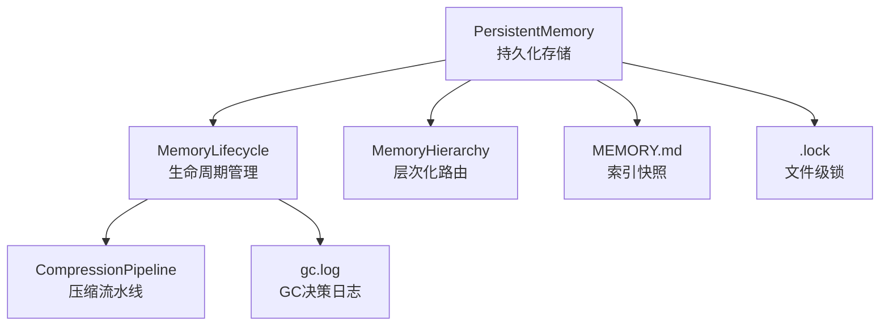
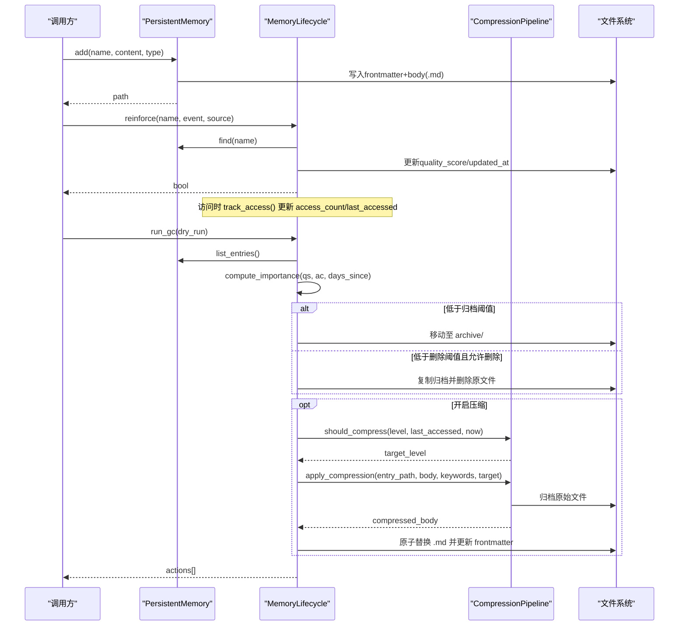
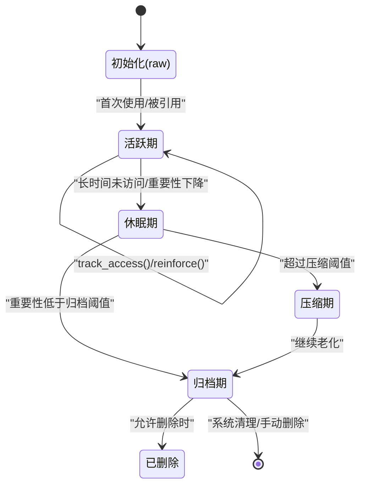
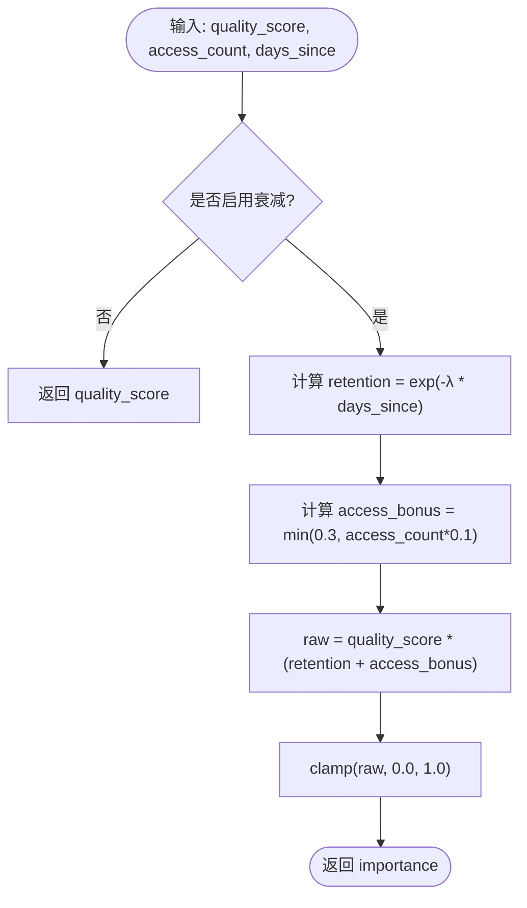
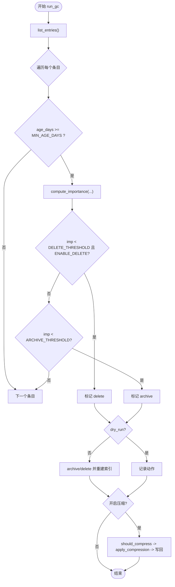
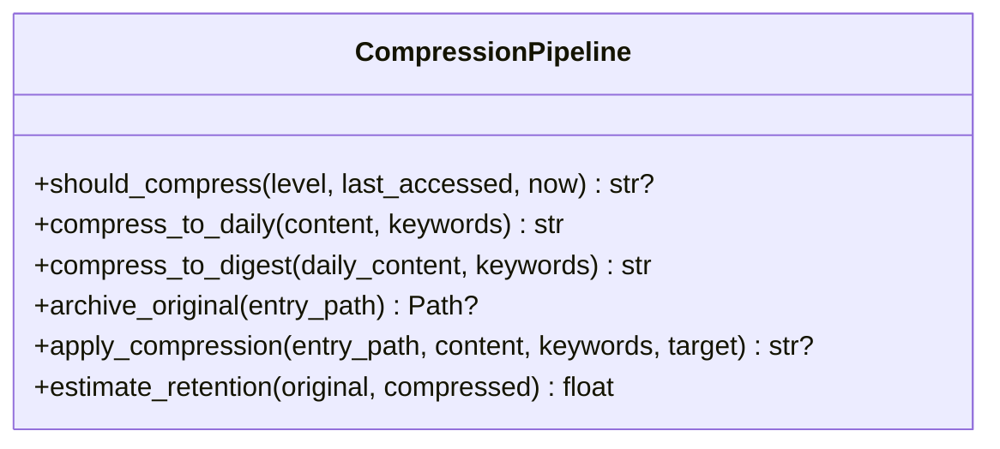
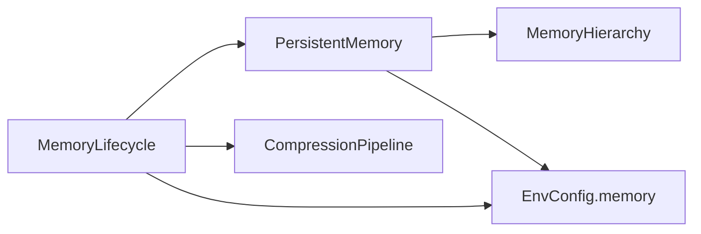

# 生命周期管理

<cite>
**本文引用的文件**
- [agent/src/memory/lifecycle.py](file://agent/src/memory/lifecycle.py)
- [agent/src/memory/persistent.py](file://agent/src/memory/persistent.py)
- [agent/src/memory/compression.py](file://agent/src/memory/compression.py)
- [agent/src/memory/hierarchy.py](file://agent/src/memory/hierarchy.py)
- [agent/src/config/env_schema.py](file://agent/src/config/env_schema.py)
- [agent/src/config/accessor.py](file://agent/src/config/accessor.py)
- [agent/tests/test_memory_lifecycle.py](file://agent/tests/test_memory_lifecycle.py)
- [agent/tests/memory/test_tier2_integration.py](file://agent/tests/memory/test_tier2_integration.py)
</cite>

## 目录
1. [简介](#简介)
2. [项目结构](#项目结构)
3. [核心组件](#核心组件)
4. [架构总览](#架构总览)
5. [详细组件分析](#详细组件分析)
6. [依赖关系分析](#依赖关系分析)
7. [性能与内存优化](#性能与内存优化)
8. [故障排查指南](#故障排查指南)
9. [结论](#结论)
10. [附录：配置、监控与调试](#附录配置监控与调试)

## 简介
本文件为 Vibe-Trading 记忆生命周期管理系统的权威文档，聚焦记忆项从创建到销毁的完整生命周期：初始化、活跃期、休眠期、归档期。内容涵盖状态转换触发条件、状态监控、资源回收机制、存储策略（含压缩级别）、访问频率调整、垃圾回收算法、性能指标、配置参数、监控告警与调试方法，并提供状态图与资源占用分析示例。

## 项目结构
记忆系统位于 agent/src/memory 下，围绕“持久化存储 + 生命周期管理 + 压缩流水线 + 层次化路由”组织：
- persistent.py：持久化存储、索引、去重、重要性计算、搜索、删除等基础能力
- lifecycle.py：质量评分、衰减、垃圾回收、访问追踪、GC日志
- compression.py：三级压缩（raw → daily → digest），基于 TF-IDF 的关键句/关键词提取
- hierarchy.py：按 memory_type 分目录的层次化路由与扫描优化
- config/env_schema.py：统一的内存功能开关与环境变量映射（VT_MEMORY_*）
- tests/*：覆盖生命周期、压缩、层级集成等场景

图表来源
- [agent/src/memory/persistent.py:196-637](file://agent/src/memory/persistent.py#L196-L637)
- [agent/src/memory/lifecycle.py:71-421](file://agent/src/memory/lifecycle.py#L71-L421)
- [agent/src/memory/compression.py:160-353](file://agent/src/memory/compression.py#L160-L353)
- [agent/src/memory/hierarchy.py:34-436](file://agent/src/memory/hierarchy.py#L34-L436)

章节来源
- [agent/src/memory/persistent.py:196-637](file://agent/src/memory/persistent.py#L196-L637)
- [agent/src/memory/lifecycle.py:71-421](file://agent/src/memory/lifecycle.py#L71-L421)
- [agent/src/memory/compression.py:160-353](file://agent/src/memory/compression.py#L160-L353)
- [agent/src/memory/hierarchy.py:34-436](file://agent/src/memory/hierarchy.py#L34-L436)

## 核心组件
- PersistentMemory：负责记忆项的增删改查、去重、索引重建、FTS 索引联动、语义链接联动、重要性计算、扫描与检索
- MemoryLifecycle：封装质量强化、访问计数、衰减、GC 调度、压缩触发、GC 日志
- CompressionPipeline：实现 raw/daily/digest 三级压缩，包含归档、关键句提取、摘要生成、保留率估算
- MemoryHierarchy：按类型分目录，支持 O(类别大小) 范围扫描与迁移恢复

章节来源
- [agent/src/memory/persistent.py:196-637](file://agent/src/memory/persistent.py#L196-L637)
- [agent/src/memory/lifecycle.py:71-421](file://agent/src/memory/lifecycle.py#L71-L421)
- [agent/src/memory/compression.py:160-353](file://agent/src/memory/compression.py#L160-L353)
- [agent/src/memory/hierarchy.py:34-436](file://agent/src/memory/hierarchy.py#L34-L436)

## 架构总览
记忆生命周期由“写入 → 活跃 → 衰减 → 压缩/归档 → 删除”构成，受环境开关控制，并通过文件锁保证并发安全。

图表来源
- [agent/src/memory/persistent.py:462-578](file://agent/src/memory/persistent.py#L462-L578)
- [agent/src/memory/lifecycle.py:112-178](file://agent/src/memory/lifecycle.py#L112-L178)
- [agent/src/memory/lifecycle.py:183-273](file://agent/src/memory/lifecycle.py#L183-L273)
- [agent/src/memory/compression.py:168-334](file://agent/src/memory/compression.py#L168-L334)

## 详细组件分析

### 记忆项生命周期状态与转换
- 初始化（raw）：add() 写入 frontmatter 与 body，设置 quality_score=0.5、access_count=0、compression_level="raw"
- 活跃期：track_access() 增加 access_count 与 last_accessed；reinforce() 根据事件调整 quality_score
- 休眠期：importance 随时间衰减（Ebbinghaus 公式），低重要性触发归档/压缩
- 归档期：run_gc() 将低重要性条目移至 archive/，或复制后删除（可配置）
- 压缩期：CompressionPipeline 在 GC 周期内对旧条目执行 daily/digest 压缩，降低体积

图表来源
- [agent/src/memory/persistent.py:80-92](file://agent/src/memory/persistent.py#L80-L92)
- [agent/src/memory/lifecycle.py:183-273](file://agent/src/memory/lifecycle.py#L183-L273)
- [agent/src/memory/compression.py:168-334](file://agent/src/memory/compression.py#L168-L334)

章节来源
- [agent/src/memory/persistent.py:80-92](file://agent/src/memory/persistent.py#L80-L92)
- [agent/src/memory/lifecycle.py:183-273](file://agent/src/memory/lifecycle.py#L183-L273)
- [agent/src/memory/compression.py:168-334](file://agent/src/memory/compression.py#L168-L334)

### 重要性计算与衰减
- 重要性 = quality_score × (retention + access_bonus)，其中 retention 按指数衰减，access_bonus 上限 0.3
- 可通过环境变量关闭衰减，此时 importance = quality_score

图表来源
- [agent/src/memory/persistent.py:80-92](file://agent/src/memory/persistent.py#L80-L92)

章节来源
- [agent/src/memory/persistent.py:80-92](file://agent/src/memory/persistent.py#L80-L92)

### 垃圾回收（GC）流程
- 扫描所有条目，计算 age_days 与 days_since_access
- 若 age < MIN_AGE_DAYS 则跳过
- 计算 importance，低于 DELETE_THRESHOLD 且 ENABLE_DELETE=True 则标记 delete，否则低于 ARCHIVE_THRESHOLD 标记 archive
- dry_run=False 时执行归档/删除，并重建索引
- 若开启压缩，进一步对旧条目执行压缩并写回

图表来源
- [agent/src/memory/lifecycle.py:183-273](file://agent/src/memory/lifecycle.py#L183-L273)
- [agent/src/memory/compression.py:168-334](file://agent/src/memory/compression.py#L168-L334)

章节来源
- [agent/src/memory/lifecycle.py:183-273](file://agent/src/memory/lifecycle.py#L183-L273)

### 压缩流水线（Tier 2）
- 三级：raw → daily → digest
- 触发条件：距离上次访问时间超过阈值（daily: 7天，digest: 30天）
- daily：TF-IDF 关键句提取（保留首尾句 + top-k）
- digest：词频×IDF 得分，输出要点列表
- 归档：压缩前备份原始文件，失败则中止以避免数据丢失
- 写回：原子替换文件并更新 frontmatter 中的 compression_level 与 updated_at

图表来源
- [agent/src/memory/compression.py:160-353](file://agent/src/memory/compression.py#L160-L353)

章节来源
- [agent/src/memory/compression.py:160-353](file://agent/src/memory/compression.py#L160-L353)

### 层次化路由与扫描优化
- 按 memory_type 分目录（user/feedback/project/reference），提升扫描效率
- 支持无后缀条目恢复、迁移、按类别扫描与优先级排序
- 与 PersistentMemory 集成，扫描时优先按类别缩小范围

章节来源
- [agent/src/memory/hierarchy.py:34-436](file://agent/src/memory/hierarchy.py#L34-L436)
- [agent/src/memory/persistent.py:222-307](file://agent/src/memory/persistent.py#L222-L307)

### 质量强化与访问追踪
- reinforce(event, source)：根据事件类型调整 quality_score，系统源折扣 0.7x，会话内累计增量有上限
- track_access(entry)：每次读取/召回时增加 access_count 与 last_accessed

章节来源
- [agent/src/memory/lifecycle.py:112-178](file://agent/src/memory/lifecycle.py#L112-L178)

## 依赖关系分析
- MemoryLifecycle 依赖 PersistentMemory 进行读写与索引重建
- CompressionPipeline 在 GC 中按需调用，负责压缩与归档
- MemoryHierarchy 影响扫描路径与性能
- 配置通过 EnvConfig/MemoryConfig 集中管理，支持预设（off/on/full）与单开关覆盖

图表来源
- [agent/src/memory/lifecycle.py:71-421](file://agent/src/memory/lifecycle.py#L71-L421)
- [agent/src/memory/persistent.py:196-637](file://agent/src/memory/persistent.py#L196-L637)
- [agent/src/config/env_schema.py:461-537](file://agent/src/config/env_schema.py#L461-L537)

章节来源
- [agent/src/config/env_schema.py:461-537](file://agent/src/config/env_schema.py#L461-L537)

## 性能与内存优化
- 文件级锁：memory_lock 避免并发写入冲突，超时保护
- 去重：滑动窗口（默认 30 秒）防止重复写入
- 索引快照：MEMORY.md 限制行数，减少启动开销
- 层次化扫描：按类别缩小扫描范围，O(类别大小)
- 压缩：daily/digest 显著减小体积，降低 I/O 与解析成本
- 重要性加权：结合质量、访问次数与衰减，提高检索相关性
- 原子写：临时文件 + os.replace 确保一致性

章节来源
- [agent/src/memory/persistent.py:21-33](file://agent/src/memory/persistent.py#L21-L33)
- [agent/src/memory/persistent.py:41-73](file://agent/src/memory/persistent.py#L41-L73)
- [agent/src/memory/persistent.py:207-216](file://agent/src/memory/persistent.py#L207-L216)
- [agent/src/memory/hierarchy.py:145-176](file://agent/src/memory/hierarchy.py#L145-L176)
- [agent/src/memory/compression.py:258-334](file://agent/src/memory/compression.py#L258-L334)
- [agent/src/memory/lifecycle.py:323-379](file://agent/src/memory/lifecycle.py#L323-L379)

## 故障排查指南
- 质量/衰减/GC 未生效：检查 VT_MEMORY_QUALITY / VT_MEMORY_DECAY / VT_MEMORY_GC 是否开启
- 压缩未触发：确认 VT_MEMORY_COMPRESSION 与 VT_MEMORY_GC 同时开启；检查 last_accessed 与阈值
- 归档失败：查看 gc.log 与 archive 目录权限；确认磁盘空间
- 并发写入冲突：观察 memory_lock 超时日志；减少并行写入或增大超时
- 历史条目不可见：检查是否缺少 .md 后缀；hierarchy.recover_extensionless_entries 会尝试修复
- 搜索为空：若启用 FTS，首次空搜索会自动重建；检查 search_index 相关错误日志

章节来源
- [agent/src/memory/lifecycle.py:192-202](file://agent/src/memory/lifecycle.py#L192-L202)
- [agent/src/memory/lifecycle.py:300-318](file://agent/src/memory/lifecycle.py#L300-L318)
- [agent/src/memory/hierarchy.py:92-143](file://agent/src/memory/hierarchy.py#L92-L143)
- [agent/src/memory/persistent.py:358-394](file://agent/src/memory/persistent.py#L358-L394)

## 结论
Vibe-Trading 的记忆生命周期管理系统以“质量评分 + 衰减 + 垃圾回收 + 压缩”为核心，配合层次化路由与原子写、文件锁、去重等机制，实现了高可靠、可扩展、低维护成本的长期记忆管理。通过统一的环境配置与测试覆盖，可在不同部署环境下灵活启用功能，保障性能与稳定性。

## 附录：配置、监控与调试

### 生命周期配置参数
- 预设模式：VT_MEMORY=off|on|full
  - off：全部关闭
  - on：启用质量、衰减、GC（Tier 1）
  - full：启用 Tier 1 + 层次化、语义链接、压缩、FTS（Tier 2）
- 单开关：
  - VT_MEMORY_QUALITY：质量评分与强化
  - VT_MEMORY_GC：垃圾回收
  - VT_MEMORY_DECAY：重要性衰减
  - VT_MEMORY_HIERARCHY：层次化路由
  - VT_MEMORY_LINKS：语义链接
  - VT_MEMORY_COMPRESSION：自动压缩
  - VT_MEMORY_FTS_INDEX：全文检索索引

章节来源
- [agent/src/config/env_schema.py:411-537](file://agent/src/config/env_schema.py#L411-L537)

### 监控与告警
- GC 决策日志：memory_dir/gc.log，记录动作、重要性、原因与模式（dry_run/execute）
- 压缩保留率：CompressionPipeline.estimate_retention 用于评估信息保留度
- 访问统计：access_count 与 last_accessed 反映热度与时效性
- 索引快照：MEMORY.md 提供快速概览

章节来源
- [agent/src/memory/lifecycle.py:300-318](file://agent/src/memory/lifecycle.py#L300-L318)
- [agent/src/memory/compression.py:336-353](file://agent/src/memory/compression.py#L336-L353)
- [agent/src/memory/persistent.py:207-216](file://agent/src/memory/persistent.py#L207-L216)

### 调试工具与方法
- 单元测试：test_memory_lifecycle.py 覆盖质量、衰减、强化、锁等
- 集成测试：test_tier2_integration.py 验证压缩与层级行为
- 重置配置：reset_env_config() 使环境变量变更生效
- 锁定诊断：检查 .lock 文件是否存在与释放情况

章节来源
- [agent/tests/test_memory_lifecycle.py:1-348](file://agent/tests/test_memory_lifecycle.py#L1-L348)
- [agent/tests/memory/test_tier2_integration.py:215-295](file://agent/tests/memory/test_tier2_integration.py#L215-L295)
- [agent/src/config/accessor.py:79-93](file://agent/src/config/accessor.py#L79-L93)