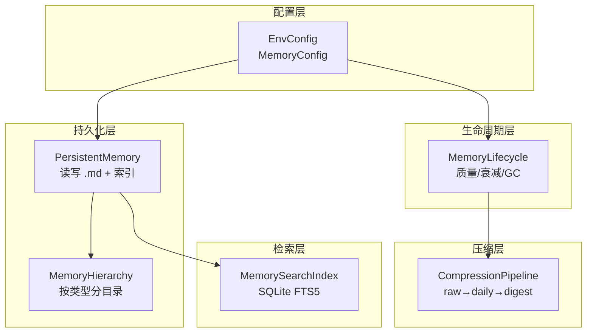
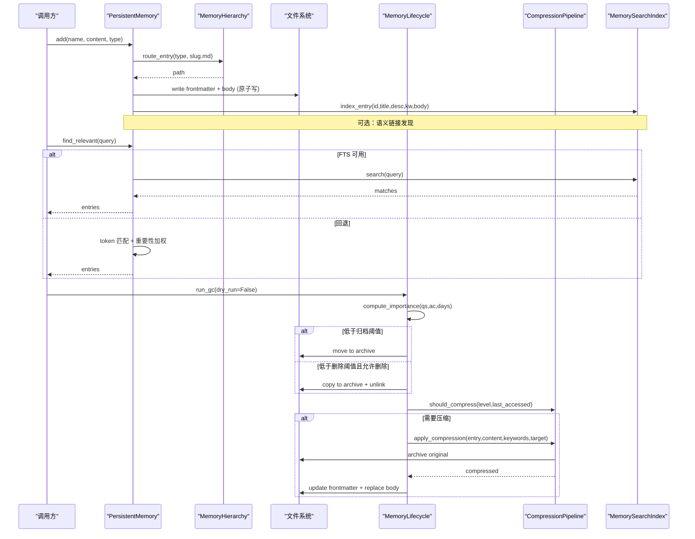
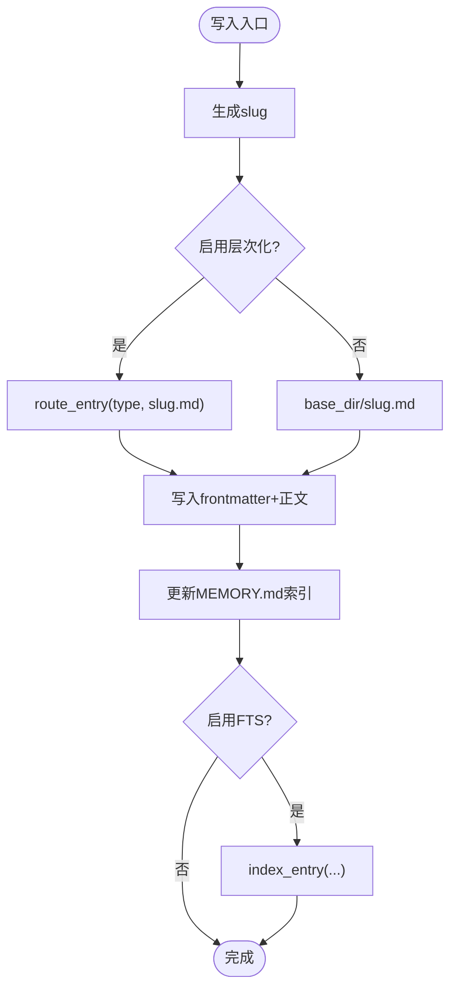
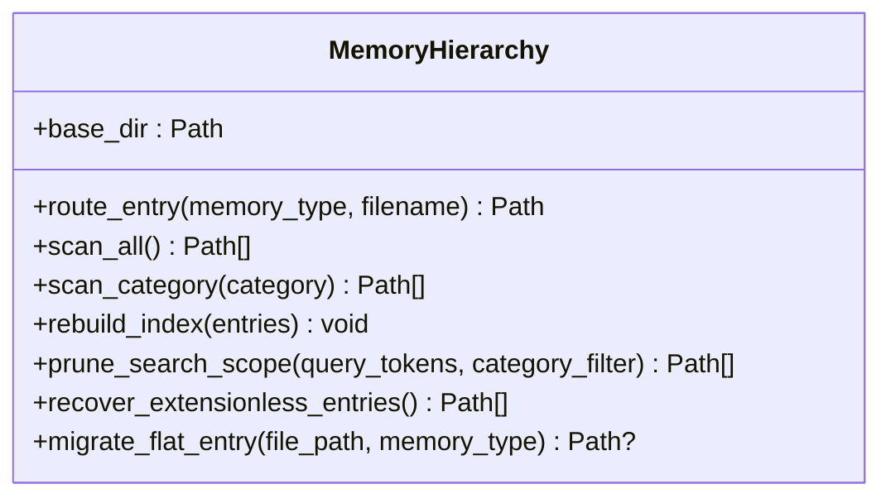
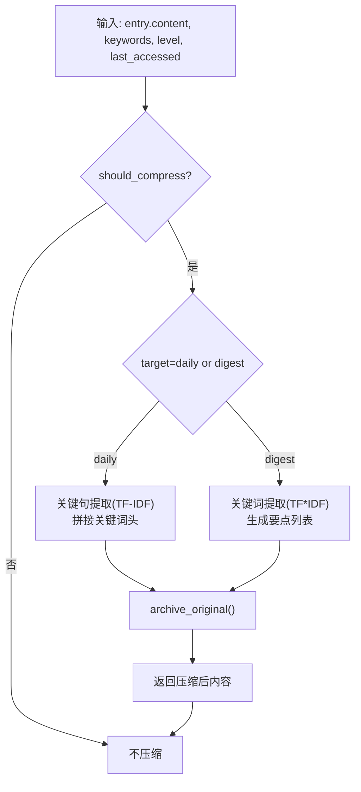
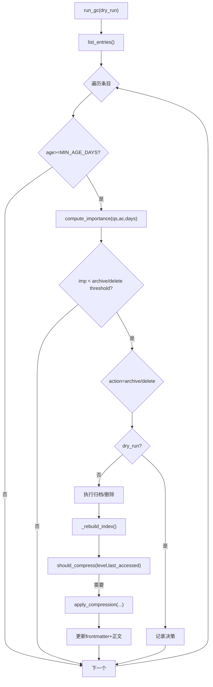
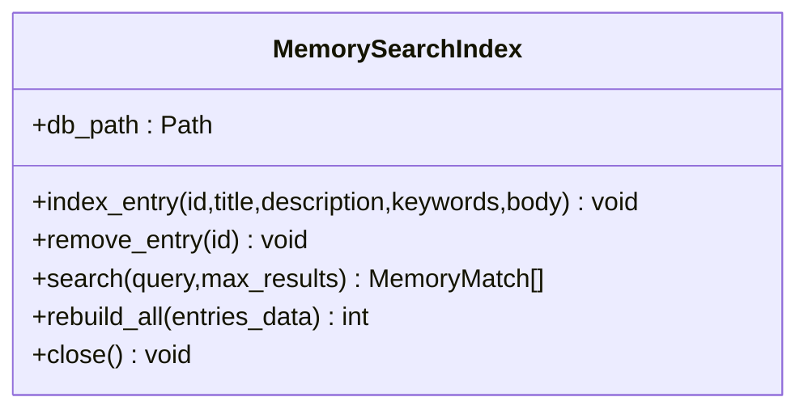
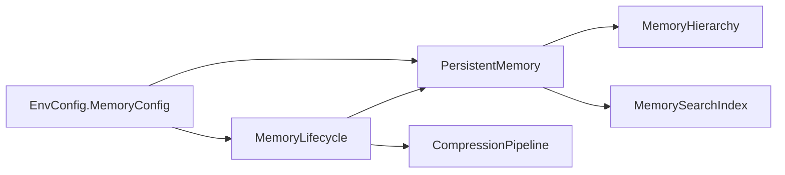

# 缓存系统架构

<cite>
**本文引用的文件**
- [agent/src/memory/persistent.py](file://agent/src/memory/persistent.py)
- [agent/src/memory/compression.py](file://agent/src/memory/compression.py)
- [agent/src/memory/hierarchy.py](file://agent/src/memory/hierarchy.py)
- [agent/src/memory/lifecycle.py](file://agent/src/memory/lifecycle.py)
- [agent/src/memory/search_index.py](file://agent/src/memory/search_index.py)
- [agent/src/config/env_schema.py](file://agent/src/config/env_schema.py)
- [agent/src/config/accessor.py](file://agent/src/config/accessor.py)
</cite>

## 目录
1. [简介](#简介)
2. [项目结构](#项目结构)
3. [核心组件](#核心组件)
4. [架构总览](#架构总览)
5. [详细组件分析](#详细组件分析)
6. [依赖关系分析](#依赖关系分析)
7. [性能考量](#性能考量)
8. [故障排查指南](#故障排查指南)
9. [结论](#结论)
10. [附录：配置与调优](#附录：配置与调优)

## 简介
本文件为 Vibe-Trading 缓存系统的综合架构文档，聚焦多级缓存策略、压缩算法、层次化存储设计、生命周期管理、持久化机制与内存优化。同时覆盖配置选项、失效策略、性能监控、大数据量优化与故障恢复，并提供架构图与数据处理流程图，以及调优指南和常见问题解决方案。

## 项目结构
Vibe-Trading 的“缓存/记忆”子系统位于 agent/src/memory，围绕持久化、压缩、层次化路由、生命周期管理与全文检索展开；配置集中在 agent/src/config。

图表来源
- [agent/src/config/env_schema.py:461-537](file://agent/src/config/env_schema.py#L461-L537)
- [agent/src/memory/persistent.py:196-311](file://agent/src/memory/persistent.py#L196-L311)
- [agent/src/memory/hierarchy.py:34-90](file://agent/src/memory/hierarchy.py#L34-L90)
- [agent/src/memory/lifecycle.py:71-106](file://agent/src/memory/lifecycle.py#L71-L106)
- [agent/src/memory/compression.py:160-193](file://agent/src/memory/compression.py#L160-L193)
- [agent/src/memory/search_index.py:113-145](file://agent/src/memory/search_index.py#L113-L145)

章节来源
- [agent/src/memory/persistent.py:196-311](file://agent/src/memory/persistent.py#L196-L311)
- [agent/src/config/env_schema.py:461-537](file://agent/src/config/env_schema.py#L461-L537)

## 核心组件
- PersistentMemory：基于文件的跨会话持久化存储，负责条目增删改查、去重、索引维护、搜索（含 FTS5 回退）。
- MemoryHierarchy：按 memory_type 将条目路由到 category 子目录，支持 O(类别规模) 范围扫描与迁移。
- CompressionPipeline：三级压缩管线（raw → daily → digest），使用 TF-IDF 关键句提取与关键词摘要，并归档原始内容。
- MemoryLifecycle：质量评分、访问追踪、重要性衰减、垃圾回收（归档/删除）与压缩触发。
- MemorySearchIndex：SQLite FTS5 全文检索索引，提供 O(log n) 查询与自动重建。
- EnvConfig/MemoryConfig：集中式环境变量配置，提供 VT_MEMORY 预设与细粒度开关。

章节来源
- [agent/src/memory/persistent.py:196-311](file://agent/src/memory/persistent.py#L196-L311)
- [agent/src/memory/hierarchy.py:34-90](file://agent/src/memory/hierarchy.py#L34-L90)
- [agent/src/memory/compression.py:160-193](file://agent/src/memory/compression.py#L160-L193)
- [agent/src/memory/lifecycle.py:71-106](file://agent/src/memory/lifecycle.py#L71-L106)
- [agent/src/memory/search_index.py:113-145](file://agent/src/memory/search_index.py#L113-L145)
- [agent/src/config/env_schema.py:461-537](file://agent/src/config/env_schema.py#L461-L537)

## 架构总览
下图展示写入与读取的主流程，包括层次化路由、压缩、GC、FTS 索引与锁保护。

图表来源
- [agent/src/memory/persistent.py:462-578](file://agent/src/memory/persistent.py#L462-L578)
- [agent/src/memory/persistent.py:358-438](file://agent/src/memory/persistent.py#L358-L438)
- [agent/src/memory/hierarchy.py:70-90](file://agent/src/memory/hierarchy.py#L70-L90)
- [agent/src/memory/lifecycle.py:183-273](file://agent/src/memory/lifecycle.py#L183-L273)
- [agent/src/memory/compression.py:292-334](file://agent/src/memory/compression.py#L292-L334)
- [agent/src/memory/search_index.py:207-250](file://agent/src/memory/search_index.py#L207-L250)

## 详细组件分析

### 持久化层：PersistentMemory
- 数据模型：MemoryEntry 包含标题、描述、类型、正文、时间戳、关键词、质量分、访问计数、最后访问时间、重要性、关联条目、分类、压缩级别等。
- 写入路径：生成 slug，根据是否启用层次化路由决定目标路径；写入 frontmatter + 正文；更新 MEMORY.md 索引；可选写入 FTS 索引与语义链接。
- 读取路径：支持精确查找与相关度搜索；优先走 FTS5，失败回退到 token 匹配并按重要性加权排序；可扩展关联条目。
- 去重：30 秒滑动窗口内基于 name/description/content 哈希去重，避免并发重试导致的重复写入。
- 锁机制：跨平台文件级独占锁（Windows 跳过），超时保护。

图表来源
- [agent/src/memory/persistent.py:462-578](file://agent/src/memory/persistent.py#L462-L578)
- [agent/src/memory/persistent.py:196-206](file://agent/src/memory/persistent.py#L196-L206)

章节来源
- [agent/src/memory/persistent.py:122-143](file://agent/src/memory/persistent.py#L122-L143)
- [agent/src/memory/persistent.py:440-453](file://agent/src/memory/persistent.py#L440-L453)
- [agent/src/memory/persistent.py:358-438](file://agent/src/memory/persistent.py#L358-L438)

### 层次化存储：MemoryHierarchy
- 路由规则：按 memory_type 路由到 user/feedback/project/reference 子目录；未知类型回退至根目录。
- 扫描优化：scan_all 与 scan_category 仅扫描 .md 文件，跳过控制文件与 archive 目录；支持修复无后缀孤儿条目。
- 索引重建：生成 .hierarchy.yaml，记录每类条目数与关键词，用于后续搜索优先级排序。
- 迁移工具：migrate_flat_entry 将扁平存储条目迁移到对应类别目录。

图表来源
- [agent/src/memory/hierarchy.py:34-90](file://agent/src/memory/hierarchy.py#L34-L90)
- [agent/src/memory/hierarchy.py:145-176](file://agent/src/memory/hierarchy.py#L145-L176)
- [agent/src/memory/hierarchy.py:200-261](file://agent/src/memory/hierarchy.py#L200-L261)
- [agent/src/memory/hierarchy.py:313-379](file://agent/src/memory/hierarchy.py#L313-L379)
- [agent/src/memory/hierarchy.py:381-436](file://agent/src/memory/hierarchy.py#L381-L436)

章节来源
- [agent/src/memory/hierarchy.py:34-90](file://agent/src/memory/hierarchy.py#L34-L90)
- [agent/src/memory/hierarchy.py:145-176](file://agent/src/memory/hierarchy.py#L145-L176)
- [agent/src/memory/hierarchy.py:200-261](file://agent/src/memory/hierarchy.py#L200-L261)
- [agent/src/memory/hierarchy.py:313-379](file://agent/src/memory/hierarchy.py#L313-L379)
- [agent/src/memory/hierarchy.py:381-436](file://agent/src/memory/hierarchy.py#L381-L436)

### 压缩管线：CompressionPipeline
- 三级压缩：
  - raw：原始内容。
  - daily：保留首尾句与 Top-K 关键句（TF-IDF 打分），体积约降至 50%。
  - digest：提取 Top-N 关键词并以要点形式输出，体积约降至 10-20%。
- 触发条件：基于 last_accessed 与阈值（7 天→daily，30 天→digest）。
- 安全归档：压缩前原子复制原始文件到 archive/，失败则中止以避免数据丢失。
- 信息保留估算：通过 Jaccard 词集重叠率评估压缩前后信息保留度。

图表来源
- [agent/src/memory/compression.py:160-193](file://agent/src/memory/compression.py#L160-L193)
- [agent/src/memory/compression.py:194-256](file://agent/src/memory/compression.py#L194-L256)
- [agent/src/memory/compression.py:258-334](file://agent/src/memory/compression.py#L258-L334)
- [agent/src/memory/compression.py:336-353](file://agent/src/memory/compression.py#L336-L353)

章节来源
- [agent/src/memory/compression.py:160-193](file://agent/src/memory/compression.py#L160-L193)
- [agent/src/memory/compression.py:194-256](file://agent/src/memory/compression.py#L194-L256)
- [agent/src/memory/compression.py:258-334](file://agent/src/memory/compression.py#L258-L334)
- [agent/src/memory/compression.py:336-353](file://agent/src/memory/compression.py#L336-L353)

### 生命周期管理：MemoryLifecycle
- 质量强化：基于事件（任务成功/失败、用户确认/拒绝、被动衰减）调整 quality_score，带会话上限防止抖动。
- 访问追踪：每次命中更新 access_count 与 last_accessed。
- 重要性衰减：结合 Ebbinghaus 遗忘曲线与访问奖励计算 importance。
- 垃圾回收：对满足最小年龄的条目依据重要性阈值进行归档或删除（默认仅归档），并记录 gc.log。
- 压缩联动：在 GC 周期中检查是否需要压缩，并将结果写回 frontmatter 与正文。

图表来源
- [agent/src/memory/lifecycle.py:183-273](file://agent/src/memory/lifecycle.py#L183-L273)
- [agent/src/memory/lifecycle.py:275-318](file://agent/src/memory/lifecycle.py#L275-L318)
- [agent/src/memory/lifecycle.py:323-421](file://agent/src/memory/lifecycle.py#L323-L421)
- [agent/src/memory/persistent.py:80-91](file://agent/src/memory/persistent.py#L80-L91)

章节来源
- [agent/src/memory/lifecycle.py:71-106](file://agent/src/memory/lifecycle.py#L71-L106)
- [agent/src/memory/lifecycle.py:112-178](file://agent/src/memory/lifecycle.py#L112-L178)
- [agent/src/memory/lifecycle.py:183-273](file://agent/src/memory/lifecycle.py#L183-L273)
- [agent/src/memory/persistent.py:80-91](file://agent/src/memory/persistent.py#L80-L91)

### 全文检索：MemorySearchIndex
- 索引结构：memories 表 + memories_fts 虚拟表（FTS5），通过触发器保持同步。
- 中文优化：CJK 字符展开为 unigram + bigram，提升短语匹配能力；查询时做安全过滤与去重。
- 自动重建：首次空查询且磁盘存在条目时，自动全量重建索引。
- 降级策略：若 FTS5 不可用，search 返回空，上层回退到 token 匹配。

图表来源
- [agent/src/memory/search_index.py:113-145](file://agent/src/memory/search_index.py#L113-L145)
- [agent/src/memory/search_index.py:207-250](file://agent/src/memory/search_index.py#L207-L250)
- [agent/src/memory/search_index.py:252-302](file://agent/src/memory/search_index.py#L252-L302)
- [agent/src/memory/search_index.py:304-355](file://agent/src/memory/search_index.py#L304-L355)
- [agent/src/memory/search_index.py:357-445](file://agent/src/memory/search_index.py#L357-L445)

章节来源
- [agent/src/memory/search_index.py:113-145](file://agent/src/memory/search_index.py#L113-L145)
- [agent/src/memory/search_index.py:207-250](file://agent/src/memory/search_index.py#L207-L250)
- [agent/src/memory/search_index.py:252-302](file://agent/src/memory/search_index.py#L252-L302)
- [agent/src/memory/search_index.py:304-355](file://agent/src/memory/search_index.py#L304-L355)
- [agent/src/memory/search_index.py:357-445](file://agent/src/memory/search_index.py#L357-L445)

## 依赖关系分析
- 配置驱动：所有功能开关由 EnvConfig.MemoryConfig 统一管控，支持 VT_MEMORY 预设（off/on/full）与细粒度覆盖。
- 模块耦合：
  - lifecycle 依赖 persistent 提供的 MemoryEntry 与持久化能力。
  - compression 被 lifecycle 在 GC 阶段按需调用。
  - hierarchy 被 persistent 在写入与扫描时选择使用。
  - search_index 被 persistent 在写入与搜索时调用，具备独立连接与线程锁。
- 外部依赖：SQLite（FTS5）、fcntl（Linux 文件锁）。

图表来源
- [agent/src/config/env_schema.py:461-537](file://agent/src/config/env_schema.py#L461-L537)
- [agent/src/memory/persistent.py:196-311](file://agent/src/memory/persistent.py#L196-L311)
- [agent/src/memory/lifecycle.py:71-106](file://agent/src/memory/lifecycle.py#L71-L106)

章节来源
- [agent/src/config/env_schema.py:461-537](file://agent/src/config/env_schema.py#L461-L537)
- [agent/src/memory/persistent.py:196-311](file://agent/src/memory/persistent.py#L196-L311)
- [agent/src/memory/lifecycle.py:71-106](file://agent/src/memory/lifecycle.py#L71-L106)

## 性能考量
- 搜索性能：
  - 启用 FTS5 后，搜索复杂度从 O(n) 降为近似 O(log n)，适合大规模条目。
  - 中文文本通过 unigram+bigram 展开提升召回，但会增加索引体积；可通过限制 body 长度（50k 字符）控制。
- 写入性能：
  - 原子写（临时文件 + rename）减少损坏风险；文件锁避免并发冲突。
  - 层次化目录将扫描范围缩小到类别子集，降低 I/O。
- 压缩收益：
  - daily 压缩约 50%，digest 约 10-20%，显著降低存储与传输成本。
  - 压缩前归档确保可回溯。
- 内存占用：
  - 去重窗口固定 30 秒，定期清理过期哈希，避免无限增长。
  - 索引快照限制行数（MAX_INDEX_LINES），控制 prompt 注入大小。
- 并发与健壮性：
  - 单写者模型 + 超时锁，避免死锁与长时间阻塞。
  - FTS5 不可用时优雅降级，不影响主流程。

[本节为通用性能讨论，无需特定文件引用]

## 故障排查指南
- 搜索结果为空：
  - 检查是否启用 FTS5；若不可用，会回退到 token 匹配。
  - 首次空查询可能触发自动重建；若仍为空，检查磁盘是否存在条目。
  - 参考：[agent/src/memory/search_index.py:252-302](file://agent/src/memory/search_index.py#L252-L302)、[agent/src/memory/persistent.py:358-438](file://agent/src/memory/persistent.py#L358-L438)
- 写入重复：
  - 30 秒去重窗口会拦截快速重试；如需强制写入，请延迟或改变内容。
  - 参考：[agent/src/memory/persistent.py:440-453](file://agent/src/memory/persistent.py#L440-L453)
- 压缩未生效：
  - 需启用压缩开关并在 GC 周期运行；dry_run 不会实际修改文件。
  - 参考：[agent/src/memory/lifecycle.py:183-273](file://agent/src/memory/lifecycle.py#L183-L273)、[agent/src/memory/compression.py:160-193](file://agent/src/memory/compression.py#L160-L193)
- 归档/删除失败：
  - 检查权限与磁盘空间；查看 gc.log 中的动作记录。
  - 参考：[agent/src/memory/lifecycle.py:275-318](file://agent/src/memory/lifecycle.py#L275-L318)
- 层次化目录异常：
  - 无后缀条目会被 recover_extensionless_entries 修复；迁移失败会记录警告。
  - 参考：[agent/src/memory/hierarchy.py:92-143](file://agent/src/memory/hierarchy.py#L92-L143)、[agent/src/memory/hierarchy.py:381-436](file://agent/src/memory/hierarchy.py#L381-L436)

章节来源
- [agent/src/memory/search_index.py:252-302](file://agent/src/memory/search_index.py#L252-L302)
- [agent/src/memory/persistent.py:358-438](file://agent/src/memory/persistent.py#L358-L438)
- [agent/src/memory/persistent.py:440-453](file://agent/src/memory/persistent.py#L440-L453)
- [agent/src/memory/lifecycle.py:183-273](file://agent/src/memory/lifecycle.py#L183-L273)
- [agent/src/memory/compression.py:160-193](file://agent/src/memory/compression.py#L160-L193)
- [agent/src/memory/lifecycle.py:275-318](file://agent/src/memory/lifecycle.py#L275-L318)
- [agent/src/memory/hierarchy.py:92-143](file://agent/src/memory/hierarchy.py#L92-L143)
- [agent/src/memory/hierarchy.py:381-436](file://agent/src/memory/hierarchy.py#L381-L436)

## 结论
Vibe-Trading 缓存系统以“持久化 + 层次化 + 压缩 + 生命周期 + 全文检索”为核心，形成高可用、可扩展、低成本的记忆存储方案。通过配置开关灵活组合 Tier 1（质量/衰减/GC）与 Tier 2（层次化/链接/压缩/FTS），既能满足小规模场景的轻量需求，也能支撑大数据量下的高吞吐与低延迟。配合原子写、文件锁、归档与自动重建等机制，系统在稳定性与可恢复性方面表现稳健。

[本节为总结性内容，无需特定文件引用]

## 附录：配置与调优

### 配置选项与环境变量
- 预设开关：VT_MEMORY=off|on|full
  - off：全部关闭
  - on：Tier 1（quality/gc/decay）
  - full：Tier 1 + Tier 2（hierarchy/links/compression/fts）
- 细粒度开关：
  - VT_MEMORY_QUALITY：质量评分与强化
  - VT_MEMORY_GC：垃圾回收
  - VT_MEMORY_DECAY：重要性衰减
  - VT_MEMORY_HIERARCHY：层次化目录路由
  - VT_MEMORY_LINKS：BM25 语义链接
  - VT_MEMORY_COMPRESSION：自动压缩管线
  - VT_MEMORY_FTS_INDEX：SQLite FTS5 全文检索

章节来源
- [agent/src/config/env_schema.py:461-537](file://agent/src/config/env_schema.py#L461-L537)

### 失效策略与生命周期
- 重要性衰减：Ebbinghaus 遗忘曲线 + 访问奖励，影响搜索权重与 GC 决策。
- 垃圾回收：基于重要性阈值进行归档/删除，默认仅归档；支持 dry_run 审计。
- 压缩触发：按 last_accessed 与阈值（7/30 天）推进 raw→daily→digest。

章节来源
- [agent/src/memory/persistent.py:80-91](file://agent/src/memory/persistent.py#L80-L91)
- [agent/src/memory/lifecycle.py:183-273](file://agent/src/memory/lifecycle.py#L183-L273)
- [agent/src/memory/compression.py:160-193](file://agent/src/memory/compression.py#L160-L193)

### 大数据量优化建议
- 启用 FTS5 与层次化目录，显著提升搜索与扫描效率。
- 合理设置 GC 阈值与压缩策略，控制存储膨胀。
- 限制正文长度与索引快照行数，降低内存与提示注入开销。
- 使用批量重建索引（rebuild_all）在导入后一次性构建 FTS。

章节来源
- [agent/src/memory/search_index.py:304-355](file://agent/src/memory/search_index.py#L304-L355)
- [agent/src/memory/persistent.py:207-216](file://agent/src/memory/persistent.py#L207-L216)

### 常见问题与解决
- 中文检索不准：确认已启用 FTS5；检查 CJK 展开逻辑与查询清洗。
- 压缩后内容失真：关注 retention 指标；必要时调整 daily/digest 参数。
- 并发写入冲突：检查文件锁是否超时；避免高频并发写入同一目录。
- 归档/删除误操作：先使用 dry_run 验证，再执行真实操作。

章节来源
- [agent/src/memory/search_index.py:357-445](file://agent/src/memory/search_index.py#L357-L445)
- [agent/src/memory/compression.py:336-353](file://agent/src/memory/compression.py#L336-L353)
- [agent/src/memory/persistent.py:41-73](file://agent/src/memory/persistent.py#L41-L73)
- [agent/src/memory/lifecycle.py:183-273](file://agent/src/memory/lifecycle.py#L183-L273)