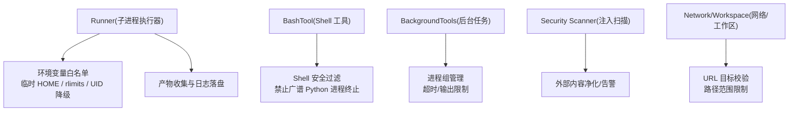
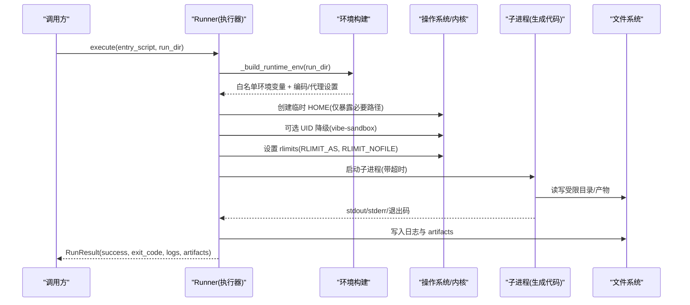
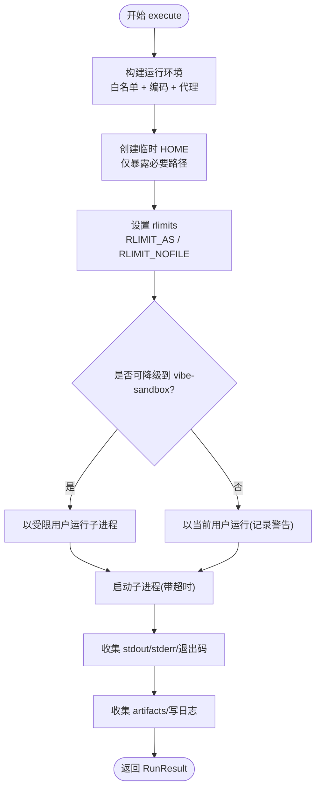
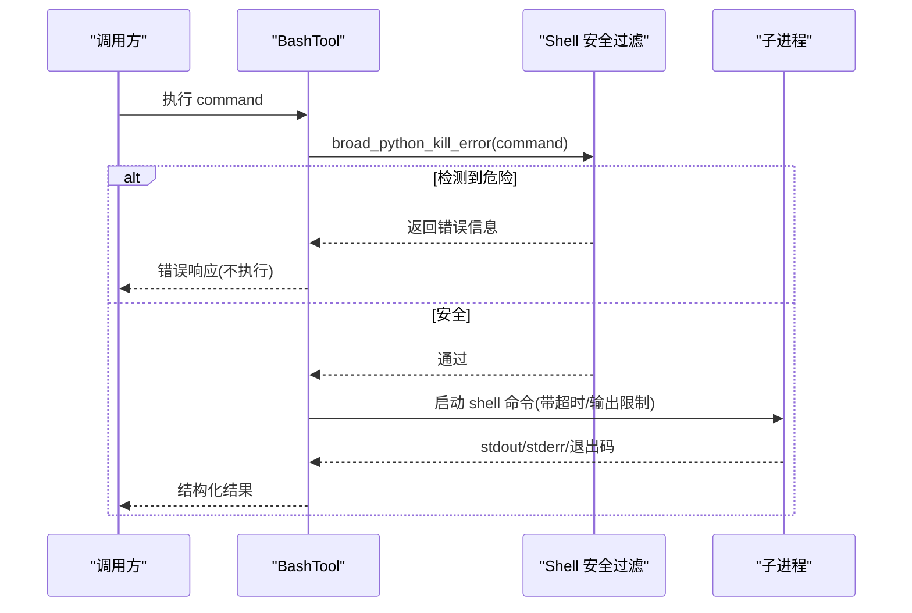
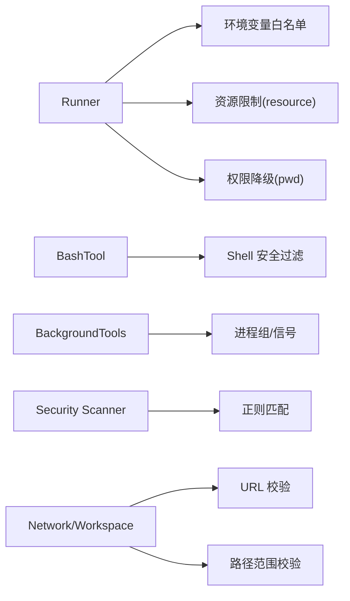

# 代码执行沙箱

<cite>
**本文引用的文件**
- [agent/src/core/runner.py](file://agent/src/core/runner.py)
- [agent/src/tools/bash_tool.py](file://agent/src/tools/bash_tool.py)
- [agent/src/tools/background_tools.py](file://agent/src/tools/background_tools.py)
- [agent/src/security/_shell_safety.py](file://agent/src/tools/_shell_safety.py)
- [agent/src/config/limits.py](file://agent/src/config/limits.py)
- [agent/src/security/scanner.py](file://agent/src/security/scanner.py)
- [agent/src/security/network.py](file://agent/src/security/network.py)
- [agent/src/security/workspace_policy.py](file://agent/src/security/workspace_policy.py)
- [agent/src/security/workspace_access.py](file://agent/src/security/workspace_access.py)
- [agent/tests/test_runner_env.py](file://agent/tests/test_runner_env.py)
- [agent/tests/test_tool_timeout.py](file://agent/tests/test_tool_timeout.py)
- [README_zh.md](file://README_zh.md)
</cite>

## 目录
1. [简介](#简介)
2. [项目结构](#项目结构)
3. [核心组件](#核心组件)
4. [架构总览](#架构总览)
5. [详细组件分析](#详细组件分析)
6. [依赖关系分析](#依赖关系分析)
7. [性能与资源限制](#性能与资源限制)
8. [故障排除指南](#故障排除指南)
9. [结论](#结论)
10. [附录：配置与安全策略清单](#附录配置与安全策略清单)

## 简介
本文件面向 Vibe-Trading 的代码执行沙箱，系统性说明其隔离机制、资源限制与执行环境安全。重点覆盖进程隔离、内存与文件访问控制、Shell 命令安全过滤、危险操作拦截、网络请求限制、执行监控、异常捕获与超时处理，并提供沙箱配置选项、安全策略定制与性能优化建议，以及常见场景的安全防护与排障方法。

## 项目结构
围绕“可执行代码”的隔离与约束，关键模块分布如下：
- 子进程执行器与运行时环境构建：agent/src/core/runner.py
- Shell 工具与后台任务执行：agent/src/tools/bash_tool.py、agent/src/tools/background_tools.py
- Shell 安全过滤（防杀进程等）：agent/src/tools/_shell_safety.py
- 结果大小限制与截断：agent/src/config/limits.py
- 外部内容注入扫描与净化：agent/src/security/scanner.py
- 网络目标校验桥接：agent/src/security/network.py
- 工作区路径策略与访问控制：agent/src/security/workspace_policy.py、agent/src/security/workspace_access.py
- 行为验证测试：agent/tests/test_runner_env.py、agent/tests/test_tool_timeout.py
- 默认安全策略与启用开关说明：README_zh.md

图表来源
- [agent/src/core/runner.py:33-110](file://agent/src/core/runner.py#L33-L110)
- [agent/src/core/runner.py:175-278](file://agent/src/core/runner.py#L175-L278)
- [agent/src/core/runner.py:480-620](file://agent/src/core/runner.py#L480-L620)
- [agent/src/tools/bash_tool.py:1-52](file://agent/src/tools/bash_tool.py#L1-L52)
- [agent/src/tools/background_tools.py:1-46](file://agent/src/tools/background_tools.py#L1-L46)
- [agent/src/tools/_shell_safety.py:1-60](file://agent/src/tools/_shell_safety.py#L1-L60)
- [agent/src/config/limits.py:1-49](file://agent/src/config/limits.py#L1-L49)
- [agent/src/security/scanner.py:1-220](file://agent/src/security/scanner.py#L1-L220)
- [agent/src/security/network.py:1-11](file://agent/src/security/network.py#L1-L11)
- [agent/src/security/workspace_policy.py:1-12](file://agent/src/security/workspace_policy.py#L1-L12)
- [agent/src/security/workspace_access.py:1-15](file://agent/src/security/workspace_access.py#L1-L15)

章节来源
- [agent/src/core/runner.py:33-110](file://agent/src/core/runner.py#L33-L110)
- [agent/src/core/runner.py:175-278](file://agent/src/core/runner.py#L175-L278)
- [agent/src/core/runner.py:480-620](file://agent/src/core/runner.py#L480-L620)
- [agent/src/tools/bash_tool.py:1-52](file://agent/src/tools/bash_tool.py#L1-L52)
- [agent/src/tools/background_tools.py:1-46](file://agent/src/tools/background_tools.py#L1-L46)
- [agent/src/tools/_shell_safety.py:1-60](file://agent/src/tools/_shell_safety.py#L1-L60)
- [agent/src/config/limits.py:1-49](file://agent/src/config/limits.py#L1-L49)
- [agent/src/security/scanner.py:1-220](file://agent/src/security/scanner.py#L1-L220)
- [agent/src/security/network.py:1-11](file://agent/src/security/network.py#L1-L11)
- [agent/src/security/workspace_policy.py:1-12](file://agent/src/security/workspace_policy.py#L1-L12)
- [agent/src/security/workspace_access.py:1-15](file://agent/src/security/workspace_access.py#L1-L15)

## 核心组件
- Runner（子进程执行器）
  - 构建最小化运行环境：仅透传白名单环境变量，屏蔽敏感密钥与服务凭据。
  - 临时 HOME 隔离：为生成代码提供临时家目录，仅以符号链接暴露必要缓存/配置路径，避免读取持久化敏感数据。
  - 资源限制：在 POSIX 环境下通过 preexec_fn 设置 RLIMIT_AS（虚拟地址空间）和 RLIMIT_NOFILE（文件描述符上限）。
  - 权限降级：在具备能力的容器中尝试将子进程切换到受限用户（vibe-sandbox），失败则回退并记录警告。
  - 超时与产物：统一超时控制；捕获 stdout/stderr；按规范收集 artifacts。
- BashTool（Shell 工具）
  - 执行 shell 命令前进行安全过滤，拒绝可能杀死当前 Python 进程的广谱终止命令。
  - 限制输出长度与默认超时，防止长输出或挂起影响系统稳定性。
- BackgroundTools（后台任务）
  - 使用进程组启动与信号发送，支持跨平台优雅终止。
  - 限制输出字符数与执行超时，避免资源耗尽。
- Security Scanner（注入扫描）
  - 对外部文本进行提示词注入模式扫描，并在响应中附加安全告警。
  - 对聊天模板控制标记进行无害化处理，防止外部内容伪造角色边界。
- Network/Workspace（网络与工作区）
  - 提供 URL 目标校验与工作区路径范围检查，确保网络与文件系统访问受控。
- Limits（结果限制）
  - 统一工具结果大小限制与截断提示，避免超大结果导致下游模型或传输压力。

章节来源
- [agent/src/core/runner.py:33-110](file://agent/src/core/runner.py#L33-L110)
- [agent/src/core/runner.py:480-620](file://agent/src/core/runner.py#L480-L620)
- [agent/src/tools/bash_tool.py:1-52](file://agent/src/tools/bash_tool.py#L1-L52)
- [agent/src/tools/background_tools.py:1-46](file://agent/src/tools/background_tools.py#L1-L46)
- [agent/src/security/scanner.py:1-220](file://agent/src/security/scanner.py#L1-L220)
- [agent/src/security/network.py:1-11](file://agent/src/security/network.py#L1-L11)
- [agent/src/security/workspace_policy.py:1-12](file://agent/src/security/workspace_policy.py#L1-L12)
- [agent/src/security/workspace_access.py:1-15](file://agent/src/security/workspace_access.py#L1-L15)
- [agent/src/config/limits.py:1-49](file://agent/src/config/limits.py#L1-L49)

## 架构总览
下图展示从调用方到子进程执行的完整流程，包括环境裁剪、临时 HOME、资源限制、权限降级、超时与产物收集。

图表来源
- [agent/src/core/runner.py:431-478](file://agent/src/core/runner.py#L431-L478)
- [agent/src/core/runner.py:503-620](file://agent/src/core/runner.py#L503-L620)
- [agent/src/core/runner.py:113-172](file://agent/src/core/runner.py#L113-L172)
- [agent/src/core/runner.py:85-110](file://agent/src/core/runner.py#L85-L110)

## 详细组件分析

### Runner：子进程执行与沙箱化
- 环境变量白名单：仅允许基础系统变量、Python 相关变量、代理/Cert 变量及市场数据只读配置，屏蔽 LLM、API 服务、交易凭据等敏感键。
- 临时 HOME：为子进程创建临时家目录，仅以符号链接暴露 loader 所需路径（如 cache、data-bridge、qveris.json），其他持久化数据不可见。
- 资源限制：POSIX 下通过 preexec_fn 设置 RLIMIT_AS（默认 4096 MB，可通过环境变量调整）与 RLIMIT_NOFILE（512）。
- 权限降级：若存在 vibe-sandbox 用户且具备能力，则以该用户运行子进程；否则记录警告并继续。
- 超时与产物：统一超时；捕获标准输出/错误；按规范收集 artifacts。

图表来源
- [agent/src/core/runner.py:431-478](file://agent/src/core/runner.py#L431-L478)
- [agent/src/core/runner.py:113-172](file://agent/src/core/runner.py#L113-L172)
- [agent/src/core/runner.py:85-110](file://agent/src/core/runner.py#L85-L110)
- [agent/src/core/runner.py:503-620](file://agent/src/core/runner.py#L503-L620)

章节来源
- [agent/src/core/runner.py:33-110](file://agent/src/core/runner.py#L33-L110)
- [agent/src/core/runner.py:175-278](file://agent/src/core/runner.py#L175-L278)
- [agent/src/core/runner.py:431-478](file://agent/src/core/runner.py#L431-L478)
- [agent/src/core/runner.py:503-620](file://agent/src/core/runner.py#L503-L620)
- [agent/tests/test_runner_env.py:18-115](file://agent/tests/test_runner_env.py#L18-L115)
- [agent/tests/test_runner_env.py:155-220](file://agent/tests/test_runner_env.py#L155-L220)
- [agent/tests/test_runner_env.py:297-318](file://agent/tests/test_runner_env.py#L297-L318)

### BashTool：Shell 命令安全执行
- 安全过滤：在执行前检测并拒绝可能广谱终止 Python 进程的命令（Windows taskkill/get-process、Unix pkill/killall、PowerShell stop-process 等）。
- 输出与超时：限制输出长度与默认超时，避免长输出或挂起影响系统稳定性。
- 工作目录：在指定工作目录下执行，便于隔离输入/输出。

图表来源
- [agent/src/tools/bash_tool.py:1-52](file://agent/src/tools/bash_tool.py#L1-L52)
- [agent/src/tools/_shell_safety.py:1-60](file://agent/src/tools/_shell_safety.py#L1-L60)

章节来源
- [agent/src/tools/bash_tool.py:1-52](file://agent/src/tools/bash_tool.py#L1-L52)
- [agent/src/tools/_shell_safety.py:1-60](file://agent/src/tools/_shell_safety.py#L1-L60)

### BackgroundTools：后台任务与进程组管理
- 进程组：在 POSIX 上通过新会话启动，便于整组信号终止；在 Windows 上使用进程组标志。
- 超时与输出：限制执行时间与输出字符数，避免资源耗尽。
- 取消：支持基于任务 ID 的精准取消，避免广谱进程终止。

章节来源
- [agent/src/tools/background_tools.py:1-46](file://agent/src/tools/background_tools.py#L1-L46)

### Security Scanner：外部内容注入扫描与净化
- 注入规则：检测指令覆盖、系统提示泄露、角色冒充、密钥泄露、工具滥用等模式。
- 控制标记无害化：对聊天模板控制标记插入零宽空格，使其无法被分词器识别为特殊 token。
- 结果标注：在响应中添加 security_warnings，供下游决策。

章节来源
- [agent/src/security/scanner.py:1-220](file://agent/src/security/scanner.py#L1-L220)

### Network/Workspace：网络与工作区访问控制
- 网络：通过 validate_url_target/validate_resolved_url 校验目标 URL，防止重定向或非法主机。
- 工作区：通过 is_path_within 限制文件访问在工作区范围内，避免越权读取。

章节来源
- [agent/src/security/network.py:1-11](file://agent/src/security/network.py#L1-L11)
- [agent/src/security/workspace_policy.py:1-12](file://agent/src/security/workspace_policy.py#L1-L12)
- [agent/src/security/workspace_access.py:1-15](file://agent/src/security/workspace_access.py#L1-L15)

### Limits：工具结果大小限制
- 统一截断：对超过阈值的工具结果进行截断并附加提示，避免下游模型过载。
- 可配置阈值：通过常量集中管理，便于统一治理。

章节来源
- [agent/src/config/limits.py:1-49](file://agent/src/config/limits.py#L1-L49)

## 依赖关系分析
- Runner 依赖：
  - 环境变量白名单与代理/Cert 配置，确保子进程具备必要的网络与运行时能力，同时屏蔽敏感凭据。
  - POSIX 资源限制模块（resource）用于设置 RLIMIT_AS/NOFILE。
  - 用户/组模块（pwd）用于权限降级。
- BashTool/BackgroundTools 依赖：
  - Shell 安全过滤模块，阻止危险进程终止命令。
  - 子进程管理与信号发送，实现超时与优雅终止。
- Security Scanner 依赖：
  - 正则匹配与字符串处理，实现注入检测与控制标记无害化。
- Network/Workspace 依赖：
  - URL 解析与路径比较，实现网络与工作区访问控制。

图表来源
- [agent/src/core/runner.py:175-278](file://agent/src/core/runner.py#L175-L278)
- [agent/src/core/runner.py:85-110](file://agent/src/core/runner.py#L85-L110)
- [agent/src/tools/bash_tool.py:1-52](file://agent/src/tools/bash_tool.py#L1-L52)
- [agent/src/tools/background_tools.py:1-46](file://agent/src/tools/background_tools.py#L1-L46)
- [agent/src/security/scanner.py:1-220](file://agent/src/security/scanner.py#L1-L220)
- [agent/src/security/network.py:1-11](file://agent/src/security/network.py#L1-L11)
- [agent/src/security/workspace_policy.py:1-12](file://agent/src/security/workspace_policy.py#L1-L12)

章节来源
- [agent/src/core/runner.py:175-278](file://agent/src/core/runner.py#L175-L278)
- [agent/src/core/runner.py:85-110](file://agent/src/core/runner.py#L85-L110)
- [agent/src/tools/bash_tool.py:1-52](file://agent/src/tools/bash_tool.py#L1-L52)
- [agent/src/tools/background_tools.py:1-46](file://agent/src/tools/background_tools.py#L1-L46)
- [agent/src/security/scanner.py:1-220](file://agent/src/security/scanner.py#L1-L220)
- [agent/src/security/network.py:1-11](file://agent/src/security/network.py#L1-L11)
- [agent/src/security/workspace_policy.py:1-12](file://agent/src/security/workspace_policy.py#L1-L12)

## 性能与资源限制
- 内存与地址空间：
  - 通过 RLIMIT_AS 限制虚拟地址空间，默认 4096 MB，可通过环境变量调整，避免恶意或异常代码占用过多内存。
- 文件描述符：
  - 通过 RLIMIT_NOFILE 限制打开文件数量，防止资源耗尽。
- 超时控制：
  - 子进程执行设置超时；工具层也具备超时与心跳机制，避免长时间挂起。
- 输出限制：
  - 工具结果与 Shell 输出均有限制，避免大输出阻塞或溢出。
- 环境变量裁剪：
  - 仅透传白名单变量，减少不必要的环境污染与潜在攻击面。

章节来源
- [agent/src/core/runner.py:85-110](file://agent/src/core/runner.py#L85-L110)
- [agent/src/core/runner.py:431-478](file://agent/src/core/runner.py#L431-L478)
- [agent/src/config/limits.py:1-49](file://agent/src/config/limits.py#L1-L49)
- [agent/tests/test_tool_timeout.py:42-99](file://agent/tests/test_tool_timeout.py#L42-L99)

## 故障排除指南
- 子进程未获得期望的资源限制
  - 检查是否在 POSIX 环境；确认 resource 模块可用；查看日志中的警告信息。
  - 参考测试用例验证 RLIMIT_NOFILE 与 RLIMIT_AS 的行为。
- 子进程无法访问预期文件或缓存
  - 确认临时 HOME 已正确创建，且必要路径已通过符号链接暴露。
  - 检查 XDG_CACHE_HOME 是否正确指向宿主缓存目录。
- Shell 命令被拒绝
  - 检查是否触发了广谱 Python 进程终止的过滤规则；调整命令以避免触发。
- 工具执行超时
  - 检查工具层超时配置与心跳间隔；关注 tool_progress 事件中的 timeout 或 timeout_warning。
- 网络访问失败
  - 检查代理与证书环境变量是否在白名单内；确认 URL 目标校验通过。

章节来源
- [agent/tests/test_runner_env.py:188-220](file://agent/tests/test_runner_env.py#L188-L220)
- [agent/tests/test_runner_env.py:297-318](file://agent/tests/test_runner_env.py#L297-L318)
- [agent/tests/test_tool_timeout.py:42-99](file://agent/tests/test_tool_timeout.py#L42-L99)
- [agent/src/tools/_shell_safety.py:1-60](file://agent/src/tools/_shell_safety.py#L1-L60)
- [agent/src/security/network.py:1-11](file://agent/src/security/network.py#L1-L11)

## 结论
Vibe-Trading 的代码执行沙箱通过多层防御实现安全的代码执行：
- 进程隔离：子进程执行、临时 HOME、可选 UID 降级。
- 资源限制：RLIMIT_AS/NOFILE、超时、输出限制。
- 访问控制：环境变量白名单、Shell 安全过滤、网络与工作区限制。
- 监控与健壮性：工具超时与心跳、注入扫描与净化、产物与日志收集。
建议在容器化部署中启用 UID 降级与资源限制，并结合环境变量精细调优；在生产环境中保持 Shell 工具默认关闭，仅在可信交互场景显式启用。

## 附录：配置与安全策略清单
- 环境变量与开关
  - 启用 Shell 工具：需显式设置环境变量或 CLI 参数；默认仅本地交互式 CLI 启用。
  - 沙箱内存上限：通过环境变量调整 RLIMIT_AS（单位 MB）。
  - 允许的运行根目录：追加当前运行目录至允许列表，确保产物写入合法位置。
- 安全策略
  - 禁止广谱 Python 进程终止命令。
  - 外部内容注入扫描与控制标记无害化。
  - URL 目标与工作区路径校验。
- 性能优化
  - 合理设置超时与输出限制。
  - 利用缓存目录（XDG_CACHE_HOME）减少重复下载。
  - 根据负载调整 RLIMIT_AS 与 NOFILE。

章节来源
- [README_zh.md:991-998](file://README_zh.md#L991-L998)
- [agent/src/core/runner.py:175-278](file://agent/src/core/runner.py#L175-L278)
- [agent/src/core/runner.py:431-478](file://agent/src/core/runner.py#L431-L478)
- [agent/src/tools/_shell_safety.py:1-60](file://agent/src/tools/_shell_safety.py#L1-L60)
- [agent/src/security/scanner.py:1-220](file://agent/src/security/scanner.py#L1-L220)
- [agent/src/security/network.py:1-11](file://agent/src/security/network.py#L1-L11)
- [agent/src/security/workspace_policy.py:1-12](file://agent/src/security/workspace_policy.py#L1-L12)
- [agent/src/config/limits.py:1-49](file://agent/src/config/limits.py#L1-L49)