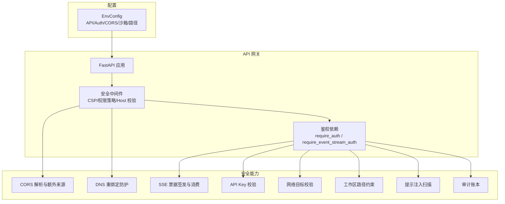
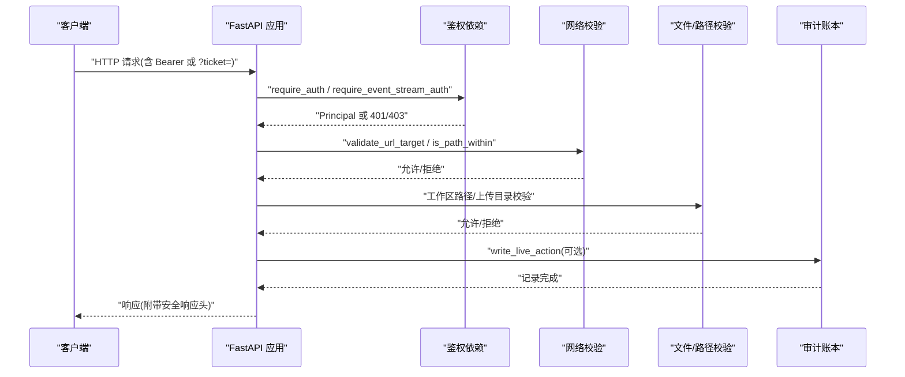
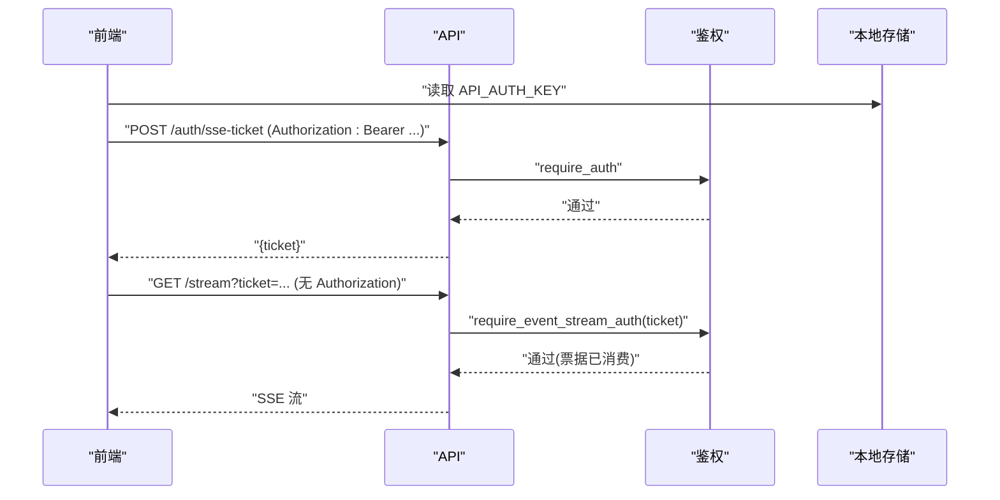
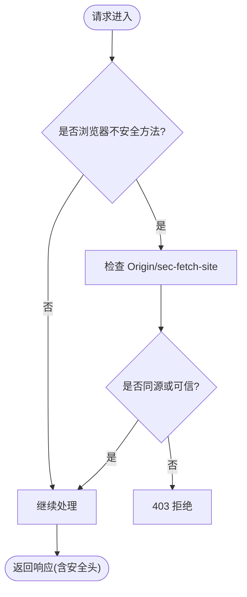
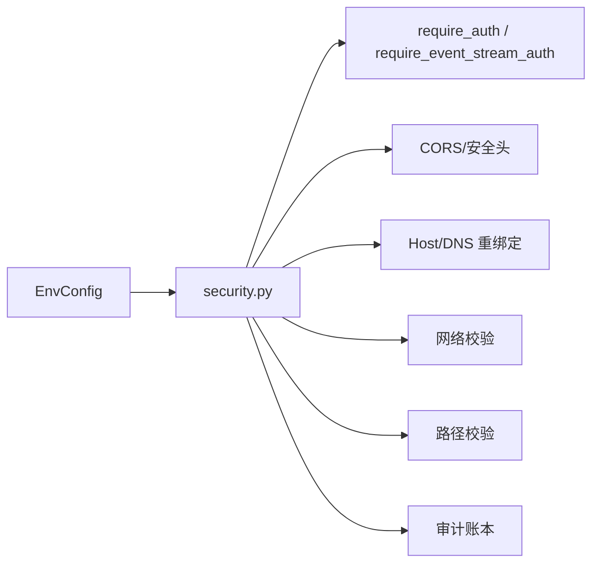

# 安全架构

<cite>
**本文引用的文件**
- [agent/src/api/security.py](file://agent/src/api/security.py)
- [agent/src/api/auth_routes.py](file://agent/src/api/auth_routes.py)
- [agent/src/config/env_schema.py](file://agent/src/config/env_schema.py)
- [agent/src/channels/utils.py](file://agent/src/channels/utils.py)
- [agent/src/security/scanner.py](file://agent/src/security/scanner.py)
- [agent/src/security/network.py](file://agent/src/security/network.py)
- [agent/src/security/workspace_access.py](file://agent/src/security/workspace_access.py)
- [agent/src/security/workspace_policy.py](file://agent/src/security/workspace_policy.py)
- [agent/src/live/audit.py](file://agent/src/live/audit.py)
- [frontend/src/lib/apiAuth.ts](file://frontend/src/lib/apiAuth.ts)
- [frontend/src/lib/storage.ts](file://frontend/src/lib/storage.ts)
- [SECURITY.md](file://SECURITY.md)
</cite>

## 目录
1. [简介](#简介)
2. [项目结构](#项目结构)
3. [核心组件](#核心组件)
4. [架构总览](#架构总览)
5. [详细组件分析](#详细组件分析)
6. [依赖关系分析](#依赖关系分析)
7. [性能与安全权衡](#性能与安全权衡)
8. [故障排查指南](#故障排查指南)
9. [结论](#结论)
10. [附录：配置与测试清单](#附录配置与测试清单)

## 简介
本文件面向 Vibe-Trading 的安全架构，系统性说明认证授权、访问控制、跨域与请求防护、代码执行沙箱、文件系统与网络访问限制、审计日志、威胁检测与应急响应，以及安全配置、漏洞扫描与安全测试方案。目标是帮助开发者与运维人员在不牺牲可用性的前提下，构建可审计、可回滚、可防御的部署环境。

## 项目结构
安全能力主要分布在以下模块：
- API 层鉴权与跨域：FastAPI 中间件与依赖（CORS、安全响应头、DNS 重绑定防护、SSE 票据）
- 配置中心：集中式环境变量 schema（API 密钥、CORS、沙箱开关、路径白名单等）
- 网络与路径安全：URL 目标校验、私有地址拦截、工作区路径约束
- 外部内容安全：提示注入扫描与特殊 token 中和
- 审计与合规：实盘动作审计账本（追加写入、fsync、哈希链防篡改）
- 前端安全：本地存储封装、Bearer 令牌注入

图表来源
- [agent/src/api/security.py:69-158](file://agent/src/api/security.py#L69-L158)
- [agent/src/api/security.py:166-173](file://agent/src/api/security.py#L166-L173)
- [agent/src/api/security.py:300-340](file://agent/src/api/security.py#L300-L340)
- [agent/src/api/security.py:463-504](file://agent/src/api/security.py#L463-L504)
- [agent/src/channels/utils.py:97-141](file://agent/src/channels/utils.py#L97-L141)
- [agent/src/security/workspace_policy.py:8-11](file://agent/src/security/workspace_policy.py#L8-L11)
- [agent/src/security/scanner.py:145-220](file://agent/src/security/scanner.py#L145-L220)
- [agent/src/live/audit.py:248-351](file://agent/src/live/audit.py#L248-L351)
- [agent/src/config/env_schema.py:245-295](file://agent/src/config/env_schema.py#L245-L295)

章节来源
- [agent/src/api/security.py:69-158](file://agent/src/api/security.py#L69-L158)
- [agent/src/config/env_schema.py:245-295](file://agent/src/config/env_schema.py#L245-L295)

## 核心组件
- 认证与授权
  - Bearer Token 校验与共享密钥模式；未配置密钥时仅信任环回客户端
  - SSE 事件流使用一次性票据，避免长生命周期密钥进入 URL
  - 设置写操作强制鉴权，防止凭据路由被越权修改
- CORS 与跨站防护
  - 默认允许本地开发来源；支持“附加”额外可信来源，禁止 credentialed 通配符
  - 对浏览器不安全方法在放行前进行同源/跨站检查
- DNS 重绑定与 Host 校验
  - 拒绝不可信 Host 头，防止通过 DNS 重绑定绕过环回鉴权
- 网络访问限制
  - 仅允许 http/https；解析域名后拒绝私有/内部/多播地址；可选严格允许环回
- 文件系统访问控制
  - 工作区路径必须在允许的根目录下；上传媒体落盘到受控目录
- 外部内容安全
  - 提示注入规则扫描并标注风险；中和聊天模板控制 token，防止角色边界伪造
- 审计与合规
  - 实盘动作追加写入独立审计账本，fsync 持久化；可选哈希链防篡改
- 前端安全
  - 本地存储安全封装；统一注入 Authorization 头

章节来源
- [agent/src/api/security.py:463-504](file://agent/src/api/security.py#L463-L504)
- [agent/src/api/security.py:591-622](file://agent/src/api/security.py#L591-L622)
- [agent/src/api/security.py:69-158](file://agent/src/api/security.py#L69-L158)
- [agent/src/channels/utils.py:97-141](file://agent/src/channels/utils.py#L97-L141)
- [agent/src/security/workspace_policy.py:8-11](file://agent/src/security/workspace_policy.py#L8-L11)
- [agent/src/security/scanner.py:145-220](file://agent/src/security/scanner.py#L145-L220)
- [agent/src/live/audit.py:248-351](file://agent/src/live/audit.py#L248-L351)
- [frontend/src/lib/apiAuth.ts:18-21](file://frontend/src/lib/apiAuth.ts#L18-L21)
- [frontend/src/lib/storage.ts:7-29](file://frontend/src/lib/storage.ts#L7-L29)

## 架构总览
下图展示一次带认证的敏感请求从到达网关到鉴权、资源访问与审计的全链路。

图表来源
- [agent/src/api/security.py:463-504](file://agent/src/api/security.py#L463-L504)
- [agent/src/api/security.py:591-622](file://agent/src/api/security.py#L591-L622)
- [agent/src/channels/utils.py:97-141](file://agent/src/channels/utils.py#L97-L141)
- [agent/src/security/workspace_policy.py:8-11](file://agent/src/security/workspace_policy.py#L8-L11)
- [agent/src/live/audit.py:248-351](file://agent/src/live/audit.py#L248-L351)

## 详细组件分析

### 认证与授权（API Key、SSE 票据、会话安全）
- 共享密钥优先：当配置了 API 密钥时，所有请求（包括环回）必须携带有效凭证；否则仅信任环回客户端
- SSE 票据：浏览器无法发送 Authorization 头，先通过受保护的接口换取一次性 ticket，再用于 EventSource；票据短生命周期且单次使用
- 设置写保护：修改凭据路由的设置端点强制鉴权，非本地需密钥
- 前端注入：前端统一读取本地存储的密钥并注入 Authorization 头

图表来源
- [agent/src/api/security.py:300-340](file://agent/src/api/security.py#L300-L340)
- [agent/src/api/security.py:591-622](file://agent/src/api/security.py#L591-L622)
- [agent/src/api/auth_routes.py:44-55](file://agent/src/api/auth_routes.py#L44-L55)
- [frontend/src/lib/apiAuth.ts:18-21](file://frontend/src/lib/apiAuth.ts#L18-L21)
- [frontend/src/lib/storage.ts:7-29](file://frontend/src/lib/storage.ts#L7-L29)

章节来源
- [agent/src/api/security.py:463-504](file://agent/src/api/security.py#L463-L504)
- [agent/src/api/security.py:591-622](file://agent/src/api/security.py#L591-L622)
- [agent/src/api/auth_routes.py:21-55](file://agent/src/api/auth_routes.py#L21-L55)
- [frontend/src/lib/apiAuth.ts:1-21](file://frontend/src/lib/apiAuth.ts#L1-L21)
- [frontend/src/lib/storage.ts:1-29](file://frontend/src/lib/storage.ts#L1-L29)

### CORS 与跨站请求防护
- 默认允许本地开发来源；可通过环境变量追加额外可信来源，禁止 credentialed 通配符
- 对浏览器不安全方法（POST/PUT/DELETE 等）在进入鉴权前进行跨站检查，防止 CSRF 类攻击
- 安全响应头：CSP、X-Content-Type-Options、X-Frame-Options、Permissions-Policy、Referrer-Policy

图表来源
- [agent/src/api/security.py:69-158](file://agent/src/api/security.py#L69-L158)
- [agent/src/api/security.py:423-431](file://agent/src/api/security.py#L423-L431)
- [agent/src/api/security.py:235-253](file://agent/src/api/security.py#L235-L253)

章节来源
- [agent/src/api/security.py:69-158](file://agent/src/api/security.py#L69-L158)
- [agent/src/api/security.py:235-253](file://agent/src/api/security.py#L235-L253)
- [agent/src/api/security.py:423-431](file://agent/src/api/security.py#L423-L431)

### DNS 重绑定与 Host 校验
- 对来自环回客户端的请求，校验 Host 头是否在可信列表（内置 localhost/127.0.0.1/[::1] 等，可扩展）
- 若 Host 不合法，直接拒绝，阻断通过 DNS 重绑定绕过鉴权的尝试

章节来源
- [agent/src/api/security.py:106-145](file://agent/src/api/security.py#L106-L145)
- [agent/src/api/security.py:166-173](file://agent/src/api/security.py#L166-L173)

### 网络请求限制
- 仅允许 http/https；解析域名后拒绝私有/内部/多播地址；可选严格允许环回
- 通道媒体下载前进行目标校验，防止 SSRF

章节来源
- [agent/src/channels/utils.py:97-141](file://agent/src/channels/utils.py#L97-L141)
- [agent/src/security/network.py:1-11](file://agent/src/security/network.py#L1-L11)

### 文件系统访问控制与工作区隔离
- 工作区路径必须在允许的根目录下；上传媒体落盘到受控目录（如 uploads）
- 提供 is_path_within 工具函数进行路径包含性校验

章节来源
- [agent/src/channels/utils.py:16-32](file://agent/src/channels/utils.py#L16-L32)
- [agent/src/security/workspace_policy.py:8-11](file://agent/src/security/workspace_policy.py#L8-L11)
- [agent/src/security/workspace_access.py:1-15](file://agent/src/security/workspace_access.py#L1-L15)

### 代码执行沙箱与工具输出安全
- 生成策略运行采用受限子进程环境，仅暴露必要变量与只读市场数据凭据，不转发 LLM/Broker 密钥
- 外部内容读取工具结果会附加安全警告，并对提示注入模式进行扫描；同时中和聊天模板控制 token，防止角色边界伪造

章节来源
- [SECURITY.md:23-28](file://SECURITY.md#L23-L28)
- [agent/src/security/scanner.py:145-220](file://agent/src/security/scanner.py#L145-L220)

### 审计日志、威胁检测与应急响应
- 实盘动作审计：追加写入独立账本，fsync 持久化；可选哈希链防篡改；敏感字段脱敏
- 威胁检测：提示注入扫描与特殊 token 中和，降低外部内容操控模型行为的风险
- 应急响应：设置写保护、SSE 票据短期有效、CORS 最小化、安全头强制

章节来源
- [agent/src/live/audit.py:248-351](file://agent/src/live/audit.py#L248-L351)
- [agent/src/security/scanner.py:145-220](file://agent/src/security/scanner.py#L145-L220)
- [agent/src/api/security.py:235-253](file://agent/src/api/security.py#L235-L253)

## 依赖关系分析
- API 鉴权依赖配置：API 密钥来源于集中配置；CORS、额外来源、沙箱开关、路径白名单均通过 EnvConfig 管理
- 网络与路径工具被安全中间件与工具调用复用，形成统一的访问控制面
- 审计账本独立于运行轨迹，确保合规记录不被清理影响

图表来源
- [agent/src/config/env_schema.py:245-295](file://agent/src/config/env_schema.py#L245-L295)
- [agent/src/api/security.py:463-504](file://agent/src/api/security.py#L463-L504)
- [agent/src/channels/utils.py:97-141](file://agent/src/channels/utils.py#L97-L141)
- [agent/src/live/audit.py:248-351](file://agent/src/live/audit.py#L248-L351)

章节来源
- [agent/src/config/env_schema.py:245-295](file://agent/src/config/env_schema.py#L245-L295)
- [agent/src/api/security.py:463-504](file://agent/src/api/security.py#L463-L504)

## 性能与安全权衡
- 鉴权开销：每次请求进行 HMAC 比较与来源校验，成本较低；SSE 票据减少 URL 泄露风险但增加一次握手
- CORS 收紧：最小化可信来源可降低攻击面，但需为集成站点添加额外来源
- 网络校验：DNS 解析与地址检查带来少量延迟，但显著降低 SSRF 风险
- 审计写入：fsync 保证持久化，可能引入 I/O 抖动；建议将审计文件置于高性能磁盘
- 提示注入扫描：正则匹配与 token 中和对大文本有轻微 CPU 开销，建议在工具层按需启用

[本节为通用指导，无需特定文件引用]

## 故障排查指南
- 401 未授权
  - 检查是否配置了 API_AUTH_KEY；若未配置，仅环回客户端可访问
  - 确认 Bearer Token 是否正确；SSE 流需先获取 ticket
- 403 跨站/不可信 Host
  - 检查 Origin/sec-fetch-site；确认 Host 头在白名单内
  - 若为 Docker 宿主网关访问，考虑开启信任环回选项
- CORS 错误
  - 检查 CORS_ORIGINS 与 VIBE_TRADING_EXTRA_CORS_ORIGINS；避免 credentialed 通配符
- 网络请求被拒
  - 检查目标是否为 http/https；是否解析到私有/内部/多播地址
- 文件路径被拒
  - 确认路径在工作区允许根目录下；上传媒体应落入 uploads 目录
- 审计异常
  - 检查 fsync 失败告警；哈希链写入失败不应阻塞订单，但会导致该条记录缺失链证据

章节来源
- [agent/src/api/security.py:463-504](file://agent/src/api/security.py#L463-L504)
- [agent/src/api/security.py:591-622](file://agent/src/api/security.py#L591-L622)
- [agent/src/api/security.py:69-158](file://agent/src/api/security.py#L69-L158)
- [agent/src/channels/utils.py:97-141](file://agent/src/channels/utils.py#L97-L141)
- [agent/src/live/audit.py:80-97](file://agent/src/live/audit.py#L80-L97)
- [agent/src/live/audit.py:316-340](file://agent/src/live/audit.py#L316-L340)

## 结论
Vibe-Trading 的安全架构以“最小信任面 + 强校验 + 可审计”为核心原则：通过集中配置管理密钥与策略，API 层实施严格的鉴权、跨域与 Host 校验，网络与文件系统访问受到白名单与目标校验约束，外部内容经过提示注入扫描与 token 中和，实盘动作具备追加写入与可选哈希链的审计能力。配合前端安全实践与文档化的安全策略，可在保障可用性的同时有效抵御常见攻击面。

[本节为总结，无需特定文件引用]

## 附录：配置与测试清单

- 关键环境变量（节选）
  - API_AUTH_KEY：API 共享密钥（也兼容 VIBE_TRADING_API_KEY 别名）
  - CORS_ORIGINS：显式允许的 Web 来源（不允许 credentialed 通配符）
  - VIBE_TRADING_EXTRA_CORS_ORIGINS：追加的可信来源（不影响默认本地来源）
  - API_ALLOWED_HOSTS：扩展的环回可信 Host 列表
  - VIBE_TRADING_ENABLE_SHELL_TOOLS：是否暴露 shell-capable 工具（默认关闭）
  - VIBE_TRADING_ALLOWED_FILE_ROOTS / VIBE_TRADING_ALLOWED_WRITE_ROOTS：读写路径白名单
  - VIBE_TRADING_TRUST_DOCKER_LOOPBACK：是否信任 Docker 宿主网关为环回
  - VIBE_TRADING_CSP_REPORT_ONLY：以 Report-Only 模式下发 CSP（便于灰度）

- 推荐部署实践
  - 生产环境务必设置 API_AUTH_KEY；仅开放必要的 CORS 来源
  - 将审计文件置于可靠存储，关注 fsync 失败告警
  - 对外暴露的文档页面（/docs、/redoc）保持鉴权，避免泄露敏感信息
  - 使用安全响应头（CSP、X-Frame-Options 等），必要时在反向代理层启用 HSTS

- 安全测试要点
  - 认证：未配置密钥时的环回信任、配置密钥后的强制鉴权、SSE 票据一次性使用
  - CORS：credentialed 通配符拒绝、额外来源追加与去重
  - 跨站：浏览器不安全方法的同源/跨站检查
  - 网络：非法协议、私有/内部/多播地址拒绝、可选环回严格模式
  - 文件：路径穿越与工作区隔离
  - 外部内容：提示注入扫描与 token 中和
  - 审计：追加写入、fsync、哈希链完整性验证

章节来源
- [agent/src/config/env_schema.py:245-295](file://agent/src/config/env_schema.py#L245-L295)
- [agent/src/api/security.py:69-158](file://agent/src/api/security.py#L69-L158)
- [agent/src/api/security.py:235-253](file://agent/src/api/security.py#L235-L253)
- [agent/src/channels/utils.py:97-141](file://agent/src/channels/utils.py#L97-L141)
- [agent/src/security/scanner.py:145-220](file://agent/src/security/scanner.py#L145-L220)
- [agent/src/live/audit.py:248-351](file://agent/src/live/audit.py#L248-L351)
- [SECURITY.md:23-28](file://SECURITY.md#L23-L28)