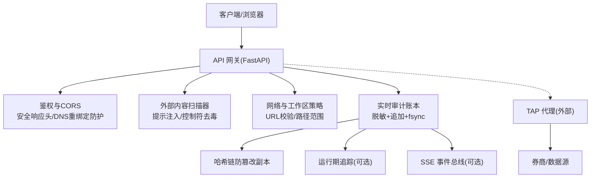
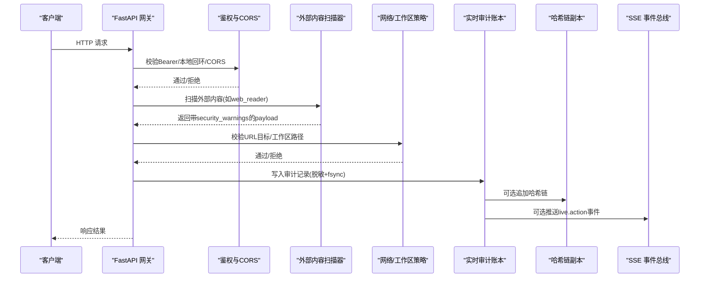
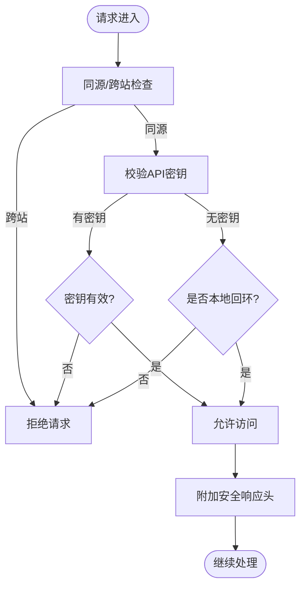
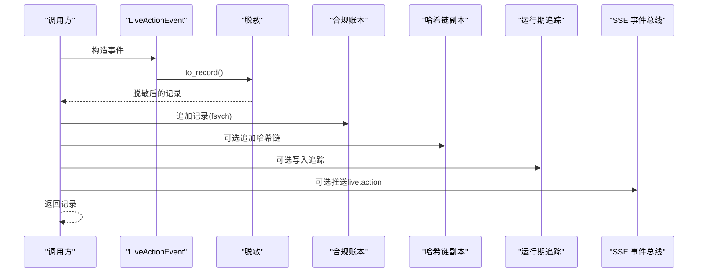
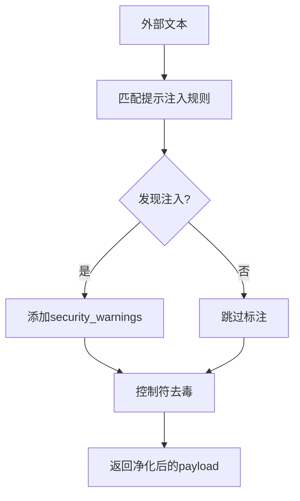
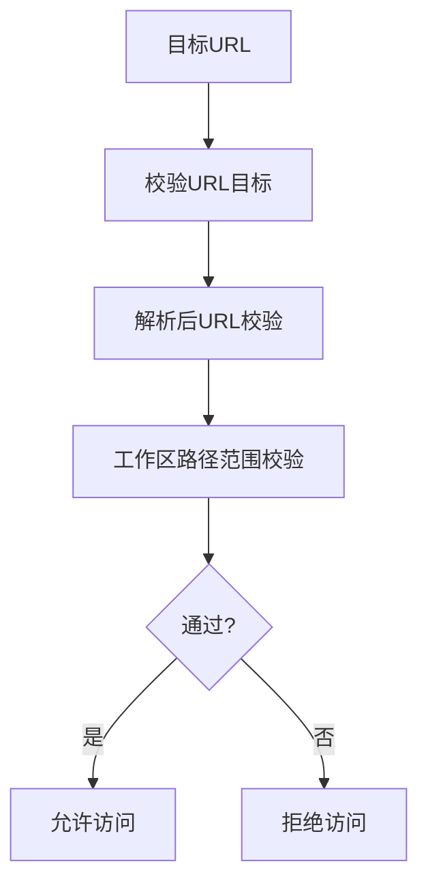
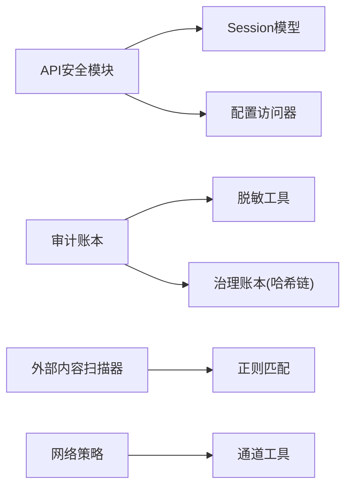

# 安全监控与审计

<cite>
**本文引用的文件**
- [agent/src/api/security.py](file://agent/src/api/security.py)
- [agent/src/live/audit.py](file://agent/src/live/audit.py)
- [agent/src/security/scanner.py](file://agent/src/security/scanner.py)
- [agent/src/security/network.py](file://agent/src/security/network.py)
- [agent/src/security/workspace_access.py](file://agent/src/security/workspace_access.py)
- [agent/src/security/workspace_policy.py](file://agent/src/security/workspace_policy.py)
- [README.md](file://README.md)
- [agent/tests/test_sse_ticket_and_headers.py](file://agent/tests/test_sse_ticket_and_headers.py)
- [agent/tests/test_oauth_token_cache.py](file://agent/tests/test_oauth_token_cache.py)
</cite>

## 目录
1. [简介](#简介)
2. [项目结构](#项目结构)
3. [核心组件](#核心组件)
4. [架构总览](#架构总览)
5. [详细组件分析](#详细组件分析)
6. [依赖关系分析](#依赖关系分析)
7. [性能考虑](#性能考虑)
8. [故障排查指南](#故障排查指南)
9. [结论](#结论)
10. [附录](#附录)

## 简介
本文件面向 Vibe-Trading 的安全监控与审计，聚焦以下目标：
- 安全事件记录：统一、不可篡改的实时交易审计账本，覆盖订单、指令拒绝、授权承诺、风控熔断等关键动作。
- 审计日志管理：多路输出（合规账本、运行期追踪、前端/CLI 实时展示），并在写入前对敏感字段进行脱敏。
- 威胁检测机制：对外部内容的提示注入扫描与特殊控制符“去毒”，结合网络访问校验与工作区路径策略，降低外部输入带来的攻击面。
- 访问模式分析与异常行为检测：基于 API 鉴权、CORS/同源策略、DNS 重绑定防护、SSE 一次性票据等机制，识别并阻断异常访问。
- 风险评估算法：集成风险度量（VaR/CVaR、最大回撤、尾部风险）与压力测试，为策略与风控提供量化依据。
- 合规性检查与安全策略验证：强制安全响应头、严格 CORS、受限浏览器权限策略；TAP 代理实现凭据隔离与人工审批。
- 漏洞扫描集成：通过外部内容扫描器与工具调用前的白名单/身份匹配，减少恶意或越权调用。
- 实时告警系统：通过 SSE 事件总线推送“live.action”事件，支持前端/CLI 即时渲染与告警。
- 监控配置指南、审计日志分析与事件响应流程：提供部署与运维建议，以及常见问题的定位方法。

## 项目结构
围绕安全与审计的关键代码主要分布在以下模块：
- API 安全与鉴权：FastAPI 中间件、CORS、安全响应头、SSE 票据、本地回环信任域、Shell 工具开关等。
- 实时审计账本：独立追加式 JSONL 账本，支持哈希链防篡改，三路输出（合规账本、运行追踪、SSE）。
- 外部内容安全扫描：提示注入规则匹配、聊天模板控制符“去毒”。
- 网络与工作区策略：URL 目标校验、解析后 URL 校验、工作区路径范围限制。
- TAP 凭据代理：将真实密钥隔离在代理侧，写操作需人工批准，读操作自动放行。



图表来源
- [agent/src/api/security.py:166-253](file://agent/src/api/security.py#L166-L253)
- [agent/src/security/scanner.py:145-220](file://agent/src/security/scanner.py#L145-L220)
- [agent/src/security/network.py:1-11](file://agent/src/security/network.py#L1-L11)
- [agent/src/live/audit.py:248-352](file://agent/src/live/audit.py#L248-L352)
- [README.md:1409-1452](file://README.md#L1409-L1452)

章节来源
- [agent/src/api/security.py:166-253](file://agent/src/api/security.py#L166-L253)
- [agent/src/security/scanner.py:145-220](file://agent/src/security/scanner.py#L145-L220)
- [agent/src/security/network.py:1-11](file://agent/src/security/network.py#L1-L11)
- [agent/src/live/audit.py:248-352](file://agent/src/live/audit.py#L248-L352)
- [README.md:1409-1452](file://README.md#L1409-L1452)

## 核心组件
- API 安全与鉴权
  - 基于 Bearer Token 的共享密钥认证，支持开发模式下本地回环信任。
  - CORS 白名单与额外来源扩展，禁止凭据模式下的通配符。
  - 安全响应头：CSP、X-Content-Type-Options、X-Frame-Options、Permissions-Policy、Referrer-Policy。
  - DNS 重绑定防护：拒绝不受信任的 Host 头绕过本地鉴权。
  - SSE 一次性票据：避免长生命周期密钥进入 URL/日志。
  - 访问日志脱敏：查询参数中的 api_key/ticket 值被替换为占位符。
- 实时审计账本
  - 追加式 JSONL 文件，首次写入创建目录并设置严格权限。
  - 每条记录 fsync 持久化，保证崩溃不丢记录。
  - 可选哈希链副本，用于防篡改校验。
  - 三路输出：合规账本（必选）、运行期追踪（可选）、SSE 事件（可选）。
  - 写入前统一脱敏，防止 OAuth token、账号、PII 泄露。
- 外部内容安全扫描
  - 提示注入规则匹配（高/中危），返回结构化警告。
  - 聊天模板控制符“去毒”，插入零宽空格破坏分词器匹配。
  - 针对 web_reader/web_search/doc_reader 等外部内容入口进行字段级扫描与净化。
- 网络与工作区策略
  - URL 目标校验与解析后 URL 校验，防止 SSRF/重定向到内网。
  - 工作区路径范围限制，阻止越权访问宿主文件系统。
- TAP 凭据代理
  - 代理持有真实密钥，Agent 进程不接触明文密钥。
  - 写操作需人工审批，读操作自动转发。
  - allowed_hosts 固定密钥发送目标，篡改目标将被拒绝。

章节来源
- [agent/src/api/security.py:69-159](file://agent/src/api/security.py#L69-L159)
- [agent/src/api/security.py:166-253](file://agent/src/api/security.py#L166-L253)
- [agent/src/api/security.py:300-341](file://agent/src/api/security.py#L300-L341)
- [agent/src/api/security.py:343-504](file://agent/src/api/security.py#L343-L504)
- [agent/src/live/audit.py:1-59](file://agent/src/live/audit.py#L1-L59)
- [agent/src/live/audit.py:248-352](file://agent/src/live/audit.py#L248-L352)
- [agent/src/security/scanner.py:16-77](file://agent/src/security/scanner.py#L16-L77)
- [agent/src/security/scanner.py:117-143](file://agent/src/security/scanner.py#L117-L143)
- [agent/src/security/scanner.py:145-220](file://agent/src/security/scanner.py#L145-L220)
- [agent/src/security/network.py:1-11](file://agent/src/security/network.py#L1-L11)
- [agent/src/security/workspace_access.py:1-15](file://agent/src/security/workspace_access.py#L1-L15)
- [agent/src/security/workspace_policy.py:1-12](file://agent/src/security/workspace_policy.py#L1-L12)
- [README.md:1409-1452](file://README.md#L1409-L1452)

## 架构总览
下图展示了从请求进入到安全处理、审计落盘与告警的全链路：



图表来源
- [agent/src/api/security.py:166-253](file://agent/src/api/security.py#L166-L253)
- [agent/src/security/scanner.py:145-220](file://agent/src/security/scanner.py#L145-L220)
- [agent/src/security/network.py:1-11](file://agent/src/security/network.py#L1-L11)
- [agent/src/live/audit.py:248-352](file://agent/src/live/audit.py#L248-L352)

## 详细组件分析

### API 安全与鉴权
- 功能要点
  - 共享密钥认证：优先使用配置的 API Key，未配置时允许本地回环信任。
  - CORS 与同源策略：默认允许本地 Web UI 来源，支持额外来源扩展；禁止凭据模式下的通配符。
  - 安全响应头：CSP、X-Content-Type-Options、X-Frame-Options、Permissions-Policy、Referrer-Policy。
  - DNS 重绑定防护：拒绝不受信任的 Host 头绕过本地鉴权。
  - SSE 票据：一次性短效票据替代 URL 中的长生命周期密钥。
  - 访问日志脱敏：查询参数中的敏感值被替换为占位符。
- 关键流程
  - 请求进入 → 同源/跨站检查 → 密钥校验 → 本地回环信任 → 安全头附加 → 继续处理。
  - SSE 流：先通过 Bearer 获取一次性 ticket，后续连接使用 ticket 鉴权。



图表来源
- [agent/src/api/security.py:423-504](file://agent/src/api/security.py#L423-L504)
- [agent/src/api/security.py:571-622](file://agent/src/api/security.py#L571-L622)
- [agent/src/api/security.py:235-253](file://agent/src/api/security.py#L235-L253)

章节来源
- [agent/src/api/security.py:69-159](file://agent/src/api/security.py#L69-L159)
- [agent/src/api/security.py:166-253](file://agent/src/api/security.py#L166-L253)
- [agent/src/api/security.py:300-341](file://agent/src/api/security.py#L300-L341)
- [agent/src/api/security.py:343-504](file://agent/src/api/security.py#L343-L504)
- [agent/tests/test_sse_ticket_and_headers.py:1-44](file://agent/tests/test_sse_ticket_and_headers.py#L1-L44)

### 实时审计账本
- 功能要点
  - 追加式 JSONL 文件，首次写入创建目录并设置严格权限。
  - 每条记录 fsync 持久化，确保崩溃不丢记录。
  - 可选哈希链副本，用于防篡改校验。
  - 三路输出：合规账本（必选）、运行期追踪（可选）、SSE 事件（可选）。
  - 写入前统一脱敏，防止 OAuth token、账号、PII 泄露。
- 关键流程
  - 构造事件 → 生成记录 → 脱敏 → 写入合规账本 → 可选写入哈希链 → 可选写入追踪 → 可选推送 SSE。



图表来源
- [agent/src/live/audit.py:172-246](file://agent/src/live/audit.py#L172-L246)
- [agent/src/live/audit.py:248-352](file://agent/src/live/audit.py#L248-L352)

章节来源
- [agent/src/live/audit.py:1-59](file://agent/src/live/audit.py#L1-L59)
- [agent/src/live/audit.py:172-246](file://agent/src/live/audit.py#L172-L246)
- [agent/src/live/audit.py:248-352](file://agent/src/live/audit.py#L248-L352)
- [agent/tests/test_oauth_token_cache.py:175-205](file://agent/tests/test_oauth_token_cache.py#L175-L205)

### 外部内容安全扫描
- 功能要点
  - 提示注入规则匹配（高/中危），返回结构化警告。
  - 聊天模板控制符“去毒”，插入零宽空格破坏分词器匹配。
  - 针对 web_reader/web_search/doc_reader 等外部内容入口进行字段级扫描与净化。
- 关键流程
  - 接收外部文本 → 匹配规则 → 生成 security_warnings → 控制符去毒 → 返回净化后的 payload。



图表来源
- [agent/src/security/scanner.py:16-77](file://agent/src/security/scanner.py#L16-L77)
- [agent/src/security/scanner.py:117-143](file://agent/src/security/scanner.py#L117-L143)
- [agent/src/security/scanner.py:145-220](file://agent/src/security/scanner.py#L145-L220)

章节来源
- [agent/src/security/scanner.py:16-77](file://agent/src/security/scanner.py#L16-L77)
- [agent/src/security/scanner.py:117-143](file://agent/src/security/scanner.py#L117-L143)
- [agent/src/security/scanner.py:145-220](file://agent/src/security/scanner.py#L145-L220)

### 网络与工作区策略
- 功能要点
  - URL 目标校验与解析后 URL 校验，防止 SSRF/重定向到内网。
  - 工作区路径范围限制，阻止越权访问宿主文件系统。
- 关键流程
  - 请求目标 → 校验 URL → 校验解析后 URL → 校验工作区路径 → 通过/拒绝。



图表来源
- [agent/src/security/network.py:1-11](file://agent/src/security/network.py#L1-L11)
- [agent/src/security/workspace_access.py:1-15](file://agent/src/security/workspace_access.py#L1-L15)
- [agent/src/security/workspace_policy.py:1-12](file://agent/src/security/workspace_policy.py#L1-L12)

章节来源
- [agent/src/security/network.py:1-11](file://agent/src/security/network.py#L1-L11)
- [agent/src/security/workspace_access.py:1-15](file://agent/src/security/workspace_access.py#L1-L15)
- [agent/src/security/workspace_policy.py:1-12](file://agent/src/security/workspace_policy.py#L1-L12)

### TAP 凭据代理
- 功能要点
  - 代理持有真实密钥，Agent 进程不接触明文密钥。
  - 写操作需人工审批，读操作自动转发。
  - allowed_hosts 固定密钥发送目标，篡改目标将被拒绝。
- 关键流程
  - Agent 发起调用 → 经 TAP 代理 → 注入密钥 → 转发至券商/数据源 → 返回结果。

```mermaid
sequenceDiagram
participant Agent as "Agent进程"
participant TAP as "TAP代理"
participant Broker as "券商/数据源"
Agent->>TAP : 发起调用(引用凭据名)
TAP->>TAP : 注入真实密钥
TAP->>Broker : 转发请求
Broker-->>TAP : 返回响应
TAP-->>Agent : 返回结果
Note over TAP,Broker : 写操作需人工审批; 读操作自动转发
```

图表来源
- [README.md:1409-1452](file://README.md#L1409-L1452)

章节来源
- [README.md:1409-1452](file://README.md#L1409-L1452)

## 依赖关系分析
- API 安全模块依赖 FastAPI 的 Security/Request/HTTPException，并与 session models 的 Principal/AuthMethod 交互。
- 审计账本依赖 tools.redaction 进行脱敏，依赖 governance.ledger 进行哈希链追加。
- 外部内容扫描器依赖正则表达式与数据结构，返回结构化警告。
- 网络与工作区策略依赖 channels.utils 提供的 URL/路径校验函数。



图表来源
- [agent/src/api/security.py:16-24](file://agent/src/api/security.py#L16-L24)
- [agent/src/live/audit.py:61-74](file://agent/src/live/audit.py#L61-L74)
- [agent/src/security/scanner.py:9-14](file://agent/src/security/scanner.py#L9-L14)
- [agent/src/security/network.py:1-11](file://agent/src/security/network.py#L1-L11)

章节来源
- [agent/src/api/security.py:16-24](file://agent/src/api/security.py#L16-L24)
- [agent/src/live/audit.py:61-74](file://agent/src/live/audit.py#L61-L74)
- [agent/src/security/scanner.py:9-14](file://agent/src/security/scanner.py#L9-L14)
- [agent/src/security/network.py:1-11](file://agent/src/security/network.py#L1-L11)

## 性能考虑
- 审计账本写入采用追加模式与 fsync，确保持久化但可能带来 I/O 开销；建议在高频场景下评估批量写入与异步落盘的可行性。
- 外部内容扫描器使用正则匹配，注意规则复杂度与输入长度，避免灾难性回溯；当前已对特殊 token 匹配进行长度限制。
- CORS 与安全响应头计算在每次请求中执行，应确保配置解析与字符串处理高效。
- SSE 票据存储为内存字典，需注意过期清理与并发锁的性能影响。

[本节为通用指导，无需特定文件来源]

## 故障排查指南
- 常见问题
  - 401 未认证：检查 API Key 配置是否正确，或确认是否为本地回环信任模式。
  - 403 跨站请求：检查 Origin/Sec-Fetch-Site 头是否符合预期，确认 CORS 配置。
  - 审计记录缺失：检查 fsync 失败日志，确认磁盘空间与权限；查看哈希链是否出现断链。
  - 外部内容告警：根据 security_warnings 中的 rule_id 与 message 定位注入类型，调整输入过滤策略。
  - TAP 审批超时：检查 TAP_APPROVAL_TIMEOUT 配置与渠道通知是否正常。
- 定位步骤
  - 查看访问日志中的脱敏信息，确认敏感参数未被泄露。
  - 检查审计账本与哈希链的一致性，使用 verify_chain 工具验证。
  - 审查外部内容扫描器的规则匹配结果，必要时调整阈值或规则。

章节来源
- [agent/src/api/security.py:235-253](file://agent/src/api/security.py#L235-L253)
- [agent/src/live/audit.py:80-97](file://agent/src/live/audit.py#L80-L97)
- [agent/src/security/scanner.py:145-220](file://agent/src/security/scanner.py#L145-L220)
- [README.md:1409-1452](file://README.md#L1409-L1452)

## 结论
Vibe-Trading 的安全监控与审计体系以 API 鉴权、外部内容扫描、网络与工作区策略为基础，结合实时审计账本与 TAP 凭据代理，实现了从请求到执行的端到端安全闭环。通过哈希链防篡改、脱敏写入、SSE 实时告警，系统在合规性与可观测性方面具备较强能力。建议在生产环境中启用严格的 CORS、安全响应头与 TAP 审批，并结合风险度量与压力测试优化策略与风控。

[本节为总结，无需特定文件来源]

## 附录
- 监控配置指南
  - 启用 API Key 认证，避免仅依赖本地回环信任。
  - 配置 CORS 白名单，禁止凭据模式下的通配符。
  - 启用安全响应头，必要时使用 Report-Only 模式逐步 rollout。
  - 配置 TAP 代理，设置 allowed_hosts 与审批超时。
- 审计日志分析
  - 定期校验哈希链一致性，发现断链及时调查。
  - 分析 live.action 事件，识别异常订单与风控触发。
- 安全事件响应流程
  - 检测到注入告警 → 隔离输入 → 更新规则 → 通知团队。
  - 审计记录异常 → 校验哈希链 → 恢复备份 → 复盘事件。

[本节为通用指导，无需特定文件来源]