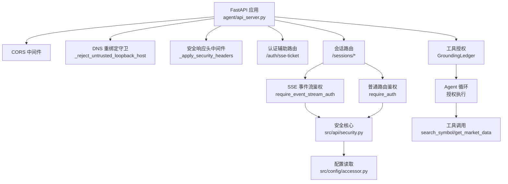
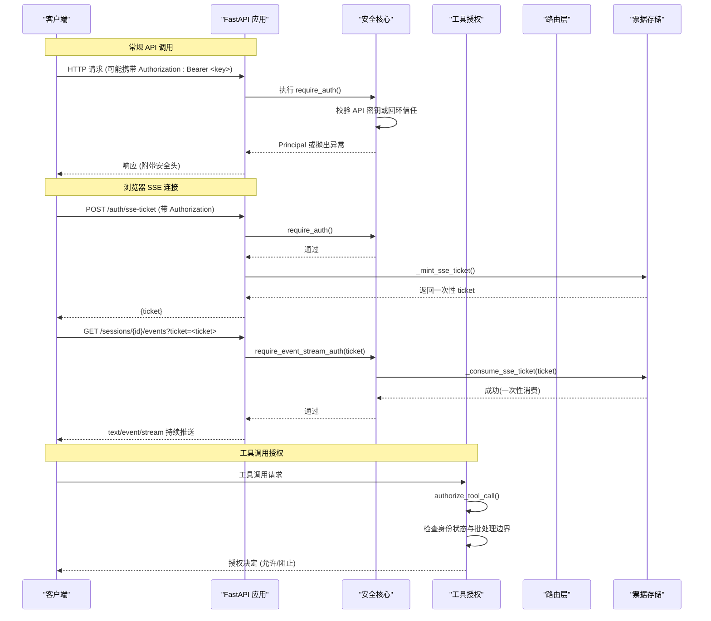
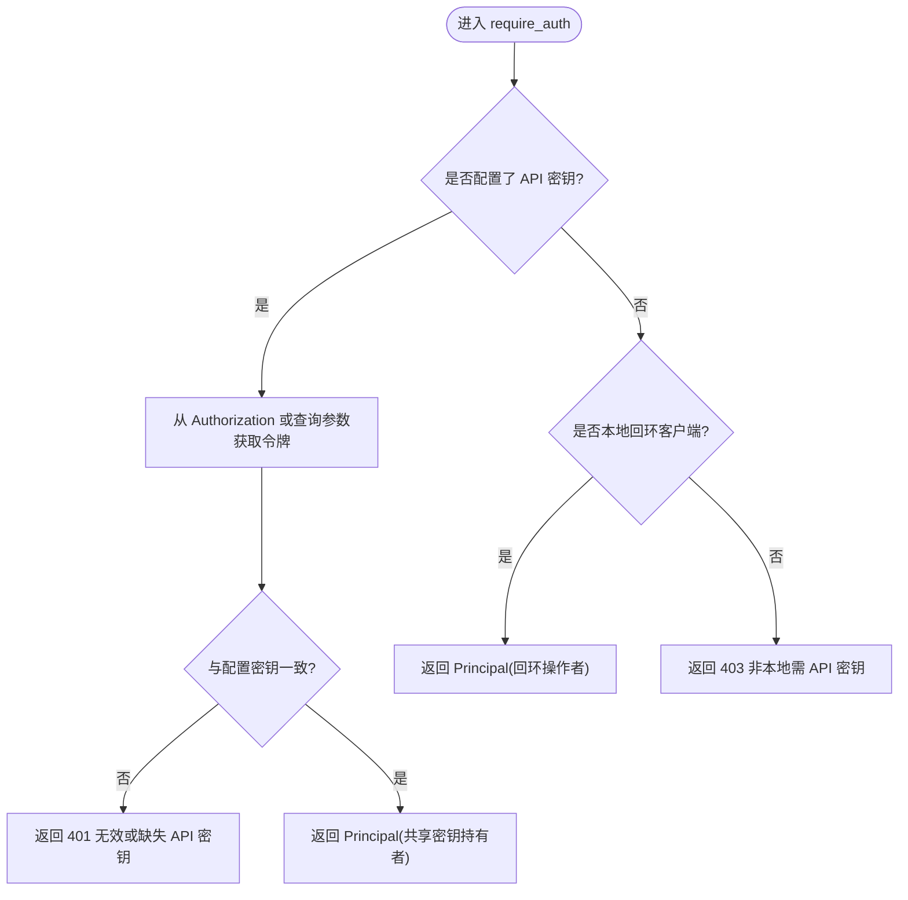
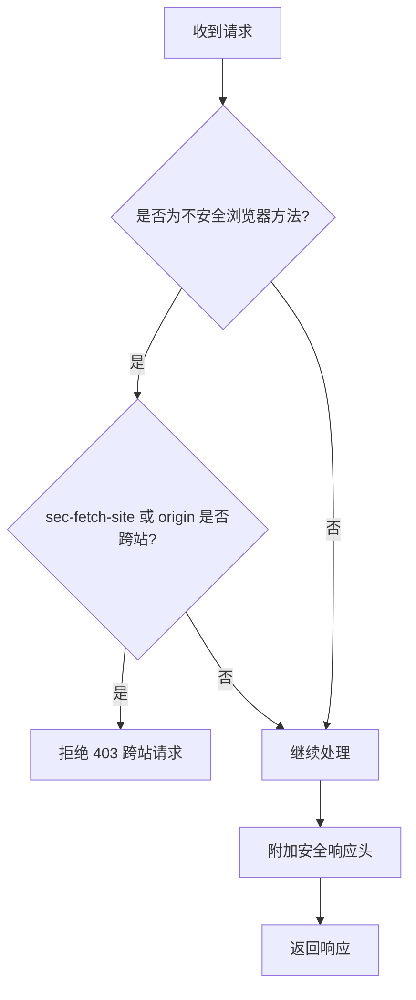
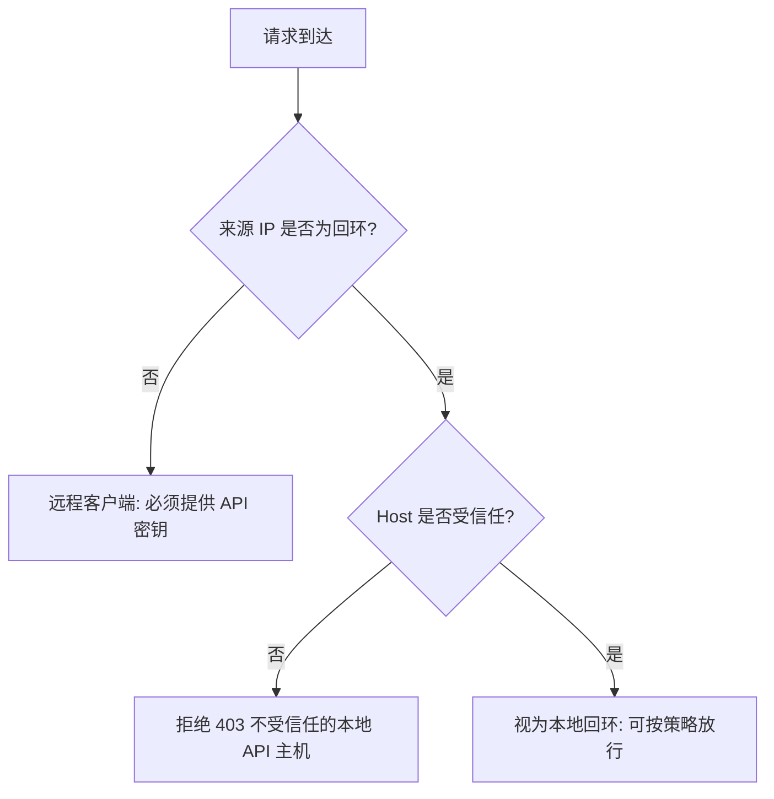
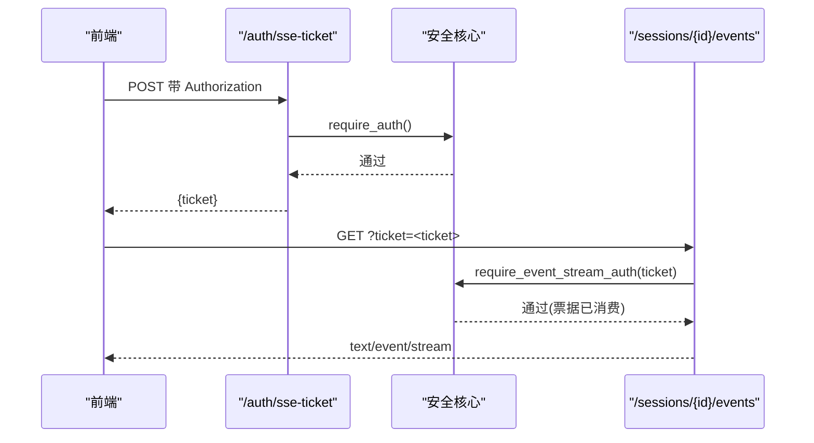
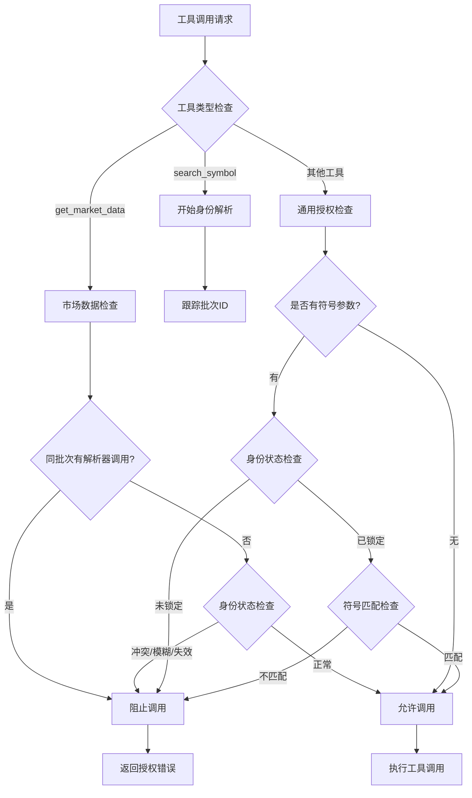
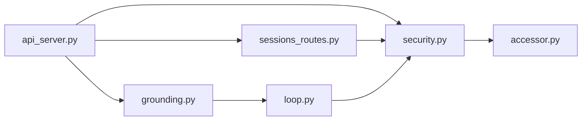

# 认证授权机制

<cite>
**本文引用的文件**
- [agent/api_server.py](file://agent/api_server.py)
- [agent/src/api/security.py](file://agent/src/api/security.py)
- [agent/src/api/auth_routes.py](file://agent/src/api/auth_routes.py)
- [agent/src/api/sessions_routes.py](file://agent/src/api/sessions_routes.py)
- [agent/src/config/accessor.py](file://agent/src/config/accessor.py)
- [agent/src/agent/grounding.py](file://agent/src/agent/grounding.py)
- [agent/src/agent/loop.py](file://agent/src/agent/loop.py)
- [agent/tests/test_security_auth_api.py](file://agent/tests/test_security_auth_api.py)
- [agent/tests/test_sse_ticket_and_headers.py](file://agent/tests/test_sse_ticket_and_headers.py)
- [agent/tests/test_agent_grounding.py](file://agent/tests/test_agent_grounding.py)
</cite>

## 更新摘要
**变更内容**
- 新增工具授权机制章节，详细说明 GroundingLedger 的身份解析与批处理保护
- 增强符号搜索与市场数据调用的竞态条件防护说明
- 更新工具调用授权流程，包括身份状态机与证据账本
- 扩展错误处理策略，涵盖身份冲突、不匹配和必需字段验证错误
- 补充批量处理保护和安全边界控制机制

## 目录
1. [简介](#简介)
2. [项目结构](#项目结构)
3. [核心组件](#核心组件)
4. [架构总览](#架构总览)
5. [详细组件分析](#详细组件分析)
6. [依赖关系分析](#依赖关系分析)
7. [性能与可用性](#性能与可用性)
8. [故障排查指南](#故障排查指南)
9. [结论](#结论)
10. [附录：配置与使用示例](#附录配置与使用示例)

## 简介
本文件系统性说明 Vibe-Trading 的认证授权机制，覆盖 API 密钥认证、会话管理、权限控制策略、HTTP Bearer Token 验证、CORS 配置与跨域防护、本地回环信任模式、Docker 环境下的安全处理与 DNS 重绑定防护、SSE 票据系统、查询参数安全处理与访问日志脱敏。文档同时提供认证流程示例、错误处理策略与安全最佳实践，并展示不同场景下的认证配置与使用方法。

**更新** 新增了工具授权机制，包括改进的身份解析、批处理保护、符号搜索与市场数据调用间的竞态条件防护，以及与 GroundingLedger 的集成实现批量级认证和安全边界控制。

## 项目结构
Vibe-Trading 将认证与安全能力集中在后端 FastAPI 应用中，通过中间件和依赖注入统一拦截请求，按路由粒度进行鉴权与权限控制。关键位置如下：
- 应用装配与中间件注册：api_server.py
- 安全核心（CORS、DNS 重绑定、安全头、日志脱敏、认证依赖）：src/api/security.py
- SSE 票据接口：src/api/auth_routes.py
- 会话相关路由（含事件流 SSE 鉴权）：src/api/sessions_routes.py
- 工具授权与身份解析：src/agent/grounding.py
- Agent 循环中的授权执行：src/agent/loop.py
- 配置读取与环境变量解析：src/config/accessor.py
- 行为验证测试：tests/test_security_auth_api.py、tests/test_sse_ticket_and_headers.py、tests/test_agent_grounding.py

**图表来源**
- [agent/api_server.py:163-183](file://agent/api_server.py#L163-L183)
- [agent/src/api/security.py:166-173](file://agent/src/api/security.py#L166-L173)
- [agent/src/api/security.py:235-253](file://agent/src/api/security.py#L235-L253)
- [agent/src/api/auth_routes.py:21-55](file://agent/src/api/auth_routes.py#L21-L55)
- [agent/src/api/sessions_routes.py:752-800](file://agent/src/api/sessions_routes.py#L752-L800)
- [agent/src/agent/grounding.py:584-812](file://agent/src/agent/grounding.py#L584-L812)
- [agent/src/agent/loop.py:1266-1295](file://agent/src/agent/loop.py#L1266-L1295)

## 核心组件
- API 密钥认证与依赖注入
  - 通过 HTTPBearer 提取 Authorization 头中的 Bearer Token，并与配置的 API 密钥比对。
  - 提供 require_auth、require_event_stream_auth、require_local_or_auth、require_settings_write_auth 等依赖，供路由按需使用。
- CORS 与跨域防护
  - 默认仅允许本地开发前端源；支持显式追加额外可信源；禁止在启用凭据时配置通配符。
  - 对浏览器不安全请求进行同源校验，拒绝跨站请求。
- 本地回环信任与 Docker 支持
  - 未配置 API 密钥时，仅允许本地回环客户端访问敏感接口；可开启"信任 Docker 网关"以允许容器网络中的特定网关 IP。
- DNS 重绑定防护
  - 针对来自回环地址的请求，严格校验 Host 头是否属于受信任列表，防止攻击者利用恶意 Host 绕过鉴权。
- 安全响应头
  - 为所有响应附加 CSP、X-Content-Type-Options、X-Frame-Options、Permissions-Policy、Referrer-Policy 等头部；文档页面有最小化放宽。
- 访问日志脱敏
  - 对 Uvicorn 访问日志中的敏感查询参数（如 api_key、ticket）值进行脱敏替换，避免泄露。
- SSE 票据系统
  - 浏览器无法发送 Authorization 头，因此通过 POST /auth/sse-ticket 换取一次性短期票据，再以 ?ticket= 方式用于 EventSource 连接；票据一次有效且短生命周期。
- **新增** 工具授权与身份解析
  - GroundingLedger 提供运行范围的身份状态机和证据账本，确保工具调用前的确定性授权决策。
  - 支持符号搜索与市场数据调用的竞态条件防护，防止同一批次内的结果竞争。
  - 实现批处理保护，确保身份状态在工具调用批次间保持一致性。

**章节来源**
- [agent/src/api/security.py:347-380](file://agent/src/api/security.py#L347-L380)
- [agent/src/api/security.py:463-504](file://agent/src/api/security.py#L463-L504)
- [agent/src/api/security.py:571-622](file://agent/src/api/security.py#L571-L622)
- [agent/src/api/security.py:69-103](file://agent/src/api/security.py#L69-L103)
- [agent/src/api/security.py:166-173](file://agent/src/api/security.py#L166-L173)
- [agent/src/api/security.py:235-253](file://agent/src/api/security.py#L235-L253)
- [agent/src/api/security.py:267-297](file://agent/src/api/security.py#L267-L297)
- [agent/src/api/security.py:318-340](file://agent/src/api/security.py#L318-L340)
- [agent/src/api/auth_routes.py:21-55](file://agent/src/api/auth_routes.py#L21-L55)
- [agent/src/agent/grounding.py:584-812](file://agent/src/agent/grounding.py#L584-L812)

## 架构总览
下图展示了从客户端到服务端的关键认证路径，包括 Bearer Token 校验、SSE 票据流程、CORS 与跨域检查、DNS 重绑定防护以及安全头与日志脱敏。

**图表来源**
- [agent/src/api/security.py:571-622](file://agent/src/api/security.py#L571-L622)
- [agent/src/api/security.py:318-340](file://agent/src/api/security.py#L318-L340)
- [agent/src/api/auth_routes.py:21-55](file://agent/src/api/auth_routes.py#L21-L55)
- [agent/src/api/sessions_routes.py:752-800](file://agent/src/api/sessions_routes.py#L752-L800)
- [agent/src/agent/grounding.py:672-812](file://agent/src/agent/grounding.py#L672-L812)
- [agent/src/agent/loop.py:1266-1295](file://agent/src/agent/loop.py#L1266-L1295)

## 详细组件分析

### API 密钥认证与依赖注入
- 认证入口
  - require_auth：用于需要认证的普通路由，优先校验配置的 API 密钥；未配置时允许本地回环。
  - require_event_stream_auth：用于 SSE 事件流，既接受 Bearer Token，也接受一次性 ticket（浏览器场景）。
  - require_local_or_auth：在禁用 dev 模式认证时保护设置访问。
  - require_settings_write_auth：写敏感配置时必须显式鉴权。
- 密钥来源与优先级
  - 从配置中读取 API_AUTH_KEY（兼容旧别名），若已配置则对所有客户端（包括本地）强制要求 Bearer Token。
  - 未配置时，仅允许本地回环客户端访问敏感接口。
- 主体记录
  - 认证成功后返回 Principal，区分共享密钥持有者与回环操作者，便于审计。

**图表来源**
- [agent/src/api/security.py:463-504](file://agent/src/api/security.py#L463-L504)
- [agent/src/api/security.py:571-588](file://agent/src/api/security.py#L571-L588)

**章节来源**
- [agent/src/api/security.py:463-504](file://agent/src/api/security.py#L463-L504)
- [agent/src/api/security.py:571-588](file://agent/src/api/security.py#L571-L588)

### CORS 配置与跨域请求防护
- 默认源
  - 仅允许本地开发前端源（localhost/127.0.0.1 的常用端口）。
- 扩展源
  - 可通过环境变量追加额外可信源；禁止在启用凭据时使用通配符。
- 跨站请求拒绝
  - 对浏览器不安全方法（非 GET/HEAD/OPTIONS）进行同源校验，拒绝跨站请求。
- 安全头
  - 为所有响应附加 CSP、X-Content-Type-Options、X-Frame-Options、Permissions-Policy、Referrer-Policy；文档页面有最小化放宽。

**图表来源**
- [agent/src/api/security.py:69-103](file://agent/src/api/security.py#L69-L103)
- [agent/src/api/security.py:423-431](file://agent/src/api/security.py#L423-L431)
- [agent/src/api/security.py:235-253](file://agent/src/api/security.py#L235-L253)

**章节来源**
- [agent/src/api/security.py:69-103](file://agent/src/api/security.py#L69-L103)
- [agent/src/api/security.py:423-431](file://agent/src/api/security.py#L423-L431)
- [agent/src/api/security.py:235-253](file://agent/src/api/security.py#L235-L253)

### 本地回环信任与 Docker 环境安全
- 本地回环判断
  - 基于请求来源 IP 判断是否为本地回环；支持 testclient 与常见回环主机名。
- Docker 网关信任
  - 可选开启"信任 Docker 网关"，仅信任 Linux 默认网关 IP，避免任意容器网络 IP 被误认为本地。
- 回环 Host 白名单
  - 对来自回环的请求，严格校验 Host 头是否属于默认或额外允许的本地主机列表，防止 DNS 重绑定绕过。

**图表来源**
- [agent/src/api/security.py:507-518](file://agent/src/api/security.py#L507-L518)
- [agent/src/api/security.py:526-553](file://agent/src/api/security.py#L526-L553)
- [agent/src/api/security.py:166-173](file://agent/src/api/security.py#L166-L173)

**章节来源**
- [agent/src/api/security.py:507-518](file://agent/src/api/security.py#L507-L518)
- [agent/src/api/security.py:526-553](file://agent/src/api/security.py#L526-L553)
- [agent/src/api/security.py:166-173](file://agent/src/api/security.py#L166-L173)

### DNS 重绑定防护
- 目的
  - 防止攻击者通过恶意 Host 头伪装成受信任的本地主机，从而绕过鉴权或触发危险操作。
- 实现
  - 在中间件中拦截来自回环的请求，校验 Host 头是否在允许列表中；否则直接拒绝。
- 影响范围
  - 适用于所有敏感路由，确保即使来源 IP 为回环，也不能通过伪造 Host 绕过安全策略。

**章节来源**
- [agent/src/api/security.py:166-173](file://agent/src/api/security.py#L166-L173)

### 安全响应头
- 内容
  - CSP（严格限制资源加载）、X-Content-Type-Options、X-Frame-Options、Permissions-Policy、Referrer-Policy。
- 文档页面例外
  - /docs 与 /redoc 允许必要的 CDN 资源加载，但保持 frame-ancestors 等强约束。
- 报告模式
  - 可通过环境变量切换为 Report-Only 模式，便于灰度发布与回滚。

**章节来源**
- [agent/src/api/security.py:235-253](file://agent/src/api/security.py#L235-L253)

### 访问日志脱敏
- 目标
  - 防止 Uvicorn 访问日志泄露敏感查询参数值（如 api_key、ticket）。
- 实现
  - 安装日志过滤器，对匹配的参数值替换为固定占位符；幂等安装避免重复叠加。
- 效果
  - 日志中仍保留参数名，便于调试，但值被脱敏。

**章节来源**
- [agent/src/api/security.py:267-297](file://agent/src/api/security.py#L267-L297)

### SSE 票据系统
- 动机
  - 浏览器 EventSource 无法发送 Authorization 头，为避免将长生命周期 API 密钥放入 URL，采用一次性票据。
- 流程
  - 客户端先通过 POST /auth/sse-ticket（需 Bearer Token）换取 ticket；随后以 ?ticket= 打开 SSE 流。
  - 票据一次有效且短生命周期，首次消费即失效，防止重放。
- 适用场景
  - 浏览器前端实时事件流；非浏览器客户端继续使用 Bearer Token。

**图表来源**
- [agent/src/api/auth_routes.py:21-55](file://agent/src/api/auth_routes.py#L21-L55)
- [agent/src/api/security.py:591-622](file://agent/src/api/security.py#L591-L622)
- [agent/src/api/security.py:318-340](file://agent/src/api/security.py#L318-L340)

**章节来源**
- [agent/src/api/auth_routes.py:21-55](file://agent/src/api/auth_routes.py#L21-L55)
- [agent/src/api/security.py:591-622](file://agent/src/api/security.py#L591-L622)
- [agent/src/api/security.py:318-340](file://agent/src/api/security.py#L318-L340)

### 会话管理与事件流
- 会话创建与消息
  - 会话 CRUD 与消息发送均受 require_auth 保护，记录 Principal 以便审计。
- 事件流
  - /sessions/{id}/events 使用 require_event_stream_auth，支持 Bearer 或一次性 ticket。
  - 支持 Last-Event-ID 与回放模式，便于断线续传。

**章节来源**
- [agent/src/api/sessions_routes.py:335-400](file://agent/src/api/sessions_routes.py#L335-L400)
- [agent/src/api/sessions_routes.py:697-728](file://agent/src/api/sessions_routes.py#L697-L728)
- [agent/src/api/sessions_routes.py:752-800](file://agent/src/api/sessions_routes.py#L752-L800)

### **新增** 工具授权与身份解析机制
- GroundingLedger 身份状态机
  - 提供运行范围的身份状态管理，跟踪符号解析过程和工具调用授权。
  - 支持多种身份状态：unresolved（未解析）、locked（已锁定）、ambiguous（模糊）、conflicting（冲突）、invalidated（失效）、not_found（未找到）。
- 批处理保护机制
  - 通过 batch_id 检测批次边界，防止同一批次内 search_symbol 和 get_market_data 之间的竞态条件。
  - 维护 _batch_resolver_call_ids 集合，追踪当前批次内的解析器调用。
- 符号搜索与市场数据调用防护
  - 当检测到同一批次内有 search_symbol 调用时，阻止 get_market_data 使用该批次的结果。
  - 确保身份解析结果在下一批次才能被消费者工具使用。
- 工具调用授权流程
  - authorize_tool_call 方法根据工具名称、参数和当前身份状态做出授权决策。
  - 支持特殊工具类型：解析器工具（search_symbol）、私有公司技能、市场数据工具等。
- 错误处理与反馈
  - 返回标准化的 ToolAuthorization 对象，包含允许/拒绝决定和详细的错误信息。
  - 提供 identity_required、identity_conflict、identity_mismatch 等错误代码。

**图表来源**
- [agent/src/agent/grounding.py:672-812](file://agent/src/agent/grounding.py#L672-812)
- [agent/src/agent/grounding.py:721-757](file://agent/src/agent/grounding.py#L721-757)
- [agent/src/agent/loop.py:1266-1295](file://agent/src/agent/loop.py#L1266-L1295)

**章节来源**
- [agent/src/agent/grounding.py:584-812](file://agent/src/agent/grounding.py#L584-L812)
- [agent/src/agent/grounding.py:618-757](file://agent/src/agent/grounding.py#L618-757)
- [agent/src/agent/loop.py:1266-1295](file://agent/src/agent/loop.py#L1266-L1295)

## 依赖关系分析
- 模块耦合
  - api_server.py 负责组装应用、注册中间件与路由，并重新导出安全核心符号，便于路由模块与测试使用。
  - security.py 提供统一的认证、CORS、安全头、日志脱敏与票据逻辑，被各路由与中间件复用。
  - sessions_routes.py 依赖 security.py 提供的依赖注入函数进行鉴权。
  - accessor.py 提供线程安全的配置单例，集中读取环境变量与配置项。
  - grounding.py 提供工具授权功能，被 agent loop 集成使用。
  - loop.py 在工具执行前调用 grounding 进行授权检查。
- 外部依赖
  - FastAPI 的 HTTPBearer、CORSMiddleware。
  - Uvicorn 访问日志过滤。
  - Python 标准库 ipaddress、secrets、time 等。

**图表来源**
- [agent/api_server.py:35-71](file://agent/api_server.py#L35-L71)
- [agent/src/api/sessions_routes.py:304-319](file://agent/src/api/sessions_routes.py#L304-L319)
- [agent/src/config/accessor.py:52-76](file://agent/src/config/accessor.py#L52-L76)
- [agent/src/agent/grounding.py:584-812](file://agent/src/agent/grounding.py#L584-L812)
- [agent/src/agent/loop.py:1266-1295](file://agent/src/agent/loop.py#L1266-L1295)

**章节来源**
- [agent/api_server.py:35-71](file://agent/api_server.py#L35-L71)
- [agent/src/api/sessions_routes.py:304-319](file://agent/src/api/sessions_routes.py#L304-L319)
- [agent/src/config/accessor.py:52-76](file://agent/src/config/accessor.py#L52-L76)
- [agent/src/agent/grounding.py:584-812](file://agent/src/agent/grounding.py#L584-L812)
- [agent/src/agent/loop.py:1266-1295](file://agent/src/agent/loop.py#L1266-L1295)

## 性能与可用性
- 票据存储
  - 内存字典 + 锁保护，定期清理过期票据，避免无限增长。
- 配置读取
  - 配置单例加锁，保证多线程并发安全，避免重复构建 EnvConfig。
- 中间件开销
  - 安全头与 CORS 校验为轻量操作；DNS 重绑定检查仅在回环来源时生效。
- 日志脱敏
  - 正则匹配与字符串替换开销低，且幂等安装避免重复处理。
- **新增** 工具授权性能
  - GroundingLedger 使用内存数据结构存储身份状态，避免频繁磁盘 I/O。
  - 批处理检查通过简单的集合操作实现，时间复杂度 O(1)。
  - 身份状态比较和符号匹配经过优化，减少不必要的计算。

## 故障排查指南
- 常见问题
  - 401 无效或缺失 API 密钥：确认 Authorization 头是否正确传递，或是否应使用一次性 ticket。
  - 403 跨站请求被拒：检查 Origin 与 sec-fetch-site，确保同源或已在 CORS 白名单中。
  - 403 不受信任的本地 API 主机：检查 Host 头是否被篡改，或是否需要添加额外受信任主机。
  - 403 非本地需 API 密钥：未配置 API 密钥时，仅允许本地回环访问敏感接口。
  - **新增** 工具授权错误：
    - identity_required：需要先调用 search_symbol 解析身份。
    - identity_conflict：身份状态存在冲突或模糊。
    - identity_mismatch：工具调用符号与锁定身份不匹配。
- 定位步骤
  - 查看响应体 detail 字段，结合测试用例快速对照问题类型。
  - 检查环境变量与配置项是否正确设置（如 API_AUTH_KEY、信任 Docker 网关、CSP 报告模式）。
  - 核对日志中是否出现敏感值被脱敏的情况，确认脱敏规则生效。
  - **新增** 检查 GroundingLedger 的状态和证据记录，了解身份解析过程。

**章节来源**
- [agent/tests/test_security_auth_api.py:43-48](file://agent/tests/test_security_auth_api.py#L43-L48)
- [agent/tests/test_security_auth_api.py:170-194](file://agent/tests/test_security_auth_api.py#L170-L194)
- [agent/tests/test_security_auth_api.py:311-324](file://agent/tests/test_security_auth_api.py#L311-324)
- [agent/tests/test_sse_ticket_and_headers.py:221-232](file://agent/tests/test_sse_ticket_and_headers.py#L221-L232)
- [agent/src/agent/grounding.py:557-573](file://agent/src/agent/grounding.py#L557-L573)

## 结论
Vibe-Trading 的认证授权机制以 API 密钥为核心，结合本地回环信任、CORS 与跨站防护、DNS 重绑定检查、安全响应头与日志脱敏，形成多层次的安全体系。SSE 票据系统解决了浏览器 EventSource 无法发送 Authorization 头的限制，同时避免长生命周期密钥泄露。

**更新** 新增的工具授权机制进一步增强了系统的安全性，通过 GroundingLedger 提供了精细化的身份管理和批处理保护，有效防止了符号搜索与市场数据调用间的竞态条件，确保了工具调用的安全性和一致性。通过严格的依赖注入与中间件组合，系统在易用性与安全性之间取得平衡，并提供完善的测试覆盖与故障排查指引。

## 附录：配置与使用示例

### 认证流程示例
- 常规 API 调用（后端或脚本）
  - 在请求头中添加 Authorization: Bearer <API 密钥>。
  - 若未配置 API 密钥，仅本地回环客户端可访问敏感接口。
- 浏览器 SSE 连接
  - 先 POST /auth/sse-ticket（带 Authorization），获取一次性 ticket。
  - 再 GET /sessions/{id}/events?ticket=<ticket> 建立事件流。
- **新增** 工具调用授权流程
  - 首先调用 search_symbol 解析符号身份。
  - 等待身份解析完成并获得锁定状态。
  - 在后续批次中调用 get_market_data 或其他工具。
  - 确保使用的符号与锁定身份完全匹配。

**章节来源**
- [agent/src/api/security.py:571-622](file://agent/src/api/security.py#L571-L622)
- [agent/src/api/auth_routes.py:21-55](file://agent/src/api/auth_routes.py#L21-L55)
- [agent/src/agent/grounding.py:672-812](file://agent/src/agent/grounding.py#L672-L812)

### 错误处理策略
- 401 无效或缺失 API 密钥：检查凭证是否正确传递。
- 403 跨站请求被拒：确保同源或使用已配置的 CORS 源。
- 403 不受信任的本地 API 主机：修正 Host 头或添加受信任主机。
- 403 非本地需 API 密钥：部署时配置 API 密钥，或限制为本地访问。
- **新增** 工具授权错误处理：
  - identity_required：调用 search_symbol 解析身份后重试。
  - identity_conflict：解决身份冲突后再执行工具调用。
  - identity_mismatch：使用与锁定身份完全匹配的符号。

**章节来源**
- [agent/tests/test_security_auth_api.py:43-48](file://agent/tests/test_security_auth_api.py#L43-L48)
- [agent/tests/test_security_auth_api.py:170-194](file://agent/tests/test_security_auth_api.py#L170-L194)
- [agent/tests/test_security_auth_api.py:311-324](file://agent/tests/test_security_auth_api.py#L311-324)
- [agent/src/agent/grounding.py:557-573](file://agent/src/agent/grounding.py#L557-L573)

### 安全最佳实践
- 生产环境务必配置 API 密钥，避免依赖本地回环信任。
- 谨慎配置 CORS 源，避免使用通配符；仅开放必要的前端域名。
- 启用 DNS 重绑定防护，确保 Host 头受控。
- 使用 SSE 票据替代在 URL 中传递长生命周期密钥。
- 开启安全响应头，必要时使用 CSP 报告模式进行灰度验证。
- 关注访问日志脱敏，避免敏感信息泄露。
- **新增** 工具授权最佳实践：
  - 始终先调用 search_symbol 解析符号身份再进行市场数据调用。
  - 确保工具调用批次间的身份状态一致性。
  - 正确处理身份冲突和模糊状态，避免静默失败。
  - 监控 GroundingLedger 的证据记录，及时发现安全问题。

**章节来源**
- [agent/src/api/security.py:69-103](file://agent/src/api/security.py#L69-L103)
- [agent/src/api/security.py:166-173](file://agent/src/api/security.py#L166-L173)
- [agent/src/api/security.py:235-253](file://agent/src/api/security.py#L235-L253)
- [agent/src/api/security.py:267-297](file://agent/src/api/security.py#L267-L297)
- [agent/src/api/security.py:318-340](file://agent/src/api/security.py#L318-L340)
- [agent/src/agent/grounding.py:672-812](file://agent/src/agent/grounding.py#L672-L812)