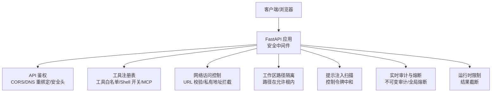
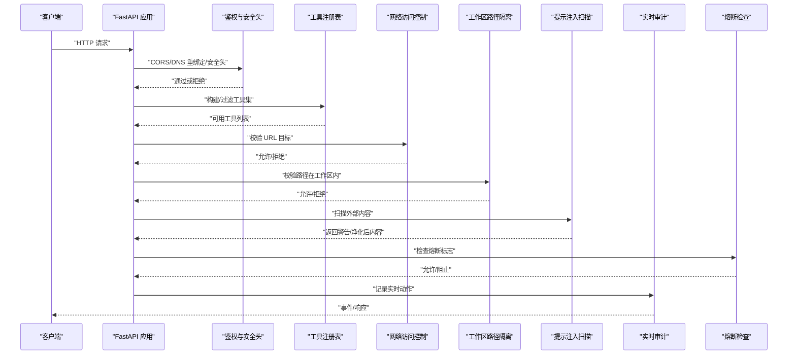
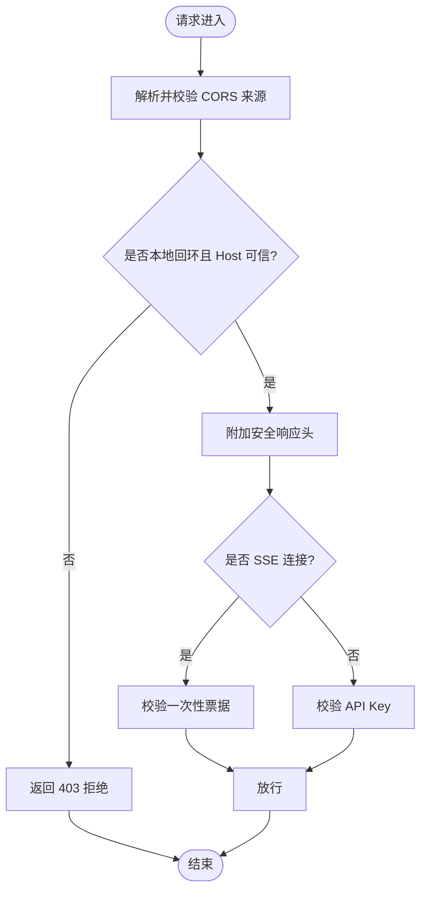
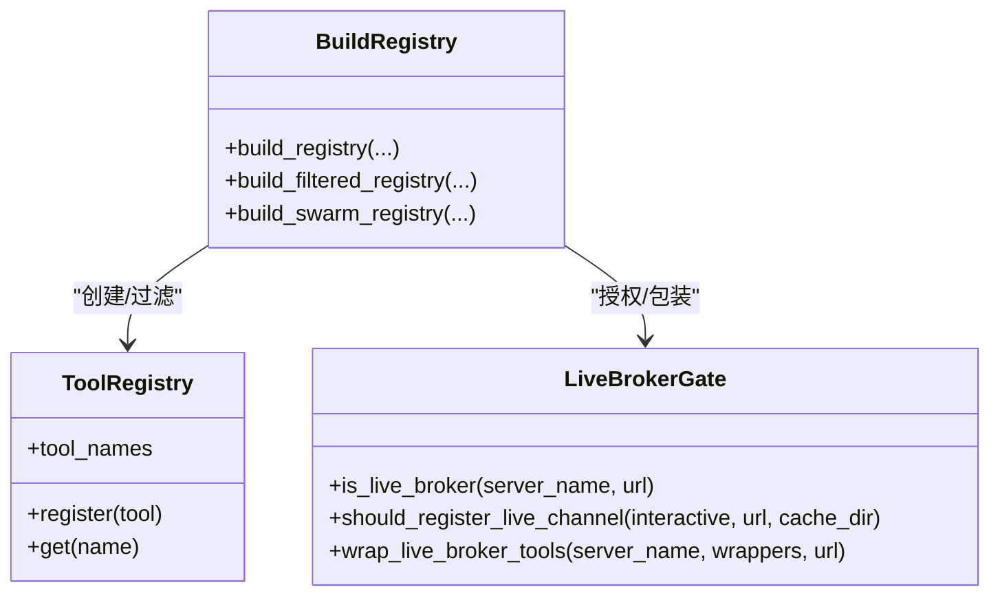
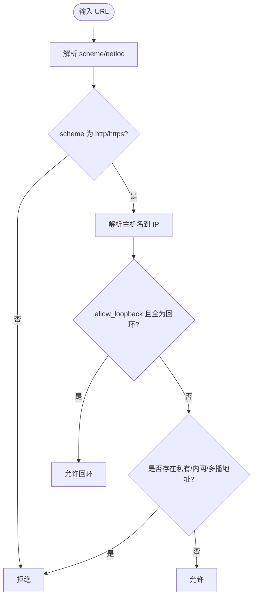
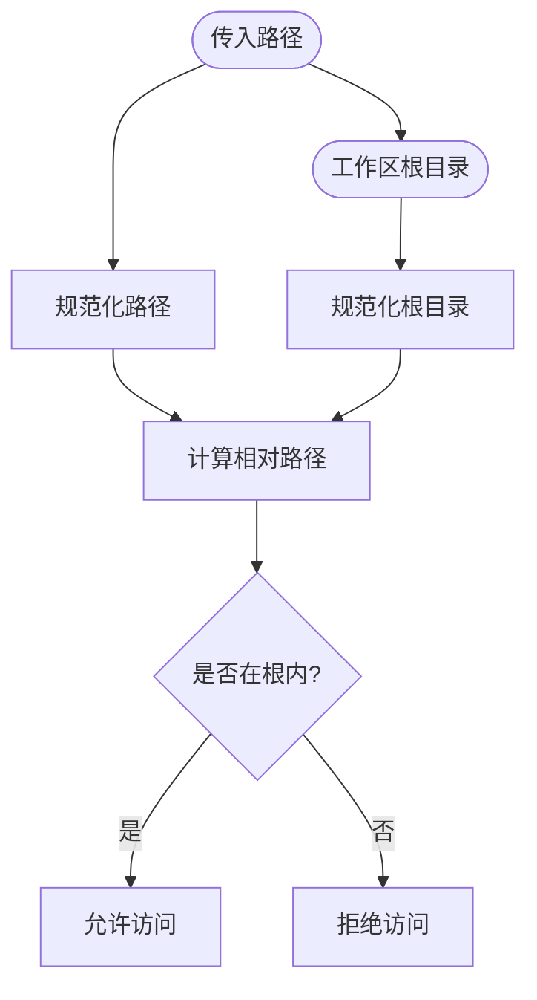
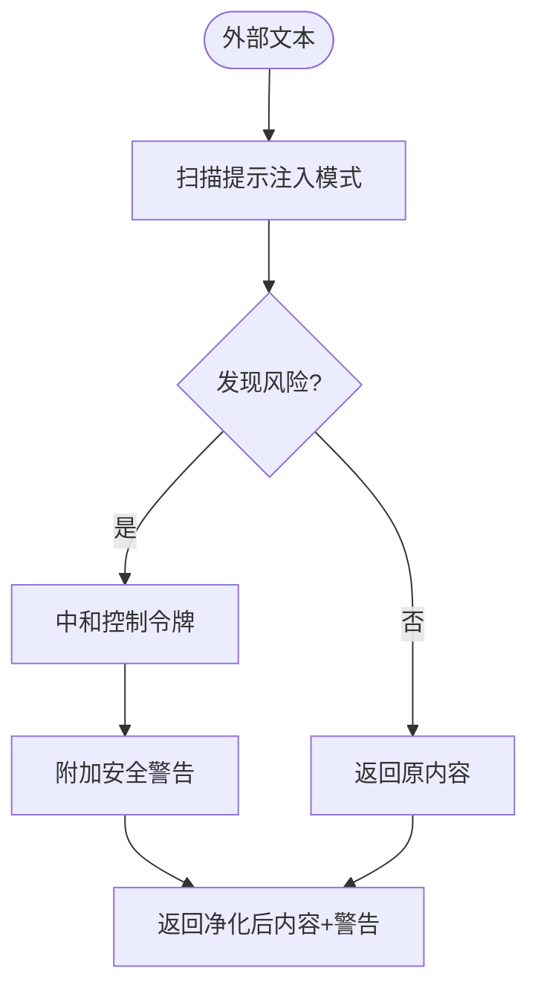
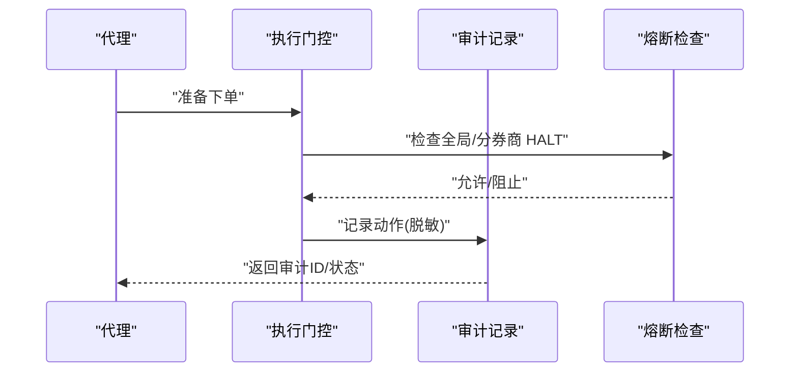
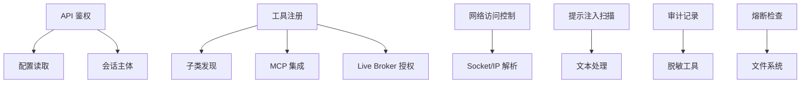

# 访问控制策略

<cite>
**本文引用的文件**
- [agent/src/api/security.py](file://agent/src/api/security.py)
- [agent/src/api/auth_routes.py](file://agent/src/api/auth_routes.py)
- [agent/src/tools/__init__.py](file://agent/src/tools/__init__.py)
- [agent/src/channels/utils.py](file://agent/src/channels/utils.py)
- [agent/src/security/scanner.py](file://agent/src/security/scanner.py)
- [agent/src/security/network.py](file://agent/src/security/network.py)
- [agent/src/security/workspace_access.py](file://agent/src/security/workspace_access.py)
- [agent/src/security/workspace_policy.py](file://agent/src/security/workspace_policy.py)
- [agent/src/live/audit.py](file://agent/src/live/audit.py)
- [agent/src/live/halt.py](file://agent/src/live/halt.py)
- [agent/src/config/limits.py](file://agent/src/config/limits.py)
</cite>

## 目录
1. [简介](#简介)
2. [项目结构](#项目结构)
3. [核心组件](#核心组件)
4. [架构总览](#架构总览)
5. [详细组件分析](#详细组件分析)
6. [依赖关系分析](#依赖关系分析)
7. [性能与可扩展性](#性能与可扩展性)
8. [故障排查指南](#故障排查指南)
9. [结论](#结论)
10. [附录：配置示例与安全实施清单](#附录：配置示例与安全实施清单)

## 简介
本文件为 Vibe-Trading 的访问控制策略提供系统化文档，覆盖工作区策略管理、网络访问控制、资源隔离机制、基于角色的访问控制（RBAC）、API 端点权限管理、工具调用限制、沙箱执行环境、文件系统访问控制、网络请求白名单、动态权限检查、审计日志记录与违规检测机制。同时给出可操作的配置示例、权限模型设计思路与安全策略落地指南，并总结常见场景的最佳实践。

## 项目结构
Vibe-Trading 的安全与访问控制能力分布在以下模块：
- API 鉴权与安全头：负责跨域、DNS 重绑定防护、安全响应头、SSE 票据、API Key 认证、本地回环信任等。
- 工具注册与调用限制：通过工具注册表实现工具级白名单、Shell 工具开关、MCP 远程工具集成与过滤。
- 网络访问控制：统一校验 URL 目标、禁止私有/内网/多播地址、可选允许严格受限的回环目标。
- 工作区路径隔离：确保文件路径位于允许的工作区根目录下。
- 提示注入扫描与内容净化：对外部内容进行提示注入模式扫描与控制令牌中和。
- 实时交易审计与熔断：对真实资金操作进行不可变审计记录，支持全局/分券商熔断。
- 运行时限制：统一截断工具结果大小，避免过大输出影响下游处理。

**图表来源**
- [agent/src/api/security.py:166-253](file://agent/src/api/security.py#L166-L253)
- [agent/src/tools/__init__.py:66-245](file://agent/src/tools/__init__.py#L66-L245)
- [agent/src/channels/utils.py:97-180](file://agent/src/channels/utils.py#L97-L180)
- [agent/src/security/scanner.py:145-220](file://agent/src/security/scanner.py#L145-L220)
- [agent/src/live/audit.py:248-352](file://agent/src/live/audit.py#L248-L352)
- [agent/src/config/limits.py:22-49](file://agent/src/config/limits.py#L22-L49)

**章节来源**
- [agent/src/api/security.py:1-670](file://agent/src/api/security.py#L1-L670)
- [agent/src/tools/__init__.py:1-365](file://agent/src/tools/__init__.py#L1-L365)
- [agent/src/channels/utils.py:1-180](file://agent/src/channels/utils.py#L1-L180)
- [agent/src/security/scanner.py:1-264](file://agent/src/security/scanner.py#L1-L264)
- [agent/src/live/audit.py:1-352](file://agent/src/live/audit.py#L1-L352)
- [agent/src/config/limits.py:1-49](file://agent/src/config/limits.py#L1-L49)

## 核心组件
- API 鉴权与安全头：提供 CORS 解析、DNS 重绑定拒绝、安全响应头（CSP/X-Frame-Options/Permissions-Policy）、SSE 一次性票据、API Key 认证、本地回环信任、跨站请求拒绝。
- 工具注册与限制：自动发现工具，按名称白名单过滤；默认禁用 shell 工具；MCP 远程工具按需接入且受工作流约束；对 live broker 工具进行授权与熔断保护。
- 网络访问控制：统一校验 URL scheme、主机名与解析 IP，禁止私有/内网/多播地址；可选严格允许回环目标。
- 工作区路径隔离：确保所有文件路径位于允许的工作区根目录内，防止越权访问。
- 提示注入扫描与内容净化：对外部文本进行提示注入模式匹配，并对控制令牌插入零宽空格以中和潜在角色边界伪造。
- 实时审计与熔断：对真实资金操作写入不可变审计日志（含哈希链），支持全局/分券商熔断文件触发即时停止。
- 运行时限制：统一截断工具结果长度，避免过大输出导致下游问题。

**章节来源**
- [agent/src/api/security.py:69-158](file://agent/src/api/security.py#L69-L158)
- [agent/src/api/security.py:166-253](file://agent/src/api/security.py#L166-L253)
- [agent/src/api/security.py:347-504](file://agent/src/api/security.py#L347-L504)
- [agent/src/tools/__init__.py:66-245](file://agent/src/tools/__init__.py#L66-L245)
- [agent/src/channels/utils.py:97-180](file://agent/src/channels/utils.py#L97-L180)
- [agent/src/security/workspace_access.py:1-15](file://agent/src/security/workspace_access.py#L1-L15)
- [agent/src/security/workspace_policy.py:1-12](file://agent/src/security/workspace_policy.py#L1-L12)
- [agent/src/security/scanner.py:145-220](file://agent/src/security/scanner.py#L145-L220)
- [agent/src/live/audit.py:248-352](file://agent/src/live/audit.py#L248-L352)
- [agent/src/live/halt.py:1-34](file://agent/src/live/halt.py#L1-L34)
- [agent/src/config/limits.py:22-49](file://agent/src/config/limits.py#L22-L49)

## 架构总览
下图展示从客户端到后端各安全组件的交互流程，包括鉴权、工具调用、网络访问控制、工作区隔离、提示注入扫描、审计与熔断。

**图表来源**
- [agent/src/api/security.py:166-253](file://agent/src/api/security.py#L166-L253)
- [agent/src/tools/__init__.py:66-245](file://agent/src/tools/__init__.py#L66-L245)
- [agent/src/channels/utils.py:97-180](file://agent/src/channels/utils.py#L97-L180)
- [agent/src/security/workspace_access.py:1-15](file://agent/src/security/workspace_access.py#L1-L15)
- [agent/src/security/scanner.py:145-220](file://agent/src/security/scanner.py#L145-L220)
- [agent/src/live/audit.py:248-352](file://agent/src/live/audit.py#L248-L352)
- [agent/src/live/halt.py:1-34](file://agent/src/live/halt.py#L1-L34)

## 详细组件分析

### API 鉴权与安全头
- CORS 解析与额外来源：支持基础来源与可选追加来源，禁止凭据模式下使用通配符。
- DNS 重绑定防护：拒绝不受信任的 Host 头，防止绕过本地鉴权。
- 安全响应头：强制 CSP、X-Frame-Options、Permissions-Policy、Referrer-Policy，文档页面有窄化例外。
- SSE 票据：浏览器无法发送 Authorization 头时，通过一次性票据建立 EventSource 连接，票据短期有效且单次使用。
- API Key 认证：支持 Header/Query（受控）方式，未配置密钥时仅信任本地回环；非本地访问必须提供密钥。
- 跨站请求拒绝：对不安全浏览器方法或非同源 Origin 的请求直接拒绝。

**图表来源**
- [agent/src/api/security.py:69-158](file://agent/src/api/security.py#L69-L158)
- [agent/src/api/security.py:166-253](file://agent/src/api/security.py#L166-L253)
- [agent/src/api/security.py:300-341](file://agent/src/api/security.py#L300-L341)
- [agent/src/api/security.py:347-504](file://agent/src/api/security.py#L347-L504)

**章节来源**
- [agent/src/api/security.py:69-158](file://agent/src/api/security.py#L69-L158)
- [agent/src/api/security.py:166-253](file://agent/src/api/security.py#L166-L253)
- [agent/src/api/security.py:300-341](file://agent/src/api/security.py#L300-L341)
- [agent/src/api/security.py:347-504](file://agent/src/api/security.py#L347-L504)
- [agent/src/api/auth_routes.py:21-56](file://agent/src/api/auth_routes.py#L21-L56)

### 工具注册与调用限制
- 自动发现与白名单：通过 BaseTool 子类自动发现工具，支持按名称构建过滤后的注册表。
- Shell 工具策略：默认禁用 bash/background_run/cancel_background，需显式启用。
- MCP 远程工具：按 agent_config 配置接入，失败隔离不影响其他服务器；live broker 工具需授权并通过熔断检查。
- Swarm 工作器：严格遵循预设工具白名单，仅合并 operator 暴露的 MCP 工具。

**图表来源**
- [agent/src/tools/__init__.py:66-245](file://agent/src/tools/__init__.py#L66-L245)

**章节来源**
- [agent/src/tools/__init__.py:66-245](file://agent/src/tools/__init__.py#L66-L245)

### 网络访问控制
- URL 校验：仅允许 http/https，必须有域名，解析后禁止私有/内网/多播地址。
- 回环目标：仅在 allow_loopback=True 且主机名为字面回环且所有解析地址均为回环时允许。
- 兼容接口：提供 validate_resolved_url 作为旧接口别名。

**图表来源**
- [agent/src/channels/utils.py:97-180](file://agent/src/channels/utils.py#L97-L180)

**章节来源**
- [agent/src/channels/utils.py:97-180](file://agent/src/channels/utils.py#L97-L180)
- [agent/src/security/network.py:1-11](file://agent/src/security/network.py#L1-L11)

### 工作区路径隔离
- 路径校验：确保文件路径位于允许的工作区根目录内，防止越权访问。
- 兼容性导出：为通道适配器提供 is_path_within 的兼容导出。

**图表来源**
- [agent/src/channels/utils.py:44-50](file://agent/src/channels/utils.py#L44-L50)
- [agent/src/security/workspace_policy.py:1-12](file://agent/src/security/workspace_policy.py#L1-L12)
- [agent/src/security/workspace_access.py:1-15](file://agent/src/security/workspace_access.py#L1-L15)

**章节来源**
- [agent/src/channels/utils.py:44-50](file://agent/src/channels/utils.py#L44-L50)
- [agent/src/security/workspace_policy.py:1-12](file://agent/src/security/workspace_policy.py#L1-L12)
- [agent/src/security/workspace_access.py:1-15](file://agent/src/security/workspace_access.py#L1-L15)

### 提示注入扫描与内容净化
- 规则扫描：识别指令覆盖、系统提示泄露、角色冒充、密钥泄露、工具滥用等模式。
- 控制令牌中和：对 ChatML/Llama/Gemma 等控制令牌插入零宽空格，破坏词法匹配但不改变视觉呈现。
- 载荷标注：对指定字段进行扫描与中和，并在结果中附加安全警告列表。

**图表来源**
- [agent/src/security/scanner.py:145-220](file://agent/src/security/scanner.py#L145-L220)

**章节来源**
- [agent/src/security/scanner.py:145-220](file://agent/src/security/scanner.py#L145-L220)

### 实时审计与熔断
- 不可变审计：每个真实资金动作写入独立审计日志，支持哈希链防篡改；敏感信息预脱敏。
- 三路扇出：合规账本、运行期 Trace、前端事件总线。
- 熔断机制：全局或分券商存在 HALT 文件即立即阻止下单等操作，即使代理循环卡住也能生效。

**图表来源**
- [agent/src/live/audit.py:248-352](file://agent/src/live/audit.py#L248-L352)
- [agent/src/live/halt.py:1-34](file://agent/src/live/halt.py#L1-L34)

**章节来源**
- [agent/src/live/audit.py:248-352](file://agent/src/live/audit.py#L248-L352)
- [agent/src/live/halt.py:1-34](file://agent/src/live/halt.py#L1-L34)

### 运行时限制
- 工具结果截断：统一限制单个工具结果字符数，避免过大输出影响下游处理。
- 通知信息：截断时附带说明，提示如何缩小请求或使用分页参数。

**章节来源**
- [agent/src/config/limits.py:22-49](file://agent/src/config/limits.py#L22-L49)

## 依赖关系分析
- API 鉴权依赖配置读取、会话主体模型、FastAPI 安全组件。
- 工具注册依赖 BaseTool 子类发现、MCP 集成、live broker 授权与熔断。
- 网络访问控制依赖配置路径与 socket/IP 解析。
- 提示注入扫描为纯文本处理，无外部依赖。
- 审计记录依赖路径、JSON 序列化、可选治理链与脱敏工具。
- 熔断检查依赖文件系统 sentinel 文件。

**图表来源**
- [agent/src/api/security.py:1-670](file://agent/src/api/security.py#L1-L670)
- [agent/src/tools/__init__.py:1-365](file://agent/src/tools/__init__.py#L1-L365)
- [agent/src/channels/utils.py:1-180](file://agent/src/channels/utils.py#L1-L180)
- [agent/src/security/scanner.py:1-264](file://agent/src/security/scanner.py#L1-L264)
- [agent/src/live/audit.py:1-352](file://agent/src/live/audit.py#L1-L352)
- [agent/src/live/halt.py:1-34](file://agent/src/live/halt.py#L1-L34)

**章节来源**
- [agent/src/api/security.py:1-670](file://agent/src/api/security.py#L1-L670)
- [agent/src/tools/__init__.py:1-365](file://agent/src/tools/__init__.py#L1-L365)
- [agent/src/channels/utils.py:1-180](file://agent/src/channels/utils.py#L1-L180)
- [agent/src/security/scanner.py:1-264](file://agent/src/security/scanner.py#L1-L264)
- [agent/src/live/audit.py:1-352](file://agent/src/live/audit.py#L1-L352)
- [agent/src/live/halt.py:1-34](file://agent/src/live/halt.py#L1-L34)

## 性能与可扩展性
- 鉴权中间件轻量：CORS 与安全头计算开销小，适合高并发。
- 工具注册缓存：子类发现结果缓存，避免重复导入与扫描。
- 网络校验短路：非法 scheme 或缺少域名快速拒绝。
- 审计落盘 fsync：保证持久性，必要时可权衡性能（如批量写入）。
- 结果截断：减少大对象传输与处理成本。

[本节提供通用指导，无需特定文件分析]

## 故障排查指南
- 403 跨站请求：检查 Origin 与 sec-fetch-site 头，确认同源或本地回环。
- 401 无效 API Key：确认已配置密钥且请求携带正确凭证；SSE 连接需先获取票据。
- 网络请求被拒：确认 URL scheme 为 http/https，目标非私有/内网/多播；如需回环，确保 allow_loopback 且字面回环。
- 文件访问被拒：确认路径在工作区根目录内。
- 提示注入警告：检查外部内容是否包含指令覆盖或控制令牌，必要时调整输入。
- 审计缺失：检查审计文件路径权限与 fsync 日志；确认事件回调与 trace writer 是否配置。
- 熔断触发：检查全局或分券商 HALT 文件是否存在。

**章节来源**
- [agent/src/api/security.py:166-253](file://agent/src/api/security.py#L166-L253)
- [agent/src/api/security.py:347-504](file://agent/src/api/security.py#L347-L504)
- [agent/src/channels/utils.py:97-180](file://agent/src/channels/utils.py#L97-L180)
- [agent/src/security/workspace_access.py:1-15](file://agent/src/security/workspace_access.py#L1-L15)
- [agent/src/security/scanner.py:145-220](file://agent/src/security/scanner.py#L145-L220)
- [agent/src/live/audit.py:248-352](file://agent/src/live/audit.py#L248-L352)
- [agent/src/live/halt.py:1-34](file://agent/src/live/halt.py#L1-L34)

## 结论
Vibe-Trading 的访问控制体系以 API 鉴权为核心，结合工具白名单、网络访问控制、工作区路径隔离、提示注入扫描、实时审计与熔断机制，形成多层次安全防护。通过可配置的 CORS、CSP、SSE 票据与 API Key，既保障开发便利又满足生产安全需求。建议在生产环境中始终启用 API Key、严格限制 CORS、启用安全头、开启审计与熔断，并定期审查工具白名单与 MCP 配置。

[本节为总结，无需特定文件分析]

## 附录：配置示例与安全实施清单
- 配置项建议
  - 设置 API_AUTH_KEY：对所有非本地访问强制鉴权。
  - 配置 CORS_ORIGINS 与 VIBE_TRADING_EXTRA_CORS_ORIGINS：明确允许的 Web UI 来源，禁止通配符。
  - 启用 VIBE_TRADING_CSP_REPORT_ONLY=1：在灰度阶段使用报告模式，稳定后切换为强制模式。
  - 限制 include_shell_tools：仅在受控 CLI 环境启用 shell 工具。
  - 配置 MCP 服务器：仅暴露必要工具，live broker 需授权并通过熔断检查。
  - 启用审计与熔断：确保审计文件可写且权限最小化，部署前检查 HALT 文件不存在。
  - 调整工具结果限制：根据下游处理能力调整 TOOL_RESULT_LIMIT。

- 安全实施清单
  - 启用 API Key 与 SSE 票据流程。
  - 配置严格 CSP 与 X-Frame-Options。
  - 验证网络访问控制策略，禁止私有/内网/多播地址。
  - 检查工作区路径隔离是否生效。
  - 启用提示注入扫描并处理安全警告。
  - 配置审计日志与哈希链，定期校验完整性。
  - 设置熔断文件管理机制，确保紧急情况下可快速停止交易。

[本节为通用指导，无需特定文件分析]