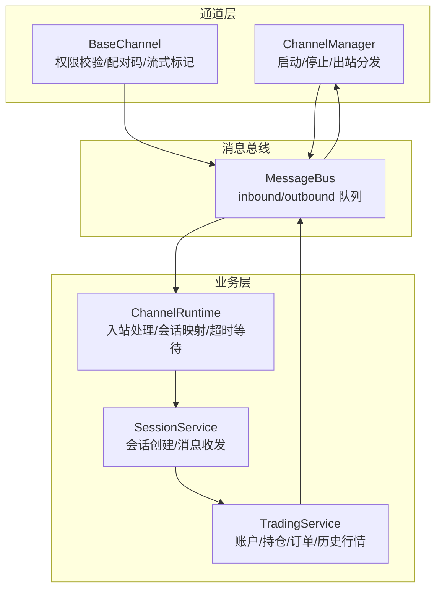
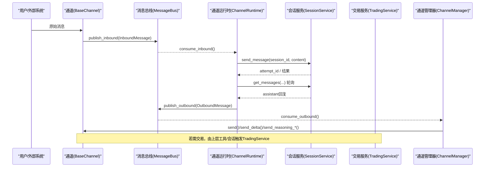
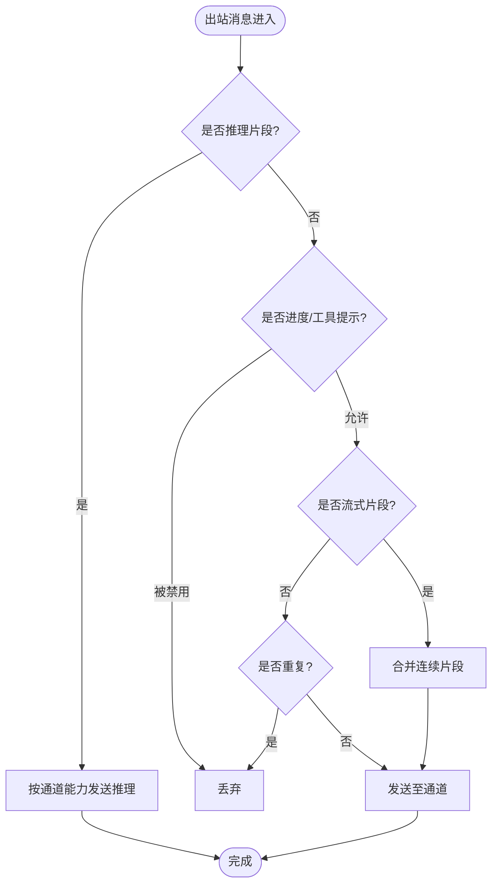
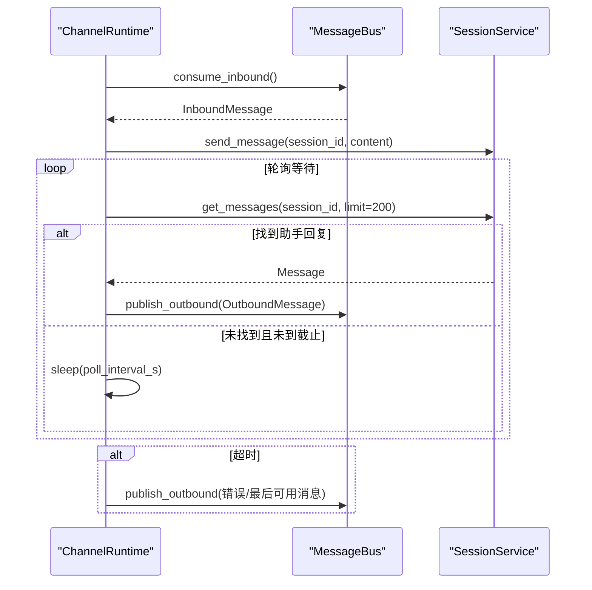
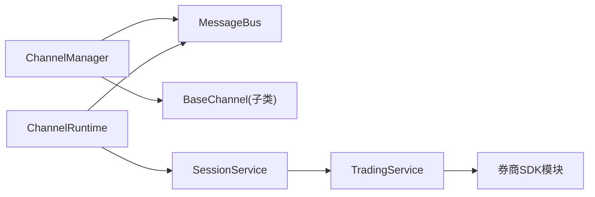

# 事件驱动管道

<cite>
**本文引用的文件**
- [agent/src/channels/bus/events.py](file://agent/src/channels/bus/events.py)
- [agent/src/channels/bus/queue.py](file://agent/src/channels/bus/queue.py)
- [agent/src/channels/runtime.py](file://agent/src/channels/runtime.py)
- [agent/src/channels/manager.py](file://agent/src/channels/manager.py)
- [agent/src/channels/base.py](file://agent/src/channels/base.py)
- [agent/src/channels/__init__.py](file://agent/src/channels/__init__.py)
- [agent/src/trading/service.py](file://agent/src/trading/service.py)
- [agent/src/trading/types.py](file://agent/src/trading/types.py)
</cite>

## 目录
1. [简介](#简介)
2. [项目结构](#项目结构)
3. [核心组件](#核心组件)
4. [架构总览](#架构总览)
5. [详细组件分析](#详细组件分析)
6. [依赖关系分析](#依赖关系分析)
7. [性能与背压控制](#性能与背压控制)
8. [故障诊断与监控](#故障诊断与监控)
9. [典型事件流场景](#典型事件流场景)
10. [结论](#结论)

## 简介
本架构文档聚焦 Vibe-Trading 的事件驱动管道，围绕事件总线设计模式、消息队列实现、事件分发机制展开。文档说明事件类型定义、序列化格式与版本兼容策略，解释异步事件处理、背压控制与流量管理，并覆盖事件路由、过滤与转换管道。同时提供事件监控、调试与故障诊断方法，并以市场数据流、交易信号流和系统状态流为例展示端到端事件链路。

## 项目结构
Vibe-Trading 的事件驱动管道主要由“通道层（Channel）—消息总线（MessageBus）—会话服务（SessionService）—交易服务（Trading Service）”构成：
- 通道层负责接入多 IM 平台，将外部消息转换为内部 InboundMessage，并将响应以 OutboundMessage 形式写回。
- 消息总线使用 asyncio.Queue 实现进程内解耦的入队/出队，承载双向消息流。
- 会话服务维护对话上下文，接收业务处理结果并持久化。
- 交易服务通过统一接口对接多家券商 SDK，并在实盘路径上执行风控与审计。

**图表来源**
- [agent/src/channels/manager.py:36-229](file://agent/src/channels/manager.py#L36-L229)
- [agent/src/channels/base.py:179-215](file://agent/src/channels/base.py#L179-L215)
- [agent/src/channels/bus/queue.py:8-44](file://agent/src/channels/bus/queue.py#L8-L44)
- [agent/src/channels/runtime.py:34-277](file://agent/src/channels/runtime.py#L34-L277)
- [agent/src/trading/service.py:42-225](file://agent/src/trading/service.py#L42-L225)

**章节来源**
- [agent/src/channels/__init__.py:1-49](file://agent/src/channels/__init__.py#L1-L49)
- [agent/src/channels/bus/events.py:1-55](file://agent/src/channels/bus/events.py#L1-L55)
- [agent/src/channels/bus/queue.py:1-44](file://agent/src/channels/bus/queue.py#L1-L44)

## 核心组件
- 事件模型
  - InboundMessage：来自聊天通道的入站消息，包含渠道、发送者、会话标识、内容、时间戳、媒体与元数据。
  - OutboundMessage：出站消息，包含目标渠道、会话、内容、回复引用、媒体、按钮与元数据；元数据用于路由、进度、流式片段、重试等。
- 消息总线
  - MessageBus：基于 asyncio.Queue 的双向队列，提供 publish/consume 接口与队列长度观测。
- 通道管理器
  - ChannelManager：发现并启停各通道，负责出站消息的分发、去重、合并与重试。
- 通道运行时
  - ChannelRuntime：消费入站消息，解析会话映射，调用会话服务，轮询等待助手回复，再写出站消息。
- 基础通道
  - BaseChannel：抽象通道基类，封装权限校验、配对码流程、流式能力标记等通用逻辑。
- 交易服务
  - TradingService：统一封装账户、持仓、订单、报价、历史行情等读取操作，以及下单、撤销、平仓等写入操作，并在实盘路径中集成风控与审计。

**章节来源**
- [agent/src/channels/bus/events.py:20-55](file://agent/src/channels/bus/events.py#L20-L55)
- [agent/src/channels/bus/queue.py:8-44](file://agent/src/channels/bus/queue.py#L8-L44)
- [agent/src/channels/manager.py:36-229](file://agent/src/channels/manager.py#L36-L229)
- [agent/src/channels/runtime.py:34-277](file://agent/src/channels/runtime.py#L34-L277)
- [agent/src/channels/base.py:179-215](file://agent/src/channels/base.py#L179-L215)
- [agent/src/trading/service.py:42-225](file://agent/src/trading/service.py#L42-L225)

## 架构总览
下图展示了从外部消息到交易执行的完整事件流，包括入站路由、会话处理、出站分发与交易读写。

**图表来源**
- [agent/src/channels/base.py:179-215](file://agent/src/channels/base.py#L179-L215)
- [agent/src/channels/bus/queue.py:19-33](file://agent/src/channels/bus/queue.py#L19-L33)
- [agent/src/channels/runtime.py:114-210](file://agent/src/channels/runtime.py#L114-L210)
- [agent/src/channels/manager.py:283-369](file://agent/src/channels/manager.py#L283-L369)
- [agent/src/trading/service.py:42-225](file://agent/src/trading/service.py#L42-L225)

## 详细组件分析

### 事件模型与序列化
- InboundMessage/OutboundMessage 为 dataclass 对象，字段包含 channel、chat_id、content、metadata 等。metadata 支持结构化 UI 负载、运行时控制键、流式片段标记、重试等待等。
- 序列化格式：
  - 内存传输：对象直接传递。
  - 持久化/跨进程：JSON 序列化（例如会话映射文件使用 JSON）。
- 版本兼容性策略：
  - 扩展性：通过 metadata 字典新增键，旧客户端忽略未知键。
  - 向后兼容：保留旧字段，新增可选字段；对必需字段进行默认值或空集合初始化。
  - 幂等与追踪：通过 message_id、attempt_id、origin_message_id 等元数据进行关联与去重。

**章节来源**
- [agent/src/channels/bus/events.py:8-55](file://agent/src/channels/bus/events.py#L8-L55)
- [agent/src/channels/runtime.py:279-295](file://agent/src/channels/runtime.py#L279-L295)

### 消息队列与背压
- MessageBus 使用 asyncio.Queue，天然具备容量限制与生产者/消费者背压：
  - 生产者阻塞：当队列满时 put 会阻塞，避免内存无限增长。
  - 消费者拉取：get 阻塞直到有消息，保证有序消费。
- 可观测性：提供 inbound_size/outbound_size 属性用于监控积压情况。
- 建议：
  - 根据峰值吞吐设置合理队列大小。
  - 在监控告警中关注队列长度突增，及时扩容消费者或限流上游。

**章节来源**
- [agent/src/channels/bus/queue.py:8-44](file://agent/src/channels/bus/queue.py#L8-L44)

### 事件路由、过滤与转换管道
- 路由：
  - 出站按 channel 字段路由到对应通道实例。
  - 会话映射：ChannelRuntime 维护 channel:chat_id -> session_id 的映射，确保同一会话上下文。
- 过滤：
  - 重复抑制：基于内容指纹与 message_id/origin_message_id 去重，避免重复推送。
  - 流式合并：对 _stream_delta 片段进行聚合，减少 API 调用次数。
  - 进度/工具提示过滤：根据通道配置决定是否发送进度与工具提示。
- 转换：
  - 元数据注入：运行时注入 attempt_id、session_id、message_id、_channel_runtime 等。
  - 流式标记：基础通道在支持流式时注入 _wants_stream，管理器据此选择 send_delta 等专用接口。

**图表来源**
- [agent/src/channels/manager.py:283-369](file://agent/src/channels/manager.py#L283-L369)
- [agent/src/channels/base.py:179-215](file://agent/src/channels/base.py#L179-L215)

**章节来源**
- [agent/src/channels/manager.py:254-419](file://agent/src/channels/manager.py#L254-L419)
- [agent/src/channels/base.py:179-215](file://agent/src/channels/base.py#L179-L215)

### 异步事件处理与超时控制
- 入站处理：
  - ChannelRuntime 持续消费入站队列，为每条消息创建独立任务处理，避免阻塞主循环。
  - 会话忙时返回友好提示，而非抛出异常。
- 超时控制：
  - 等待助手回复采用轮询 + 截止时间策略，避免无限等待。
  - 支持配置 reply_timeout_s 与 poll_interval_s。
- 错误处理：
  - 捕获取消与业务异常，统一写出站错误消息，便于前端展示与日志追踪。

**图表来源**
- [agent/src/channels/runtime.py:114-277](file://agent/src/channels/runtime.py#L114-L277)

**章节来源**
- [agent/src/channels/runtime.py:114-277](file://agent/src/channels/runtime.py#L114-L277)

### 交易事件与风控审计
- 读操作：账户快照、持仓、订单、报价、历史行情等通过 TradingService 统一暴露，适配不同券商 SDK。
- 写操作：下单、撤销、平仓等在实盘路径中经过指令意图构建、风控门控与审计记录。
- 环境隔离：纸面环境与实盘环境分别走不同路径，实盘路径强制审计与失败关闭策略。

**章节来源**
- [agent/src/trading/service.py:42-225](file://agent/src/trading/service.py#L42-L225)
- [agent/src/trading/service.py:279-342](file://agent/src/trading/service.py#L279-L342)
- [agent/src/trading/types.py:1-52](file://agent/src/trading/types.py#L1-L52)

## 依赖关系分析
- ChannelManager 依赖 MessageBus 与具体通道实现，负责生命周期管理与出站分发。
- ChannelRuntime 依赖 MessageBus 与 SessionService，负责入站处理与会话映射。
- BaseChannel 提供通用权限与配对逻辑，具体通道继承实现。
- TradingService 依赖各券商 SDK 模块，并通过统一接口对外暴露。

**图表来源**
- [agent/src/channels/manager.py:36-229](file://agent/src/channels/manager.py#L36-L229)
- [agent/src/channels/runtime.py:34-277](file://agent/src/channels/runtime.py#L34-L277)
- [agent/src/channels/base.py:179-215](file://agent/src/channels/base.py#L179-L215)
- [agent/src/trading/service.py:42-225](file://agent/src/trading/service.py#L42-L225)

**章节来源**
- [agent/src/channels/manager.py:36-229](file://agent/src/channels/manager.py#L36-L229)
- [agent/src/channels/runtime.py:34-277](file://agent/src/channels/runtime.py#L34-L277)
- [agent/src/channels/base.py:179-215](file://agent/src/channels/base.py#L179-L215)
- [agent/src/trading/service.py:42-225](file://agent/src/trading/service.py#L42-L225)

## 性能与背压控制
- 背压来源：
  - 入站队列满导致生产者阻塞，防止内存膨胀。
  - 出站队列堆积时，管理器合并流式片段与抑制重复，降低下游压力。
- 流量管理：
  - 出站重试采用指数退避，避免雪崩。
  - 流式片段合并减少 API 调用频率。
  - 进度/工具提示可按通道配置开关，减少不必要流量。
- 监控指标：
  - 队列长度：inbound_size、outbound_size。
  - 通道状态：enabled、loaded、running、display_name。
  - 运行时状态：running、session_count、channels 子状态。

**章节来源**
- [agent/src/channels/bus/queue.py:35-44](file://agent/src/channels/bus/queue.py#L35-L44)
- [agent/src/channels/manager.py:283-419](file://agent/src/channels/manager.py#L283-L419)
- [agent/src/channels/runtime.py:104-112](file://agent/src/channels/runtime.py#L104-L112)

## 故障诊断与监控
- 常见故障定位：
  - 队列积压：检查 inbound_size/outbound_size，确认消费者是否卡住或下游通道不可用。
  - 重复推送：检查出站去重逻辑与 message_id/origin_message_id 是否正确传递。
  - 超时未回复：检查 _wait_for_reply 的截止时间与轮询间隔，确认会话服务是否正常。
  - 通道启动失败：查看 ChannelManager 的状态输出，定位 unavailable/error 原因。
- 监控与调试：
  - 使用 status() 获取运行态与通道状态。
  - 通过日志观察重试、抑制、错误信息。
  - 结合会话服务消息列表，核对 attempt_id 与 session_id 的关联。

**章节来源**
- [agent/src/channels/runtime.py:104-112](file://agent/src/channels/runtime.py#L104-L112)
- [agent/src/channels/manager.py:460-473](file://agent/src/channels/manager.py#L460-L473)
- [agent/src/channels/runtime.py:211-245](file://agent/src/channels/runtime.py#L211-L245)

## 典型事件流场景

### 市场数据流
- 数据源通过加载器或连接器产生 OHLCV/报价等数据，作为事件进入系统。
- 事件经会话或因子计算处理后，可能生成信号事件，进入交易管线。
- 关键节点：数据接入 → 标准化 → 特征/信号计算 → 信号事件 → 交易决策。

[本节为概念性描述，不直接分析具体文件]

### 交易信号流
- 信号引擎产出信号后，通过会话或工具调用触发下单流程。
- 下单前进行指令意图构建、风控门控与审计记录，最终到达券商 SDK。
- 关键节点：信号 → 意图 → 风控 → 下单 → 审计 → 回执。

**章节来源**
- [agent/src/trading/service.py:279-342](file://agent/src/trading/service.py#L279-L342)

### 系统状态流
- 通道状态、队列长度、会话数量等状态事件可通过 status() 暴露。
- 运行时错误、重试、抑制等事件通过日志与出站元数据体现。
- 关键节点：采集 → 聚合 → 上报 → 告警。

**章节来源**
- [agent/src/channels/runtime.py:104-112](file://agent/src/channels/runtime.py#L104-L112)
- [agent/src/channels/manager.py:460-473](file://agent/src/channels/manager.py#L460-L473)

## 结论
Vibe-Trading 的事件驱动管道以消息总线为核心，实现了通道层与业务层的解耦，具备完善的异步处理、背压控制、流量管理与可观测性。通过标准化的事件模型与元数据机制，系统支持灵活的路由、过滤与转换，并能可靠地对接多种券商 SDK。建议在部署中重点关注队列积压、超时与重复推送问题，结合监控与日志快速定位与恢复。