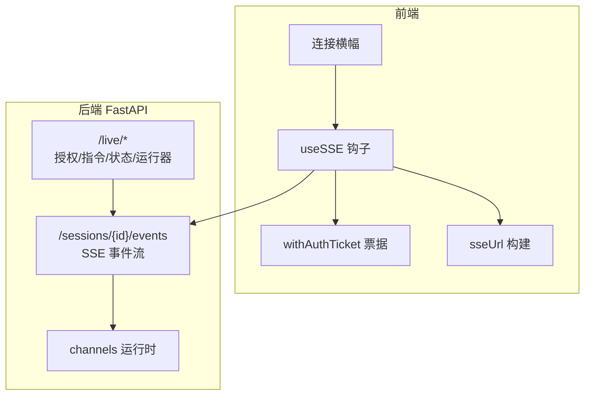
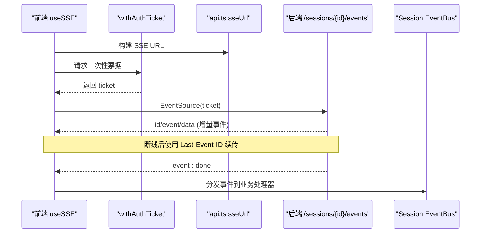
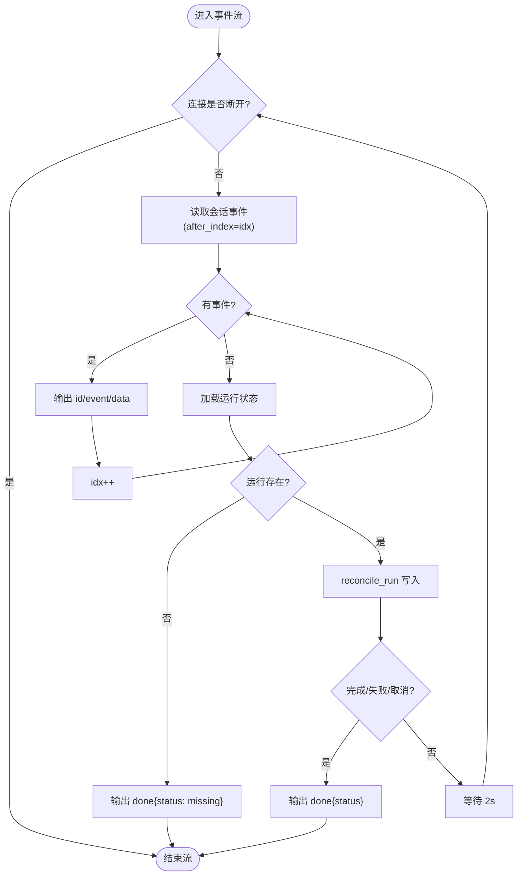
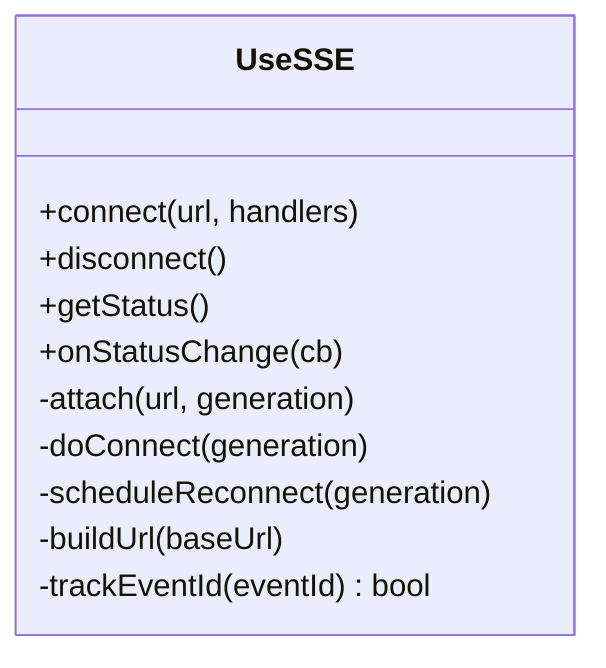
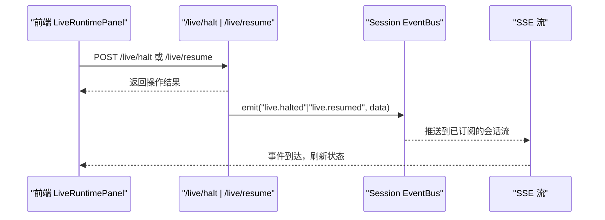
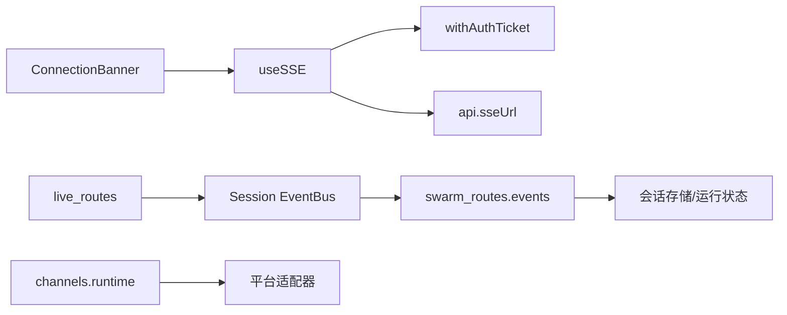

# 实时数据流

<cite>
**本文引用的文件**
- [agent/src/api/swarm_routes.py](file://agent/src/api/swarm_routes.py)
- [frontend/src/hooks/useSSE.ts](file://frontend/src/hooks/useSSE.ts)
- [frontend/src/lib/apiAuth.ts](file://frontend/src/lib/apiAuth.ts)
- [frontend/src/lib/api.ts](file://frontend/src/lib/api.ts)
- [frontend/src/components/layout/ConnectionBanner.tsx](file://frontend/src/components/layout/ConnectionBanner.tsx)
- [agent/src/api/live_routes.py](file://agent/src/api/live_routes.py)
- [agent/src/channels/runtime.py](file://agent/src/channels/runtime.py)
- [agent/src/market_data.py](file://agent/src/market_data.py)
</cite>

## 目录
1. [简介](#简介)
2. [项目结构](#项目结构)
3. [核心组件](#核心组件)
4. [架构总览](#架构总览)
5. [详细组件分析](#详细组件分析)
6. [依赖关系分析](#依赖关系分析)
7. [性能与优化](#性能与优化)
8. [故障排查指南](#故障排查指南)
9. [结论](#结论)
10. [附录：典型实时应用场景](#附录典型实时应用场景)

## 简介
本架构文档聚焦 Vibe-Trading 的实时数据流系统，覆盖 WebSocket/SSE 连接管理、事件推送机制、前端实时通信钩子、状态同步与更新策略，以及重连、负载均衡、带宽优化与延迟控制。同时提供监控、性能分析与故障排查方法，并展示行情推送、交易执行反馈与系统状态监控等典型场景。

## 项目结构
- 后端（FastAPI）
  - SSE 事件流：会话事件通过 /sessions/{id}/events 以 text/event-stream 输出，支持 Last-Event-ID 断点续传与“done”结束事件。
  - 实时交易通道：/live/* 提供授权、指令、状态查询与运行器启停；内部将关键动作广播到现有 Session EventBus，复用 SSE 流。
  - IM 通道运行时：channels 运行时负责启动/停止平台适配器与消费循环。
- 前端（React + TypeScript）
  - useSSE 钩子：封装 EventSource 生命周期、指数退避重连、LRU 去重、Last-Event-ID 续传、单用票据认证。
  - API 辅助：获取 SSE URL、为无头浏览器 EventSource 生成一次性 ticket。
  - UI 组件：连接状态横幅，提示重连与断开。

**图表来源**
- [agent/src/api/swarm_routes.py:187-211](file://agent/src/api/swarm_routes.py#L187-L211)
- [frontend/src/hooks/useSSE.ts:27-214](file://frontend/src/hooks/useSSE.ts#L27-L214)
- [frontend/src/lib/apiAuth.ts:18-53](file://frontend/src/lib/apiAuth.ts#L18-L53)
- [frontend/src/lib/api.ts:181-188](file://frontend/src/lib/api.ts#L181-L188)
- [frontend/src/components/layout/ConnectionBanner.tsx:1-43](file://frontend/src/components/layout/ConnectionBanner.tsx#L1-L43)
- [agent/src/api/live_routes.py:631-720](file://agent/src/api/live_routes.py#L631-L720)
- [agent/src/channels/runtime.py:72-102](file://agent/src/channels/runtime.py#L72-L102)

**章节来源**
- [agent/src/api/swarm_routes.py:187-211](file://agent/src/api/swarm_routes.py#L187-L211)
- [frontend/src/hooks/useSSE.ts:27-214](file://frontend/src/hooks/useSSE.ts#L27-L214)
- [frontend/src/lib/apiAuth.ts:18-53](file://frontend/src/lib/apiAuth.ts#L18-L53)
- [frontend/src/lib/api.ts:181-188](file://frontend/src/lib/api.ts#L181-L188)
- [frontend/src/components/layout/ConnectionBanner.tsx:1-43](file://frontend/src/components/layout/ConnectionBanner.tsx#L1-L43)
- [agent/src/api/live_routes.py:631-720](file://agent/src/api/live_routes.py#L631-L720)
- [agent/src/channels/runtime.py:72-102](file://agent/src/channels/runtime.py#L72-L102)

## 核心组件
- SSE 事件流服务（后端）
  - 基于 FastAPI StreamingResponse 持续输出事件，携带 id、event、data 字段，支持 Last-Event-ID 续传与 done 结束事件。
- 前端 SSE 钩子（useSSE）
  - 自动重连、指数退避、LRU 去重、Last-Event-ID 续传、事件类型白名单订阅、单用票据认证。
- 实时交易通道（/live/*）
  - 授权、指令（暂停/恢复）、状态查询、运行器启停；所有关键动作通过 Session EventBus 广播，复用 SSE 流。
- IM 通道运行时
  - 统一启动/停止平台适配器与消费循环，支撑消息通道能力。

**章节来源**
- [agent/src/api/swarm_routes.py:187-211](file://agent/src/api/swarm_routes.py#L187-L211)
- [frontend/src/hooks/useSSE.ts:27-214](file://frontend/src/hooks/useSSE.ts#L27-L214)
- [agent/src/api/live_routes.py:631-720](file://agent/src/api/live_routes.py#L631-L720)
- [agent/src/channels/runtime.py:72-102](file://agent/src/channels/runtime.py#L72-L102)

## 架构总览
下图展示了从前端连接到后端事件流的完整时序，包括票据交换、事件订阅、断线重连与续传。

**图表来源**
- [frontend/src/lib/api.ts:181-188](file://frontend/src/lib/api.ts#L181-L188)
- [frontend/src/lib/apiAuth.ts:18-53](file://frontend/src/lib/apiAuth.ts#L18-L53)
- [agent/src/api/swarm_routes.py:187-211](file://agent/src/api/swarm_routes.py#L187-L211)

## 详细组件分析

### SSE 事件流（后端）
- 功能要点
  - 持续读取会话事件，按序递增 id，并以 event 类型区分不同事件。
  - 客户端可携带 Last-Event-ID 实现断点续传。
  - 当运行结束或异常时发送 done 事件，避免前端无限等待。
- 错误处理
  - 若运行缺失或失败，发送包含状态的 done 事件，便于前端收敛 UI。
- 性能考虑
  - 每次轮询间隔固定，避免高频 I/O；对长时间运行的任务进行 reconcile 清理。

**图表来源**
- [agent/src/api/swarm_routes.py:187-211](file://agent/src/api/swarm_routes.py#L187-L211)

**章节来源**
- [agent/src/api/swarm_routes.py:187-211](file://agent/src/api/swarm_routes.py#L187-L211)

### 前端 SSE 钩子（useSSE）
- 功能要点
  - 自动重连：指数退避，最大重试间隔上限。
  - LRU 去重：基于 lastEventId 的去重集合，防止重复渲染。
  - Last-Event-ID 续传：重连时附加参数，服务端据此续发。
  - 事件类型白名单：仅订阅后端实际发出的事件类型，减少无关开销。
  - 单用票据认证：在需要鉴权时先换取 ticket，再建立 EventSource。
- 状态同步
  - 暴露 connected/reconnecting/disconnected 状态，供 UI 横幅与业务逻辑使用。
- 资源管理
  - 组件卸载或切换会话时关闭连接、清理定时器与监听器。

**图表来源**
- [frontend/src/hooks/useSSE.ts:27-214](file://frontend/src/hooks/useSSE.ts#L27-L214)

**章节来源**
- [frontend/src/hooks/useSSE.ts:27-214](file://frontend/src/hooks/useSSE.ts#L27-L214)
- [frontend/src/components/layout/ConnectionBanner.tsx:1-43](file://frontend/src/components/layout/ConnectionBanner.tsx#L1-L43)

### 实时交易通道（/live/*）
- 功能要点
  - 授权引导：提供 OAuth 启动指引（C2）。
  - 指令：暂停/恢复全局或指定券商的熔断开关。
  - 状态：聚合各券商的授权、活跃委托、运行器心跳与熔断状态。
  - 运行器：启动/停止持久化运行器，按调度与市场事件驱动交易。
- 事件广播
  - 所有关键动作通过 Session EventBus 广播，复用 SSE 流，确保前端即时可见。
- 健壮性
  - 连接器校验结果缓存（TTL），避免频繁探测；异常归一化为稳定诊断标签。

**图表来源**
- [agent/src/api/live_routes.py:684-720](file://agent/src/api/live_routes.py#L684-L720)
- [agent/src/api/live_routes.py:722-800](file://agent/src/api/live_routes.py#L722-L800)

**章节来源**
- [agent/src/api/live_routes.py:631-800](file://agent/src/api/live_routes.py#L631-L800)

### IM 通道运行时
- 功能要点
  - 统一管理多平台适配器（如聊天/通知渠道）的启动与停止。
  - 维护消费者循环与处理器任务的生命周期。
- 集成方式
  - 通过 HTTP 路由暴露 status/start/stop 等接口，供外部编排调用。

**章节来源**
- [agent/src/channels/runtime.py:72-102](file://agent/src/channels/runtime.py#L72-L102)

### 市场数据与压缩/限流
- 数据源选择与回退
  - 根据符号规则自动选择最优数据源，并按市场定义的回退链尝试，提高可用性。
- 行级采样与截断
  - 对每标的返回行数进行采样与截断，控制负载与传输体积。
- JSON 安全化
  - 时间对象、NaN/Inf 等值被安全转换，保证流式传输稳定性。

**章节来源**
- [agent/src/market_data.py:1-229](file://agent/src/market_data.py#L1-L229)

## 依赖关系分析
- 前端依赖
  - useSSE 依赖 withAuthTicket 获取一次性票据，依赖 api.ts 提供的 sseUrl 构造。
  - ConnectionBanner 依赖 useSSE 的状态回调显示重连/断开提示。
- 后端依赖
  - swarm_routes 的事件流依赖会话存储与运行状态 reconcile。
  - live_routes 依赖 SessionService 的事件总线，将交易相关事件注入 SSE。
  - channels runtime 作为独立子系统，通过路由暴露生命周期控制。

**图表来源**
- [frontend/src/hooks/useSSE.ts:27-214](file://frontend/src/hooks/useSSE.ts#L27-L214)
- [frontend/src/lib/apiAuth.ts:18-53](file://frontend/src/lib/apiAuth.ts#L18-L53)
- [frontend/src/lib/api.ts:181-188](file://frontend/src/lib/api.ts#L181-L188)
- [frontend/src/components/layout/ConnectionBanner.tsx:1-43](file://frontend/src/components/layout/ConnectionBanner.tsx#L1-L43)
- [agent/src/api/swarm_routes.py:187-211](file://agent/src/api/swarm_routes.py#L187-L211)
- [agent/src/api/live_routes.py:631-720](file://agent/src/api/live_routes.py#L631-L720)
- [agent/src/channels/runtime.py:72-102](file://agent/src/channels/runtime.py#L72-L102)

**章节来源**
- [frontend/src/hooks/useSSE.ts:27-214](file://frontend/src/hooks/useSSE.ts#L27-L214)
- [frontend/src/lib/apiAuth.ts:18-53](file://frontend/src/lib/apiAuth.ts#L18-L53)
- [frontend/src/lib/api.ts:181-188](file://frontend/src/lib/api.ts#L181-L188)
- [frontend/src/components/layout/ConnectionBanner.tsx:1-43](file://frontend/src/components/layout/ConnectionBanner.tsx#L1-L43)
- [agent/src/api/swarm_routes.py:187-211](file://agent/src/api/swarm_routes.py#L187-L211)
- [agent/src/api/live_routes.py:631-720](file://agent/src/api/live_routes.py#L631-L720)
- [agent/src/channels/runtime.py:72-102](file://agent/src/channels/runtime.py#L72-L102)

## 性能与优化
- 带宽优化
  - 行级采样与截断：对历史数据按步长采样，保留末尾，降低响应体大小。
  - 事件去重：基于 lastEventId 的 LRU 去重，避免重复渲染。
- 延迟控制
  - 指数退避重连：初始间隔短、逐步增大至上限，降低网络抖动影响。
  - 固定轮询间隔：事件流中固定 sleep，平衡 CPU 与实时性。
- 可靠性
  - Last-Event-ID 续传：断线重连后从上次位置继续，避免丢失事件。
  - 单用票据：避免长期密钥泄露，提升安全性与合规性。
- 可扩展性
  - 数据源回退链：按市场定义的多源回退，提高可用性。
  - 连接器校验缓存：TTL 缓存，减少频繁探测带来的开销。

[本节为通用指导，不直接分析具体文件]

## 故障排查指南
- 连接问题
  - 检查前端是否成功获取 ticket，确认 /auth/sse-ticket 返回有效票据。
  - 观察 useSSE 状态变化，确认是否在 reconnecting 循环。
- 事件丢失
  - 确认 Last-Event-ID 是否正确传递与递增。
  - 核对后端事件流是否输出 done 事件，避免前端无限等待。
- 实时交易状态不同步
  - 核查 /live/* 接口是否成功触发事件广播。
  - 检查 Session EventBus 是否正常投递到 SSE。
- 数据过大或卡顿
  - 调整 max_rows 或区间范围，启用行级采样。
  - 检查数据源回退链是否频繁失败导致重试过多。

**章节来源**
- [frontend/src/lib/apiAuth.ts:18-53](file://frontend/src/lib/apiAuth.ts#L18-L53)
- [frontend/src/hooks/useSSE.ts:27-214](file://frontend/src/hooks/useSSE.ts#L27-L214)
- [agent/src/api/swarm_routes.py:187-211](file://agent/src/api/swarm_routes.py#L187-L211)
- [agent/src/api/live_routes.py:631-720](file://agent/src/api/live_routes.py#L631-L720)
- [agent/src/market_data.py:66-84](file://agent/src/market_data.py#L66-L84)

## 结论
Vibe-Trading 的实时数据流以 SSE 为核心，结合前端 useSSE 钩子的重连、去重与续传机制，实现了高可靠、低延迟的事件推送。实时交易通道通过 Session EventBus 将关键动作广播到已有 SSE 流，简化了前端集成。配合数据源回退链与行级采样，系统在可用性与性能之间取得良好平衡。建议在生产环境持续监控连接状态、事件吞吐与延迟指标，并结合票据机制与断点续传保障鲁棒性。

[本节为总结，不直接分析具体文件]

## 附录：典型实时应用场景
- 行情推送
  - 通过 market_data 工具拉取 OHLCV，按市场选择数据源并回退；前端可按需订阅增量或快照。
- 交易执行反馈
  - 用户点击暂停/恢复后，后端触发熔断开关并广播 live.halted/live.resumed，前端实时更新状态。
- 系统状态监控
  - 通过 /live/status 聚合各券商授权、运行器心跳与熔断状态；IM 通道运行时提供渠道健康度。

**章节来源**
- [agent/src/market_data.py:97-223](file://agent/src/market_data.py#L97-L223)
- [agent/src/api/live_routes.py:684-720](file://agent/src/api/live_routes.py#L684-L720)
- [agent/src/channels/runtime.py:72-102](file://agent/src/channels/runtime.py#L72-L102)