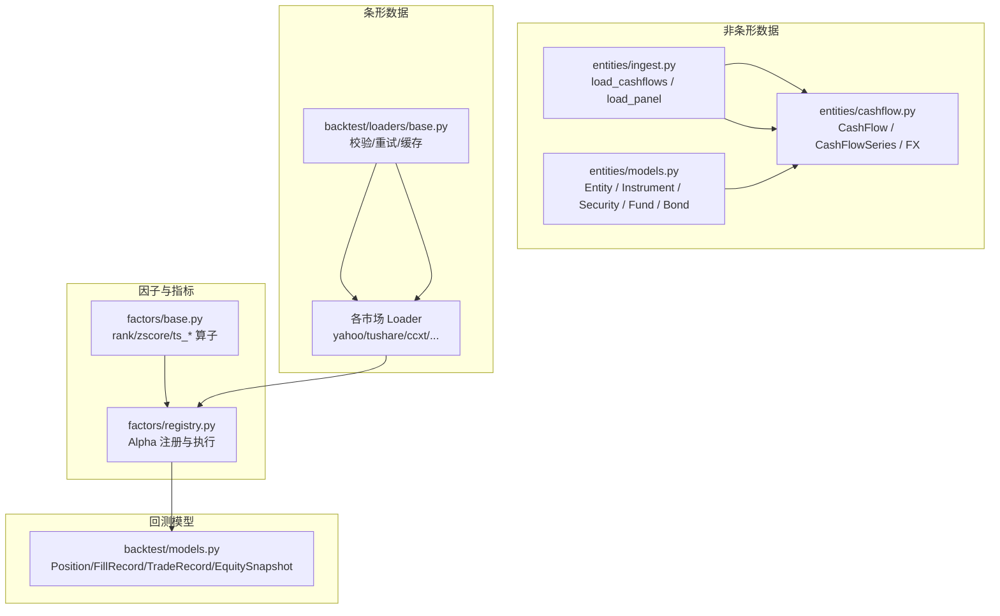
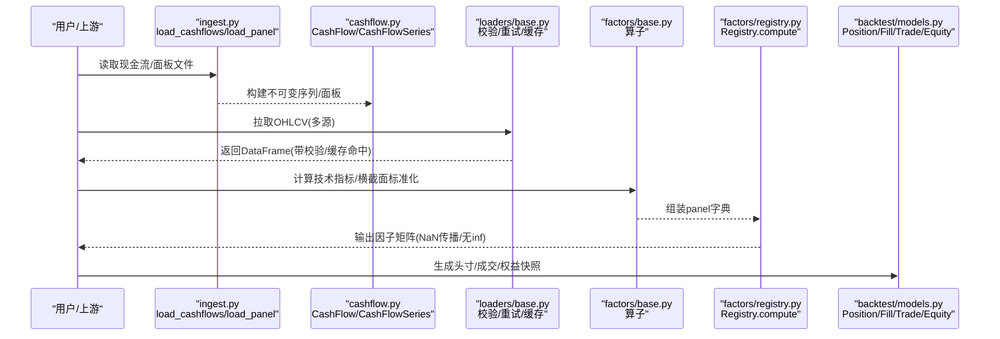
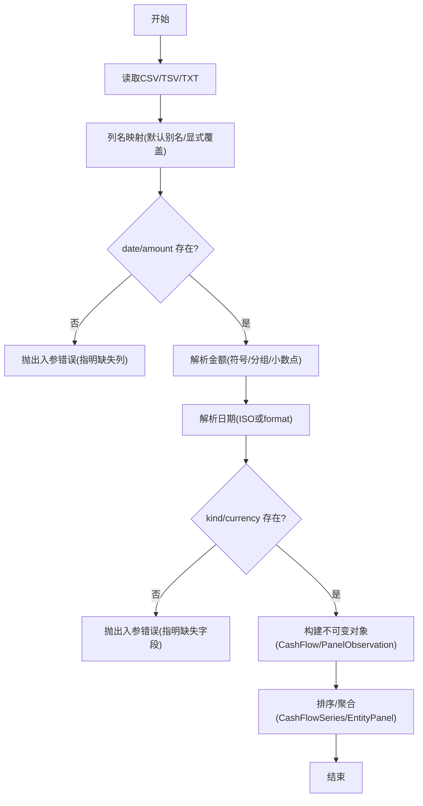
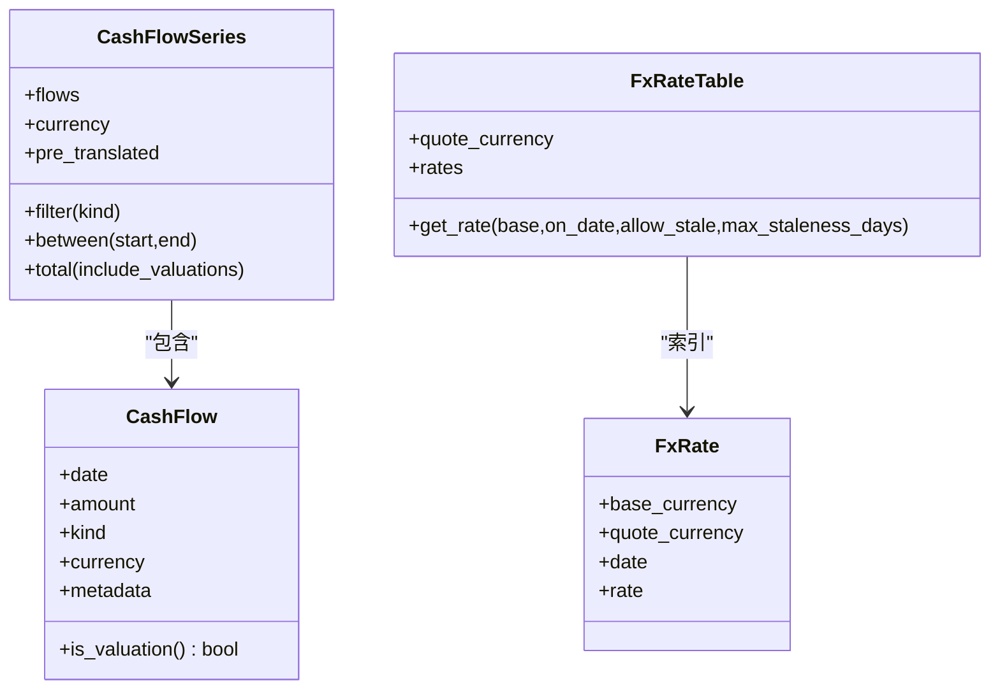
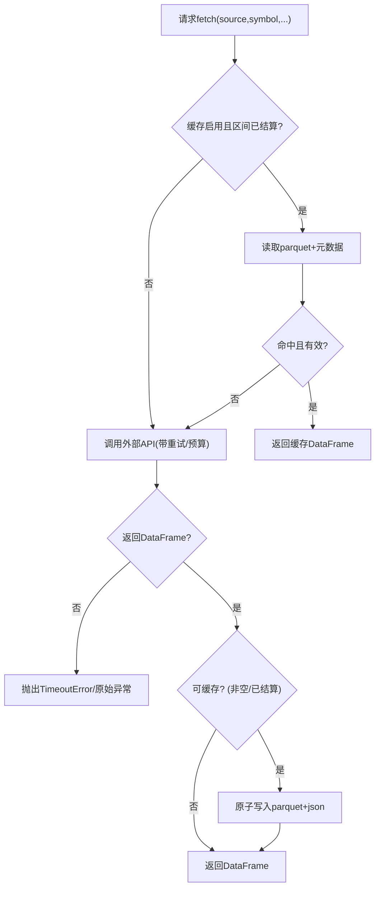
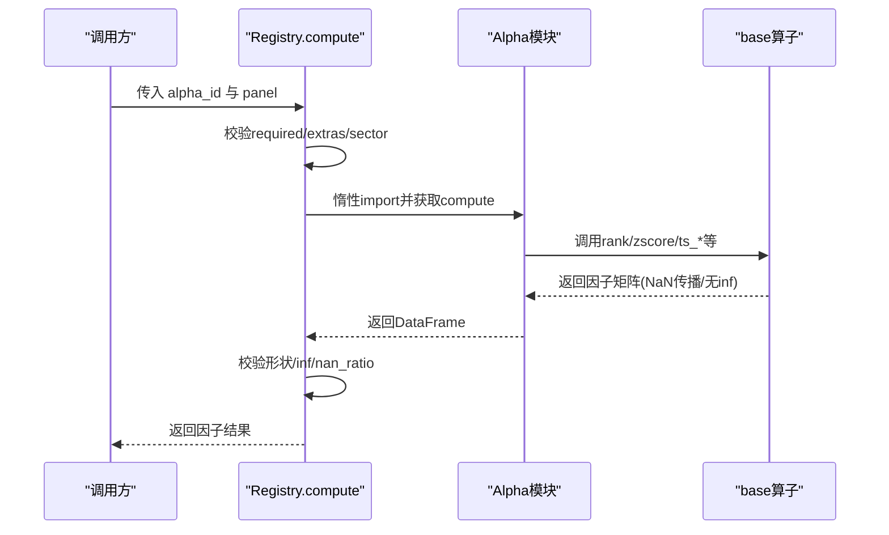
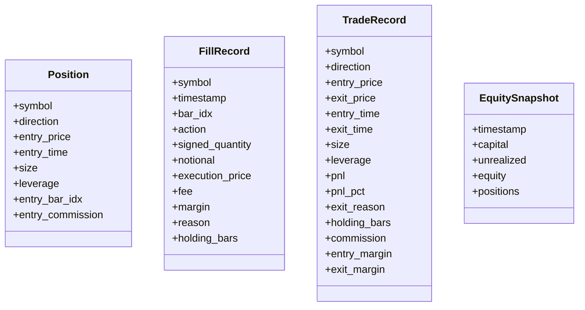
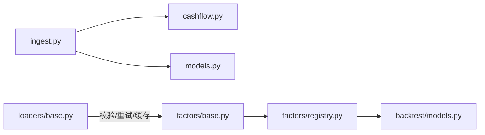

# 数据处理管道

<cite>
**本文引用的文件**
- [agent/backtest/models.py](file://agent/backtest/models.py)
- [agent/src/entities/models.py](file://agent/src/entities/models.py)
- [agent/src/entities/cashflow.py](file://agent/src/entities/cashflow.py)
- [agent/src/entities/ingest.py](file://agent/src/entities/ingest.py)
- [agent/backtest/loaders/base.py](file://agent/backtest/loaders/base.py)
- [agent/src/factors/base.py](file://agent/src/factors/base.py)
- [agent/src/factors/_backend.py](file://agent/src/factors/_backend.py)
- [agent/src/factors/registry.py](file://agent/src/factors/registry.py)
</cite>

## 目录
1. [简介](#简介)
2. [项目结构](#项目结构)
3. [核心组件](#核心组件)
4. [架构总览](#架构总览)
5. [详细组件分析](#详细组件分析)
6. [依赖关系分析](#依赖关系分析)
7. [性能考虑](#性能考虑)
8. [故障排查指南](#故障排查指南)
9. [结论](#结论)
10. [附录](#附录)

## 简介
本文件为 Vibe-Trading 数据处理管道的权威文档，覆盖数据摄入、转换规则与验证机制；详述核心数据模型（Position、FillRecord、TradeRecord、EquitySnapshot）的设计与使用；解释因子计算管道、技术指标处理与数据聚合方法；说明数据缓存策略、内存管理与性能优化技术；提供数据质量检查、异常处理与回滚机制；并以端到端工作流串联从原始数据到分析结果的完整转换过程。

## 项目结构
Vibe-Trading 的数据处理由两条并行路径组成：
- 非条形（non-bar）现金流与面板数据路径：用于基金、债券、事件流等非 OHLCV 的时序数据，强调严格的货币、日期与符号约定。
- 条形（bar）数据加载与回测路径：面向 OHLCV 行情数据，提供统一的数据加载协议、校验、重试与本地缓存。

图表来源
- [agent/src/entities/ingest.py:316-486](file://agent/src/entities/ingest.py#L316-L486)
- [agent/src/entities/cashflow.py:121-423](file://agent/src/entities/cashflow.py#L121-L423)
- [agent/src/entities/models.py:141-397](file://agent/src/entities/models.py#L141-L397)
- [agent/backtest/loaders/base.py:31-119](file://agent/backtest/loaders/base.py#L31-L119)
- [agent/src/factors/base.py:62-356](file://agent/src/factors/base.py#L62-L356)
- [agent/src/factors/registry.py:201-397](file://agent/src/factors/registry.py#L201-L397)
- [agent/backtest/models.py:13-118](file://agent/backtest/models.py#L13-L118)

章节来源
- [agent/src/entities/ingest.py:1-20](file://agent/src/entities/ingest.py#L1-L20)
- [agent/backtest/loaders/base.py:1-8](file://agent/backtest/loaders/base.py#L1-L8)

## 核心组件
- 非条形数据模型与入库
  - 实体与工具：Entity、Instrument、Security、Fund、Bond，以及日期/货币规范化函数，确保所有资产元数据具备货币、名称、发行方等必要信息，并在构造时完成强校验。
  - 现金流与面板：CashFlow、CashFlowSeries、PanelObservation、EntityPanel，严格约束金额符号、币种一致性、单位与指标标签，拒绝“猜测”，缺失必填字段直接报错。
- 条形数据加载器
  - 统一的 DataLoaderProtocol，提供 is_available 与 fetch(codes, start_date, end_date, interval, fields) 接口。
  - 通用校验 validate_ohlc：强制 high>=low 且高低价包围开收价，支持对非正价格的可选策略（丢弃/警告/抛出）。
  - 重试与预算：retry_with_budget/check_budget 以单调时钟控制超时与退避，避免无限重试拖垮系统。
  - 本地缓存：基于内容寻址的 parquet 缓存，仅对已结算区间写入，读写失败不阻塞主流程。
- 因子与指标
  - base 算子：rank、zscore、ts_mean/std/max/min、ts_corr/ts_cov、delta、decay_linear、vwap 等，遵循 NaN 传播与无前瞻原则。
  - 后端加速：bottleneck 懒加载与禁用开关，滑动窗口视图向量化，显著降低滚动统计开销。
  - Alpha 注册表：AST 静态解析 __alpha_meta__，惰性导入模块并执行 compute(panel)，输出形状与数值完整性校验。
- 回测核心模型
  - Position、FillRecord、TradeRecord、EquitySnapshot 描述头寸、成交证据、闭环交易与权益快照，全部不可变数据类，便于审计与回放。

章节来源
- [agent/src/entities/models.py:68-138](file://agent/src/entities/models.py#L68-L138)
- [agent/src/entities/cashflow.py:62-87](file://agent/src/entities/cashflow.py#L62-L87)
- [agent/src/entities/ingest.py:72-135](file://agent/src/entities/ingest.py#L72-L135)
- [agent/backtest/loaders/base.py:31-119](file://agent/backtest/loaders/base.py#L31-L119)
- [agent/backtest/loaders/base.py:163-236](file://agent/backtest/loaders/base.py#L163-L236)
- [agent/backtest/loaders/base.py:243-439](file://agent/backtest/loaders/base.py#L243-L439)
- [agent/src/factors/base.py:62-356](file://agent/src/factors/base.py#L62-L356)
- [agent/src/factors/_backend.py:1-69](file://agent/src/factors/_backend.py#L1-L69)
- [agent/src/factors/registry.py:87-125](file://agent/src/factors/registry.py#L87-L125)
- [agent/backtest/models.py:13-118](file://agent/backtest/models.py#L13-L118)

## 架构总览
下图展示从原始数据到因子与回测结果的端到端流水线。

图表来源
- [agent/src/entities/ingest.py:316-486](file://agent/src/entities/ingest.py#L316-L486)
- [agent/src/entities/cashflow.py:196-423](file://agent/src/entities/cashflow.py#L196-L423)
- [agent/backtest/loaders/base.py:31-119](file://agent/backtest/loaders/base.py#L31-L119)
- [agent/backtest/loaders/base.py:343-439](file://agent/backtest/loaders/base.py#L343-L439)
- [agent/src/factors/base.py:62-356](file://agent/src/factors/base.py#L62-L356)
- [agent/src/factors/registry.py:321-397](file://agent/src/factors/registry.py#L321-L397)
- [agent/backtest/models.py:13-118](file://agent/backtest/models.py#L13-L118)

## 详细组件分析

### 数据摄入：现金流与面板
- 列名映射与别名：默认支持 date/amount/kind/currency 的多重别名，大小写/空格/下划线归一化匹配，允许显式覆盖。
- 金额解析：去除货币符号与千分位分隔符，支持括号负数与尾随负号；当小数点与千分位混淆时要求显式声明 decimal_separator。
- 日期解析：优先 ISO-8601，否则需指定 strptime 格式；拒绝区域歧义格式。
- 必填校验：date 与 amount 必须存在；currency 与 kind 必须通过列或参数提供；未映射列保留在 metadata 中。
- 面板数据：支持 long/wide_dates_rows/wide_entities_rows 三种布局自动推断；entity/metric/value/unit 均做归一化与有限值校验。

图表来源
- [agent/src/entities/ingest.py:76-135](file://agent/src/entities/ingest.py#L76-L135)
- [agent/src/entities/ingest.py:138-265](file://agent/src/entities/ingest.py#L138-L265)
- [agent/src/entities/ingest.py:316-486](file://agent/src/entities/ingest.py#L316-L486)
- [agent/src/entities/ingest.py:538-691](file://agent/src/entities/ingest.py#L538-L691)

章节来源
- [agent/src/entities/ingest.py:49-135](file://agent/src/entities/ingest.py#L49-L135)
- [agent/src/entities/ingest.py:138-265](file://agent/src/entities/ingest.py#L138-L265)
- [agent/src/entities/ingest.py:316-486](file://agent/src/entities/ingest.py#L316-L486)
- [agent/src/entities/ingest.py:538-691](file://agent/src/entities/ingest.py#L538-L691)

### 非条形数据模型：现金流与汇率
- 符号约定：持有者视角，流入为正、流出为负；KIND_DIRECTION 强制方向性，违反即抛错。
- 估值标记：nav/residual_value/valuation 不参与默认求和，避免重复计入。
- 币种一致性：系列内禁止混币，除非显式 pre_translated=True 并提供报告币种。
- 汇率表：FxRateTable 限定单一报价币种，按结算日精确查找；默认拒绝陈旧汇率，可配置 allow_stale 与最大陈旧天数。
- 翻译函数：translate_cashflows 逐笔用结算日汇率换算，记录原金额/币种/汇率/日期/是否陈旧，最终产出 pre_translated=True 的统一币种系列。

图表来源
- [agent/src/entities/cashflow.py:121-194](file://agent/src/entities/cashflow.py#L121-L194)
- [agent/src/entities/cashflow.py:196-423](file://agent/src/entities/cashflow.py#L196-L423)
- [agent/src/entities/cashflow.py:443-681](file://agent/src/entities/cashflow.py#L443-L681)
- [agent/src/entities/cashflow.py:684-769](file://agent/src/entities/cashflow.py#L684-L769)

章节来源
- [agent/src/entities/cashflow.py:62-87](file://agent/src/entities/cashflow.py#L62-L87)
- [agent/src/entities/cashflow.py:121-194](file://agent/src/entities/cashflow.py#L121-L194)
- [agent/src/entities/cashflow.py:196-423](file://agent/src/entities/cashflow.py#L196-L423)
- [agent/src/entities/cashflow.py:443-681](file://agent/src/entities/cashflow.py#L443-L681)
- [agent/src/entities/cashflow.py:684-769](file://agent/src/entities/cashflow.py#L684-L769)

### 条形数据加载与校验
- OHLC 不变量校验：强制 high>=low 且高低价包围开收价；支持对非正价格的可配置策略（丢弃/警告/抛出）。
- 重试与预算：retry_with_budget 针对声明的瞬态异常进行有限次重试，结合 check_budget 在单调时钟超时时快速失败。
- 本地缓存：
  - 键：source/symbol/timeframe/start/end/fields 的内容哈希。
  - 存储：parquet + JSON 元数据（索引列、列名、索引 dtype），DuckDB 读写。
  - 策略：仅对已结算区间写入；读/写失败不阻塞主流程。

图表来源
- [agent/backtest/loaders/base.py:31-119](file://agent/backtest/loaders/base.py#L31-L119)
- [agent/backtest/loaders/base.py:163-236](file://agent/backtest/loaders/base.py#L163-L236)
- [agent/backtest/loaders/base.py:243-439](file://agent/backtest/loaders/base.py#L243-L439)
- [agent/backtest/loaders/base.py:475-596](file://agent/backtest/loaders/base.py#L475-L596)

章节来源
- [agent/backtest/loaders/base.py:31-119](file://agent/backtest/loaders/base.py#L31-L119)
- [agent/backtest/loaders/base.py:163-236](file://agent/backtest/loaders/base.py#L163-L236)
- [agent/backtest/loaders/base.py:243-439](file://agent/backtest/loaders/base.py#L243-L439)
- [agent/backtest/loaders/base.py:475-596](file://agent/backtest/loaders/base.py#L475-L596)

### 因子计算管道与指标处理
- 算子契约：输入为宽表 DataFrame（index=交易日，columns=标的），输出同形；NaN 传播，禁止 inf。
- 常用算子：
  - 横截面：rank、zscore、scale。
  - 时间序列：ts_mean/std/max/min、ts_corr/ts_cov、delta(d≥1)、decay_linear、signed_power、safe_div。
  - 市场加权：vwap 按市场选择典型价格或金额/成交量折算。
- 后端优化：
  - bottleneck.move_argmax/move_argmin 加速 ~350x；可通过环境变量禁用。
  - numpy sliding_window_view 向量化 ts_rank/decay_linear。
- 注册表执行：
  - AST 静态解析 __alpha_meta__，校验主题、频率、所需列、宇宙范围等。
  - 惰性导入模块，执行 compute(panel)，输出形状与数值健康度校验（禁止 inf、NaN 比例阈值）。

图表来源
- [agent/src/factors/base.py:62-356](file://agent/src/factors/base.py#L62-L356)
- [agent/src/factors/_backend.py:1-69](file://agent/src/factors/_backend.py#L1-L69)
- [agent/src/factors/registry.py:87-125](file://agent/src/factors/registry.py#L87-L125)
- [agent/src/factors/registry.py:321-397](file://agent/src/factors/registry.py#L321-L397)

章节来源
- [agent/src/factors/base.py:1-13](file://agent/src/factors/base.py#L1-L13)
- [agent/src/factors/base.py:62-356](file://agent/src/factors/base.py#L62-L356)
- [agent/src/factors/_backend.py:1-69](file://agent/src/factors/_backend.py#L1-L69)
- [agent/src/factors/registry.py:201-397](file://agent/src/factors/registry.py#L201-L397)

### 回测核心数据模型
- Position：单标的未平仓头寸，含方向、入场价/时间、规模、杠杆、入场手续费等。
- FillRecord：单笔成交证据，含动作、数量、名义价值、成交价、费用、保证金、持仓条数等。
- TradeRecord：闭环交易，含进出场价/时间、规模、杠杆、PnL/PnL%、退出原因、持仓条数、佣金、入场/出场保证金等。
- EquitySnapshot：时点权益快照，含现金、浮动盈亏、总权益、头寸数。

图表来源
- [agent/backtest/models.py:13-118](file://agent/backtest/models.py#L13-L118)

章节来源
- [agent/backtest/models.py:13-118](file://agent/backtest/models.py#L13-L118)

## 依赖关系分析
- 模块耦合
  - ingest 依赖 cashflow 与 models 的规范化函数，保证数据进入系统前即满足强约束。
  - loaders/base 提供共享能力（校验、重试、缓存），被各市场 loader 复用。
  - factors/base 提供基础算子，registry 负责发现、校验与执行具体 alpha 模块。
  - backtest/models 作为回测引擎与策略之间的稳定契约。
- 外部依赖
  - bottleneck 可选加速，可通过环境变量禁用。
  - DuckDB 用于 parquet 缓存读写，失败降级不影响主流程。
  - pandas/numpy 为核心数据结构与向量化计算基础。

图表来源
- [agent/src/entities/ingest.py:316-486](file://agent/src/entities/ingest.py#L316-L486)
- [agent/src/entities/cashflow.py:196-423](file://agent/src/entities/cashflow.py#L196-L423)
- [agent/backtest/loaders/base.py:343-439](file://agent/backtest/loaders/base.py#L343-L439)
- [agent/src/factors/base.py:62-356](file://agent/src/factors/base.py#L62-L356)
- [agent/src/factors/registry.py:321-397](file://agent/src/factors/registry.py#L321-L397)
- [agent/backtest/models.py:13-118](file://agent/backtest/models.py#L13-L118)

章节来源
- [agent/src/entities/ingest.py:316-486](file://agent/src/entities/ingest.py#L316-L486)
- [agent/backtest/loaders/base.py:343-439](file://agent/backtest/loaders/base.py#L343-L439)
- [agent/src/factors/base.py:62-356](file://agent/src/factors/base.py#L62-L356)
- [agent/src/factors/registry.py:321-397](file://agent/src/factors/registry.py#L321-L397)
- [agent/backtest/models.py:13-118](file://agent/backtest/models.py#L13-L118)

## 性能考虑
- 因子计算
  - 使用 numpy sliding_window_view 与 bottleneck 移动窗口算子，显著提升滚动统计性能。
  - 通过环境变量禁用 bottleneck，保证可移植性与稳定性。
- 数据加载
  - 本地 parquet 缓存减少重复网络请求；仅对已结算区间写入，避免钉住未完成数据。
  - 读写失败降级，确保主流程不受缓存影响。
- 内存管理
  - 不可变数据类（dataclass(frozen)）减少拷贝与副作用，便于并发安全与调试。
  - 面板与因子计算尽量保持宽表结构，利用向量化操作降低 Python 层循环开销。

[本节为通用指导，无需特定文件引用]

## 故障排查指南
- 数据摄入
  - 金额解析失败：检查 decimal_separator 设置与千分位/小数点混用；确认无空白金额。
  - 日期解析失败：确认 ISO-8601 或提供 date_format；避免区域歧义格式。
  - 币种/种类缺失：必须通过列或参数提供 currency/kind；未映射列会保留在 metadata。
- 现金流与汇率
  - 混币错误：若系列包含多种币种，需先 translate_cashflows 并设置 pre_translated=True。
  - 汇率缺失：默认拒绝陈旧汇率；如需放宽，设置 allow_stale 与 max_staleness_days。
- 数据加载
  - OHLC 违规：根据策略选择 drop/warn/raise；必要时调整 allow_nonpositive_prices。
  - 网络超时/限流：检查 retry 次数与 backoff；确认 monotonic 时钟预算合理。
  - 缓存问题：确认缓存已启用且区间已结算；查看 parquet 与元数据是否损坏。
- 因子计算
  - 输出含 inf：检查 safe_div 与 vwap 的分母；确保输入不含零除场景。
  - NaN 过多：检查 warmup 窗口、缺失数据与对齐；确认 min_periods 设置。
- 回测模型
  - 头寸/成交不一致：核对 FillRecord 的 holding_bars 与 TradeRecord 的 entry/exit 逻辑。
  - 权益快照异常：检查 unrealized 与 margin_in_use 的计算口径。

章节来源
- [agent/src/entities/ingest.py:138-265](file://agent/src/entities/ingest.py#L138-L265)
- [agent/src/entities/cashflow.py:443-681](file://agent/src/entities/cashflow.py#L443-L681)
- [agent/backtest/loaders/base.py:31-119](file://agent/backtest/loaders/base.py#L31-L119)
- [agent/backtest/loaders/base.py:163-236](file://agent/backtest/loaders/base.py#L163-L236)
- [agent/backtest/loaders/base.py:343-439](file://agent/backtest/loaders/base.py#L343-L439)
- [agent/src/factors/base.py:306-356](file://agent/src/factors/base.py#L306-L356)
- [agent/src/factors/registry.py:376-397](file://agent/src/factors/registry.py#L376-L397)
- [agent/backtest/models.py:38-118](file://agent/backtest/models.py#L38-L118)

## 结论
Vibe-Trading 的数据处理管道以“强约束、可追溯、高性能”为核心设计原则：
- 非条形数据路径通过严格的符号、币种与日期规范，确保现金流与面板数据的正确性与可审计性。
- 条形数据路径提供统一的加载协议、健壮的质量校验、可控的重试与高效的本地缓存。
- 因子计算管道以可组合的算子与注册表机制实现灵活扩展，并通过后端加速保障性能。
- 回测模型以不可变数据类固化交易证据与权益快照，支撑可靠的分析与复盘。

[本节为总结性内容，无需特定文件引用]

## 附录
- 典型工作流示例（从原始数据到分析结果）
  1) 读取现金流文件 → 构建 CashFlowSeries → 可选汇率翻译 → 汇总/过滤/区间切片。
  2) 拉取 OHLCV → OHLC 校验 → 计算技术指标 → 注册表执行 Alpha → 输出因子矩阵。
  3) 策略基于因子生成信号 → 产生 Position/FillRecord → 闭环为 TradeRecord → 生成 EquitySnapshot。

[本节为概念性说明，无需特定文件引用]