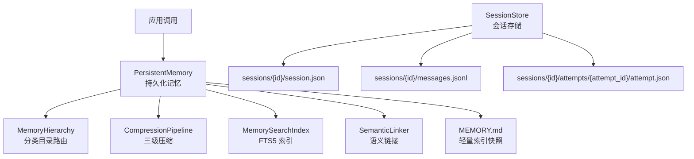
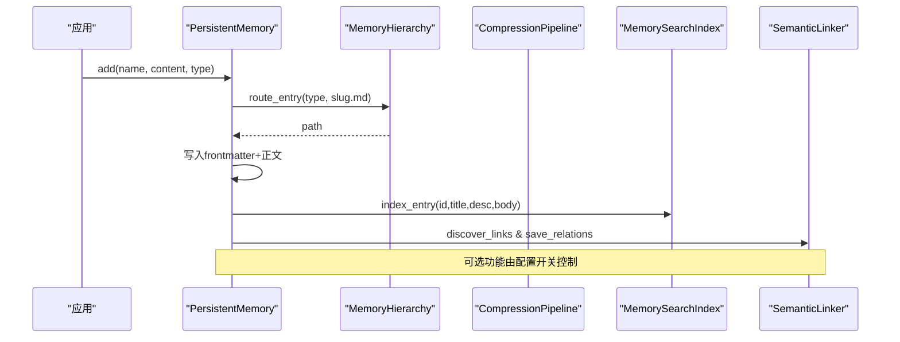
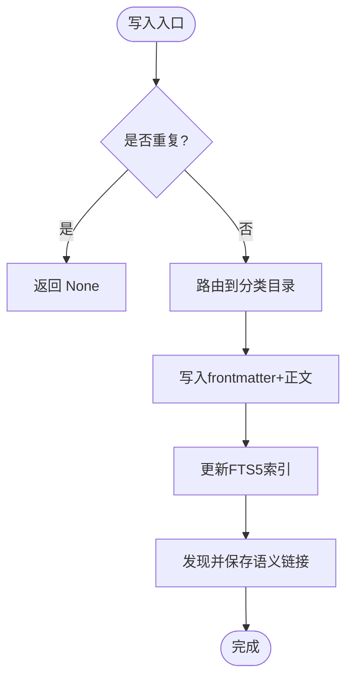
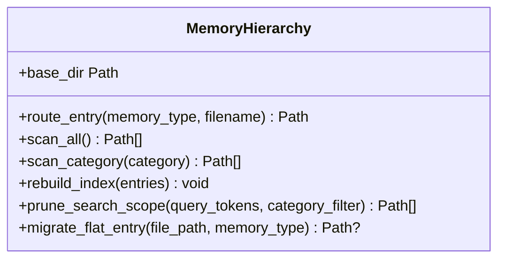
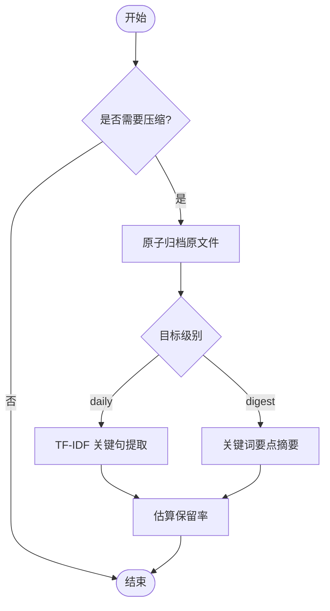
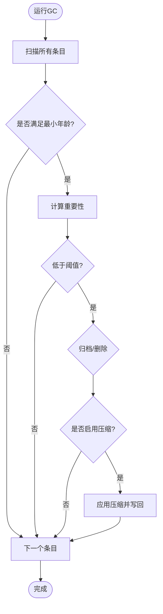
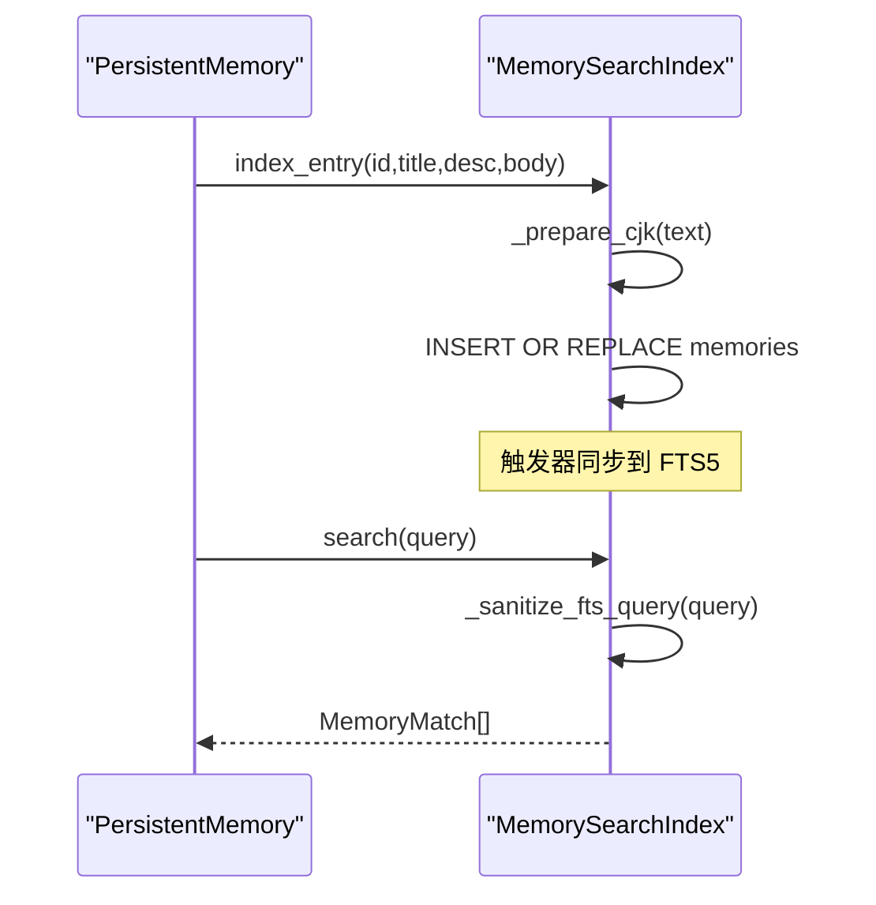
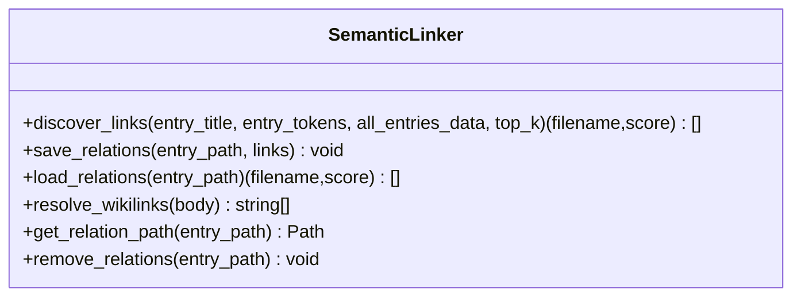
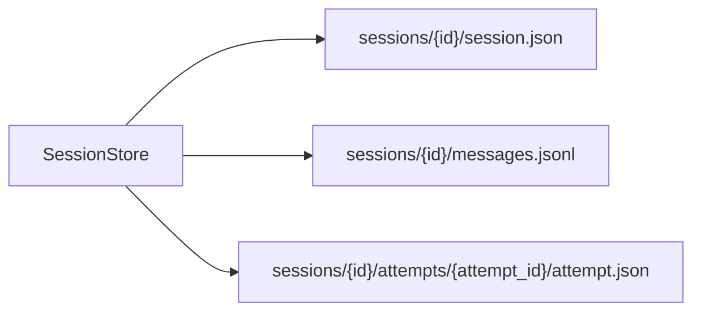
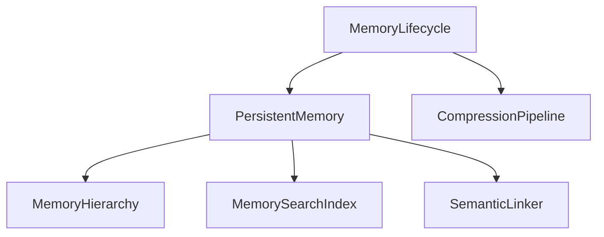

# 数据存储层

<cite>
**本文引用的文件**
- [agent/src/memory/persistent.py](file://agent/src/memory/persistent.py)
- [agent/src/memory/hierarchy.py](file://agent/src/memory/hierarchy.py)
- [agent/src/memory/compression.py](file://agent/src/memory/compression.py)
- [agent/src/memory/lifecycle.py](file://agent/src/memory/lifecycle.py)
- [agent/src/memory/search_index.py](file://agent/src/memory/search_index.py)
- [agent/src/memory/semantic_links.py](file://agent/src/memory/semantic_links.py)
- [agent/src/session/store.py](file://agent/src/session/store.py)
</cite>

## 目录
1. [简介](#简介)
2. [项目结构](#项目结构)
3. [核心组件](#核心组件)
4. [架构总览](#架构总览)
5. [详细组件分析](#详细组件分析)
6. [依赖关系分析](#依赖关系分析)
7. [性能考量](#性能考量)
8. [故障排查指南](#故障排查指南)
9. [结论](#结论)
10. [附录](#附录)

## 简介
本文件为 Vibe-Trading 的数据存储层提供系统化文档，覆盖多级存储架构（内存缓存、持久化存储与压缩策略）、分层记忆系统、数据生命周期管理与自动清理机制、数据库选型与索引优化、备份恢复与迁移策略、版本兼容性、存储性能监控与容量规划、扩展方案，以及典型场景（会话历史、研究结果、策略配置）的存储管理实践。

## 项目结构
数据存储层围绕“持久化记忆 + 可选增强能力”构建：
- 持久化记忆：基于 Markdown 文件的跨会话记忆，支持元数据前导块、分类目录路由、全文检索与语义链接。
- 层级组织：按 memory_type 将条目路由到 category 子目录，提升扫描与搜索效率。
- 压缩归档：对长期未访问的条目进行分级压缩（原始→每日摘要→要点摘要），并保留原文件归档。
- 生命周期管理：质量评分、衰减、垃圾回收与容量控制。
- 全文检索：SQLite FTS5 倒排索引，支持 CJK 分词与片段高亮。
- 语义链接：BM25 相似度发现与 .relations.json 侧车文件维护。
- 会话存储：文件系统 JSON/JSONL 日志，用于会话、消息与执行尝试记录。

图表来源
- [agent/src/memory/persistent.py:196-637](file://agent/src/memory/persistent.py#L196-L637)
- [agent/src/memory/hierarchy.py:34-436](file://agent/src/memory/hierarchy.py#L34-L436)
- [agent/src/memory/compression.py:160-353](file://agent/src/memory/compression.py#L160-L353)
- [agent/src/memory/search_index.py:113-481](file://agent/src/memory/search_index.py#L113-L481)
- [agent/src/memory/semantic_links.py:158-372](file://agent/src/memory/semantic_links.py#L158-L372)
- [agent/src/session/store.py:16-259](file://agent/src/session/store.py#L16-L259)

章节来源
- [agent/src/memory/persistent.py:196-637](file://agent/src/memory/persistent.py#L196-L637)
- [agent/src/memory/hierarchy.py:34-436](file://agent/src/memory/hierarchy.py#L34-L436)
- [agent/src/memory/compression.py:160-353](file://agent/src/memory/compression.py#L160-L353)
- [agent/src/memory/lifecycle.py:71-421](file://agent/src/memory/lifecycle.py#L71-L421)
- [agent/src/memory/search_index.py:113-481](file://agent/src/memory/search_index.py#L113-L481)
- [agent/src/memory/semantic_links.py:158-372](file://agent/src/memory/semantic_links.py#L158-L372)
- [agent/src/session/store.py:16-259](file://agent/src/session/store.py#L16-L259)

## 核心组件
- PersistentMemory：跨会话持久化记忆的核心入口，负责条目读写、去重、索引更新、与 FTS5/语义链接集成。
- MemoryHierarchy：按 memory_type 路由到 category 子目录，支持扁平兼容、索引重建与范围裁剪。
- CompressionPipeline：三级压缩（raw/daily/digest），基于 TF-IDF 句子打分与关键词提取，原子归档原文件。
- MemoryLifecycle：质量评分、访问追踪、重要性衰减、垃圾回收（归档/删除）与压缩触发。
- MemorySearchIndex：SQLite FTS5 全文检索索引，CJK 分词、片段高亮、批量重建与线程安全单例。
- SemanticLinker：BM25 相似度计算与 .relations.json 侧车文件，支持显式 wikilink 引用解析。
- SessionStore：文件系统存储会话、消息（追加日志）与执行尝试，具备容错读取与排序。

章节来源
- [agent/src/memory/persistent.py:196-637](file://agent/src/memory/persistent.py#L196-L637)
- [agent/src/memory/hierarchy.py:34-436](file://agent/src/memory/hierarchy.py#L34-L436)
- [agent/src/memory/compression.py:160-353](file://agent/src/memory/compression.py#L160-L353)
- [agent/src/memory/lifecycle.py:71-421](file://agent/src/memory/lifecycle.py#L71-L421)
- [agent/src/memory/search_index.py:113-481](file://agent/src/memory/search_index.py#L113-L481)
- [agent/src/memory/semantic_links.py:158-372](file://agent/src/memory/semantic_links.py#L158-L372)
- [agent/src/session/store.py:16-259](file://agent/src/session/store.py#L16-L259)

## 架构总览
存储层采用“文件为主、数据库为辅”的混合架构：
- 主数据：Markdown 条目（含 frontmatter 元数据），通过分类目录组织，便于 O(类别规模) 级扫描与检索。
- 辅助索引：SQLite FTS5 倒排索引，提供 O(log n) 级别全文检索；若不可用则回退到本地 token 匹配。
- 语义关联：BM25 相似度生成 .relations.json 侧车文件，支持搜索结果扩展。
- 压缩与归档：按时间阈值触发压缩，原文件原子归档至 archive 目录，保障可恢复性。
- 生命周期：质量评分与访问计数驱动重要性衰减，GC 根据阈值归档或（可选）删除，并触发压缩。
- 会话存储：独立于记忆的 JSON/JSONL 日志，保证会话历史的可追加性与可回溯性。

图表来源
- [agent/src/memory/persistent.py:462-578](file://agent/src/memory/persistent.py#L462-L578)
- [agent/src/memory/hierarchy.py:70-90](file://agent/src/memory/hierarchy.py#L70-L90)
- [agent/src/memory/search_index.py:207-241](file://agent/src/memory/search_index.py#L207-L241)
- [agent/src/memory/semantic_links.py:179-230](file://agent/src/memory/semantic_links.py#L179-L230)

## 详细组件分析

### 持久化记忆（PersistentMemory）
- 职责：条目增删改查、去重、索引更新、与 FTS5/语义链接集成。
- 关键设计：
  - 去重：基于内容哈希的滑动窗口去重，避免重试或并发导致的重复写入。
  - 索引：维护 MEMORY.md 作为轻量快照，限制行数以控制体积。
  - 搜索：优先使用 FTS5，失败时回退到本地 token 加权匹配，并结合语义链接扩展结果。
  - 锁定：跨进程写操作使用文件锁保护，避免竞争。
- 复杂度：
  - 扫描：O(n) 遍历 .md 文件（启用层级后为 O(类别规模)）。
  - 搜索：FTS5 近似 O(log n)，回退路径 O(n)。
- 错误处理：异常捕获与降级，确保可用性。

图表来源
- [agent/src/memory/persistent.py:440-578](file://agent/src/memory/persistent.py#L440-L578)

章节来源
- [agent/src/memory/persistent.py:196-637](file://agent/src/memory/persistent.py#L196-L637)

### 层级目录（MemoryHierarchy）
- 职责：按 memory_type 路由到 category 子目录，支持扁平兼容、索引重建与查询范围裁剪。
- 关键点：
  - 分类：user、feedback、project、reference。
  - 恢复：自动修复无后缀的孤儿条目。
  - 索引：生成 .hierarchy.yaml 统计与关键词，加速查询优先级排序。
  - 迁移：将扁平条目迁移到对应分类目录。
- 复杂度：扫描 O(类别规模)，重建 O(n)。

图表来源
- [agent/src/memory/hierarchy.py:34-436](file://agent/src/memory/hierarchy.py#L34-L436)

章节来源
- [agent/src/memory/hierarchy.py:34-436](file://agent/src/memory/hierarchy.py#L34-L436)

### 压缩管道（CompressionPipeline）
- 职责：三级压缩（raw→daily→digest），原子归档原文件，估算信息保留率。
- 算法：
  - 句子分割与 TF-IDF 打分，选取 top-k 句子并保留首尾句。
  - 摘要阶段提取高频重要术语，生成要点列表。
- 触发条件：基于 last_accessed 的时间阈值。
- 安全性：先归档再压缩，失败不破坏原文件。

图表来源
- [agent/src/memory/compression.py:160-353](file://agent/src/memory/compression.py#L160-L353)

章节来源
- [agent/src/memory/compression.py:160-353](file://agent/src/memory/compression.py#L160-L353)

### 生命周期管理（MemoryLifecycle）
- 职责：质量评分、访问追踪、重要性衰减、垃圾回收与压缩触发。
- 关键点：
  - 强化学习风格的质量更新，事件驱动 delta。
  - 衰减公式结合访问频率与最近访问时间。
  - GC 阈值决定归档或删除（默认仅归档），并记录 gc.log。
  - 非 dry_run 时触发压缩周期，更新 frontmatter 中的 compression_level。
- 复杂度：GC 扫描 O(n)，压缩按需触发。

图表来源
- [agent/src/memory/lifecycle.py:183-273](file://agent/src/memory/lifecycle.py#L183-L273)

章节来源
- [agent/src/memory/lifecycle.py:71-421](file://agent/src/memory/lifecycle.py#L71-L421)

### 全文检索（MemorySearchIndex）
- 职责：SQLite FTS5 倒排索引，支持 CJK 分词、片段高亮、批量重建与线程安全单例。
- 关键点：
  - CJK 文本展开为 unigram + bigram，提升匹配效果。
  - 查询清洗防止注入，返回 snippet 高亮。
  - 自动重建：首次空搜索且磁盘存在条目时触发全量重建。
- 复杂度：索引插入 O(1)，搜索近似 O(log n)。

图表来源
- [agent/src/memory/search_index.py:207-302](file://agent/src/memory/search_index.py#L207-L302)
- [agent/src/memory/persistent.py:358-438](file://agent/src/memory/persistent.py#L358-L438)

章节来源
- [agent/src/memory/search_index.py:113-481](file://agent/src/memory/search_index.py#L113-L481)
- [agent/src/memory/persistent.py:358-438](file://agent/src/memory/persistent.py#L358-L438)

### 语义链接（SemanticLinker）
- 职责：BM25 相似度发现与 .relations.json 侧车文件维护，解析显式 wikilink 引用。
- 关键点：
  - IDF 与 BM25 打分，过滤低分链接并限制出度。
  - 原子写入 relations 文件，崩溃安全。
  - 支持 [[hex-id]] 形式的显式引用解析。
- 复杂度：单次发现 O(m)（候选数），IDF 预计算一次。

图表来源
- [agent/src/memory/semantic_links.py:158-372](file://agent/src/memory/semantic_links.py#L158-L372)

章节来源
- [agent/src/memory/semantic_links.py:158-372](file://agent/src/memory/semantic_links.py#L158-L372)

### 会话存储（SessionStore）
- 职责：文件系统存储会话、消息（追加日志）与执行尝试，具备容错读取与排序。
- 关键点：
  - 目录结构清晰，每个会话独立目录。
  - 消息采用 JSONL 追加日志，fsync 保证落盘。
  - 读取时跳过损坏行，保证整体可用性。
- 复杂度：写入 O(1) 追加，读取 O(n) 扫描。

图表来源
- [agent/src/session/store.py:16-259](file://agent/src/session/store.py#L16-L259)

章节来源
- [agent/src/session/store.py:16-259](file://agent/src/session/store.py#L16-L259)

## 依赖关系分析
- 模块耦合：
  - PersistentMemory 依赖 Hierarchy、SearchIndex、SemanticLinker，形成“主存储 + 增强能力”的组合。
  - Lifecycle 依赖 PersistentMemory 与 CompressionPipeline，实现生命周期闭环。
  - SearchIndex 与 SemanticLinker 通过配置开关解耦，降低默认开销。
- 外部依赖：
  - SQLite FTS5 作为可选增强，不可用时自动降级。
  - 文件系统锁（fcntl）在类 Unix 平台提供写互斥。
- 潜在循环：
  - 通过延迟导入避免循环依赖（如 lifecycle 中延迟加载 compression）。

图表来源
- [agent/src/memory/persistent.py:196-637](file://agent/src/memory/persistent.py#L196-L637)
- [agent/src/memory/lifecycle.py:71-421](file://agent/src/memory/lifecycle.py#L71-L421)

章节来源
- [agent/src/memory/persistent.py:196-637](file://agent/src/memory/persistent.py#L196-L637)
- [agent/src/memory/lifecycle.py:71-421](file://agent/src/memory/lifecycle.py#L71-L421)

## 性能考量
- 搜索性能：
  - 启用 FTS5 时，搜索近似 O(log n)，显著提升大规模记忆检索速度。
  - 未启用 FTS5 时，回退到本地 token 匹配，适合小规模场景。
- 写入性能：
  - 文件锁保护写互斥，避免竞争；Windows 下直接允许写入。
  - 原子写入（临时文件 + rename）减少损坏风险。
- 压缩与归档：
  - 仅在达到时间阈值时触发，避免频繁 IO。
  - 归档原文件确保可恢复，压缩过程失败不影响原数据。
- 容量规划：
  - 限制索引行数与条目正文长度，控制内存与磁盘占用。
  - GC 阈值与最大条目数控制总体规模。
- 监控建议：
  - 观察 gc.log 与 MEMORY.md 大小变化。
  - 监控 SQLite WAL 状态与 FTS5 可用情况。
  - 跟踪压缩前后文件大小与信息保留率。

## 故障排查指南
- 写入冲突：
  - 检查文件锁是否超时，确认多进程并发写入场景。
- FTS5 不可用：
  - 查看初始化日志，确认 SQLite 编译选项是否包含 FTS5。
  - 若不可用，系统将自动回退到本地 token 匹配。
- 压缩失败：
  - 检查 archive 目录权限与磁盘空间。
  - 关注压缩异常日志，必要时回滚原文件。
- 语义链接异常：
  - 校验 .relations.json 格式与版本，确保解析兼容。
- 会话数据损坏：
  - 读取 JSONL 时跳过损坏行，定位问题行号并修复。

章节来源
- [agent/src/memory/persistent.py:42-73](file://agent/src/memory/persistent.py#L42-L73)
- [agent/src/memory/search_index.py:147-173](file://agent/src/memory/search_index.py#L147-L173)
- [agent/src/memory/compression.py:258-291](file://agent/src/memory/compression.py#L258-L291)
- [agent/src/memory/semantic_links.py:282-305](file://agent/src/memory/semantic_links.py#L282-L305)
- [agent/src/session/store.py:164-193](file://agent/src/session/store.py#L164-L193)

## 结论
Vibe-Trading 的数据存储层以文件为核心，辅以 SQLite FTS5 与语义链接增强，实现了高效、可扩展且可恢复的记忆与会话存储体系。通过层级目录、压缩归档与生命周期管理，系统在性能与容量之间取得平衡，并提供灵活的配置开关以适应不同部署环境。

## 附录

### 数据库选型与表结构
- 数据库：SQLite（FTS5 虚拟表用于全文检索）。
- 表结构：
  - memories：id、title、description、keywords、body。
  - memories_fts：FTS5 虚拟表，映射到 memories 内容。
- 索引优化：
  - FTS5 MATCH 查询，snippet 高亮。
  - CJK 文本展开为 unigram + bigram，提升匹配召回。

章节来源
- [agent/src/memory/search_index.py:147-196](file://agent/src/memory/search_index.py#L147-L196)
- [agent/src/memory/search_index.py:357-407](file://agent/src/memory/search_index.py#L357-L407)

### 备份恢复与迁移策略
- 备份：
  - 记忆目录整体复制，包括 archive 目录与原文件。
  - SQLite 数据库文件（WAL 模式）需同时备份主库与 WAL 文件。
- 恢复：
  - 恢复记忆目录与数据库文件，重启服务即可。
  - 若 FTS5 不可用，首次搜索将自动重建索引。
- 迁移：
  - 扁平条目迁移到分类目录，保持文件名不变。
  - 无后缀条目自动修复为 .md 后缀。

章节来源
- [agent/src/memory/hierarchy.py:92-143](file://agent/src/memory/hierarchy.py#L92-L143)
- [agent/src/memory/hierarchy.py:381-436](file://agent/src/memory/hierarchy.py#L381-L436)
- [agent/src/memory/search_index.py:304-355](file://agent/src/memory/search_index.py#L304-L355)

### 版本兼容性
- 语义链接版本：.relations.json 包含 version 字段，解析时校验版本。
- 压缩级别：frontmatter 中 compression_level 字段标识当前压缩级别。
- 降级策略：FTS5 不可用时自动回退到本地 token 匹配。

章节来源
- [agent/src/memory/semantic_links.py:54-56](file://agent/src/memory/semantic_links.py#L54-L56)
- [agent/src/memory/semantic_links.py:303-305](file://agent/src/memory/semantic_links.py#L303-L305)
- [agent/src/memory/persistent.py:257-258](file://agent/src/memory/persistent.py#L257-L258)
- [agent/src/memory/search_index.py:160-173](file://agent/src/memory/search_index.py#L160-L173)

### 典型数据存储场景
- 会话历史：
  - 使用 SessionStore 存储会话元数据与消息日志，支持追加与回溯。
- 研究结果：
  - 使用 PersistentMemory 存储研究笔记与结论，配合 FTS5 快速检索。
- 策略配置：
  - 使用分类目录（如 project）组织策略相关记忆，便于按类型管理。

章节来源
- [agent/src/session/store.py:16-259](file://agent/src/session/store.py#L16-L259)
- [agent/src/memory/persistent.py:196-637](file://agent/src/memory/persistent.py#L196-L637)
- [agent/src/memory/hierarchy.py:19-21](file://agent/src/memory/hierarchy.py#L19-L21)