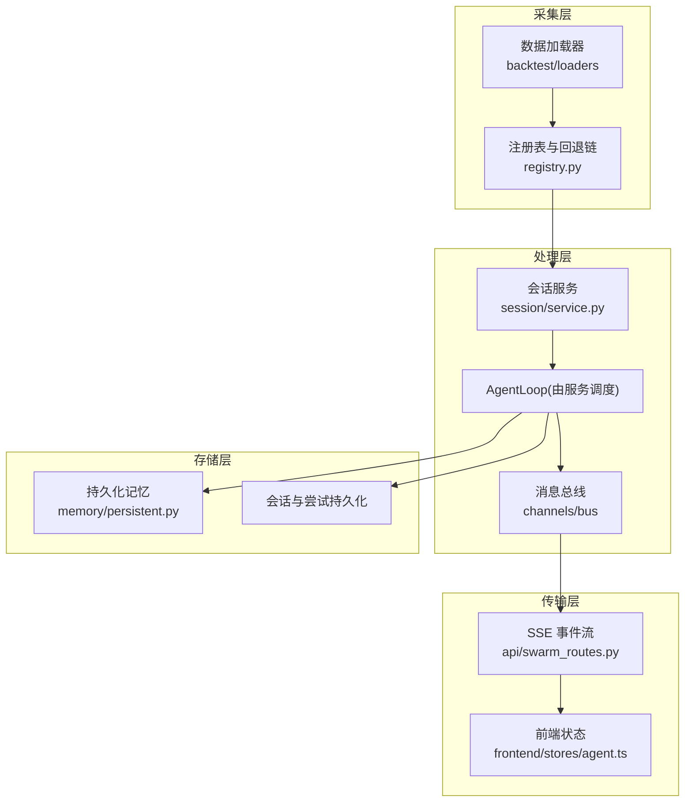
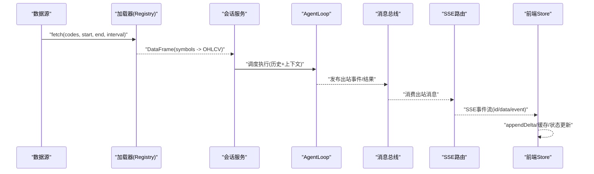
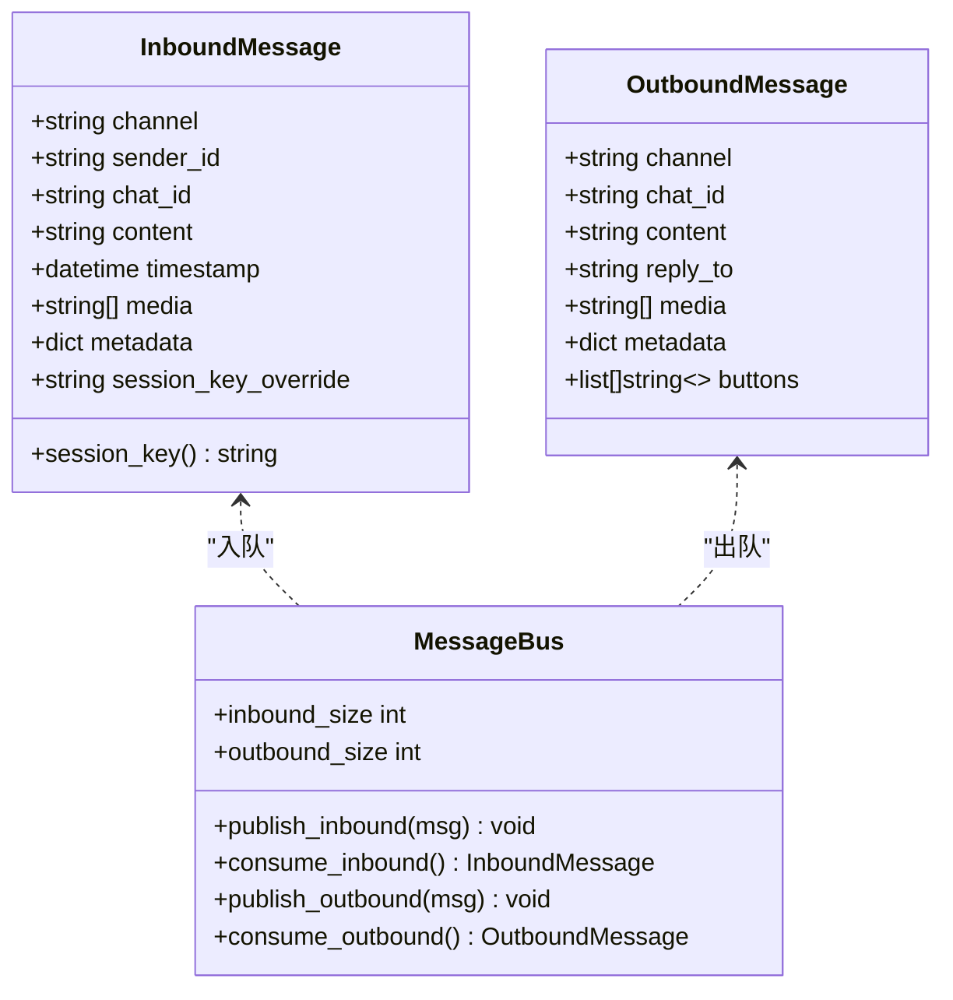
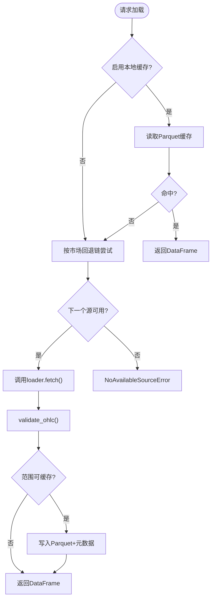
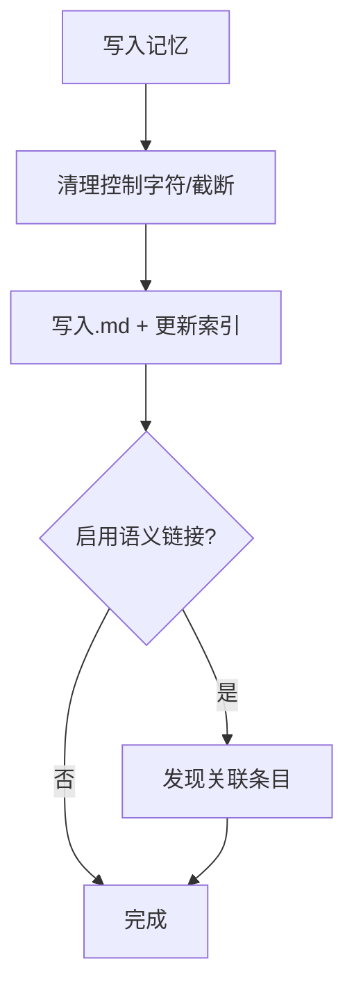
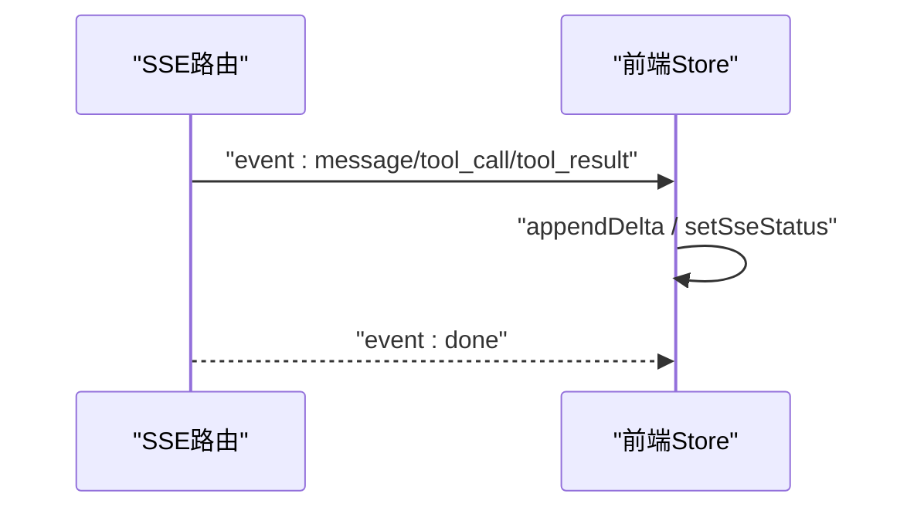

# 数据流设计

<cite>
**本文引用的文件**
- [agent/src/channels/bus/queue.py](file://agent/src/channels/bus/queue.py)
- [agent/src/channels/bus/events.py](file://agent/src/channels/bus/events.py)
- [agent/src/channels/runtime.py](file://agent/src/channels/runtime.py)
- [agent/backtest/loaders/base.py](file://agent/backtest/loaders/base.py)
- [agent/backtest/loaders/registry.py](file://agent/backtest/loaders/registry.py)
- [agent/src/session/service.py](file://agent/src/session/service.py)
- [agent/src/memory/persistent.py](file://agent/src/memory/persistent.py)
- [agent/src/api/swarm_routes.py](file://agent/src/api/swarm_routes.py)
- [frontend/src/stores/agent.ts](file://frontend/src/stores/agent.ts)
</cite>

## 目录
1. [简介](#简介)
2. [项目结构](#项目结构)
3. [核心组件](#核心组件)
4. [架构总览](#架构总览)
5. [详细组件分析](#详细组件分析)
6. [依赖关系分析](#依赖关系分析)
7. [性能考虑](#性能考虑)
8. [故障恢复与监控](#故障恢复与监控)
9. [结论](#结论)
10. [附录：典型数据流转场景](#附录典型数据流转场景)

## 简介
本架构文档面向 Vibe-Trading 的数据流设计，覆盖数据采集、处理、存储与传输的全链路。系统采用事件驱动的消息总线与可插拔的数据加载器注册表，结合会话服务驱动的 Agent 执行管线，提供实时 SSE 推送与前端状态缓存，形成从外部数据源到研究/回测再到用户界面的完整闭环。文档同时说明数据模型、序列化格式、版本兼容策略、数据验证规则、转换管道、缓存策略，以及监控、故障恢复与性能优化方案，并给出典型数据流转场景的图示。

## 项目结构
围绕数据流的关键目录与职责如下：
- channels/bus：异步消息队列与事件类型定义，解耦 IM 通道与 Agent 核心。
- backtest/loaders：统一的数据加载协议、校验、重试与本地缓存；按市场维护 fallback 链。
- session/service：会话生命周期编排，创建尝试（attempt）、调度 AgentLoop、持久化结果并通过事件总线广播。
- memory/persistent：跨会话持久化记忆，支持索引、去重、语义链接与可选 FTS5 搜索。
- api/swarm_routes：SSE 事件流路由，将运行事件以事件流形式推送到前端。
- frontend/stores/agent.ts：前端状态管理，包含 SSE 增量更新、会话缓存与流式文本累积。



**图表来源**
- [agent/backtest/loaders/registry.py:136-155](file://agent/backtest/loaders/registry.py#L136-L155)
- [agent/src/session/service.py:158-218](file://agent/src/session/service.py#L158-L218)
- [agent/src/channels/bus/queue.py:8-44](file://agent/src/channels/bus/queue.py#L8-L44)
- [agent/src/api/swarm_routes.py:187-211](file://agent/src/api/swarm_routes.py#L187-L211)
- [frontend/src/stores/agent.ts:136-165](file://frontend/src/stores/agent.ts#L136-L165)

**章节来源**
- [agent/backtest/loaders/registry.py:136-155](file://agent/backtest/loaders/registry.py#L136-L155)
- [agent/src/session/service.py:158-218](file://agent/src/session/service.py#L158-L218)
- [agent/src/channels/bus/queue.py:8-44](file://agent/src/channels/bus/queue.py#L8-L44)
- [agent/src/api/swarm_routes.py:187-211](file://agent/src/api/swarm_routes.py#L187-L211)
- [frontend/src/stores/agent.ts:136-165](file://frontend/src/stores/agent.ts#L136-L165)

## 核心组件
- 消息总线与事件：InboundMessage/OutboundMessage 定义统一的入站/出站消息结构；MessageBus 提供异步队列，解耦渠道与 Agent。
- 数据加载器协议与注册表：DataLoaderProtocol 规范 fetch 接口；FALLBACK_CHAINS 为各市场维护优先顺序；resolve_loader 选择首个可用源。
- 会话服务：SessionService 负责创建 Session/Attempt、调度 AgentLoop、持久化消息与尝试结果，并通过 EventBus 广播事件。
- 持久化记忆：PersistentMemory 提供跨会话记忆写入、检索、去重、重要性衰减与可选 FTS5 索引。
- SSE 事件流：swarm_routes 将运行事件以 text/event-stream 输出，支持 Last-Event-ID 重连回放。
- 前端状态：agent store 维护 streamingText、会话缓存、SSE 状态与工具调用轨迹，支持快速增量更新与重置。

**章节来源**
- [agent/src/channels/bus/events.py:20-55](file://agent/src/channels/bus/events.py#L20-L55)
- [agent/src/channels/bus/queue.py:8-44](file://agent/src/channels/bus/queue.py#L8-L44)
- [agent/backtest/loaders/base.py:618-645](file://agent/backtest/loaders/base.py#L618-L645)
- [agent/backtest/loaders/registry.py:158-193](file://agent/backtest/loaders/registry.py#L158-L193)
- [agent/src/session/service.py:53-91](file://agent/src/session/service.py#L53-L91)
- [agent/src/memory/persistent.py:196-220](file://agent/src/memory/persistent.py#L196-L220)
- [agent/src/api/swarm_routes.py:187-211](file://agent/src/api/swarm_routes.py#L187-L211)
- [frontend/src/stores/agent.ts:136-165](file://frontend/src/stores/agent.ts#L136-L165)

## 架构总览
下图展示从数据源到用户界面的端到端数据流：数据通过加载器获取并校验，进入会话服务编排的 Agent 执行；Agent 产出结果并写入持久化存储；运行时事件经消息总线或 SSE 推送至前端，前端进行增量渲染与状态管理。



**图表来源**
- [agent/backtest/loaders/registry.py:158-193](file://agent/backtest/loaders/registry.py#L158-L193)
- [agent/src/session/service.py:248-344](file://agent/src/session/service.py#L248-L344)
- [agent/src/channels/bus/queue.py:19-33](file://agent/src/channels/bus/queue.py#L19-L33)
- [agent/src/api/swarm_routes.py:187-211](file://agent/src/api/swarm_routes.py#L187-L211)
- [frontend/src/stores/agent.ts:136-165](file://frontend/src/stores/agent.ts#L136-L165)

## 详细组件分析

### 消息总线与事件模型
- InboundMessage/OutboundMessage：统一 channel/chat_id/content/metadata 等字段，支持媒体与按钮扩展；OUTBOUND_META_AGENT_UI 用于富客户端 UI 载荷。
- MessageBus：inbound/outbound 两个 asyncio.Queue，提供 publish/consume 方法，暴露队列大小用于监控。
- ChannelRuntime：连接 IM 通道与 SessionService，轮询消费 inbound，并将响应推送到 outbound。



**图表来源**
- [agent/src/channels/bus/events.py:20-55](file://agent/src/channels/bus/events.py#L20-L55)
- [agent/src/channels/bus/queue.py:8-44](file://agent/src/channels/bus/queue.py#L8-L44)

**章节来源**
- [agent/src/channels/bus/events.py:20-55](file://agent/src/channels/bus/events.py#L20-L55)
- [agent/src/channels/bus/queue.py:8-44](file://agent/src/channels/bus/queue.py#L8-L44)
- [agent/src/channels/runtime.py:34-70](file://agent/src/channels/runtime.py#L34-L70)

### 数据加载器协议与回退链
- DataLoaderProtocol：要求 name/markets/requires_auth/is_available/fetch，返回 {symbol: DataFrame}。
- FALLBACK_CHAINS：按市场定义优先级，先轻量公开源，后 key-gated REST，最后 local。
- resolve_loader：遍历链，构造 loader 实例并检查可用性，失败则继续；全部不可用抛出 NoAvailableSourceError。
- 校验与重试：validate_ohlc 集中丢弃结构性脏 bar；retry_with_budget/check_budget 提供带预算的重试模式。



**图表来源**
- [agent/backtest/loaders/base.py:31-119](file://agent/backtest/loaders/base.py#L31-L119)
- [agent/backtest/loaders/base.py:243-439](file://agent/backtest/loaders/base.py#L243-L439)
- [agent/backtest/loaders/registry.py:136-193](file://agent/backtest/loaders/registry.py#L136-L193)

**章节来源**
- [agent/backtest/loaders/base.py:31-119](file://agent/backtest/loaders/base.py#L31-L119)
- [agent/backtest/loaders/base.py:243-439](file://agent/backtest/loaders/base.py#L243-L439)
- [agent/backtest/loaders/registry.py:136-193](file://agent/backtest/loaders/registry.py#L136-L193)

### 会话服务与执行管线
- send_message：创建消息与尝试，预留会话并发锁，异步调度 _run_attempt。
- _run_attempt：标记运行中，构建历史上下文，调用 AgentLoop 执行，记录指标与工具轨迹，发出终端事件。
- 取消与释放：cancel_current 支持在任务阶段或循环阶段取消；finally 确保释放会话占用。

```mermaid
sequenceDiagram
participant Client as "客户端"
participant Service as "会话服务"
participant Store as "持久化存储"
participant Loop as "AgentLoop"
participant Bus as "事件总线"
Client->>Service : "send_message(session_id, content)"
Service->>Store : "append_message / create_attempt"
Service->>Service : "_reserve_session()"
Service->>Loop : "run(user_message, history)"
Loop-->>Service : "result(status, metrics, run_dir)"
Service->>Store : "update_attempt / append_reply"
Service->>Bus : "emit(attempt.completed/failed/cancelled)"
```

**图表来源**
- [agent/src/session/service.py:158-218](file://agent/src/session/service.py#L158-L218)
- [agent/src/session/service.py:248-344](file://agent/src/session/service.py#L248-L344)

**章节来源**
- [agent/src/session/service.py:158-218](file://agent/src/session/service.py#L158-L218)
- [agent/src/session/service.py:248-344](file://agent/src/session/service.py#L248-L344)

### 持久化记忆与索引
- 写入：add 生成 frontmatter 元数据，写入 .md 文件，更新 MEMORY.md 索引，可选建立语义链接与 FTS5 索引。
- 检索：find_relevant 支持 FTS5 优先，否则 token 匹配加权评分；支持语义链接扩展结果。
- 去重：is_duplicate 使用滑动窗口哈希避免重复写入。



**图表来源**
- [agent/src/memory/persistent.py:462-578](file://agent/src/memory/persistent.py#L462-L578)
- [agent/src/memory/persistent.py:358-438](file://agent/src/memory/persistent.py#L358-L438)

**章节来源**
- [agent/src/memory/persistent.py:462-578](file://agent/src/memory/persistent.py#L462-L578)
- [agent/src/memory/persistent.py:358-438](file://agent/src/memory/persistent.py#L358-L438)

### SSE 事件流与前端状态
- SSE 路由：持续读取运行事件，按 id 递增推送 event/data，支持 Last-Event-ID 重连；结束时发送 done 事件。
- 前端 Store：appendDelta 累积流式文本；cacheSession 缓存会话与 swarm 状态；setSseStatus 跟踪重连次数。



**图表来源**
- [agent/src/api/swarm_routes.py:187-211](file://agent/src/api/swarm_routes.py#L187-L211)
- [frontend/src/stores/agent.ts:136-165](file://frontend/src/stores/agent.ts#L136-L165)
- [frontend/src/stores/agent.ts:282-335](file://frontend/src/stores/agent.ts#L282-L335)

**章节来源**
- [agent/src/api/swarm_routes.py:187-211](file://agent/src/api/swarm_routes.py#L187-L211)
- [frontend/src/stores/agent.ts:136-165](file://frontend/src/stores/agent.ts#L136-L165)
- [frontend/src/stores/agent.ts:282-335](file://frontend/src/stores/agent.ts#L282-L335)

## 依赖关系分析
- 加载器注册表依赖 base 中的协议与校验工具；resolve_loader 根据市场选择具体 loader。
- 会话服务依赖 EventBus 与 SessionStore，调度 AgentLoop 并持久化结果。
- 消息总线被 ChannelRuntime 使用，桥接 IM 通道与会话服务。
- SSE 路由读取运行时事件并输出给前端；前端 store 管理状态与缓存。


**图表来源**
- [agent/backtest/loaders/base.py:618-645](file://agent/backtest/loaders/base.py#L618-L645)
- [agent/backtest/loaders/registry.py:158-193](file://agent/backtest/loaders/registry.py#L158-L193)
- [agent/src/session/service.py:158-218](file://agent/src/session/service.py#L158-L218)
- [agent/src/channels/bus/queue.py:8-44](file://agent/src/channels/bus/queue.py#L8-L44)
- [agent/src/api/swarm_routes.py:187-211](file://agent/src/api/swarm_routes.py#L187-L211)
- [frontend/src/stores/agent.ts:136-165](file://frontend/src/stores/agent.ts#L136-L165)

**章节来源**
- [agent/backtest/loaders/base.py:618-645](file://agent/backtest/loaders/base.py#L618-L645)
- [agent/backtest/loaders/registry.py:158-193](file://agent/backtest/loaders/registry.py#L158-L193)
- [agent/src/session/service.py:158-218](file://agent/src/session/service.py#L158-L218)
- [agent/src/channels/bus/queue.py:8-44](file://agent/src/channels/bus/queue.py#L8-L44)
- [agent/src/api/swarm_routes.py:187-211](file://agent/src/api/swarm_routes.py#L187-L211)
- [frontend/src/stores/agent.ts:136-165](file://frontend/src/stores/agent.ts#L136-L165)

## 性能考虑
- 数据加载缓存：基于 Parquet 的本地缓存，键含 source/symbol/timeframe/date range/fields；仅对已结算日期范围缓存；读写失败不阻塞主流程。
- 批量与连接型加载器：yfinance/futu 等在缓存命中时跳过网络/连接，减少延迟与限流压力。
- 因子计算加速：滚动因子热路径使用 bottleneck/NumPy 快路径；alpha bench 进程并行避免大面板数据传输。
- 历史上下文裁剪：会话历史按字符预算裁剪，保留关键信息，降低 LLM 输入成本。
- SSE 重连与回放：支持 Last-Event-ID，减少重连后的数据丢失与重复处理。

[本节为通用性能建议，不直接分析具体文件]

## 故障恢复与监控
- 数据层：
  - validate_ohlc：集中丢弃结构性脏 bar，防止下游 NaN/inf 污染指标。
  - retry_with_budget/check_budget：对瞬态异常进行有界重试，超时抛出 TimeoutError。
  - 缓存降级：读/写失败均非致命，自动回退到在线加载。
- 会话层：
  - SessionBusyError：同一会话并发保护，HTTP 409 提示等待或取消。
  - cancel_current：支持任务阶段与循环阶段取消，finally 释放占用。
- 传输层：
  - SSE 重连：前端通过 Last-Event-ID 回放缺失事件；store 维护 sseStatus 与重试次数。
- 监控指标：
  - 消息总线队列长度：inbound_size/outbound_size 用于观察积压。
  - 会话事件：attempt.started/completed/failed/cancelled 用于追踪运行状态。
  - 前端 SSE 状态：setSseStatus 记录重连次数，辅助定位网络问题。

**章节来源**
- [agent/backtest/loaders/base.py:31-119](file://agent/backtest/loaders/base.py#L31-L119)
- [agent/backtest/loaders/base.py:163-236](file://agent/backtest/loaders/base.py#L163-L236)
- [agent/src/session/service.py:43-50](file://agent/src/session/service.py#L43-L50)
- [agent/src/session/service.py:227-246](file://agent/src/session/service.py#L227-L246)
- [agent/src/channels/bus/queue.py:35-44](file://agent/src/channels/bus/queue.py#L35-L44)
- [agent/src/api/swarm_routes.py:187-211](file://agent/src/api/swarm_routes.py#L187-L211)
- [frontend/src/stores/agent.ts:304-305](file://frontend/src/stores/agent.ts#L304-L305)

## 结论
Vibe-Trading 的数据流以事件驱动为核心，通过消息总线解耦渠道与 Agent，以可插拔的加载器注册表实现多市场、多源的数据接入，配合会话服务编排执行与持久化，最终通过 SSE 将实时事件推送至前端。系统在数据验证、缓存、重试、取消与重连等方面具备完善的健壮性保障，并提供丰富的监控点与性能优化手段。该设计既支持离线回测与研究，也支撑实时交互与可视化，满足复杂量化工作流的端到端需求。

## 附录：典型数据流转场景
- 场景一：A股日线回测
  - 数据源选择：a_share 回退链（tencent/mootdx/eastmoney/baostock/akshare/tushare/local）。
  - 校验与缓存：validate_ohlc 过滤脏 bar；若范围已结算则写入 Parquet 缓存。
  - 执行与结果：会话服务调度 AgentLoop，产出指标与报告，SSE 推送进度与完成事件。
- 场景二：加密货币永续合约研究
  - 数据源选择：crypto 回退链（okx/binance/ccxt/yfinance/local）。
  - 特殊处理：资金费率/维持保证金档位历史数据接入；严格模式拒绝不支持周期。
  - 结果输出：风险透视工件与审计账本，SSE 事件流实时更新前端。
- 场景三：IM 通道触发研究
  - 入站消息：InboundMessage 经 MessageBus 入队。
  - 路由处理：ChannelRuntime 消费并转发至 SessionService。
  - 出站响应：OutboundMessage 经总线或 SSE 返回给用户界面。

[本节为概念性场景描述，不直接分析具体文件]