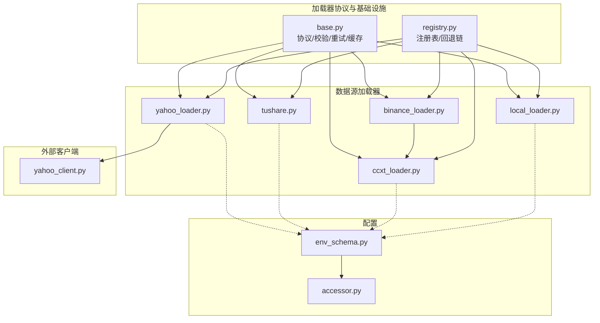
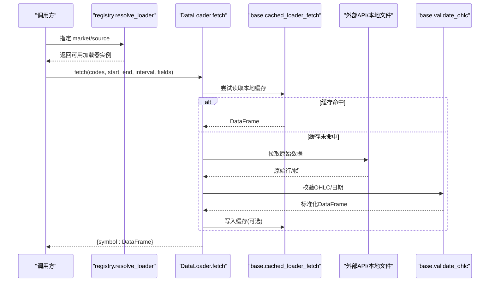
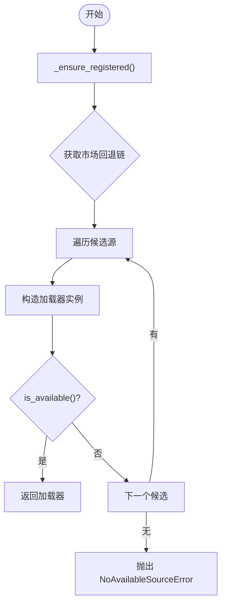
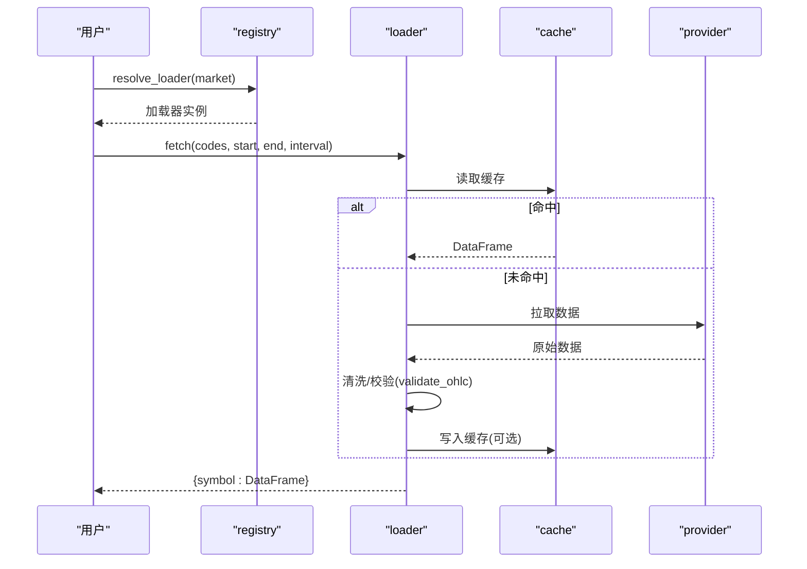
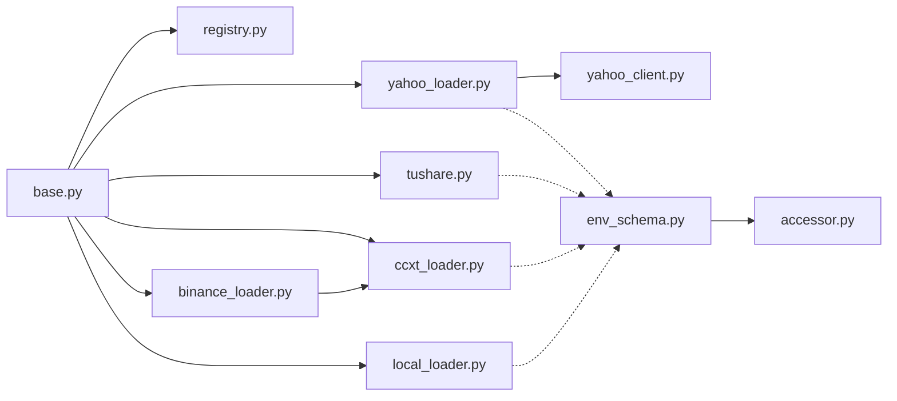

# 数据采集层

<cite>
**本文引用的文件**
- [base.py](file://agent/backtest/loaders/base.py)
- [registry.py](file://agent/backtest/loaders/registry.py)
- [yahoo_loader.py](file://agent/backtest/loaders/yahoo_loader.py)
- [tushare.py](file://agent/backtest/loaders/tushare.py)
- [binance_loader.py](file://agent/backtest/loaders/binance_loader.py)
- [ccxt_loader.py](file://agent/backtest/loaders/ccxt_loader.py)
- [yahoo_client.py](file://agent/backtest/loaders/yahoo_client.py)
- [local_loader.py](file://agent/backtest/loaders/local_loader.py)
- [env_schema.py](file://agent/src/config/env_schema.py)
- [accessor.py](file://agent/src/config/accessor.py)
</cite>

## 目录
1. [简介](#简介)
2. [项目结构](#项目结构)
3. [核心组件](#核心组件)
4. [架构总览](#架构总览)
5. [详细组件分析](#详细组件分析)
6. [依赖关系分析](#依赖关系分析)
7. [性能考量](#性能考量)
8. [故障排查指南](#故障排查指南)
9. [结论](#结论)
10. [附录](#附录)

## 简介
本文件面向 Vibe-Trading 的数据采集层，系统性说明多数据源接入架构、数据加载器注册机制、统一接口设计、数据格式标准化；详解内置数据源（Yahoo Finance、Tushare、Binance 等）的实现与配置；阐述数据验证规则、错误处理策略与重试机制；提供自定义数据源开发指南（接口实现、数据清洗、性能优化），并展示典型采集流程与故障恢复方案。

## 项目结构
数据采集层位于 agent/backtest/loaders 目录下，采用“协议 + 注册表 + 具体加载器”的分层组织：
- base.py：定义 DataLoaderProtocol 协议、通用校验、重试/预算工具、本地缓存工具。
- registry.py：维护全局加载器注册表、市场级回退链、自动解析逻辑。
- 各数据源加载器：如 yahoo_loader.py、tushare.py、binance_loader.py、ccxt_loader.py、local_loader.py 等，均通过 @register 装饰器自注册。
- 客户端封装：如 yahoo_client.py，对第三方 HTTP 端点进行节流、会话复用、认证握手等封装。
- 配置中心：src/config/env_schema.py 集中管理环境变量与默认值；accessor.py 提供线程安全的单例访问。

图表来源
- [base.py:618-645](file://agent/backtest/loaders/base.py#L618-L645)
- [registry.py:23-155](file://agent/backtest/loaders/registry.py#L23-L155)
- [yahoo_loader.py:173-189](file://agent/backtest/loaders/yahoo_loader.py#L173-L189)
- [tushare.py:116-138](file://agent/backtest/loaders/tushare.py#L116-L138)
- [binance_loader.py:23-45](file://agent/backtest/loaders/binance_loader.py#L23-L45)
- [ccxt_loader.py:184-224](file://agent/backtest/loaders/ccxt_loader.py#L184-L224)
- [yahoo_client.py:156-205](file://agent/backtest/loaders/yahoo_client.py#L156-L205)
- [env_schema.py:153-198](file://agent/src/config/env_schema.py#L153-L198)
- [accessor.py:52-76](file://agent/src/config/accessor.py#L52-L76)

章节来源
- [base.py:1-645](file://agent/backtest/loaders/base.py#L1-L645)
- [registry.py:1-249](file://agent/backtest/loaders/registry.py#L1-L249)

## 核心组件
- DataLoaderProtocol：统一接口，要求 name、markets、requires_auth、is_available()、fetch(codes, start_date, end_date, interval, fields)。
- 注册表与回退链：按市场类型维护优先顺序，自动选择可用加载器；支持“auto”跨市场选择。
- 数据验证：validate_date_range、validate_ohlc 保证日期区间合法与 OHLC 结构正确。
- 重试与预算：retry_with_budget、check_budget 提供带超时预算的指数退避重试，避免无限挂起。
- 本地缓存：loader_cache_* 系列函数基于内容寻址的 Parquet 缓存，减少重复网络请求。
- 配置中心：EnvConfig/DataConfig 集中管理各类 API Key、超时、预算、代理等参数。

章节来源
- [base.py:31-119](file://agent/backtest/loaders/base.py#L31-L119)
- [base.py:163-236](file://agent/backtest/loaders/base.py#L163-L236)
- [base.py:243-439](file://agent/backtest/loaders/base.py#L243-L439)
- [registry.py:127-193](file://agent/backtest/loaders/registry.py#L127-L193)
- [env_schema.py:153-198](file://agent/src/config/env_schema.py#L153-L198)

## 架构总览
下图展示了从上层调用到具体数据源的完整链路，包括注册、回退、重试、缓存与数据标准化。

图表来源
- [registry.py:158-193](file://agent/backtest/loaders/registry.py#L158-L193)
- [base.py:401-439](file://agent/backtest/loaders/base.py#L401-L439)
- [base.py:50-119](file://agent/backtest/loaders/base.py#L50-L119)
- [yahoo_loader.py:191-238](file://agent/backtest/loaders/yahoo_loader.py#L191-L238)
- [tushare.py:139-202](file://agent/backtest/loaders/tushare.py#L139-L202)
- [ccxt_loader.py:226-308](file://agent/backtest/loaders/ccxt_loader.py#L226-L308)
- [local_loader.py:249-295](file://agent/backtest/loaders/local_loader.py#L249-L295)

## 详细组件分析

### 统一接口与数据格式标准化
- 统一接口：所有加载器实现 DataLoaderProtocol，确保一致的 is_available 与 fetch 语义。
- 数据格式：统一输出为 {symbol: DataFrame}，DataFrame 索引为 trade_date（tz-naive），列包含 open/high/low/close/volume。
- 数据验证：
  - validate_date_range：校验起止日期合法性。
  - validate_ohlc：检查 high/low 与 open/close 的数值关系，拒绝非正价格（可配置允许负价）。
- 时间粒度：不同加载器对日内/日频时间戳进行归一化（例如日线统一至午夜对齐）。

章节来源
- [base.py:618-645](file://agent/backtest/loaders/base.py#L618-L645)
- [base.py:31-119](file://agent/backtest/loaders/base.py#L31-L119)
- [yahoo_loader.py:125-170](file://agent/backtest/loaders/yahoo_loader.py#L125-L170)
- [tushare.py:204-265](file://agent/backtest/loaders/tushare.py#L204-L265)
- [ccxt_loader.py:426-501](file://agent/backtest/loaders/ccxt_loader.py#L426-L501)
- [local_loader.py:136-184](file://agent/backtest/loaders/local_loader.py#L136-L184)

### 数据加载器注册机制与回退链
- 注册机制：每个加载器模块在导入时通过 @register 将类加入 LOADER_REGISTRY。
- 自动发现：_ensure_registered 按需导入所有已知 loader 模块，避免空注册表。
- 回退链：FALLBACK_CHAINS 按市场定义优先级，resolve_loader 依次尝试 is_available()，失败则继续下一个。
- 特殊来源：local/qveris 明确禁止静默降级到网络源，避免掩盖配置问题。

图表来源
- [registry.py:71-115](file://agent/backtest/loaders/registry.py#L71-L115)
- [registry.py:127-193](file://agent/backtest/loaders/registry.py#L127-L193)

章节来源
- [registry.py:1-249](file://agent/backtest/loaders/registry.py#L1-L249)

### 内置数据源实现与配置

#### Yahoo Finance（yahoo_loader + yahoo_client）
- 特点：免费、无需鉴权，直接 HTTP 访问 v8 chart 端点；进程级节流与会话复用，避免 IP 限流。
- 符号映射：US/HK/India/Canada 等后缀规范化；分钟/小时粒度保留真实时间戳，日及以上粒度归一至午夜。
- 配置：通过 env_schema 控制最小间隔等；无需额外密钥。
- 缓存：使用 cached_loader_fetch 进行本地 Parquet 缓存。

章节来源
- [yahoo_loader.py:1-271](file://agent/backtest/loaders/yahoo_loader.py#L1-L271)
- [yahoo_client.py:1-419](file://agent/backtest/loaders/yahoo_client.py#L1-L419)
- [env_schema.py:153-198](file://agent/src/config/env_schema.py#L153-L198)

#### Tushare（A股/港股/期货/基金）
- 特点：需 TUSHARE_TOKEN；支持日频与分钟频（stk_mins）；ETF/指数/港股路径差异化处理。
- 复权：A股股票通过 adj_factor 计算前复权；指数天然连续，无需复权。
- 限流：识别配额拒绝关键字，指数退避重试；分钟数据需要较高权限等级。
- 基础字段：可按 fields 合并 daily_basic 指标。

章节来源
- [tushare.py:1-383](file://agent/backtest/loaders/tushare.py#L1-L383)
- [env_schema.py:153-198](file://agent/src/config/env_schema.py#L153-L198)

#### Binance（加密货币现货/永续合约）
- 特点：基于 CCXT 的专用 Binance 加载器；公共行情无需密钥；支持 spot 与 USD-M 永续。
- 合约数据：聚合交易价格与标记价格 K 线，补充资金费率结算；严格模式下必须提供维护保证金层级工件。
- 配置：CCXT_EXCHANGE、CCXT_TIMEOUT_MS、CCXT_FETCH_BUDGET_S 等。

章节来源
- [binance_loader.py:1-45](file://agent/backtest/loaders/binance_loader.py#L1-L45)
- [ccxt_loader.py:1-502](file://agent/backtest/loaders/ccxt_loader.py#L1-L502)
- [env_schema.py:153-198](file://agent/src/config/env_schema.py#L153-L198)

#### CCXT（通用交易所）
- 特点：统一抽象 100+ 交易所；分页拉取、预算限制、网络错误重试；支持 swap 与 spot。
- 安全：不在线拉取用户数据（如杠杆层级），通过外部工件注入并校验。
- 代理：支持标准代理环境变量。

章节来源
- [ccxt_loader.py:1-502](file://agent/backtest/loaders/ccxt_loader.py#L1-L502)

#### Local（本地 CSV/Parquet/DuckDB）
- 特点：从 ~/.vibe-trading/data-bridge/config.yaml 读取数据源映射；支持列名映射、日期格式、DuckDB SQL 查询。
- 重采样：根据目标 interval 进行降采样或原样返回；无法上采样。
- 校验：应用 validate_ohlc 保证 OHLC 一致性。

章节来源
- [local_loader.py:1-354](file://agent/backtest/loaders/local_loader.py#L1-L354)

### 数据验证规则、错误处理与重试机制
- 数据验证：
  - 日期范围：validate_date_range 强制 start <= end。
  - OHLC 不变式：validate_ohlc 检测 high < low、高低价不包围开收价、非正价格等，支持 drop/warn/raise 策略。
- 错误处理：
  - 加载器内部捕获异常并记录日志，单个 symbol 失败不影响批量结果。
  - 特定源（如 Tushare）识别限流关键字，执行指数退避重试。
- 重试与预算：
  - retry_with_budget：针对声明的瞬态异常进行有限次重试，受 wall-clock deadline 约束。
  - check_budget：在分页循环中快速失败，防止长时间挂起。
  - CCXT：NetworkError 视为瞬态，设置超时与预算；分页上限保护。

章节来源
- [base.py:31-119](file://agent/backtest/loaders/base.py#L31-L119)
- [base.py:163-236](file://agent/backtest/loaders/base.py#L163-L236)
- [tushare.py:18-79](file://agent/backtest/loaders/tushare.py#L18-L79)
- [ccxt_loader.py:50-57](file://agent/backtest/loaders/ccxt_loader.py#L50-L57)
- [ccxt_loader.py:426-501](file://agent/backtest/loaders/ccxt_loader.py#L426-L501)

### 自定义数据源开发指南
- 实现步骤：
  - 新建模块并在类上使用 @register 装饰器，声明 name/markets/requires_auth。
  - 实现 is_available()：检查凭据/网络可用性。
  - 实现 fetch(codes, start_date, end_date, interval, fields)：返回 {symbol: DataFrame}。
  - 使用 validate_date_range 与 validate_ohlc 保证输入输出质量。
  - 使用 cached_loader_fetch 集成本地缓存，提升性能。
  - 如需网络请求，使用 retry_with_budget/check_budget 控制重试与预算。
- 数据清洗：
  - 统一列名与数据类型（open/high/low/close/volume 为 float）。
  - 时间索引统一为 tz-naive DatetimeIndex，名称 trade_date。
  - 对缺失值与非法值进行清理（dropna、coerce）。
- 性能优化：
  - 合理分页与 limit，避免大窗口一次性拉取。
  - 启用本地缓存（VIBE_TRADING_DATA_CACHE=true）。
  - 使用进程级节流/会话复用（参考 yahoo_client）。
  - 配置代理与超时，避免阻塞。

章节来源
- [base.py:618-645](file://agent/backtest/loaders/base.py#L618-L645)
- [base.py:401-439](file://agent/backtest/loaders/base.py#L401-L439)
- [registry.py:62-68](file://agent/backtest/loaders/registry.py#L62-L68)
- [yahoo_client.py:1-419](file://agent/backtest/loaders/yahoo_client.py#L1-L419)

### 典型数据采集流程与故障恢复
- 典型流程：
  - 调用方通过 registry.resolve_loader(market) 获取加载器。
  - 调用 fetch 拉取数据，先查本地缓存，未命中则访问外部源。
  - 数据经 validate_ohlc 标准化后返回。
  - 成功结果写入本地缓存（若启用）。
- 故障恢复：
  - 单个 symbol 失败不影响整体；记录警告并跳过。
  - 网络瞬态错误由 retry_with_budget 处理，达到预算或重试上限后抛出 TimeoutError。
  - 限流场景（如 Tushare）识别关键字并退避重试。
  - 本地缓存损坏或不可用会静默降级到在线源。

图表来源
- [registry.py:158-193](file://agent/backtest/loaders/registry.py#L158-L193)
- [base.py:401-439](file://agent/backtest/loaders/base.py#L401-L439)
- [base.py:50-119](file://agent/backtest/loaders/base.py#L50-L119)

## 依赖关系分析
- 组件耦合：
  - 所有加载器依赖 base 提供的协议、校验、重试与缓存。
  - registry 统一管理加载器生命周期与回退策略。
  - yahoo_loader 依赖 yahoo_client 进行 HTTP 访问与节流。
  - binance_loader 继承 ccxt_loader 的能力并限定交易所。
- 外部依赖：
  - CCXT、DuckDB、PyYAML、pandas、requests 等。
- 配置依赖：
  - 通过 EnvConfig/DataConfig 集中读取环境变量，避免分散的 os.getenv。

图表来源
- [base.py:618-645](file://agent/backtest/loaders/base.py#L618-L645)
- [registry.py:23-155](file://agent/backtest/loaders/registry.py#L23-L155)
- [yahoo_loader.py:173-189](file://agent/backtest/loaders/yahoo_loader.py#L173-L189)
- [tushare.py:116-138](file://agent/backtest/loaders/tushare.py#L116-L138)
- [binance_loader.py:23-45](file://agent/backtest/loaders/binance_loader.py#L23-L45)
- [ccxt_loader.py:184-224](file://agent/backtest/loaders/ccxt_loader.py#L184-L224)
- [yahoo_client.py:156-205](file://agent/backtest/loaders/yahoo_client.py#L156-L205)
- [env_schema.py:153-198](file://agent/src/config/env_schema.py#L153-L198)
- [accessor.py:52-76](file://agent/src/config/accessor.py#L52-L76)

章节来源
- [registry.py:1-249](file://agent/backtest/loaders/registry.py#L1-L249)
- [base.py:1-645](file://agent/backtest/loaders/base.py#L1-L645)

## 性能考量
- 本地缓存：启用 VIBE_TRADING_DATA_CACHE=true 可将历史数据持久化为 Parquet，显著降低重复请求。
- 节流与会话复用：Yahoo 客户端共享进程级最小间隔与 session，避免被限流。
- 预算与重试：CCXT 与通用重试工具限制最大时间与次数，防止长尾阻塞。
- 分页与裁剪：按时间窗口裁剪数据，减少内存占用与传输开销。
- 代理与超时：通过环境变量配置代理与超时，适应不同网络环境。

[本节为通用指导，不直接分析具体文件]

## 故障排查指南
- 常见错误与定位：
  - 无可用数据源：NoAvailableSourceError 表示回退链全部不可用，检查网络与凭据。
  - 日期无效：ValueError 来自 validate_date_range，核对起止日期格式与大小关系。
  - OHLC 异常：validate_ohlc 拒绝非法条，检查数据源质量或调整 allow_nonpositive_prices。
  - 限流：Tushare 识别配额拒绝关键字并退避；必要时降低频率或升级权限。
  - 网络超时：CCXT 设置 CCXT_TIMEOUT_MS 与 CCXT_FETCH_BUDGET_S，避免长时间挂起。
- 调试建议：
  - 开启日志观察警告与重试信息。
  - 禁用缓存以排除缓存污染问题。
  - 使用 local_loader 加载本地样本数据进行端到端验证。

章节来源
- [registry.py:158-193](file://agent/backtest/loaders/registry.py#L158-L193)
- [base.py:31-119](file://agent/backtest/loaders/base.py#L31-L119)
- [tushare.py:18-79](file://agent/backtest/loaders/tushare.py#L18-L79)
- [ccxt_loader.py:50-57](file://agent/backtest/loaders/ccxt_loader.py#L50-L57)

## 结论
Vibe-Trading 的数据采集层通过统一的协议、注册表与回退链实现了多数据源的灵活接入；借助标准化的数据验证、重试与缓存机制，保障了稳定性与性能。内置 Yahoo、Tushare、Binance/CCXT、Local 等加载器覆盖主流市场与场景；配置中心集中管理凭据与调优参数。遵循本文的开发指南，可快速扩展新的数据源并保持系统一致性与健壮性。

[本节为总结，不直接分析具体文件]

## 附录
- 关键环境变量（数据相关）：
  - TUSHARE_TOKEN：Tushare 访问令牌。
  - CCXT_EXCHANGE：默认 CCXT 交易所（如 binance）。
  - CCXT_TIMEOUT_MS / CCXT_FETCH_BUDGET_S：CCXT 超时与预算。
  - VIBE_TRADING_DATA_CACHE / VIBE_TRADING_DATA_CACHE_ROOT：是否启用本地缓存及根目录。
  - FINNHUB_API_KEY / ALPHAVANTAGE_API_KEY / TIINGO_API_KEY / FMP_API_KEY：其他 REST 源密钥。
  - QVERIS_API_KEY / QVERIS_BASE_URL：QVERIS 数据源配置。
  - RSSHUB_BASE_URL：RSSHub 事件源地址。
  - LONGBRIDGE_APP_KEY/SECRET/TOKEN：Longbridge 凭据。
  - ETORO_API_KEY/USER_KEY：eToro 凭据。

章节来源
- [env_schema.py:153-198](file://agent/src/config/env_schema.py#L153-L198)