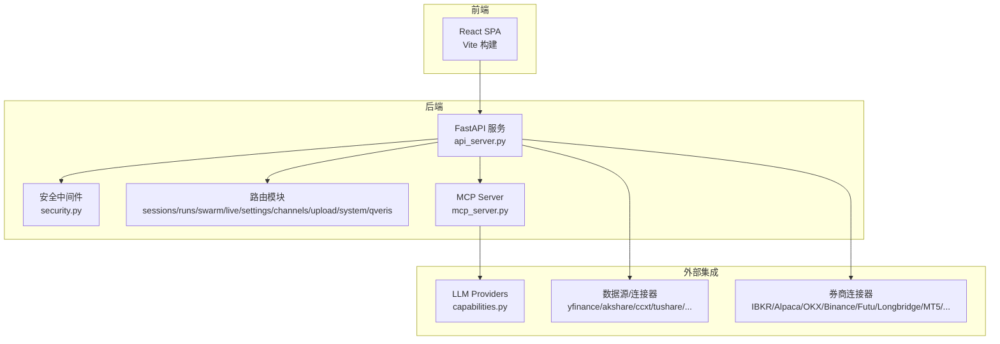
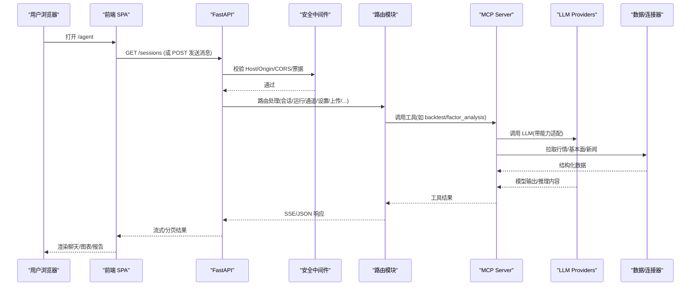
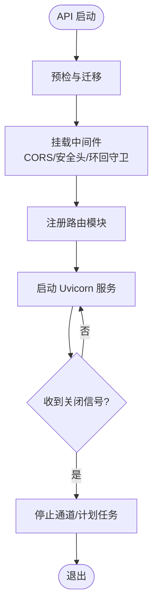
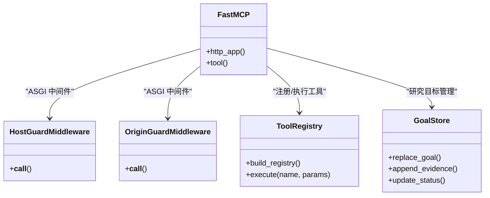
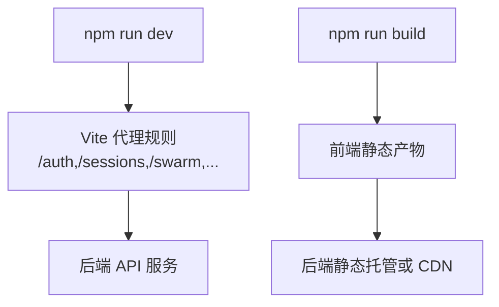
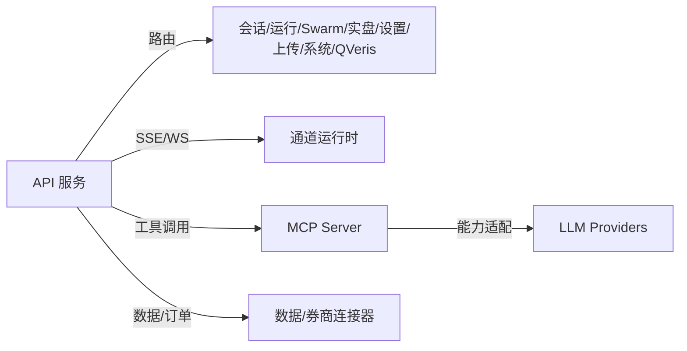

# 架构设计

<cite>
**本文引用的文件**
- [README.md](file://README.md)
- [pyproject.toml](file://pyproject.toml)
- [Dockerfile](file://Dockerfile)
- [docker-compose.yml](file://docker-compose.yml)
- [agent/api_server.py](file://agent/api_server.py)
- [agent/mcp_server.py](file://agent/mcp_server.py)
- [frontend/package.json](file://frontend/package.json)
- [frontend/vite.config.ts](file://frontend/vite.config.ts)
- [frontend/src/router.tsx](file://frontend/src/router.tsx)
- [agent/src/api/security.py](file://agent/src/api/security.py)
- [agent/src/providers/capabilities.py](file://agent/src/providers/capabilities.py)
</cite>

## 目录
1. [简介](#简介)
2. [项目结构](#项目结构)
3. [核心组件](#核心组件)
4. [架构总览](#架构总览)
5. [详细组件分析](#详细组件分析)
6. [依赖关系分析](#依赖关系分析)
7. [性能考虑](#性能考虑)
8. [故障排查指南](#故障排查指南)
9. [结论](#结论)
10. [附录](#附录)

## 简介
Vibe-Trading 是一个以自然语言驱动的金融研究 AI 智能体系统，提供回测、因子库、多市场数据接入、实时通道（IM/邮件/WebSocket）、MCP 工具服务与 Web UI。系统采用前后端分离、微服务化部署（API + MCP + 可选前端开发服务），并通过插件化的技能/策略/连接器扩展能力；同时引入事件驱动（SSE/WS）与可插拔 LLM Provider 能力层，形成“研究—验证—交付”的闭环工作流。

## 项目结构
仓库按领域分层组织：
- 后端 API（FastAPI）：统一入口、安全中间件、路由模块化、会话/运行/通道/设置/上传/Swarm/实盘等模块
- MCP Server：面向外部客户端的工具总线，暴露研究、回测、数据、Swarm、交易读取等工具
- 前端（React/Vite）：SPA，懒加载页面，代理到后端 API
- 基础设施：Docker/Docker Compose 构建镜像、容器编排、只读根文件系统、资源限制、健康检查
- 配置与依赖：Python 包元数据、可选 extras、前端工程配置

图表来源
- [agent/api_server.py:163-303](file://agent/api_server.py#L163-L303)
- [agent/mcp_server.py:69-117](file://agent/mcp_server.py#L69-L117)
- [frontend/vite.config.ts:21-51](file://frontend/vite.config.ts#L21-L51)
- [agent/src/providers/capabilities.py:157-200](file://agent/src/providers/capabilities.py#L157-L200)

章节来源
- [agent/api_server.py:163-303](file://agent/api_server.py#L163-L303)
- [frontend/vite.config.ts:21-51](file://frontend/vite.config.ts#L21-L51)
- [frontend/src/router.tsx:48-66](file://frontend/src/router.tsx#L48-L66)

## 核心组件
- FastAPI 应用与生命周期管理：启动预检、迁移、计划任务与通道运行时启停
- 安全与鉴权：CORS、CSRF、Host/Origin 白名单、SSE 票据、本地环回保护
- 路由模块化：会话、运行、Swarm、实盘、设置、上传、系统、QVeris、认证等
- MCP Server：工具注册、网络传输（stdio/sse/http）、DNS 重绑定防护、Shell 工具门控
- 前端 SPA：路由懒加载、Vite 代理、按需加载图表与数据
- 基础设施：Docker 多阶段构建、只读根文件系统、资源限制、健康检查

章节来源
- [agent/api_server.py:127-183](file://agent/api_server.py#L127-L183)
- [agent/src/api/security.py:166-200](file://agent/src/api/security.py#L166-L200)
- [agent/mcp_server.py:131-316](file://agent/mcp_server.py#L131-L316)
- [frontend/src/router.tsx:48-66](file://frontend/src/router.tsx#L48-L66)

## 架构总览
系统采用“前后端分离 + 微服务 + 插件化 + 事件驱动”的组合模式：
- 前后端分离：前端通过 Vite 构建并静态托管，开发期通过代理转发至后端 API
- 微服务：API 服务与 MCP 服务解耦，前者承载 Web/UI/REST/SSE，后者暴露工具给任意 MCP 客户端
- 插件化：技能（skills）、因子（factors/zoo）、连接器（broker/data loaders）、Provider（LLM）均可插拔
- 事件驱动：SSE/WS 用于会话流、Swarm 状态、通道消息等实时交互

图表来源
- [agent/api_server.py:163-303](file://agent/api_server.py#L163-L303)
- [agent/mcp_server.py:69-117](file://agent/mcp_server.py#L69-L117)
- [agent/src/api/security.py:166-200](file://agent/src/api/security.py#L166-L200)

## 详细组件分析

### 后端 API 服务（FastAPI）
- 职责：组装应用、挂载中间件、注册路由、启动/关闭钩子、提供 SPA 静态资源
- 关键流程：
  - 启动预检：迁移旧状态、运行 preflight、启动计划任务、可选自动启动通道运行时
  - 中间件：CORS、拒绝不可信环回主机、SPA 深链回退、安全头注入
  - 路由注册：runs/sessions/system/settings/uploads/channels/qveris/swarm/live/auth 等
- 安全要点：
  - CORS 默认仅允许本地开发端口，禁止 credentialed wildcard
  - 拒绝不受信任的 loopback Host，防止 DNS 重绑定绕过鉴权
  - 对敏感操作要求 API Key，远程访问需显式授权

图表来源
- [agent/api_server.py:127-183](file://agent/api_server.py#L127-L183)
- [agent/api_server.py:187-303](file://agent/api_server.py#L187-L303)
- [agent/api_server.py:321-395](file://agent/api_server.py#L321-L395)

章节来源
- [agent/api_server.py:127-183](file://agent/api_server.py#L127-L183)
- [agent/api_server.py:187-303](file://agent/api_server.py#L187-L303)
- [agent/api_server.py:321-395](file://agent/api_server.py#L321-L395)

### MCP 服务器（工具总线）
- 职责：暴露研究/回测/数据/交易读取/调度等工具，支持 stdio/sse/http 传输
- 安全加固：
  - 网络传输下启用 Host/Origin 白名单，拒绝不受信任跨域请求
  - Shell 工具默认关闭，需显式环境变量或 CLI 参数开启
  - 参数容错：对 JSON 字符串形式的 list/dict 参数进行解码
- 工具注册：懒加载 SkillsLoader、工具注册表、GoalStore，避免冷启动开销

图表来源
- [agent/mcp_server.py:131-316](file://agent/mcp_server.py#L131-L316)
- [agent/mcp_server.py:319-344](file://agent/mcp_server.py#L319-L344)
- [agent/mcp_server.py:411-457](file://agent/mcp_server.py#L411-L457)

章节来源
- [agent/mcp_server.py:131-316](file://agent/mcp_server.py#L131-L316)
- [agent/mcp_server.py:319-344](file://agent/mcp_server.py#L319-L344)
- [agent/mcp_server.py:411-457](file://agent/mcp_server.py#L411-L457)

### 前端 SPA（React + Vite）
- 职责：用户界面、路由、懒加载页面、图表渲染、与后端 API 通信
- 开发期：Vite 代理将特定路径转发到后端 API，便于本地调试
- 生产期：静态资源由后端托管或通过反向代理分发

图表来源
- [frontend/vite.config.ts:21-51](file://frontend/vite.config.ts#L21-L51)
- [frontend/package.json:9-15](file://frontend/package.json#L9-L15)

章节来源
- [frontend/vite.config.ts:21-51](file://frontend/vite.config.ts#L21-L51)
- [frontend/package.json:9-15](file://frontend/package.json#L9-L15)
- [frontend/src/router.tsx:48-66](file://frontend/src/router.tsx#L48-L66)

### 安全与鉴权
- CORS：默认仅本地开发端口，禁止 credentialed wildcard；支持额外白名单追加
- 环回保护：拒绝不受信任的 Host，防止 DNS 重绑定绕过本地鉴权
- CSP：限制脚本/样式/字体/图片来源，仅允许必要内联样式
- SSE 票据：短生命周期一次性票据，降低重放风险
- Shell 工具：默认关闭，需显式开启

章节来源
- [agent/src/api/security.py:30-116](file://agent/src/api/security.py#L30-L116)
- [agent/src/api/security.py:166-200](file://agent/src/api/security.py#L166-L200)
- [agent/mcp_server.py:131-316](file://agent/mcp_server.py#L131-L316)

### 事件驱动与通道
- 通道运行时：支持多种 IM/邮件/WebSocket 适配器，CLI/API/Web 统一管理
- 计划任务：定时研究执行器，支持 cron/时区，默认关闭
- 事件流：SSE 用于会话/进度/状态推送

章节来源
- [agent/api_server.py:127-150](file://agent/api_server.py#L127-L150)
- [agent/api_server.py:235-253](file://agent/api_server.py#L235-L253)

### 技术栈与版本兼容性
- Python 3.11–3.13，FastAPI/Uvicorn、Pydantic、LangChain/LangGraph、WebSockets、DuckDB、Pandas、Numpy/Scipy、WeasyPrint、Prompt Toolkit 等
- 前端 Node 22，React 19，Vite，Tailwind，ECharts，i18next，Zustand
- Docker 多阶段构建，最小化运行时镜像，只读根文件系统，资源限制与健康检查

章节来源
- [pyproject.toml:1-69](file://pyproject.toml#L1-L69)
- [pyproject.toml:105-223](file://pyproject.toml#L105-L223)
- [frontend/package.json:1-58](file://frontend/package.json#L1-L58)
- [Dockerfile:1-108](file://Dockerfile#L1-L108)
- [docker-compose.yml:1-90](file://docker-compose.yml#L1-L90)

## 依赖关系分析
- 组件耦合：
  - API 与路由高内聚低耦合，通过模块化注册减少单体膨胀
  - MCP 与 Provider/数据源松耦合，通过工具注册表与能力层隔离差异
  - 前端与后端通过 REST/SSE/WS 解耦，开发期通过代理透明转发
- 外部依赖：
  - LLM Providers：OpenAI、Gemini、Kimi、Ollama、ModelScope 等，能力层封装差异
  - 数据源：yfinance、akshare、ccxt、tushare、okx 等，统一 loader 接口
  - 券商连接器：IBKR、Alpaca、OKX、Binance、Futu、Longbridge、MT5 等，统一纸盘/实盘边界

图表来源
- [agent/api_server.py:187-303](file://agent/api_server.py#L187-L303)
- [agent/mcp_server.py:69-117](file://agent/mcp_server.py#L69-L117)
- [agent/src/providers/capabilities.py:157-200](file://agent/src/providers/capabilities.py#L157-L200)

章节来源
- [agent/api_server.py:187-303](file://agent/api_server.py#L187-L303)
- [agent/mcp_server.py:69-117](file://agent/mcp_server.py#L69-L117)
- [agent/src/providers/capabilities.py:157-200](file://agent/src/providers/capabilities.py#L157-L200)

## 性能考虑
- 懒加载与按需初始化：MCP 工具注册表、SkillsLoader、GoalStore 均延迟实例化
- 缓存与降级：数据源可选本地缓存，批量下载在命中时跳过；部分失败优雅降级
- 并发与限流：异步 I/O（aiohttp/httpx/websockets），SSE 心跳保活，长任务进度反馈
- 资源限制：容器 CPU/内存/PID 限制，只读根文件系统减少写放大
- 前端优化：代码分割（vendor-charts/vendor-react）、懒加载页面、按需加载图表

[本节为通用指导，不直接分析具体文件]

## 故障排查指南
- 启动失败：
  - 检查预检日志、环境变量（API_KEY、CORS、OLLAMA_BASE_URL）、端口占用
  - 确认 Docker 卷挂载与权限（runs/sessions/home/uploads）
- 鉴权问题：
  - 远程访问需设置 API_AUTH_KEY；本地开发使用 localhost 端口
  - 检查 CORS 配置是否包含前端 origin；Host/Origin 白名单是否放行
- 通道/计划任务：
  - 确认通道运行时是否自动启动；计划任务开关与环境变量
- MCP 工具：
  - 网络传输需 Host/Origin 白名单；Shell 工具需显式开启
  - 参数类型兼容：list/dict 可能以 JSON 字符串传递，已内置解码

章节来源
- [agent/api_server.py:127-183](file://agent/api_server.py#L127-L183)
- [agent/src/api/security.py:166-200](file://agent/src/api/security.py#L166-L200)
- [agent/mcp_server.py:131-316](file://agent/mcp_server.py#L131-L316)
- [docker-compose.yml:1-90](file://docker-compose.yml#L1-L90)

## 结论
Vibe-Trading 通过前后端分离、微服务化、插件化与事件驱动，构建了可扩展、可审计、可交付的金融研究平台。其安全设计覆盖 CORS/CSRF/Host/Origin/SSE 票据与 Shell 工具门控；部署层面采用容器化与资源限制保障稳定性；扩展面涵盖 LLM Provider、数据源与券商连接器，满足多市场、多场景的研究与回测需求。

[本节为总结性内容，不直接分析具体文件]

## 附录
- 部署拓扑建议：
  - 单机开发：本地 API + Vite 开发服务器
  - 生产环境：API 服务 + 反向代理 + 前端静态托管；MCP 独立进程
  - 容器化：使用提供的 Dockerfile 与 docker-compose，持久化命名卷
- 横切关注点：
  - 安全性：最小权限、只读根文件系统、资源限制、安全头、CSP
  - 监控：健康检查 /live，SSE 心跳，运行卡片与审计账本
  - 灾难恢复：持久化卷、会话/运行/记忆落盘、计划任务可重启

[本节为通用指导，不直接分析具体文件]