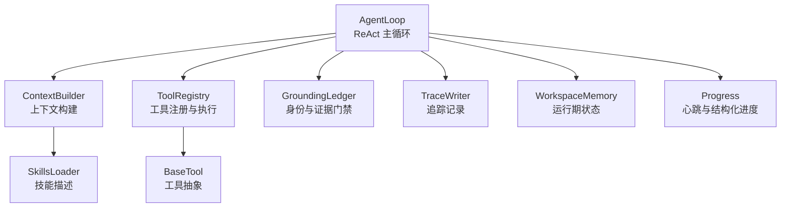
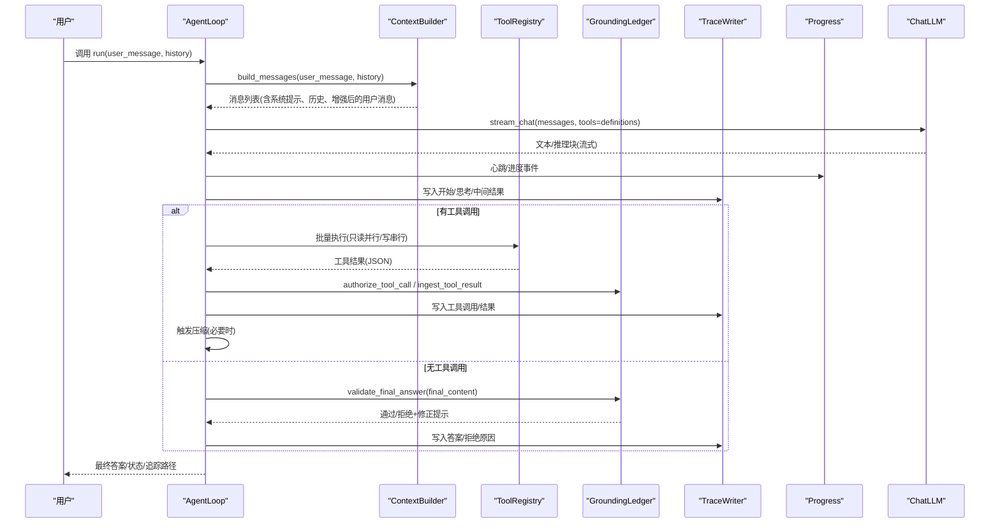
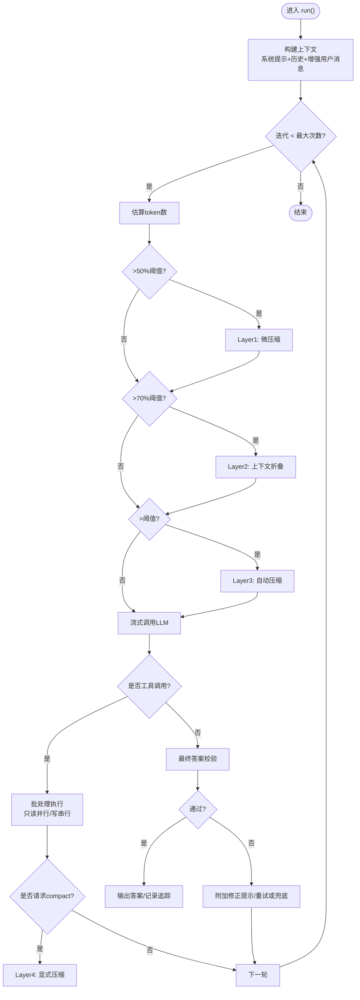
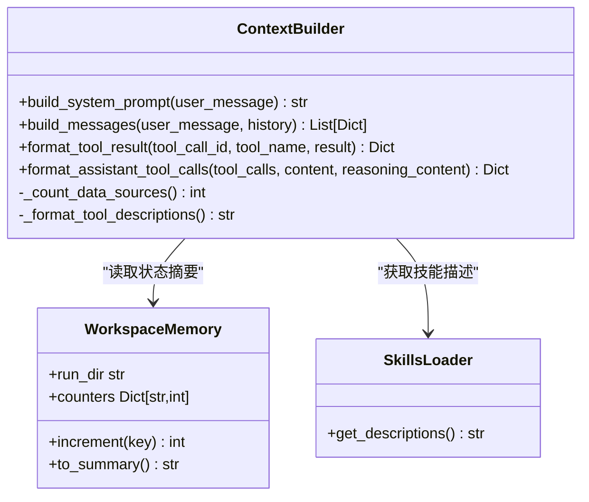
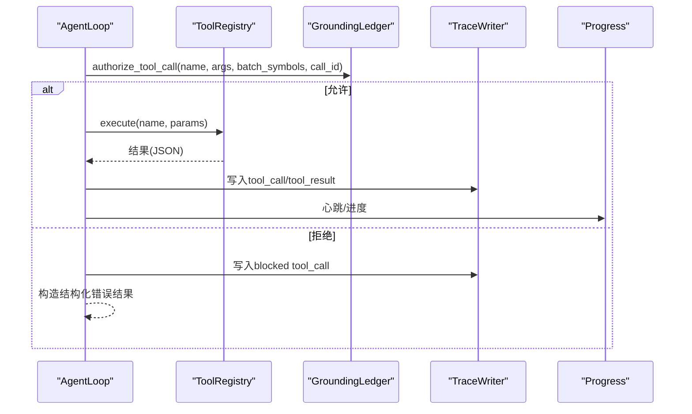
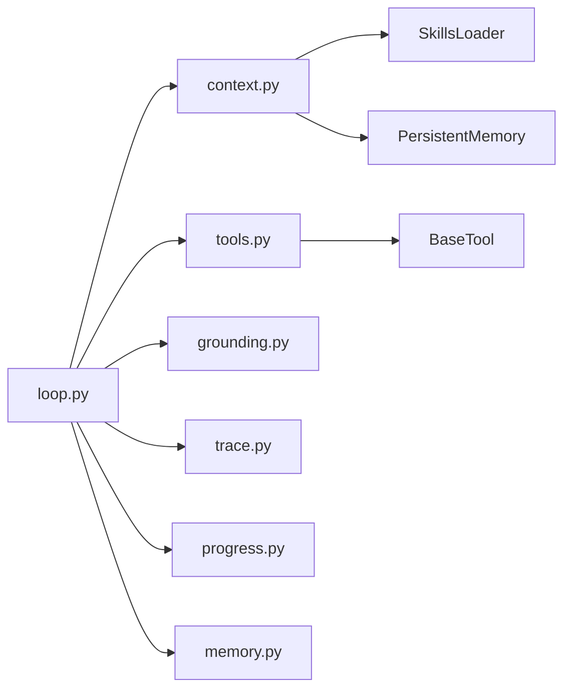

# Agent核心循环

<cite>
**本文引用的文件**
- [loop.py](file://agent/src/agent/loop.py)
- [context.py](file://agent/src/agent/context.py)
- [memory.py](file://agent/src/agent/memory.py)
- [tools.py](file://agent/src/agent/tools.py)
- [grounding.py](file://agent/src/agent/grounding.py)
- [progress.py](file://agent/src/agent/progress.py)
- [trace.py](file://agent/src/agent/trace.py)
- [test_agent_loop_stream_retry.py](file://agent/tests/test_agent_loop_stream_retry.py)
</cite>

## 目录
1. [简介](#简介)
2. [项目结构](#项目结构)
3. [核心组件](#核心组件)
4. [架构总览](#架构总览)
5. [详细组件分析](#详细组件分析)
6. [依赖关系分析](#依赖关系分析)
7. [性能考量](#性能考量)
8. [故障排查指南](#故障排查指南)
9. [结论](#结论)
10. [附录：配置、调试与监控](#附录配置调试与监控)

## 简介
本文件为 Vibe-Trading Agent 的“核心循环”提供深入文档，聚焦 ReAct 模式的实现机制、Agent 状态管理、工具调用流程与消息处理管道。重点说明上下文构建器（ContextBuilder）如何生成系统提示词、注入工具描述、管理记忆快照并增强用户消息；解释 Agent 生命周期管理、错误恢复机制与性能优化策略；并提供配置选项、调试方法与监控指标，以及典型使用场景与最佳实践。

## 项目结构
围绕核心循环的关键模块位于 agent/src/agent 下：
- loop.py：ReAct 主循环、迭代控制、流式输出、压缩与工具批处理、追踪与状态落盘
- context.py：上下文构建器，负责系统提示词、工具描述、技能摘要、持久化记忆注入与消息组装
- memory.py：工作区内存（单次运行内共享状态）
- tools.py：工具基类与注册表，统一工具执行与 OpenAI 函数调用格式
- grounding.py：身份与数值证据门禁，保障最终答案可溯源、不矛盾
- progress.py：长耗时工具的进度与心跳通道
- trace.py：崩溃安全的 JSONL 追踪写入与大字段旁路存储

图表来源
- [loop.py:502-1203](file://agent/src/agent/loop.py#L502-L1203)
- [context.py:210-396](file://agent/src/agent/context.py#L210-L396)
- [tools.py:13-95](file://agent/src/agent/tools.py#L13-L95)
- [grounding.py:584-753](file://agent/src/agent/grounding.py#L584-L753)
- [trace.py:64-183](file://agent/src/agent/trace.py#L64-L183)
- [memory.py:13-54](file://agent/src/agent/memory.py#L13-L54)
- [progress.py:123-185](file://agent/src/agent/progress.py#L123-L185)

章节来源
- [loop.py:502-1203](file://agent/src/agent/loop.py#L502-L1203)
- [context.py:210-396](file://agent/src/agent/context.py#L210-L396)
- [tools.py:13-95](file://agent/src/agent/tools.py#L13-L95)
- [grounding.py:584-753](file://agent/src/agent/grounding.py#L584-L753)
- [trace.py:64-183](file://agent/src/agent/trace.py#L64-L183)
- [memory.py:13-54](file://agent/src/agent/memory.py#L13-L54)
- [progress.py:123-185](file://agent/src/agent/progress.py#L123-L185)

## 核心组件
- AgentLoop：ReAct 主循环，负责迭代控制、流式响应、内容过滤、目标延续、工具批处理、上下文压缩、追踪与状态落盘。
- ContextBuilder：构建系统提示词、注入工具描述与技能摘要、加载持久化记忆快照、将相关记忆自动召回并注入用户消息。
- WorkspaceMemory：单次运行内的共享状态（如 run_dir、计数器），用于工具间协作与状态摘要。
- ToolRegistry/BaseTool：工具注册、参数校验、OpenAI 函数定义导出与执行封装。
- GroundingLedger：身份锁定与数值证据门禁，确保最终答案中的数字与标的可追溯且不矛盾。
- TraceWriter：崩溃安全的 JSONL 追踪，大字段旁路存储，保证可观测性与可回溯性。
- Progress：心跳定时器与结构化进度事件，支持长耗时工具的可观测性。

章节来源
- [loop.py:502-1203](file://agent/src/agent/loop.py#L502-L1203)
- [context.py:210-396](file://agent/src/agent/context.py#L210-L396)
- [memory.py:13-54](file://agent/src/agent/memory.py#L13-L54)
- [tools.py:13-95](file://agent/src/agent/tools.py#L13-L95)
- [grounding.py:584-753](file://agent/src/agent/grounding.py#L584-L753)
- [trace.py:64-183](file://agent/src/agent/trace.py#L64-L183)
- [progress.py:123-185](file://agent/src/agent/progress.py#L123-L185)

## 架构总览
下图展示一次 ReAct 迭代的端到端流程：从上下文构建到 LLM 流式响应、工具调用与结果回写、压缩与追踪、最终答案验证与落盘。

图表来源
- [loop.py:624-1203](file://agent/src/agent/loop.py#L624-L1203)
- [context.py:286-322](file://agent/src/agent/context.py#L286-L322)
- [tools.py:72-84](file://agent/src/agent/tools.py#L72-L84)
- [grounding.py:666-753](file://agent/src/agent/grounding.py#L666-L753)
- [trace.py:92-183](file://agent/src/agent/trace.py#L92-L183)
- [progress.py:123-185](file://agent/src/agent/progress.py#L123-L185)

## 详细组件分析

### AgentLoop：ReAct 主循环
- 迭代控制与终止条件
  - 最大迭代次数限制，接近上限时注入“收尾”提示，强制模型停止工具调用并输出最终答案。
  - 空响应检测：若连续返回空内容，记录提供者信息并提前结束。
- 流式输出与思考文本
  - 通过 on_text_chunk/on_reasoning_chunk 实时推送文本与推理片段，推理输出按最小间隔节流，避免 UI 缓冲压力。
  - 思考文本在每轮结束时以“thinking_done”事件发出，供前端或日志消费。
- 内容过滤熔断
  - 当连续多次被内容过滤器拦截时，触发熔断并终止本轮，防止无效循环。
- 目标延续
  - 结合目标上下文，若任务未完成且进展未停滞，会追加“继续”提示，形成多轮推进。
- 工具批处理与顺序保持
  - 将相邻只读工具合并为并行批次执行，写操作串行执行，保证幂等与一致性。
  - 重复调用保护：非 repeatable 工具成功调用后再次调用会被跳过。
- 上下文压缩（五层策略）
  - Layer1 微压缩：仅清理旧工具结果保留最近 N 条。
  - Layer2 上下文折叠：对长文本进行首尾保留、中间折叠，零 API 成本。
  - Layer3 自动压缩：超过 token 阈值时触发 LLM 结构化摘要，带尾部预算保护。
  - Layer4 显式 compact 工具：由模型主动请求压缩，支持聚焦主题。
  - Layer5 迭代更新：N 次压缩采用增量更新而非从头重建。
- 追踪与审计
  - 每次迭代写入 trace.jsonl，大字段旁路存储，保证崩溃安全。
  - 运行清单（run_manifest.json）记录系统提示哈希、工具集与包版本，便于复现审计。
- 错误恢复
  - 流式中断重试：ProviderStreamError 仅重试一次，丢弃失败尝试的已发送块，避免重复。
  - 身份门禁失败：构造结构化错误结果，引导模型先调用 search_symbol 锁定身份。
  - 最终答案校验失败：附加修正提示，最多允许有限次重试，否则给出安全兜底。

图表来源
- [loop.py:710-1203](file://agent/src/agent/loop.py#L710-L1203)
- [loop.py:227-320](file://agent/src/agent/loop.py#L227-L320)
- [loop.py:1207-1599](file://agent/src/agent/loop.py#L1207-L1599)

章节来源
- [loop.py:624-1203](file://agent/src/agent/loop.py#L624-L1203)
- [loop.py:1207-1599](file://agent/src/agent/loop.py#L1207-L1599)
- [test_agent_loop_stream_retry.py:147-194](file://agent/tests/test_agent_loop_stream_retry.py#L147-L194)

### 上下文构建器：系统提示词、工具描述、记忆快照与用户消息增强
- 系统提示词生成
  - 固定输出原则与任务路由规则，动态注入工具数量、技能数量、数据源数量、工具描述、技能摘要、当前时间与运行状态摘要。
  - 系统提示词不含会话输入，保证缓存稳定。
- 工具描述注入
  - 遍历注册的工具，提取名称、描述与参数定义，生成可读的结构化描述，帮助模型正确选择与调用工具。
- 记忆快照管理
  - 若存在持久化记忆，则在系统提示中注入跨会话记忆快照，使模型具备长期上下文。
- 用户消息增强
  - 基于用户消息检索相关记忆，将召回片段以“<recalled-memories>”包裹注入到用户消息前，提升回答相关性。
- 消息组装
  - 组装 system + history + user 的标准消息序列，供 LLM 消费。

图表来源
- [context.py:210-396](file://agent/src/agent/context.py#L210-L396)
- [memory.py:13-54](file://agent/src/agent/memory.py#L13-L54)

章节来源
- [context.py:210-396](file://agent/src/agent/context.py#L210-L396)
- [memory.py:13-54](file://agent/src/agent/memory.py#L13-L54)

### 工具调用流程与批处理
- 工具注册与执行
  - BaseTool 定义统一接口与 OpenAI 函数调用格式；ToolRegistry 负责注册、查询与执行，异常时返回结构化错误。
- 批处理调度
  - 将相邻只读工具合并为并行批次（线程池），写操作串行执行，保证顺序与一致性。
  - 每个工具调用前后记录事件与追踪，支持心跳与进度上报。
- 身份门禁
  - 在执行前调用 GroundingLedger.authorize_tool_call 检查身份锁定状态与符号匹配，阻止非法或冲突调用。
- 重复调用保护
  - 非 repeatable 工具成功后再次调用将被跳过，避免冗余开销。

图表来源
- [tools.py:13-95](file://agent/src/agent/tools.py#L13-L95)
- [loop.py:1207-1599](file://agent/src/agent/loop.py#L1207-L1599)
- [grounding.py:666-753](file://agent/src/agent/grounding.py#L666-L753)
- [trace.py:142-183](file://agent/src/agent/trace.py#L142-L183)
- [progress.py:123-185](file://agent/src/agent/progress.py#L123-L185)

章节来源
- [tools.py:13-95](file://agent/src/agent/tools.py#L13-L95)
- [loop.py:1207-1599](file://agent/src/agent/loop.py#L1207-L1599)
- [grounding.py:666-753](file://agent/src/agent/grounding.py#L666-L753)

### 消息处理管道与追踪
- 消息流转
  - 系统提示 → 历史消息 → 增强后的用户消息 → LLM 流式响应 → 工具调用与结果 → 最终答案。
- 追踪记录
  - 关键节点均写入 trace.jsonl，包括开始、用户消息、思考、工具调用、工具结果、答案、拒绝原因、结束状态等。
  - 大字段（如工具结果、思考文本）旁路存储，减少主文件体积，同时保证完整性与可恢复性。
- 运行清单
  - 记录系统提示哈希、工具集与包版本，支撑可复现审计。

章节来源
- [trace.py:64-183](file://agent/src/agent/trace.py#L64-L183)
- [loop.py:567-623](file://agent/src/agent/loop.py#L567-L623)
- [loop.py:906-1086](file://agent/src/agent/loop.py#L906-L1086)

### 身份与数值证据门禁（Grounding）
- 身份锁定
  - 要求市场敏感型工具调用前必须通过 search_symbol 锁定唯一标的与交易所后缀，禁止静默改写。
- 数值证据
  - 收集工具返回的价格、时间戳等数值证据，最终答案不得与之矛盾，且必须附带来源与时间。
- 授权决策
  - 根据批次冻结的身份状态与符号集合，决定工具调用是否允许，拒绝时返回结构化错误与修复指引。

章节来源
- [grounding.py:584-753](file://agent/src/agent/grounding.py#L584-L753)
- [grounding.py:789-800](file://agent/src/agent/grounding.py#L789-L800)

## 依赖关系分析
- 松耦合设计
  - AgentLoop 通过接口与模块解耦：ContextBuilder、ToolRegistry、GroundingLedger、TraceWriter、Progress 均为独立模块，便于替换与测试。
- 直接依赖
  - loop.py 依赖 context.py、tools.py、grounding.py、trace.py、progress.py、memory.py 及外部 LLM 提供者。
- 间接依赖
  - context.py 依赖 SkillsLoader 与 PersistentMemory；tools.py 依赖 BaseTool 抽象；grounding.py 依赖正则与数据结构。

图表来源
- [loop.py:28-51](file://agent/src/agent/loop.py#L28-L51)
- [context.py:11-16](file://agent/src/agent/context.py#L11-L16)
- [tools.py:13-95](file://agent/src/agent/tools.py#L13-L95)

章节来源
- [loop.py:28-51](file://agent/src/agent/loop.py#L28-L51)
- [context.py:11-16](file://agent/src/agent/context.py#L11-L16)
- [tools.py:13-95](file://agent/src/agent/tools.py#L13-L95)

## 性能考量
- 上下文压缩五层策略
  - 仅在 token 超限时触发更重压缩，优先使用低成本折叠与微压缩，降低 LLM 调用频率。
- 工具批处理
  - 只读工具并行执行，写操作串行，最大化吞吐同时保证一致性。
- 流式输出与节流
  - 推理输出按最小间隔节流，避免 UI 缓冲溢出；心跳定时保活，提升长耗时任务体验。
- 追踪大字段旁路
  - 大字段外置存储，减少主文件体积与 I/O 压力，提高读写效率。
- 重试与熔断
  - 流式中断仅重试一次，避免浪费；内容过滤连续拦截触发熔断，快速止损。

章节来源
- [loop.py:227-320](file://agent/src/agent/loop.py#L227-L320)
- [loop.py:1207-1599](file://agent/src/agent/loop.py#L1207-L1599)
- [trace.py:44-53](file://agent/src/agent/trace.py#L44-L53)
- [progress.py:123-185](file://agent/src/agent/progress.py#L123-L185)

## 故障排查指南
- 流式中断
  - 现象：ProviderStreamError 抛出，可能伴随部分文本块已发送。
  - 处理：自动重试一次，丢弃失败尝试的已发送块，避免重复；若再次失败则标记 provider_stream_error。
  - 参考：[test_agent_loop_stream_retry.py:147-194](file://agent/tests/test_agent_loop_stream_retry.py#L147-L194)
- 内容过滤熔断
  - 现象：连续多次被内容过滤器拦截。
  - 处理：达到阈值后熔断并终止，记录 content_filter_circuit_breaker。
- 空响应
  - 现象：模型返回空内容且无工具调用。
  - 处理：记录 provider/model/iteration，提前结束并标记失败。
- 身份门禁拒绝
  - 现象：工具调用被拒绝，返回 identity_required/identity_conflict/identity_mismatch。
  - 处理：引导模型先调用 search_symbol 锁定身份，再重试。
- 最终答案校验失败
  - 现象：数值或标的与证据不一致或缺失来源。
  - 处理：附加修正提示，最多有限次重试，否则给出安全兜底答案。

章节来源
- [test_agent_loop_stream_retry.py:147-194](file://agent/tests/test_agent_loop_stream_retry.py#L147-L194)
- [loop.py:816-857](file://agent/src/agent/loop.py#L816-L857)
- [loop.py:920-941](file://agent/src/agent/loop.py#L920-L941)
- [loop.py:946-998](file://agent/src/agent/loop.py#L946-L998)
- [grounding.py:666-753](file://agent/src/agent/grounding.py#L666-L753)

## 结论
Vibe-Trading Agent 的核心循环以 ReAct 模式为基础，结合五层上下文压缩、工具批处理、身份与数值证据门禁、流式输出与心跳、崩溃安全的追踪与运行清单，实现了高可靠、可观测、可复现的 Agent 执行环境。其模块化设计与完善的错误恢复机制，使其在复杂金融研究场景中具备鲁棒性与扩展性。

## 附录：配置、调试与监控
- 配置选项（来自环境变量与配置访问器）
  - 令牌阈值：agent_tuning.token_threshold
  - 心跳间隔：agent_tuning.vt_heartbeat_interval_s
  - 推理最小间隔：agent_tuning.vt_reasoning_delta_min_interval_s
  - 流重试延迟：agent_tuning.vt_stream_retry_delay_s
  - 工具超时：agent_tuning.vibe_trading_tool_timeout_seconds
  - 目标最大延续：agent_tuning.vibe_trading_goal_max_continuations
- 调试方法
  - 启用追踪：查看 trace.jsonl 与 sidecar 文件，定位工具调用与结果。
  - 运行清单：检查 run_manifest.json，确认系统提示哈希与工具集。
  - 事件回调：通过 event_callback 接收 tool_call、tool_progress、text_delta、reasoning_delta、llm_usage 等事件。
- 监控指标
  - 迭代次数、工具调用次数、流重试次数、内容过滤拦截次数、最终状态与原因。
  - LLM 用量：input_tokens/output_tokens/total_tokens/calls，逐轮累计。
  - 心跳与进度：工具执行时长、阶段、当前/总数、消息详情。

章节来源
- [loop.py:74-120](file://agent/src/agent/loop.py#L74-L120)
- [loop.py:156-205](file://agent/src/agent/loop.py#L156-L205)
- [trace.py:64-183](file://agent/src/agent/trace.py#L64-L183)
- [progress.py:30-63](file://agent/src/agent/progress.py#L30-L63)