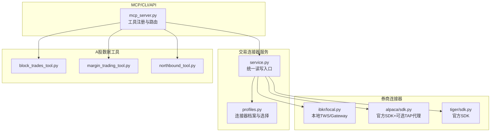
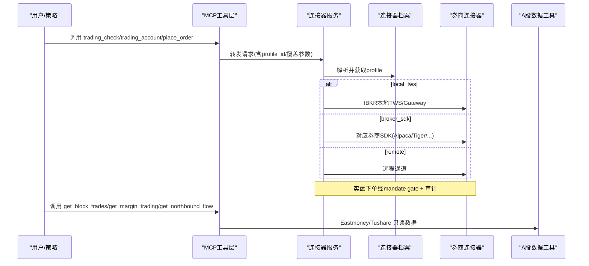
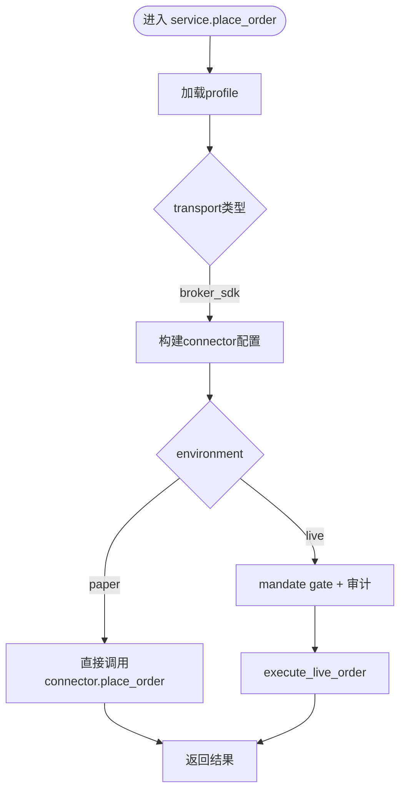
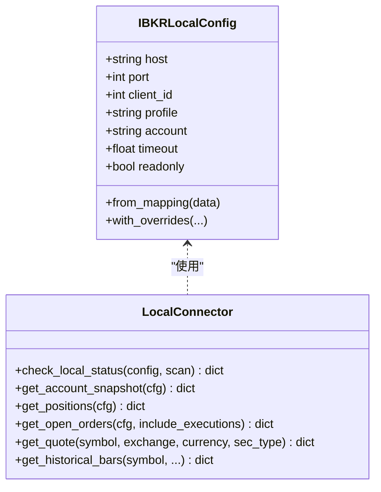
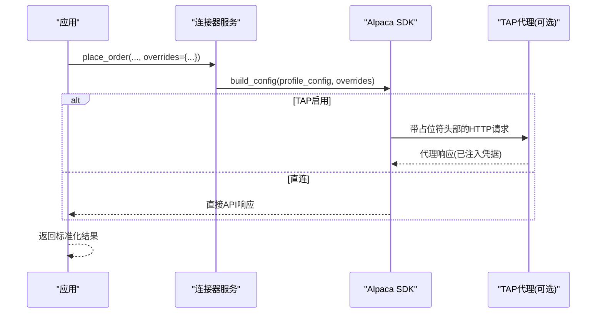
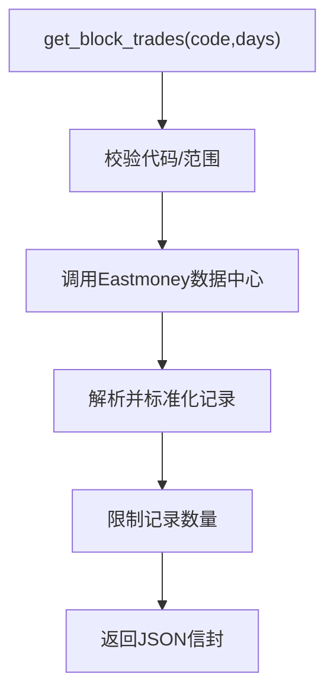
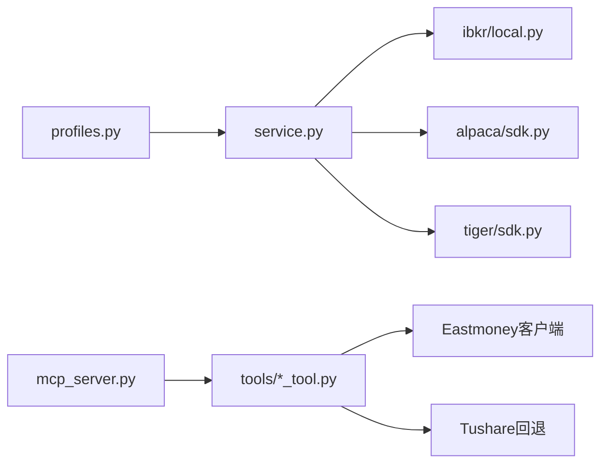

# 交易连接器工具

<cite>
**本文引用的文件**   
- [agent/src/trading/service.py](file://agent/src/trading/service.py)
- [agent/src/trading/profiles.py](file://agent/src/trading/profiles.py)
- [agent/src/trading/connectors/ibkr/local.py](file://agent/src/trading/connectors/ibkr/local.py)
- [agent/src/trading/connectors/alpaca/sdk.py](file://agent/src/trading/connectors/alpaca/sdk.py)
- [agent/src/trading/connectors/tiger/sdk.py](file://agent/src/trading/connectors/tiger/sdk.py)
- [agent/src/tools/block_trades_tool.py](file://agent/src/tools/block_trades_tool.py)
- [agent/src/tools/margin_trading_tool.py](file://agent/src/tools/margin_trading_tool.py)
- [agent/src/tools/northbound_tool.py](file://agent/src/tools/northbound_tool.py)
- [agent/src/tools/trading_connector_tool.py](file://agent/src/tools/trading_connector_tool.py)
- [agent/mcp_server.py](file://agent/mcp_server.py)
</cite>

## 目录
1. [简介](#简介)
2. [项目结构](#项目结构)
3. [核心组件](#核心组件)
4. [架构总览](#架构总览)
5. [详细组件分析](#详细组件分析)
6. [依赖关系分析](#依赖关系分析)
7. [性能与可靠性](#性能与可靠性)
8. [故障排查指南](#故障排查指南)
9. [结论](#结论)
10. [附录：常用调用示例路径](#附录：常用调用示例路径)

## 简介
本文件为 Vibe-Trading 交易连接器工具的权威技术文档，聚焦以下目标：
- 券商连接管理：统一接入、认证配置、环境隔离（模拟/实盘只读/实盘可写）
- A 股特色数据：大宗交易查询、融资融券分析、北向资金追踪
- 多平台接入规范：IBKR 本地 TWS/Gateway、Alpaca、Tiger 等直连 SDK；MCP 工具暴露统一接口
- 安全与风控：指令前校验、授权委托（mandate）、审计日志、熔断与失败关闭
- 自动化策略组合：通过 MCP/CLI/API 串联连接器与数据工具，实现端到端策略闭环

## 项目结构
交易能力由“连接器服务 + 数据工具 + MCP 工具层”构成：
- 连接器服务：抽象不同券商的读取与写入操作，按 transport（local_tws / broker_sdk / remote）路由到具体实现
- 数据工具：面向 A 股的 Eastmoney/Tushare 数据源，提供大宗交易、融资融券、北向资金等只读工具
- MCP 工具层：对外暴露 trading_*、get_block_trades、get_margin_trading、get_northbound_flow 等工具

图表来源
- [agent/mcp_server.py:1172-1243](file://agent/mcp_server.py#L1172-L1243)
- [agent/src/trading/service.py:1-226](file://agent/src/trading/service.py#L1-L226)
- [agent/src/trading/profiles.py:1-70](file://agent/src/trading/profiles.py#L1-L70)
- [agent/src/trading/connectors/ibkr/local.py:1-200](file://agent/src/trading/connectors/ibkr/local.py#L1-L200)
- [agent/src/trading/connectors/alpaca/sdk.py:1-200](file://agent/src/trading/connectors/alpaca/sdk.py#L1-L200)
- [agent/src/trading/connectors/tiger/sdk.py:1-200](file://agent/src/trading/connectors/tiger/sdk.py#L1-L200)
- [agent/src/tools/block_trades_tool.py:1-282](file://agent/src/tools/block_trades_tool.py#L1-L282)
- [agent/src/tools/margin_trading_tool.py:1-250](file://agent/src/tools/margin_trading_tool.py#L1-L250)
- [agent/src/tools/northbound_tool.py:1-275](file://agent/src/tools/northbound_tool.py#L1-L275)

章节来源
- [agent/src/trading/service.py:1-226](file://agent/src/trading/service.py#L1-L226)
- [agent/src/trading/profiles.py:1-70](file://agent/src/trading/profiles.py#L1-L70)
- [agent/mcp_server.py:1172-1243](file://agent/mcp_server.py#L1172-L1243)

## 核心组件
- 连接器服务（service.py）
  - 统一入口：check_connection/get_account/get_positions/get_open_orders/get_quote/get_history/place_order/cancel_order/close_position 等
  - 路由逻辑：根据 profile.transport 分发到 local_tws、broker_sdk 或远程通道
  - 订单风控：live 环境下单走 mandate gate + 审计 + 失败关闭
- 连接器档案（profiles.py）
  - 内置连接器清单与默认选择，支持按 id 查找
- 各券商连接器
  - IBKR 本地：仅本地 socket 连接，read-only，端口与环境分离
  - Alpaca：官方 SDK，可选 TAP 代理进行凭据隔离与审批流
  - Tiger：RSA 签名静态密钥，账户号格式校验区分纸/live
- A 股数据工具
  - 大宗交易：Eastmoney 数据中心报告，限制记录数与天数
  - 融资融券：Eastmoney 个股明细，失败回退 Tushare
  - 北向资金：实时与历史净流入，失败回退 Tushare

章节来源
- [agent/src/trading/service.py:42-342](file://agent/src/trading/service.py#L42-L342)
- [agent/src/trading/profiles.py:24-70](file://agent/src/trading/profiles.py#L24-L70)
- [agent/src/trading/connectors/ibkr/local.py:21-68](file://agent/src/trading/connectors/ibkr/local.py#L21-L68)
- [agent/src/trading/connectors/alpaca/sdk.py:42-151](file://agent/src/trading/connectors/alpaca/sdk.py#L42-L151)
- [agent/src/trading/connectors/tiger/sdk.py:33-146](file://agent/src/trading/connectors/tiger/sdk.py#L33-L146)
- [agent/src/tools/block_trades_tool.py:29-44](file://agent/src/tools/block_trades_tool.py#L29-L44)
- [agent/src/tools/margin_trading_tool.py:27-46](file://agent/src/tools/margin_trading_tool.py#L27-L46)
- [agent/src/tools/northbound_tool.py:27-46](file://agent/src/tools/northbound_tool.py#L27-L46)

## 架构总览

图表来源
- [agent/src/trading/service.py:42-342](file://agent/src/trading/service.py#L42-L342)
- [agent/src/trading/profiles.py:49-70](file://agent/src/trading/profiles.py#L49-L70)
- [agent/mcp_server.py:1172-1243](file://agent/mcp_server.py#L1172-L1243)
- [agent/src/tools/block_trades_tool.py:207-282](file://agent/src/tools/block_trades_tool.py#L207-L282)
- [agent/src/tools/margin_trading_tool.py:163-250](file://agent/src/tools/margin_trading_tool.py#L163-L250)
- [agent/src/tools/northbound_tool.py:204-275](file://agent/src/tools/northbound_tool.py#L204-L275)

## 详细组件分析

### 连接器服务与统一接口
- 统一读取接口：account、positions、open_orders、quote、history
- 统一写入接口：place_order、cancel_order、close_position（eToro 专用）
- 路由规则：
  - local_tws → IBKR 本地模块
  - broker_sdk → 动态导入对应 connector 模块
  - remote → 远程通道（当前历史/报价不支持）
- 订单风控（live）：
  - 基于 symbol 推断 instrument_type 与 asset_class
  - 构建 OrderIntent 并通过 execute_live_order 执行
  - 所有 live 动作均记录审计

图表来源
- [agent/src/trading/service.py:279-342](file://agent/src/trading/service.py#L279-L342)

章节来源
- [agent/src/trading/service.py:42-342](file://agent/src/trading/service.py#L42-L342)

### IBKR 本地连接器（TWS/Gateway）
- 仅本地 socket 访问，不处理云端凭证
- 支持 paper 与 live-readonly 两种 profile，默认端口映射固定
- 健康检查包含端口扫描与 SDK 可用性检测
- 无下单能力，保证只读安全边界

图表来源
- [agent/src/trading/connectors/ibkr/local.py:48-118](file://agent/src/trading/connectors/ibkr/local.py#L48-L118)
- [agent/src/trading/connectors/ibkr/local.py:165-200](file://agent/src/trading/connectors/ibkr/local.py#L165-L200)

章节来源
- [agent/src/trading/connectors/ibkr/local.py:1-200](file://agent/src/trading/connectors/ibkr/local.py#L1-L200)

### Alpaca 连接器（含 TAP 代理）
- 通过 alpaca-py SDK 提供账户、持仓、订单、报价与历史
- 支持 TAP 代理模式：将全部 egress 流量经代理，凭据以占位符形式注入，进程内不持有密钥
- 纸/实盘主机与密钥对严格分离，profile 决定环境
- 市场数据与交易 API 主机区分，TAP 需允许 data.alpaca.markets

图表来源
- [agent/src/trading/connectors/alpaca/sdk.py:1-20](file://agent/src/trading/connectors/alpaca/sdk.py#L1-L20)
- [agent/src/trading/connectors/alpaca/sdk.py:42-151](file://agent/src/trading/connectors/alpaca/sdk.py#L42-L151)

章节来源
- [agent/src/trading/connectors/alpaca/sdk.py:1-200](file://agent/src/trading/connectors/alpaca/sdk.py#L1-L200)

### Tiger 连接器
- RSA 签名静态密钥认证，私钥保存在本地路径
- 账户号格式校验：17 位纯数字为纸账户，防止误用 live 账户进入 paper profile
- 提供账户、持仓、订单、报价、历史的只读能力

章节来源
- [agent/src/trading/connectors/tiger/sdk.py:1-146](file://agent/src/trading/connectors/tiger/sdk.py#L1-L146)

### A 股数据工具
- 大宗交易（block_trades_tool.py）
  - 数据源：Eastmoney 数据中心报告 RPT_DATA_BLOCKTRADE
  - 字段：交易日期、收盘价、成交价、溢价率、成交量、成交额、买卖营业部
  - 限制：最大记录 200，最大回溯 365 天
- 融资融券（margin_trading_tool.py）
  - 数据源：Eastmoney RPTA_WEB_RZRQ_GGMX，失败回退 Tushare
  - 字段：融资余额、融资买入额、融券余额、融券量、RZRQ合计
- 北向资金（northbound_tool.py）
  - 数据源：Eastmoney push2his/kamt，失败回退 Tushare
  - 输出：沪股通、深股通实时净流入及历史日序列（单位：万元）

图表来源
- [agent/src/tools/block_trades_tool.py:47-92](file://agent/src/tools/block_trades_tool.py#L47-L92)
- [agent/src/tools/block_trades_tool.py:207-282](file://agent/src/tools/block_trades_tool.py#L207-L282)

章节来源
- [agent/src/tools/block_trades_tool.py:1-282](file://agent/src/tools/block_trades_tool.py#L1-L282)
- [agent/src/tools/margin_trading_tool.py:1-250](file://agent/src/tools/margin_trading_tool.py#L1-L250)
- [agent/src/tools/northbound_tool.py:1-275](file://agent/src/tools/northbound_tool.py#L1-L275)

### MCP 工具与统一入口
- 连接器管理：trading_connections、trading_select_connection、trading_check、trading_account
- A 股数据：get_block_trades、get_margin_trading、get_northbound_flow
- 所有工具通过 registry.execute 路由至具体实现，保持一致的错误与结果封装

章节来源
- [agent/mcp_server.py:1172-1243](file://agent/mcp_server.py#L1172-L1243)
- [agent/mcp_server.py:1702-1736](file://agent/mcp_server.py#L1702-L1736)
- [agent/src/tools/trading_connector_tool.py:208-235](file://agent/src/tools/trading_connector_tool.py#L208-L235)

## 依赖关系分析
- 连接器服务依赖 profiles 解析 profile 与默认选择
- 各券商连接器独立维护配置与 SDK 依赖，通过 service 统一调度
- A 股数据工具共享 Eastmoney 客户端与 Tushare 回退机制
- MCP 工具层作为对外门面，屏蔽内部差异

图表来源
- [agent/src/trading/profiles.py:24-70](file://agent/src/trading/profiles.py#L24-L70)
- [agent/src/trading/service.py:17-29](file://agent/src/trading/service.py#L17-L29)
- [agent/src/tools/margin_trading_tool.py:183-215](file://agent/src/tools/margin_trading_tool.py#L183-L215)
- [agent/src/tools/northbound_tool.py:218-258](file://agent/src/tools/northbound_tool.py#L218-L258)

章节来源
- [agent/src/trading/service.py:17-29](file://agent/src/trading/service.py#L17-L29)
- [agent/src/tools/margin_trading_tool.py:183-215](file://agent/src/tools/margin_trading_tool.py#L183-L215)
- [agent/src/tools/northbound_tool.py:218-258](file://agent/src/tools/northbound_tool.py#L218-L258)

## 性能与可靠性
- 限流与缓存
  - Eastmoney 请求通过共享客户端限速，避免 IP 级封禁
  - 历史数据拉取限制记录数与回溯天数，控制上下文大小
- 回退机制
  - 融资融券与北向资金在 Eastmoney 失败时自动回退 Tushare
- 连接健康检查
  - IBKR 本地端口扫描与 SDK 可用性检测
  - 各连接器 check_status/check_connection 提供健康报告
- 网络超时与错误收敛
  - 各连接器定义超时与异常类型，统一转换为 JSON 信封返回

[本节为通用指导，无需特定文件引用]

## 故障排查指南
- IBKR 本地不可达
  - 现象：check_connection 返回 error，提示未监听端口
  - 处理：确认 TWS/Gateway 已启动并开启 API 客户端，核对 host/port/client_id
  - 参考路径
    - [agent/src/trading/connectors/ibkr/local.py:165-200](file://agent/src/trading/connectors/ibkr/local.py#L165-L200)
- Alpaca 凭据问题或 TAP 代理失败
  - 现象：连接失败或请求被拒
  - 处理：检查 TAP_PROXY_URL/TAP_AGENT_KEY 是否配置，确认 allowed_hosts 包含 data.alpaca.markets
  - 参考路径
    - [agent/src/trading/connectors/alpaca/sdk.py:1-20](file://agent/src/trading/connectors/alpaca/sdk.py#L1-L20)
    - [agent/src/trading/connectors/alpaca/sdk.py:42-151](file://agent/src/trading/connectors/alpaca/sdk.py#L42-L151)
- Tiger 账户号格式不符
  - 现象：profile mismatch 或无法登录
  - 处理：确保 paper 账户号为 17 位纯数字；live 账户号符合 5-10 位或 U 开头
  - 参考路径
    - [agent/src/trading/connectors/tiger/sdk.py:33-58](file://agent/src/trading/connectors/tiger/sdk.py#L33-L58)
- A 股数据为空或失败
  - 现象：返回空行或错误信封
  - 处理：查看 warnings 是否触发 Tushare 回退；检查 code 是否为有效 A 股代码
  - 参考路径
    - [agent/src/tools/margin_trading_tool.py:183-215](file://agent/src/tools/margin_trading_tool.py#L183-L215)
    - [agent/src/tools/northbound_tool.py:218-258](file://agent/src/tools/northbound_tool.py#L218-L258)

章节来源
- [agent/src/trading/connectors/ibkr/local.py:165-200](file://agent/src/trading/connectors/ibkr/local.py#L165-L200)
- [agent/src/trading/connectors/alpaca/sdk.py:1-20](file://agent/src/trading/connectors/alpaca/sdk.py#L1-L20)
- [agent/src/trading/connectors/tiger/sdk.py:33-58](file://agent/src/trading/connectors/tiger/sdk.py#L33-L58)
- [agent/src/tools/margin_trading_tool.py:183-215](file://agent/src/tools/margin_trading_tool.py#L183-L215)
- [agent/src/tools/northbound_tool.py:218-258](file://agent/src/tools/northbound_tool.py#L218-L258)

## 结论
Vibe-Trading 的交易连接器工具以“连接器服务 + 数据工具 + MCP 工具层”的分层架构，实现了多券商接入的统一化、A 股特色数据的稳定获取以及严格的交易安全与风控。通过 profile 与环境隔离、mandate gate、审计日志与失败关闭机制，既保证了研究阶段的灵活性，也为实盘交易的稳健性提供了保障。结合 MCP 工具，用户可以便捷地组合数据与交易能力，构建端到端的自动化交易策略。

[本节为总结性内容，无需特定文件引用]

## 附录：常用调用示例路径
- 列出可用连接器与选择默认连接
  - [agent/src/tools/trading_connector_tool.py:208-235](file://agent/src/tools/trading_connector_tool.py#L208-L235)
  - [agent/mcp_server.py:1172-1191](file://agent/mcp_server.py#L1172-L1191)
- 检查连接与读取账户信息
  - [agent/mcp_server.py:1194-1243](file://agent/mcp_server.py#L1194-L1243)
  - [agent/src/trading/service.py:42-91](file://agent/src/trading/service.py#L42-L91)
- 下单与撤单（仅限支持 broker_sdk 且非 readonly 的 profile）
  - [agent/src/trading/service.py:279-370](file://agent/src/trading/service.py#L279-L370)
- 大宗交易查询
  - [agent/src/tools/block_trades_tool.py:207-282](file://agent/src/tools/block_trades_tool.py#L207-L282)
- 融资融券查询
  - [agent/src/tools/margin_trading_tool.py:163-250](file://agent/src/tools/margin_trading_tool.py#L163-L250)
- 北向资金查询
  - [agent/src/tools/northbound_tool.py:204-275](file://agent/src/tools/northbound_tool.py#L204-L275)

[本节为指引性内容，无需额外说明]