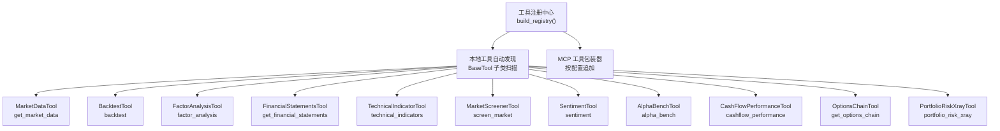
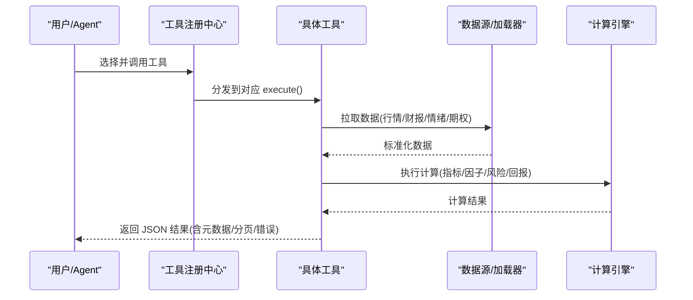
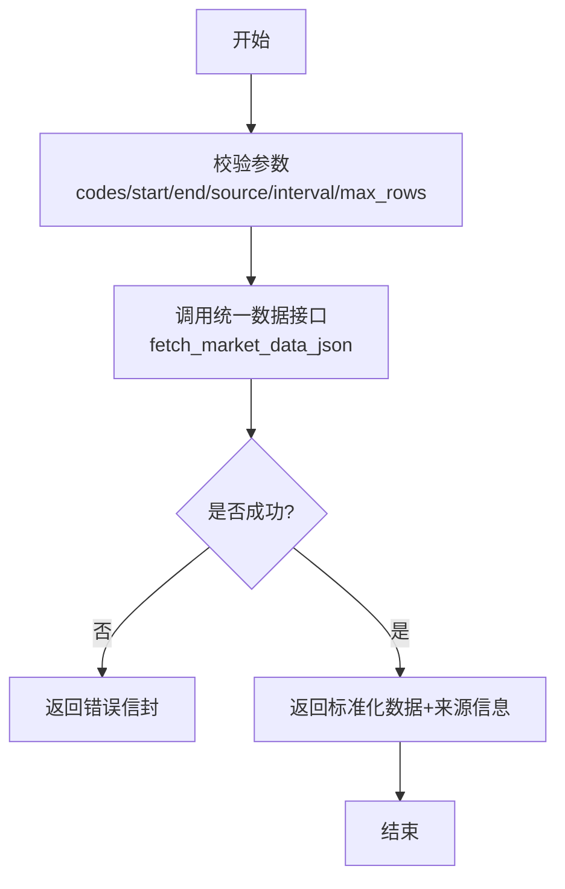
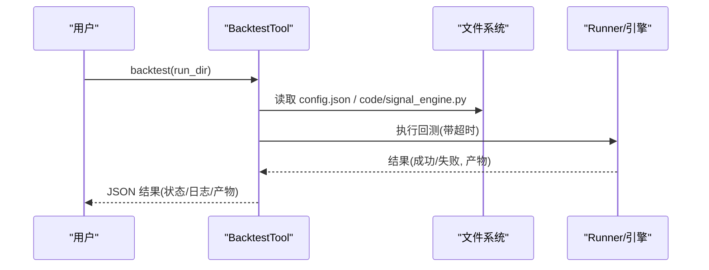
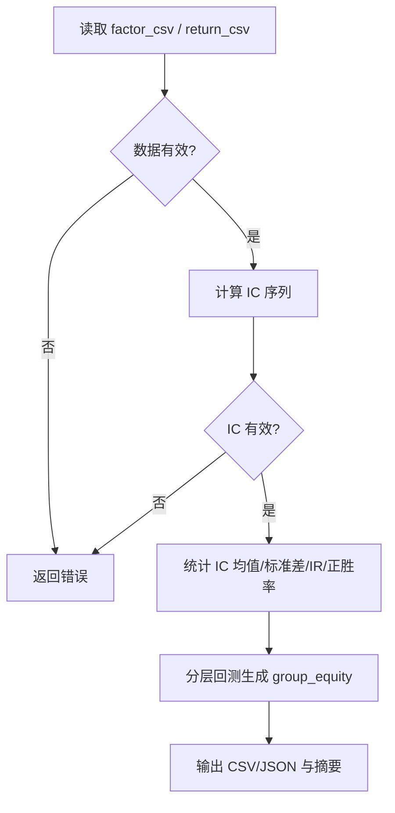
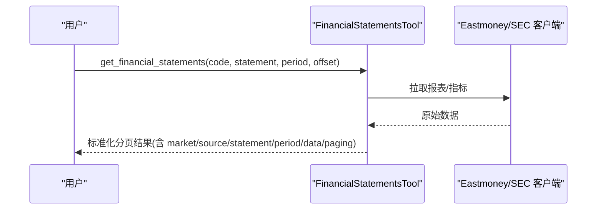
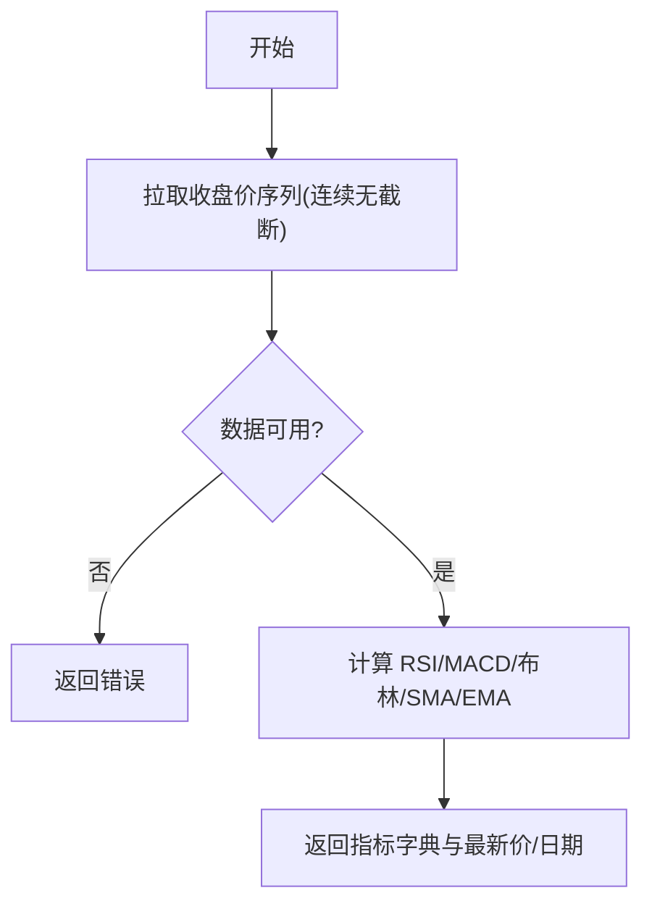
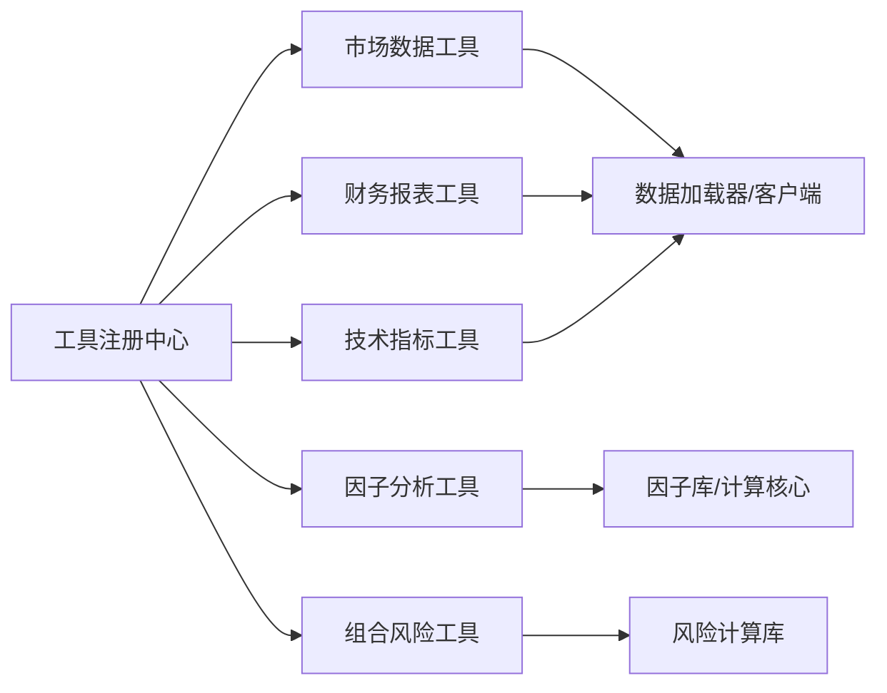

# 内置工具分类与使用

<cite>
**本文引用的文件**
- [agent/src/tools/__init__.py](file://agent/src/tools/__init__.py)
- [agent/src/tools/market_data_tool.py](file://agent/src/tools/market_data_tool.py)
- [agent/src/tools/backtest_tool.py](file://agent/src/tools/backtest_tool.py)
- [agent/src/tools/factor_analysis_tool.py](file://agent/src/tools/factor_analysis_tool.py)
- [agent/src/tools/financial_statements_tool.py](file://agent/src/tools/financial_statements_tool.py)
- [agent/src/tools/technical_indicator_tool.py](file://agent/src/tools/technical_indicator_tool.py)
- [agent/src/tools/market_screener_tool.py](file://agent/src/tools/market_screener_tool.py)
- [agent/src/tools/sentiment_tool.py](file://agent/src/tools/sentiment_tool.py)
- [agent/src/tools/alpha_bench_tool.py](file://agent/src/tools/alpha_bench_tool.py)
- [agent/src/tools/cashflow_analytics_tool.py](file://agent/src/tools/cashflow_analytics_tool.py)
- [agent/src/tools/options_chain_tool.py](file://agent/src/tools/options_chain_tool.py)
- [agent/src/tools/portfolio_risk_tool.py](file://agent/src/tools/portfolio_risk_tool.py)
</cite>

## 目录
1. [简介](#简介)
2. [项目结构](#项目结构)
3. [核心组件](#核心组件)
4. [架构总览](#架构总览)
5. [详细组件分析](#详细组件分析)
6. [依赖关系分析](#依赖关系分析)
7. [性能考虑](#性能考虑)
8. [故障排查指南](#故障排查指南)
9. [结论](#结论)
10. [附录：组合使用与最佳实践](#附录组合使用与最佳实践)

## 简介
本文件面向 Vibe-Trading 的“内置工具系统”，系统化梳理并说明市场数据、回测、因子分析、财务报表、技术指标、情绪指标、期权、投资组合风险等工具的分类、参数、调用方式与结果处理。文档同时提供工具间组合模式、性能调优建议与错误处理策略，帮助读者以最小成本完成复杂金融分析任务。

## 项目结构
Vibe-Trading 的工具通过统一注册机制自动发现并挂载，支持本地工具与远程 MCP 工具合并注册；每个工具继承基类并声明名称、描述、参数与执行逻辑。关键入口位于工具包初始化模块，负责扫描、过滤、注入上下文（如会话 ID、持久化内存）以及可选的 MCP 工具集成。

图表来源
- [agent/src/tools/__init__.py:66-245](file://agent/src/tools/__init__.py#L66-L245)

章节来源
- [agent/src/tools/__init__.py:1-365](file://agent/src/tools/__init__.py#L1-L365)

## 核心组件
- 工具注册与生命周期
  - 自动发现 BaseTool 子类，缓存子类列表，避免重复导入开销。
  - 支持选择性禁用 shell 工具、注入会话 ID、事件回调、持久化内存。
  - 可附加 MCP 服务器工具，按白名单过滤，失败隔离不影响其他工具。
- 通用约束与安全
  - 所有工具返回 JSON 字符串信封，便于上层统一解析与展示。
  - 对网络请求、外部依赖缺失进行降级或跳过，保证可用性。

章节来源
- [agent/src/tools/__init__.py:33-63](file://agent/src/tools/__init__.py#L33-L63)
- [agent/src/tools/__init__.py:66-245](file://agent/src/tools/__init__.py#L66-L245)

## 架构总览
工具层围绕“数据获取—计算—报告”的流水线组织：
- 数据获取：市场数据、财报、情绪指数、期权链等。
- 计算：技术指标、因子 IC/IR、分层净值、组合风险、现金流回报等。
- 报告：结构化 JSON、HTML 报告、CSV 输出等。

图表来源
- [agent/src/tools/market_data_tool.py:94-103](file://agent/src/tools/market_data_tool.py#L94-L103)
- [agent/src/tools/technical_indicator_tool.py:200-283](file://agent/src/tools/technical_indicator_tool.py#L200-L283)
- [agent/src/tools/factor_analysis_tool.py:19-105](file://agent/src/tools/factor_analysis_tool.py#L19-L105)
- [agent/src/tools/portfolio_risk_tool.py:84-131](file://agent/src/tools/portfolio_risk_tool.py#L84-L131)

## 详细组件分析

### 市场数据工具
- 功能：统一拉取多市场 OHLCV 数据，自动识别符号并选择合适数据源，支持区间、周期与行数限制。
- 关键参数：codes、start_date、end_date、source、interval、max_rows。
- 使用场景：策略研究前的数据准备、技术指标输入、因子面板构建。
- 结果处理：返回包含数据与来源信息的 JSON，便于后续工具消费。

图表来源
- [agent/src/tools/market_data_tool.py:20-91](file://agent/src/tools/market_data_tool.py#L20-L91)
- [agent/src/tools/market_data_tool.py:94-103](file://agent/src/tools/market_data_tool.py#L94-L103)

章节来源
- [agent/src/tools/market_data_tool.py:1-104](file://agent/src/tools/market_data_tool.py#L1-L104)

### 回测工具
- 功能：校验运行目录中的配置文件与信号脚本，调用内置回测引擎执行，收集产物。
- 关键参数：run_dir。
- 使用场景：策略验证、历史表现评估、策略迭代。
- 结果处理：返回状态、退出码、标准输出/错误片段、产物路径映射。

图表来源
- [agent/src/tools/backtest_tool.py:15-74](file://agent/src/tools/backtest_tool.py#L15-L74)
- [agent/src/tools/backtest_tool.py:77-95](file://agent/src/tools/backtest_tool.py#L77-L95)

章节来源
- [agent/src/tools/backtest_tool.py:1-95](file://agent/src/tools/backtest_tool.py#L1-L95)

### 因子分析工具
- 功能：基于因子值与收益率 CSV，计算 IC 序列、IC 均值/标准差/IR、正胜率，并进行分层回测生成分组净值曲线。
- 关键参数：factor_csv、return_csv、n_groups、output_dir。
- 使用场景：因子有效性检验、因子筛选、多因子组合初步评估。
- 结果处理：输出 ic_series.csv、ic_summary.json、group_equity.csv 与分析摘要。

图表来源
- [agent/src/tools/factor_analysis_tool.py:19-105](file://agent/src/tools/factor_analysis_tool.py#L19-L105)
- [agent/src/tools/factor_analysis_tool.py:108-152](file://agent/src/tools/factor_analysis_tool.py#L108-L152)

章节来源
- [agent/src/tools/factor_analysis_tool.py:1-152](file://agent/src/tools/factor_analysis_tool.py#L1-L152)

### 财务报表工具
- 功能：读取单只股票的三大报表或关键指标，覆盖 A 股、美股、港股；美股走 SEC EDGAR，A 股/港股走 Eastmoney。
- 关键参数：code、statement、period、offset。
- 使用场景：基本面研究、估值建模、财务质量筛查。
- 结果处理：分页返回扁平化期间记录，字段裁剪控制上下文大小。

图表来源
- [agent/src/tools/financial_statements_tool.py:589-726](file://agent/src/tools/financial_statements_tool.py#L589-L726)

章节来源
- [agent/src/tools/financial_statements_tool.py:1-726](file://agent/src/tools/financial_statements_tool.py#L1-L726)

### 技术指标工具
- 功能：基于价格序列计算 RSI、MACD、布林带、SMA、EMA 等常用指标。
- 关键参数：symbol、interval、lookback。
- 使用场景：技术面研判、信号触发、策略特征工程。
- 结果处理：返回最新价、日期与各指标值。

图表来源
- [agent/src/tools/technical_indicator_tool.py:157-283](file://agent/src/tools/technical_indicator_tool.py#L157-L283)

章节来源
- [agent/src/tools/technical_indicator_tool.py:1-283](file://agent/src/tools/technical_indicator_tool.py#L1-L283)

### 全市场选股器
- 功能：按涨跌幅、成交量、成交额、换手率排序，返回 A 股、美股、港股市场头部标的。
- 关键参数：market、sort_by、top_n。
- 使用场景：异动监控、流动性筛选、热点追踪。
- 结果处理：标准化行记录，限制最大返回数量。

章节来源
- [agent/src/tools/market_screener_tool.py:1-257](file://agent/src/tools/market_screener_tool.py#L1-L257)

### 情绪指标工具
- 功能：文本情感打分（词典法）与加密恐惧贪婪指数抓取。
- 关键参数：mode（sentiment_score/fear_greed_index）、text。
- 使用场景：新闻/社媒情绪量化、市场情绪监测。
- 结果处理：返回分数或指数及分类。

章节来源
- [agent/src/tools/sentiment_tool.py:1-147](file://agent/src/tools/sentiment_tool.py#L1-L147)

### Alpha 基准评测工具
- 功能：加载指定宇宙（CSI300/SP500/BTC-USDT），计算各 alpha 因子的 IC/IR，生成 HTML 报告。
- 关键参数：universe、period、alpha_id/zoo 等。
- 使用场景：因子库评测、策略思想对比、可视化报告。
- 结果处理：JSON 摘要 + HTML 报告（含安全 CSP）。

章节来源
- [agent/src/tools/alpha_bench_tool.py:1-800](file://agent/src/tools/alpha_bench_tool.py#L1-L800)

### 现金流绩效工具
- 功能：计算时间加权收益（TWR）、修正 Dietz 收益、货币加权收益（XIRR），支持内联或文件现金流。
- 关键参数：valuations、flows/flows_path、currency、flow_timing、external/internal kinds。
- 使用场景：客户账户绩效归因、资金进出影响评估。
- 结果处理：结构化 JSON，含子区间、权重、限制说明。

章节来源
- [agent/src/tools/cashflow_analytics_tool.py:1-489](file://agent/src/tools/cashflow_analytics_tool.py#L1-L489)

### 期权链工具
- 功能：拉取美股标的单一到期日的看涨/看跌期权链，包含行权价、买卖价、成交量、持仓量、隐含波动率等。
- 关键参数：ticker、expiration。
- 使用场景：期权策略研究、波动率曲面观察。
- 结果处理：标准化合约字段，限制每侧合约数。

章节来源
- [agent/src/tools/options_chain_tool.py:1-156](file://agent/src/tools/options_chain_tool.py#L1-L156)

### 投资组合风险 X 光
- 功能：给定标的与权重，拉取近期收盘价，计算集中度（HHI/有效 N）、年化波动、最大回撤、历史 VaR/ES、分散化比率、相关性与 Beta。
- 关键参数：symbols、weights、start_date、end_date、source、interval。
- 使用场景：组合风险诊断、压力测试辅助。
- 结果处理：JSON 报告与元数据（起止日、间隔、未解析标的）。

章节来源
- [agent/src/tools/portfolio_risk_tool.py:1-195](file://agent/src/tools/portfolio_risk_tool.py#L1-L195)

## 依赖关系分析
- 工具注册依赖 BaseTool 与 ToolRegistry，支持自动发现与按需注入。
- 数据层依赖统一的加载器与客户端（如 Eastmoney、Yahoo、SEC EDGAR、OKX、Tushare 等）。
- 计算层依赖 pandas/numpy 与内部量化库（risk_xray、quantlib performance 等）。
- 输出层统一为 JSON，部分工具额外输出 CSV/HTML。

图表来源
- [agent/src/tools/__init__.py:66-245](file://agent/src/tools/__init__.py#L66-L245)
- [agent/src/tools/market_data_tool.py:94-103](file://agent/src/tools/market_data_tool.py#L94-L103)
- [agent/src/tools/financial_statements_tool.py:589-726](file://agent/src/tools/financial_statements_tool.py#L589-L726)
- [agent/src/tools/technical_indicator_tool.py:200-283](file://agent/src/tools/technical_indicator_tool.py#L200-L283)
- [agent/src/tools/factor_analysis_tool.py:19-105](file://agent/src/tools/factor_analysis_tool.py#L19-L105)
- [agent/src/tools/portfolio_risk_tool.py:84-131](file://agent/src/tools/portfolio_risk_tool.py#L84-L131)

章节来源
- [agent/src/tools/__init__.py:1-365](file://agent/src/tools/__init__.py#L1-L365)

## 性能考虑
- 数据拉取
  - 合理设置 max_rows/lookback，避免过大窗口导致响应缓慢。
  - 优先使用 source=auto 让系统选择最优数据源；必要时显式指定以降低延迟。
- 计算优化
  - 技术指标需连续无截断数据，确保不启用会打乱时序的限制。
  - 因子分析与 Alpha 基准评测利用并行与缓存（HMAC 校验的 pickle 缓存）提升吞吐。
- 输出控制
  - 财报工具对字段与期间进行裁剪，防止上下文溢出。
  - 期权链限制每侧合约数量，保持响应体积可控。
- 并发与限流
  - 全市场选股器与 Alpha 基准评测通过服务端排序与并发控制降低负载。
  - 注意第三方 API 速率限制（如 Eastmoney、Yahoo、Tushare）。

[本节为通用指导，无需特定文件引用]

## 故障排查指南
- 常见错误类型
  - 参数校验失败：如 symbol/code 为空、日期格式错误、数值越界。
  - 数据不可用：无收盘价列、数据被截断、未解析标的。
  - 网络异常：HTTP 错误、超时、鉴权失败。
  - 计算失败：IC 序列为空、分层净值不足、现金流 IRR 无解。
- 定位步骤
  - 检查工具返回的 JSON 信封中的 ok/status/error 字段。
  - 核对参数是否符合 schema（枚举、必填项、范围）。
  - 确认数据源可达与凭据正确（如 TUSHARE_TOKEN、API_AUTH_KEY）。
  - 对于缓存问题，尝试关闭缓存或清理本地缓存目录。
- 恢复策略
  - 调整窗口/区间、减少 top_n、切换数据源。
  - 重试或等待限流缓解后再次调用。
  - 将大文件通过 flows_path 传入，避免内联超限。

章节来源
- [agent/src/tools/financial_statements_tool.py:114-124](file://agent/src/tools/financial_statements_tool.py#L114-L124)
- [agent/src/tools/technical_indicator_tool.py:200-283](file://agent/src/tools/technical_indicator_tool.py#L200-L283)
- [agent/src/tools/alpha_bench_tool.py:162-273](file://agent/src/tools/alpha_bench_tool.py#L162-L273)
- [agent/src/tools/cashflow_analytics_tool.py:476-489](file://agent/src/tools/cashflow_analytics_tool.py#L476-L489)

## 结论
Vibe-Trading 的内置工具体系以统一注册为核心，围绕数据、计算、报告形成清晰流水线。通过标准化的参数与结果契约，工具之间可灵活组合，支撑从基础数据获取到高级因子与组合分析的完整工作流。遵循本文的参数规范、性能建议与故障排查方法，可高效完成复杂金融分析任务。

[本节为总结性内容，无需特定文件引用]

## 附录：组合使用与最佳实践
- 典型工作流示例
  - 市场数据 → 技术指标 → 因子分析 → 回测
    - 使用 get_market_data 拉取多标的 OHLCV。
    - 用 technical_indicators 计算 RSI/MACD/布林等作为特征。
    - 将因子值与收益率写入 CSV，调用 factor_analysis 评估 IC/IR 与分层净值。
    - 将策略信号封装为 signal_engine.py，通过 backtest 执行回测并收集产物。
  - 财报研究 → 情绪监测 → 组合风险
    - 用 get_financial_statements 获取公司基本面指标。
    - 用 sentiment 对新闻标题打分，结合市场情绪判断。
    - 用 portfolio_risk_xray 评估组合波动、回撤与尾部风险。
  - 期权策略研究
    - 用 get_options_chain 拉取期权链，结合 implied_volatility 观察波动率结构。
    - 配合 market_data 与 sentiment 做情景分析。
- 参数与性能建议
  - 控制 lookback/top_n/max_rows，平衡精度与速度。
  - 使用 source=auto 让系统选择最优数据源；必要时显式指定。
  - 对大文件使用 flows_path，避免内联超限。
- 错误处理最佳实践
  - 始终检查返回信封的 ok/status/error 字段。
  - 对网络异常采用重试与退避；对限流场景降低并发与频率。
  - 对缓存问题，先验证 HMAC 密钥与缓存完整性。

[本节为概念性指导，无需特定文件引用]