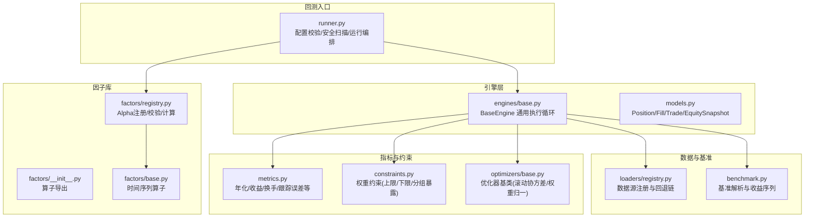
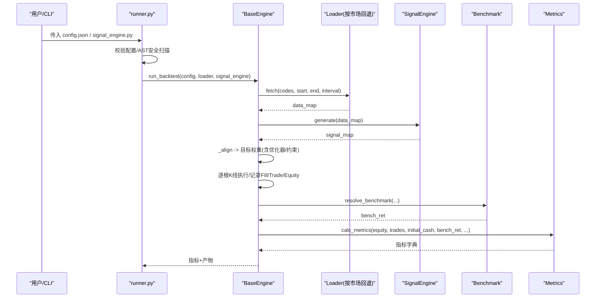
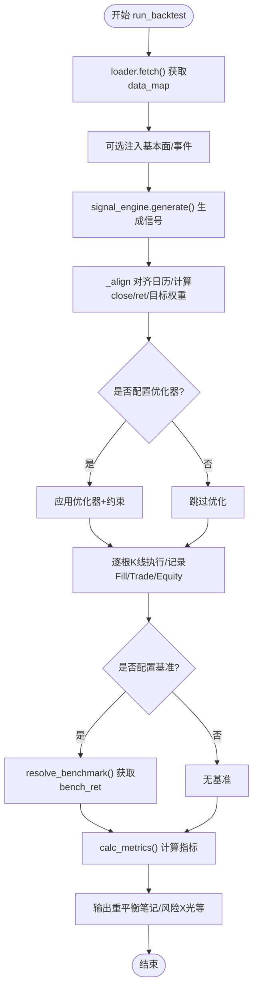
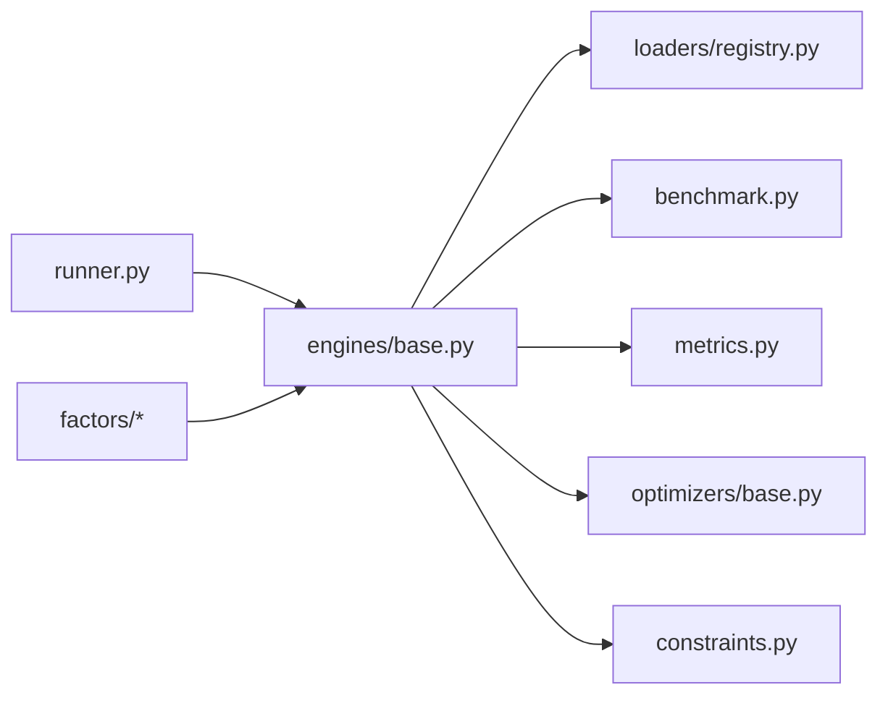

# 回测工具

<cite>
**本文引用的文件**
- [runner.py](file://agent/backtest/runner.py)
- [base.py](file://agent/backtest/engines/base.py)
- [models.py](file://agent/backtest/models.py)
- [benchmark.py](file://agent/backtest/benchmark.py)
- [metrics.py](file://agent/backtest/metrics.py)
- [registry.py](file://agent/backtest/loaders/registry.py)
- [constraints.py](file://agent/backtest/constraints.py)
- [base.py](file://agent/backtest/optimizers/base.py)
- [__init__.py](file://agent/src/factors/__init__.py)
- [base.py](file://agent/src/factors/base.py)
- [registry.py](file://agent/src/factors/registry.py)
</cite>

## 目录
1. [简介](#简介)
2. [项目结构](#项目结构)
3. [核心组件](#核心组件)
4. [架构总览](#架构总览)
5. [详细组件分析](#详细组件分析)
6. [依赖关系分析](#依赖关系分析)
7. [性能与优化](#性能与优化)
8. [故障排查指南](#故障排查指南)
9. [结论](#结论)
10. [附录：使用示例与最佳实践](#附录使用示例与最佳实践)

## 简介
本文件为 Vibe-Trading 回测工具的权威技术文档，覆盖策略回测、基准对比、Alpha因子测试与因子库管理等核心能力。文档面向不同技术背景的读者，既提供高层架构说明，也深入到回测引擎配置、参数调优、多市场适配、数据处理流程、结果可视化与报告生成等实操层面，帮助快速构建回测策略、执行历史回测并分析结果。

## 项目结构
Vibe-Trading 的回测子系统位于 agent/backtest 与 agent/src/factors 两大区域：
- backtest：负责数据加载、信号对齐、权重优化、逐根K线执行、指标计算、基准对比与产物输出。
- factors：提供 Alpha 因子库（Zoo）的注册、校验、计算与基准评测工具链。

图表来源
- [runner.py:1-120](file://agent/backtest/runner.py#L1-L120)
- [base.py:377-768](file://agent/backtest/engines/base.py#L377-L768)
- [registry.py:1-249](file://agent/backtest/loaders/registry.py#L1-L249)
- [benchmark.py:1-208](file://agent/backtest/benchmark.py#L1-L208)
- [metrics.py:150-638](file://agent/backtest/metrics.py#L150-L638)
- [constraints.py:1-206](file://agent/backtest/constraints.py#L1-L206)
- [base.py:14-145](file://agent/backtest/optimizers/base.py#L14-L145)
- [__init__.py:1-49](file://agent/src/factors/__init__.py#L1-L49)
- [base.py:1-356](file://agent/src/factors/base.py#L1-L356)
- [registry.py:1-454](file://agent/src/factors/registry.py#L1-L454)

章节来源
- [runner.py:1-120](file://agent/backtest/runner.py#L1-L120)
- [base.py:377-768](file://agent/backtest/engines/base.py#L377-L768)

## 核心组件
- 回测入口 runner：读取配置、选择数据源、动态导入策略模块、执行安全扫描、调用引擎 run_backtest。
- 引擎 base：统一的数据加载→信号生成→目标权重预计算→逐根K线执行→指标计算→产物输出的流水线。
- 数据源 registry：按市场类型维护数据源回退链，自动选择可用数据源。
- 基准 benchmark：根据策略代码推断市场并获取基准收益序列，用于超额收益与信息比率等指标。
- 指标 metrics：年化、夏普、索提诺、最大回撤、换手率、跟踪误差、信息比率等。
- 优化器 optimizers：基于滚动协方差的权重优化基类，子类实现具体策略（如均值方差、风险平价等）。
- 约束 constraints：对优化器输出施加单标的上下限与分组暴露限制，保持符号不变。
- 因子库 factors：Alpha Zoo 注册、元数据校验、懒加载计算；提供时间序列算子与面板操作。

章节来源
- [runner.py:68-163](file://agent/backtest/runner.py#L68-L163)
- [base.py:647-768](file://agent/backtest/engines/base.py#L647-L768)
- [registry.py:136-249](file://agent/backtest/loaders/registry.py#L136-L249)
- [benchmark.py:22-103](file://agent/backtest/benchmark.py#L22-L103)
- [metrics.py:458-638](file://agent/backtest/metrics.py#L458-L638)
- [base.py:14-145](file://agent/backtest/optimizers/base.py#L14-L145)
- [constraints.py:1-206](file://agent/backtest/constraints.py#L1-L206)
- [registry.py:201-454](file://agent/src/factors/registry.py#L201-L454)

## 架构总览
回测主流程由 BaseEngine.run_backtest 串联：
1) 通过 loader.fetch 拉取多标的 OHLCV 数据；
2) 可选注入基本面字段与事件流；
3) 调用 SignalEngine.generate 产出信号；
4) _align 将信号对齐到统一日历，计算目标权重矩阵（可经优化器与约束处理）；
5) 逐根K线执行交易，记录成交、持仓、权益快照；
6) 计算指标并与基准对比；
7) 输出重平衡笔记、风险X光等产物。

图表来源
- [base.py:647-768](file://agent/backtest/engines/base.py#L647-L768)
- [benchmark.py:40-103](file://agent/backtest/benchmark.py#L40-L103)
- [metrics.py:458-638](file://agent/backtest/metrics.py#L458-L638)

## 详细组件分析

### 回测入口 runner
- 配置校验：BacktestConfigSchema 强制 codes、start_date、end_date、source、interval、engine、initial_cash 等字段的合法性与范围。
- 安全扫描：在导入策略前进行 AST 静态检查，禁止危险 import/属性访问/文件写入/进程调用等；运行时路径进一步扫描 SignalEngine 方法及其可达函数，阻断网络与系统调用。
- 市场路由：支持 source="auto"，依据 symbol 模式与数据源特性选择合适 loader。
- 执行编排：加载数据、注入基本面/事件、生成信号、对齐与优化、执行与指标计算。

章节来源
- [runner.py:68-163](file://agent/backtest/runner.py#L68-L163)
- [runner.py:165-768](file://agent/backtest/runner.py#L165-L768)

### 引擎 base：通用执行循环
- 数据对齐 _align：合并多标的交易日历，构造 close/position/return 矩阵，按标的自身日历移位信号，应用优化器与约束后归一化权重。
- 优化器加载：从配置中动态加载 backtest.optimizers.* 中的 optimize 函数，并叠加 constraints 层。
- 基准接入：若配置指定 benchmark，则通过 benchmark.resolve_benchmark 获取基准收益序列，参与超额收益、信息比率、跟踪误差与Beta计算。
- 指标计算：汇总最终净值、年化收益、最大回撤、夏普、索提诺、胜率、盈亏比、换手率、跟踪误差、信息比率、基准Beta等。
- 产物输出：重平衡笔记（JSON/Markdown）、风险X光（资产组合风险分解）等。

图表来源
- [base.py:252-371](file://agent/backtest/engines/base.py#L252-L371)
- [base.py:647-768](file://agent/backtest/engines/base.py#L647-L768)
- [benchmark.py:40-103](file://agent/backtest/benchmark.py#L40-L103)
- [metrics.py:458-638](file://agent/backtest/metrics.py#L458-L638)

章节来源
- [base.py:149-249](file://agent/backtest/engines/base.py#L149-L249)
- [base.py:252-371](file://agent/backtest/engines/base.py#L252-L371)
- [base.py:647-768](file://agent/backtest/engines/base.py#L647-L768)

### 数据源与多市场适配
- 数据源注册与回退：LOADER_REGISTRY 集中管理所有数据源；FALLBACK_CHAINS 按市场定义回退顺序（如 A 股优先腾讯/同花顺/东方财富等），当首选不可用时自动降级。
- 市场检测：根据 symbol 模式与 source 推断市场类型，从而选择合适的数据源链。
- 本地与离线：local/qveris 等本地源不静默回退到网络源，避免掩盖配置问题。

章节来源
- [registry.py:23-155](file://agent/backtest/loaders/registry.py#L23-L155)
- [registry.py:158-249](file://agent/backtest/loaders/registry.py#L158-L249)

### 基准对比
- 基准映射：不同市场默认基准（如美股 SPY、A 股 000300.SH、加密货币 BTC-USDT 等）。
- 基准获取：优先使用配置的 loader，失败时回退 yfinance（非本地场景），返回 per-bar 收益序列与总回报。
- 指标联动：基准收益参与超额收益、信息比率、跟踪误差与 Beta 的计算。

章节来源
- [benchmark.py:22-103](file://agent/backtest/benchmark.py#L22-L103)
- [benchmark.py:109-208](file://agent/backtest/benchmark.py#L109-L208)
- [base.py:728-751](file://agent/backtest/engines/base.py#L728-L751)

### 指标体系与换手率
- 年化与收益：基于 bars_per_year 或日历日估算；处理负收益/零净值等边界情况。
- 风险指标：最大回撤、夏普、索提诺、Calmar。
- 交易统计：胜率、盈亏比、连续亏损次数、平均持仓周期。
- 换手率：支持三种口径——目标权重变化、实际成交 margin、填充证据；均归一化为相对权益的换手。
- 基准相关：超额收益、信息比率、跟踪误差、基准 Beta。

章节来源
- [metrics.py:150-168](file://agent/backtest/metrics.py#L150-L168)
- [metrics.py:175-261](file://agent/backtest/metrics.py#L175-L261)
- [metrics.py:263-456](file://agent/backtest/metrics.py#L263-L456)
- [metrics.py:458-638](file://agent/backtest/metrics.py#L458-L638)

### 优化器与约束
- 优化器基类：以滚动窗口协方差为基础，保证因果性（仅使用决策时刻之前的历史），输出权重向量并保留信号方向。
- 常见优化器：等波动、均值方差、风险平价、分散最大化、换手率感知等（通过 backtest.optimizers.* 动态加载）。
- 约束层：对优化器输出施加单标的权重上下限与分组暴露上限，保持符号不变，逐步迭代调整。

章节来源
- [base.py:14-145](file://agent/backtest/optimizers/base.py#L14-L145)
- [constraints.py:1-206](file://agent/backtest/constraints.py#L1-L206)
- [base.py:252-279](file://agent/backtest/engines/base.py#L252-L279)

### 因子库与 Alpha 测试
- 因子算子：提供 rank、zscore、ts_mean/ts_std、ts_corr/ts_cov、decay_linear、vwap 等时间序列与横截面算子，严格 NaN 传播与防未来函数。
- Alpha 注册：AST 扫描 zoo 目录，提取 __alpha_meta__ 元数据，校验列依赖、主题、频率、最小预热期等；懒加载 compute 模块并验证输出形状与数值健康度。
- 基准评测：结合回测引擎与指标体系，可对 Alpha 因子进行回测与对比（见下方“使用示例”）。

章节来源
- [__init__.py:1-49](file://agent/src/factors/__init__.py#L1-L49)
- [base.py:1-356](file://agent/src/factors/base.py#L1-L356)
- [registry.py:1-454](file://agent/src/factors/registry.py#L1-L454)

## 依赖关系分析
- runner 依赖 engines/base 作为执行中枢，并通过 loaders/registry 选择数据源。
- engines/base 依赖 metrics、benchmark、optimizers、constraints 完成指标、基准、权重优化与约束。
- factors 独立于回测引擎，但可通过信号生成或因子评测工具与回测链路集成。

图表来源
- [runner.py:1-120](file://agent/backtest/runner.py#L1-L120)
- [base.py:647-768](file://agent/backtest/engines/base.py#L647-L768)
- [registry.py:136-249](file://agent/backtest/loaders/registry.py#L136-L249)
- [benchmark.py:40-103](file://agent/backtest/benchmark.py#L40-L103)
- [metrics.py:458-638](file://agent/backtest/metrics.py#L458-L638)
- [base.py:14-145](file://agent/backtest/optimizers/base.py#L14-L145)
- [constraints.py:1-206](file://agent/backtest/constraints.py#L1-L206)

## 性能与优化
- 数据对齐与 ffill：使用 numpy/pandas 向量化前向填充，跨市场场景放宽 ffill_limit，减少长停牌导致的信号失真。
- 年化因子：按数据源与周期精确映射 bars_per_day，避免错误年化导致的风险指标偏差。
- 优化器滚动窗口：仅使用历史数据，避免未来函数；小样本保护防止除零与无穷值。
- 换手率口径：优先采用实际成交 margin 计算的换手率，更贴近真实成本。
- 基准获取：本地源禁用网络回退，避免意外网络请求；其他场景优先使用已配置 loader，失败再回退 yfinance。

[本节为通用指导，无需特定文件引用]

## 故障排查指南
- 配置校验失败：检查 codes、日期格式、interval、engine、source 是否在允许集合内；initial_cash 必须为正数。
- 数据源不可用：确认所选 market 的回退链中至少有一个可用；本地源需确保 Data Bridge 配置存在且有效。
- 信号为空：确保 SignalEngine.generate 返回 Dict[str, pd.Series]，且键与 data_map 一致。
- 基准缺失：若未找到基准或数据不足，将跳过基准对比；可在配置中显式指定 benchmark ticker。
- 指标异常：若净值触零或出现无穷值，部分指标会置零或跳过；检查价格序列是否存在非正或无穷值。
- 安全扫描报错：策略代码不得包含被禁用的 import/属性/文件写入/进程调用；遵循安全约束重新编写策略。

章节来源
- [runner.py:68-163](file://agent/backtest/runner.py#L68-L163)
- [registry.py:158-249](file://agent/backtest/loaders/registry.py#L158-L249)
- [base.py:687-706](file://agent/backtest/engines/base.py#L687-L706)
- [benchmark.py:71-103](file://agent/backtest/benchmark.py#L71-L103)
- [metrics.py:484-531](file://agent/backtest/metrics.py#L484-L531)
- [runner.py:736-768](file://agent/backtest/runner.py#L736-L768)

## 结论
Vibe-Trading 回测工具提供了从数据接入、信号生成、权重优化、逐根执行到指标与基准对比的一体化流水线，具备多市场适配、严格的安全沙箱、完善的因子库与评测能力。通过合理配置与优化，可高效开展策略研究与因子挖掘，并输出可解释的报告与可视化产物。

[本节为总结性内容，无需特定文件引用]

## 附录：使用示例与最佳实践

### 构建回测策略（SignalEngine）
- 在 strategy 文件中定义 SignalEngine 类，实现 generate(self, data_map: Dict[str, pd.DataFrame]) -> Dict[str, pd.Series]。
- 输入 data_map 为各标的的 OHLCV DataFrame；输出为每个标的的信号序列（DatetimeIndex）。
- 注意避免未来函数与非法操作，遵守安全扫描规则。

参考路径
- [runner.py:770-787](file://agent/backtest/runner.py#L770-L787)

### 执行历史回测
- 准备 config.json，包含 codes、start_date、end_date、source、interval、engine、initial_cash 等。
- 运行 runner，传入 run_dir 与 signal_engine.py 路径。
- 如需基准对比，设置 benchmark 为 "auto" 或具体 ticker。

参考路径
- [runner.py:68-163](file://agent/backtest/runner.py#L68-L163)
- [base.py:647-768](file://agent/backtest/engines/base.py#L647-L768)

### 分析与可视化
- 指标输出：total_return、annual_return、max_drawdown、sharpe、sortino、win_rate、profit_factor、avg_turnover、tracking_error、information_ratio、benchmark_beta 等。
- 产物：rebalance_notes.json/.md、risk_xray 等，便于可视化与复盘。
- 基准对比：通过 benchmark_ret 与策略收益序列对齐，计算超额收益与信息比率。

参考路径
- [metrics.py:458-638](file://agent/backtest/metrics.py#L458-L638)
- [base.py:770-800](file://agent/backtest/engines/base.py#L770-L800)
- [benchmark.py:40-103](file://agent/backtest/benchmark.py#L40-L103)

### 多市场回测与数据处理
- 使用 source="auto" 让 runner 根据 symbol 模式与数据源可用性自动选择 loader。
- 了解 FALLBACK_CHAINS 的市场级回退顺序，必要时显式指定 source。
- 关注 ffill_limit 与跨市场对齐逻辑，避免长停牌或休市导致的信号失真。

参考路径
- [registry.py:136-155](file://agent/backtest/loaders/registry.py#L136-L155)
- [base.py:149-249](file://agent/backtest/engines/base.py#L149-L249)

### 因子库管理与 Alpha 测试
- 在 factors/zoo 下新增 alpha 模块，声明 __alpha_meta__ 元数据（id、theme、columns_required、universe、frequency 等）。
- 使用 Registry.list/get/compute 发现与计算因子；结合回测引擎评估因子表现。
- 利用 time-series 算子（rank、ts_mean、ts_std、ts_corr、decay_linear、vwap 等）构建稳健因子。

参考路径
- [registry.py:201-454](file://agent/src/factors/registry.py#L201-L454)
- [base.py:1-356](file://agent/src/factors/base.py#L1-L356)
- [__init__.py:1-49](file://agent/src/factors/__init__.py#L1-L49)

### 参数调优与约束配置
- 优化器：通过 optimizer 与 optimizer_params 配置滚动窗口、协方差估计等；结合 constraints 控制单标的权重上下限与分组暴露。
- 初始资金与杠杆：initial_cash 影响收益分母；leverage 影响保证金与仓位规模。
- 区间与频率：interval 影响年化因子与 bars_per_year；确保与数据源粒度匹配。

参考路径
- [base.py:252-279](file://agent/backtest/engines/base.py#L252-L279)
- [constraints.py:1-206](file://agent/backtest/constraints.py#L1-L206)
- [metrics.py:150-168](file://agent/backtest/metrics.py#L150-L168)