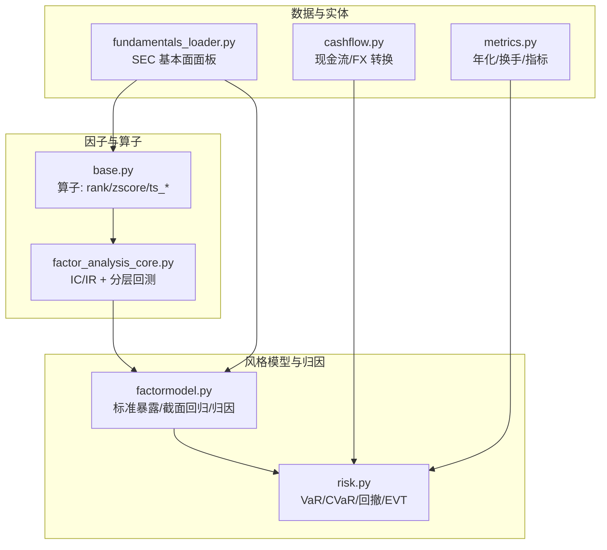
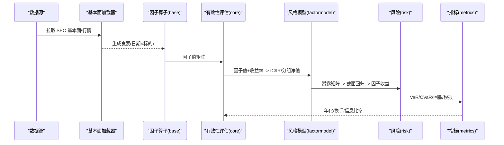
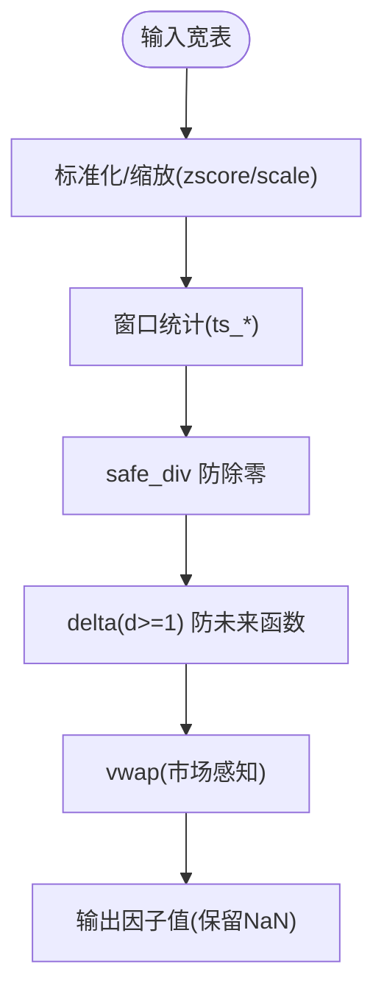
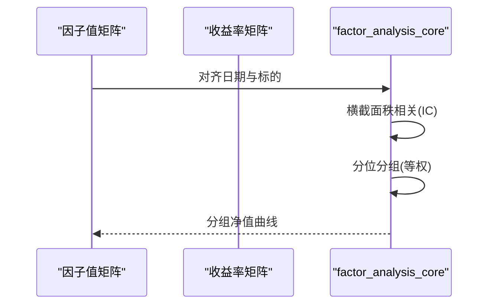
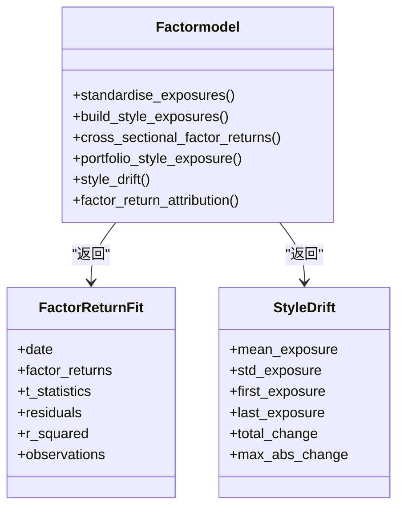
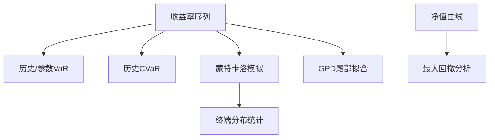
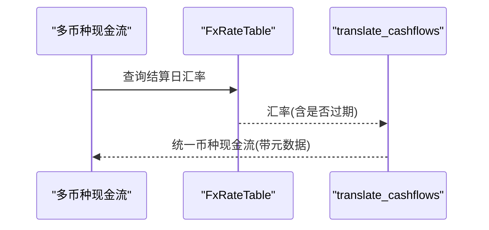
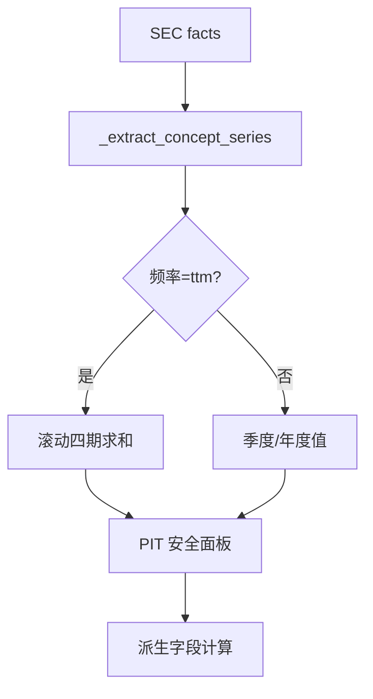
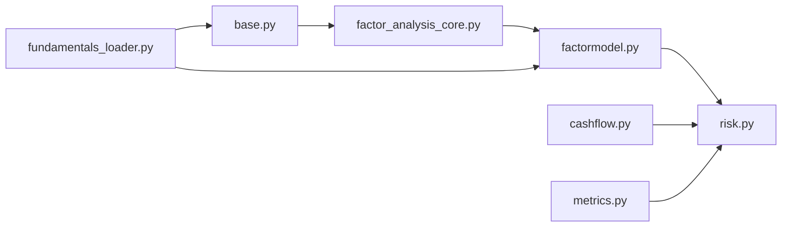

# 因子分析工具

<cite>
**本文引用的文件**
- [agent/src/factors/base.py](file://agent/src/factors/base.py)
- [agent/src/factors/__init__.py](file://agent/src/factors/__init__.py)
- [agent/src/factors/factor_analysis_core.py](file://agent/src/factors/factor_analysis_core.py)
- [agent/src/quantlib/factormodel.py](file://agent/src/quantlib/factormodel.py)
- [agent/src/quantlib/risk.py](file://agent/src/quantlib/risk.py)
- [agent/src/entities/cashflow.py](file://agent/src/entities/cashflow.py)
- [agent/backtest/loaders/fundamentals_loader.py](file://agent/backtest/loaders/fundamentals_loader.py)
- [agent/backtest/metrics.py](file://agent/backtest/metrics.py)
</cite>

## 目录
1. [简介](#简介)
2. [项目结构](#项目结构)
3. [核心组件](#核心组件)
4. [架构总览](#架构总览)
5. [详细组件分析](#详细组件分析)
6. [依赖关系分析](#依赖关系分析)
7. [性能考量](#性能考量)
8. [故障排查指南](#故障排查指南)
9. [结论](#结论)
10. [附录：使用示例与最佳实践](#附录使用示例与最佳实践)

## 简介
本文件面向 Vibe-Trading 的“因子分析工具”，系统性说明如何完成因子计算、基本面数据提取、现金流建模与投资组合风险评估，并给出因子模型构建方法、参数设置与验证流程。文档覆盖因子数据的预处理（标准化、去噪）、有效性检验（IC/IR、分层回测）与绩效归因（风格暴露、因子收益分解），并提供可操作的代码路径指引，帮助读者将因子分析工具组合用于量化研究与策略开发。

## 项目结构
围绕因子分析的核心模块分布在以下位置：
- 因子算子与基础框架：agent/src/factors
- 因子有效性评估与分层回测：agent/src/factors/factor_analysis_core.py
- 风格因子模型与归因：agent/src/quantlib/factormodel.py
- 风险度量与尾部建模：agent/src/quantlib/risk.py
- 现金流实体与汇率转换：agent/src/entities/cashflow.py
- 基本面面板加载（SEC XBRL，PIT 安全）：agent/backtest/loaders/fundamentals_loader.py
- 回测指标与年化：agent/backtest/metrics.py

图表来源
- [agent/src/factors/base.py:1-356](file://agent/src/factors/base.py#L1-L356)
- [agent/src/factors/factor_analysis_core.py:1-103](file://agent/src/factors/factor_analysis_core.py#L1-L103)
- [agent/src/quantlib/factormodel.py:1-516](file://agent/src/quantlib/factormodel.py#L1-L516)
- [agent/src/quantlib/risk.py:1-512](file://agent/src/quantlib/risk.py#L1-L512)
- [agent/backtest/loaders/fundamentals_loader.py:1-501](file://agent/backtest/loaders/fundamentals_loader.py#L1-L501)
- [agent/backtest/metrics.py:1-638](file://agent/backtest/metrics.py#L1-L638)

章节来源
- [agent/src/factors/base.py:1-356](file://agent/src/factors/base.py#L1-L356)
- [agent/src/factors/factor_analysis_core.py:1-103](file://agent/src/factors/factor_analysis_core.py#L1-L103)
- [agent/src/quantlib/factormodel.py:1-516](file://agent/src/quantlib/factormodel.py#L1-L516)
- [agent/src/quantlib/risk.py:1-512](file://agent/src/quantlib/risk.py#L1-L512)
- [agent/backtest/loaders/fundamentals_loader.py:1-501](file://agent/backtest/loaders/fundamentals_loader.py#L1-L501)
- [agent/backtest/metrics.py:1-638](file://agent/backtest/metrics.py#L1-L638)

## 核心组件
- 因子算子库：提供横截面与时间序列算子（rank、zscore、ts_mean/ts_std/ts_corr/ts_cov、delta、decay_linear、vwap 等），统一输入为宽表（行=交易日，列=标的），严格 NaN 传播与防未来函数约束。
- 因子有效性评估：按日计算 Spearman IC（因子值与收益率的秩相关），支持分组回测（按因子分位数分组、等权持有、累计净值）。
- 风格因子模型：从原始特征构建风格暴露（size/value/growth/momentum/quality/low_volatility/leverage/liquidity），采用缩尾、市值加权均值与等权标准差标准化；通过截面回归估计因子收益并进行归因。
- 风险度量：历史与参数化 VaR/CVaR、最大回撤分析、蒙特卡洛模拟与极值理论（GPD）尾部拟合。
- 现金流实体：严格的现金流方向与币种校验、汇率表与逐笔结算日汇率转换，支持估值标记与 IRR/TPI 等资金流分析。
- 基本面面板：基于 SEC XBRL 的 PIT 安全面板构造，支持年度/季度/TTM 频率与派生字段。
- 回测指标：年化、夏普、索提诺、Calmar、信息比率、跟踪误差、换手率等。

章节来源
- [agent/src/factors/base.py:1-356](file://agent/src/factors/base.py#L1-L356)
- [agent/src/factors/factor_analysis_core.py:1-103](file://agent/src/factors/factor_analysis_core.py#L1-L103)
- [agent/src/quantlib/factormodel.py:1-516](file://agent/src/quantlib/factormodel.py#L1-L516)
- [agent/src/quantlib/risk.py:1-512](file://agent/src/quantlib/risk.py#L1-L512)
- [agent/src/entities/cashflow.py:1-769](file://agent/src/entities/cashflow.py#L1-L769)
- [agent/backtest/loaders/fundamentals_loader.py:1-501](file://agent/backtest/loaders/fundamentals_loader.py#L1-L501)
- [agent/backtest/metrics.py:1-638](file://agent/backtest/metrics.py#L1-L638)

## 架构总览
下图展示因子从数据到评估与归因的整体流程：

图表来源
- [agent/backtest/loaders/fundamentals_loader.py:196-277](file://agent/backtest/loaders/fundamentals_loader.py#L196-L277)
- [agent/src/factors/base.py:62-356](file://agent/src/factors/base.py#L62-L356)
- [agent/src/factors/factor_analysis_core.py:8-103](file://agent/src/factors/factor_analysis_core.py#L8-L103)
- [agent/src/quantlib/factormodel.py:161-516](file://agent/src/quantlib/factormodel.py#L161-L516)
- [agent/src/quantlib/risk.py:142-512](file://agent/src/quantlib/risk.py#L142-L512)
- [agent/backtest/metrics.py:458-623](file://agent/backtest/metrics.py#L458-L623)

## 详细组件分析

### 因子算子与预处理（标准化、去噪、防未来函数）
- 横截面标准化与缩放：
  - zscore：按行（横截面）计算样本标准差 Z 分数，零方差或全 NaN 行返回 NaN，避免静默为零。
  - scale：按行 L1 归一化至指定尺度，零绝对和行返回 NaN。
- 时间序列窗口：
  - ts_mean/ts_std/ts_max/ts_min/ts_rank：滚动窗口统计，warmup 期返回 NaN。
  - ts_corr/ts_cov：滚动相关/协方差，常数序列返回 NaN。
  - ts_argmax/ts_argmin：滚动最值索引，支持 bottleneck 加速。
  - delta：严格 d≥1，禁止负滞后（防未来函数）。
  - decay_linear：线性衰减加权移动平均，NaN 传播。
  - vwap：市场感知 VWAP（A 股金额/手数换算、美股/加密典型价格）。
- 去噪与稳健性：
  - safe_div：分母为零或 NaN 时输出 NaN，避免 inf。
  - 所有算子保持 NaN 传播，不静默填充。

图表来源
- [agent/src/factors/base.py:62-356](file://agent/src/factors/base.py#L62-L356)

章节来源
- [agent/src/factors/base.py:1-356](file://agent/src/factors/base.py#L1-L356)

### 因子有效性检验（IC/IR 与分层回测）
- IC 计算：每日对因子值与收益率做横截面秩相关（Spearman），仅保留同时有因子与收益率的标的对，且每日期至少 N 个有效观测。
- 分层回测：每日按因子值排名分位分组（qcut/cut 回退），等权持有组内标的，计算各组累计净值曲线。

图表来源
- [agent/src/factors/factor_analysis_core.py:8-103](file://agent/src/factors/factor_analysis_core.py#L8-L103)

章节来源
- [agent/src/factors/factor_analysis_core.py:1-103](file://agent/src/factors/factor_analysis_core.py#L1-L103)

### 风格因子模型构建与归因
- 暴露构建：
  - 对每个原始特征进行缩尾（默认 2.5% 两端），再减去市值加权均值，除以等权标准差，得到横截面暴露。
  - 多特征合成：按定义符号标准化后求平均，缺失特征以零暴露替代并记录填充计数。
- 截面回归：
  - 用前一日的暴露矩阵解释当日资产收益，截距项为市场因子；权重为 sqrt(市值)，防止大票主导。
  - 输出因子收益、t 统计、残差、R² 与观测数。
- 组合暴露与漂移：
  - 组合暴露 = 持仓权重 × 暴露矩阵求和；可选基准对比得主动暴露。
  - 暴露漂移统计：均值、标准差、首末暴露、总变化与最大单期变动。
- 绩效归因：
  - 组合回报分解为各因子贡献（暴露×因子收益）加特定残差，总和等于组合回报。

图表来源
- [agent/src/quantlib/factormodel.py:115-159](file://agent/src/quantlib/factormodel.py#L115-L159)
- [agent/src/quantlib/factormodel.py:161-516](file://agent/src/quantlib/factormodel.py#L161-L516)

章节来源
- [agent/src/quantlib/factormodel.py:1-516](file://agent/src/quantlib/factormodel.py#L1-L516)

### 风险度量与尾部建模
- 风险度量：
  - historical_var/historical_cvar：基于经验分布的非插值下序统计量，保证 CVaR ≥ VaR。
  - parametric_var：正态假设下的参数化 VaR，注意厚尾低估风险。
  - max_drawdown_analysis：峰值到谷值回撤及恢复情况。
- 蒙特卡洛与 EVT：
  - monte_carlo_gbm：几何布朗运动路径模拟，汇总终端分布的 VaR/CVaR 与概率。
  - fit_gpd_tail：阈值法拟合广义帕累托分布，判断尾部类型（厚尾/指数/有界）。

图表来源
- [agent/src/quantlib/risk.py:142-512](file://agent/src/quantlib/risk.py#L142-L512)

章节来源
- [agent/src/quantlib/risk.py:1-512](file://agent/src/quantlib/risk.py#L1-L512)

### 现金流分析与汇率转换
- 现金流实体：
  - CashFlow：单笔现金流，强制方向与币种校验，区分估值标记与真实现金流动。
  - CashFlowSeries：有序不可变现金流集合，支持过滤、区间选择、合计（可选择是否包含估值）。
- 汇率转换：
  - FxRate/FxRateTable：严格 BASE/QUOTE 约定，拒绝跨币种混用，支持过期汇率回溯查找。
  - translate_cashflows：按每笔结算日汇率转换，保留原币种与汇率元数据，避免期末汇率误用。

图表来源
- [agent/src/entities/cashflow.py:443-769](file://agent/src/entities/cashflow.py#L443-L769)

章节来源
- [agent/src/entities/cashflow.py:1-769](file://agent/src/entities/cashflow.py#L1-L769)

### 基本面面板与财务指标提取
- 面板构造：
  - 从 SEC companyfacts 抽取稀疏事实，按 period_end/filed 对齐，PIT 安全（按 filed 可见）。
  - 支持 annual/quarterly/ttm 频率；TTM 对流量概念做滚动四期求和。
  - 派生字段：通过 schema 解析依赖图，动态计算派生指标。
- 输出：
  - 返回 field→DataFrame 的面板映射，行=目标日期，列=标的，缺失值前向填充（按 filed 锚定）。

图表来源
- [agent/backtest/loaders/fundamentals_loader.py:47-131](file://agent/backtest/loaders/fundamentals_loader.py#L47-L131)
- [agent/backtest/loaders/fundamentals_loader.py:196-277](file://agent/backtest/loaders/fundamentals_loader.py#L196-L277)
- [agent/backtest/loaders/fundamentals_loader.py:292-300](file://agent/backtest/loaders/fundamentals_loader.py#L292-L300)

章节来源
- [agent/backtest/loaders/fundamentals_loader.py:1-501](file://agent/backtest/loaders/fundamentals_loader.py#L1-L501)

### 回测指标与年化
- 年化与交易统计：
  - calc_bars_per_year：按数据源与周期自动确定年化因子。
  - bar_returns：安全处理非正/非有限前价，避免无穷百分比收益。
  - buy_and_hold_return：直接价格相对，避免乘积爆炸。
  - win_rate_and_stats/by_symbol_stats/by_exit_reason_stats：交易统计。
- 综合指标：
  - calc_metrics：总回报、年化回报、最大回撤、夏普、索提诺、Calmar、胜率、盈亏比、利润因子、换手率、信息比率、跟踪误差、基准 Beta 等。

章节来源
- [agent/backtest/metrics.py:1-638](file://agent/backtest/metrics.py#L1-L638)

## 依赖关系分析
- 因子算子依赖：
  - base.py 提供统一的宽表算子，被 factor_analysis_core 用于 IC/IR 与分组回测。
- 风格模型依赖：
  - factormodel.py 依赖暴露矩阵与收益率，输出因子收益与归因结果。
- 风险模块依赖：
  - risk.py 独立于因子模块，但常与回测指标结合使用。
- 数据层依赖：
  - fundamentals_loader.py 提供 PIT 安全的基本面面板，供因子算子与风格模型使用。
  - cashflow.py 提供现金流与汇率能力，支撑资金流与风险场景。

图表来源
- [agent/src/factors/base.py:1-356](file://agent/src/factors/base.py#L1-L356)
- [agent/src/factors/factor_analysis_core.py:1-103](file://agent/src/factors/factor_analysis_core.py#L1-L103)
- [agent/src/quantlib/factormodel.py:1-516](file://agent/src/quantlib/factormodel.py#L1-L516)
- [agent/src/quantlib/risk.py:1-512](file://agent/src/quantlib/risk.py#L1-L512)
- [agent/backtest/loaders/fundamentals_loader.py:1-501](file://agent/backtest/loaders/fundamentals_loader.py#L1-L501)
- [agent/src/entities/cashflow.py:1-769](file://agent/src/entities/cashflow.py#L1-L769)
- [agent/backtest/metrics.py:1-638](file://agent/backtest/metrics.py#L1-L638)

章节来源
- [agent/src/factors/base.py:1-356](file://agent/src/factors/base.py#L1-L356)
- [agent/src/factors/factor_analysis_core.py:1-103](file://agent/src/factors/factor_analysis_core.py#L1-L103)
- [agent/src/quantlib/factormodel.py:1-516](file://agent/src/quantlib/factormodel.py#L1-L516)
- [agent/src/quantlib/risk.py:1-512](file://agent/src/quantlib/risk.py#L1-L512)
- [agent/backtest/loaders/fundamentals_loader.py:1-501](file://agent/backtest/loaders/fundamentals_loader.py#L1-L501)
- [agent/src/entities/cashflow.py:1-769](file://agent/src/entities/cashflow.py#L1-L769)
- [agent/backtest/metrics.py:1-638](file://agent/backtest/metrics.py#L1-L638)

## 性能考量
- 向量化工具：
  - ts_rank/ts_argmax/ts_argmin 在可用时使用 bottleneck 提升速度。
  - decay_linear 使用滑动窗口视图与 einsum 实现高效加权平均。
- 稳健性与数值稳定：
  - 所有算子严格 NaN 传播，避免静默填充导致的偏差。
  - safe_div 与 zscore 对极端值与零方差进行保护。
- 年化与换手：
  - metrics.py 根据数据源与周期自动确定年化因子，避免错误年化。
  - 换手率可从仓位或成交证据计算，便于成本与滑点建模。

[本节为通用指导，无需具体文件引用]

## 故障排查指南
- 因子计算异常：
  - 检查窗口参数合法性（如 n≥1 或 n≥2），以及最小有效观测数要求。
  - 确认输入宽表的行列对齐与数据类型（float64）。
- 风格模型报错：
  - 暴露矩阵共线性或观测不足会触发异常；确保 MIN_CROSS_SECTION 满足。
  - 市值权重需为正且覆盖全部回归资产。
- 风险度量异常：
  - 收益率必须为有限值；净值曲线需严格为正（回撤分析）。
  - GPD 拟合需要足够超额观测（阈值法）。
- 基本面面板缺失：
  - 确认 SEC CIK 映射与表单允许范围；TTM 滚动需要至少 4 期。
- 现金流与汇率：
  - 币种不一致或无结算日汇率会抛出明确异常；必要时启用 allow_stale 并记录 stale 标志。

章节来源
- [agent/src/factors/base.py:93-356](file://agent/src/factors/base.py#L93-L356)
- [agent/src/quantlib/factormodel.py:161-516](file://agent/src/quantlib/factormodel.py#L161-L516)
- [agent/src/quantlib/risk.py:142-512](file://agent/src/quantlib/risk.py#L142-L512)
- [agent/backtest/loaders/fundamentals_loader.py:196-501](file://agent/backtest/loaders/fundamentals_loader.py#L196-L501)
- [agent/src/entities/cashflow.py:443-769](file://agent/src/entities/cashflow.py#L443-L769)

## 结论
Vibe-Trading 的因子分析工具提供了从数据到评估与归因的完整链路：
- 通过稳健的因子算子与 PIT 安全的基本面面板，确保因子构建的可重复性与严谨性。
- 利用 IC/IR 与分层回测进行因子有效性检验，结合风格模型进行暴露与归因分析。
- 借助风险度量与尾部建模评估组合风险，配合回测指标形成闭环。
- 现金流与汇率模块保障资金流分析的准确性与可比性。
建议在实际研究中遵循最小有效观测、稳健标准化与严格防未来函数的原则，并结合多源数据与交叉验证提高因子稳定性。

[本节为总结，无需具体文件引用]

## 附录：使用示例与最佳实践
以下为常见任务的操作路径与参考位置（不包含具体代码内容）：
- 提取财务指标并构建基本面因子：
  - 使用 fundamentals_loader 获取 PIT 安全面板，再经 base.py 算子组合成因子。
  - 参考：[agent/backtest/loaders/fundamentals_loader.py:196-277](file://agent/backtest/loaders/fundamentals_loader.py#L196-L277)、[agent/src/factors/base.py:62-356](file://agent/src/factors/base.py#L62-L356)
- 计算技术因子与时间序列变换：
  - 使用 ts_mean/ts_std/ts_corr/delta/decay_linear/vwap 等算子。
  - 参考：[agent/src/factors/base.py:93-356](file://agent/src/factors/base.py#L93-L356)
- 因子有效性检验：
  - 计算每日 IC 与分组净值曲线。
  - 参考：[agent/src/factors/factor_analysis_core.py:8-103](file://agent/src/factors/factor_analysis_core.py#L8-L103)
- 风格暴露与归因：
  - 构建暴露矩阵、截面回归估计因子收益，进行组合暴露与漂移分析。
  - 参考：[agent/src/quantlib/factormodel.py:161-516](file://agent/src/quantlib/factormodel.py#L161-L516)
- 风险评估：
  - 计算 VaR/CVaR、最大回撤、蒙特卡洛模拟与 GPD 尾部拟合。
  - 参考：[agent/src/quantlib/risk.py:142-512](file://agent/src/quantlib/risk.py#L142-L512)
- 现金流与汇率转换：
  - 构建现金流序列并按结算日汇率转换，保留元数据。
  - 参考：[agent/src/entities/cashflow.py:443-769](file://agent/src/entities/cashflow.py#L443-L769)
- 回测指标与年化：
  - 计算年化、换手、信息比率、跟踪误差等。
  - 参考：[agent/backtest/metrics.py:458-623](file://agent/backtest/metrics.py#L458-L623)

章节来源
- [agent/backtest/loaders/fundamentals_loader.py:196-277](file://agent/backtest/loaders/fundamentals_loader.py#L196-L277)
- [agent/src/factors/base.py:62-356](file://agent/src/factors/base.py#L62-L356)
- [agent/src/factors/factor_analysis_core.py:8-103](file://agent/src/factors/factor_analysis_core.py#L8-L103)
- [agent/src/quantlib/factormodel.py:161-516](file://agent/src/quantlib/factormodel.py#L161-L516)
- [agent/src/quantlib/risk.py:142-512](file://agent/src/quantlib/risk.py#L142-L512)
- [agent/src/entities/cashflow.py:443-769](file://agent/src/entities/cashflow.py#L443-L769)
- [agent/backtest/metrics.py:458-623](file://agent/backtest/metrics.py#L458-L623)