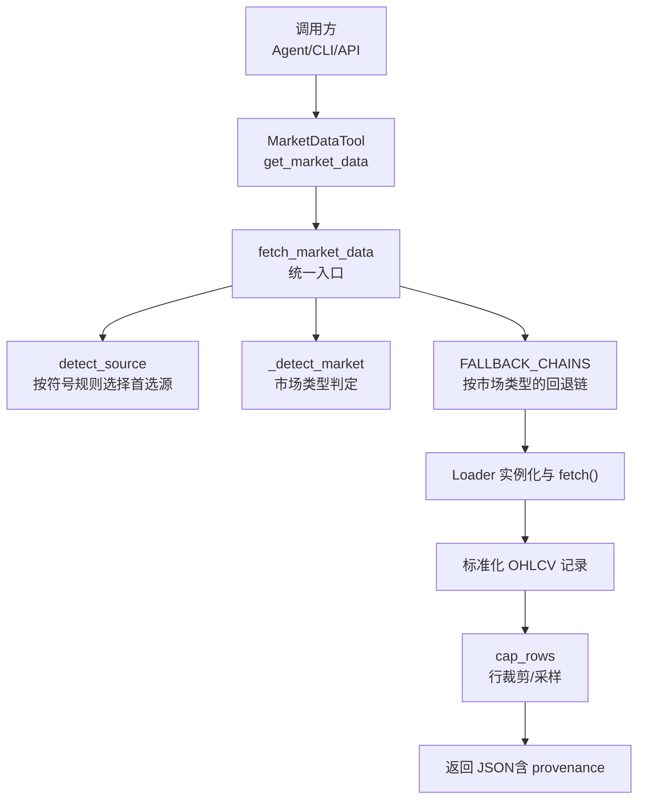
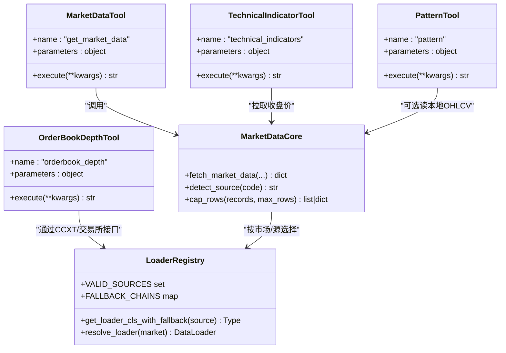
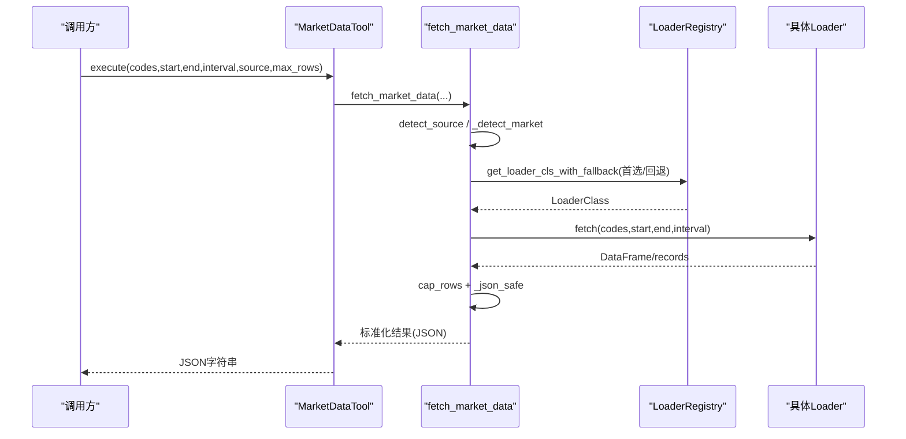
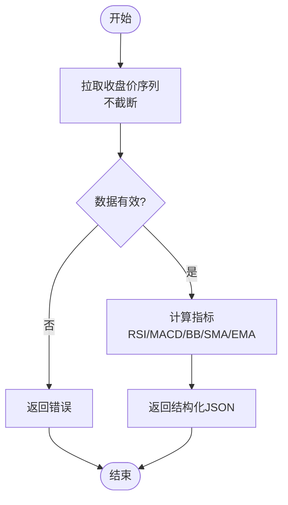
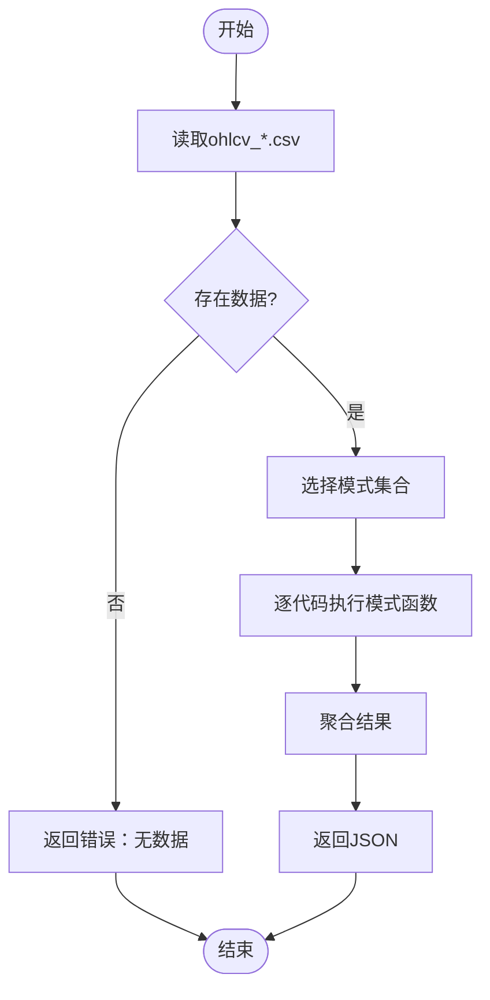
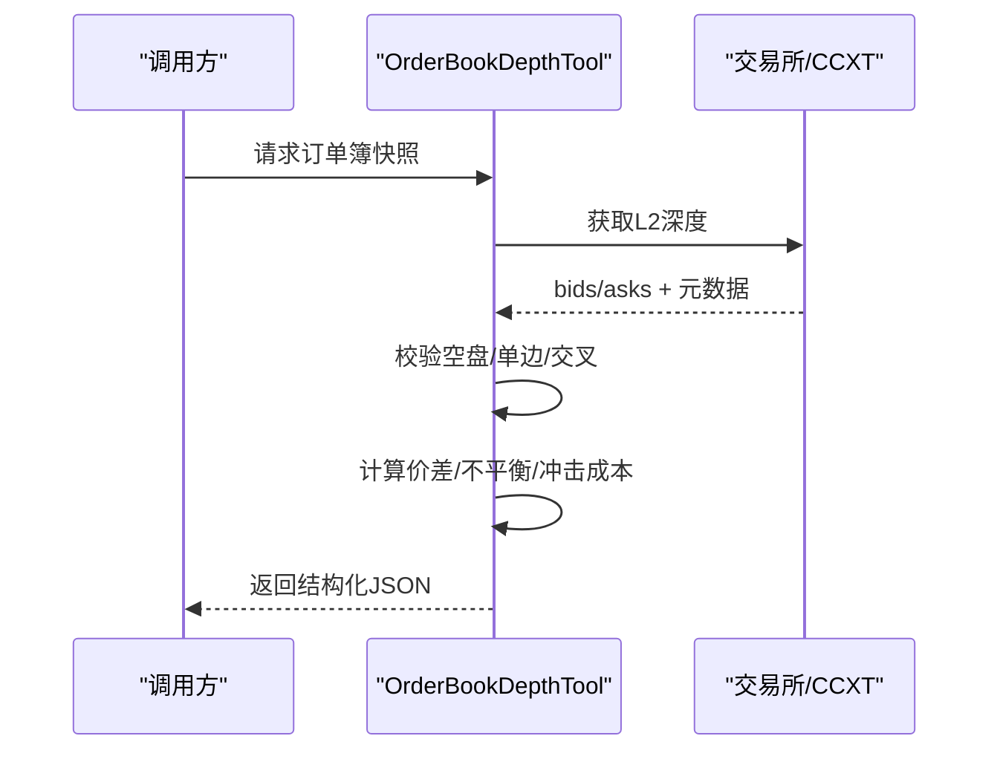

# 市场数据工具

<cite>
**本文引用的文件**
- [agent/src/market_data.py](file://agent/src/market_data.py)
- [agent/src/tools/market_data_tool.py](file://agent/src/tools/market_data_tool.py)
- [agent/src/tools/technical_indicator_tool.py](file://agent/src/tools/technical_indicator_tool.py)
- [agent/src/tools/pattern_tool.py](file://agent/src/tools/pattern_tool.py)
- [agent/src/tools/orderbook_depth_tool.py](file://agent/src/tools/orderbook_depth_tool.py)
- [agent/backtest/loaders/registry.py](file://agent/backtest/loaders/registry.py)
</cite>

## 目录
1. [简介](#简介)
2. [项目结构](#项目结构)
3. [核心组件](#核心组件)
4. [架构总览](#架构总览)
5. [详细组件分析](#详细组件分析)
6. [依赖关系分析](#依赖关系分析)
7. [性能考虑](#性能考虑)
8. [故障排查指南](#故障排查指南)
9. [结论](#结论)
10. [附录](#附录)

## 简介
本文件为 Vibe-Trading 的“市场数据工具”提供系统化文档，覆盖以下能力：
- 多源市场数据获取与自动路由（股票、ETF、指数、加密货币、外汇等）
- 技术指标计算（RSI、MACD、布林带、SMA、EMA）
- K线形态识别（头肩顶/底、双顶/底、三角形、喇叭口、K线形态、支撑阻力等）
- 订单簿深度分析与冲击成本估算（加密货币现货 L2 快照）
- 数据源适配机制与回退链策略
- 数据质量保障、性能优化建议与常见错误处理
- 通过组合多个工具完成复杂市场分析任务

## 项目结构
围绕市场数据的代码主要分布在以下位置：
- 共享市场数据获取与路由：agent/src/market_data.py
- 工具封装层：agent/src/tools/*（行情、技术指标、形态识别、订单簿深度）
- 数据源注册与回退链：agent/backtest/loaders/registry.py

图表来源
- [agent/src/market_data.py:97-223](file://agent/src/market_data.py#L97-L223)
- [agent/backtest/loaders/registry.py:136-155](file://agent/backtest/loaders/registry.py#L136-L155)

章节来源
- [agent/src/market_data.py:1-229](file://agent/src/market_data.py#L1-L229)
- [agent/backtest/loaders/registry.py:1-249](file://agent/backtest/loaders/registry.py#L1-L249)

## 核心组件
- 统一数据获取：fetch_market_data（支持 auto/source、区间、间隔、最大行数、回退链、溯源信息）
- 工具封装：
  - get_market_data：对外暴露参数化的行情拉取工具
  - technical_indicators：基于收盘价序列计算常用技术指标
  - pattern：读取历史 OHLCV 进行形态识别
  - orderbook_depth：加密货币现货 L2 订单簿深度与冲击成本分析
- 数据源适配：按符号与市场类型自动选择并回退到可用数据源

章节来源
- [agent/src/tools/market_data_tool.py:11-104](file://agent/src/tools/market_data_tool.py#L11-L104)
- [agent/src/tools/technical_indicator_tool.py:157-283](file://agent/src/tools/technical_indicator_tool.py#L157-L283)
- [agent/src/tools/pattern_tool.py:323-411](file://agent/src/tools/pattern_tool.py#L323-L411)
- [agent/src/tools/orderbook_depth_tool.py:285-445](file://agent/src/tools/orderbook_depth_tool.py#L285-L445)

## 架构总览
系统采用“工具层 + 统一数据获取 + 数据源注册/回退链”的分层设计。工具层负责参数校验与结果格式化；统一数据获取负责跨市场、跨源的兼容与健壮性；数据源层提供具体实现并通过注册表与回退链管理可用性。

图表来源
- [agent/src/tools/market_data_tool.py:11-104](file://agent/src/tools/market_data_tool.py#L11-L104)
- [agent/src/tools/technical_indicator_tool.py:157-283](file://agent/src/tools/technical_indicator_tool.py#L157-L283)
- [agent/src/tools/pattern_tool.py:323-411](file://agent/src/tools/pattern_tool.py#L323-L411)
- [agent/src/tools/orderbook_depth_tool.py:285-445](file://agent/src/tools/orderbook_depth_tool.py#L285-L445)
- [agent/backtest/loaders/registry.py:136-249](file://agent/backtest/loaders/registry.py#L136-L249)

## 详细组件分析

### 统一市场数据获取（fetch_market_data）
- 功能要点
  - 支持 codes、start_date、end_date、interval、max_rows、source（auto 或指定）、include_provenance
  - 根据符号匹配首选数据源（如 A 股用 tencent、美股用 yahoo、加密货币用 okx/ccxt、外汇用 mt5 等）
  - 按市场类型组织回退链（FALLBACK_CHAINS），在失败时自动降级
  - 对每只标的的结果进行行裁剪（cap_rows），避免响应过大
  - 可输出 _provenance 字段，记录实际使用的数据源与是否发生回退
- 返回值结构
  - 键为交易代码（或 local: 别名），值为标准化 OHLCV 列表或包含 rows/truncated/data 的摘要
  - 可选 _unresolved 列出未能解析的代码
  - 可选 _provenance 记录每个代码的数据来源与回退情况
- 关键流程
  - detect_source -> 分组 (source, market) -> 构建 attempts（首选+回退链）-> 依次尝试 loader.fetch -> 标准化与裁剪 -> 组装结果

图表来源
- [agent/src/market_data.py:97-223](file://agent/src/market_data.py#L97-L223)
- [agent/backtest/loaders/registry.py:196-249](file://agent/backtest/loaders/registry.py#L196-L249)

章节来源
- [agent/src/market_data.py:16-57](file://agent/src/market_data.py#L16-L57)
- [agent/src/market_data.py:66-84](file://agent/src/market_data.py#L66-L84)
- [agent/src/market_data.py:97-223](file://agent/src/market_data.py#L97-L223)
- [agent/backtest/loaders/registry.py:136-155](file://agent/backtest/loaders/registry.py#L136-L155)

### 技术指标工具（technical_indicators）
- 功能要点
  - 通过 fetch_market_data 拉取收盘价序列（强制不截断以保证指标连续性）
  - 计算 RSI(14)、MACD(12,26,9)、布林带(20,2σ)、SMA(20/50/200)、EMA(20)
  - 仅使用 pandas/numpy 纯本地计算，无额外依赖
- 输入参数
  - symbol：交易代码
  - interval：周期（如 1d/1wk/1mo）
  - lookback：回溯条数（默认200，上限500）
- 输出结构
  - ok/symbol/interval/latest_close/latest_date/indicators（内含各指标最新值）
- 异常处理
  - 无法获取数据、无收盘价列、被截断等情况均返回明确的错误消息

图表来源
- [agent/src/tools/technical_indicator_tool.py:39-87](file://agent/src/tools/technical_indicator_tool.py#L39-L87)
- [agent/src/tools/technical_indicator_tool.py:90-154](file://agent/src/tools/technical_indicator_tool.py#L90-L154)
- [agent/src/tools/technical_indicator_tool.py:200-283](file://agent/src/tools/technical_indicator_tool.py#L200-L283)

章节来源
- [agent/src/tools/technical_indicator_tool.py:157-283](file://agent/src/tools/technical_indicator_tool.py#L157-L283)

### K线形态识别（pattern）
- 功能要点
  - 从运行目录 artifacts 下的 ohlcv_*.csv 读取历史数据
  - 支持多种形态检测：峰谷点、K线形态（十字星、锤子线、吞没）、支撑阻力、趋势斜率、头肩顶/底、双顶/底、三角形、喇叭口
  - 支持窗口大小 window 控制灵敏度
- 输入参数
  - run_dir：运行目录路径
  - patterns：逗号分隔的模式名或 all
  - window：检测窗口
- 输出结构
  - status/results/patterns/window，results 按代码聚合各模式检测结果

图表来源
- [agent/src/tools/pattern_tool.py:24-131](file://agent/src/tools/pattern_tool.py#L24-L131)
- [agent/src/tools/pattern_tool.py:161-288](file://agent/src/tools/pattern_tool.py#L161-L288)
- [agent/src/tools/pattern_tool.py:323-411](file://agent/src/tools/pattern_tool.py#L323-L411)

章节来源
- [agent/src/tools/pattern_tool.py:323-411](file://agent/src/tools/pattern_tool.py#L323-L411)

### 订单簿深度分析（orderbook_depth）
- 功能要点
  - 读取加密货币现货 L2 订单簿快照（OKX/Binance via ccxt）
  - 计算买卖价差（绝对与基点）、深度不平衡（名义量比与归一化分数）
  - 模拟市场单冲击成本：买入/卖出分别沿 ask/bid 阶梯成交，计算加权均价与滑点（bps）
  - 严格校验：空盘、单边盘、交叉盘（best_bid >= best_ask）直接报错
  - 部分成交明确标注 fully_filled=false，并给出实际成交数量
- 输入参数（节选）
  - symbol：交易对（如 BTC-USDT）
  - levels：回显深度层级（用于展示与不平衡计算）
  - notional_quote：模拟订单名义金额（报价货币）
- 输出结构（节选）
  - bids/asks/tick_size/min_order_size/spread_bps/imbalance/impact_cost（buy/sell）/timestamp/exchange/fully_filled

图表来源
- [agent/src/tools/orderbook_depth_tool.py:285-445](file://agent/src/tools/orderbook_depth_tool.py#L285-L445)

章节来源
- [agent/src/tools/orderbook_depth_tool.py:285-445](file://agent/src/tools/orderbook_depth_tool.py#L285-L445)

## 依赖关系分析
- 数据源注册与回退链
  - VALID_SOURCES：所有受支持的源名称集合
  - FALLBACK_CHAINS：按市场类型定义优先顺序（例如 a_share/hk_equity/crypto/forex 等）
  - resolve_loader/get_loader_cls_with_fallback：按市场或源名选择可用 Loader，必要时回退
- 市场数据核心
  - detect_source：基于符号后缀/格式推断首选源（A 股、美股、港股、印度、加拿大、期货/外汇、韩股、加密货币等）
  - fetch_market_data：将符号分组、构建 attempts、依次尝试、收集结果、裁剪与序列化

图表来源
- [agent/src/market_data.py:16-57](file://agent/src/market_data.py#L16-L57)
- [agent/backtest/loaders/registry.py:136-155](file://agent/backtest/loaders/registry.py#L136-L155)
- [agent/backtest/loaders/registry.py:196-249](file://agent/backtest/loaders/registry.py#L196-L249)

章节来源
- [agent/backtest/loaders/registry.py:23-59](file://agent/backtest/loaders/registry.py#L23-L59)
- [agent/backtest/loaders/registry.py:136-155](file://agent/backtest/loaders/registry.py#L136-L155)
- [agent/backtest/loaders/registry.py:196-249](file://agent/backtest/loaders/registry.py#L196-L249)

## 性能考虑
- 控制数据规模
  - 使用 max_rows 限制每标的返回行数；对于指标计算需设置 max_rows=0 以避免采样导致的不连续
  - 合理缩小 start_date/end_date 与 interval 粒度，减少网络与内存开销
- 利用回退链
  - 优先使用轻量且抗限流的公开端点（如 Yahoo/Tencent/AkShare），再回退至 Key-gated REST
- 本地计算优先
  - 技术指标与形态识别均为本地计算，避免重复网络请求
- 缓存与复用
  - 对同一标的与区间的多次查询可在上层做缓存（工具层未内置）
- 并发与批处理
  - 批量 codes 一次拉取可减少握手与认证开销；注意服务端速率限制

[本节为通用指导，无需特定文件引用]

## 故障排查指南
- 无法解析或无数据
  - 检查 codes 是否符合预期格式（如 AAPL.US、600519.SH、BTC-USDT）
  - 查看 _unresolved 列表定位失败代码
  - 开启 include_provenance 查看实际使用的 source 与是否发生回退
- 指标计算失败
  - 确认数据未被截断（truncated=true 会阻止指标计算）
  - 确保存在收盘价列与日期列
- 订单簿为空或交叉
  - 空盘/单边盘/交叉盘会被拒绝并返回错误；请检查交易对与交易所状态
- 数据源不可用
  - 检查网络与 API Key（如 tushare/finnhub/alphavantage/tiingo/fmp）
  - 本地数据源（local）配置缺失时会明确报错，不会静默回退到网络源

章节来源
- [agent/src/market_data.py:198-223](file://agent/src/market_data.py#L198-L223)
- [agent/src/tools/technical_indicator_tool.py:218-252](file://agent/src/tools/technical_indicator_tool.py#L218-L252)
- [agent/src/tools/orderbook_depth_tool.py:409-445](file://agent/src/tools/orderbook_depth_tool.py#L409-L445)
- [agent/backtest/loaders/registry.py:221-249](file://agent/backtest/loaders/registry.py#L221-L249)

## 结论
Vibe-Trading 的市场数据工具以统一的 fetch_market_data 为核心，结合按市场与符号的智能路由与回退链，提供了稳定、可扩展的多源数据接入能力。配合技术指标、K线形态与订单簿深度分析工具，用户可快速完成从数据获取到微观结构分析的完整工作流。通过合理的参数配置与性能优化，能够在保证数据质量的同时获得良好的扩展性与鲁棒性。

[本节为总结性内容，无需特定文件引用]

## 附录

### 工具参数与返回结构速查

- get_market_data
  - 参数：codes、start_date、end_date、source（auto/指定）、interval、max_rows
  - 返回：标准化 OHLCV 列表或摘要；可选 _unresolved/_provenance
  - 参考路径：[market_data_tool.py:20-91](file://agent/src/tools/market_data_tool.py#L20-L91), [market_data.py:97-223](file://agent/src/market_data.py#L97-L223)

- technical_indicators
  - 参数：symbol、interval、lookback
  - 返回：ok、symbol、interval、latest_close、latest_date、indicators（RSI/MACD/BB/SMA/EMA）
  - 参考路径：[technical_indicator_tool.py:171-196](file://agent/src/tools/technical_indicator_tool.py#L171-L196), [technical_indicator_tool.py:271-283](file://agent/src/tools/technical_indicator_tool.py#L271-L283)

- pattern
  - 参数：run_dir、patterns（all 或逗号分隔）、window
  - 返回：status、results（按代码聚合）、patterns、window
  - 参考路径：[pattern_tool.py:393-401](file://agent/src/tools/pattern_tool.py#L393-L401), [pattern_tool.py:374-385](file://agent/src/tools/pattern_tool.py#L374-L385)

- orderbook_depth
  - 参数：symbol、levels、notional_quote（以及交易所相关内部参数）
  - 返回：bids/asks、spread_bps、imbalance、impact_cost（buy/sell）、timestamp/exchange、fully_filled
  - 参考路径：[orderbook_depth_tool.py:285-445](file://agent/src/tools/orderbook_depth_tool.py#L285-L445)

### 数据源适配与回退链要点
- 首选源推断：依据符号后缀/格式（A 股、美股、港股、印度、加拿大、期货/外汇、韩股、加密货币）
- 回退链：按市场类型定义（a_share/hk_equity/crypto/forex 等），优先轻量公开端点，再回退至 Key-gated REST
- 特殊约束：local/qveris 明确禁止静默回退到网络源，避免掩盖配置问题
- 参考路径：[market_data.py:16-57](file://agent/src/market_data.py#L16-L57), [registry.py:136-155](file://agent/backtest/loaders/registry.py#L136-L155), [registry.py:221-249](file://agent/backtest/loaders/registry.py#L221-L249)

### 组合示例（思路说明）
- 实时行情 + 技术指标：先调用 get_market_data 获取最近 N 根 K 线，再调用 technical_indicators 计算 RSI/MACD/布林带，辅助入场/出场决策
- 形态识别 + 微观结构：先用 pattern 识别头肩顶/双顶/三角形等形态，再用 orderbook_depth 评估流动性与冲击成本，制定分批下单计划
- 多资产对比：批量 codes 一次性拉取，统一清洗后横向比较波动率与相关性，筛选交易机会

[本节为概念性示例，无需特定文件引用]