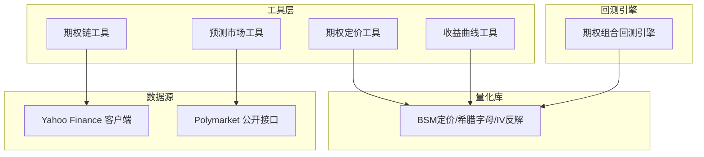
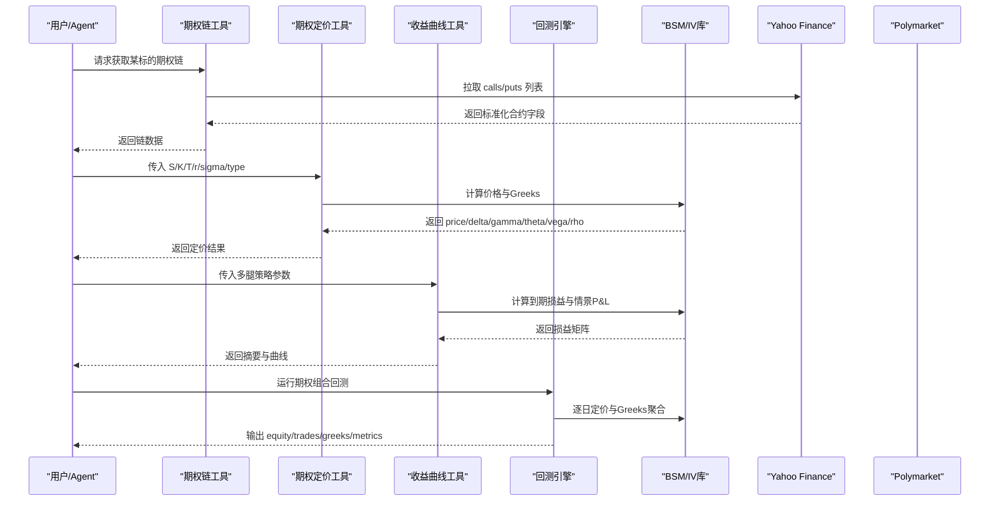
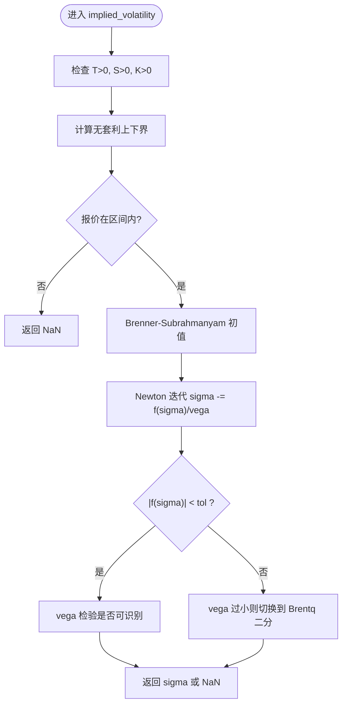
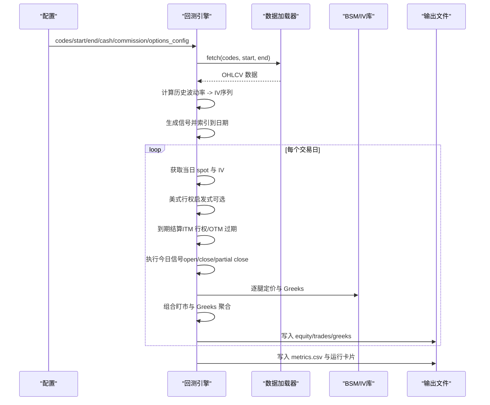
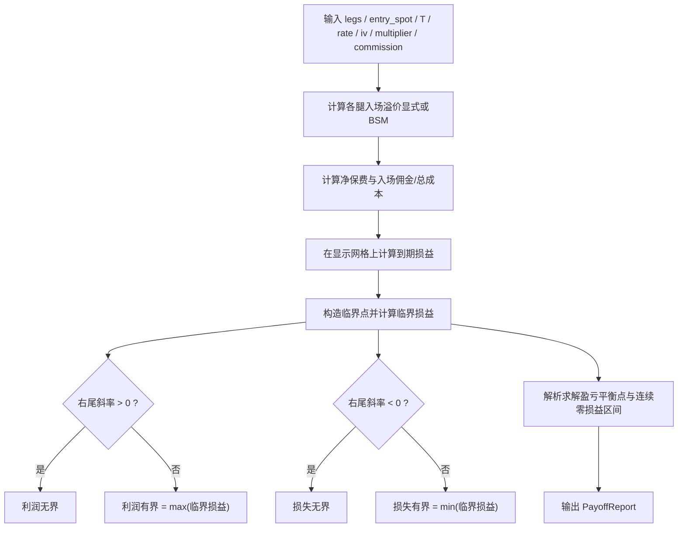
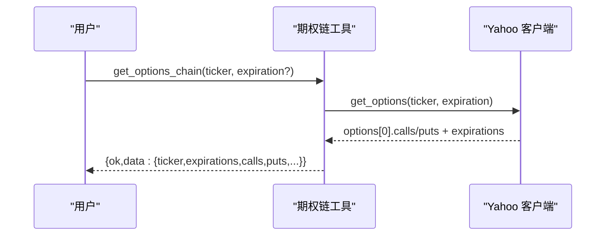
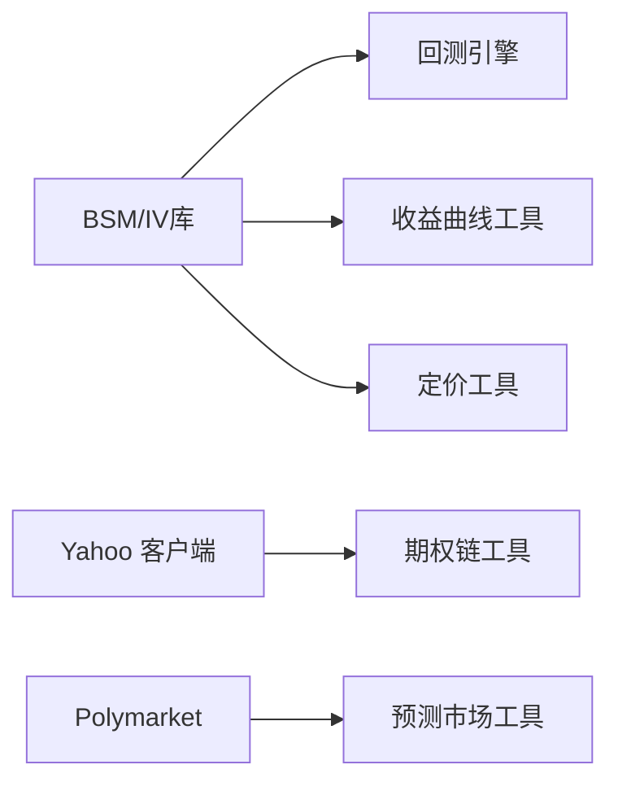

# 期权衍生品工具

<cite>
**本文引用的文件**
- [agent/src/quantlib/options.py](file://agent/src/quantlib/options.py)
- [agent/backtest/engines/options_portfolio.py](file://agent/backtest/engines/options_portfolio.py)
- [agent/backtest/options_payoff.py](file://agent/backtest/options_payoff.py)
- [agent/src/tools/options_chain_tool.py](file://agent/src/tools/options_chain_tool.py)
- [agent/src/tools/options_pricing_tool.py](file://agent/src/tools/options_pricing_tool.py)
- [agent/src/tools/options_payoff_tool.py](file://agent/src/tools/options_payoff_tool.py)
- [agent/src/tools/prediction_market_tool.py](file://agent/src/tools/prediction_market_tool.py)
- [agent/backtest/loaders/yahoo_client.py](file://agent/backtest/loaders/yahoo_client.py)
</cite>

## 目录
1. [简介](#简介)
2. [项目结构](#项目结构)
3. [核心组件](#核心组件)
4. [架构总览](#架构总览)
5. [详细组件分析](#详细组件分析)
6. [依赖关系分析](#依赖关系分析)
7. [性能与数值稳定性](#性能与数值稳定性)
8. [故障排查指南](#故障排查指南)
9. [结论](#结论)
10. [附录：使用示例与策略模板](#附录使用示例与策略模板)

## 简介
本仓库为 Vibe-Trading 的期权与衍生品研究、定价与回测工具集。围绕“期权链查询、收益曲线分析、期权定价与希腊字母计算、预测市场分析”等能力，提供从数据获取、理论定价、组合损益矩阵到回测引擎的一体化方案。其核心特点包括：
- 统一的 Black-Scholes-Merton（BSM）定价与希腊字母实现，支持股息率、隐含波动率反解与退化输入处理。
- 期权组合回测引擎，支持欧式/美式行权启发式、IV微笑调整、按日盯市与希腊字母聚合输出。
- 多腿策略的收益曲线与情景矩阵分析，解析求解盈亏平衡点与极值。
- 期权链读取工具（基于 Yahoo Finance），以及预测市场事件合约数据工具（Polymarket）。
- 面向研究与策略设计的工具化封装，便于通过 CLI/MCP/Agent 调用。

## 项目结构
与期权相关的代码主要分布在以下模块：
- 量化库：Black-Scholes 定价、希腊字母、隐含波动率反解
- 回测引擎：期权组合逐日模拟、IV微笑、美式行权启发式、指标统计
- 工具层：期权链查询、期权定价、多腿收益分析、预测市场数据
- 数据源：Yahoo Finance 期权链、Polymarket 事件合约

图表来源
- [agent/src/tools/options_chain_tool.py:1-156](file://agent/src/tools/options_chain_tool.py#L1-L156)
- [agent/src/tools/options_pricing_tool.py:1-172](file://agent/src/tools/options_pricing_tool.py#L1-L172)
- [agent/src/tools/options_payoff_tool.py:1-358](file://agent/src/tools/options_payoff_tool.py#L1-L358)
- [agent/src/tools/prediction_market_tool.py:990-1237](file://agent/src/tools/prediction_market_tool.py#L990-L1237)
- [agent/src/quantlib/options.py:1-406](file://agent/src/quantlib/options.py#L1-L406)
- [agent/backtest/engines/options_portfolio.py:1-733](file://agent/backtest/engines/options_portfolio.py#L1-L733)
- [agent/backtest/loaders/yahoo_client.py:311-360](file://agent/backtest/loaders/yahoo_client.py#L311-L360)

章节来源
- [agent/src/quantlib/options.py:1-406](file://agent/src/quantlib/options.py#L1-L406)
- [agent/backtest/engines/options_portfolio.py:1-733](file://agent/backtest/engines/options_portfolio.py#L1-L733)
- [agent/backtest/options_payoff.py:1-497](file://agent/backtest/options_payoff.py#L1-L497)
- [agent/src/tools/options_chain_tool.py:1-156](file://agent/src/tools/options_chain_tool.py#L1-L156)
- [agent/src/tools/options_pricing_tool.py:1-172](file://agent/src/tools/options_pricing_tool.py#L1-L172)
- [agent/src/tools/options_payoff_tool.py:1-358](file://agent/src/tools/options_payoff_tool.py#L1-L358)
- [agent/src/tools/prediction_market_tool.py:990-1237](file://agent/src/tools/prediction_market_tool.py#L990-L1237)
- [agent/backtest/loaders/yahoo_client.py:311-360](file://agent/backtest/loaders/yahoo_client.py#L311-L360)

## 核心组件
- BSM 定价与希腊字母：统一实现，含股息率、退化输入处理、IV反解（牛顿+二分法）、无套利区间校验。
- 期权组合回测引擎：历史波动率作为基础 IV，支持 IV 微笑（偏斜与曲率）、美式行权启发式、按日盯市、组合 Greeks 汇总与指标统计。
- 收益曲线与情景矩阵：解析求解到期损益、盈亏平衡点与极值；构建 spot×IV 的情景 P&L 矩阵。
- 工具封装：
  - 期权链工具：读取美股期权链（calls/puts），标准化字段并限制规模。
  - 期权定价工具：输入标的价、行权价、剩余天数、波动率、利率、类型，输出价格与 Greeks。
  - 收益曲线工具：多腿策略的到期损益与情景矩阵，支持自定义佣金与乘数。
  - 预测市场工具：搜索事件、查看市场报价与概率历史，用于事件驱动研究。

章节来源
- [agent/src/quantlib/options.py:161-406](file://agent/src/quantlib/options.py#L161-L406)
- [agent/backtest/engines/options_portfolio.py:35-99,173-517:35-99](file://agent/backtest/engines/options_portfolio.py#L35-L99)
- [agent/backtest/options_payoff.py:274-457](file://agent/backtest/options_payoff.py#L274-L457)
- [agent/src/tools/options_chain_tool.py:37-156](file://agent/src/tools/options_chain_tool.py#L37-L156)
- [agent/src/tools/options_pricing_tool.py:77-172](file://agent/src/tools/options_pricing_tool.py#L77-L172)
- [agent/src/tools/options_payoff_tool.py:21-225](file://agent/src/tools/options_payoff_tool.py#L21-L225)
- [agent/src/tools/prediction_market_tool.py:995-1237](file://agent/src/tools/prediction_market_tool.py#L995-L1237)

## 架构总览
下图展示从工具调用到量化库与数据源的端到端流程。

图表来源
- [agent/src/tools/options_chain_tool.py:70-100](file://agent/src/tools/options_chain_tool.py#L70-L100)
- [agent/backtest/loaders/yahoo_client.py:311-360](file://agent/backtest/loaders/yahoo_client.py#L311-L360)
- [agent/src/tools/options_pricing_tool.py:95-172](file://agent/src/tools/options_pricing_tool.py#L95-L172)
- [agent/src/quantlib/options.py:161-406](file://agent/src/quantlib/options.py#L161-L406)
- [agent/backtest/engines/options_portfolio.py:173-517](file://agent/backtest/engines/options_portfolio.py#L173-L517)
- [agent/src/tools/options_payoff_tool.py:122-225](file://agent/src/tools/options_payoff_tool.py#L122-L225)

## 详细组件分析

### 组件A：Black-Scholes 定价与希腊字母（核心数学）
- 功能要点
  - 支持欧式期权定价与五类希腊字母（delta/gamma/theta/vega/rho），含连续股息率 q。
  - 退化输入（T<=0、sigma<=0、S<=0、K<=0）直接返回内在价值与极限 Greeks，避免数值异常。
  - 隐含波动率反解：以 Brenner-Subrahmanyam 近似为初值，Newton 迭代，vega 过小则切换至 Brentq 二分法；对不可识别的报价返回 NaN。
  - 无套利区间校验：拒绝低于折现内在价值或高于上限的报价。
- 复杂度
  - 定价与 Greeks：O(1)。
  - IV 反解：Newton 迭代 + 二分法，通常收敛快；最坏情况受最大迭代次数限制。
- 风险与边界
  - 深度 ITM/OTM 或临近到期时 Vega 接近零，IV 反解不稳定，函数会返回 NaN 以避免误导。
  - 类型归一化兼容多种拼写（含中文“认购/认沽”），避免配置歧义。

图表来源
- [agent/src/quantlib/options.py:298-406](file://agent/src/quantlib/options.py#L298-L406)

章节来源
- [agent/src/quantlib/options.py:161-406](file://agent/src/quantlib/options.py#L161-L406)

### 组件B：期权组合回测引擎（v2）
- 功能要点
  - 历史波动率作为基础 IV，支持 IV 微笑（偏斜 skew 与曲率 curvature）。
  - 美式行权启发式：比较内在价值与续持价值（BSM），当内在价值显著更高时提前行权。
  - 逐日模拟：获取标的价与 IV，执行信号（开仓/平仓/部分平仓），到期自动结算，记录交易与 Greeks。
  - 输出：equity.csv、trades.csv、greeks.csv、metrics.csv 及运行卡片。
- 关键流程
  - 计算历史波动率序列。
  - 生成信号并索引到交易日。
  - 每日：更新现货与 IV → 美式行权判断 → 到期结算 → 执行信号 → 组合盯市与 Greeks 聚合。
  - 计算指标：年化收益、最大回撤、Sharpe/Calmar/Sortino、胜率、盈亏比等。

图表来源
- [agent/backtest/engines/options_portfolio.py:173-517](file://agent/backtest/engines/options_portfolio.py#L173-L517)

章节来源
- [agent/backtest/engines/options_portfolio.py:35-99,173-517,554-733:35-99](file://agent/backtest/engines/options_portfolio.py#L35-L99)

### 组件C：收益曲线与情景矩阵（多腿策略）
- 功能要点
  - 到期损益：解析求解盈亏平衡点与极值，不依赖显示网格。
  - 情景矩阵：spot×IV 的盯市 P&L 矩阵，用于评估不同波动率路径下的表现。
  - 支持自定义乘数与佣金，与回测引擎保持一致的入场成本语义。
- 算法要点
  - 临界点集合包含 0 与各腿行权价，据此分段线性求解根与区间。
  - 右尾斜率决定利润/损失是否无界。

图表来源
- [agent/backtest/options_payoff.py:144-196,203-244,274-355:144-196](file://agent/backtest/options_payoff.py#L144-L196)

章节来源
- [agent/backtest/options_payoff.py:274-457](file://agent/backtest/options_payoff.py#L274-L457)
- [agent/src/tools/options_payoff_tool.py:122-225](file://agent/src/tools/options_payoff_tool.py#L122-L225)

### 组件D：期权链查询工具（美股）
- 功能要点
  - 通过 Yahoo Finance 客户端获取单一到期日的 calls/puts 链。
  - 标准化字段：合约符号、行权价、买卖价、最新价、成交量、持仓量、隐含波动率、是否实值、到期时间。
  - 限制每侧合约数量，防止响应过大。
- 数据流
  - 工具接收 ticker 与可选 expiration（Unix 秒），调用 yahoo_client.get_options，返回结构化 JSON。

图表来源
- [agent/src/tools/options_chain_tool.py:70-156](file://agent/src/tools/options_chain_tool.py#L70-L156)
- [agent/backtest/loaders/yahoo_client.py:311-360](file://agent/backtest/loaders/yahoo_client.py#L311-L360)

章节来源
- [agent/src/tools/options_chain_tool.py:37-156](file://agent/src/tools/options_chain_tool.py#L37-L156)
- [agent/backtest/loaders/yahoo_client.py:311-360](file://agent/backtest/loaders/yahoo_client.py#L311-L360)

### 组件E：期权定价工具（BSM 价格与 Greeks）
- 功能要点
  - 输入：spot、strike、expiry_days、volatility、option_type，可选 risk_free_rate。
  - 输出：price、delta、gamma、theta、vega、rho，以及输入参数与状态（正常/退化）。
  - 严格输入校验，非有限值或非法类型将返回错误信封。
- 使用建议
  - 适用于单腿快速定价与敏感性分析；可与收益曲线工具结合进行策略设计。

章节来源
- [agent/src/tools/options_pricing_tool.py:77-172](file://agent/src/tools/options_pricing_tool.py#L77-L172)
- [agent/src/quantlib/options.py:161-263](file://agent/src/quantlib/options.py#L161-L263)

### 组件F：预测市场分析工具（事件合约）
- 功能要点
  - 读取 Polymarket 公开事件合约数据，支持搜索、事件详情、市场报价与概率历史。
  - 报价即隐含概率（0-1 与百分比），区分交易状态与结算状态，避免误用。
  - 批量 ID 支持，失败项隔离报告，不中断整体调用。
- 适用场景
  - 事件驱动研究、宏观事件概率跟踪、与期权策略联动的预期管理。

章节来源
- [agent/src/tools/prediction_market_tool.py:995-1237](file://agent/src/tools/prediction_market_tool.py#L995-L1237)

## 依赖关系分析
- 量化库被多个上层模块复用：
  - 回测引擎依赖 BSM 定价与 Greeks。
  - 收益曲线工具依赖 BSM 定价用于情景矩阵。
  - 定价工具直接暴露 BSM 能力。
- 数据源依赖：
  - 期权链工具依赖 Yahoo Finance 客户端。
  - 预测市场工具依赖 Polymarket 公开接口。

图表来源
- [agent/src/quantlib/options.py:1-406](file://agent/src/quantlib/options.py#L1-L406)
- [agent/backtest/engines/options_portfolio.py:1-733](file://agent/backtest/engines/options_portfolio.py#L1-L733)
- [agent/backtest/options_payoff.py:1-497](file://agent/backtest/options_payoff.py#L1-L497)
- [agent/src/tools/options_chain_tool.py:1-156](file://agent/src/tools/options_chain_tool.py#L1-L156)
- [agent/src/tools/options_pricing_tool.py:1-172](file://agent/src/tools/options_pricing_tool.py#L1-L172)
- [agent/src/tools/options_payoff_tool.py:1-358](file://agent/src/tools/options_payoff_tool.py#L1-L358)
- [agent/src/tools/prediction_market_tool.py:990-1237](file://agent/src/tools/prediction_market_tool.py#L990-L1237)
- [agent/backtest/loaders/yahoo_client.py:311-360](file://agent/backtest/loaders/yahoo_client.py#L311-L360)

章节来源
- [agent/src/quantlib/options.py:1-406](file://agent/src/quantlib/options.py#L1-L406)
- [agent/backtest/engines/options_portfolio.py:1-733](file://agent/backtest/engines/options_portfolio.py#L1-L733)
- [agent/backtest/options_payoff.py:1-497](file://agent/backtest/options_payoff.py#L1-L497)
- [agent/src/tools/options_chain_tool.py:1-156](file://agent/src/tools/options_chain_tool.py#L1-L156)
- [agent/src/tools/options_pricing_tool.py:1-172](file://agent/src/tools/options_pricing_tool.py#L1-L172)
- [agent/src/tools/options_payoff_tool.py:1-358](file://agent/src/tools/options_payoff_tool.py#L1-L358)
- [agent/src/tools/prediction_market_tool.py:990-1237](file://agent/src/tools/prediction_market_tool.py#L990-L1237)
- [agent/backtest/loaders/yahoo_client.py:311-360](file://agent/backtest/loaders/yahoo_client.py#L311-L360)

## 性能与数值稳定性
- 定价与 Greeks：向量化计算，O(1)，适合高频调用。
- IV 反解：
  - 初值选择合理，Newton 迭代快速收敛。
  - Vega 过小时自动切换二分法，保证鲁棒性。
  - 对不可识别报价返回 NaN，避免虚假精度。
- 回测引擎：
  - 历史波动率滚动窗口平滑噪声。
  - IV 微笑参数可调，避免平坦 IV 导致的虚利。
  - 美式行权启发式仅在必要时触发，减少不必要计算。
- 收益曲线：
  - 解析求解盈亏平衡点与极值，避免网格误差。
  - 情景矩阵维度可控，默认点数适中，可按需调整。

[本节为通用指导，无需具体文件引用]

## 故障排查指南
- 期权链查询失败
  - 现象：返回错误信封或空数据。
  - 可能原因：ticker 无效、网络异常、Yahoo 限流。
  - 处理：检查 ticker 格式（支持 .US 后缀剥离）、重试、降低频率。
  - 参考路径：[agent/src/tools/options_chain_tool.py:70-100](file://agent/src/tools/options_chain_tool.py#L70-L100)、[agent/backtest/loaders/yahoo_client.py:311-360](file://agent/backtest/loaders/yahoo_client.py#L311-L360)
- 定价结果为退化或非有限
  - 现象：status=degenerate 或包含 NaN/Inf。
  - 可能原因：T=0、sigma<=0、S<=0、K<=0 或极端输入。
  - 处理：检查输入范围，避免零或负波动率；临近到期时关注 Greeks 奇异。
  - 参考路径：[agent/src/tools/options_pricing_tool.py:132-172](file://agent/src/tools/options_pricing_tool.py#L132-L172)、[agent/src/quantlib/options.py:161-263](file://agent/src/quantlib/options.py#L161-L263)
- IV 反解失败
  - 现象：返回 NaN。
  - 可能原因：报价低于折现内在价值或高于上限；深度 OTM/临近到期导致 Vega 过小。
  - 处理：检查报价合理性；放宽 tol 或使用更稳健的网格；避免极端行权价。
  - 参考路径：[agent/src/quantlib/options.py:298-406](file://agent/src/quantlib/options.py#L298-L406)
- 回测无权益或指标缺失
  - 现象：equity.csv 为空或指标未定义。
  - 可能原因：无数据、初始资金非正、路径非有限、bars_per_year<=0。
  - 处理：确认数据加载成功、设置合理初始资金与 bars_per_year。
  - 参考路径：[agent/backtest/engines/options_portfolio.py:215-219,480-517:215-219](file://agent/backtest/engines/options_portfolio.py#L215-L219)

章节来源
- [agent/src/tools/options_chain_tool.py:70-100](file://agent/src/tools/options_chain_tool.py#L70-L100)
- [agent/backtest/loaders/yahoo_client.py:311-360](file://agent/backtest/loaders/yahoo_client.py#L311-L360)
- [agent/src/tools/options_pricing_tool.py:132-172](file://agent/src/tools/options_pricing_tool.py#L132-L172)
- [agent/src/quantlib/options.py:298-406](file://agent/src/quantlib/options.py#L298-L406)
- [agent/backtest/engines/options_portfolio.py:215-219,480-517:215-219](file://agent/backtest/engines/options_portfolio.py#L215-L219)

## 结论
该工具集提供了完整的期权研究闭环：从链数据获取、理论定价与 Greeks、多腿策略损益分析，到组合回测与风险管理。其核心优势在于：
- 统一的 BSM 实现与严格的数值边界处理，确保定价与 IV 反解的可靠性。
- 回测引擎支持 IV 微笑与美式行权启发式，贴近真实市场行为。
- 工具化封装使策略设计与风险评估易于复用与扩展。
- 预测市场工具为事件驱动策略提供额外视角。

建议在策略设计中：
- 使用收益曲线工具解析求解盈亏平衡点与极值，避免网格误差。
- 结合 IV 微笑参数校准，避免平坦 IV 带来的虚利。
- 关注临近到期与深度 OTM/ITM 的数值稳定性，谨慎解读 Greeks。
- 利用预测市场数据辅助事件驱动决策，并与期权头寸联动管理风险。

[本节为总结性内容，无需具体文件引用]

## 附录：使用示例与策略模板
以下为常见用法的路径指引（不直接粘贴代码）：
- 获取期权链（美股）
  - 工具：get_options_chain
  - 参考路径：[agent/src/tools/options_chain_tool.py:70-156](file://agent/src/tools/options_chain_tool.py#L70-L156)
- 计算单腿期权价格与 Greeks
  - 工具：options_pricing
  - 参考路径：[agent/src/tools/options_pricing_tool.py:95-172](file://agent/src/tools/options_pricing_tool.py#L95-L172)
- 构建多腿策略并分析到期损益与情景矩阵
  - 工具：options_payoff
  - 参考路径：[agent/src/tools/options_payoff_tool.py:122-225](file://agent/src/tools/options_payoff_tool.py#L122-L225)
  - 策略模板（如牛市看涨价差、跨式、铁鹰）：[agent/backtest/options_payoff.py:460-497](file://agent/backtest/options_payoff.py#L460-L497)
- 运行期权组合回测
  - 入口：run_options_backtest
  - 参考路径：[agent/backtest/engines/options_portfolio.py:173-517](file://agent/backtest/engines/options_portfolio.py#L173-L517)
- 预测市场事件搜索与报价历史
  - 工具：prediction_market
  - 参考路径：[agent/src/tools/prediction_market_tool.py:1114-1237](file://agent/src/tools/prediction_market_tool.py#L1114-L1237)

章节来源
- [agent/src/tools/options_chain_tool.py:70-156](file://agent/src/tools/options_chain_tool.py#L70-L156)
- [agent/src/tools/options_pricing_tool.py:95-172](file://agent/src/tools/options_pricing_tool.py#L95-L172)
- [agent/src/tools/options_payoff_tool.py:122-225](file://agent/src/tools/options_payoff_tool.py#L122-L225)
- [agent/backtest/options_payoff.py:460-497](file://agent/backtest/options_payoff.py#L460-L497)
- [agent/backtest/engines/options_portfolio.py:173-517](file://agent/backtest/engines/options_portfolio.py#L173-L517)
- [agent/src/tools/prediction_market_tool.py:1114-1237](file://agent/src/tools/prediction_market_tool.py#L1114-L1237)