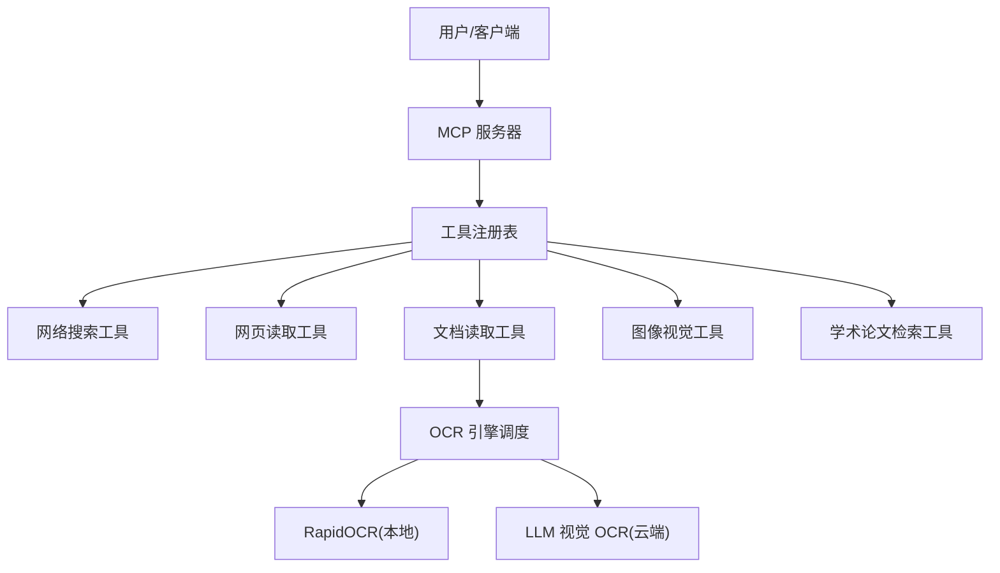
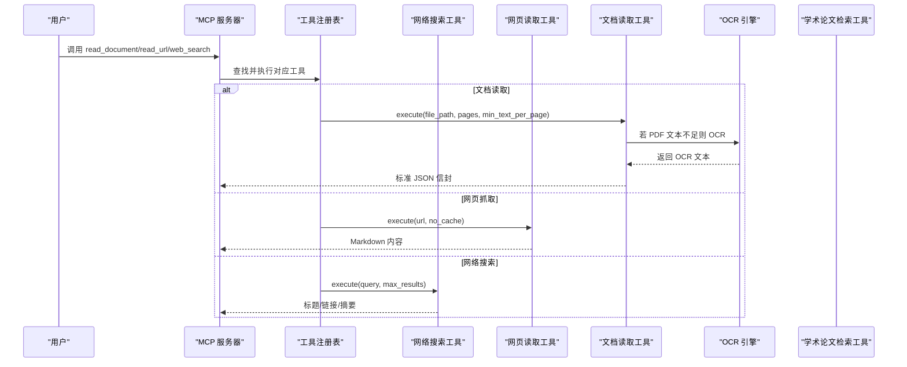
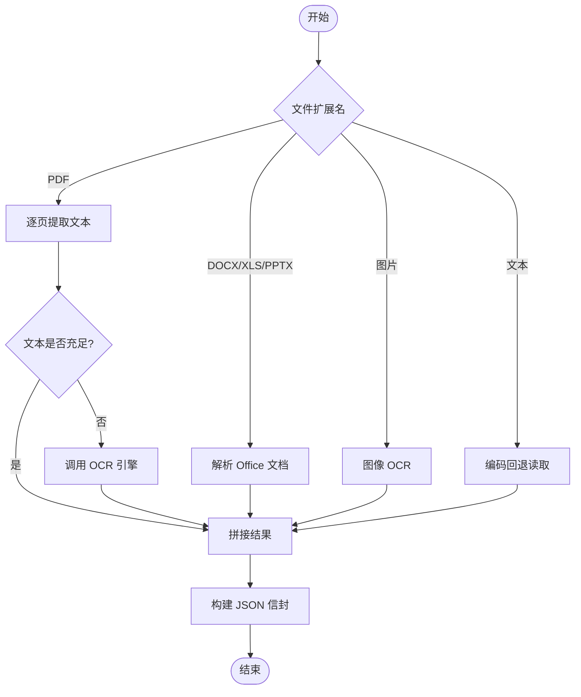
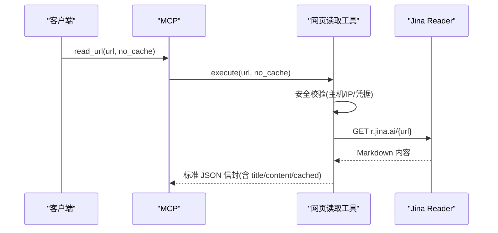
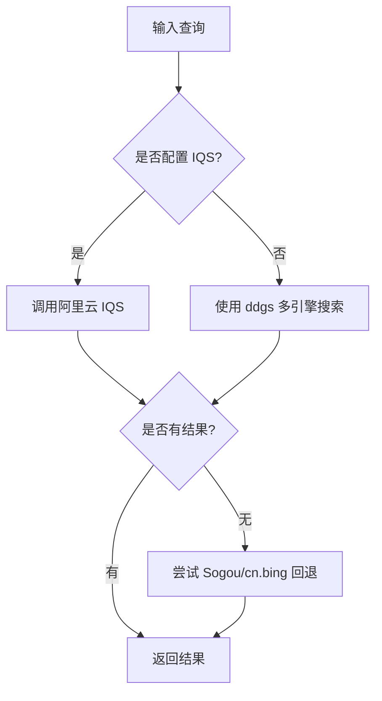
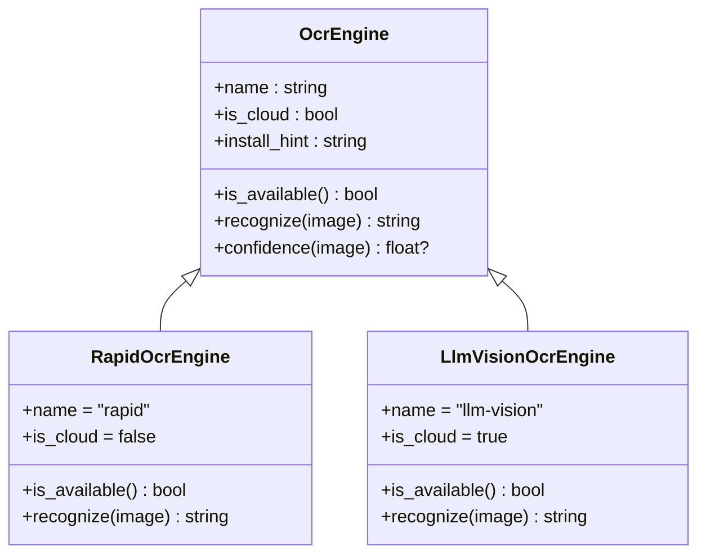
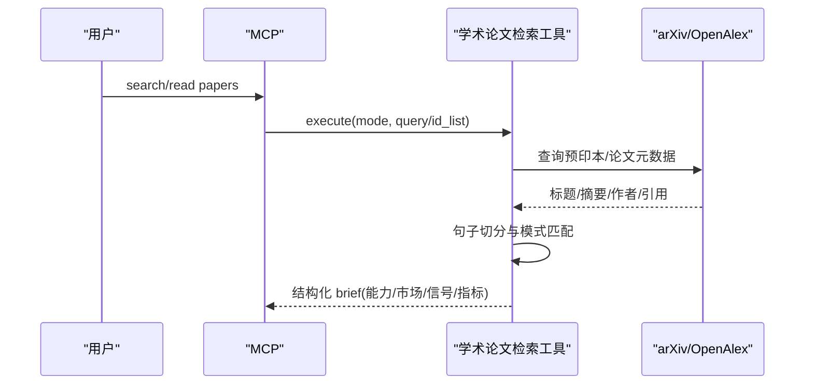
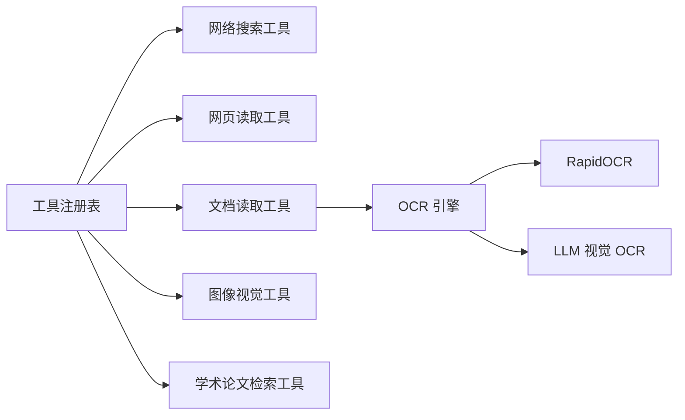

# 研究生产力工具

<cite>
**本文引用的文件**
- [README.md](file://README.md)
- [工具注册表 __init__.py](file://agent/src/tools/__init__.py)
- [网络搜索工具 web_search_tool.py](file://agent/src/tools/web_search_tool.py)
- [网页读取工具 web_reader_tool.py](file://agent/src/tools/web_reader_tool.py)
- [文档读取工具 doc_reader_tool.py](file://agent/src/tools/doc_reader_tool.py)
- [图像视觉分析工具 image_vision_tool.py](file://agent/src/tools/image_vision_tool.py)
- [学术论文检索工具 research_papers_tool.py](file://agent/src/tools/research_papers_tool.py)
- [OCR 引擎调度 engine.py](file://agent/src/tools/ocr/engine.py)
- [LLM 视觉 OCR llm_vision_ocr.py](file://agent/src/tools/ocr/llm_vision_ocr.py)
- [RapidOCR 引擎 rapid_ocr.py](file://agent/src/tools/ocr/rapid_ocr.py)
- [MCP 服务器 mcp_server.py](file://agent/mcp_server.py)
</cite>

## 目录
1. [简介](#简介)
2. [项目结构](#项目结构)
3. [核心组件](#核心组件)
4. [架构总览](#架构总览)
5. [详细组件分析](#详细组件分析)
6. [依赖关系分析](#依赖关系分析)
7. [性能考量](#性能考量)
8. [故障排查指南](#故障排查指南)
9. [结论](#结论)
10. [附录](#附录)

## 简介
本文件面向 Vibe-Trading 研究生产力工具，聚焦以下能力：文档阅读与解析、网页抓取与清洗、多引擎网络搜索、图像识别与智能信息抽取、学术论文检索与结构化摘要。通过统一的工具注册与执行框架，将上述能力组合为可复用的工作流，帮助金融研究高效完成资料收集、证据整理与知识沉淀。

## 项目结构
围绕“工具即服务”的设计，系统以工具注册表为核心，按需发现并挂载本地与远程（MCP）工具；上层通过 MCP 暴露统一接口，供 CLI、Web UI、自动化流程调用。关键路径包括：
- 工具注册与发现：自动扫描 src/tools 下的 BaseTool 子类，支持可选的 MCP 工具注入
- 数据获取：web_search、read_url、read_document、analyze_image
- 学术检索：research_papers 基于 arXiv/OpenAlex 的结构化提取
- OCR 引擎：可插拔的本地/云端 OCR，自动选择与降级

**图示来源**
- [工具注册表 __init__.py:66-245](file://agent/src/tools/__init__.py#L66-L245)
- [MCP 服务器 mcp_server.py:1060-1112](file://agent/mcp_server.py#L1060-L1112)
- [OCR 引擎调度 engine.py:118-170](file://agent/src/tools/ocr/engine.py#L118-L170)

**章节来源**
- [工具注册表 __init__.py:66-245](file://agent/src/tools/__init__.py#L66-L245)
- [MCP 服务器 mcp_server.py:1060-1112](file://agent/mcp_server.py#L1060-L1112)

## 核心组件
- 工具注册与执行：统一入口 build_registry，自动发现 BaseTool 子类，支持 shell 工具白名单、MCP 工具合并、会话注入等
- 网络搜索：多引擎聚合（DuckDuckGo/Google/Bing/Brave/Mojeek/Yahoo），失败回退至国内源（Sogou/cn.bing），支持阿里云 IQS 加速
- 网页抓取：通过 Jina Reader 将任意 URL 转为 Markdown，内置安全校验与缓存控制
- 文档读取：PDF/Word/Excel/PPT/图片/文本统一解析，PDF 页面级阈值触发 OCR，输出标准化 JSON 信封
- 图像视觉：将本地图片经 base64 传入多模态 LLM 进行解读，适合图表/K线截图分析
- 学术论文检索：arXiv 预印本 + OpenAlex 已发表论文，结构化抽取指标、市场、能力需求，生成因子实现简报

**章节来源**
- [工具注册表 __init__.py:66-245](file://agent/src/tools/__init__.py#L66-L245)
- [网络搜索工具 web_search_tool.py:134-349](file://agent/src/tools/web_search_tool.py#L134-L349)
- [网页读取工具 web_reader_tool.py:61-152](file://agent/src/tools/web_reader_tool.py#L61-L152)
- [文档读取工具 doc_reader_tool.py:384-457](file://agent/src/tools/doc_reader_tool.py#L384-L457)
- [图像视觉分析工具 image_vision_tool.py:52-147](file://agent/src/tools/image_vision_tool.py#L52-L147)
- [学术论文检索工具 research_papers_tool.py:1-800](file://agent/src/tools/research_papers_tool.py#L1-L800)

## 架构总览
系统采用“工具注册表 + 插件式 OCR + 多源数据接入”的架构。MCP 作为对外统一接口，屏蔽底层差异；工具层按职责拆分，保证高内聚低耦合；OCR 引擎通过协议抽象与自动发现机制，支持本地与云端切换。

**图示来源**
- [MCP 服务器 mcp_server.py:1060-1112](file://agent/mcp_server.py#L1060-L1112)
- [工具注册表 __init__.py:66-245](file://agent/src/tools/__init__.py#L66-L245)
- [文档读取工具 doc_reader_tool.py:133-235](file://agent/src/tools/doc_reader_tool.py#L133-L235)
- [网页读取工具 web_reader_tool.py:61-152](file://agent/src/tools/web_reader_tool.py#L61-L152)
- [网络搜索工具 web_search_tool.py:172-349](file://agent/src/tools/web_search_tool.py#L172-L349)

## 详细组件分析

### 文档阅读与 OCR
- 支持格式：PDF、DOCX、XLS/XLSX、PPTX、图片、多种文本/代码格式
- PDF 处理：按页提取文本，低于阈值时触发 OCR；输出包含页数、OCR 质量指标
- 图片 OCR：优先本地 RapidOCR，若无可用则提示安装或切换到云端 LLM 视觉 OCR
- 统一输出：JSON 信封包含 status、file、format、char_count、truncated、text 及格式特定字段

**图示来源**
- [文档读取工具 doc_reader_tool.py:133-235](file://agent/src/tools/doc_reader_tool.py#L133-L235)
- [文档读取工具 doc_reader_tool.py:384-457](file://agent/src/tools/doc_reader_tool.py#L384-L457)
- [OCR 引擎调度 engine.py:118-170](file://agent/src/tools/ocr/engine.py#L118-L170)

**章节来源**
- [文档读取工具 doc_reader_tool.py:133-235](file://agent/src/tools/doc_reader_tool.py#L133-L235)
- [文档读取工具 doc_reader_tool.py:384-457](file://agent/src/tools/doc_reader_tool.py#L384-L457)
- [OCR 引擎调度 engine.py:118-170](file://agent/src/tools/ocr/engine.py#L118-L170)

### 网页抓取
- 通过 Jina Reader 将网页转换为 Markdown，便于后续分析与总结
- 安全校验：禁止本地/私有 IP、带凭据的 URL；超时与错误统一封装
- 缓存控制：支持 no_cache 请求新鲜内容；响应中标注是否缓存快照

**图示来源**
- [网页读取工具 web_reader_tool.py:24-152](file://agent/src/tools/web_reader_tool.py#L24-L152)

**章节来源**
- [网页读取工具 web_reader_tool.py:24-152](file://agent/src/tools/web_reader_tool.py#L24-L152)

### 网络搜索
- 多引擎聚合：优先 ddgs（DuckDuckGo/Google/Bing/Brave/Mojeek/Yahoo），失败回退至 Sogou/cn.bing
- 可选加速：配置阿里云 IQS API Key 可直接获得结构化结果
- 重试与退避：对瞬时错误进行有限重试，避免长时间阻塞

**图示来源**
- [网络搜索工具 web_search_tool.py:33-131](file://agent/src/tools/web_search_tool.py#L33-L131)
- [网络搜索工具 web_search_tool.py:208-349](file://agent/src/tools/web_search_tool.py#L208-L349)

**章节来源**
- [网络搜索工具 web_search_tool.py:134-349](file://agent/src/tools/web_search_tool.py#L134-L349)

### 图像识别与智能信息抽取
- 图像视觉：将本地图片以 base64 形式发送给多模态 LLM，支持图表/K线截图解读
- OCR 引擎：默认本地 RapidOCR，未安装时提示安装或切换到云端 LLM 视觉 OCR
- 质量控制：PDF 页面级 OCR 质量评估（good/degraded/no_ocr_engine），图片 OCR 返回密度与状态

**图示来源**
- [OCR 引擎调度 engine.py:34-56](file://agent/src/tools/ocr/engine.py#L34-L56)
- [RapidOCR 引擎 rapid_ocr.py:8-43](file://agent/src/tools/ocr/rapid_ocr.py#L8-L43)
- [LLM 视觉 OCR llm_vision_ocr.py:157-299](file://agent/src/tools/ocr/llm_vision_ocr.py#L157-L299)

**章节来源**
- [图像视觉分析工具 image_vision_tool.py:52-147](file://agent/src/tools/image_vision_tool.py#L52-L147)
- [OCR 引擎调度 engine.py:118-170](file://agent/src/tools/ocr/engine.py#L118-L170)
- [RapidOCR 引擎 rapid_ocr.py:8-43](file://agent/src/tools/ocr/rapid_ocr.py#L8-L43)
- [LLM 视觉 OCR llm_vision_ocr.py:157-299](file://agent/src/tools/ocr/llm_vision_ocr.py#L157-L299)

### 学术论文检索与结构化摘要
- 数据源：arXiv 预印本（q-fin/cs/stat）与 OpenAlex 已发表文献
- 结构化抽取：能力需求、目标市场、信号贡献句、样本区间、绩效指标声明
- 严格约束：仅基于原文句子抽取，未声明字段标记为“未声明”，不推断补充

**图示来源**
- [学术论文检索工具 research_papers_tool.py:1-800](file://agent/src/tools/research_papers_tool.py#L1-L800)

**章节来源**
- [学术论文检索工具 research_papers_tool.py:1-800](file://agent/src/tools/research_papers_tool.py#L1-L800)

## 依赖关系分析
- 工具注册表依赖 BaseTool 子类自动发现，支持 shell 工具策略与 MCP 工具注入
- 文档读取依赖 pypdfium2、python-docx、pandas、python-pptx、Pillow/numpy（OCR）
- 网页读取依赖 requests 与 Jina Reader
- 网络搜索依赖 ddgs/duckduckgo_search，可选阿里云 IQS
- 学术论文检索依赖 HTTP 节流与 XML/JSON 解析

**图示来源**
- [工具注册表 __init__.py:66-245](file://agent/src/tools/__init__.py#L66-L245)
- [文档读取工具 doc_reader_tool.py:384-457](file://agent/src/tools/doc_reader_tool.py#L384-L457)
- [OCR 引擎调度 engine.py:118-170](file://agent/src/tools/ocr/engine.py#L118-L170)

**章节来源**
- [工具注册表 __init__.py:66-245](file://agent/src/tools/__init__.py#L66-L245)
- [文档读取工具 doc_reader_tool.py:384-457](file://agent/src/tools/doc_reader_tool.py#L384-L457)
- [OCR 引擎调度 engine.py:118-170](file://agent/src/tools/ocr/engine.py#L118-L170)

## 性能考量
- 网络搜索：多引擎并行回退与短时退避，减少整体延迟；可选 IQS 加速
- 文档读取：PDF 页面级进度上报与截断控制，避免大文档阻塞
- OCR：本地引擎优先，云端引擎仅在明确配置时使用；JPEG 压缩降低上传体积
- 网页抓取：Markdown 转换限制长度，减少传输与解析开销
- 学术检索：结果行数与摘要长度上限，避免超大负载

[本节提供通用指导，无需具体文件分析]

## 故障排查指南
- 文档读取失败
  - PDF 无文本且未安装 OCR：检查 OCR 引擎可用性并安装依赖
  - Excel/Word/PPT 缺失库：根据错误提示安装相应包
- 网页抓取失败
  - 目标 URL 被拒绝：确认非本地/私有地址，不含凭据
  - 超时或远端错误：检查网络与 Jina Reader 状态
- 网络搜索失败
  - 所有引擎不可用：检查代理/防火墙，或启用国内回退
  - 未安装搜索库：按提示安装 ddgs 或 duckduckgo_search
- 图像视觉失败
  - 模型不支持图像输入：更换具备视觉能力的模型
  - 图片过大或类型不支持：调整大小与格式
- 学术论文检索失败
  - arXiv/OpenAlex 限流：遵循最小间隔设置，必要时降频

**章节来源**
- [文档读取工具 doc_reader_tool.py:133-235](file://agent/src/tools/doc_reader_tool.py#L133-L235)
- [网页读取工具 web_reader_tool.py:61-152](file://agent/src/tools/web_reader_tool.py#L61-L152)
- [网络搜索工具 web_search_tool.py:172-349](file://agent/src/tools/web_search_tool.py#L172-L349)
- [图像视觉分析工具 image_vision_tool.py:85-147](file://agent/src/tools/image_vision_tool.py#L85-L147)

## 结论
Vibe-Trading 的研究生产力工具以统一工具注册为中心，将文档解析、网页抓取、网络搜索、图像识别与学术检索整合为可编排的工作流。通过严格的输入校验、错误降级与结构化输出，确保在复杂网络与数据环境下仍能提供稳定、可审计的研究能力。结合 MCP 暴露的接口，可在 CLI、Web UI 与自动化流程中灵活组合，显著提升金融研究效率。

[本节为总结性内容，无需具体文件分析]

## 附录
- 批量处理建议
  - 文档批处理：遍历目录，按扩展名分发到对应处理器，记录成功/失败与 OCR 质量
  - 网页批抓：队列化 URL 列表，设置并发与重试，去重与缓存命中优化
  - 搜索批查：构造关键词矩阵，按引擎顺序执行，合并结果并去重
- 知识管理与整理
  - 将工具输出持久化为结构化笔记（JSON/Markdown），建立索引以便检索
  - 使用会话记忆与标签体系组织证据链，形成可追溯的研究档案
- 提升效率的组合示例
  - 搜索 → 抓取 → 文档解析 → OCR → 图像解读 → 学术比对 → 生成报告
  - 通过 MCP 串联各工具，实现端到端的自动化研究流水线

[本节为概念性内容，无需具体文件分析]