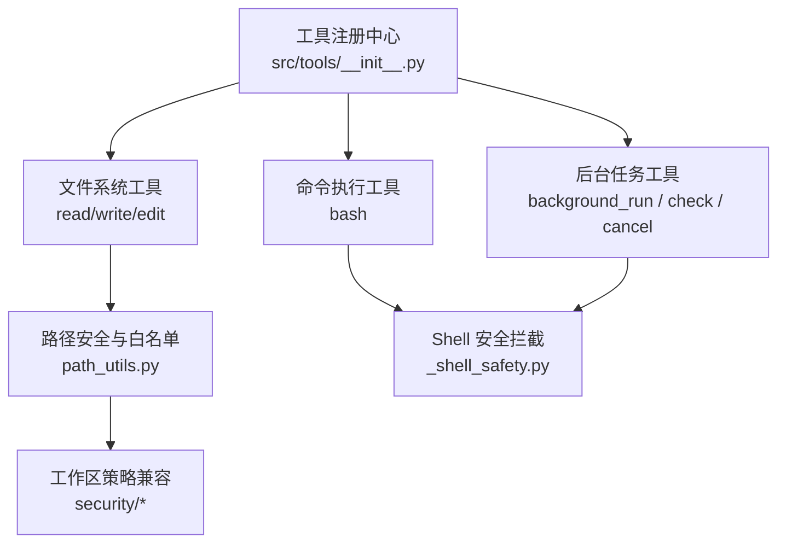
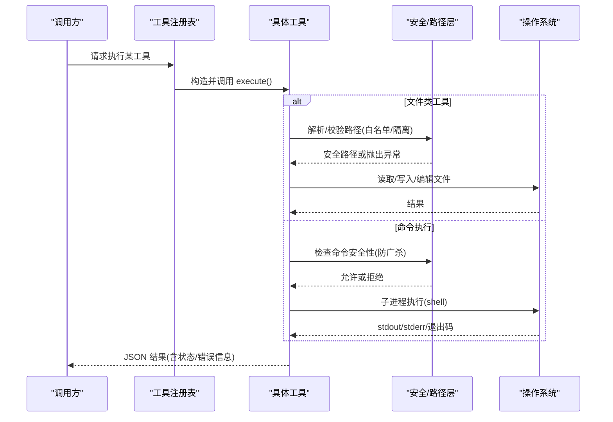
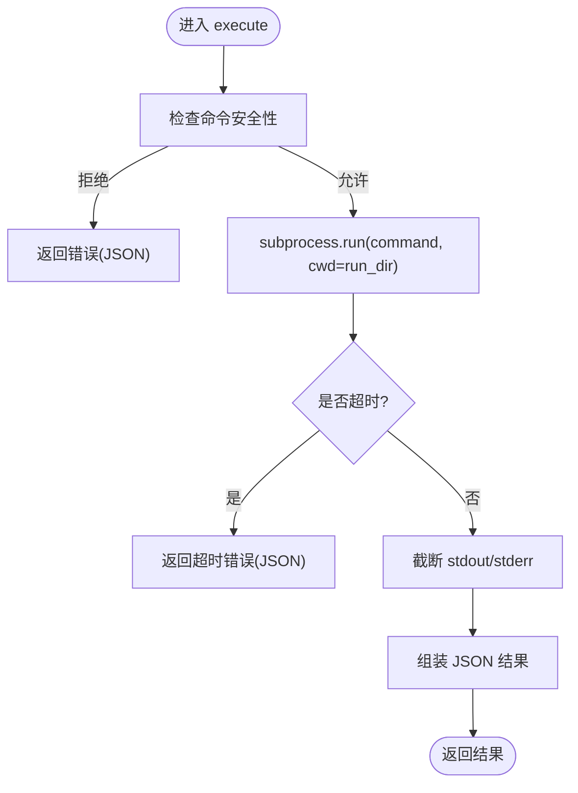
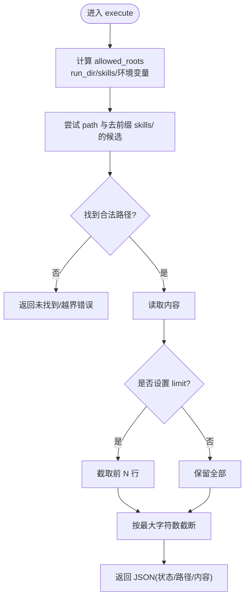
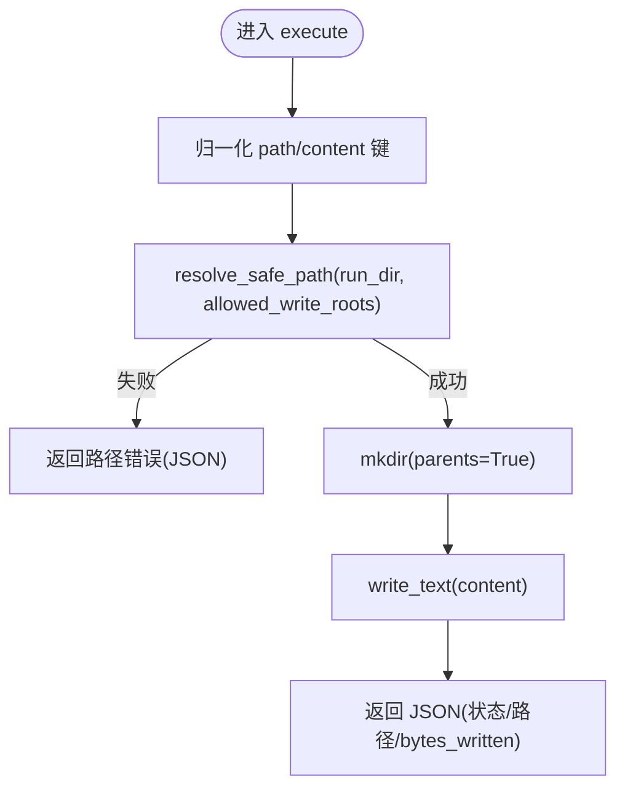
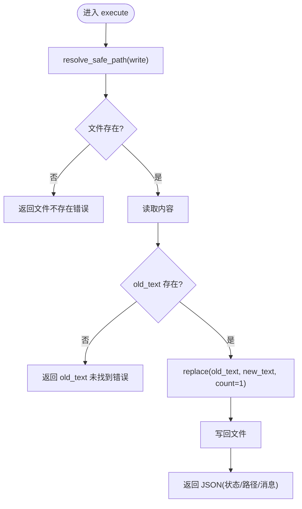
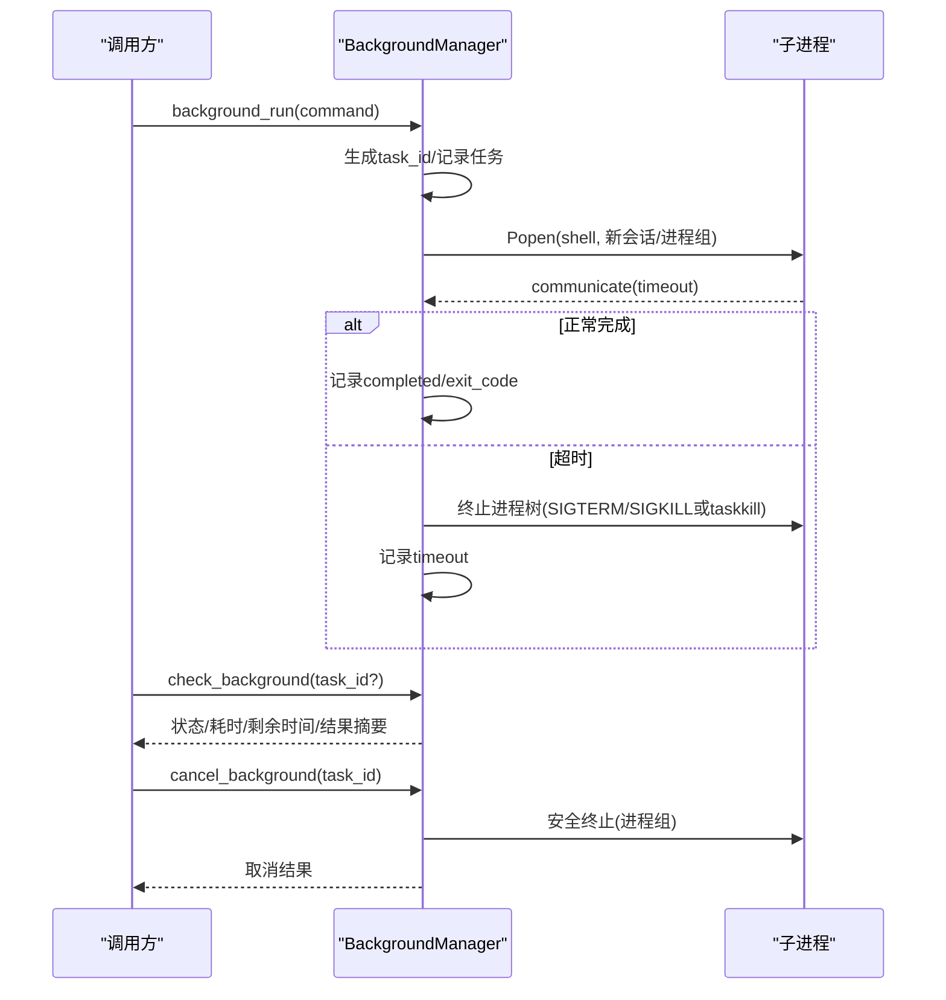
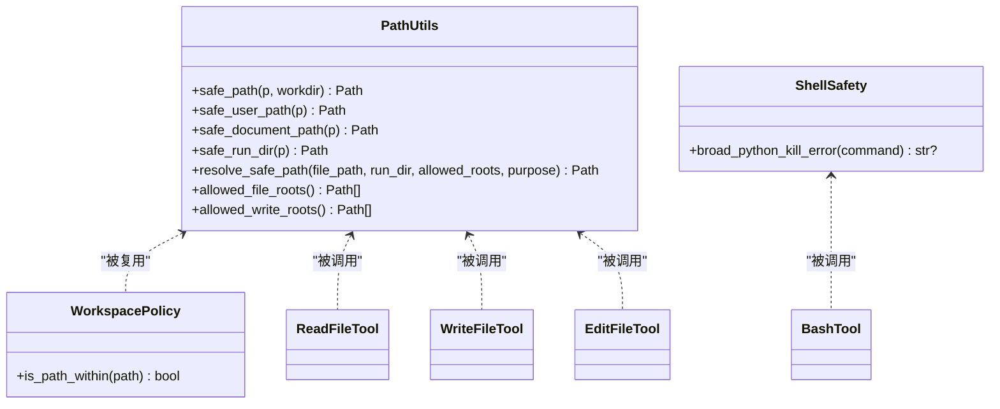
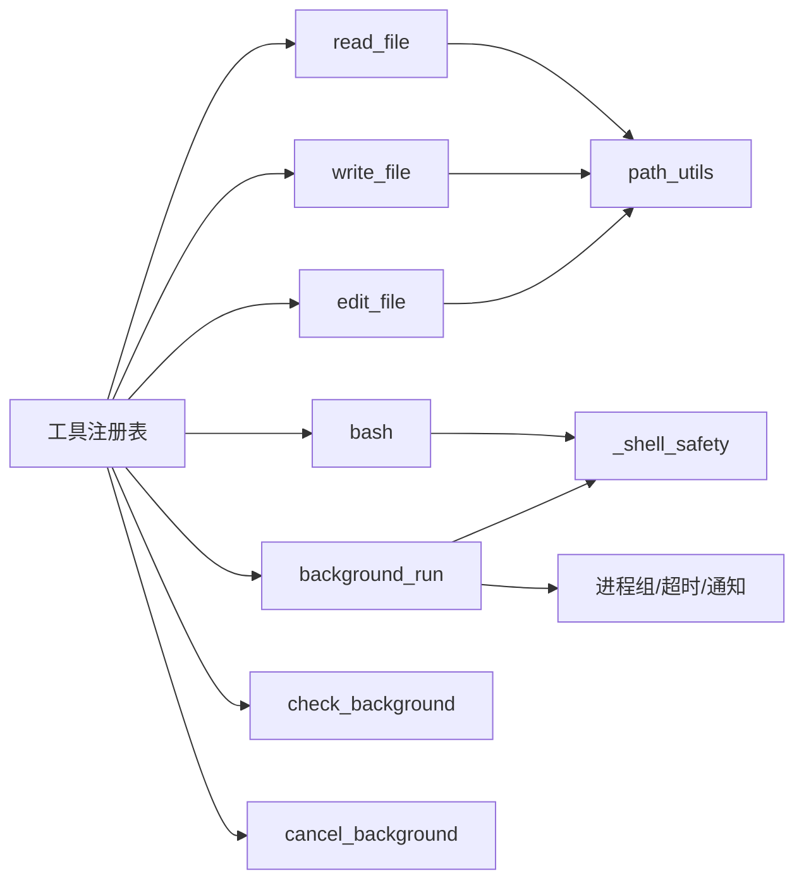

# 系统工具

<cite>
**本文引用的文件**
- [agent/src/tools/__init__.py](file://agent/src/tools/__init__.py)
- [agent/src/tools/bash_tool.py](file://agent/src/tools/bash_tool.py)
- [agent/src/tools/background_tools.py](file://agent/src/tools/background_tools.py)
- [agent/src/tools/read_file_tool.py](file://agent/src/tools/read_file_tool.py)
- [agent/src/tools/write_file_tool.py](file://agent/src/tools/write_file_tool.py)
- [agent/src/tools/edit_file_tool.py](file://agent/src/tools/edit_file_tool.py)
- [agent/src/tools/path_utils.py](file://agent/src/tools/path_utils.py)
- [agent/src/tools/_shell_safety.py](file://agent/src/tools/_shell_safety.py)
- [agent/src/security/workspace_policy.py](file://agent/src/security/workspace_policy.py)
- [agent/src/security/workspace_access.py](file://agent/src/security/workspace_access.py)
</cite>

## 目录
1. [简介](#简介)
2. [项目结构](#项目结构)
3. [核心组件](#核心组件)
4. [架构总览](#架构总览)
5. [详细组件分析](#详细组件分析)
6. [依赖关系分析](#依赖关系分析)
7. [性能考量](#性能考量)
8. [故障排查指南](#故障排查指南)
9. [结论](#结论)
10. [附录](#附录)

## 简介
本章节面向 Vibe-Trading 的“系统工具”能力，聚焦以下目标：
- 命令行执行、文件编辑与读写、后台任务管理等核心功能的使用与安全机制。
- 系统命令的安全沙箱与权限控制策略，确保 LLM 驱动的工具调用在受控范围内运行。
- 后台任务的调度机制、资源限制（超时、输出截断）与取消流程。
- 错误处理与日志记录模式，便于定位问题与审计。
- 通过系统工具扩展 Vibe-Trading 的能力边界（例如结合 MCP 工具、工作区路径白名单等）。

## 项目结构
系统工具以“工具注册表 + 具体工具实现 + 安全/路径校验”的分层组织：
- 工具注册与发现：自动扫描 src/tools 下的 BaseTool 子类并注册，支持按名称过滤、MCP 工具合并、Shell 工具开关。
- 具体工具：bash、read_file、write_file、edit_file、background_run/check_background/cancel_background。
- 安全与路径：统一的路径白名单、UNC 拒绝、run_dir 隔离、写操作根目录限制；Shell 命令的广杀 Python 进程拦截。
- 安全策略兼容：为通道适配器提供 workspace 范围检查的兼容接口。

图表来源
- [agent/src/tools/__init__.py:66-245](file://agent/src/tools/__init__.py#L66-L245)
- [agent/src/tools/read_file_tool.py:1-118](file://agent/src/tools/read_file_tool.py#L1-L118)
- [agent/src/tools/write_file_tool.py:1-107](file://agent/src/tools/write_file_tool.py#L1-L107)
- [agent/src/tools/edit_file_tool.py:1-98](file://agent/src/tools/edit_file_tool.py#L1-L98)
- [agent/src/tools/bash_tool.py:1-84](file://agent/src/tools/bash_tool.py#L1-L84)
- [agent/src/tools/background_tools.py:1-377](file://agent/src/tools/background_tools.py#L1-L377)
- [agent/src/tools/path_utils.py:1-404](file://agent/src/tools/path_utils.py#L1-L404)
- [agent/src/tools/_shell_safety.py:1-60](file://agent/src/tools/_shell_safety.py#L1-L60)
- [agent/src/security/workspace_policy.py:1-12](file://agent/src/security/workspace_policy.py#L1-L12)

章节来源
- [agent/src/tools/__init__.py:1-365](file://agent/src/tools/__init__.py#L1-L365)

## 核心组件
- 工具注册与发现
  - 自动发现 BaseTool 子类并注册，支持 include_shell_tools 开关屏蔽危险 Shell 工具。
  - 支持按工具名构建过滤后的注册表，以及 Swarm 场景下合并本地与远程 MCP 工具。
- 文件访问工具
  - read_file：只读读取，支持 skills/ 白名单与 run_dir 隔离，输出长度限制。
  - write_file：写入或覆盖，自动创建父目录，严格限制写入根目录。
  - edit_file：查找并替换首次匹配，需文件存在且 old_text 存在。
- 命令执行工具
  - bash：在 run_dir 中执行 shell 命令，限制输出大小，设置默认超时，拦截广杀 Python 进程的命令。
- 后台任务工具
  - background_run：启动后台进程组，返回 task_id，带超时与通知队列。
  - check_background：查询任务状态、剩余时间、耗时等。
  - cancel_background：基于进程组安全终止任务。

章节来源
- [agent/src/tools/__init__.py:66-245](file://agent/src/tools/__init__.py#L66-L245)
- [agent/src/tools/read_file_tool.py:1-118](file://agent/src/tools/read_file_tool.py#L1-L118)
- [agent/src/tools/write_file_tool.py:1-107](file://agent/src/tools/write_file_tool.py#L1-L107)
- [agent/src/tools/edit_file_tool.py:1-98](file://agent/src/tools/edit_file_tool.py#L1-L98)
- [agent/src/tools/bash_tool.py:1-84](file://agent/src/tools/bash_tool.py#L1-L84)
- [agent/src/tools/background_tools.py:1-377](file://agent/src/tools/background_tools.py#L1-L377)

## 架构总览
系统工具围绕“工具注册表”组织，所有工具继承自 BaseTool，具备统一的参数描述、可重复性标记与只读标记。注册阶段根据配置决定是否启用 Shell 工具、是否注入会话 ID、是否附加 MCP 工具。文件与命令执行均通过安全层进行约束，后台任务通过进程组管理实现可控的生命周期。

图表来源
- [agent/src/tools/__init__.py:66-245](file://agent/src/tools/__init__.py#L66-L245)
- [agent/src/tools/read_file_tool.py:33-118](file://agent/src/tools/read_file_tool.py#L33-L118)
- [agent/src/tools/write_file_tool.py:30-107](file://agent/src/tools/write_file_tool.py#L30-L107)
- [agent/src/tools/edit_file_tool.py:31-98](file://agent/src/tools/edit_file_tool.py#L31-L98)
- [agent/src/tools/bash_tool.py:36-84](file://agent/src/tools/bash_tool.py#L36-L84)
- [agent/src/tools/path_utils.py:185-240](file://agent/src/tools/path_utils.py#L185-L240)
- [agent/src/tools/_shell_safety.py:38-60](file://agent/src/tools/_shell_safety.py#L38-L60)

## 详细组件分析

### Bash 工具（命令行执行）
- 功能要点
  - 在 run_dir 中执行 shell 命令，Windows 使用 cmd.exe。
  - 输出限制与默认超时，避免大输出与长时间占用。
  - 安全拦截：禁止通过 taskkill/pkill/killall 等按名称广杀 Python 进程。
- 关键流程
  - 参数校验 -> 安全检查 -> 子进程执行 -> 输出截断 -> 返回 JSON 结果。
- 错误处理
  - 超时、异常、非零退出码均以 JSON 形式返回，包含错误消息。

图表来源
- [agent/src/tools/bash_tool.py:36-84](file://agent/src/tools/bash_tool.py#L36-L84)
- [agent/src/tools/_shell_safety.py:38-60](file://agent/src/tools/_shell_safety.py#L38-L60)

章节来源
- [agent/src/tools/bash_tool.py:1-84](file://agent/src/tools/bash_tool.py#L1-L84)
- [agent/src/tools/_shell_safety.py:1-60](file://agent/src/tools/_shell_safety.py#L1-L60)

### 文件读取工具（read_file）
- 功能要点
  - 支持从 run_dir 或 skills/ 目录读取文件，额外允许通过环境变量配置的只读根目录。
  - 支持 limit 参数限制行数，输出最大字符数限制。
  - 路径必须落在允许的根目录下，否则拒绝。
- 关键流程
  - 计算 allowed_roots -> 尝试多候选路径 -> 读取并截断 -> 返回 JSON。

图表来源
- [agent/src/tools/read_file_tool.py:33-118](file://agent/src/tools/read_file_tool.py#L33-L118)
- [agent/src/tools/path_utils.py:137-144](file://agent/src/tools/path_utils.py#L137-L144)

章节来源
- [agent/src/tools/read_file_tool.py:1-118](file://agent/src/tools/read_file_tool.py#L1-L118)
- [agent/src/tools/path_utils.py:1-404](file://agent/src/tools/path_utils.py#L1-L404)

### 文件写入工具（write_file）
- 功能要点
  - 接受多种别名键（path/file_path/filename 等），提高兼容性。
  - 写入前解析安全路径，仅允许写入到白名单根目录。
  - 自动创建父目录，返回写入字节数。
- 关键流程
  - 参数归一化 -> 安全路径解析 -> 写入 -> 返回 JSON。

图表来源
- [agent/src/tools/write_file_tool.py:30-107](file://agent/src/tools/write_file_tool.py#L30-L107)
- [agent/src/tools/path_utils.py:150-182](file://agent/src/tools/path_utils.py#L150-L182)
- [agent/src/tools/path_utils.py:185-240](file://agent/src/tools/path_utils.py#L185-L240)

章节来源
- [agent/src/tools/write_file_tool.py:1-107](file://agent/src/tools/write_file_tool.py#L1-L107)
- [agent/src/tools/path_utils.py:1-404](file://agent/src/tools/path_utils.py#L1-L404)

### 文件编辑工具（edit_file）
- 功能要点
  - 在文件中查找并替换第一次出现的 old_text。
  - 需要文件存在且 old_text 存在于内容中。
  - 同样受限于 allowed_write_roots。
- 关键流程
  - 安全路径解析 -> 读取 -> 替换 -> 写回 -> 返回 JSON。

图表来源
- [agent/src/tools/edit_file_tool.py:31-98](file://agent/src/tools/edit_file_tool.py#L31-L98)
- [agent/src/tools/path_utils.py:150-182](file://agent/src/tools/path_utils.py#L150-L182)

章节来源
- [agent/src/tools/edit_file_tool.py:1-98](file://agent/src/tools/edit_file_tool.py#L1-L98)
- [agent/src/tools/path_utils.py:1-404](file://agent/src/tools/path_utils.py#L1-L404)

### 后台任务管理（background_run / check_background / cancel_background）
- 功能要点
  - 通过进程组启动命令，跨平台安全终止（POSIX killpg，Windows taskkill /T）。
  - 统一超时（默认 300 秒）、输出合并与截断、通知队列。
  - 取消流程：先置取消标志，再发送信号，必要时 SIGKILL 清理孤儿进程。
- 关键流程
  - 启动：生成 task_id -> 记录任务 -> 线程执行 -> communicate 等待或超时。
  - 查询：返回任务摘要或单个任务详情（含剩余超时）。
  - 取消：幂等保护，防止重复取消或取消已完成任务。

图表来源
- [agent/src/tools/background_tools.py:24-96](file://agent/src/tools/background_tools.py#L24-L96)
- [agent/src/tools/background_tools.py:102-319](file://agent/src/tools/background_tools.py#L102-L319)
- [agent/src/tools/background_tools.py:322-377](file://agent/src/tools/background_tools.py#L322-L377)

章节来源
- [agent/src/tools/background_tools.py:1-377](file://agent/src/tools/background_tools.py#L1-L377)

### 安全沙箱与权限控制
- 路径安全
  - 拒绝 UNC 路径，强制路径落在允许的根目录内。
  - 读：allowed_file_roots（默认 uploads/runs/data/home/.vibe-trading 等，可环境变量扩展）。
  - 写：allowed_write_roots（默认 uploads/runs/home/.vibe-trading 等，可环境变量扩展）。
  - run_dir：safe_run_dir 校验生成的代码运行目录必须在 allowed run roots 内。
- Shell 安全
  - 拦截通过 taskkill/pkill/killall/PowerShell 按名称广杀 Python 进程的命令，防止误杀宿主进程。
- 工作区策略兼容
  - 提供 is_path_within 兼容接口，供通道适配器复用。

图表来源
- [agent/src/tools/path_utils.py:46-74](file://agent/src/tools/path_utils.py#L46-L74)
- [agent/src/tools/path_utils.py:137-182](file://agent/src/tools/path_utils.py#L137-L182)
- [agent/src/tools/path_utils.py:185-240](file://agent/src/tools/path_utils.py#L185-L240)
- [agent/src/tools/path_utils.py:243-369](file://agent/src/tools/path_utils.py#L243-L369)
- [agent/src/tools/_shell_safety.py:38-60](file://agent/src/tools/_shell_safety.py#L38-L60)
- [agent/src/security/workspace_policy.py:1-12](file://agent/src/security/workspace_policy.py#L1-L12)

章节来源
- [agent/src/tools/path_utils.py:1-404](file://agent/src/tools/path_utils.py#L1-L404)
- [agent/src/tools/_shell_safety.py:1-60](file://agent/src/tools/_shell_safety.py#L1-L60)
- [agent/src/security/workspace_policy.py:1-12](file://agent/src/security/workspace_policy.py#L1-L12)
- [agent/src/security/workspace_access.py:1-15](file://agent/src/security/workspace_access.py#L1-L15)

## 依赖关系分析
- 工具注册表依赖
  - 自动发现 BaseTool 子类，支持 include_shell_tools 开关。
  - 可选注入 PersistentMemory、session_id、event_callback。
  - 可选合并 MCP 工具，并对 live broker 做授权门控。
- 工具间耦合
  - 文件工具共享 path_utils 的安全策略。
  - 命令与后台任务共享 _shell_safety 的广杀拦截。
  - 后台任务内部使用线程与进程组管理生命周期。

图表来源
- [agent/src/tools/__init__.py:66-245](file://agent/src/tools/__init__.py#L66-L245)
- [agent/src/tools/read_file_tool.py:1-118](file://agent/src/tools/read_file_tool.py#L1-L118)
- [agent/src/tools/write_file_tool.py:1-107](file://agent/src/tools/write_file_tool.py#L1-L107)
- [agent/src/tools/edit_file_tool.py:1-98](file://agent/src/tools/edit_file_tool.py#L1-L98)
- [agent/src/tools/bash_tool.py:1-84](file://agent/src/tools/bash_tool.py#L1-L84)
- [agent/src/tools/background_tools.py:1-377](file://agent/src/tools/background_tools.py#L1-L377)
- [agent/src/tools/path_utils.py:1-404](file://agent/src/tools/path_utils.py#L1-L404)
- [agent/src/tools/_shell_safety.py:1-60](file://agent/src/tools/_shell_safety.py#L1-L60)

章节来源
- [agent/src/tools/__init__.py:1-365](file://agent/src/tools/__init__.py#L1-L365)

## 性能考量
- 输出限制
  - bash 与 read_file 对 stdout/stderr 或文件内容设置最大字符数限制，避免内存膨胀。
- 超时控制
  - bash 默认超时；background_run 默认 300 秒超时，并在超时时安全终止进程树。
- I/O 优化
  - 文件写入自动创建父目录，减少多次系统调用开销。
  - 后台任务将 stdout 与 stderr 合并后截断，降低传输与存储成本。
- 并发与锁
  - BackgroundManager 使用线程与锁保护任务字典与通知队列，保证并发安全。

[本节为通用性能建议，不直接分析具体文件]

## 故障排查指南
- 常见错误与定位
  - 路径越界：read/write/edit 报错提示路径逃逸工作区或不在允许根目录。检查 run_dir 与 allowed_*_roots 配置。
  - 文件不存在：edit_file 要求文件存在且 old_text 存在；read_file 找不到文件或路径非法。
  - 命令被拒：bash 检测到广杀 Python 进程命令将被拒绝，改用 cancel_background 停止任务。
  - 后台任务超时：check_background 显示剩余时间与超时原因；必要时调用 cancel_background。
- 日志与诊断
  - 工具注册阶段会记录不可用或失败的模块导入与工具注册警告。
  - 后台任务完成后会产出通知条目，可通过 drain_notifications 获取最近通知。
- 调试建议
  - 逐步缩小 run_dir 与 allowed roots，确认路径解析是否符合预期。
  - 对复杂命令先在本地 shell 验证，再放入工具调用。
  - 关注 JSON 返回中的 status、error、exit_code 字段，快速定位问题类型。

章节来源
- [agent/src/tools/__init__.py:136-153](file://agent/src/tools/__init__.py#L136-L153)
- [agent/src/tools/background_tools.py:141-204](file://agent/src/tools/background_tools.py#L141-L204)
- [agent/src/tools/background_tools.py:258-311](file://agent/src/tools/background_tools.py#L258-L311)

## 结论
Vibe-Trading 的系统工具通过严格的沙箱与权限控制，为 LLM 驱动的自动化提供了安全的执行环境：
- 文件操作限定在工作区与白名单根目录，避免任意路径写入风险。
- 命令执行具备超时与输出限制，并拦截危险的广杀 Python 进程命令。
- 后台任务提供进程组级别的生命周期管理与安全终止，保障资源回收。
- 工具注册表支持按需启用 Shell 工具与合并 MCP 工具，灵活扩展能力边界。
建议在生产环境中：
- 明确配置 allowed_*_roots，最小化暴露面。
- 谨慎启用 include_shell_tools，仅在可信 CLI 场景开启。
- 使用 cancel_background 而非外部命令终止任务，确保进程组完整回收。

[本节为总结性内容，不直接分析具体文件]

## 附录
- 使用示例（以路径引用代替代码片段）
  - 执行命令：参考 [agent/src/tools/bash_tool.py:36-84](file://agent/src/tools/bash_tool.py#L36-L84)
  - 读取文件：参考 [agent/src/tools/read_file_tool.py:33-118](file://agent/src/tools/read_file_tool.py#L33-L118)
  - 写入文件：参考 [agent/src/tools/write_file_tool.py:30-107](file://agent/src/tools/write_file_tool.py#L30-L107)
  - 编辑文件：参考 [agent/src/tools/edit_file_tool.py:31-98](file://agent/src/tools/edit_file_tool.py#L31-L98)
  - 后台任务：参考 [agent/src/tools/background_tools.py:110-139](file://agent/src/tools/background_tools.py#L110-L139)、[agent/src/tools/background_tools.py:322-377](file://agent/src/tools/background_tools.py#L322-L377)
  - 路径白名单：参考 [agent/src/tools/path_utils.py:137-182](file://agent/src/tools/path_utils.py#L137-L182)、[agent/src/tools/path_utils.py:185-240](file://agent/src/tools/path_utils.py#L185-L240)
  - Shell 安全：参考 [agent/src/tools/_shell_safety.py:38-60](file://agent/src/tools/_shell_safety.py#L38-L60)
- 扩展建议
  - 新增工具：在 src/tools 下新建 BaseTool 子类，自动被发现与注册。
  - 接入 MCP：通过 agent_config.mcp_servers 配置远程工具，注册表会自动合并。
  - 调整沙箱：通过环境变量配置 allowed_*_roots，精确控制可访问路径。

[本节为补充说明，不直接分析具体文件]