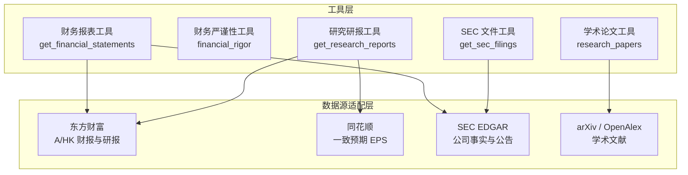
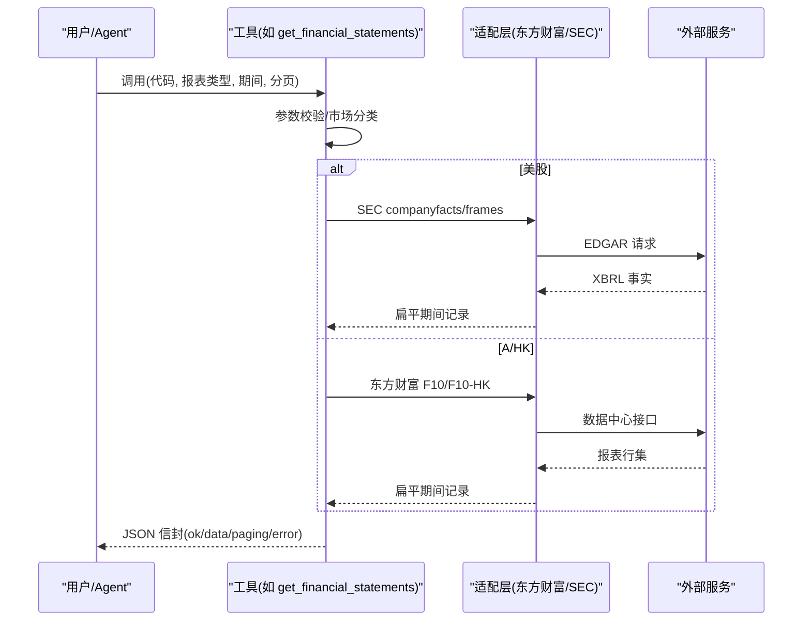
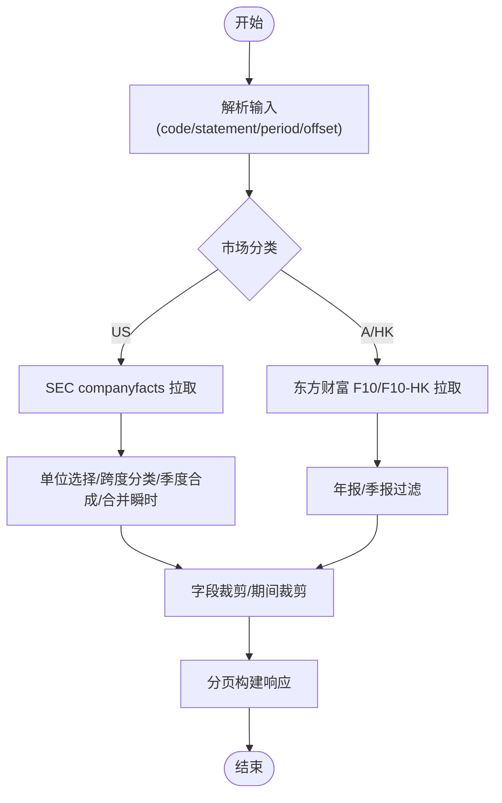
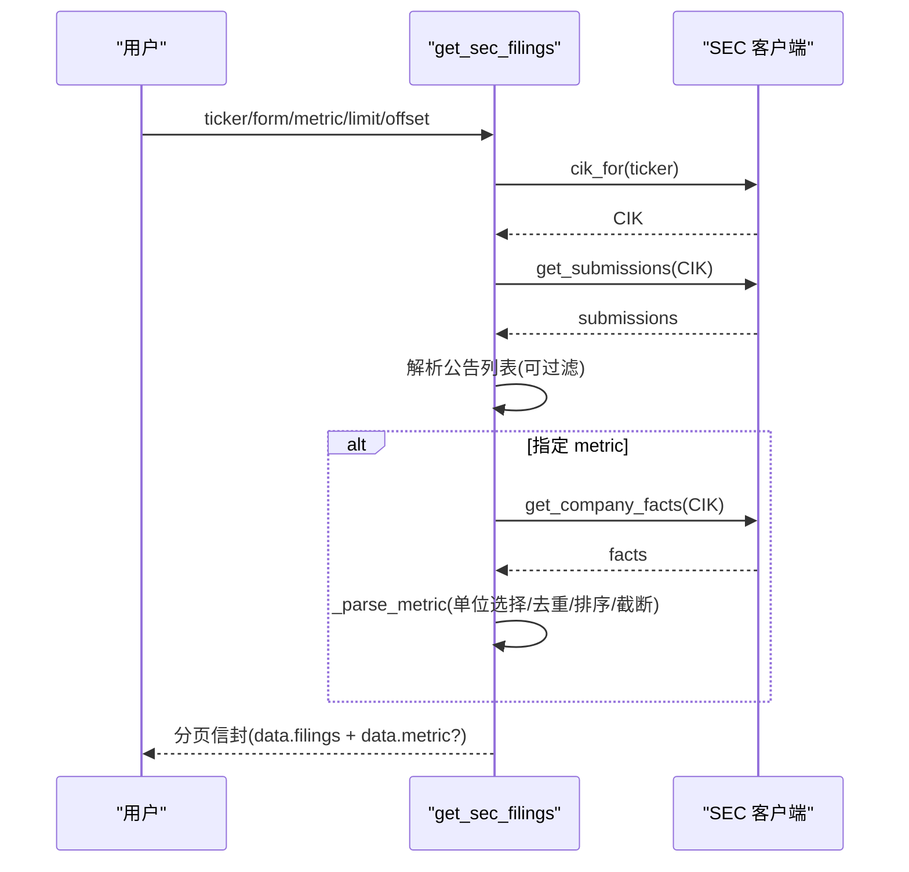
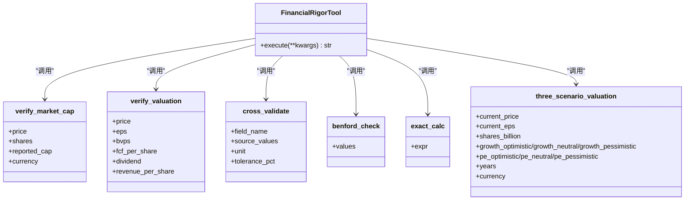
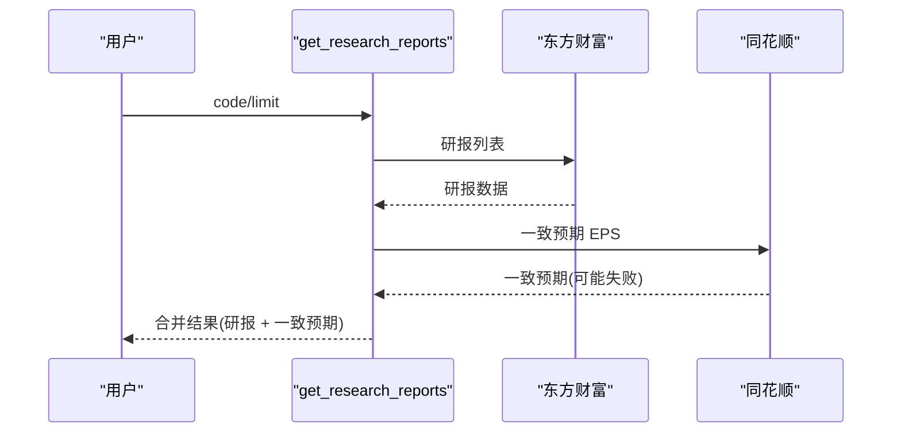
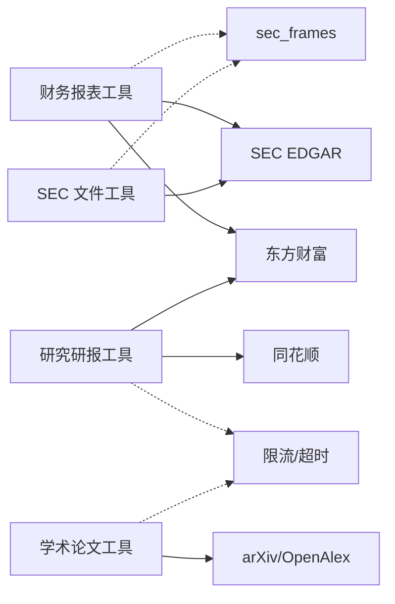

# 财务报表工具

<cite>
**本文引用的文件**
- [financial_statements_tool.py](file://agent/src/tools/financial_statements_tool.py)
- [financial_rigor_tool.py](file://agent/src/tools/financial_rigor_tool.py)
- [sec_filings_tool.py](file://agent/src/tools/sec_filings_tool.py)
- [research_reports_tool.py](file://agent/src/tools/research_reports_tool.py)
- [research_papers_tool.py](file://agent/src/tools/research_papers_tool.py)
- [fundamentals_loader.py](file://agent/backtest/loaders/fundamentals_loader.py)
</cite>

## 目录
1. [简介](#简介)
2. [项目结构](#项目结构)
3. [核心组件](#核心组件)
4. [架构总览](#架构总览)
5. [详细组件分析](#详细组件分析)
6. [依赖关系分析](#依赖关系分析)
7. [性能与可扩展性](#性能与可扩展性)
8. [故障排查指南](#故障排查指南)
9. [结论](#结论)
10. [附录：使用示例与最佳实践](#附录使用示例与最佳实践)

## 简介
本文件为 Vibe-Trading 财务报表工具的权威技术文档，覆盖以下能力：
- 财务报表提取：支持 A 股（SH/SZ/BJ）、美股（US）和港股（HK）的三大报表及关键指标读取。
- SEC 文件解析：获取美国 SEC EDGAR 近期公告列表，并可抽取单一 XBRL us-gaap 概念的时间序列。
- 研究研报分析：聚合 A 股卖方研报列表与同花顺一致预期 EPS。
- 财务严谨性检查：基于精确十进制算术进行市值校验、估值比率计算、多源交叉验证、本福特定律造假检测、安全表达式计算和三情景目标价测算。
- 数据适配与异常处理：统一封装各数据源差异，提供分页、限流、容错降级与上下文安全裁剪。
- 深度基本面分析：将上述工具组合，完成从数据到指标再到判断的闭环。

## 项目结构
围绕财务报表的核心代码位于 agent/src/tools 下，按“工具”维度组织；SEC 基础能力由 backtest.loaders 提供通用客户端与框架；A/HK 财报通过东方财富数据中心接口获取；美股财报通过 SEC EDGAR companyfacts 获取；研究研报通过东方财富报告 API 与同花顺一致预期接口拼接。

图表来源
- [financial_statements_tool.py:1-23](file://agent/src/tools/financial_statements_tool.py#L1-L23)
- [sec_filings_tool.py:1-18](file://agent/src/tools/sec_filings_tool.py#L1-L18)
- [research_reports_tool.py:1-20](file://agent/src/tools/research_reports_tool.py#L1-L20)
- [research_papers_tool.py:1-63](file://agent/src/tools/research_papers_tool.py#L1-L63)

章节来源
- [financial_statements_tool.py:1-23](file://agent/src/tools/financial_statements_tool.py#L1-L23)
- [sec_filings_tool.py:1-18](file://agent/src/tools/sec_filings_tool.py#L1-L18)
- [research_reports_tool.py:1-20](file://agent/src/tools/research_reports_tool.py#L1-L20)
- [research_papers_tool.py:1-63](file://agent/src/tools/research_papers_tool.py#L1-L63)

## 核心组件
- 财务报表工具：统一读取 A/HK 东方财富与美股 SEC EDGAR 的三大报表与关键指标，返回最新优先的扁平化期间记录，支持分页与字段裁剪以保护 LLM 上下文。
- SEC 文件工具：获取美国公司近期公告（10-K/10-Q/8-K 等），并可选抽取单一 us-gaap 概念时间序列，内置去重、单位选择与跨度分类。
- 财务严谨性工具：纯函数式校验与计算，涵盖市值校验、估值比率、多源一致性、本福特定律、安全算式、三情景目标价。
- 研究研报工具：聚合东方财富卖方研报与同花顺一致预期 EPS，失败降级不阻塞主流程。
- 学术论文工具：检索 arXiv/OpenAlex 论文，结构化提取能力、市场、样本期与业绩声明，并给出因子落地建议。

章节来源
- [financial_statements_tool.py:589-726](file://agent/src/tools/financial_statements_tool.py#L589-L726)
- [sec_filings_tool.py:43-173](file://agent/src/tools/sec_filings_tool.py#L43-L173)
- [financial_rigor_tool.py:442-590](file://agent/src/tools/financial_rigor_tool.py#L442-L590)
- [research_reports_tool.py:57-152](file://agent/src/tools/research_reports_tool.py#L57-L152)
- [research_papers_tool.py:1-63](file://agent/src/tools/research_papers_tool.py#L1-L63)

## 架构总览
整体采用“工具 + 适配层”的分层设计：
- 工具层暴露统一的 BaseTool 契约，参数校验、错误包装、分页与限流策略一致。
- 适配层屏蔽不同数据源的协议差异（东方财富 JSON、SEC EDGAR XBRL、同花顺 HTTP）。
- 数据在工具内被规范化为扁平期间记录或结构化对象，便于后续分析与可视化。

图表来源
- [financial_statements_tool.py:589-726](file://agent/src/tools/financial_statements_tool.py#L589-L726)
- [sec_filings_tool.py:102-173](file://agent/src/tools/sec_filings_tool.py#L102-L173)
- [research_reports_tool.py:91-152](file://agent/src/tools/research_reports_tool.py#L91-L152)

## 详细组件分析

### 财务报表工具（三大报表与指标）
- 支持市场：A 股（SH/SZ/BJ）、美股（US）、港股（HK）。
- 支持报表：资产负债表、利润表、现金流量表、关键指标。
- 数据源：
  - A/HK：东方财富数据中心报告接口，按市场组映射报表名，客户端侧按年报/季报过滤。
  - US：SEC EDGAR companyfacts，按 us-gaap 概念集合抽取，季度合成 Q4，合并瞬时与期间值。
- 质量保障：
  - 字段裁剪：单期间最多保留固定数量字段，避免上下文溢出。
  - 期间裁剪：限制历史条数，分页读取完整期间。
  - 单位选择：XBRL 多单位时取行数最多的单位桶。
  - 期间分类：基于起止日计算跨度，区分年度/季度/年初至今/瞬时。
  - 季度合成：当仅年报有 FY 而季报缺 Q4 时，用 FY-(Q1+Q2+Q3) 推导并标注 DERIVED。
- 错误处理：网络异常、符号不可解析、非支持后缀均返回 ok=false 的错误信封，不抛异常。

图表来源
- [financial_statements_tool.py:158-247](file://agent/src/tools/financial_statements_tool.py#L158-L247)
- [financial_statements_tool.py:302-490](file://agent/src/tools/financial_statements_tool.py#L302-L490)
- [financial_statements_tool.py:570-726](file://agent/src/tools/financial_statements_tool.py#L570-L726)

章节来源
- [financial_statements_tool.py:1-23](file://agent/src/tools/financial_statements_tool.py#L1-L23)
- [financial_statements_tool.py:158-247](file://agent/src/tools/financial_statements_tool.py#L158-L247)
- [financial_statements_tool.py:302-490](file://agent/src/tools/financial_statements_tool.py#L302-L490)
- [financial_statements_tool.py:570-726](file://agent/src/tools/financial_statements_tool.py#L570-L726)

### SEC 文件工具（公告列表与 XBRL 指标序列）
- 功能：
  - 获取近期公告（可过滤 form 类型），包含 accession、filing/report 日期与主文档 URL。
  - 可选抽取单一 us-gaap 概念的时间序列，自动选择最丰富单位、去重、排序与截断。
- 数据处理：
  - 最近公告块解析，构造标准化行。
  - 指标点归一化：end/start/period_days/period_type/filed/fiscal_year/form/accession/frame。
  - 去重策略：同一 (start,end) 跨度保留最新 filed 版本。
- 错误处理：ticker 查找失败、submissions/companyfacts 请求失败均返回错误信封。

图表来源
- [sec_filings_tool.py:102-173](file://agent/src/tools/sec_filings_tool.py#L102-L173)
- [sec_filings_tool.py:185-235](file://agent/src/tools/sec_filings_tool.py#L185-L235)
- [sec_filings_tool.py:267-320](file://agent/src/tools/sec_filings_tool.py#L267-L320)

章节来源
- [sec_filings_tool.py:1-18](file://agent/src/tools/sec_filings_tool.py#L1-L18)
- [sec_filings_tool.py:102-173](file://agent/src/tools/sec_filings_tool.py#L102-L173)
- [sec_filings_tool.py:185-235](file://agent/src/tools/sec_filings_tool.py#L185-L235)
- [sec_filings_tool.py:267-320](file://agent/src/tools/sec_filings_tool.py#L267-L320)

### 财务严谨性工具（精确十进制校验与分析）
- 子命令：
  - verify_market_cap：价格×股本 vs 已报市值，阈值 1%/5% 判定 pass/warn/fail。
  - verify_valuation：PE/PB/ROE/P-FCF/FCF 收益率/股息率/PS 等比率计算。
  - cross_validate：多源字段对比，以中位数为基准，标记偏差超阈值的来源。
  - benford：本福特定律首数字分布检验，需≥50 样本，输出 MAD/卡方/合规等级。
  - calc：AST 白名单算术表达式求值，杜绝 eval 风险。
  - three_scenario：基于 EPS 增长与目标 PE 的牛/基/熊三情景目标价。
- 数值安全：全局 Decimal 上下文（精度 28，四舍五入规则），避免浮点漂移。
- 错误处理：参数缺失/非法表达式/未知命令均返回 status="error" 信封。

图表来源
- [financial_rigor_tool.py:143-230](file://agent/src/tools/financial_rigor_tool.py#L143-L230)
- [financial_rigor_tool.py:233-345](file://agent/src/tools/financial_rigor_tool.py#L233-L345)
- [financial_rigor_tool.py:348-439](file://agent/src/tools/financial_rigor_tool.py#L348-L439)
- [financial_rigor_tool.py:442-590](file://agent/src/tools/financial_rigor_tool.py#L442-L590)

章节来源
- [financial_rigor_tool.py:1-27](file://agent/src/tools/financial_rigor_tool.py#L1-L27)
- [financial_rigor_tool.py:143-230](file://agent/src/tools/financial_rigor_tool.py#L143-L230)
- [financial_rigor_tool.py:233-345](file://agent/src/tools/financial_rigor_tool.py#L233-L345)
- [financial_rigor_tool.py:348-439](file://agent/src/tools/financial_rigor_tool.py#L348-L439)
- [financial_rigor_tool.py:442-590](file://agent/src/tools/financial_rigor_tool.py#L442-L590)

### 研究研报工具（卖方研报与一致预期）
- 数据源：
  - 东方财富报告 API：个股研报列表（标题、券商、分析师、发布日期、评级、EPS/PE 预测）。
  - 同花顺一致预期：前瞻财年均值 EPS 预测（best-effort，失败不影响主流程）。
- 处理逻辑：
  - 校验 A 股后缀与 secid 解析。
  - 研报解析：清洗文本/日期/数字，构造标准化记录。
  - 一致预期解析：兼容多种字段别名，空结果降级为空列表。
- 错误处理：网络/解析异常返回错误信封或降级为空。

图表来源
- [research_reports_tool.py:91-152](file://agent/src/tools/research_reports_tool.py#L91-L152)
- [research_reports_tool.py:169-227](file://agent/src/tools/research_reports_tool.py#L169-L227)
- [research_reports_tool.py:229-293](file://agent/src/tools/research_reports_tool.py#L229-L293)

章节来源
- [research_reports_tool.py:1-20](file://agent/src/tools/research_reports_tool.py#L1-L20)
- [research_reports_tool.py:91-152](file://agent/src/tools/research_reports_tool.py#L91-L152)
- [research_reports_tool.py:169-227](file://agent/src/tools/research_reports_tool.py#L169-L227)
- [research_reports_tool.py:229-293](file://agent/src/tools/research_reports_tool.py#L229-L293)

### 学术论文工具（因子研究与落地衔接）
- 数据源：arXiv 预印本与 OpenAlex 已发表论文。
- 能力：
  - 搜索/阅读模式，限制结果与摘要长度，批量 ID 读取。
  - 结构化提取：能力需求、市场范围、样本期、业绩声明（带证据引用）。
  - 因子落地建议：引导至 alpha-zoo/factor-research 技能进行复现与评估。
- 约束：所有提取值必须锚定原文句子，未声明则明确标注“未声明”。

章节来源
- [research_papers_tool.py:1-63](file://agent/src/tools/research_papers_tool.py#L1-L63)
- [research_papers_tool.py:157-220](file://agent/src/tools/research_papers_tool.py#L157-L220)
- [research_papers_tool.py:284-413](file://agent/src/tools/research_papers_tool.py#L284-L413)
- [research_papers_tool.py:651-798](file://agent/src/tools/research_papers_tool.py#L651-L798)

## 依赖关系分析
- 工具间解耦：每个工具独立实现 BaseTool 契约，互不直接依赖，便于替换与扩展。
- 数据源适配：
  - 东方财富：用于 A/HK 财报与研报。
  - SEC EDGAR：用于美股财报与公告。
  - 同花顺：用于一致预期 EPS。
  - arXiv/OpenAlex：用于学术文献。
- 共享基础设施：
  - 分页与限流：fit_records、throttled_get、resolve_min_interval。
  - 框架与单位：sec_frames 用于 XBRL 跨度分类与键生成。
  - 安全与上下文：字段裁剪、最大记录数限制，防止 LLM 上下文溢出。

图表来源
- [financial_statements_tool.py:31-36](file://agent/src/tools/financial_statements_tool.py#L31-L36)
- [sec_filings_tool.py:25-32](file://agent/src/tools/sec_filings_tool.py#L25-L32)
- [research_reports_tool.py:28-34](file://agent/src/tools/research_reports_tool.py#L28-L34)
- [research_papers_tool.py:73-103](file://agent/src/tools/research_papers_tool.py#L73-L103)

章节来源
- [financial_statements_tool.py:31-36](file://agent/src/tools/financial_statements_tool.py#L31-L36)
- [sec_filings_tool.py:25-32](file://agent/src/tools/sec_filings_tool.py#L25-L32)
- [research_reports_tool.py:28-34](file://agent/src/tools/research_reports_tool.py#L28-L34)
- [research_papers_tool.py:73-103](file://agent/src/tools/research_papers_tool.py#L73-L103)

## 性能与可扩展性
- 上下文安全：
  - 单期间字段上限、历史期间上限、研报/论文摘要长度限制，避免大响应导致模型上下文溢出。
- 分页与限流：
  - fit_records 分页返回完整期间，避免字符截断造成数据丢失。
  - 各外部服务通过 host_key 与最小间隔控制请求频率，降低被封禁风险。
- 可扩展性：
  - 新增市场/数据源：在财务报表工具中增加市场分类与适配函数；在研报工具中增加新数据源并做降级处理。
  - 新增指标：在 SEC 工具中扩展 us-gaap 概念集合；在财务严谨性工具中新增子命令。

[本节为通用指导，无需具体文件引用]

## 故障排查指南
- 常见错误与定位：
  - 符号不可解析：A/HK 财报工具返回“unresolvable symbol”，检查 code 后缀与 secid 解析。
  - SEC ticker 查找失败：确认 ticker 存在于 SEC 公司表，或改用其他美股标识。
  - 网络异常：东方财富/SEC/同花顺/arXiv 请求失败会返回错误信封或降级为空，检查网络与限流配置。
  - 参数非法：财务严谨性工具对必填字段与表达式进行严格校验，根据 error 信息修正。
- 调试建议：
  - 先调用小 limit/offset=0 验证数据可用性。
  - 对 SEC 指标序列，关注 period_type 与 start/end 是否合理，避免 YTD 误读为季度。
  - 对研报与一致预期，分别查看 reports 与 consensus_eps 是否为空，定位具体数据源问题。

章节来源
- [financial_statements_tool.py:114-124](file://agent/src/tools/financial_statements_tool.py#L114-L124)
- [financial_statements_tool.py:249-290](file://agent/src/tools/financial_statements_tool.py#L249-L290)
- [sec_filings_tool.py:118-141](file://agent/src/tools/sec_filings_tool.py#L118-L141)
- [research_reports_tool.py:104-138](file://agent/src/tools/research_reports_tool.py#L104-L138)
- [financial_rigor_tool.py:518-590](file://agent/src/tools/financial_rigor_tool.py#L518-L590)

## 结论
Vibe-Trading 财务报表工具通过统一工具契约与多源适配，实现了跨市场的三大报表读取、SEC 公告与 XBRL 指标抽取、A 股研报与一致预期聚合，以及严格的财务校验与分析。其设计强调上下文安全、分页与限流、健壮的错误处理与降级策略，适合与 Agent 工作流组合进行深度基本面分析与合规性检查。

[本节为总结性内容，无需具体文件引用]

## 附录：使用示例与最佳实践
- 读取三大报表（A 股/美股/港股）：
  - 调用 get_financial_statements，指定 code（如 600519.SH/AAPL.US/00700.HK）、statement（balance/income/cashflow/indicators）、period（annual/quarter）。
  - 参考路径：[financial_statements_tool.py:589-726](file://agent/src/tools/financial_statements_tool.py#L589-L726)
- 抽取 SEC 公告与指标序列：
  - 调用 get_sec_filings，传入 ticker、可选 form 过滤与 metric 名称（如 Revenues/NetIncomeLoss/Assets）。
  - 参考路径：[sec_filings_tool.py:102-173](file://agent/src/tools/sec_filings_tool.py#L102-L173)、[sec_filings_tool.py:267-320](file://agent/src/tools/sec_filings_tool.py#L267-L320)
- 财务严谨性检查：
  - 市值校验：verify_market_cap(price, shares, reported_cap)。
  - 估值比率：verify_valuation(price, eps, bvps, fcf_per_share, dividend, revenue_per_share)。
  - 多源一致性：cross_validate(field_name, source_values, tolerance_pct)。
  - 本福特定律：benford(values)，需≥50 样本。
  - 安全算式：calc(expr)，AST 白名单。
  - 三情景目标价：three_scenario(current_price, current_eps, shares_billion, growth[], pe[], years)。
  - 参考路径：[financial_rigor_tool.py:143-230](file://agent/src/tools/financial_rigor_tool.py#L143-L230)、[financial_rigor_tool.py:233-345](file://agent/src/tools/financial_rigor_tool.py#L233-L345)、[financial_rigor_tool.py:348-439](file://agent/src/tools/financial_rigor_tool.py#L348-L439)、[financial_rigor_tool.py:442-590](file://agent/src/tools/financial_rigor_tool.py#L442-L590)
- 研究研报与一致预期：
  - 调用 get_research_reports(code, limit)，获取东方财富研报与同花顺一致预期 EPS。
  - 参考路径：[research_reports_tool.py:91-152](file://agent/src/tools/research_reports_tool.py#L91-L152)、[research_reports_tool.py:169-227](file://agent/src/tools/research_reports_tool.py#L169-L227)、[research_reports_tool.py:229-293](file://agent/src/tools/research_reports_tool.py#L229-L293)
- 深度基本面分析组合：
  - 步骤：
    1) 用 get_financial_statements 拉取三大报表与指标。
    2) 用 financial_rigor 进行市值校验、估值比率计算与多源一致性检查。
    3) 用 get_sec_filings 获取 SEC 公告与 XBRL 指标序列，结合 fundamentals_loader 的 PIT 面板思路进行时序对齐。
    4) 用 get_research_reports 获取卖方观点与一致预期，辅助判断。
    5) 必要时用 research_papers 检索相关因子论文，形成因子落地建议。
  - 参考路径：
    - [financial_statements_tool.py:589-726](file://agent/src/tools/financial_statements_tool.py#L589-L726)
    - [financial_rigor_tool.py:442-590](file://agent/src/tools/financial_rigor_tool.py#L442-L590)
    - [sec_filings_tool.py:102-173](file://agent/src/tools/sec_filings_tool.py#L102-L173)
    - [fundamentals_loader.py:1-70](file://agent/backtest/loaders/fundamentals_loader.py#L1-L70)
    - [research_reports_tool.py:91-152](file://agent/src/tools/research_reports_tool.py#L91-L152)
    - [research_papers_tool.py:1-63](file://agent/src/tools/research_papers_tool.py#L1-L63)

[本节为操作指引，引用了具体文件路径以便读者定位实现细节]