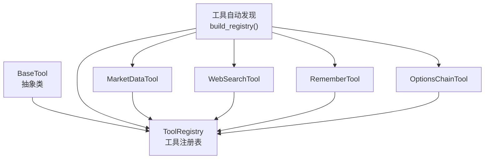
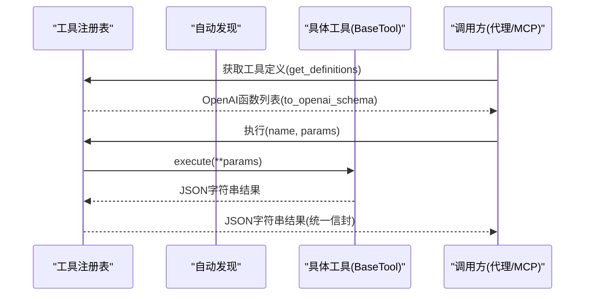
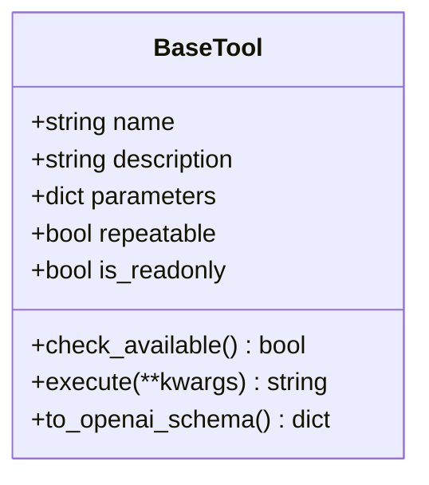
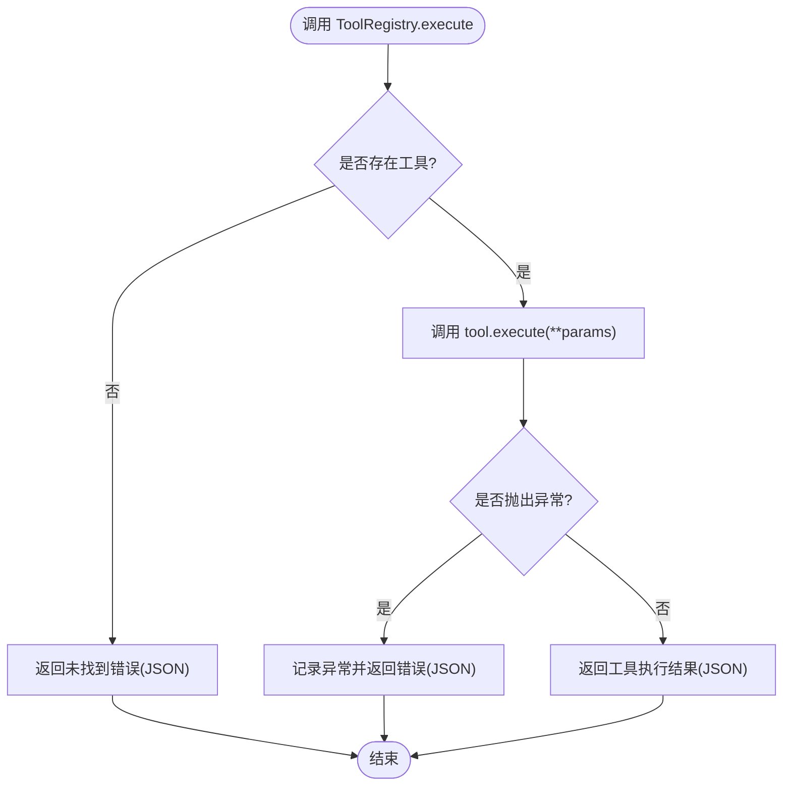
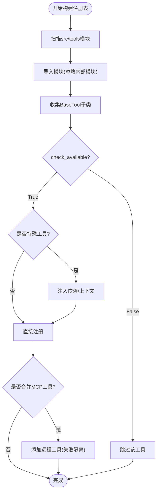
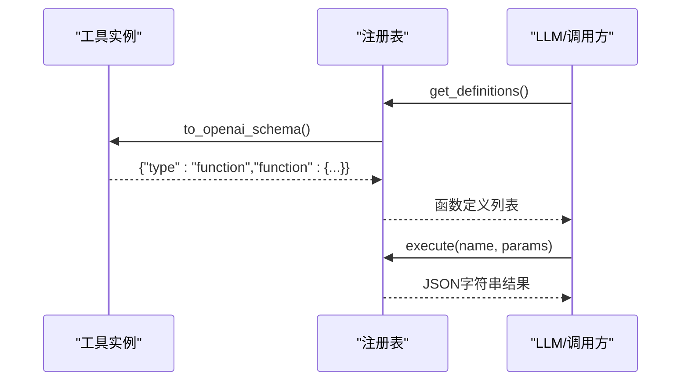
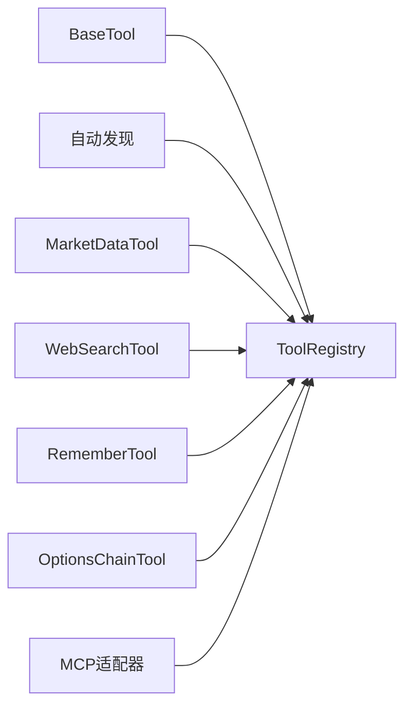

# 工具基类与接口规范

<cite>
**本文引用的文件**
- [agent/src/agent/tools.py](file://agent/src/agent/tools.py)
- [agent/src/tools/__init__.py](file://agent/src/tools/__init__.py)
- [agent/src/tools/market_data_tool.py](file://agent/src/tools/market_data_tool.py)
- [agent/src/tools/web_search_tool.py](file://agent/src/tools/web_search_tool.py)
- [agent/src/tools/remember_tool.py](file://agent/src/tools/remember_tool.py)
- [agent/src/tools/options_chain_tool.py](file://agent/src/tools/options_chain_tool.py)
- [agent/tests/test_institutional_holdings_tool.py](file://agent/tests/test_institutional_holdings_tool.py)
</cite>

## 目录
1. [简介](#简介)
2. [项目结构](#项目结构)
3. [核心组件](#核心组件)
4. [架构总览](#架构总览)
5. [详细组件分析](#详细组件分析)
6. [依赖关系分析](#依赖关系分析)
7. [性能考虑](#性能考虑)
8. [故障排查指南](#故障排查指南)
9. [结论](#结论)
10. [附录：自定义工具开发示例](#附录自定义工具开发示例)

## 简介
本文件面向 Vibe-Trading 的工具子系统，系统化说明 BaseTool 抽象类的设计原理、工具注册机制、执行契约以及 OpenAI 函数调用格式的转换过程。文档同时提供可操作的自定义工具开发指引，帮助开发者快速实现符合规范的本地工具，并理解其在代理循环中的行为约束（如只读标记、可重复执行标志）和错误处理约定。

## 项目结构
Vibe-Trading 的工具子系统以“约定优于配置”的方式组织：
- 基类与注册表定义位于 agent/src/agent/tools.py，提供 BaseTool 抽象类和 ToolRegistry 容器。
- 工具自动发现与装配位于 agent/src/tools/__init__.py，通过扫描包内模块并收集 BaseTool 子类完成注册。
- 具体工具实现位于 agent/src/tools/* 下，每个工具一个文件，继承 BaseTool 并实现 execute 等方法。

图表来源
- [agent/src/agent/tools.py:13-95](file://agent/src/agent/tools.py#L13-L95)
- [agent/src/tools/__init__.py:33-63](file://agent/src/tools/__init__.py#L33-L63)
- [agent/src/tools/market_data_tool.py:11-104](file://agent/src/tools/market_data_tool.py#L11-L104)
- [agent/src/tools/web_search_tool.py:134-170](file://agent/src/tools/web_search_tool.py#L134-L170)
- [agent/src/tools/remember_tool.py:13-66](file://agent/src/tools/remember_tool.py#L13-L66)
- [agent/src/tools/options_chain_tool.py:37-68](file://agent/src/tools/options_chain_tool.py#L37-L68)

章节来源
- [agent/src/agent/tools.py:13-95](file://agent/src/agent/tools.py#L13-L95)
- [agent/src/tools/__init__.py:33-63](file://agent/src/tools/__init__.py#L33-L63)

## 核心组件
- BaseTool：所有工具的抽象基类，定义工具标识、描述、参数 Schema、可重复执行标志、只读标记、可用性检查、执行入口与 OpenAI 格式转换。
- ToolRegistry：工具注册与执行调度器，负责按名称查找工具、统一执行并保证返回值为合法 JSON 字符串。

关键要点
- 工具标识符 name：唯一名称，用于注册表索引与 LLM 调用。
- 描述 description：向 LLM 暴露的工具用途说明。
- 参数 parameters：JSON Schema 形式，用于 LLM 参数校验与生成。
- repeatable：是否允许重复调用；影响 LLM 的调用策略。
- is_readonly：是否为只读工具；影响安全策略与通道包装。
- check_available：可选覆盖，用于运行时依赖检查（如第三方库或密钥）。
- execute：必须实现，接收任意关键字参数，返回 JSON 字符串结果。
- to_openai_schema：将工具元信息转换为 OpenAI function calling 格式。

章节来源
- [agent/src/agent/tools.py:13-51](file://agent/src/agent/tools.py#L13-L51)
- [agent/src/agent/tools.py:54-95](file://agent/src/agent/tools.py#L54-L95)

## 架构总览
工具在启动时通过自动发现被注册到 ToolRegistry，随后由上层（如 MCP 适配层或代理循环）通过名称调用。执行路径包括：
- 构建注册表：扫描 src/tools 包，导入各模块，收集 BaseTool 子类实例并注册。
- 过滤与注入：根据策略决定是否包含 shell 工具、是否注入会话 ID、是否合并远程 MCP 工具等。
- 执行与封装：ToolRegistry.execute 捕获异常并返回统一的 JSON 信封，避免异常上抛破坏流程。

图表来源
- [agent/src/agent/tools.py:68-84](file://agent/src/agent/tools.py#L68-L84)
- [agent/src/tools/__init__.py:66-245](file://agent/src/tools/__init__.py#L66-L245)

章节来源
- [agent/src/tools/__init__.py:66-245](file://agent/src/tools/__init__.py#L66-L245)
- [agent/src/agent/tools.py:68-84](file://agent/src/agent/tools.py#L68-L84)

## 详细组件分析

### BaseTool 抽象类
- 设计目标：为所有工具提供统一的能力模型与生命周期钩子，确保 LLM 能一致地理解与调用工具。
- 属性与行为：
  - name/description/parameters：构成工具对外契约的核心三元组。
  - repeatable/is_readonly：控制 LLM 调用策略与安全边界。
  - check_available：默认可用，子类可重写以进行依赖检查。
  - execute：抽象方法，要求返回 JSON 字符串。
  - to_openai_schema：将工具元信息转为 OpenAI function calling 格式。

图表来源
- [agent/src/agent/tools.py:13-51](file://agent/src/agent/tools.py#L13-L51)

章节来源
- [agent/src/agent/tools.py:13-51](file://agent/src/agent/tools.py#L13-L51)

### ToolRegistry 执行与错误封装
- 职责：维护工具映射、提供 get/get_definitions/execute 能力。
- 执行契约：execute 会捕获异常并返回包含 status/tool/error 的 JSON 字符串，保证调用方始终获得稳定结构。
- 工具名查询：get(name) 返回工具实例或 None。

图表来源
- [agent/src/agent/tools.py:72-84](file://agent/src/agent/tools.py#L72-L84)

章节来源
- [agent/src/agent/tools.py:54-95](file://agent/src/agent/tools.py#L54-L95)

### 工具自动发现与注册
- 机制：遍历 src/tools 包下的模块，跳过以“_”开头的内部模块，导入后收集 BaseTool 子类并缓存。
- 注册策略：
  - 支持排除 shell 工具（bash/background_run/cancel_background），除非显式启用。
  - 支持 check_available 过滤不可用工具。
  - 特殊工具注入：如 RememberTool 注入共享持久化内存；目标相关工具注入会话 ID 与事件回调。
  - 可选合并远程 MCP 工具，并在失败时隔离报错，不影响本地工具。

图表来源
- [agent/src/tools/__init__.py:33-63](file://agent/src/tools/__init__.py#L33-L63)
- [agent/src/tools/__init__.py:66-245](file://agent/src/tools/__init__.py#L66-L245)

章节来源
- [agent/src/tools/__init__.py:33-63](file://agent/src/tools/__init__.py#L33-L63)
- [agent/src/tools/__init__.py:66-245](file://agent/src/tools/__init__.py#L66-L245)

### 具体工具示例分析

#### MarketDataTool（市场数据）
- 作用：通过仓库加载层获取标准化的 OHLCV 数据，支持多种数据源与周期。
- 关键点：
  - 参数使用 JSON Schema 描述，包含 codes、start_date、end_date、source、interval、max_rows 等。
  - repeatable=True，允许重复调用。
  - execute 委托给 fetch_market_data_json，返回 JSON 字符串。

章节来源
- [agent/src/tools/market_data_tool.py:11-104](file://agent/src/tools/market_data_tool.py#L11-L104)

#### WebSearchTool（网络搜索）
- 作用：聚合多个免费搜索引擎，具备重试与后端降级能力。
- 关键点：
  - check_available 检测 ddgs 或 duckduckgo_search 是否安装。
  - 参数 query 必填，max_results 可选并有范围限制。
  - execute 对输入进行严格校验，失败返回结构化错误 JSON。

章节来源
- [agent/src/tools/web_search_tool.py:134-200](file://agent/src/tools/web_search_tool.py#L134-L200)

#### RememberTool（持久记忆）
- 作用：跨会话保存、检索、删除与强化记忆。
- 关键点：
  - is_readonly=False，属于写操作工具。
  - 支持 action 枚举：save/recall/forget/reinforce。
  - execute 根据 action 路由到不同处理方法，均返回 JSON 字符串。

章节来源
- [agent/src/tools/remember_tool.py:13-178](file://agent/src/tools/remember_tool.py#L13-L178)

#### OptionsChainTool（期权链）
- 作用：获取美股期权链（calls/puts），字段丰富且受控输出规模。
- 关键点：
  - 参数 ticker 必填，expiration 可选（Unix 秒）。
  - execute 调用 Yahoo Finance 客户端，异常被捕获并转为错误信封。
  - 成功返回包含 market/source/data 的结构化 JSON。

章节来源
- [agent/src/tools/options_chain_tool.py:37-156](file://agent/src/tools/options_chain_tool.py#L37-L156)

### OpenAI 函数调用格式转换
- BaseTool.to_openai_schema 将 name/description/parameters 组合为 OpenAI function calling 所需结构。
- ToolRegistry.get_definitions 批量导出所有工具的 OpenAI 定义，供 LLM 选择调用。
- 测试用例验证了工具参数属性集合与枚举值的一致性。

图表来源
- [agent/src/agent/tools.py:42-51](file://agent/src/agent/tools.py#L42-L51)
- [agent/src/agent/tools.py:68-70](file://agent/src/agent/tools.py#L68-L70)
- [agent/tests/test_institutional_holdings_tool.py:1637-1646](file://agent/tests/test_institutional_holdings_tool.py#L1637-L1646)

章节来源
- [agent/src/agent/tools.py:42-70](file://agent/src/agent/tools.py#L42-L70)
- [agent/tests/test_institutional_holdings_tool.py:1637-1646](file://agent/tests/test_institutional_holdings_tool.py#L1637-L1646)

## 依赖关系分析
- 耦合度：
  - BaseTool 与 ToolRegistry 低耦合，通过名称解耦。
  - 工具实现仅依赖业务逻辑与外部服务，不感知注册细节。
- 间接依赖：
  - 自动发现依赖 Python 包导入机制与模块命名约定。
  - 某些工具依赖可选第三方库（如 ddgs），通过 check_available 屏蔽不可用场景。
- 外部集成点：
  - MCP 服务器工具可通过 build_mcp_tool_wrappers 并入注册表，失败隔离。
  - 交易通道工具可能被 wrap_live_broker_tools 包装，遵循授权与开关策略。

图表来源
- [agent/src/agent/tools.py:13-95](file://agent/src/agent/tools.py#L13-L95)
- [agent/src/tools/__init__.py:66-245](file://agent/src/tools/__init__.py#L66-L245)

章节来源
- [agent/src/tools/__init__.py:66-245](file://agent/src/tools/__init__.py#L66-L245)
- [agent/src/agent/tools.py:13-95](file://agent/src/agent/tools.py#L13-L95)

## 性能考虑
- 自动发现缓存：首次扫描后缓存子类列表，避免重复导入开销。
- 工具执行封装：统一 JSON 返回减少解析成本与异常传播。
- 参数校验：在工具内部尽早校验与截断，防止大负载进入后续链路。
- 并发与限流：部分工具（如网络搜索）内置重试与退避，降低瞬时压力。

[本节为通用指导，不直接分析具体文件]

## 故障排查指南
- 工具不可用：
  - 检查 check_available 是否返回 False（例如缺少依赖）。
  - 查看日志中“工具不可用，已跳过”的信息。
- 参数错误：
  - 确认 JSON Schema 的 required 与类型约束。
  - 参考测试用例中对错误消息片段的断言，定位问题。
- 执行异常：
  - ToolRegistry 会将异常封装为 JSON 错误信封，检查返回的 error 字段。
  - 关注日志中的“工具失败”记录，便于定位堆栈。

章节来源
- [agent/src/agent/tools.py:72-84](file://agent/src/agent/tools.py#L72-L84)
- [agent/tests/test_institutional_holdings_tool.py:1653-1664](file://agent/tests/test_institutional_holdings_tool.py#L1653-L1664)

## 结论
BaseTool 与 ToolRegistry 构成了 Vibe-Trading 工具系统的核心骨架：前者定义统一契约与扩展点，后者提供注册、发现与执行保障。通过 JSON Schema 参数、OpenAI 函数调用格式转换、可重复执行与只读标记，系统实现了高内聚、低耦合、可扩展的工具生态。结合自动发现与依赖检查，开发者可以专注于业务逻辑，而无需关心底层编排细节。

[本节为总结性内容，不直接分析具体文件]

## 附录：自定义工具开发示例
以下示例展示如何继承 BaseTool 并实现必要接口，满足自动发现与执行契约：

步骤概览
- 新建工具文件：在 agent/src/tools 目录下创建新模块（文件名不以“_”开头）。
- 定义类：继承 BaseTool，设置 name、description、parameters、repeatable、is_readonly。
- 实现 check_available：如需依赖检查，重写该方法返回布尔值。
- 实现 execute：接收 **kwargs，进行参数校验与业务处理，返回 JSON 字符串。
- 自动注册：无需额外代码，工具会在构建注册表时被自动发现与注册。

参考实现路径
- 简单只读工具：参见 MarketDataTool 的参数定义与 execute 委托模式。
- 带依赖检查的工具：参见 WebSearchTool 的 check_available 与 execute 的错误封装。
- 写操作工具：参见 RememberTool 的 is_readonly=False 与多动作路由。
- 复杂数据工具：参见 OptionsChainTool 的参数校验、异常捕获与结构化返回。

章节来源
- [agent/src/tools/market_data_tool.py:11-104](file://agent/src/tools/market_data_tool.py#L11-L104)
- [agent/src/tools/web_search_tool.py:134-200](file://agent/src/tools/web_search_tool.py#L134-L200)
- [agent/src/tools/remember_tool.py:13-178](file://agent/src/tools/remember_tool.py#L13-L178)
- [agent/src/tools/options_chain_tool.py:37-156](file://agent/src/tools/options_chain_tool.py#L37-L156)
- [agent/src/tools/__init__.py:33-63](file://agent/src/tools/__init__.py#L33-L63)