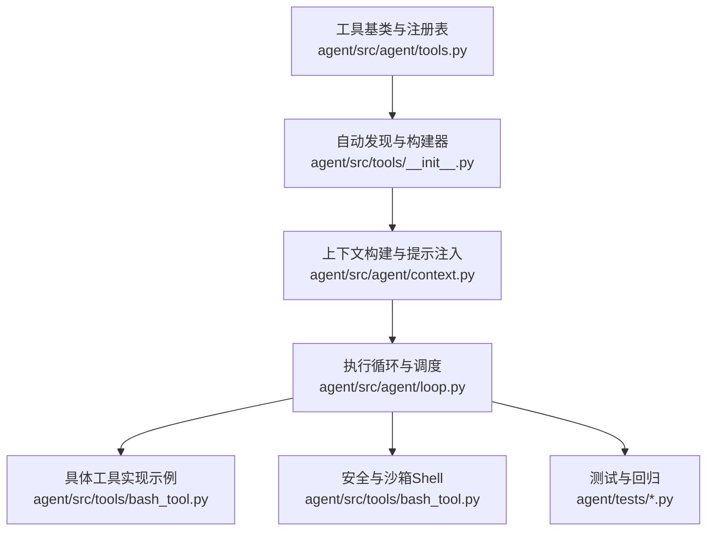
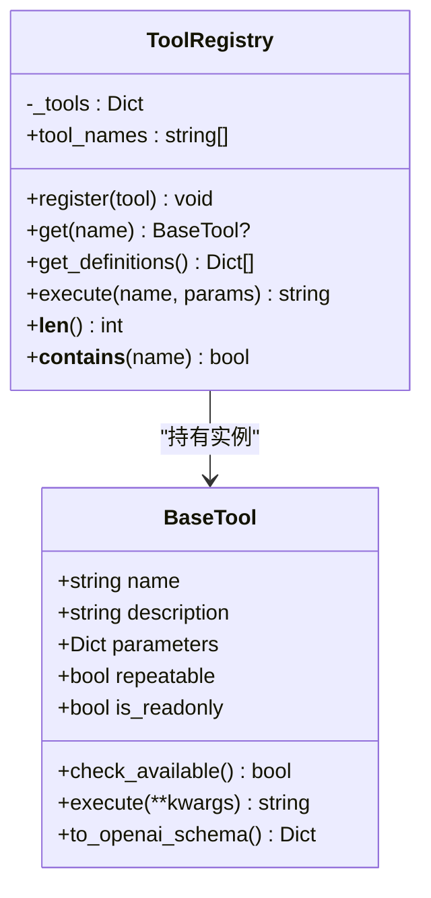
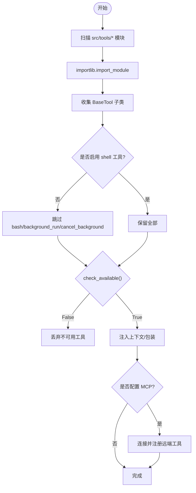
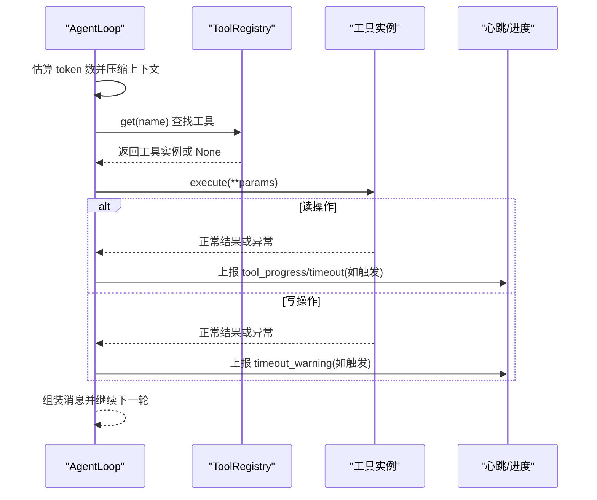
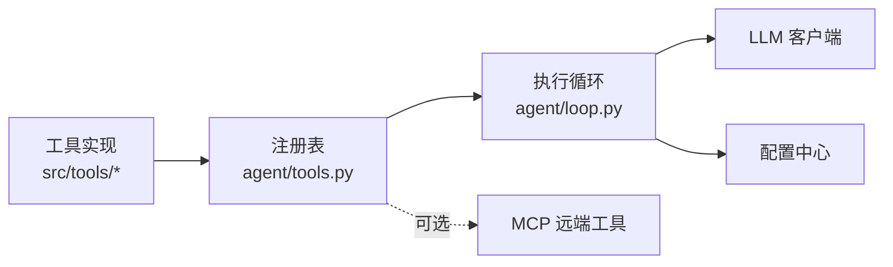

# 工具注册系统

<cite>
**本文引用的文件**
- [agent/src/agent/tools.py](file://agent/src/agent/tools.py)
- [agent/src/tools/__init__.py](file://agent/src/tools/__init__.py)
- [agent/src/agent/context.py](file://agent/src/agent/context.py)
- [agent/src/agent/loop.py](file://agent/src/agent/loop.py)
- [agent/src/tools/bash_tool.py](file://agent/src/tools/bash_tool.py)
- [agent/tests/test_tool_timeout.py](file://agent/tests/test_tool_timeout.py)
- [agent/tests/test_tool_registry_security.py](file://agent/tests/test_tool_registry_security.py)
</cite>

## 目录
1. [简介](#简介)
2. [项目结构](#项目结构)
3. [核心组件](#核心组件)
4. [架构总览](#架构总览)
5. [详细组件分析](#详细组件分析)
6. [依赖关系分析](#依赖关系分析)
7. [性能与资源限制](#性能与资源限制)
8. [故障排查指南](#故障排查指南)
9. [结论](#结论)
10. [附录：开发指南与最佳实践](#附录开发指南与最佳实践)

## 简介
本文件面向 Vibe-Trading 的“工具注册系统”，系统性说明工具的发现、注册、动态加载、执行引擎与安全沙箱机制，并给出工具接口规范、参数验证与返回值格式约定。同时提供内置工具分类、使用示例与组合实践，帮助开发者快速扩展与集成新工具。

## 项目结构
围绕工具注册与执行的关键代码分布在以下模块：
- 基础抽象与注册表：BaseTool、ToolRegistry
- 自动发现与构建器：包级扫描、MCP 工具注入、白名单过滤
- 上下文与提示词：将工具描述注入系统提示，驱动 LLM 调用
- 执行循环：ReAct 主循环、并发批处理、超时控制、结果压缩
- 安全与沙箱：Shell 工具默认禁用、命令安全检查、输出截断
- 测试用例：超时行为、注册安全策略



**图示来源**
- [agent/src/agent/tools.py:13-95](file://agent/src/agent/tools.py#L13-L95)
- [agent/src/tools/__init__.py:33-245](file://agent/src/tools/__init__.py#L33-L245)
- [agent/src/agent/context.py:210-336](file://agent/src/agent/context.py#L210-L336)
- [agent/src/agent/loop.py:502-800](file://agent/src/agent/loop.py#L502-L800)
- [agent/src/tools/bash_tool.py:16-84](file://agent/src/tools/bash_tool.py#L16-L84)

**章节来源**
- [agent/src/agent/tools.py:13-95](file://agent/src/agent/tools.py#L13-L95)
- [agent/src/tools/__init__.py:33-245](file://agent/src/tools/__init__.py#L33-L245)
- [agent/src/agent/context.py:210-336](file://agent/src/agent/context.py#L210-L336)
- [agent/src/agent/loop.py:502-800](file://agent/src/agent/loop.py#L502-L800)
- [agent/src/tools/bash_tool.py:16-84](file://agent/src/tools/bash_tool.py#L16-L84)

## 核心组件
- BaseTool：定义工具的最小契约（名称、描述、参数 Schema、是否可重复、是否只读），并提供 OpenAI 函数调用格式的序列化方法。
- ToolRegistry：维护工具实例映射，支持按名获取、批量导出定义、统一执行入口与异常兜底。
- 自动发现与构建器：通过包扫描导入所有工具模块，收集 BaseTool 子类；根据配置决定是否包含 Shell 工具；可选注入 MCP 远程工具；支持按白名单过滤。
- ContextBuilder：将工具描述注入系统提示，使 LLM 了解可用工具及其参数；格式化工具调用与结果消息。
- AgentLoop：ReAct 主循环，负责消息管理、工具调用编排、并发批处理、上下文压缩、超时控制与事件上报。

**章节来源**
- [agent/src/agent/tools.py:13-95](file://agent/src/agent/tools.py#L13-L95)
- [agent/src/tools/__init__.py:33-245](file://agent/src/tools/__init__.py#L33-L245)
- [agent/src/agent/context.py:210-336](file://agent/src/agent/context.py#L210-L336)
- [agent/src/agent/loop.py:502-800](file://agent/src/agent/loop.py#L502-L800)

## 架构总览
下图展示了从“工具发现”到“执行与反馈”的端到端流程，包括本地工具与 MCP 工具的合并、上下文注入、循环调度与安全控制。

```mermaid
sequenceDiagram
participant Dev as "开发者"
participant Reg as "工具构建器<br/>tools/__init__.py"
participant R as "注册表<br/>agent/tools.py"
participant Ctx as "上下文构建<br/>context.py"
participant Loop as "执行循环<br/>agent/loop.py"
participant T as "具体工具<br/>bash_tool.py"
Dev->>Reg : 启动时构建注册表
Reg->>Reg : 扫描 src/tools/* 模块
Reg->>R : 注册本地工具含可选 MCP
Note over Reg,R : 默认禁用 shell 工具，需显式开启
Ctx->>R : 获取工具定义列表
Ctx-->>Dev : 生成系统提示含工具描述
Dev->>Loop : 发起 ReAct 循环
Loop->>R : 按名查找工具并执行
R->>T : 调用 execute(**kwargs)
T-->>R : 返回 JSON 字符串
R-->>Loop : 标准化错误与状态
Loop-->>Dev : 输出结果/继续推理
```

**图示来源**
- [agent/src/tools/__init__.py:33-245](file://agent/src/tools/__init__.py#L33-L245)
- [agent/src/agent/tools.py:54-95](file://agent/src/agent/tools.py#L54-L95)
- [agent/src/agent/context.py:235-336](file://agent/src/agent/context.py#L235-L336)
- [agent/src/agent/loop.py:624-800](file://agent/src/agent/loop.py#L624-L800)
- [agent/src/tools/bash_tool.py:16-84](file://agent/src/tools/bash_tool.py#L16-L84)

## 详细组件分析

### 工具基类与注册表
- BaseTool 暴露 name、description、parameters（JSON Schema）、repeatable、is_readonly，并提供 to_openai_schema 用于 LLM 函数调用。
- ToolRegistry 提供 register/get/get_definitions/execute/tool_names 等能力，execute 对异常进行统一捕获并返回结构化 JSON。



**图示来源**
- [agent/src/agent/tools.py:13-95](file://agent/src/agent/tools.py#L13-L95)

**章节来源**
- [agent/src/agent/tools.py:13-95](file://agent/src/agent/tools.py#L13-L95)

### 工具自动发现与动态加载
- 包扫描：遍历 src/tools 下模块，跳过以“_”开头的内部模块，逐个 import 触发类定义。
- 子类收集：递归收集 BaseTool 的所有子类，仅保留 name 非空的类。
- 注册策略：
  - 默认排除 shell 工具（bash、background_run、cancel_background），除非显式 include_shell_tools=True。
  - 若 check_available() 返回 False，则跳过该工具。
  - 特殊工具注入 session_id/event_callback/persistent_memory 等上下文。
  - 可选注入 MCP 工具：按 agent_config.mcp_servers 连接远端服务，失败隔离且不影响其他服务器。
  - 支持白名单过滤：build_filtered_registry/build_swarm_registry 仅暴露指定工具集合。



**图示来源**
- [agent/src/tools/__init__.py:33-245](file://agent/src/tools/__init__.py#L33-L245)

**章节来源**
- [agent/src/tools/__init__.py:33-245](file://agent/src/tools/__init__.py#L33-L245)

### 上下文与工具描述注入
- ContextBuilder 在系统提示中注入工具清单与参数摘要，使 LLM 能准确选择工具与构造参数。
- 工具描述由 registry._tools 遍历生成，包含参数类型、必填项等信息。
- 工具调用与结果消息格式化为 OpenAI 兼容结构，便于多提供商一致处理。

**章节来源**
- [agent/src/agent/context.py:235-336](file://agent/src/agent/context.py#L235-L336)

### 执行引擎：ReAct 循环、并发与超时
- 主循环：AgentLoop.run 组织消息流，迭代调用 LLM，解析 tool_calls，分发执行，回写结果。
- 并发批处理：连续只读工具可并行执行（线程池），提升吞吐。
- 上下文压缩：多层压缩（微裁剪、折叠长文本、LLM 摘要）控制上下文大小。
- 超时控制：
  - 全局工具超时阈值来自配置，未命中则走默认值。
  - 写操作工具即使超时也会等待完成，避免副作用中断；读操作超时会直接报错。
  - 心跳与进度事件在超时/警告时上报，便于 UI 展示。
- 结果规范化：统一 JSON 结构，错误路径包含 status/error/tool 等字段。



**图示来源**
- [agent/src/agent/loop.py:502-800](file://agent/src/agent/loop.py#L502-L800)
- [agent/tests/test_tool_timeout.py:42-100](file://agent/tests/test_tool_timeout.py#L42-L100)

**章节来源**
- [agent/src/agent/loop.py:502-800](file://agent/src/agent/loop.py#L502-L800)
- [agent/tests/test_tool_timeout.py:42-100](file://agent/tests/test_tool_timeout.py#L42-L100)

### 安全沙箱与资源限制
- Shell 工具默认禁用：除非显式 include_shell_tools=True，否则 bash/background_run/cancel_background 不会出现在注册表中。
- 命令安全检查：对危险命令（如终止 Python 进程）进行拦截并返回错误。
- 输出限制：stdout/stderr 最大长度限制，防止大输出阻塞上下文。
- 超时保护：子进程执行带超时，避免卡死。
- 运行目录隔离：命令在 run_dir 内执行，限制文件系统访问范围。

**章节来源**
- [agent/tests/test_tool_registry_security.py:10-28](file://agent/tests/test_tool_registry_security.py#L10-L28)
- [agent/src/tools/bash_tool.py:16-84](file://agent/src/tools/bash_tool.py#L16-L84)

### 工具接口规范、参数验证与返回值格式
- 接口规范：
  - 每个工具继承 BaseTool，声明 name、description、parameters（JSON Schema）。
  - 实现 execute(**kwargs) -> str，返回 JSON 字符串。
  - 可选重写 check_available() 控制可用性。
  - repeatable/is_readonly 标识工具特性，影响执行策略。
- 参数验证：
  - 由上层（LLM）依据 parameters 生成参数；工具内部应做必要校验并在异常时返回结构化错误。
- 返回值格式：
  - 成功：{"status": "ok", ...}
  - 失败：{"status": "error", "error": "...", "tool": "..."}
  - 工具注册表对异常进行兜底封装，保证返回合法 JSON。

**章节来源**
- [agent/src/agent/tools.py:13-95](file://agent/src/agent/tools.py#L13-L95)
- [agent/src/tools/bash_tool.py:16-84](file://agent/src/tools/bash_tool.py#L16-L84)

### 内置工具分类与使用示例
- 分类（基于文件名与职责）：
  - 数据与市场：market_data_tool、get_fundamentals_tool、financial_statements_tool、fund_flow_tool、sector_tool、etf_holdings_tool、options_*、prediction_market_tool 等
  - 研究与因子：factor_analysis_tool、alpha_zoo_tool、alpha_bench_tool、quantlib_tool、research_papers_tool、research_reports_tool
  - 交易与账户：trading_connector_tool、block_trades_tool、margin_trading_tool、shadow_account_tool、trade_journal_tool
  - 文档与网络：doc_reader_tool、web_reader_tool、web_search_tool、image_vision_tool、ocr/*
  - 系统与脚本：bash_tool、edit_file_tool、read_file_tool、write_file_tool、remember_tool、goal_tool、swarm_tool、background_tools
- 使用示例（概念性）：
  - 查询市场数据：调用 market_data_tool，传入标的与时间范围，读取返回指标。
  - 财务分析：调用 financial_statements_tool 获取报表，再结合 factor_analysis_tool 计算因子。
  - 策略回测：使用 backtest_tool 或 autopilot 相关工具生成配置与信号引擎，执行后读取 artifacts。
  - 脚本执行：在允许环境下启用 bash_tool，在 run_dir 内执行安装/脚本任务。

[本节为概念性说明，不直接分析具体文件]

### 工具组合最佳实践
- 先识别再消费：对敏感请求先调用 symbol_search 确定标的与交易所后缀，再调用下游数据/新闻工具。
- 只读优先：尽量使用只读工具并行批处理，减少副作用风险。
- 渐进式分析：先拉取概览数据，再按需深入（如财报细节、期权链、订单簿深度）。
- 结果收敛：利用 compact_tool 或上下文压缩机制，保持对话精简。
- 安全边界：默认禁用 shell 工具；必要时仅在受控环境开启，并严格限制命令集。

[本节为概念性说明，不直接分析具体文件]

## 依赖关系分析
- 低耦合：BaseTool/ToolRegistry 作为稳定接口，具体工具独立实现。
- 高内聚：工具按功能分文件，便于维护与测试。
- 外部依赖：
  - MCP：可选接入远端工具，失败隔离。
  - LLM：通过 ContextBuilder 注入工具描述，驱动调用。
  - 配置：工具超时、心跳间隔、token 阈值等来自配置。



**图示来源**
- [agent/src/agent/tools.py:54-95](file://agent/src/agent/tools.py#L54-L95)
- [agent/src/agent/loop.py:502-800](file://agent/src/agent/loop.py#L502-L800)
- [agent/src/tools/__init__.py:155-245](file://agent/src/tools/__init__.py#L155-L245)

**章节来源**
- [agent/src/tools/__init__.py:155-245](file://agent/src/tools/__init__.py#L155-L245)
- [agent/src/agent/tools.py:54-95](file://agent/src/agent/tools.py#L54-L95)
- [agent/src/agent/loop.py:502-800](file://agent/src/agent/loop.py#L502-L800)

## 性能与资源限制
- 并发优化：连续只读工具并行执行，降低端到端延迟。
- 上下文压缩：多层压缩策略控制 token 用量，避免超限。
- 超时与心跳：工具超时与心跳节流保障交互流畅与可观测性。
- 输出限制：shell 工具输出截断，避免大响应阻塞。

[本节为通用性能讨论，不直接分析具体文件]

## 故障排查指南
- 工具未找到：检查工具名是否正确、是否被白名单过滤、是否因 check_available() 被跳过。
- Shell 工具不可用：确认是否已启用 include_shell_tools；检查命令安全检查是否拦截。
- 工具超时：查看工具是否为写操作（会等待完成但上报超时警告）；调整 TOOL_TIMEOUT_SECONDS。
- 上下文过大：观察压缩层是否触发；适当减少历史消息或启用 compact_tool。
- MCP 工具缺失：检查 agent_config.mcp_servers 配置与连通性；关注服务端错误日志。

**章节来源**
- [agent/tests/test_tool_timeout.py:42-100](file://agent/tests/test_tool_timeout.py#L42-L100)
- [agent/tests/test_tool_registry_security.py:10-28](file://agent/tests/test_tool_registry_security.py#L10-L28)
- [agent/src/tools/bash_tool.py:16-84](file://agent/src/tools/bash_tool.py#L16-L84)

## 结论
Vibe-Trading 的工具注册系统通过清晰的抽象、自动发现与动态加载、严格的沙箱与超时控制，以及可扩展的 MCP 集成，提供了安全、高效、可观测的工具执行基础设施。遵循本文的接口规范与实践建议，可快速扩展高质量工具并融入现有工作流。

[本节为总结性内容，不直接分析具体文件]

## 附录：开发指南与最佳实践

### 自定义工具编写步骤
- 新建工具文件：在 src/tools/ 下创建 xxx_tool.py，定义继承自 BaseTool 的类。
- 声明元信息：设置 name、description、parameters（JSON Schema），标记 repeatable/is_readonly。
- 实现 execute：接收 **kwargs，返回 JSON 字符串；做好参数校验与异常处理。
- 可选 check_available：如需外部依赖（API Key/包），在此判断可用性。
- 注册与发现：无需手动注册，启动时自动发现；如需屏蔽，确保 name 为空或 check_available=False。

**章节来源**
- [agent/src/agent/tools.py:13-95](file://agent/src/agent/tools.py#L13-L95)
- [agent/src/tools/__init__.py:33-63](file://agent/src/tools/__init__.py#L33-L63)

### 测试方法
- 单元测试：模拟工具执行，验证返回结构与错误路径。
- 超时测试：使用 monkeypatch 设置短超时，验证行为符合预期（读工具报错、写工具等待完成并上报警告）。
- 安全测试：验证默认不暴露 shell 工具，仅在显式开启时注册。

**章节来源**
- [agent/tests/test_tool_timeout.py:42-100](file://agent/tests/test_tool_timeout.py#L42-L100)
- [agent/tests/test_tool_registry_security.py:10-28](file://agent/tests/test_tool_registry_security.py#L10-L28)

### 部署流程
- 本地开发：新增工具后重启服务即可自动发现。
- 生产环境：
  - 默认禁用 shell 工具，避免误用。
  - 如需 MCP 工具，配置 agent_config.mcp_servers，并确保连通性与鉴权。
  - 合理设置工具超时、心跳间隔与 token 阈值，平衡性能与稳定性。

**章节来源**
- [agent/src/tools/__init__.py:155-245](file://agent/src/tools/__init__.py#L155-L245)
- [agent/src/agent/loop.py:106-120](file://agent/src/agent/loop.py#L106-L120)