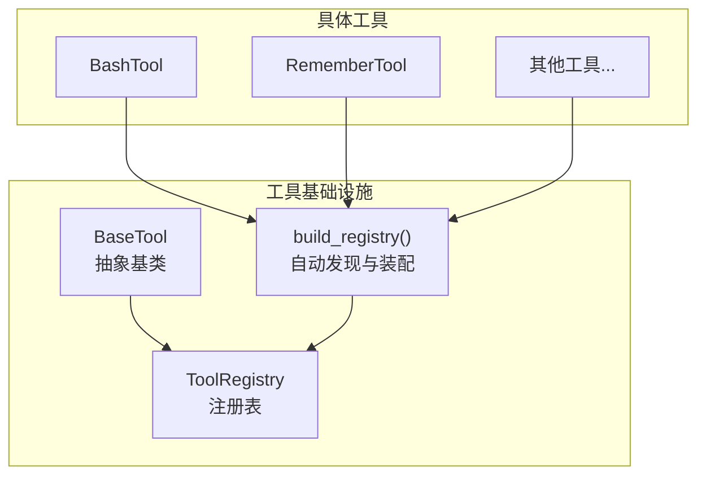
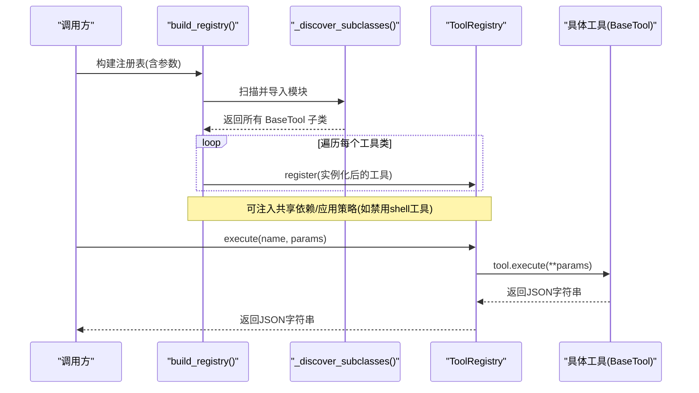
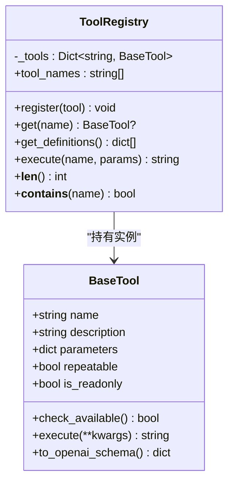
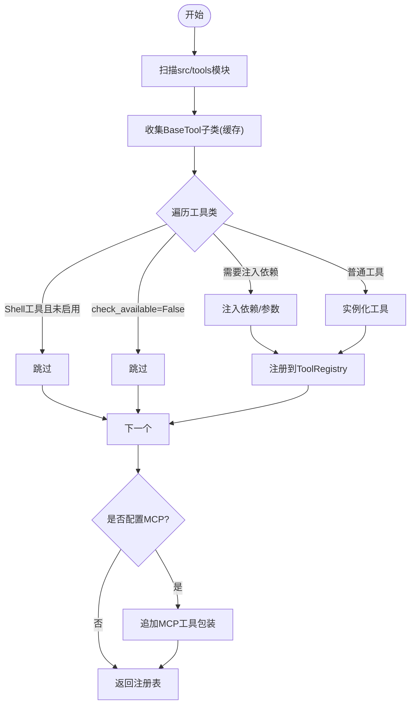
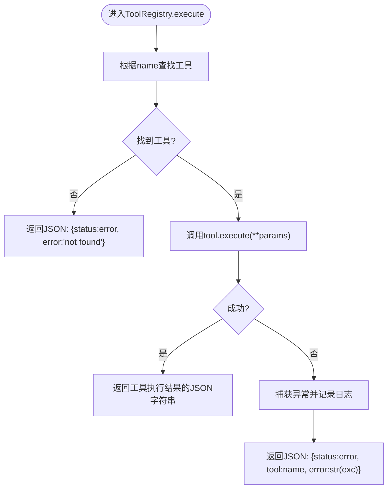
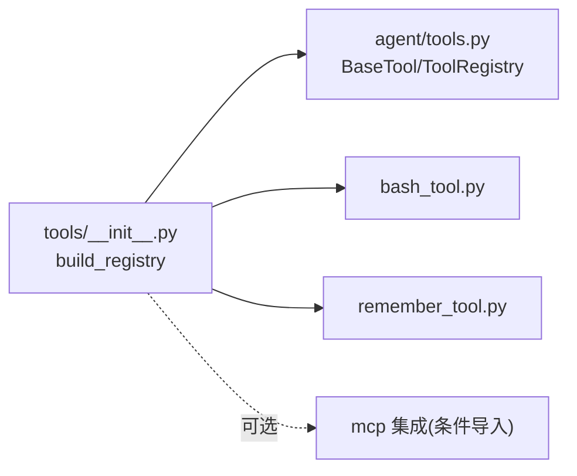

# 工具注册表管理

<cite>
**本文引用的文件**
- [agent/src/agent/tools.py](file://agent/src/agent/tools.py)
- [agent/src/tools/__init__.py](file://agent/src/tools/__init__.py)
- [agent/src/tools/bash_tool.py](file://agent/src/tools/bash_tool.py)
- [agent/src/tools/remember_tool.py](file://agent/src/tools/remember_tool.py)
- [agent/tests/test_tool_registry_security.py](file://agent/tests/test_tool_registry_security.py)
</cite>

## 目录
1. [简介](#简介)
2. [项目结构](#项目结构)
3. [核心组件](#核心组件)
4. [架构总览](#架构总览)
5. [详细组件分析](#详细组件分析)
6. [依赖关系分析](#依赖关系分析)
7. [性能考量](#性能考量)
8. [故障排查指南](#故障排查指南)
9. [结论](#结论)
10. [附录](#附录)

## 简介
本文件面向 Vibe-Trading 的工具注册表管理系统，聚焦 ToolRegistry 类及其在工具动态注册、查找与生命周期管理中的核心作用。文档将系统阐述：
- 工具注册流程与名称冲突处理
- 内存管理与生命周期
- get_definitions 方法如何生成 OpenAI 兼容的工具定义列表
- execute 方法的安全执行机制（异常捕获与错误处理）
- 工具发现算法的实现细节与扩展机制
- 最佳实践与性能优化建议

## 项目结构
Vibe-Trading 的工具基础设施由“基础抽象 + 自动发现 + 注册表”三部分构成：
- 基础抽象：BaseTool 定义了工具的通用接口与 OpenAI 函数调用格式转换能力
- 自动发现：通过扫描 src/tools 包下的模块并收集 BaseTool 子类，完成本地工具的自动发现与实例化
- 注册表：ToolRegistry 提供统一的注册、查询、批量导出与统一执行入口

图表来源
- [agent/src/agent/tools.py:13-51](file://agent/src/agent/tools.py#L13-L51)
- [agent/src/tools/__init__.py:33-63](file://agent/src/tools/__init__.py#L33-L63)
- [agent/src/tools/__init__.py:66-245](file://agent/src/tools/__init__.py#L66-L245)

章节来源
- [agent/src/agent/tools.py:13-51](file://agent/src/agent/tools.py#L13-L51)
- [agent/src/tools/__init__.py:33-63](file://agent/src/tools/__init__.py#L33-L63)
- [agent/src/tools/__init__.py:66-245](file://agent/src/tools/__init__.py#L66-L245)

## 核心组件
- BaseTool：定义工具的最小契约（name、description、parameters、repeatable、is_readonly），并提供 to_openai_schema() 用于生成 OpenAI 函数调用描述；check_available() 允许工具声明自身可用性以参与或退出注册。
- ToolRegistry：维护 name -> tool 的映射，支持 register/get/get_definitions/execute/tool_names 等能力，保证 execute 始终返回 JSON 字符串。
- build_registry：负责自动发现、过滤与安全策略控制（如 shell 工具默认不启用）、注入共享依赖（如 PersistentMemory）、以及可选地追加 MCP 远程工具。

章节来源
- [agent/src/agent/tools.py:13-94](file://agent/src/agent/tools.py#L13-L94)
- [agent/src/tools/__init__.py:66-245](file://agent/src/tools/__init__.py#L66-L245)

## 架构总览
下图展示了从构建到执行的端到端流程：自动发现本地工具、按策略过滤、按需注入依赖、可选接入 MCP 工具，最终形成 ToolRegistry；上层通过 execute(name, params) 安全调用工具。

图表来源
- [agent/src/tools/__init__.py:33-63](file://agent/src/tools/__init__.py#L33-L63)
- [agent/src/tools/__init__.py:66-245](file://agent/src/tools/__init__.py#L66-L245)
- [agent/src/agent/tools.py:54-94](file://agent/src/agent/tools.py#L54-L94)

## 详细组件分析

### ToolRegistry 类
- 职责
  - 动态注册：register(tool) 将工具以 name 为键加入内部字典
  - 查找：get(name) 返回对应工具实例或 None
  - 导出定义：get_definitions() 遍历已注册工具，调用 to_openai_schema() 生成 OpenAI 函数调用描述列表
  - 安全执行：execute(name, params) 定位工具后调用其 execute，捕获异常并返回结构化 JSON 错误
  - 元信息：tool_names 属性暴露当前注册的所有工具名；__len__/__contains__ 便于容器式使用
- 名称冲突处理
  - 基于字典覆盖：同名工具会被后续注册覆盖，因此应确保工具名唯一
- 内存管理
  - 内部仅持有 name -> tool 的引用；无额外缓存或弱引用；生命周期由外部决定
- 关键行为
  - get_definitions 直接复用 BaseTool.to_openai_schema()，保证与 OpenAI 函数调用协议一致
  - execute 保证返回值是 JSON 字符串，失败时包含 status/error 字段，便于上层统一解析

图表来源
- [agent/src/agent/tools.py:13-94](file://agent/src/agent/tools.py#L13-L94)

章节来源
- [agent/src/agent/tools.py:54-94](file://agent/src/agent/tools.py#L54-L94)

### 工具自动发现与装配（build_registry）
- 自动发现
  - _discover_subclasses() 遍历 src/tools 下所有非私有模块，importlib 导入后收集 BaseTool 的子类，结果缓存避免重复扫描
- 装配与过滤
  - 对每个工具类：
    - 若为 shell 工具且未显式 include_shell_tools，则跳过
    - 若 check_available() 返回 False，则跳过
    - 对特定工具注入共享依赖（如 RememberTool 注入 PersistentMemory；目标导向工具注入 session_id/event_callback；SwarmTool 注入 include_shell_tools 等）
  - 若配置了 MCP 服务器，则在本地工具之后追加远程工具包装，并对 live broker 进行特殊处理（鉴权、只读通道等）
- 白名单过滤
  - build_filtered_registry / build_swarm_registry 支持按名称白名单裁剪注册表，缺失工具会记录警告日志

图表来源
- [agent/src/tools/__init__.py:33-63](file://agent/src/tools/__init__.py#L33-L63)
- [agent/src/tools/__init__.py:66-245](file://agent/src/tools/__init__.py#L66-L245)

章节来源
- [agent/src/tools/__init__.py:33-63](file://agent/src/tools/__init__.py#L33-L63)
- [agent/src/tools/__init__.py:66-245](file://agent/src/tools/__init__.py#L66-L245)

### 安全执行机制（execute）
- 工具不存在：返回包含 status="error" 和 error 信息的 JSON 字符串
- 工具执行异常：捕获异常并记录日志，返回包含 status="error"、tool 名称与错误消息的 JSON 字符串
- 设计要点
  - 对外统一返回 JSON 字符串，便于上层稳定解析
  - 异常不会向上传播，避免破坏调用链稳定性
  - 日志记录包含工具名，便于问题定位

图表来源
- [agent/src/agent/tools.py:72-84](file://agent/src/agent/tools.py#L72-L84)

章节来源
- [agent/src/agent/tools.py:72-84](file://agent/src/agent/tools.py#L72-L84)

### OpenAI 兼容定义生成（get_definitions）
- 实现方式：遍历注册表中的所有工具，调用 BaseTool.to_openai_schema() 生成标准函数调用描述
- 输出结构：type="function"，function.name/description/parameters 来自工具类的元数据
- 用途：供 LLM 侧进行工具选择与参数校验

章节来源
- [agent/src/agent/tools.py:42-51](file://agent/src/agent/tools.py#L42-L51)
- [agent/src/agent/tools.py:68-70](file://agent/src/agent/tools.py#L68-L70)

### 工具示例与最佳实践

#### BashTool（命令执行）
- 特点：
  - 参数：command（必填），run_dir（可选）
  - 安全：内置安全检查（如禁止危险操作），超时保护，输出长度限制
  - 返回：JSON 字符串，包含 status、exit_code、stdout/stderr 或错误信息
- 注意事项：
  - 默认不在注册表中启用，需显式 include_shell_tools=True
  - 适合安装依赖、运行脚本、查看文件等场景

章节来源
- [agent/src/tools/bash_tool.py:16-84](file://agent/src/tools/bash_tool.py#L16-L84)
- [agent/tests/test_tool_registry_security.py:10-27](file://agent/tests/test_tool_registry_security.py#L10-L27)

#### RememberTool（持久记忆）
- 特点：
  - 支持 save/recall/forget/reinforce 等操作
  - 可注入共享 PersistentMemory 实例，跨会话持久化
  - 返回结构化 JSON 结果
- 注意事项：
  - 作为写操作工具，is_readonly=False
  - 在装配阶段由 build_registry 注入共享依赖

章节来源
- [agent/src/tools/remember_tool.py:13-178](file://agent/src/tools/remember_tool.py#L13-L178)
- [agent/src/tools/__init__.py:116-151](file://agent/src/tools/__init__.py#L116-L151)

## 依赖关系分析
- 模块耦合
  - ToolRegistry 依赖 BaseTool 接口，解耦具体工具实现
  - build_registry 依赖自动发现机制与可选的 MCP 集成
- 外部依赖
  - 工具可通过 check_available() 声明依赖是否满足，从而决定是否参与注册
- 潜在循环依赖
  - 通过延迟 import（如在 build_registry 中按需导入具体工具类）避免启动时强耦合

图表来源
- [agent/src/tools/__init__.py:66-245](file://agent/src/tools/__init__.py#L66-L245)
- [agent/src/agent/tools.py:13-94](file://agent/src/agent/tools.py#L13-L94)

章节来源
- [agent/src/tools/__init__.py:66-245](file://agent/src/tools/__init__.py#L66-L245)
- [agent/src/agent/tools.py:13-94](file://agent/src/agent/tools.py#L13-L94)

## 性能考量
- 自动发现缓存：_discover_subclasses() 首次扫描后将结果缓存，避免重复 import 与扫描开销
- 工具数量增长：随着工具增多，get_definitions 与 execute 的线性查找成本增加；建议：
  - 合理拆分功能域，避免单进程注册过多工具
  - 使用白名单过滤（build_filtered_registry/build_swarm_registry）按需裁剪
- I/O 与超时：部分工具涉及网络或文件系统 I/O（如 BashTool、RememberTool），应在工具层设置合理的超时与限流
- 并发与线程安全：ToolRegistry 内部为简单字典，读写并发需由上层协调；如需高并发，考虑加锁或分片注册表

[本节为通用性能建议，无需特定文件引用]

## 故障排查指南
- 工具未注册
  - 检查 check_available() 是否返回 False
  - 确认未被策略过滤（如 shell 工具未启用）
  - 查看构建日志中的跳过/警告信息
- 工具执行失败
  - 检查 execute 返回的 JSON 中 status 与 error 字段
  - 关注 ToolRegistry.execute 的异常日志，定位具体工具与参数问题
- 名称冲突
  - 若出现意外覆盖，请检查是否存在同名工具；确保工具名全局唯一
- 安全相关
  - 默认不包含 shell 工具；如需启用，必须显式 include_shell_tools=True
  - 对于 live broker 工具，需满足鉴权与环境要求，否则会被跳过

章节来源
- [agent/src/tools/__init__.py:136-153](file://agent/src/tools/__init__.py#L136-L153)
- [agent/src/agent/tools.py:72-84](file://agent/src/agent/tools.py#L72-L84)
- [agent/tests/test_tool_registry_security.py:10-27](file://agent/tests/test_tool_registry_security.py#L10-L27)

## 结论
ToolRegistry 提供了简洁而强大的工具管理能力：通过 BaseTool 抽象统一工具契约，借助自动发现机制降低集成成本，配合策略化装配与安全的 execute 入口，使工具生态既灵活又可控。结合白名单过滤、依赖注入与 MCP 扩展，可在不同运行环境下精准控制可用工具集，保障安全性与可维护性。

[本节为总结性内容，无需特定文件引用]

## 附录

### 工具注册最佳实践
- 命名规范：确保 name 全局唯一，避免覆盖
- 可用性声明：在 check_available() 中检查依赖（API Key、库版本等），不可用时返回 False 以静默排除
- 参数定义：完善 parameters（JSON Schema），提升 LLM 参数校验质量
- 安全边界：对写操作工具标记 is_readonly=False，谨慎暴露 shell 工具
- 依赖注入：通过 build_registry 的参数注入共享资源（如 PersistentMemory），避免工具内重复创建
- 白名单裁剪：在受限环境（如 Swarm Worker）使用白名单过滤，减少攻击面

章节来源
- [agent/src/tools/__init__.py:66-245](file://agent/src/tools/__init__.py#L66-L245)
- [agent/src/agent/tools.py:13-51](file://agent/src/agent/tools.py#L13-L51)

### 工具发现算法与扩展机制
- 算法步骤
  - 扫描 src/tools 包下所有非私有模块
  - 导入模块以触发类定义
  - 递归收集 BaseTool 的所有子类
  - 过滤空名类并缓存结果
- 扩展点
  - 新增工具：在 src/tools 下新建模块并继承 BaseTool，即可被自动发现
  - 自定义装配：在 build_registry 中为特定工具注入依赖或调整注册逻辑
  - 远程工具：通过 MCP 配置追加远程工具包装，支持隔离与容错

章节来源
- [agent/src/tools/__init__.py:33-63](file://agent/src/tools/__init__.py#L33-L63)
- [agent/src/tools/__init__.py:155-245](file://agent/src/tools/__init__.py#L155-L245)