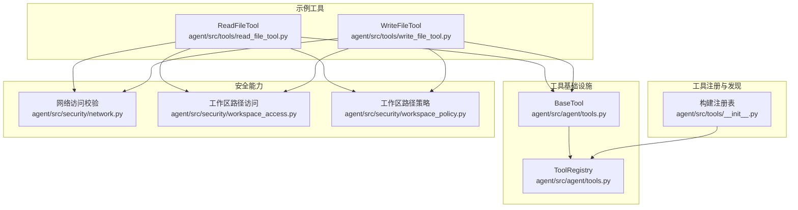
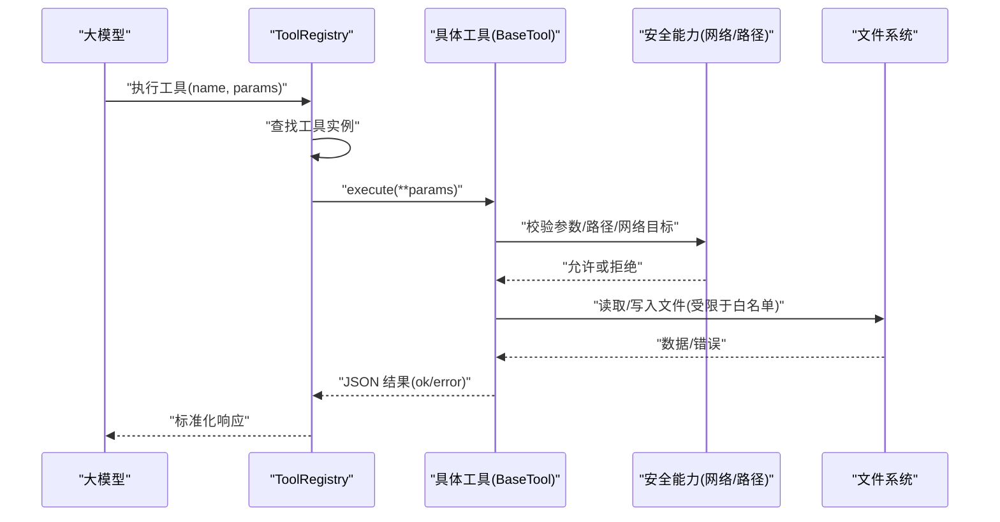
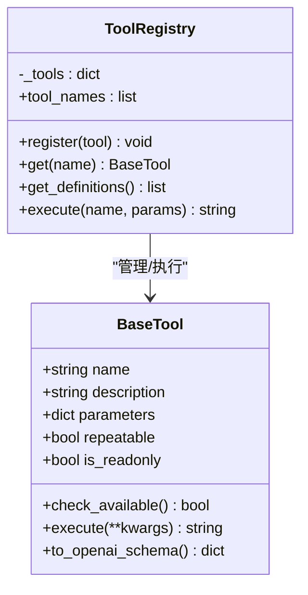
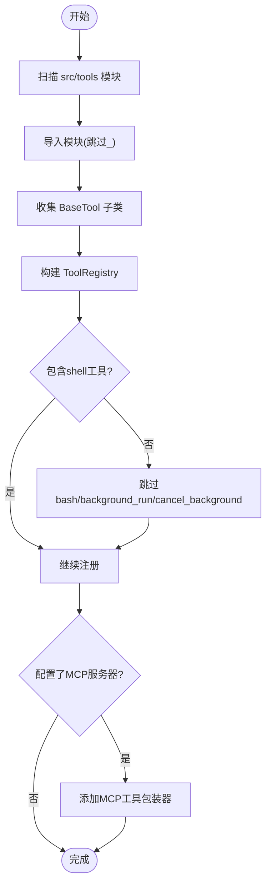
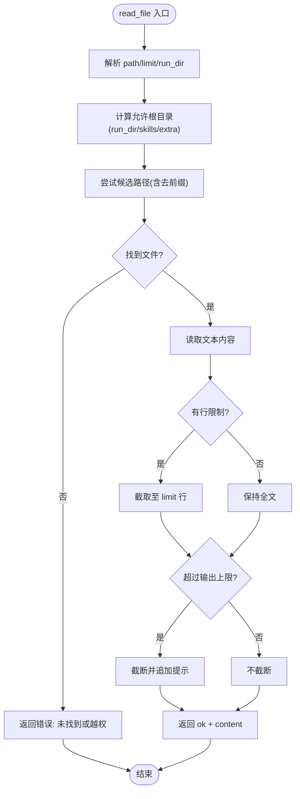
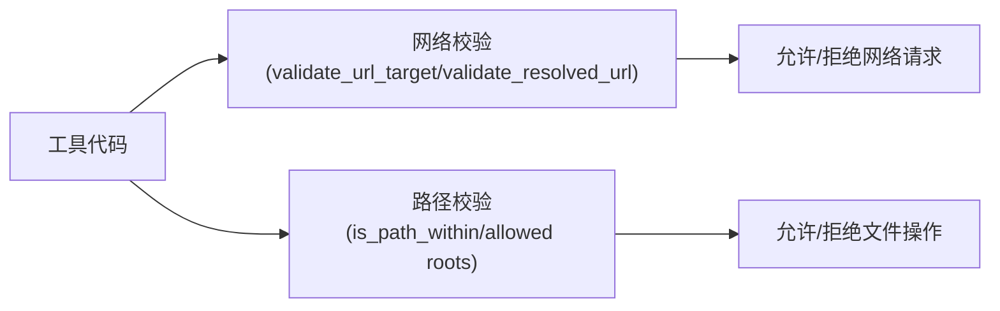
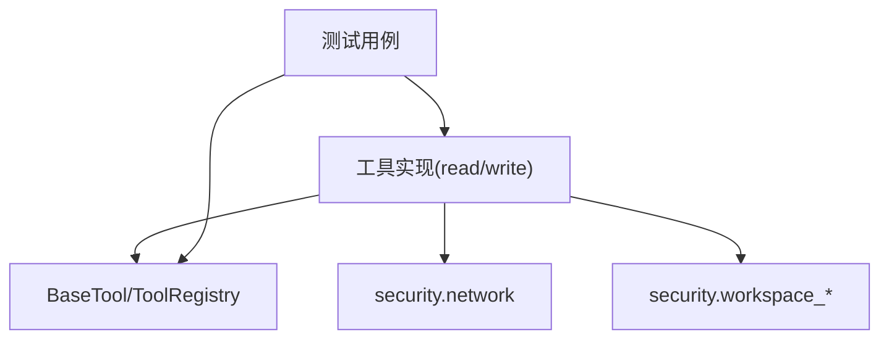

# 自定义工具开发指南

<cite>
**本文引用的文件**
- [agent/src/agent/tools.py](file://agent/src/agent/tools.py)
- [agent/src/tools/__init__.py](file://agent/src/tools/__init__.py)
- [agent/src/tools/read_file_tool.py](file://agent/src/tools/read_file_tool.py)
- [agent/src/tools/write_file_tool.py](file://agent/src/tools/write_file_tool.py)
- [agent/src/tools/path_utils.py](file://agent/src/tools/path_utils.py)
- [agent/src/tools/redaction.py](file://agent/src/tools/redaction.py)
- [agent/src/security/network.py](file://agent/src/security/network.py)
- [agent/src/security/workspace_access.py](file://agent/src/security/workspace_access.py)
- [agent/src/security/workspace_policy.py](file://agent/src/security/workspace_policy.py)
- [agent/tests/test_institutional_holdings_tool.py](file://agent/tests/test_institutional_holdings_tool.py)
- [agent/tests/test_file_tool_sandbox_security.py](file://agent/tests/test_file_tool_sandbox_security.py)
</cite>

## 目录
1. [简介](#简介)
2. [项目结构](#项目结构)
3. [核心组件](#核心组件)
4. [架构总览](#架构总览)
5. [详细组件分析](#详细组件分析)
6. [依赖关系分析](#依赖关系分析)
7. [性能考虑](#性能考虑)
8. [故障排查指南](#故障排查指南)
9. [结论](#结论)
10. [附录](#附录)

## 简介
本指南面向希望在 Vibe-Trading 中开发“自定义工具”的工程师与研究者。你将学习如何基于 BaseTool 类实现可被自动发现、注册和调用的工具，理解参数校验与安全沙箱机制（资源限制、网络访问控制、文件系统权限），掌握单元测试与集成测试策略，并了解工具的部署与分发流程。文末提供从简单到复杂的开发案例与常见陷阱规避建议。

## 项目结构
Vibe-Trading 的工具系统采用“按功能模块组织”的结构：
- 基础框架位于 agent/src/agent/tools.py，定义 BaseTool 与 ToolRegistry。
- 工具自动发现与注册逻辑位于 agent/src/tools/__init__.py。
- 具体工具实现位于 agent/src/tools/ 下的多个文件（如 read_file_tool.py、write_file_tool.py）。
- 安全能力集中在 agent/src/security/，提供网络与路径访问的安全辅助。
- 测试用例位于 agent/tests/，覆盖工具契约、安全边界与行为验证。

图表来源
- [agent/src/agent/tools.py:13-95](file://agent/src/agent/tools.py#L13-L95)
- [agent/src/tools/__init__.py:33-245](file://agent/src/tools/__init__.py#L33-L245)
- [agent/src/tools/read_file_tool.py:18-118](file://agent/src/tools/read_file_tool.py#L18-L118)
- [agent/src/tools/write_file_tool.py:14-107](file://agent/src/tools/write_file_tool.py#L14-L107)
- [agent/src/security/network.py:1-11](file://agent/src/security/network.py#L1-L11)
- [agent/src/security/workspace_access.py:1-15](file://agent/src/security/workspace_access.py#L1-L15)
- [agent/src/security/workspace_policy.py:1-12](file://agent/src/security/workspace_policy.py#L1-L12)

章节来源
- [agent/src/agent/tools.py:13-95](file://agent/src/agent/tools.py#L13-L95)
- [agent/src/tools/__init__.py:33-245](file://agent/src/tools/__init__.py#L33-L245)

## 核心组件
- BaseTool：所有工具的抽象基类，定义 name、description、parameters、repeatable、is_readonly 等属性，以及 check_available()、execute()、to_openai_schema() 等方法。
- ToolRegistry：工具注册与执行中心，负责工具实例的注册、查询、批量导出 OpenAI 函数调用定义，以及统一执行与异常包装。
- 工具自动发现：通过扫描 src/tools 包内的模块，收集 BaseTool 子类并注册；支持可选的 MCP 工具注入与过滤。

关键要点
- 新增工具只需在 src/tools/ 下创建继承 BaseTool 的类，并确保 name 非空即可被自动发现。
- 可通过重写 check_available() 控制工具是否可用（例如缺少依赖时返回 False）。
- execute() 必须返回 JSON 字符串，错误路径也需以 JSON 形式返回，便于上层统一处理。

章节来源
- [agent/src/agent/tools.py:13-95](file://agent/src/agent/tools.py#L13-L95)
- [agent/src/tools/__init__.py:33-63](file://agent/src/tools/__init__.py#L33-L63)

## 架构总览
下图展示了从 LLM 调用到工具执行的完整流程，包括参数校验、安全沙箱检查与结果封装。

图表来源
- [agent/src/agent/tools.py:72-84](file://agent/src/agent/tools.py#L72-L84)
- [agent/src/tools/read_file_tool.py:33-118](file://agent/src/tools/read_file_tool.py#L33-L118)
- [agent/src/tools/write_file_tool.py:30-107](file://agent/src/tools/write_file_tool.py#L30-L107)
- [agent/src/security/network.py:1-11](file://agent/src/security/network.py#L1-L11)
- [agent/src/security/workspace_policy.py:1-12](file://agent/src/security/workspace_policy.py#L1-L12)

## 详细组件分析

### BaseTool 与 ToolRegistry
- BaseTool 提供统一的工具契约：name、description、parameters、repeatable、is_readonly、check_available()、execute()、to_openai_schema()。
- ToolRegistry 提供 register/get/get_definitions/execute/tool_names 等能力，并在 execute 中对异常进行统一捕获与 JSON 包装，确保上层稳定消费。

图表来源
- [agent/src/agent/tools.py:13-95](file://agent/src/agent/tools.py#L13-L95)

章节来源
- [agent/src/agent/tools.py:13-95](file://agent/src/agent/tools.py#L13-L95)

### 工具自动发现与注册
- 通过 _discover_subclasses() 扫描 src/tools 包，忽略前缀为“_”的模块，导入后收集 BaseTool 子类。
- build_registry() 将本地工具注册入 ToolRegistry，并可按需注入 MCP 工具；支持 shell 工具开关、会话 ID 注入、事件回调等。
- build_filtered_registry() 与 build_swarm_registry() 提供按名称过滤与 Swarm 场景的合并策略。

图表来源
- [agent/src/tools/__init__.py:33-63](file://agent/src/tools/__init__.py#L33-L63)
- [agent/src/tools/__init__.py:66-245](file://agent/src/tools/__init__.py#L66-L245)

章节来源
- [agent/src/tools/__init__.py:33-245](file://agent/src/tools/__init__.py#L33-L245)

### 文件系统工具：读与写
- ReadFileTool：读取工作区文件，支持行限制与输出截断；路径解析使用 safe_path，仅允许 run_dir、skills/ 与配置的额外根目录。
- WriteFileTool：写入工作区文件，自动创建父目录；路径解析使用 resolve_safe_path，仅允许 allowed_write_roots() 中的根目录。
- 两者均对内部路径进行脱敏处理，避免泄露敏感信息。

图表来源
- [agent/src/tools/read_file_tool.py:33-118](file://agent/src/tools/read_file_tool.py#L33-L118)
- [agent/src/tools/path_utils.py](file://agent/src/tools/path_utils.py)
- [agent/src/tools/redaction.py](file://agent/src/tools/redaction.py)

章节来源
- [agent/src/tools/read_file_tool.py:18-118](file://agent/src/tools/read_file_tool.py#L18-L118)
- [agent/src/tools/write_file_tool.py:14-107](file://agent/src/tools/write_file_tool.py#L14-L107)
- [agent/src/tools/path_utils.py](file://agent/src/tools/path_utils.py)
- [agent/src/tools/redaction.py](file://agent/src/tools/redaction.py)

### 安全沙箱机制
- 网络访问控制：通过 network.py 暴露 validate_url_target / validate_resolved_url，用于校验 URL 目标与解析后的地址，防止恶意跳转或内网探测。
- 文件系统权限：workspace_access.py 与工作区范围相关错误类型；workspace_policy.py 提供 is_path_within 判断路径是否在允许范围内。
- 工具侧实践：ReadFileTool/WriteFileTool 严格限制允许的根目录，并对内部路径进行脱敏，避免泄露敏感信息。

图表来源
- [agent/src/security/network.py:1-11](file://agent/src/security/network.py#L1-L11)
- [agent/src/security/workspace_access.py:1-15](file://agent/src/security/workspace_access.py#L1-L15)
- [agent/src/security/workspace_policy.py:1-12](file://agent/src/security/workspace_policy.py#L1-L12)
- [agent/src/tools/read_file_tool.py:33-118](file://agent/src/tools/read_file_tool.py#L33-L118)
- [agent/src/tools/write_file_tool.py:30-107](file://agent/src/tools/write_file_tool.py#L30-L107)

章节来源
- [agent/src/security/network.py:1-11](file://agent/src/security/network.py#L1-L11)
- [agent/src/security/workspace_access.py:1-15](file://agent/src/security/workspace_access.py#L1-L15)
- [agent/src/security/workspace_policy.py:1-12](file://agent/src/security/workspace_policy.py#L1-L12)

### 参数验证与错误处理
- 参数校验：在工具 execute() 中显式校验必填字段与类型，必要时结合 JSON Schema 描述（parameters）由上层进行预校验。
- 错误处理：工具应始终返回 JSON 字符串；失败路径返回 {"status":"error","error":...}，避免抛出异常导致上层崩溃。
- 统一包装：ToolRegistry.execute() 捕获异常并转换为错误 JSON，保证稳定性。

章节来源
- [agent/src/agent/tools.py:72-84](file://agent/src/agent/tools.py#L72-L84)
- [agent/src/tools/read_file_tool.py:33-118](file://agent/src/tools/read_file_tool.py#L33-L118)
- [agent/src/tools/write_file_tool.py:30-107](file://agent/src/tools/write_file_tool.py#L30-L107)

## 依赖关系分析
- 工具与基础设施：所有工具依赖 BaseTool 与 ToolRegistry；注册阶段依赖自动发现逻辑。
- 安全依赖：文件工具依赖 path_utils 与 redaction；网络工具依赖 security.network。
- 测试依赖：测试覆盖工具契约、安全边界与行为一致性。

图表来源
- [agent/src/agent/tools.py:13-95](file://agent/src/agent/tools.py#L13-L95)
- [agent/src/tools/read_file_tool.py:18-118](file://agent/src/tools/read_file_tool.py#L18-L118)
- [agent/src/tools/write_file_tool.py:14-107](file://agent/src/tools/write_file_tool.py#L14-L107)
- [agent/src/security/network.py:1-11](file://agent/src/security/network.py#L1-L11)
- [agent/src/security/workspace_access.py:1-15](file://agent/src/security/workspace_access.py#L1-L15)
- [agent/src/security/workspace_policy.py:1-12](file://agent/src/security/workspace_policy.py#L1-L12)

章节来源
- [agent/src/tools/__init__.py:33-245](file://agent/src/tools/__init__.py#L33-L245)
- [agent/src/agent/tools.py:13-95](file://agent/src/agent/tools.py#L13-L95)

## 性能考虑
- 输出限制：ReadFileTool 对输出大小进行截断，避免大文件阻塞传输。
- 缓存与复用：注册阶段的子类发现结果会被缓存，减少重复扫描开销。
- 最小化 I/O：仅在必要时读取文件，且优先使用行限制与增量读取策略。
- 网络限流：在网络访问前进行目标校验，减少无效请求。

[本节为通用指导，无需特定文件引用]

## 故障排查指南
- 工具不可用：检查 check_available() 是否返回 True；确认依赖是否安装或密钥是否配置。
- 路径越权：确认路径是否在 allowed_roots 或 is_path_within 范围内；检查 run_dir 是否正确传入。
- 网络拒绝：确认 URL 目标是否通过 validate_url_target/validate_resolved_url；检查代理或白名单设置。
- 参数错误：核对 parameters 的 required 与类型；在 execute() 中增加更明确的错误消息。
- 日志与调试：利用 ToolRegistry 的统一异常日志定位问题；关注 redaction 输出的脱敏信息。

章节来源
- [agent/src/agent/tools.py:72-84](file://agent/src/agent/tools.py#L72-L84)
- [agent/src/tools/read_file_tool.py:33-118](file://agent/src/tools/read_file_tool.py#L33-L118)
- [agent/src/tools/write_file_tool.py:30-107](file://agent/src/tools/write_file_tool.py#L30-L107)

## 结论
通过 BaseTool 与 ToolRegistry，Vibe-Trading 提供了可扩展、可发现、安全的工具生态。开发者只需遵循统一契约，即可快速实现从简单到复杂的工具，并通过安全沙箱保障运行环境。配合完善的测试与部署流程，可实现高质量的工具交付与维护。

[本节为总结性内容，无需特定文件引用]

## 附录

### 从零到一：自定义工具开发步骤
- 新建工具类：继承 BaseTool，定义 name、description、parameters、repeatable、is_readonly。
- 实现 execute()：处理业务逻辑，严格参数校验，返回 JSON 字符串。
- 可选：重写 check_available() 控制可用性。
- 放置位置：放入 agent/src/tools/ 目录下，确保模块名不以“_”开头。
- 自动发现：重启服务或重新构建注册表即可生效。

章节来源
- [agent/src/tools/__init__.py:33-63](file://agent/src/tools/__init__.py#L33-L63)
- [agent/src/agent/tools.py:13-95](file://agent/src/agent/tools.py#L13-L95)

### 单元测试编写与集成测试策略
- 单元测试：针对工具参数校验、错误路径、返回值结构进行断言；参考现有测试风格。
- 集成测试：验证工具在真实环境中与文件系统、网络、注册表的交互；模拟外部依赖。
- 安全测试：覆盖路径越权、URL 非法目标、输出脱敏等场景。

章节来源
- [agent/tests/test_institutional_holdings_tool.py:1634-1664](file://agent/tests/test_institutional_holdings_tool.py#L1634-L1664)
- [agent/tests/test_file_tool_sandbox_security.py](file://agent/tests/test_file_tool_sandbox_security.py)

### 工具部署与分发
- 本地开发：将工具放入 agent/src/tools/ 并重启服务，自动发现并注册。
- 打包发布：将工具模块随项目一起发布；如需外部依赖，需在 check_available() 中检测并给出友好提示。
- 运行时控制：通过 include_shell_tools 等参数控制危险工具启用；通过 agent_config.mcp_servers 注入远程工具。

章节来源
- [agent/src/tools/__init__.py:66-245](file://agent/src/tools/__init__.py#L66-L245)

### 常见陷阱与调试技巧
- 陷阱：
  - 忘记设置 name 或 name 为空，导致无法被注册。
  - execute() 抛出异常而非返回 JSON 错误，破坏上层稳定性。
  - 路径未限制在白名单，导致越权访问。
  - 网络目标未校验，造成安全风险。
- 调试技巧：
  - 打印 or 记录工具输入参数与中间状态。
  - 使用 ToolRegistry.execute() 的错误包裹信息定位问题。
  - 借助 redaction 输出查看脱敏后的路径与敏感信息。

章节来源
- [agent/src/agent/tools.py:72-84](file://agent/src/agent/tools.py#L72-L84)
- [agent/src/tools/read_file_tool.py:33-118](file://agent/src/tools/read_file_tool.py#L33-L118)
- [agent/src/tools/write_file_tool.py:30-107](file://agent/src/tools/write_file_tool.py#L30-L107)

### 从简单到复杂：开发案例
- 简单案例：实现一个只读的数据查询工具，仅读取配置文件或静态数据，返回结构化结果。
- 中等案例：实现文件读写工具，结合路径白名单与输出限制，确保安全性与性能。
- 复杂案例：实现网络请求工具，结合 URL 校验、超时与重试、结果分页与缓存，并提供完整的错误处理与日志。

[本节为概念性说明，无需特定文件引用]