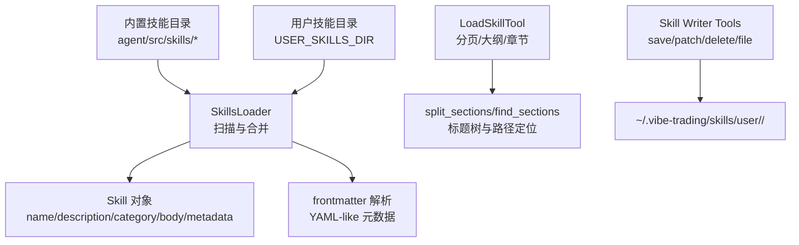
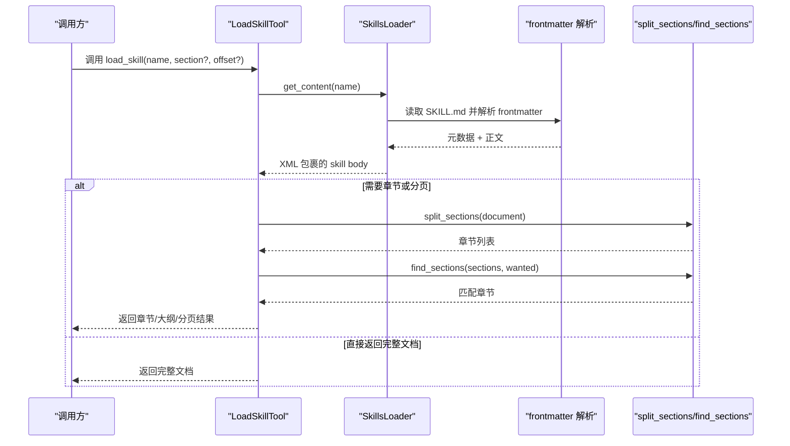
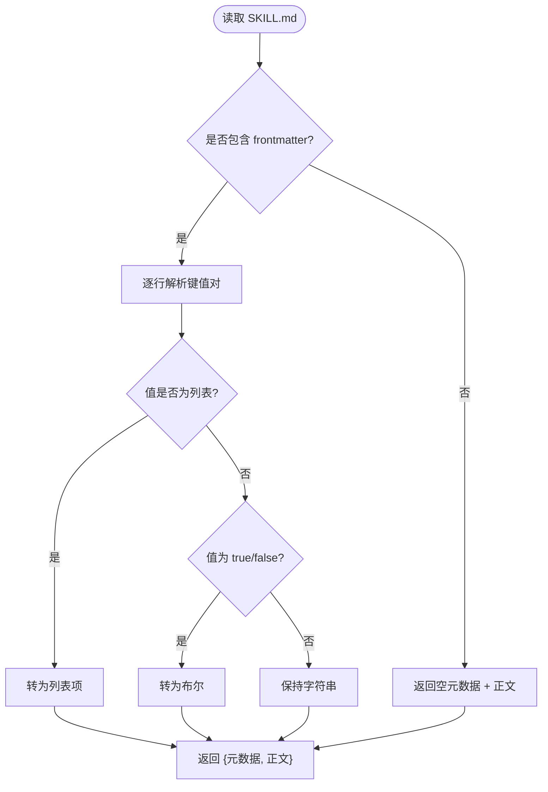
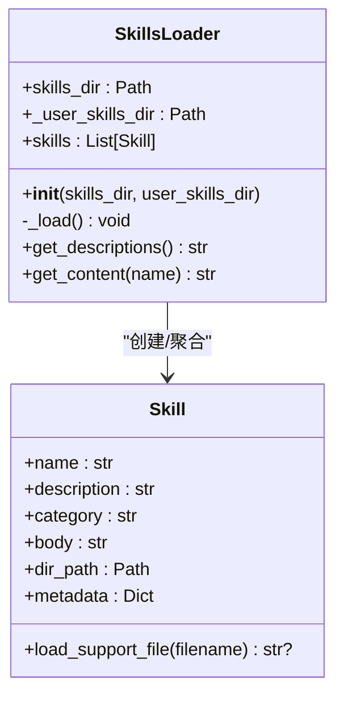
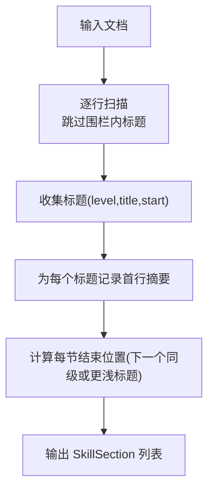
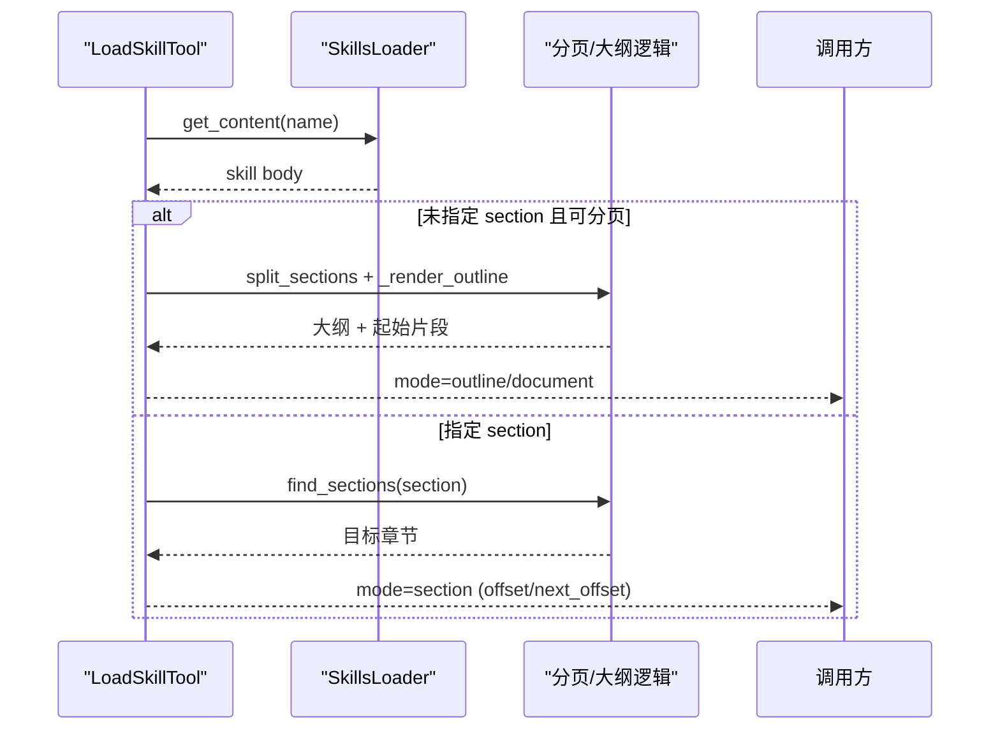
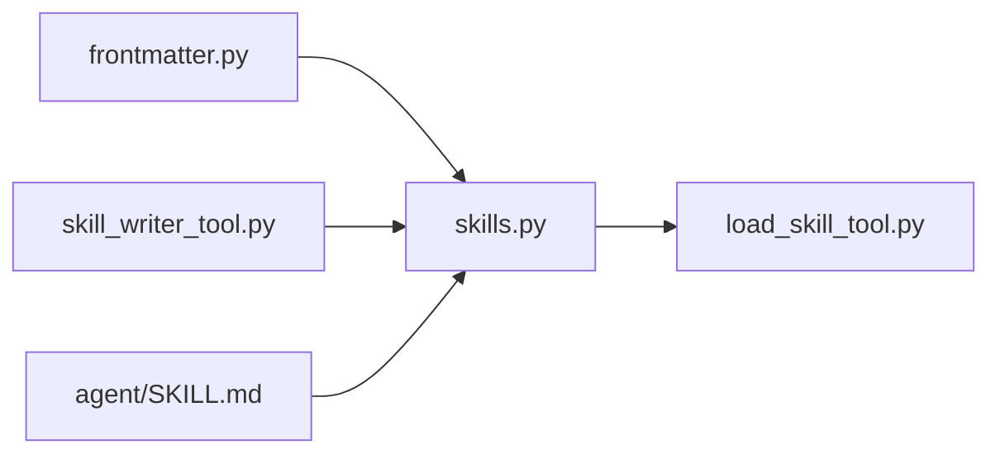

# 技能加载器

<cite>
**本文引用的文件**
- [skills.py](file://agent/src/agent/skills.py)
- [frontmatter.py](file://agent/src/agent/frontmatter.py)
- [load_skill_tool.py](file://agent/src/tools/load_skill_tool.py)
- [skill_writer_tool.py](file://agent/src/tools/skill_writer_tool.py)
- [SKILL.md（根）](file://agent/SKILL.md)
- [strategy-generate/SKILL.md](file://agent/src/skills/strategy-generate/SKILL.md)
- [tushare/SKILL.md](file://agent/src/skills/tushare/SKILL.md)
</cite>

## 目录
1. [简介](#简介)
2. [项目结构](#项目结构)
3. [核心组件](#核心组件)
4. [架构总览](#架构总览)
5. [详细组件分析](#详细组件分析)
6. [依赖关系分析](#依赖关系分析)
7. [性能考量](#性能考量)
8. [故障排查指南](#故障排查指南)
9. [结论](#结论)
10. [附录：开发指南与示例](#附录开发指南与示例)

## 简介
本文件为 Vibe-Trading 技能系统的技术文档，聚焦“技能加载器”的架构设计与实现。内容涵盖：
- 技能定义格式与元数据解析
- 动态加载、版本控制与热重载机制
- 技能与工具的集成方式及技能间协作模式
- 技能开发规范（SKILL.md、脚本编写、测试方法）
- 内置技能特性与使用示例
- 自定义技能的发布与分发流程

## 项目结构
技能系统围绕“文档即实现”的理念构建：每个技能是一个独立目录，包含 SKILL.md（主文档）以及可选的 references/templates/examples/assets 等辅助资源。运行时通过 SkillsLoader 扫描并加载内置与用户技能，LoadSkillTool 提供按需分页与章节定位能力，Skill Writer Tools 支持创建、修补、删除与辅助文件管理。



**图表来源**
- [skills.py:100-136](file://agent/src/agent/skills.py#L100-L136)
- [frontmatter.py:16-48](file://agent/src/agent/frontmatter.py#L16-L48)
- [load_skill_tool.py:150-306](file://agent/src/tools/load_skill_tool.py#L150-L306)
- [skill_writer_tool.py:48-370](file://agent/src/tools/skill_writer_tool.py#L48-L370)

**章节来源**
- [skills.py:1-136](file://agent/src/agent/skills.py#L1-L136)
- [frontmatter.py:1-49](file://agent/src/agent/frontmatter.py#L1-L49)
- [load_skill_tool.py:1-306](file://agent/src/tools/load_skill_tool.py#L1-L306)
- [skill_writer_tool.py:1-370](file://agent/src/tools/skill_writer_tool.py#L1-L370)

## 核心组件
- Skill 数据模型：封装技能名称、描述、分类、正文、目录路径与元数据，并提供按需加载辅助文件的能力。
- SkillsLoader：负责从用户目录与内置目录扫描并去重加载技能；按类别排序输出摘要；支持会话中新增的用户技能即时发现。
- frontmatter 解析器：轻量 YAML-like 解析，提取 name/description/category/dependencies/env/mcp 等字段。
- LoadSkillTool：将技能文档以“完整/大纲/章节/分页”四种模式返回，解决大文档不可用问题。
- Skill Writer Tools：提供 save_skill、patch_skill、delete_skill、skill_file 四个工具，完成用户技能的 CRUD 与辅助文件管理。

**章节来源**
- [skills.py:22-94](file://agent/src/agent/skills.py#L22-L94)
- [skills.py:100-189](file://agent/src/agent/skills.py#L100-L189)
- [frontmatter.py:16-48](file://agent/src/agent/frontmatter.py#L16-L48)
- [load_skill_tool.py:150-306](file://agent/src/tools/load_skill_tool.py#L150-L306)
- [skill_writer_tool.py:48-370](file://agent/src/tools/skill_writer_tool.py#L48-L370)

## 架构总览
技能加载器采用“分层+按需”的设计：
- 元数据层：frontmatter 解析出技能声明式配置（名称、版本、依赖、环境变量、MCP 命令）。
- 装载层：SkillsLoader 合并用户与内置技能，优先用户覆盖同名内置技能。
- 呈现层：LoadSkillTool 根据文档大小与头部结构智能返回“完整/大纲/章节”，并通过 offset 分页。
- 管理层：Skill Writer Tools 维护用户技能生命周期与辅助文件。



**图表来源**
- [load_skill_tool.py:196-306](file://agent/src/tools/load_skill_tool.py#L196-L306)
- [skills.py:166-189](file://agent/src/agent/skills.py#L166-L189)
- [skills.py:229-386](file://agent/src/agent/skills.py#L229-L386)
- [frontmatter.py:16-48](file://agent/src/agent/frontmatter.py#L16-L48)

## 详细组件分析

### 技能定义与元数据解析
- SKILL.md 顶部使用 --- 分隔的 frontmatter 块，支持字符串、列表与布尔值。
- 关键字段包括 name、description、category、version、dependencies、env、mcp 等。
- 解析器对空元数据与无 frontmatter 的情况均兼容处理。



**图表来源**
- [frontmatter.py:10-48](file://agent/src/agent/frontmatter.py#L10-L48)

**章节来源**
- [frontmatter.py:16-48](file://agent/src/agent/frontmatter.py#L16-L48)
- [SKILL.md（根）:1-22](file://agent/SKILL.md#L1-L22)

### 技能动态加载与覆盖策略
- 加载顺序：先用户目录，后内置目录；同名技能以后者被前者覆盖。
- 仅识别包含 SKILL.md 的子目录作为有效技能。
- 会话期间新增的用户技能可通过 get_content 的磁盘回退路径即时发现并追加到内存列表。



**图表来源**
- [skills.py:22-94](file://agent/src/agent/skills.py#L22-L94)
- [skills.py:100-189](file://agent/src/agent/skills.py#L100-L189)

**章节来源**
- [skills.py:100-189](file://agent/src/agent/skills.py#L100-L189)

### 文档大纲与章节定位
- split_sections：忽略代码围栏内的标题，提取 ATX 标题层级，计算每节起止位置与首行摘要。
- ancestor_titles/qualified_path：生成“父 > 子”路径，解决重复标题歧义。
- find_sections/find_section：支持精确与前缀匹配，结合祖先路径进行定位。



**图表来源**
- [skills.py:229-278](file://agent/src/agent/skills.py#L229-L278)
- [skills.py:294-386](file://agent/src/agent/skills.py#L294-L386)

**章节来源**
- [skills.py:229-386](file://agent/src/agent/skills.py#L229-L386)

### 技能加载工具（分页与大纲）
- 小文档：一次性返回完整内容。
- 大文档：首次返回“大纲 + 开头文本”，后续可按 section 或 offset 继续读取。
- 页大小自适应：根据序列化后的 JSON 长度动态调整，保证不超过工具结果限制。



**图表来源**
- [load_skill_tool.py:55-147](file://agent/src/tools/load_skill_tool.py#L55-L147)
- [load_skill_tool.py:196-306](file://agent/src/tools/load_skill_tool.py#L196-L306)

**章节来源**
- [load_skill_tool.py:1-306](file://agent/src/tools/load_skill_tool.py#L1-L306)

### 技能管理与辅助文件
- save_skill：创建或覆盖用户技能，自动补齐 frontmatter。
- patch_skill：在用户目录查找或复制内置技能后进行替换修补。
- delete_skill：删除用户技能目录。
- skill_file：在受允许的 subdirs（references/templates/examples/assets）下写/删/列文件，防止路径穿越。

```mermaid
classDiagram
class SaveSkillTool {
+execute(**kwargs) str
}
class PatchSkillTool {
+execute(**kwargs) str
}
class DeleteSkillTool {
+execute(**kwargs) str
}
class SkillFileTool {
+execute(**kwargs) str
-_list_files(...)
-_write_file(...)
-_remove_file(...)
}
SaveSkillTool --> "写入 ~/.vibe-trading/skills/user/<slug>/SKILL.md"
PatchSkillTool --> "用户目录或复制内置后替换"
DeleteSkillTool --> "删除用户技能目录"
SkillFileTool --> "受限子目录读写"
```

**图表来源**
- [skill_writer_tool.py:48-370](file://agent/src/tools/skill_writer_tool.py#L48-L370)

**章节来源**
- [skill_writer_tool.py:48-370](file://agent/src/tools/skill_writer_tool.py#L48-L370)

## 依赖关系分析
- SkillsLoader 依赖 frontmatter 解析器与文件系统。
- LoadSkillTool 依赖 SkillsLoader 与章节解析工具。
- Skill Writer Tools 依赖 SkillsLoader 暴露的用户目录常量与文件系统安全校验。
- 根 SKILL.md 定义了全局依赖（Python 版本、pip 包、环境变量、MCP 命令），用于技能清单与运行环境约束。



**图表来源**
- [frontmatter.py:16-48](file://agent/src/agent/frontmatter.py#L16-L48)
- [skills.py:100-189](file://agent/src/agent/skills.py#L100-L189)
- [load_skill_tool.py:196-306](file://agent/src/tools/load_skill_tool.py#L196-L306)
- [skill_writer_tool.py:48-370](file://agent/src/tools/skill_writer_tool.py#L48-L370)
- [SKILL.md（根）:1-22](file://agent/SKILL.md#L1-L22)

**章节来源**
- [skills.py:100-189](file://agent/src/agent/skills.py#L100-L189)
- [load_skill_tool.py:196-306](file://agent/src/tools/load_skill_tool.py#L196-L306)
- [skill_writer_tool.py:48-370](file://agent/src/tools/skill_writer_tool.py#L48-L370)
- [SKILL.md（根）:1-22](file://agent/SKILL.md#L1-L22)

## 性能考量
- 渐进式披露：系统提示仅注入技能一行摘要，全文按需加载，降低上下文占用。
- 大纲优先：大文档首次返回大纲与开头文本，避免盲目翻页。
- 自适应分页：根据序列化长度动态调整页大小，确保不超出工具结果限制。
- 章节定位：通过标题树与路径定位，减少无关内容传输。
- 用户覆盖优先：同名用户技能覆盖内置，便于快速迭代与补丁。

[本节为通用指导，无需特定文件引用]

## 故障排查指南
- 未知技能名：检查技能是否存在于用户或内置目录，确认 SKILL.md 存在且 frontmatter 含 name。
- 章节不存在或歧义：使用 outline 中的“父 > 子”路径精确定位；若多个匹配，需提供更完整路径。
- 偏移越界：确认当前章节或文档长度，使用 next_offset 继续读取。
- 辅助文件路径非法：确保路径以允许的子目录开头，且不发生路径穿越。
- 补丁失败：确认待替换文本存在，或先保存/复制技能再执行补丁。

**章节来源**
- [load_skill_tool.py:227-273](file://agent/src/tools/load_skill_tool.py#L227-L273)
- [skill_writer_tool.py:143-186](file://agent/src/tools/skill_writer_tool.py#L143-L186)
- [skill_writer_tool.py:270-370](file://agent/src/tools/skill_writer_tool.py#L270-L370)

## 结论
Vibe-Trading 的技能加载器以“文档即实现”为核心，通过轻量 frontmatter、健壮的分页与章节定位、灵活的用户覆盖机制，实现了高可用、可扩展的技能生态。配合 Skill Writer Tools，开发者可以便捷地创建、修补与管理技能，满足复杂金融研究场景的需求。

[本节为总结性内容，无需特定文件引用]

## 附录：开发指南与示例

### SKILL.md 文件格式规范
- 必须包含 frontmatter 块，至少提供 name；建议补充 description、category、version、dependencies、env、mcp。
- 正文建议使用 ATX 标题组织章节，便于 split_sections 解析。
- 可在技能目录下放置 references/templates/examples/assets 等辅助资源，并通过 load_support_file 按需加载。

**章节来源**
- [frontmatter.py:16-48](file://agent/src/agent/frontmatter.py#L16-L48)
- [skills.py:22-94](file://agent/src/agent/skills.py#L22-L94)
- [SKILL.md（根）:1-22](file://agent/SKILL.md#L1-L22)

### 脚本编写规范（以策略生成为例）
- 遵循 SignalEngine 契约：generate(data_map) -> Dict[str, Series]，信号范围 [-1, 1]。
- 严格对齐索引、纯 pandas/numpy 实现、不含外部库、不硬编码日期与代码。
- config.json 指定 source/codes/时间范围/初始资金/手续费/优化器等参数。
- 多市场策略使用 CompositeEngine 自动对齐日历与共享资金。

**章节来源**
- [strategy-generate/SKILL.md:45-160](file://agent/src/skills/strategy-generate/SKILL.md#L45-L160)
- [strategy-generate/SKILL.md:196-200](file://agent/src/skills/strategy-generate/SKILL.md#L196-L200)

### 测试方法
- 单元测试：针对 load_skill 分页、章节定位、错误处理等路径进行断言。
- 端到端：验证技能加载、大纲生成、章节读取与辅助文件访问。
- 回归：确保同名用户技能覆盖内置行为稳定。

[本节为通用指导，无需特定文件引用]

### 内置技能特性与使用示例
- tushare：提供丰富的财经数据接口说明与环境变量配置指引，适合 A 股与多资产数据获取。
- strategy-generate：完整的策略设计、编码、回测与评估工作流，支持多市场与组合策略。

**章节来源**
- [tushare/SKILL.md:1-50](file://agent/src/skills/tushare/SKILL.md#L1-L50)
- [strategy-generate/SKILL.md:7-43](file://agent/src/skills/strategy-generate/SKILL.md#L7-L43)

### 自定义技能的发布与分发流程
- 创建：使用 save_skill 写入用户目录，自动生成 frontmatter。
- 修补：使用 patch_skill 对现有技能进行精准替换，必要时先复制到用户目录。
- 管理：使用 skill_file 管理 references/templates/examples/assets，注意路径白名单与安全校验。
- 分发：将用户技能目录打包或通过版本管理共享；运行时自动发现并优先加载。

**章节来源**
- [skill_writer_tool.py:48-370](file://agent/src/tools/skill_writer_tool.py#L48-L370)