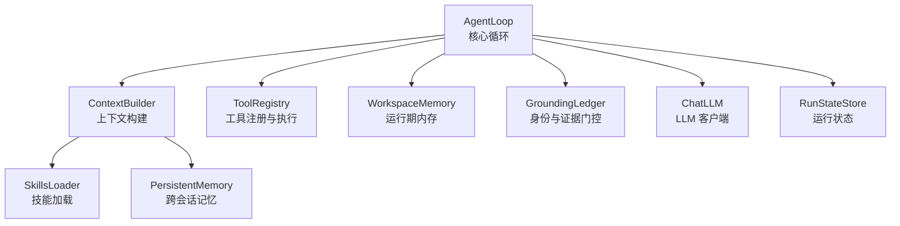
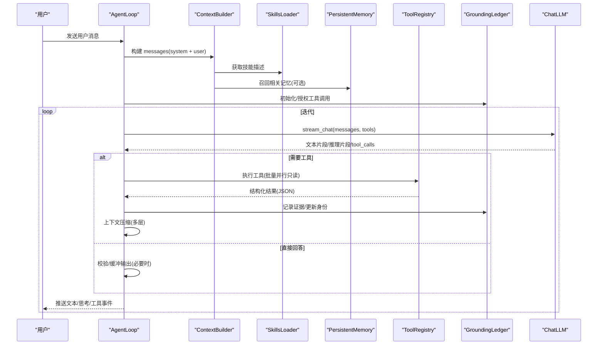
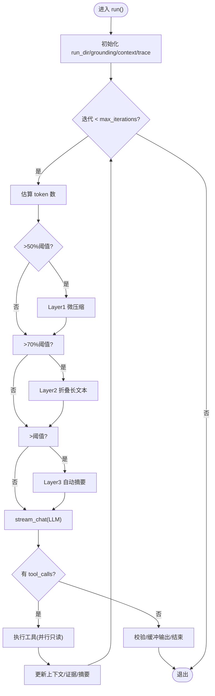
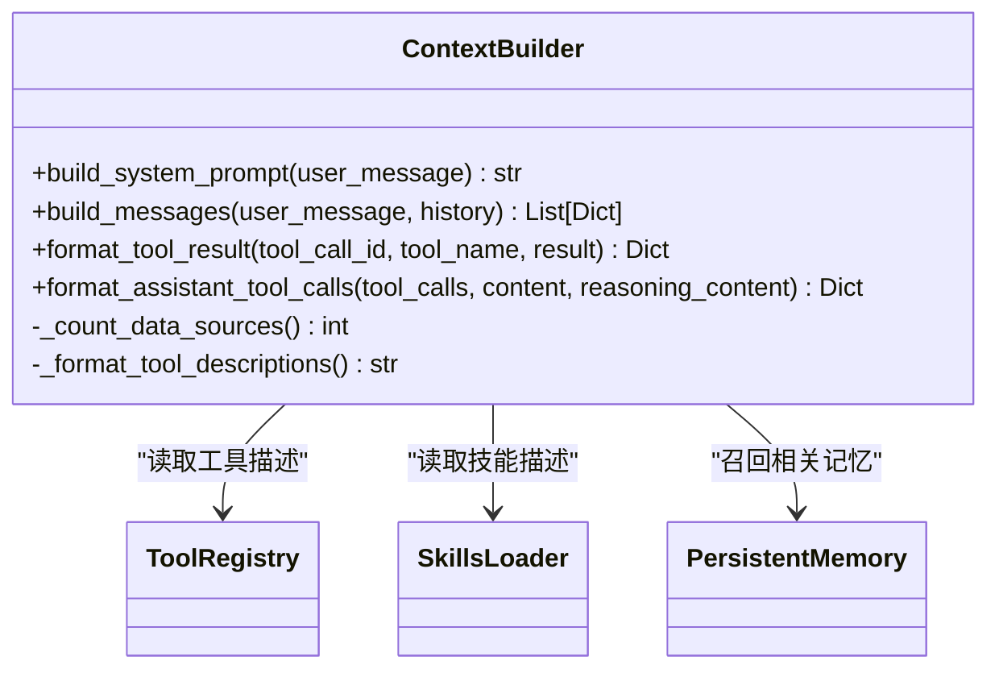
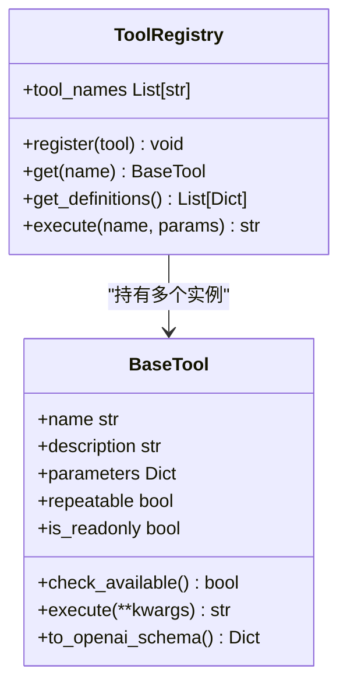
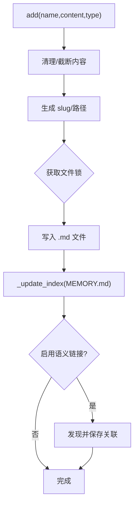
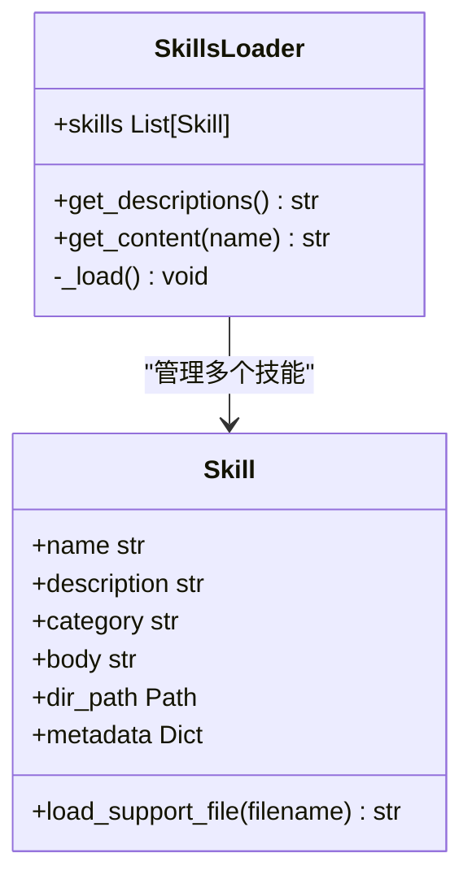
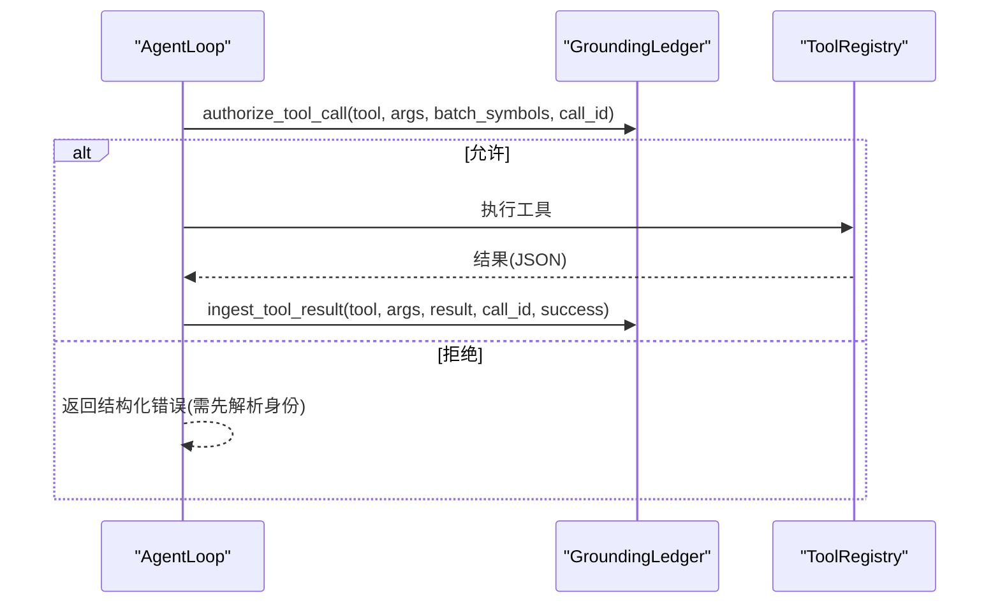
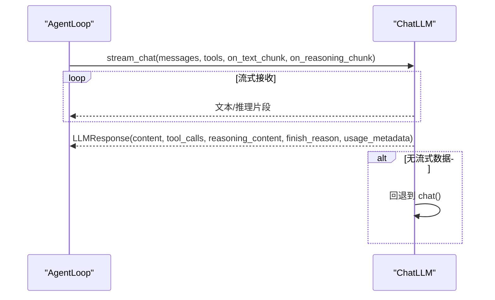
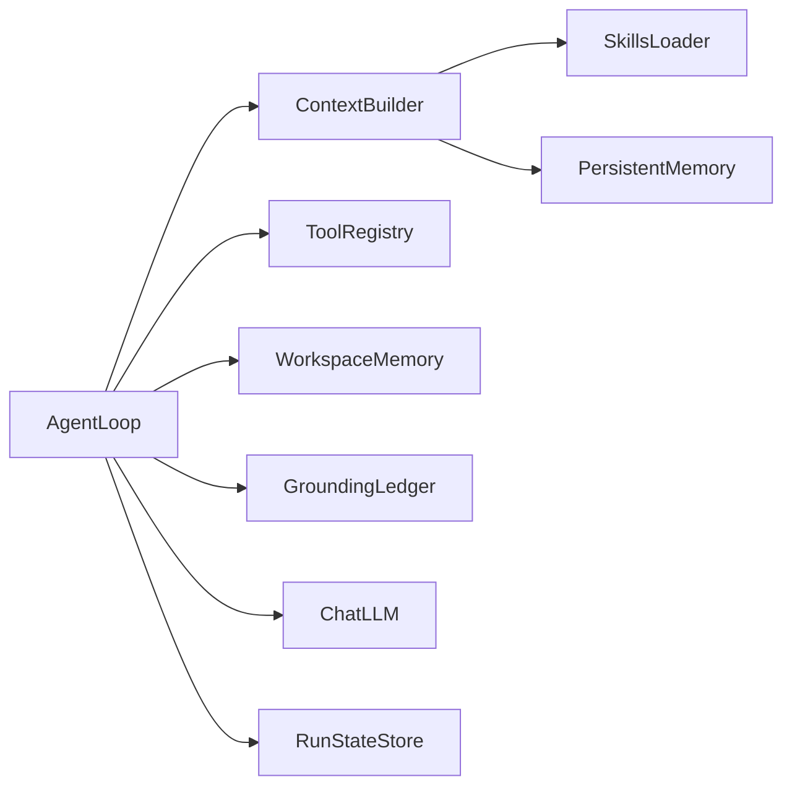

# 核心组件

<cite>
**本文引用的文件**
- [loop.py](file://agent/src/agent/loop.py)
- [context.py](file://agent/src/agent/context.py)
- [tools.py](file://agent/src/agent/tools.py)
- [memory.py](file://agent/src/agent/memory.py)
- [skills.py](file://agent/src/agent/skills.py)
- [persistent.py](file://agent/src/memory/persistent.py)
- [state.py](file://agent/src/core/state.py)
- [grounding.py](file://agent/src/agent/grounding.py)
- [chat.py](file://agent/src/providers/chat.py)
</cite>

## 目录
1. [简介](#简介)
2. [项目结构](#项目结构)
3. [核心组件](#核心组件)
4. [架构总览](#架构总览)
5. [详细组件分析](#详细组件分析)
6. [依赖关系分析](#依赖关系分析)
7. [性能考量](#性能考量)
8. [故障排查指南](#故障排查指南)
9. [结论](#结论)
10. [附录](#附录)

## 简介
本文件面向 Vibe-Trading 的 Agent 核心组件，系统性说明以下能力的设计与实现：
- Agent 核心循环（ReAct）机制：迭代控制、上下文压缩、工具执行批处理、流式输出与取消。
- 上下文管理：系统提示构建、技能与工具描述注入、持久化记忆召回、目标上下文拼接。
- 工具注册系统：BaseTool 抽象、ToolRegistry 注册与执行、OpenAI 函数调用格式导出。
- 记忆存储系统：工作区内存（单次运行内共享）、跨会话持久化记忆（文件索引、去重、重要性衰减、FTS5/语义链接可选）。
- 组件职责边界、接口定义与交互协议。
- 依赖关系、生命周期管理、错误处理、初始化流程、状态同步与数据一致性保证。
- 配置选项、性能调优参数与监控指标。
- 典型使用场景与最佳实践。

## 项目结构
围绕 Agent 核心的关键模块位于 agent/src/agent 与相关支撑模块中：
- 核心循环：AgentLoop（loop.py）
- 上下文构建：ContextBuilder（context.py）
- 工具基础设施：BaseTool、ToolRegistry（tools.py）
- 工作区内存：WorkspaceMemory（memory.py）
- 技能加载：SkillsLoader（skills.py）
- 跨会话持久化记忆：PersistentMemory（persistent.py）
- 运行状态：RunStateStore（state.py）
- 身份与证据校验：GroundingLedger（grounding.py）
- LLM 客户端：ChatLLM（chat.py）

图表来源
- [loop.py:502-700](file://agent/src/agent/loop.py#L502-L700)
- [context.py:210-322](file://agent/src/agent/context.py#L210-L322)
- [tools.py:13-95](file://agent/src/agent/tools.py#L13-L95)
- [memory.py:13-54](file://agent/src/agent/memory.py#L13-L54)
- [skills.py:100-189](file://agent/src/agent/skills.py#L100-L189)
- [persistent.py:196-438](file://agent/src/memory/persistent.py#L196-L438)
- [state.py:13-87](file://agent/src/core/state.py#L13-L87)
- [grounding.py:584-753](file://agent/src/agent/grounding.py#L584-L753)
- [chat.py:272-397](file://agent/src/providers/chat.py#L272-L397)

章节来源
- [loop.py:502-700](file://agent/src/agent/loop.py#L502-L700)
- [context.py:210-322](file://agent/src/agent/context.py#L210-L322)
- [tools.py:13-95](file://agent/src/agent/tools.py#L13-L95)
- [memory.py:13-54](file://agent/src/agent/memory.py#L13-L54)
- [skills.py:100-189](file://agent/src/agent/skills.py#L100-L189)
- [persistent.py:196-438](file://agent/src/memory/persistent.py#L196-L438)
- [state.py:13-87](file://agent/src/core/state.py#L13-L87)
- [grounding.py:584-753](file://agent/src/agent/grounding.py#L584-L753)
- [chat.py:272-397](file://agent/src/providers/chat.py#L272-L397)

## 核心组件
- AgentLoop：ReAct 主循环，负责消息构建、上下文压缩、工具调用编排、流式输出、取消、追踪与使用量统计。
- ContextBuilder：组装 system prompt、技能与工具描述、工作区摘要、持久化记忆召回，生成 OpenAI 格式消息列表。
- ToolRegistry/BaseTool：工具抽象与注册表，统一导出 OpenAI function calling schema，安全执行并返回结构化 JSON。
- WorkspaceMemory：单 run 内的轻量共享状态（run_dir、计数器），用于在上下文中向模型提供“当前工作区”信息。
- SkillsLoader：扫描内置与用户技能目录，按类别输出简要描述；按需加载完整文档，支持分节导航。
- PersistentMemory：基于文件的跨会话记忆，支持索引、关键词检索、重要性衰减、去重、FTS5 与语义链接扩展。
- RunStateStore：创建 run 目录、保存请求与状态（成功/失败/取消），确保状态文件原子写入。
- GroundingLedger：运行级身份与数值证据门控，强制“先解析身份再消费市场数据”，并对最终答案做数值一致性校验。
- ChatLLM：封装 LLM 调用（同步/流式），解析 tool_calls、reasoning_content、usage_metadata，处理内容过滤与异常。

章节来源
- [loop.py:502-700](file://agent/src/agent/loop.py#L502-L700)
- [context.py:210-322](file://agent/src/agent/context.py#L210-L322)
- [tools.py:13-95](file://agent/src/agent/tools.py#L13-L95)
- [memory.py:13-54](file://agent/src/agent/memory.py#L13-L54)
- [skills.py:100-189](file://agent/src/agent/skills.py#L100-L189)
- [persistent.py:196-438](file://agent/src/memory/persistent.py#L196-L438)
- [state.py:13-87](file://agent/src/core/state.py#L13-L87)
- [grounding.py:584-753](file://agent/src/agent/grounding.py#L584-L753)
- [chat.py:272-397](file://agent/src/providers/chat.py#L272-L397)

## 架构总览
下图展示 AgentLoop 作为调度中心，协调上下文、工具、记忆、身份门控与 LLM 的协作关系。

图表来源
- [loop.py:624-800](file://agent/src/agent/loop.py#L624-L800)
- [context.py:286-322](file://agent/src/agent/context.py#L286-L322)
- [tools.py:72-84](file://agent/src/agent/tools.py#L72-L84)
- [grounding.py:666-753](file://agent/src/agent/grounding.py#L666-L753)
- [chat.py:315-397](file://agent/src/providers/chat.py#L315-L397)

## 详细组件分析

### AgentLoop（核心循环）
- 职责边界
  - 控制 ReAct 迭代、上下文压缩策略、工具批处理与并发、流式输出、取消、追踪与用量统计。
  - 维护运行级状态（iteration、summary、cancel event、grounding ledger）。
- 关键流程
  - 初始化：创建/复用 run_dir，初始化 GroundingLedger、ContextBuilder、TraceWriter、LLM 运行时快照。
  - 每轮迭代：估算 token、分层压缩（微压缩/折叠/自动摘要）、注入收尾提示、流式调用 LLM、处理 tool_calls、记录证据、更新上下文。
  - 终止条件：达到最大迭代或模型返回纯文本答案；支持用户取消。
- 上下文压缩五层
  - Layer1 微压缩：仅清理旧工具结果，保留最近 N 条。
  - Layer2 上下文折叠：对长文本进行头尾保留、中间折叠，零 API 成本。
  - Layer3 自动摘要：超过阈值时触发 LLM 结构化摘要，带尾部预算保护。
  - Layer4 显式 compact 工具：由模型主动触发摘要。
  - Layer5 迭代更新：用新对话轮次增量更新历史摘要而非从头开始。
- 工具执行优化
  - 连续只读工具可并行执行（线程池），提升吞吐。
- 错误与恢复
  - 工具执行异常被捕获并转为结构化错误 JSON。
  - 流式中断/空响应回退到非流式调用。
  - 内容过滤触发计数与熔断。
- 监控与追踪
  - 记录每次迭代的 start/message/tool/text_delta/reasoning 等事件。
  - 累积 provider usage（input/output/total tokens、calls），落盘为 llm_usage.json。

图表来源
- [loop.py:624-800](file://agent/src/agent/loop.py#L624-L800)
- [loop.py:227-320](file://agent/src/agent/loop.py#L227-L320)
- [loop.py:175-205](file://agent/src/agent/loop.py#L175-L205)

章节来源
- [loop.py:502-800](file://agent/src/agent/loop.py#L502-L800)
- [loop.py:227-320](file://agent/src/agent/loop.py#L227-L320)
- [loop.py:175-205](file://agent/src/agent/loop.py#L175-L205)

### 上下文管理（ContextBuilder）
- 职责边界
  - 构建 system prompt（注入工具/技能/数据源数量、输出原则、任务路由、当前时间）。
  - 将工作区摘要与持久化记忆召回块注入 user message。
  - 格式化工具结果与 assistant tool_calls 消息。
- 关键特性
  - 系统提示稳定可缓存（输出原则固定文本，不随会话变化）。
  - 持久化记忆召回：根据查询召回最多若干条相关记忆，插入 <recalled-memories> 块。
  - 工具描述动态生成：从 ToolRegistry 提取 schema 与描述，便于模型理解可用能力。
- 数据流
  - build_system_prompt -> build_messages -> 追加 history -> 可选召回记忆 -> 返回消息列表。

图表来源
- [context.py:210-396](file://agent/src/agent/context.py#L210-L396)
- [tools.py:68-70](file://agent/src/agent/tools.py#L68-L70)
- [skills.py:143-189](file://agent/src/agent/skills.py#L143-L189)
- [persistent.py:358-438](file://agent/src/memory/persistent.py#L358-L438)

章节来源
- [context.py:210-396](file://agent/src/agent/context.py#L210-L396)

### 工具注册系统（BaseTool + ToolRegistry）
- BaseTool
  - 定义 name、description、parameters、repeatable、is_readonly 等元信息。
  - check_available 用于依赖检查（如 API Key、包可用性）。
  - execute 必须返回 JSON 字符串，to_openai_schema 导出函数调用 schema。
- ToolRegistry
  - 注册/获取/列举工具，execute 统一捕获异常并返回结构化错误。
  - get_definitions 返回所有工具的 OpenAI function calling 定义，供 LLM 绑定。
- 设计要点
  - 工具以“只读/可写”标记辅助 AgentLoop 进行批处理并行优化。
  - 错误路径标准化，避免下游解析失败。

图表来源
- [tools.py:13-95](file://agent/src/agent/tools.py#L13-L95)

章节来源
- [tools.py:13-95](file://agent/src/agent/tools.py#L13-L95)

### 记忆存储系统（WorkspaceMemory + PersistentMemory）
- WorkspaceMemory（运行期内存）
  - 单 run 内共享，记录 run_dir 与工具调用计数器，生成 to_summary 注入上下文。
  - 生命周期：随 AgentLoop.run() 存在而存在。
- PersistentMemory（跨会话持久化）
  - 文件存储：每个条目一个 .md 文件，含 frontmatter（名称、类型、质量分、访问时间等）。
  - 索引：MEMORY.md 维护条目清单，限制行数避免过大。
  - 检索：关键词搜索（FTS5 可选），结合重要性衰减（访问频率、时间衰减）排序。
  - 去重：滑动窗口哈希去重，防止重复写入。
  - 关联：可选语义链接，增强召回相关性。
  - 层级：可选层次化目录组织。
  - 并发：文件锁保护写入/删除操作。
- 数据一致性
  - 写入前清理控制字符、截断超长内容。
  - 索引重建与 FTS5 索引更新在事务性范围内完成。

图表来源
- [memory.py:13-54](file://agent/src/agent/memory.py#L13-L54)
- [persistent.py:462-578](file://agent/src/memory/persistent.py#L462-L578)
- [persistent.py:41-73](file://agent/src/memory/persistent.py#L41-L73)

章节来源
- [memory.py:13-54](file://agent/src/agent/memory.py#L13-L54)
- [persistent.py:196-637](file://agent/src/memory/persistent.py#L196-L637)

### 技能系统（SkillsLoader）
- 职责边界
  - 扫描内置与用户技能目录，按类别输出简要描述（用于 system prompt）。
  - 按需加载完整技能文档（load_skill 工具调用），支持分节导航（split_sections/find_sections）。
- 关键特性
  - 渐进式披露：系统提示仅注入一行摘要，全文按需加载，减少上下文占用。
  - 用户覆盖：用户技能优先于内置同名技能。
  - 分节解析：跳过代码围栏中的标题，准确映射文档结构。

图表来源
- [skills.py:22-60](file://agent/src/agent/skills.py#L22-L60)
- [skills.py:100-189](file://agent/src/agent/skills.py#L100-L189)
- [skills.py:229-387](file://agent/src/agent/skills.py#L229-L387)

章节来源
- [skills.py:100-189](file://agent/src/agent/skills.py#L100-L189)
- [skills.py:229-387](file://agent/src/agent/skills.py#L229-L387)

### 身份与证据门控（GroundingLedger）
- 职责边界
  - 强制“先解析身份再消费市场数据”，阻止未锁定身份的敏感工具调用。
  - 收集工具结果中的数值证据，并在最终答案阶段进行一致性校验。
- 关键流程
  - authorize_tool_call：根据工具名、参数、批次冻结的身份状态决定允许/拒绝。
  - ingest_tool_result：解析工具结果，抽取符号、字段、时间戳、货币等信息，形成证据记录。
  - should_buffer_output：当存在未验证证据或身份未完成时，缓冲模型输出直至通过校验。
- 设计要点
  - 严格区分“已锁定身份”和“临时符号”，禁止静默后缀重写（如 SH/SS）。
  - 对价格/日期/数量/指标等数字进行正则与上下文识别，避免误报。

图表来源
- [grounding.py:666-753](file://agent/src/agent/grounding.py#L666-L753)
- [grounding.py:789-800](file://agent/src/agent/grounding.py#L789-L800)

章节来源
- [grounding.py:584-753](file://agent/src/agent/grounding.py#L584-L753)
- [grounding.py:789-800](file://agent/src/agent/grounding.py#L789-L800)

### LLM 客户端（ChatLLM）
- 职责边界
  - 封装 LLM 调用（同步/流式），解析 tool_calls、reasoning_content、usage_metadata。
  - 处理内容过滤、流式失败回退、ProviderStreamError 包装。
- 关键特性
  - 支持 DSML 格式的 tool_calls 文本嵌入（某些提供商以文本形式返回）。
  - 合并 provider 特定的 extra_content（如 Gemini thought_signature）。
  - 流式回调：on_text_chunk、on_reasoning_chunk，支持 should_cancel 协作取消。

图表来源
- [chat.py:315-397](file://agent/src/providers/chat.py#L315-L397)
- [chat.py:426-514](file://agent/src/providers/chat.py#L426-L514)

章节来源
- [chat.py:272-397](file://agent/src/providers/chat.py#L272-L397)
- [chat.py:426-514](file://agent/src/providers/chat.py#L426-L514)

## 依赖关系分析
- 松耦合设计
  - AgentLoop 通过接口（ToolRegistry、ChatLLM、WorkspaceMemory、GroundingLedger）与其他模块交互，降低耦合。
  - ContextBuilder 依赖 SkillsLoader 与 PersistentMemory，但仅在构建消息时调用，不影响循环主体。
- 直接依赖
  - AgentLoop -> ContextBuilder、ToolRegistry、WorkspaceMemory、GroundingLedger、ChatLLM、RunStateStore。
  - ContextBuilder -> SkillsLoader、ToolRegistry、PersistentMemory。
  - PersistentMemory -> 文件系统、可选 FTS5/语义链接。
- 潜在循环依赖
  - 未发现明显循环导入；各模块职责清晰，依赖方向单向。
- 外部集成点
  - LLM 提供商（通过 ChatLLM 抽象）。
  - 文件系统（记忆、运行状态、追踪）。
  - 操作系统锁（跨进程/线程安全）。

图表来源
- [loop.py:502-700](file://agent/src/agent/loop.py#L502-L700)
- [context.py:210-322](file://agent/src/agent/context.py#L210-L322)
- [tools.py:13-95](file://agent/src/agent/tools.py#L13-L95)
- [memory.py:13-54](file://agent/src/agent/memory.py#L13-L54)
- [skills.py:100-189](file://agent/src/agent/skills.py#L100-L189)
- [persistent.py:196-438](file://agent/src/memory/persistent.py#L196-L438)
- [state.py:13-87](file://agent/src/core/state.py#L13-L87)
- [grounding.py:584-753](file://agent/src/agent/grounding.py#L584-L753)
- [chat.py:272-397](file://agent/src/providers/chat.py#L272-L397)

章节来源
- [loop.py:502-700](file://agent/src/agent/loop.py#L502-L700)
- [context.py:210-322](file://agent/src/agent/context.py#L210-L322)
- [tools.py:13-95](file://agent/src/agent/tools.py#L13-L95)
- [memory.py:13-54](file://agent/src/agent/memory.py#L13-L54)
- [skills.py:100-189](file://agent/src/agent/skills.py#L100-L189)
- [persistent.py:196-438](file://agent/src/memory/persistent.py#L196-L438)
- [state.py:13-87](file://agent/src/core/state.py#L13-L87)
- [grounding.py:584-753](file://agent/src/agent/grounding.py#L584-L753)
- [chat.py:272-397](file://agent/src/providers/chat.py#L272-L397)

## 性能考量
- 上下文压缩
  - 三层阈值控制（50%/70%/阈值）逐步升级压缩策略，避免过早 LLM 调用。
  - 折叠长文本零 API 成本，显著降低 token 消耗。
- 工具执行
  - 只读工具并行执行，提升吞吐；可写工具串行以保证一致性。
- 流式输出
  - 推理片段节流（最小间隔），避免 UI 回放缓冲区压力。
  - 内容过滤触发计数与熔断，防止无效重试。
- 记忆检索
  - FTS5 加速检索；重要性衰减与访问奖励提升召回质量。
  - 去重窗口防止重复写入。
- 资源限制
  - 工具超时、token 阈值、心跳间隔、流重试延迟等均可通过配置调整。
- 监控指标
  - 每次迭代的 token 估计、LLM usage（input/output/total tokens、calls）、工具调用次数、压缩触发次数、取消次数。

章节来源
- [loop.py:74-120](file://agent/src/agent/loop.py#L74-L120)
- [loop.py:227-320](file://agent/src/agent/loop.py#L227-L320)
- [loop.py:175-205](file://agent/src/agent/loop.py#L175-L205)
- [persistent.py:80-99](file://agent/src/memory/persistent.py#L80-L99)
- [persistent.py:440-460](file://agent/src/memory/persistent.py#L440-L460)

## 故障排查指南
- 工具调用失败
  - 现象：工具返回 error 状态或抛出异常。
  - 处理：ToolRegistry.execute 捕获异常并返回结构化错误；AgentLoop 继续推进或终止。
  - 建议：检查工具依赖（check_available）、参数合法性、网络/权限问题。
- 身份门控拦截
  - 现象：authorize_tool_call 返回 identity_required/identity_conflict/identity_mismatch。
  - 处理：先调用 search_symbol 解析并锁定身份，再发起市场敏感工具调用。
  - 建议：避免静默后缀改写，确保符号与交易所一致。
- 流式失败
  - 现象：ProviderStreamError 或无流式数据。
  - 处理：ChatLLM 自动回退到非流式调用；若仍失败，检查 endpoint、密钥、代理。
  - 建议：确认 base URL 指向 API root，而非站点根。
- 记忆写入冲突
  - 现象：文件锁超时或写入失败。
  - 处理：重试或降级为 best-effort；检查磁盘空间与权限。
  - 建议：避免高频并发写入，合理设置去重窗口。
- 内容过滤
  - 现象：finish_reason 为 content_filter。
  - 处理：调整输入/输出内容，或切换提供商/模型。
  - 建议：关注连续过滤跳过计数，避免无限重试。

章节来源
- [tools.py:72-84](file://agent/src/agent/tools.py#L72-L84)
- [grounding.py:666-753](file://agent/src/agent/grounding.py#L666-L753)
- [chat.py:117-163](file://agent/src/providers/chat.py#L117-L163)
- [chat.py:315-397](file://agent/src/providers/chat.py#L315-L397)
- [persistent.py:41-73](file://agent/src/memory/persistent.py#L41-L73)

## 结论
Vibe-Trading 的 Agent 核心组件以 AgentLoop 为中心，围绕上下文管理、工具注册、记忆存储、身份门控与 LLM 客户端构建了高内聚、低耦合的体系。其设计强调：
- 可解释性与可审计：系统提示固定、工具调用结构化、证据链完整。
- 可扩展性：技能与工具可插拔，记忆系统支持多种后端与索引。
- 鲁棒性：多层上下文压缩、流式回退、内容过滤熔断、文件锁与去重。
- 可观测性：追踪、用量统计、状态文件与运行清单。

通过合理配置与调优，可在不同规模与复杂度的交易研究场景中稳定运行。

## 附录

### 组件初始化流程
- AgentLoop.run
  - 创建/复用 run_dir，初始化 GroundingLedger、ContextBuilder、TraceWriter、LLM 运行时快照。
  - 构建 messages（system + user + 可选历史 + 记忆召回）。
- ContextBuilder.build_system_prompt
  - 注入工具/技能/数据源数量、输出原则、任务路由、当前时间。
- PersistentMemory
  - 启动时加载 MEMORY.md 快照，后续按需扫描与索引更新。
- RunStateStore
  - 创建 run 目录（code/logs/artifacts），保存 req.json 与 state.json。

章节来源
- [loop.py:624-700](file://agent/src/agent/loop.py#L624-L700)
- [context.py:235-268](file://agent/src/agent/context.py#L235-L268)
- [persistent.py:196-220](file://agent/src/memory/persistent.py#L196-L220)
- [state.py:16-47](file://agent/src/core/state.py#L16-L47)

### 状态同步与数据一致性
- 运行状态
  - state.json 原子写入（fsync），区分 success/failed/cancelled。
- 记忆一致性
  - 文件锁保护写入/删除；索引重建与 FTS5 更新在事务范围内。
  - 去重窗口与重要性衰减保证检索质量与稳定性。
- 身份一致性
  - 批次冻结身份快照，禁止同批次内消费 resolver 结果。
  - 严格符号匹配，禁止静默后缀改写。

章节来源
- [state.py:79-87](file://agent/src/core/state.py#L79-L87)
- [persistent.py:41-73](file://agent/src/memory/persistent.py#L41-L73)
- [grounding.py:666-753](file://agent/src/agent/grounding.py#L666-L753)

### 配置选项与性能调优
- 令牌阈值与心跳
  - token_threshold、vt_heartbeat_interval_s、vt_reasoning_delta_min_interval_s。
- 工具超时
  - vibe_trading_tool_timeout_seconds。
- 记忆
  - decay_enabled、quality_enabled、fts_index_enabled、links_enabled、hierarchy_enabled。
- LLM
  - langchain_provider、langchain_model_name、langchain_reasoning_effort。
- 建议
  - 根据上下文长度调整 token_threshold；在高并发下增大心跳间隔以减少开销。
  - 启用 FTS5 与语义链接以提升记忆检索效率；合理设置去重窗口。

章节来源
- [loop.py:74-120](file://agent/src/agent/loop.py#L74-L120)
- [persistent.py:80-99](file://agent/src/memory/persistent.py#L80-L99)
- [chat.py:281-297](file://agent/src/providers/chat.py#L281-L297)

### 监控指标
- 每次迭代
  - 估算 token、压缩触发次数、工具调用次数、取消标志。
- LLM 用量
  - input_tokens、output_tokens、total_tokens、calls（per_iteration 与 totals）。
- 记忆
  - 条目数量、检索命中率、去重命中、FTS5 重建次数。
- 身份
  - authorized_symbols 集合、identity_status、validation_count。

章节来源
- [loop.py:175-205](file://agent/src/agent/loop.py#L175-L205)
- [grounding.py:658-664](file://agent/src/agent/grounding.py#L658-L664)
- [persistent.py:309-438](file://agent/src/memory/persistent.py#L309-L438)

### 典型使用场景与最佳实践
- 场景一：快速市场数据查询
  - 先调用 search_symbol 锁定身份，再调用市场数据工具；避免静默后缀改写。
- 场景二：策略回测与分析
  - 使用 load_skill 加载策略技能，按步骤生成信号引擎、运行回测、后验归因。
- 场景三：跨会话知识积累
  - 使用 remember 工具保存关键洞察；下次会话自动召回相关记忆。
- 最佳实践
  - 保持工具调用幂等；对只读工具批量并行；对可写工具串行执行。
  - 合理设置上下文压缩阈值；避免过长文本导致频繁摘要。
  - 关注内容过滤与流式失败，及时调整输入或提供商。

章节来源
- [context.py:23-200](file://agent/src/agent/context.py#L23-L200)
- [loop.py:227-320](file://agent/src/agent/loop.py#L227-L320)
- [persistent.py:462-578](file://agent/src/memory/persistent.py#L462-L578)