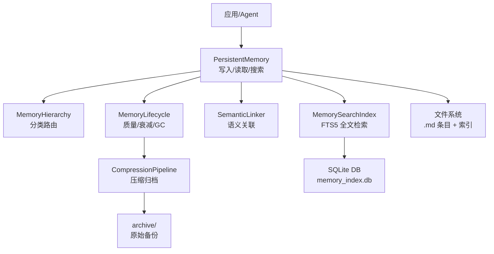
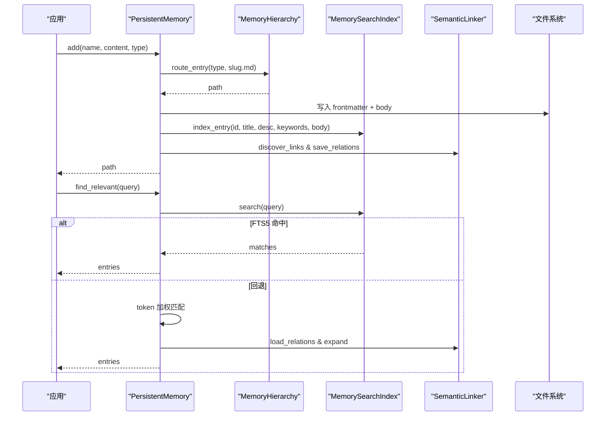
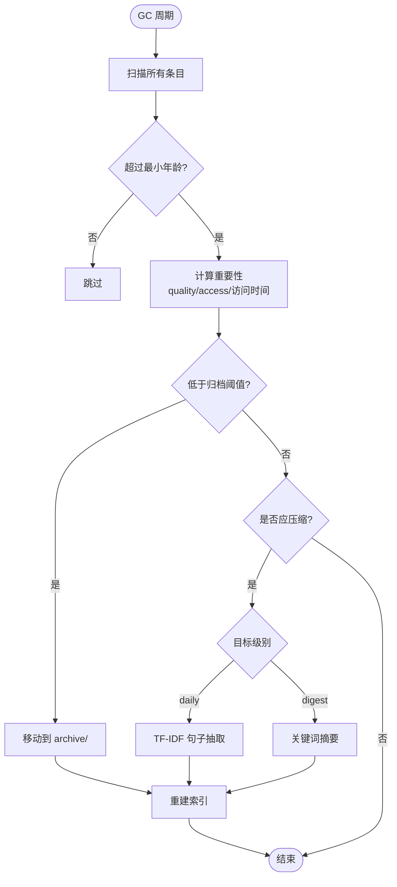
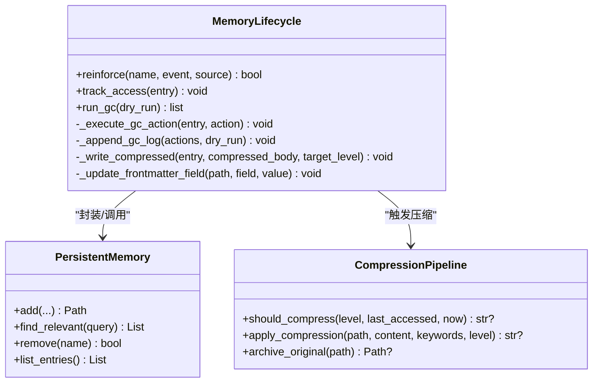
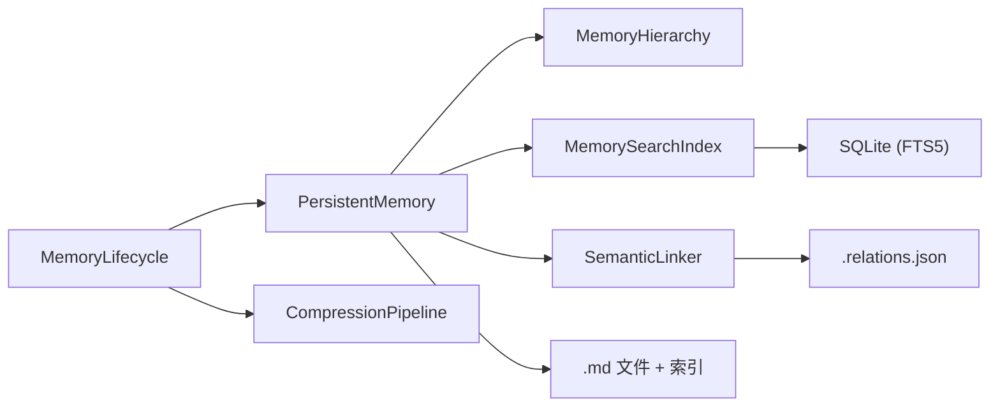

# 分层记忆架构

<cite>
**本文引用的文件**
- [persistent.py](file://agent/src/memory/persistent.py)
- [hierarchy.py](file://agent/src/memory/hierarchy.py)
- [lifecycle.py](file://agent/src/memory/lifecycle.py)
- [compression.py](file://agent/src/memory/compression.py)
- [search_index.py](file://agent/src/memory/search_index.py)
- [semantic_links.py](file://agent/src/memory/semantic_links.py)
- [test_memory_lifecycle.py](file://agent/tests/test_memory_lifecycle.py)
</cite>

## 目录
1. [简介](#简介)
2. [项目结构](#项目结构)
3. [核心组件](#核心组件)
4. [架构总览](#架构总览)
5. [详细组件分析](#详细组件分析)
6. [依赖关系分析](#依赖关系分析)
7. [性能考量](#性能考量)
8. [故障排查指南](#故障排查指南)
9. [结论](#结论)
10. [附录](#附录)

## 简介
本文件为 Vibe-Trading 的分层记忆架构提供系统化、可操作的文档。该架构将“工作记忆”“短期记忆”“长期记忆”以三层设计实现：
- 工作记忆（Tier 1）：当前会话内快速读写、去重与索引快照，面向低延迟检索与上下文注入。
- 短期记忆（Tier 2）：基于文件的持久化存储，支持分类路由、全文检索、语义链接与压缩归档。
- 长期记忆（Tier 3）：生命周期管理驱动的衰减、回收与归档，确保容量可控与知识保鲜。

文档覆盖各层级存储策略、数据流转机制、生命周期管理、迁移算法、容量限制、优先级排序、配置参数、性能指标与调优建议，并给出典型使用模式与最佳实践。

## 项目结构
记忆子系统位于 agent/src/memory，核心模块如下：
- persistent.py：持久化内存的实体、写入、读取、搜索入口与基础索引。
- hierarchy.py：按 memory_type 分类的目录路由与扫描优化。
- lifecycle.py：质量评分、重要性衰减、垃圾回收与压缩触发。
- compression.py：三级压缩管线（raw → daily → digest），保留关键信息。
- search_index.py：SQLite FTS5 全文检索索引，支持 CJK 分词与自动重建。
- semantic_links.py：BM25 语义关联发现与侧车文件维护。

图表来源
- [persistent.py:196-637](file://agent/src/memory/persistent.py#L196-L637)
- [hierarchy.py:34-436](file://agent/src/memory/hierarchy.py#L34-L436)
- [search_index.py:113-481](file://agent/src/memory/search_index.py#L113-L481)
- [semantic_links.py:158-372](file://agent/src/memory/semantic_links.py#L158-L372)
- [lifecycle.py:71-421](file://agent/src/memory/lifecycle.py#L71-L421)
- [compression.py:160-353](file://agent/src/memory/compression.py#L160-L353)

章节来源
- [persistent.py:196-637](file://agent/src/memory/persistent.py#L196-L637)
- [hierarchy.py:34-436](file://agent/src/memory/hierarchy.py#L34-L436)
- [search_index.py:113-481](file://agent/src/memory/search_index.py#L113-L481)
- [semantic_links.py:158-372](file://agent/src/memory/semantic_links.py#L158-L372)
- [lifecycle.py:71-421](file://agent/src/memory/lifecycle.py#L71-L421)
- [compression.py:160-353](file://agent/src/memory/compression.py#L160-L353)

## 核心组件
- PersistentMemory：跨会话持久化存储，负责条目增删改查、去重、索引更新、可选 FTS5 索引与语义链接集成。
- MemoryHierarchy：按 memory_type 分类的目录路由，提升扫描与检索效率。
- MemoryLifecycle：质量评分、访问追踪、重要性衰减、垃圾回收与压缩触发。
- CompressionPipeline：三级压缩（raw/daily/digest），基于 TF-IDF 句子抽取与关键词摘要。
- MemorySearchIndex：SQLite FTS5 全文检索，CJK 分词与自动重建。
- SemanticLinker：BM25 相似度计算，维护 .relations.json 侧车文件。

章节来源
- [persistent.py:122-637](file://agent/src/memory/persistent.py#L122-L637)
- [hierarchy.py:34-436](file://agent/src/memory/hierarchy.py#L34-L436)
- [lifecycle.py:71-421](file://agent/src/memory/lifecycle.py#L71-L421)
- [compression.py:160-353](file://agent/src/memory/compression.py#L160-L353)
- [search_index.py:113-481](file://agent/src/memory/search_index.py#L113-L481)
- [semantic_links.py:158-372](file://agent/src/memory/semantic_links.py#L158-L372)

## 架构总览
分层记忆通过“写路径”和“读路径”协同工作：
- 写路径：应用调用 PersistentMemory.add()，根据配置选择是否走 hierarchy 路由；写入 .md 文件并更新 MEMORY.md 索引；可选地更新 FTS5 索引与语义链接。
- 读路径：find_relevant() 优先尝试 FTS5 检索，失败或无结果时回退到 token 加权匹配；若启用语义链接，扩展相关条目。
- 生命周期：周期性 GC 评估重要性，触发归档/删除（默认仅归档）；对老化条目触发压缩，降低体积并保留关键信息。

图表来源
- [persistent.py:462-578](file://agent/src/memory/persistent.py#L462-L578)
- [persistent.py:358-438](file://agent/src/memory/persistent.py#L358-L438)
- [hierarchy.py:70-90](file://agent/src/memory/hierarchy.py#L70-L90)
- [search_index.py:207-302](file://agent/src/memory/search_index.py#L207-L302)
- [semantic_links.py:179-230](file://agent/src/memory/semantic_links.py#L179-L230)

## 详细组件分析

### 工作记忆（Tier 1）：会话内快速存取与快照
- 目标：在单次会话中提供低延迟的上下文注入与重复写入保护。
- 关键点：
  - 快照：初始化时加载 MEMORY.md 前若干行作为系统提示注入的冻结快照，避免频繁 IO。
  - 去重：基于内容哈希与滑动窗口（默认 30 秒）阻止短时间内重复写入。
  - 索引：MEMORY.md 维护条目清单，便于快速列举与注入。
- 复杂度：
  - 去重检查 O(1) 平均（哈希表）。
  - 快照构建 O(n) n 为索引行数（受 MAX_INDEX_LINES 限制）。

章节来源
- [persistent.py:207-220](file://agent/src/memory/persistent.py#L207-L220)
- [persistent.py:440-460](file://agent/src/memory/persistent.py#L440-L460)
- [persistent.py:609-637](file://agent/src/memory/persistent.py#L609-L637)

### 短期记忆（Tier 2）：持久化存储、分类路由、检索与压缩
- 存储策略：
  - 扁平兼容：未启用层级时，条目存放于根目录。
  - 层级路由：启用后按 user/feedback/project/reference 子目录组织，支持 O(category_size) 范围扫描。
- 检索机制：
  - FTS5 优先：O(log n) 全文检索，支持 CJK 分词与片段高亮。
  - 回退匹配：token 加权（标题/描述/关键词/正文）+ 重要性衰减因子。
  - 语义扩展：基于 BM25 的相关条目追加。
- 压缩管线：
  - raw → daily：TF-IDF 句子抽取，保留首尾句与 top-k 关键句。
  - daily → digest：提取高频重要术语，生成要点列表。
  - 归档：压缩前原子复制至 archive/，保证数据安全。
- 容量与优先级：
  - 最大条目数、归档/删除阈值、最小年龄等由生命周期控制。
  - 检索优先级：FTS5 > token 匹配 > 语义扩展。

图表来源
- [lifecycle.py:183-273](file://agent/src/memory/lifecycle.py#L183-L273)
- [compression.py:168-353](file://agent/src/memory/compression.py#L168-L353)
- [persistent.py:630-637](file://agent/src/memory/persistent.py#L630-L637)

章节来源
- [hierarchy.py:70-176](file://agent/src/memory/hierarchy.py#L70-L176)
- [search_index.py:252-302](file://agent/src/memory/search_index.py#L252-L302)
- [persistent.py:358-438](file://agent/src/memory/persistent.py#L358-L438)
- [compression.py:194-353](file://agent/src/memory/compression.py#L194-L353)

### 长期记忆（Tier 3）：生命周期管理与知识保鲜
- 质量评分与访问追踪：
  - reinforce(event) 根据事件类型调整 quality_score，带会话级增量上限防止抖动。
  - track_access(entry) 记录访问次数与最近访问时间。
- 重要性衰减：
  - compute_importance() 采用艾宾浩斯风格指数衰减，结合访问奖励，得到最终重要性。
- 垃圾回收：
  - 依据重要性阈值决定归档或删除（默认仅归档），并记录 gc.log。
  - 触发压缩：对老化条目进行压缩，减少体积同时保留关键信息。
- 原子性与一致性：
  - 所有写操作通过文件锁保障单写者模型，避免并发损坏。

图表来源
- [lifecycle.py:71-421](file://agent/src/memory/lifecycle.py#L71-L421)
- [persistent.py:196-637](file://agent/src/memory/persistent.py#L196-L637)
- [compression.py:160-353](file://agent/src/memory/compression.py#L160-L353)

章节来源
- [lifecycle.py:71-421](file://agent/src/memory/lifecycle.py#L71-L421)
- [persistent.py:80-92](file://agent/src/memory/persistent.py#L80-L92)

### 检索与语义增强
- FTS5 全文检索：
  - 支持 CJK 字符的单字与双字组合，提高中文检索召回率。
  - 自动重建：首次空查询且磁盘存在条目时，自动全量重建索引。
- 语义链接：
  - BM25 相似度计算，限制最大出边数量与最低分数阈值。
  - 侧车文件 .relations.json 原子写入，崩溃安全。
  - 解析 wikilink [[id]] 显式引用。

章节来源
- [search_index.py:33-94](file://agent/src/memory/search_index.py#L33-L94)
- [search_index.py:207-302](file://agent/src/memory/search_index.py#L207-L302)
- [semantic_links.py:73-150](file://agent/src/memory/semantic_links.py#L73-L150)
- [semantic_links.py:179-372](file://agent/src/memory/semantic_links.py#L179-L372)

## 依赖关系分析
- 模块耦合：
  - PersistentMemory 为核心枢纽，依赖 hierarchy、search_index、semantic_links 与 lifecycle。
  - lifecycle 依赖 persistent 提供的 entry 与工具函数，并驱动 compression。
  - search_index 独立维护 SQLite 数据库，与 persistent 解耦但通过 ID 对齐。
  - semantic_links 通过 BM25 与 persistent 的 tokenization 保持一致性。
- 外部依赖：
  - SQLite（FTS5）、fcntl（文件锁）、json、re、math、time 等标准库。
- 潜在循环依赖：
  - 通过条件导入与懒加载避免启动期循环依赖。

图表来源
- [persistent.py:196-637](file://agent/src/memory/persistent.py#L196-L637)
- [lifecycle.py:71-421](file://agent/src/memory/lifecycle.py#L71-L421)
- [search_index.py:113-481](file://agent/src/memory/search_index.py#L113-L481)
- [semantic_links.py:158-372](file://agent/src/memory/semantic_links.py#L158-L372)

章节来源
- [persistent.py:196-637](file://agent/src/memory/persistent.py#L196-L637)
- [lifecycle.py:71-421](file://agent/src/memory/lifecycle.py#L71-L421)
- [search_index.py:113-481](file://agent/src/memory/search_index.py#L113-L481)
- [semantic_links.py:158-372](file://agent/src/memory/semantic_links.py#L158-L372)

## 性能考量
- 检索性能：
  - 启用 FTS5 可将检索从 O(n) 降至近似 O(log n)，显著提升大规模记忆下的响应时间。
  - 首次空查询会触发全量重建，建议在冷启动或批量导入后主动重建。
- 写入性能：
  - 文件锁串行化写操作，避免并发竞争；在高并发场景下需评估锁等待开销。
  - 去重窗口限制重复写入，降低冗余 IO。
- 存储与压缩：
  - 层级目录减少扫描范围；压缩降低磁盘占用与传输成本。
  - 归档策略平衡空间与可恢复性，默认仅归档不删除。
- 监控指标建议：
  - 检索命中率、FTS5 可用性、索引大小、条目总数、压缩比率、GC 动作频率、锁等待超时次数。

[本节为通用性能讨论，无需特定文件引用]

## 故障排查指南
- 常见问题与定位：
  - 检索结果为空：检查 FTS5 是否可用；必要时手动重建索引或回退到 token 匹配。
  - 写入失败：确认文件锁获取成功；查看日志中的超时与异常。
  - 压缩失败：检查 archive 目录权限；确认原始文件存在。
  - 语义链接缺失：确认 links_enabled 配置；检查 .relations.json 是否存在与格式正确。
- 日志与调试：
  - gc.log 记录归档/删除决策与原因。
  - 模块日志输出包含详细错误堆栈，便于定位问题。

章节来源
- [lifecycle.py:300-318](file://agent/src/memory/lifecycle.py#L300-L318)
- [search_index.py:160-173](file://agent/src/memory/search_index.py#L160-L173)
- [compression.py:258-291](file://agent/src/memory/compression.py#L258-L291)
- [semantic_links.py:232-281](file://agent/src/memory/semantic_links.py#L232-L281)

## 结论
Vibe-Trading 的分层记忆架构通过工作记忆、短期记忆与长期记忆的清晰分工，实现了高效、可靠、可扩展的记忆管理。其核心优势包括：
- 分层优化：工作记忆低延迟、短期记忆强检索与压缩、长期记忆保真与容量控制。
- 灵活配置：通过环境变量开关功能特性，适配不同场景需求。
- 健壮性：原子写入、文件锁、归档与回退机制保障数据安全。
- 可观测性：日志与指标便于监控与调优。

建议在生产环境中启用 FTS5、语义链接与压缩，并结合业务负载调整 GC 阈值与压缩策略，以获得最佳性能与资源利用率。

[本节为总结性内容，无需特定文件引用]

## 附录

### 配置参数与环境变量
- VT_MEMORY_QUALITY：启用质量评分与访问追踪。
- VT_MEMORY_GC：启用垃圾回收。
- VT_MEMORY_DECAY：启用重要性衰减。
- VT_MEMORY_COMPRESSION：启用压缩管线。
- VT_MEMORY_FTS_INDEX：启用 FTS5 全文检索。
- VT_MEMORY_LINKS：启用语义链接。
- VT_MEMORY_HIERARCHY：启用层级目录路由。

章节来源
- [lifecycle.py:35-53](file://agent/src/memory/lifecycle.py#L35-L53)
- [search_index.py:1-9](file://agent/src/memory/search_index.py#L1-L9)
- [hierarchy.py:1-7](file://agent/src/memory/hierarchy.py#L1-L7)
- [compression.py:1-7](file://agent/src/memory/compression.py#L1-L7)

### 容量限制与阈值
- 最大条目数：MAX_MEMORY_COUNT = 500（用于 GC 参考）。
- 归档阈值：importance < 0.15 时归档。
- 删除阈值：importance < 0.05 时删除（默认关闭，仅归档）。
- 最小年龄：MIN_AGE_DAYS = 7（未满不处理）。
- 去重窗口：DEDUP_WINDOW_SECONDS = 30.0。
- 索引行数限制：MAX_INDEX_LINES = 200。
- 条目体长度限制：MAX_ENTRY_CHARS = 8000。

章节来源
- [lifecycle.py:92-98](file://agent/src/memory/lifecycle.py#L92-L98)
- [persistent.py:21-33](file://agent/src/memory/persistent.py#L21-L33)

### 迁移与兼容性
- 层级迁移：migrate_flat_entry() 将扁平条目迁移至分类目录。
- 后缀修复：recover_extensionless_entries() 修复无 .md 后缀的孤儿条目。
- 向后兼容：扁平存储与层级存储并存，扫描时合并结果。

章节来源
- [hierarchy.py:92-143](file://agent/src/memory/hierarchy.py#L92-L143)
- [hierarchy.py:381-436](file://agent/src/memory/hierarchy.py#L381-L436)

### 测试与验证
- 质量与衰减：测试用例验证重要性计算在不同质量与访问间隔下的行为。
- 字段兼容：旧格式条目解析时使用安全默认值。
- 边界情况：无效 quality_score、access_count、keywords 截断与 related_memories 过滤。

章节来源
- [test_memory_lifecycle.py:80-200](file://agent/tests/test_memory_lifecycle.py#L80-L200)