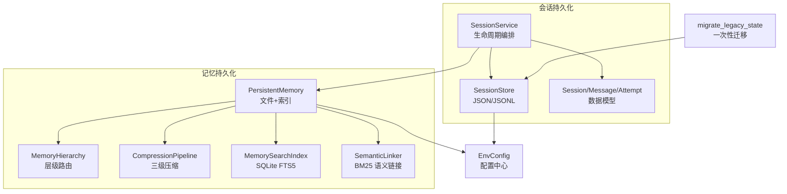
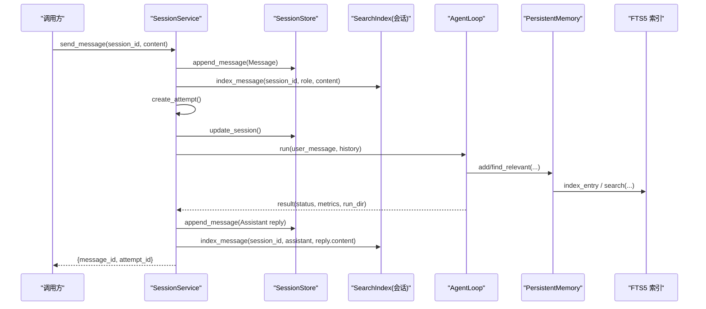
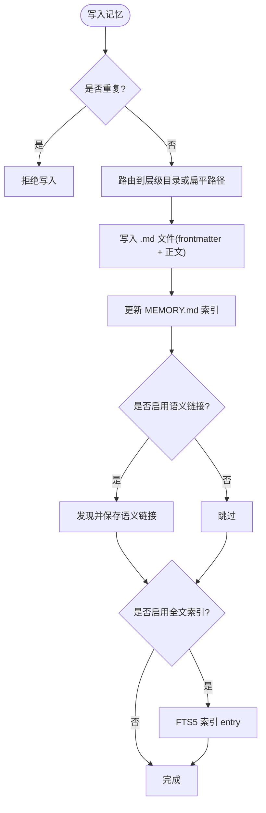
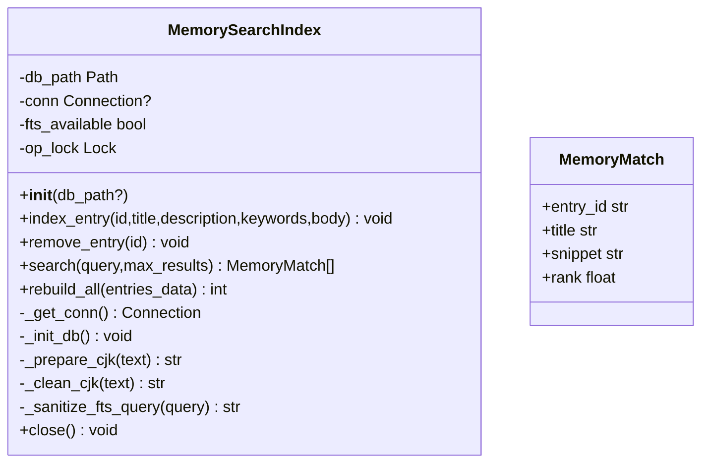
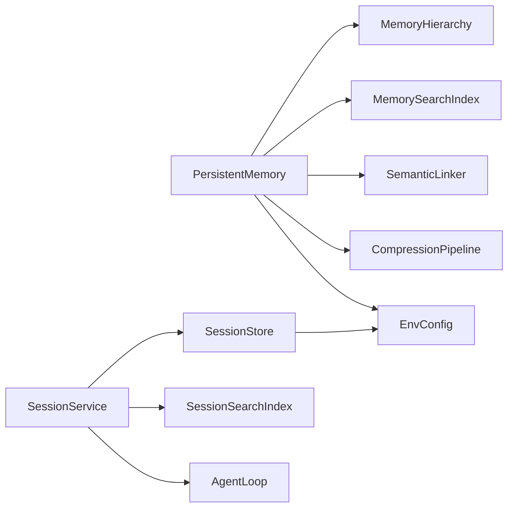

# 持久化存储

<cite>
**本文引用的文件**
- [agent/src/memory/persistent.py](file://agent/src/memory/persistent.py)
- [agent/src/memory/search_index.py](file://agent/src/memory/search_index.py)
- [agent/src/memory/compression.py](file://agent/src/memory/compression.py)
- [agent/src/memory/hierarchy.py](file://agent/src/memory/hierarchy.py)
- [agent/src/session/store.py](file://agent/src/session/store.py)
- [agent/src/session/service.py](file://agent/src/session/service.py)
- [agent/src/session/models.py](file://agent/src/session/models.py)
- [agent/src/config/env_schema.py](file://agent/src/config/env_schema.py)
- [agent/src/config/migrate.py](file://agent/src/config/migrate.py)
</cite>

## 目录
1. [简介](#简介)
2. [项目结构](#项目结构)
3. [核心组件](#核心组件)
4. [架构总览](#架构总览)
5. [详细组件分析](#详细组件分析)
6. [依赖关系分析](#依赖关系分析)
7. [性能考量](#性能考量)
8. [故障排查指南](#故障排查指南)
9. [结论](#结论)
10. [附录](#附录)

## 简介
本文件为 Vibe-Trading 的持久化存储系统提供完整技术文档，覆盖数据存储格式、索引构建策略与查询优化机制；会话数据的持久化方案、版本管理与数据迁移策略；搜索索引的构建与维护（全文检索与语义链接）；存储配置选项、备份恢复流程与性能优化方法；以及数据一致性与故障恢复机制。

## 项目结构
持久化相关代码主要分布在 memory 与 session 两个子系统：
- memory：跨会话记忆持久化、层级路由、压缩归档、全文检索索引、语义链接等。
- session：会话、消息、执行尝试的文件系统持久化与生命周期编排。
- config：统一的环境变量配置模型，包含记忆系统的功能开关与默认值。
- migrate：将历史状态从旧位置迁移到运行时根目录的一次性迁移工具。

图表来源
- [agent/src/memory/persistent.py:196-637](file://agent/src/memory/persistent.py#L196-L637)
- [agent/src/memory/hierarchy.py:34-436](file://agent/src/memory/hierarchy.py#L34-L436)
- [agent/src/memory/compression.py:160-353](file://agent/src/memory/compression.py#L160-L353)
- [agent/src/memory/search_index.py:113-481](file://agent/src/memory/search_index.py#L113-L481)
- [agent/src/session/store.py:16-259](file://agent/src/session/store.py#L16-L259)
- [agent/src/session/service.py:53-605](file://agent/src/session/service.py#L53-L605)
- [agent/src/session/models.py:140-342](file://agent/src/session/models.py#L140-L342)
- [agent/src/config/env_schema.py:461-563](file://agent/src/config/env_schema.py#L461-L563)
- [agent/src/config/migrate.py:114-153](file://agent/src/config/migrate.py#L114-L153)

章节来源
- [agent/src/memory/persistent.py:196-637](file://agent/src/memory/persistent.py#L196-L637)
- [agent/src/session/store.py:16-259](file://agent/src/session/store.py#L16-L259)
- [agent/src/config/env_schema.py:461-563](file://agent/src/config/env_schema.py#L461-L563)

## 核心组件
- PersistentMemory：基于文件的跨会话记忆存储，支持去重、重要性衰减、关键词与正文分词检索、可选的层级目录路由、可选的全文检索索引与语义链接。
- MemorySearchIndex：SQLite FTS5 全文检索索引，支持增量索引、批量重建、CJK 单字/双字扩展、安全查询清洗。
- CompressionPipeline：三级压缩（原始→每日摘要→要点摘要），自动归档原文并估算信息保留率。
- MemoryHierarchy：按类型分类的子目录路由与扫描范围裁剪，兼容扁平存储。
- SessionStore：会话 JSON、消息 JSONL、尝试 JSON 的文件系统持久化，追加日志模式与 fsync。
- SessionService：会话生命周期编排，消息写入、尝试创建与执行调度、事件总线、取消与并发控制。
- EnvConfig：集中化的环境变量配置，含记忆系统功能开关与预设。
- migrate_legacy_state：一次性迁移旧版状态至运行时根目录，原子移动与中断恢复。

章节来源
- [agent/src/memory/persistent.py:196-637](file://agent/src/memory/persistent.py#L196-L637)
- [agent/src/memory/search_index.py:113-481](file://agent/src/memory/search_index.py#L113-L481)
- [agent/src/memory/compression.py:160-353](file://agent/src/memory/compression.py#L160-L353)
- [agent/src/memory/hierarchy.py:34-436](file://agent/src/memory/hierarchy.py#L34-L436)
- [agent/src/session/store.py:16-259](file://agent/src/session/store.py#L16-L259)
- [agent/src/session/service.py:53-605](file://agent/src/session/service.py#L53-L605)
- [agent/src/config/env_schema.py:461-563](file://agent/src/config/env_schema.py#L461-L563)
- [agent/src/config/migrate.py:114-153](file://agent/src/config/migrate.py#L114-L153)

## 架构总览
持久化系统由“记忆”和“会话”两条主线组成，二者通过服务层协作：
- 用户发送消息后，SessionService 负责持久化消息、创建执行尝试、更新会话，并在后台执行 AgentLoop。
- AgentLoop 在执行过程中可读写 PersistentMemory，触发索引更新、语义链接发现与压缩归档。
- 全文检索通过 MemorySearchIndex 提供 O(log n) 查询能力，失败时回退到内存分词扫描。
- 层级路由与压缩在开启时提升组织性与存储效率。
- 配置由 EnvConfig 统一管理，记忆系统可按预设或独立开关启用不同特性。

图表来源
- [agent/src/session/service.py:158-345](file://agent/src/session/service.py#L158-L345)
- [agent/src/session/store.py:151-193](file://agent/src/session/store.py#L151-L193)
- [agent/src/memory/persistent.py:462-578](file://agent/src/memory/persistent.py#L462-L578)
- [agent/src/memory/search_index.py:207-355](file://agent/src/memory/search_index.py#L207-L355)

## 详细组件分析

### 记忆持久化（PersistentMemory）
- 存储格式：每条记忆为一个 Markdown 文件，包含 YAML frontmatter（名称、描述、类型、ID、时间戳、质量分数、访问次数、最后访问时间、重要性、关联记忆、分类、压缩级别）与正文。
- 去重：基于内容哈希与滑动窗口防止重复写入。
- 重要性衰减：基于 Ebbinghaus 遗忘曲线与访问奖励计算重要性，影响排序权重。
- 检索：优先使用 FTS5 全文检索；不可用时回退到本地分词加权匹配；支持语义链接扩展结果。
- 索引维护：新增/删除条目时同步更新 MEMORY.md 索引与 FTS5 索引；首次空搜索且磁盘存在条目时自动重建索引。
- 并发安全：使用文件锁避免并发写冲突。

图表来源
- [agent/src/memory/persistent.py:462-578](file://agent/src/memory/persistent.py#L462-L578)
- [agent/src/memory/persistent.py:358-438](file://agent/src/memory/persistent.py#L358-L438)

章节来源
- [agent/src/memory/persistent.py:196-637](file://agent/src/memory/persistent.py#L196-L637)

### 全文检索索引（MemorySearchIndex）
- 数据结构：memories 表存储元数据与正文；memories_fts 虚拟表用于 FTS5 MATCH 查询。
- CJK 处理：插入时对连续 CJK 字符进行单字与双字展开，提高匹配召回；查询时生成安全表达式并转义。
- 操作接口：index_entry、remove_entry、search、rebuild_all。
- 健壮性：WAL 模式、NORMAL 同步；FTS5 不可用时降级为空结果集。

图表来源
- [agent/src/memory/search_index.py:96-111](file://agent/src/memory/search_index.py#L96-L111)
- [agent/src/memory/search_index.py:113-481](file://agent/src/memory/search_index.py#L113-L481)

章节来源
- [agent/src/memory/search_index.py:113-481](file://agent/src/memory/search_index.py#L113-L481)

### 层级路由（MemoryHierarchy）
- 目的：按 memory_type 将文件路由到子目录，缩小扫描范围，提升检索性能。
- 兼容：扫描同时覆盖基础目录与类别子目录；自动修复缺失后缀的孤儿文件。
- 索引：维护 .hierarchy.yaml 记录类别统计与关键词，辅助查询优先级排序。

章节来源
- [agent/src/memory/hierarchy.py:34-436](file://agent/src/memory/hierarchy.py#L34-L436)

### 压缩归档（CompressionPipeline）
- 三级压缩：raw → daily（关键句提取）→ digest（关键词摘要）。
- 触发条件：基于最后访问时间阈值。
- 安全：压缩前原子归档原文，失败时中止以避免数据丢失。
- 评估：Jaccard 相似度估算信息保留率。

章节来源
- [agent/src/memory/compression.py:160-353](file://agent/src/memory/compression.py#L160-L353)

### 会话持久化（SessionStore）
- 目录结构：每个会话一个目录，包含 session.json、messages.jsonl 与 attempts/{attempt_id}/attempt.json。
- 消息日志：追加式 JSONL，写入后 fsync 保证落盘。
- 容错：读取时跳过损坏行，列出会话时跳过损坏 JSON。

章节来源
- [agent/src/session/store.py:16-259](file://agent/src/session/store.py#L16-L259)

### 会话服务（SessionService）
- 并发控制：同一会话仅允许一个运行中的尝试，使用 in-flight 集合与线程锁保护。
- 生命周期：创建会话、发送消息、创建尝试、后台执行、更新状态、发布事件。
- 取消：支持取消正在运行的任务或尚未到达 AgentLoop 的任务。
- 集成：与搜索索引、事件总线、AgentLoop 协作。

章节来源
- [agent/src/session/service.py:53-605](file://agent/src/session/service.py#L53-L605)

### 数据模型（Session/Message/Attempt）
- Session：会话标识、标题、状态、时间戳、最近尝试 ID、配置、所有者。
- Message：消息标识、会话 ID、角色、内容、时间戳、关联尝试 ID、元数据、工具轨迹。
- Attempt：尝试标识、会话 ID、父尝试 ID、状态、提示、运行目录、摘要、追踪、时间戳、错误、指标。

章节来源
- [agent/src/session/models.py:140-342](file://agent/src/session/models.py#L140-L342)

### 配置与预设（EnvConfig）
- 记忆系统预设：off/on/full，分别关闭、启用基础特性、启用全部特性。
- 独立开关：质量评分、垃圾回收、重要性衰减、层级路由、语义链接、压缩、FTS5 索引。
- 环境变量别名：VT_MEMORY_* 系列字段映射到具体开关。

章节来源
- [agent/src/config/env_schema.py:461-563](file://agent/src/config/env_schema.py#L461-L563)

### 版本迁移（migrate_legacy_state）
- 目标：将 sessions/runs/uploads/.swarm/runs 从旧位置迁移到运行时根目录。
- 策略：子级合并迁移，同名冲突跳过；使用隐藏临时名原子移动；中断后可恢复。
- 清理：迁移完成后移除空源目录。

章节来源
- [agent/src/config/migrate.py:114-153](file://agent/src/config/migrate.py#L114-L153)

## 依赖关系分析
- PersistentMemory 依赖：
  - MemoryHierarchy（可选）：层级路由与扫描裁剪。
  - MemorySearchIndex（可选）：全文检索索引。
  - SemanticLinker（可选）：BM25 语义链接发现与持久化。
  - CompressionPipeline（可选）：压缩归档。
- SessionService 依赖：
  - SessionStore：会话/消息/尝试持久化。
  - SearchIndex（会话）：会话消息索引。
  - AgentLoop：执行主体。
  - EnvConfig：配置读取。
- 配置中心 EnvConfig 被多处消费，统一提供功能开关与默认值。

图表来源
- [agent/src/memory/persistent.py:196-637](file://agent/src/memory/persistent.py#L196-L637)
- [agent/src/session/service.py:53-605](file://agent/src/session/service.py#L53-L605)
- [agent/src/config/env_schema.py:461-563](file://agent/src/config/env_schema.py#L461-L563)

## 性能考量
- 全文检索：
  - 使用 SQLite FTS5 实现 O(log n) 查询，显著优于全量扫描。
  - CJK 单字/双字展开提升召回；查询表达式安全清洗防止注入。
  - WAL 模式与 NORMAL 同步降低写放大并提升并发读性能。
- 层级路由：
  - 按类别缩小扫描范围，减少 I/O 与解析开销。
  - 基于关键词重叠对类别排序，优先扫描高相关类别。
- 压缩归档：
  - 三级压缩降低长期存储成本；关键句与关键词摘要保持可读性。
  - 原子归档避免压缩过程中的数据丢失风险。
- 会话消息：
  - JSONL 追加写 + fsync 保证顺序与落盘；读取时限制返回条数。
- 并发与锁：
  - 文件锁避免多进程/多线程写冲突；会话服务使用 in-flight 集合与线程锁保证单一运行实例。

[本节为通用性能讨论，不直接分析具体文件]

## 故障排查指南
- 全文检索不可用：
  - 现象：search 返回空结果。
  - 原因：FTS5 不可用或索引为空。
  - 处理：检查 FTS5 可用性；必要时触发 rebuild_all；确认 entries_data 正确传入。
- 索引不一致：
  - 现象：MEMORY.md 与磁盘文件不一致。
  - 处理：调用 _rebuild_index 重建索引；检查是否有未完成的写入或锁超时。
- 压缩失败：
  - 现象：压缩过程报错或归档失败。
  - 处理：查看 archive 目录是否存在临时文件；重试压缩；确保磁盘空间充足。
- 会话消息损坏：
  - 现象：读取消息时跳过损坏行。
  - 处理：定位损坏行并修复或删除；检查写入端异常。
- 迁移中断：
  - 现象：出现 .migrating-* 残留。
  - 处理：下次启动会自动恢复；若目标已存在则丢弃残留；手动清理无效残留。

章节来源
- [agent/src/memory/search_index.py:147-196](file://agent/src/memory/search_index.py#L147-L196)
- [agent/src/memory/persistent.py:609-637](file://agent/src/memory/persistent.py#L609-L637)
- [agent/src/memory/compression.py:258-334](file://agent/src/memory/compression.py#L258-L334)
- [agent/src/session/store.py:164-193](file://agent/src/session/store.py#L164-L193)
- [agent/src/config/migrate.py:57-102](file://agent/src/config/migrate.py#L57-L102)

## 结论
Vibe-Trading 的持久化存储系统以文件系统为核心，结合 SQLite FTS5 全文检索、层级路由与压缩归档，实现了高效、可扩展且健壮的跨会话记忆与会话数据管理。通过统一配置与一次性迁移工具，系统在易用性、可维护性与可靠性方面达到平衡。建议在生产环境开启 FTS5 与层级路由，并根据数据规模与访问模式调整压缩阈值与检索参数。

[本节为总结，不直接分析具体文件]

## 附录

### 数据存储格式
- 记忆条目：Markdown 文件，frontmatter 包含 name、description、type、id、created_at、updated_at、keywords、quality_score、access_count、last_accessed、importance、related_memories、category、compression_level；正文为清理后的文本。
- 会话：session.json（会话元数据）、messages.jsonl（消息日志）、attempts/{attempt_id}/attempt.json（执行尝试）。
- 索引：MEMORY.md（轻量索引）、.hierarchy.yaml（层级统计）、memory_index.db（FTS5 数据库）。

章节来源
- [agent/src/memory/persistent.py:122-143](file://agent/src/memory/persistent.py#L122-L143)
- [agent/src/memory/persistent.py:513-530](file://agent/src/memory/persistent.py#L513-L530)
- [agent/src/session/store.py:19-55](file://agent/src/session/store.py#L19-L55)
- [agent/src/memory/hierarchy.py:200-261](file://agent/src/memory/hierarchy.py#L200-L261)
- [agent/src/memory/search_index.py:147-196](file://agent/src/memory/search_index.py#L147-L196)

### 索引构建策略与查询优化
- 构建：
  - 增量：index_entry 在写入时插入或替换记录，触发 FTS5 同步。
  - 批量：rebuild_all 清空并重建，适用于首次或大规模同步。
- 优化：
  - CJK 单字/双字展开提升匹配召回。
  - 查询表达式安全清洗，防止注入。
  - 层级路由缩小扫描范围。
  - 压缩归档降低存储与 I/O 压力。

章节来源
- [agent/src/memory/search_index.py:207-355](file://agent/src/memory/search_index.py#L207-L355)
- [agent/src/memory/hierarchy.py:145-176](file://agent/src/memory/hierarchy.py#L145-L176)
- [agent/src/memory/compression.py:168-193](file://agent/src/memory/compression.py#L168-L193)

### 会话数据持久化方案、版本管理与数据迁移
- 方案：
  - 会话 JSON 存储元数据；消息 JSONL 追加日志；尝试 JSON 存储执行上下文。
  - 写入后 fsync 保证落盘；读取时容错跳过损坏数据。
- 版本管理：
  - 通过迁移工具将旧版状态迁移到运行时根目录，避免升级或重装导致的历史丢失。
- 迁移策略：
  - 子级合并迁移，同名冲突跳过；使用隐藏临时名原子移动；中断后可恢复。

章节来源
- [agent/src/session/store.py:59-116](file://agent/src/session/store.py#L59-L116)
- [agent/src/config/migrate.py:114-153](file://agent/src/config/migrate.py#L114-L153)

### 搜索索引的构建与维护（全文检索与语义搜索）
- 全文检索：
  - 使用 FTS5 虚拟表进行 MATCH 查询；支持 snippet 高亮与相关性排序。
  - 首次空搜索且磁盘存在条目时自动重建索引。
- 语义搜索：
  - 通过 BM25 语义链接发现相关条目，扩展搜索结果。
  - 链接关系持久化，删除条目时清理关系。

章节来源
- [agent/src/memory/search_index.py:252-302](file://agent/src/memory/search_index.py#L252-L302)
- [agent/src/memory/persistent.py:418-438](file://agent/src/memory/persistent.py#L418-L438)

### 存储配置选项
- 记忆系统预设：
  - VT_MEMORY=off/on/full，分别关闭、启用基础特性、启用全部特性。
- 独立开关：
  - VT_MEMORY_QUALITY、VT_MEMORY_GC、VT_MEMORY_DECAY、VT_MEMORY_HIERARCHY、VT_MEMORY_LINKS、VT_MEMORY_COMPRESSION、VT_MEMORY_FTS_INDEX。
- 其他路径与 API 配置：
  - 路径覆盖、API 认证、CORS、MCP 主机白名单等。

章节来源
- [agent/src/config/env_schema.py:461-563](file://agent/src/config/env_schema.py#L461-L563)

### 备份恢复流程
- 记忆条目：
  - 压缩前自动归档原文到 archive/ 目录；压缩失败时中止以避免数据丢失。
- 会话数据：
  - 定期备份 sessions/ 目录；恢复时确保目录结构与权限一致。
- 索引：
  - 备份 memory_index.db；恢复后如需重建可调用 rebuild_all。

章节来源
- [agent/src/memory/compression.py:258-334](file://agent/src/memory/compression.py#L258-L334)
- [agent/src/memory/search_index.py:304-355](file://agent/src/memory/search_index.py#L304-L355)

### 数据一致性保证与故障恢复机制
- 一致性：
  - 文件锁避免并发写冲突；会话服务使用 in-flight 集合与线程锁保证单一运行实例。
  - JSONL 追加写 + fsync 保证消息顺序与落盘。
- 故障恢复：
  - 读取时跳过损坏数据；迁移工具支持中断恢复；FTS5 不可用时降级。

章节来源
- [agent/src/memory/persistent.py:41-73](file://agent/src/memory/persistent.py#L41-L73)
- [agent/src/session/service.py:93-117](file://agent/src/session/service.py#L93-L117)
- [agent/src/session/store.py:151-193](file://agent/src/session/store.py#L151-L193)
- [agent/src/config/migrate.py:57-102](file://agent/src/config/migrate.py#L57-L102)