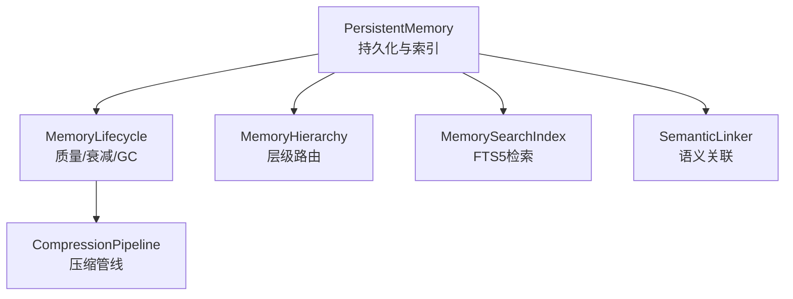
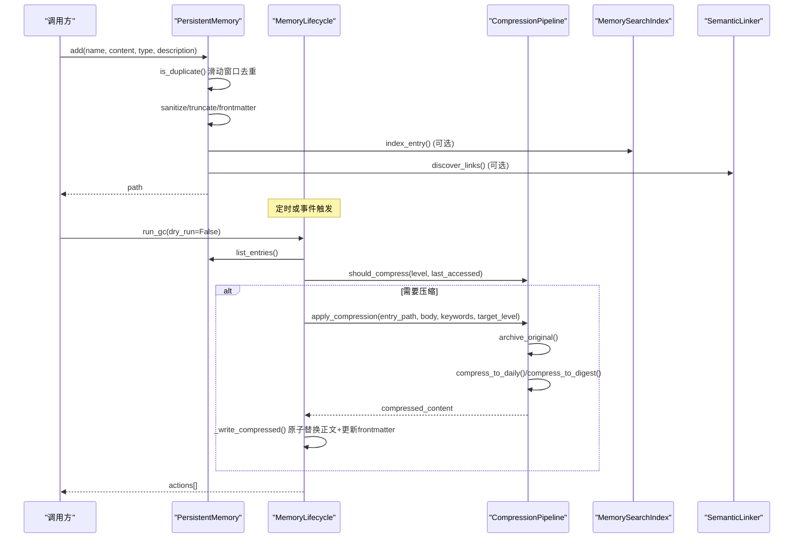
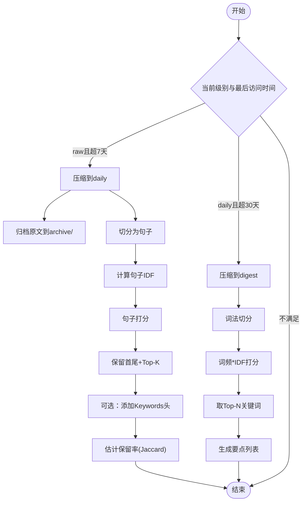
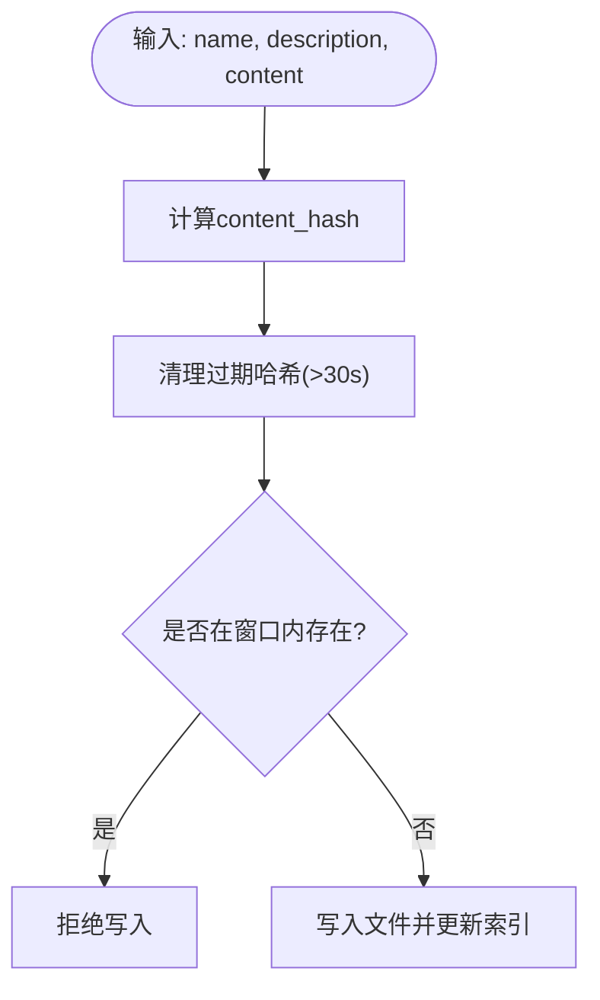
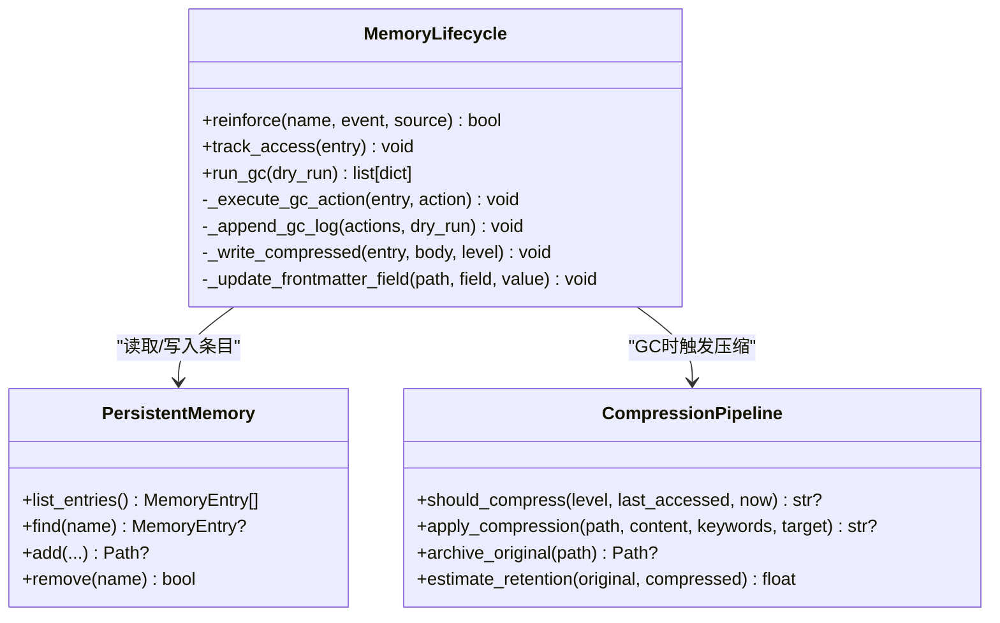
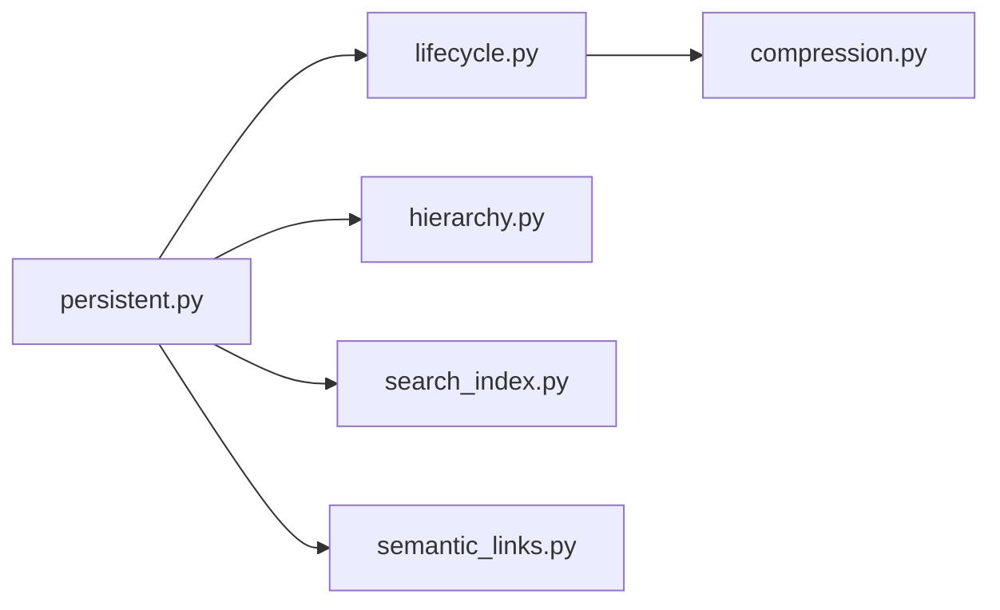

# 记忆压缩系统

<cite>
**本文引用的文件**
- [compression.py](file://agent/src/memory/compression.py)
- [hierarchy.py](file://agent/src/memory/hierarchy.py)
- [lifecycle.py](file://agent/src/memory/lifecycle.py)
- [persistent.py](file://agent/src/memory/persistent.py)
- [search_index.py](file://agent/src/memory/search_index.py)
- [semantic_links.py](file://agent/src/memory/semantic_links.py)
- [test_memory_lifecycle.py](file://agent/tests/test_memory_lifecycle.py)
- [test_persistent_memory.py](file://agent/tests/test_persistent_memory.py)
</cite>

## 目录
1. [简介](#简介)
2. [项目结构](#项目结构)
3. [核心组件](#核心组件)
4. [架构总览](#架构总览)
5. [详细组件分析](#详细组件分析)
6. [依赖关系分析](#依赖关系分析)
7. [性能考量](#性能考量)
8. [故障排查指南](#故障排查指南)
9. [结论](#结论)
10. [附录：配置与监控](#附录：配置与监控)

## 简介
本文件为 Vibe-Trading 记忆压缩系统的技术文档，聚焦记忆内容的压缩算法、去重策略、摘要生成机制、压缩率控制、质量评估与可逆性保证、存储格式与解压过程、性能影响，以及配置参数、阈值设置和监控指标。同时给出不同数据类型的最优压缩策略建议与自定义压缩规则的开发方法。

## 项目结构
记忆子系统位于 agent/src/memory 下，围绕“持久化—生命周期—压缩—层级路由—检索—语义链接”形成完整闭环：
- 持久化与基础数据结构：persistent.py
- 生命周期管理（质量评分、衰减、垃圾回收）：lifecycle.py
- 三级压缩管线（raw → daily → digest）：compression.py
- 层级目录路由（按类型分目录）：hierarchy.py
- 全文检索索引（FTS5）：search_index.py
- 语义关联（BM25）：semantic_links.py

图表来源
- [persistent.py:196-307](file://agent/src/memory/persistent.py#L196-L307)
- [lifecycle.py:71-273](file://agent/src/memory/lifecycle.py#L71-L273)
- [compression.py:160-353](file://agent/src/memory/compression.py#L160-L353)
- [hierarchy.py:34-176](file://agent/src/memory/hierarchy.py#L34-L176)
- [search_index.py:113-303](file://agent/src/memory/search_index.py#L113-L303)
- [semantic_links.py:158-231](file://agent/src/memory/semantic_links.py#L158-L231)

章节来源
- [persistent.py:196-307](file://agent/src/memory/persistent.py#L196-L307)
- [lifecycle.py:71-273](file://agent/src/memory/lifecycle.py#L71-L273)

## 核心组件
- PersistentMemory：文件型跨会话记忆存储，负责条目读写、前元数据解析、内容清洗与截断、重复写入拦截、索引维护、搜索入口。
- MemoryLifecycle：基于使用反馈的质量更新、重要性衰减、容量管理与垃圾回收；在 GC 阶段触发压缩。
- CompressionPipeline：三级压缩管线，包含 TF-IDF 关键句抽取、关键词摘要生成、原始内容归档与保留率估算。
- MemoryHierarchy：按 memory_type 将条目路由到子目录，支持 O(类别规模) 的定向扫描与索引重建。
- MemorySearchIndex：SQLite FTS5 全文检索索引，提供 O(log n) 查询与自动重建。
- SemanticLinker：基于 BM25 的语义关联发现与持久化，支持显式 wikilink 解析。

章节来源
- [persistent.py:196-637](file://agent/src/memory/persistent.py#L196-L637)
- [lifecycle.py:71-421](file://agent/src/memory/lifecycle.py#L71-L421)
- [compression.py:160-353](file://agent/src/memory/compression.py#L160-L353)
- [hierarchy.py:34-436](file://agent/src/memory/hierarchy.py#L34-L436)
- [search_index.py:113-481](file://agent/src/memory/search_index.py#L113-L481)
- [semantic_links.py:158-372](file://agent/src/memory/semantic_links.py#L158-L372)

## 架构总览
记忆系统在写入时进行去重与规范化，在读取时通过关键词匹配或 FTS5 检索并考虑语义链接扩展；在后台生命周期管理中根据质量、访问频率与时间衰减计算重要性，执行归档/删除与压缩；压缩采用三级策略，确保信息高保留率且具备可逆性（原始内容归档）。

图表来源
- [persistent.py:462-578](file://agent/src/memory/persistent.py#L462-L578)
- [lifecycle.py:183-273](file://agent/src/memory/lifecycle.py#L183-L273)
- [compression.py:168-334](file://agent/src/memory/compression.py#L168-L334)
- [search_index.py:207-240](file://agent/src/memory/search_index.py#L207-L240)
- [semantic_links.py:179-231](file://agent/src/memory/semantic_links.py#L179-L231)

## 详细组件分析

### 压缩算法与摘要生成（CompressionPipeline）
- 三级压缩级别：raw → daily → digest
- 触发条件：基于上次访问时间距离当前时间的天数阈值
  - raw→daily：超过 7 天未访问
  - daily→digest：超过 30 天未访问
- daily 压缩策略：TF-IDF 句子级打分，保留首尾句 + Top-K 关键句（默认 K=5），拼接关键词头
- digest 摘要策略：统计词频与 IDF 加权，提取 Top-N 关键词（默认 N=15），输出要点列表
- 可逆性保证：压缩前将原文归档至 archive/ 目录（原子复制），失败时清理临时文件并中止
- 质量评估：Jaccard token 重叠率估计信息保留度

图表来源
- [compression.py:168-353](file://agent/src/memory/compression.py#L168-L353)

章节来源
- [compression.py:60-154](file://agent/src/memory/compression.py#L60-L154)
- [compression.py:168-353](file://agent/src/memory/compression.py#L168-L353)

### 去重策略（PersistentMemory）
- 滑动窗口去重：基于 name/description/content 的哈希，30 秒内相同内容视为重复，避免重试或并发导致的重复写入
- 文件名去重：slug 规范化与非拉丁字符处理，必要时附加哈希后缀避免冲突
- 索引去重：MEMORY.md 中同名条目仅保留最新一行

图表来源
- [persistent.py:35-38](file://agent/src/memory/persistent.py#L35-L38)
- [persistent.py:440-461](file://agent/src/memory/persistent.py#L440-L461)
- [persistent.py:609-628](file://agent/src/memory/persistent.py#L609-L628)

章节来源
- [persistent.py:440-461](file://agent/src/memory/persistent.py#L440-L461)
- [persistent.py:609-628](file://agent/src/memory/persistent.py#L609-L628)

### 生命周期与重要性衰减（MemoryLifecycle）
- 质量更新：基于事件（任务成功/失败、用户确认/拒绝、被动衰减）对 quality_score 进行有界增量更新，单会话上限限制
- 重要性计算：Ebbinghaus 风格衰减公式，结合访问次数加成，得到 importance
- 垃圾回收：依据 importance 阈值决定归档或删除（Tier 1 默认仅归档），并在非 dry_run 模式下触发压缩
- 原子写入：压缩后通过临时文件 + rename 原子替换正文与 frontmatter

图表来源
- [lifecycle.py:71-421](file://agent/src/memory/lifecycle.py#L71-L421)
- [persistent.py:196-307](file://agent/src/memory/persistent.py#L196-L307)
- [compression.py:160-353](file://agent/src/memory/compression.py#L160-L353)

章节来源
- [lifecycle.py:71-421](file://agent/src/memory/lifecycle.py#L71-L421)
- [persistent.py:80-91](file://agent/src/memory/persistent.py#L80-L91)

### 层级路由与扫描（MemoryHierarchy）
- 按 memory_type 路由到 category 子目录（user/feedback/project/reference），未知类型回退到根目录
- 支持无后缀孤儿条目恢复、全量/分类扫描、索引重建（.hierarchy.yaml）
- 搜索范围裁剪：可按类别过滤或通过关键词重叠排序提升相关类别优先

章节来源
- [hierarchy.py:34-176](file://agent/src/memory/hierarchy.py#L34-L176)
- [hierarchy.py:200-379](file://agent/src/memory/hierarchy.py#L200-L379)

### 检索与语义关联（Search Index & Semantic Links）
- FTS5 全文检索：构建 memories_fts 虚拟表，支持 MATCH 查询、snippet 高亮、自动重建
- 中文优化：CJK 字符展开为 unigram + bigram，查询与显示文本做去重与空白归一
- 语义链接：BM25 相似度发现 top-k 关联条目，保存为 .relations.json 侧车文件，支持 [[id]] 显式引用解析

章节来源
- [search_index.py:113-481](file://agent/src/memory/search_index.py#L113-L481)
- [semantic_links.py:158-372](file://agent/src/memory/semantic_links.py#L158-L372)

## 依赖关系分析
- compression.py 依赖 persistent.py 的 MemoryEntry 字段（如 compression_level）用于状态追踪
- lifecycle.py 依赖 persistent.py 的锁机制与重要性计算函数，并在 GC 中调用 compression.py
- hierarchy.py 被 persistent.py 在启用层级模式时用于路径路由
- search_index.py 与 semantic_links.py 作为可选增强模块，通过配置开关接入

图表来源
- [lifecycle.py:21-26](file://agent/src/memory/lifecycle.py#L21-L26)
- [persistent.py:222-232](file://agent/src/memory/persistent.py#L222-L232)
- [search_index.py:113-173](file://agent/src/memory/search_index.py#L113-L173)
- [semantic_links.py:158-173](file://agent/src/memory/semantic_links.py#L158-L173)

章节来源
- [lifecycle.py:21-26](file://agent/src/memory/lifecycle.py#L21-L26)
- [persistent.py:222-232](file://agent/src/memory/persistent.py#L222-L232)

## 性能考量
- 压缩复杂度
  - daily：句子切分 O(n)，IDF 计算 O(N·T)，打分 O(n·T)，总体近似线性于句子数与词数
  - digest：词频统计 O(T)，IDF 复用句子级 IDF，整体近似线性于词数
- 存储与 I/O
  - 归档使用原子复制，压缩写回使用临时文件 + rename，降低损坏风险
  - FTS5 索引使用 WAL 模式，减少写放大与锁竞争
- 去重窗口
  - 30 秒滑动窗口内存占用受限于近期哈希数量，定期清理
- 检索性能
  - FTS5 提供 O(log n) 匹配；无 FTS5 时回退到关键词扫描
- 并发安全
  - 文件级独占锁（fcntl），超时保护，避免多进程写入冲突

[本节为通用性能讨论，无需特定文件引用]

## 故障排查指南
- 压缩失败
  - 归档失败会中止压缩以避免数据丢失；检查磁盘空间与权限
  - 查看日志中的 “Archive failed”、“Compression failed” 等错误
- 压缩未触发
  - 若启用了压缩但未启用 GC，系统将记录警告；需开启 VT_MEMORY_GC 或在 full 模式下运行
- 重复写入
  - 检查是否处于 30 秒去重窗口；确认 name/description/content 是否一致
- 检索为空
  - 若 FTS5 不可用，将回退到关键词匹配；检查索引是否已重建或是否存在空查询
- 语义链接异常
  - 检查 .relations.json 版本与格式；确认 BM25 参数与阈值是否合理

章节来源
- [lifecycle.py:192-202](file://agent/src/memory/lifecycle.py#L192-L202)
- [compression.py:258-290](file://agent/src/memory/compression.py#L258-L290)
- [search_index.py:160-173](file://agent/src/memory/search_index.py#L160-L173)
- [semantic_links.py:296-305](file://agent/src/memory/semantic_links.py#L296-L305)

## 结论
Vibe-Trading 的记忆压缩系统以“持久化—生命周期—压缩—检索—关联”为核心，实现了高保留率的三级压缩、严格的去重与原子写入、基于重要性的垃圾回收与按需压缩、高效的全文检索与语义关联。通过可配置的阈值与开关，可在不同场景下平衡压缩率、质量与性能。

[本节为总结，无需特定文件引用]

## 附录：配置与监控

### 压缩配置参数与阈值
- 压缩级别与阈值
  - LEVEL_RAW / LEVEL_DAILY / LEVEL_DIGEST
  - DAILY_THRESHOLD_DAYS = 7
  - DIGEST_THRESHOLD_DAYS = 30
  - DAILY_TOP_K_SENTENCES = 5
  - DIGEST_MAX_TOKENS = 50
  - DIGEST_TOP_KEYWORDS = 15
- 功能开关（环境变量）
  - VT_MEMORY_COMPRESSION：启用压缩（配合 GC）
  - VT_MEMORY_QUALITY：启用质量评分与访问跟踪
  - VT_MEMORY_GC：启用垃圾回收与压缩触发
  - VT_MEMORY_DECAY：启用重要性衰减
  - VT_MEMORY_HIERARCHY：启用层级目录路由
  - VT_MEMORY_FTS_INDEX：启用 FTS5 全文检索
  - VT_MEMORY_LINKS：启用语义链接

章节来源
- [compression.py:23-39](file://agent/src/memory/compression.py#L23-L39)
- [lifecycle.py:35-53](file://agent/src/memory/lifecycle.py#L35-L53)
- [search_index.py:1-9](file://agent/src/memory/search_index.py#L1-L9)
- [semantic_links.py:1-7](file://agent/src/memory/semantic_links.py#L1-L7)

### 质量评估与监控指标
- 信息保留率：estimate_retention 返回 Jaccard token 重叠率（0.0–1.0）
- 重要性分数：compute_importance 综合 quality_score、access_count、days_since_last_access
- 去重命中率：is_duplicate 在滑动窗口内的命中计数（可通过日志观测）
- 压缩动作日志：gc.log 记录归档/删除决策与原因
- 检索命中：FTS5 搜索结果条数与 snippet 长度可作为检索效果参考

章节来源
- [compression.py:336-353](file://agent/src/memory/compression.py#L336-L353)
- [lifecycle.py:204-241](file://agent/src/memory/lifecycle.py#L204-L241)
- [persistent.py:80-91](file://agent/src/memory/persistent.py#L80-L91)
- [persistent.py:440-461](file://agent/src/memory/persistent.py#L440-L461)

### 不同数据类型的最优压缩策略建议
- 短文本/指令类（如 user 规则）
  - 倾向保持 raw 或快速进入 daily，保留首尾句与少量关键句，避免过度摘要导致指令丢失
- 长报告/研究类（如 project/research）
  - 适合进入 digest，提取 Top-N 关键词与要点，便于快速回顾
- 参考/知识库（reference）
  - 可延迟压缩，优先保障检索命中；必要时使用 daily 保留关键句
- 反馈/交互记录（feedback）
  - 高频访问则重要性较高，可延迟压缩；低价值反馈可较快归档

[本节为策略建议，无需特定文件引用]

### 自定义压缩规则开发方法
- 扩展句子打分：在 extract_key_sentences 中调整打分权重（例如加入位置权重、句长惩罚）
- 扩展摘要生成：在 compress_to_digest 中引入主题模型或外部关键词抽取器，替换当前 TF-IDF 方案
- 新增压缩级别：定义新 LEVEL_* 常量与阈值，并在 should_compress 中增加分支逻辑
- 质量评估增强：在 estimate_retention 中加入语义相似度（如句向量余弦相似度）替代纯 token 重叠
- 集成到生命周期：在 lifecycle.run_gc 中调用新的压缩策略，并确保 _write_compressed 正确更新 frontmatter

章节来源
- [compression.py:121-154](file://agent/src/memory/compression.py#L121-L154)
- [compression.py:220-256](file://agent/src/memory/compression.py#L220-L256)
- [compression.py:168-193](file://agent/src/memory/compression.py#L168-L193)
- [lifecycle.py:243-273](file://agent/src/memory/lifecycle.py#L243-L273)