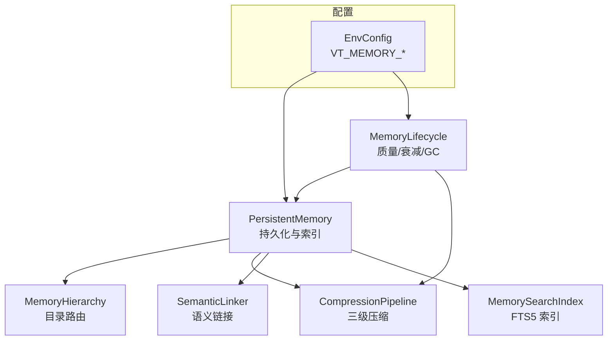
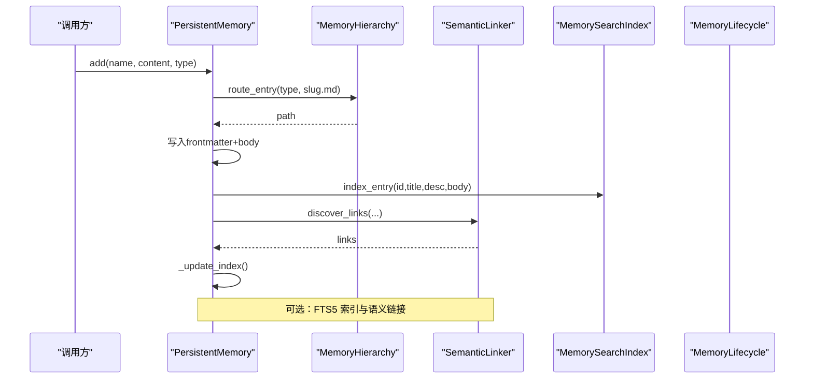
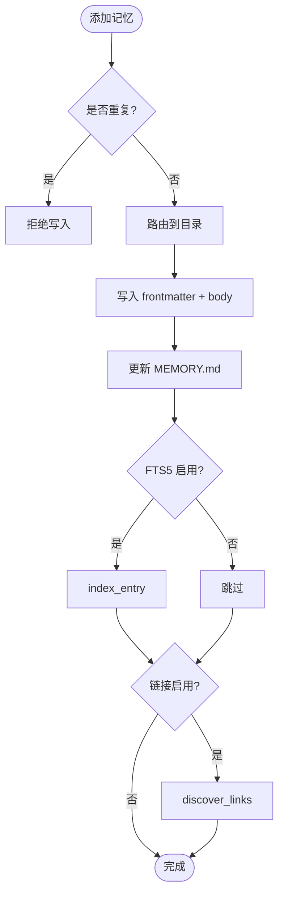
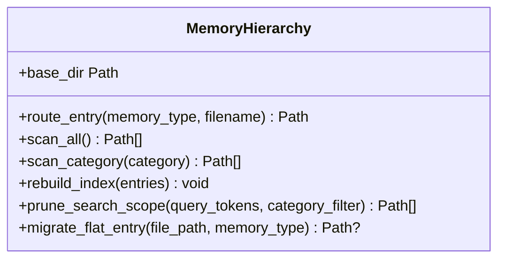
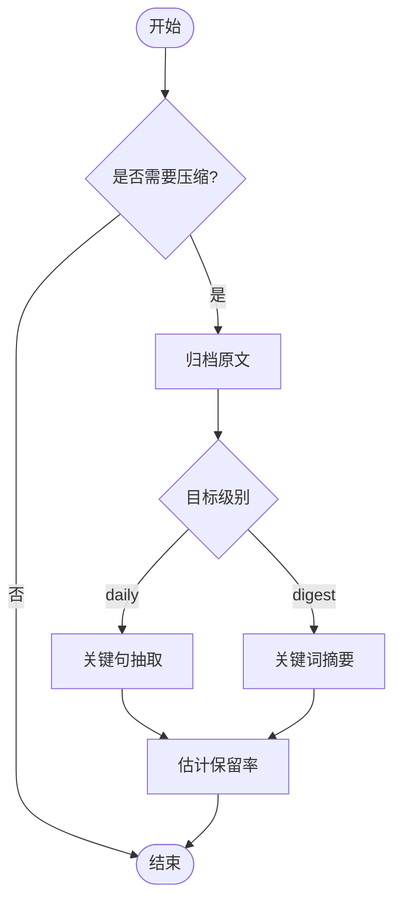
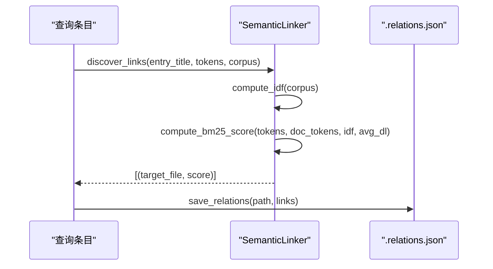
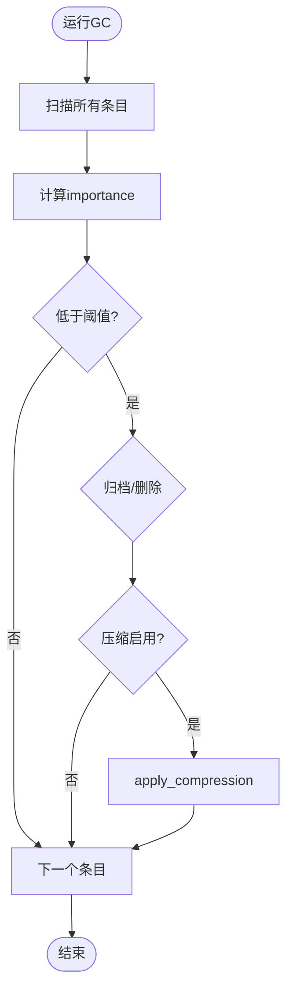
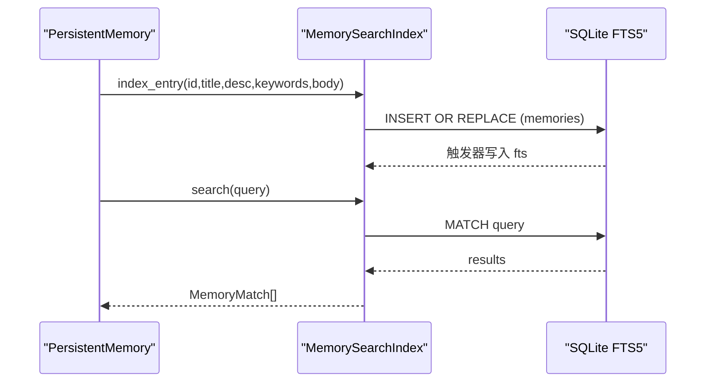
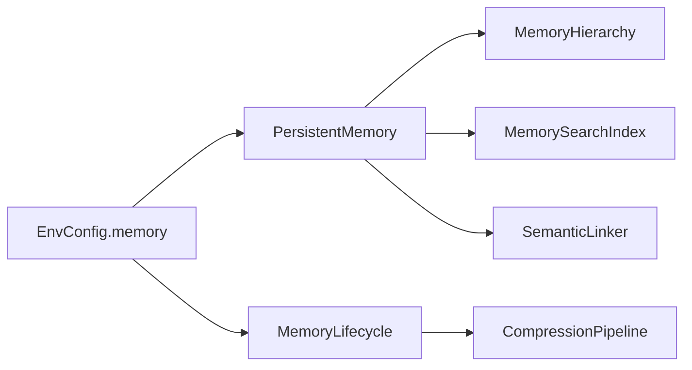

# 记忆存储系统

<cite>
**本文引用的文件**
- [agent/src/memory/persistent.py](file://agent/src/memory/persistent.py)
- [agent/src/memory/hierarchy.py](file://agent/src/memory/hierarchy.py)
- [agent/src/memory/compression.py](file://agent/src/memory/compression.py)
- [agent/src/memory/semantic_links.py](file://agent/src/memory/semantic_links.py)
- [agent/src/memory/lifecycle.py](file://agent/src/memory/lifecycle.py)
- [agent/src/memory/search_index.py](file://agent/src/memory/search_index.py)
- [agent/src/config/env_schema.py](file://agent/src/config/env_schema.py)
- [agent/src/config/accessor.py](file://agent/src/config/accessor.py)
</cite>

## 目录
1. [简介](#简介)
2. [项目结构](#项目结构)
3. [核心组件](#核心组件)
4. [架构总览](#架构总览)
5. [详细组件分析](#详细组件分析)
6. [依赖关系分析](#依赖关系分析)
7. [性能考量](#性能考量)
8. [故障排查指南](#故障排查指南)
9. [结论](#结论)
10. [附录](#附录)

## 简介
本文件为 Vibe-Trading 记忆存储系统的权威技术文档，聚焦分层记忆架构（工作记忆、短期记忆、长期记忆）、持久化机制、数据压缩算法、检索优化策略、语义链接构建与维护、跨会话自动召回机制、配置选项与性能调优、监控方法以及最佳实践（清理与版本管理）。该系统以纯文件为核心载体，通过可选的层级目录路由、全文索引、BM25 语义链接和三级压缩管线，实现高可用、可扩展且可观测的记忆能力。

## 项目结构
记忆子系统位于 agent/src/memory，围绕以下模块组织：
- persistent.py：持久化入口，负责读写 .md 条目、索引 MEMORY.md、去重、重要性计算与基础检索。
- hierarchy.py：按 memory_type 分类的目录路由与扫描，支持 O(类别规模) 范围搜索与扁平兼容迁移。
- compression.py：三级压缩（raw → daily → digest），基于 TF-IDF 关键句抽取与摘要生成，并归档原文。
- semantic_links.py：基于 BM25 的语义链接发现与持久化（.relations.json），支持显式 wikilink 解析。
- lifecycle.py：质量评分、访问追踪、衰减与垃圾回收（GC）；在 GC 中触发压缩。
- search_index.py：SQLite FTS5 全文索引，提供 O(log n) 检索与自动重建。
- config/env_schema.py：集中化的环境变量与开关（VT_MEMORY_*），提供 off/on/full 预设。
- config/accessor.py：线程安全的配置单例访问器。

图表来源
- [agent/src/memory/persistent.py:196-637](file://agent/src/memory/persistent.py#L196-L637)
- [agent/src/memory/hierarchy.py:34-436](file://agent/src/memory/hierarchy.py#L34-L436)
- [agent/src/memory/compression.py:160-353](file://agent/src/memory/compression.py#L160-L353)
- [agent/src/memory/semantic_links.py:158-372](file://agent/src/memory/semantic_links.py#L158-L372)
- [agent/src/memory/lifecycle.py:71-421](file://agent/src/memory/lifecycle.py#L71-L421)
- [agent/src/memory/search_index.py:113-481](file://agent/src/memory/search_index.py#L113-L481)
- [agent/src/config/env_schema.py:461-537](file://agent/src/config/env_schema.py#L461-L537)

章节来源
- [agent/src/memory/persistent.py:196-637](file://agent/src/memory/persistent.py#L196-L637)
- [agent/src/config/env_schema.py:461-537](file://agent/src/config/env_schema.py#L461-L537)

## 核心组件
- PersistentMemory：文件级持久化、索引维护、去重、重要性计算、关键词检索与语义扩展。
- MemoryHierarchy：按类型分目录的路由与扫描，提升检索范围效率并提供向后兼容。
- CompressionPipeline：原始内容归档 + 关键句抽取 + 摘要生成，控制信息保留率。
- SemanticLinker：BM25 相似度链接发现与持久化，支持显式引用解析。
- MemoryLifecycle：质量强化、访问计数、Ebbinghaus 衰减、GC 与压缩联动。
- MemorySearchIndex：SQLite FTS5 全文索引，支持增量索引与自动重建。

章节来源
- [agent/src/memory/persistent.py:122-143](file://agent/src/memory/persistent.py#L122-L143)
- [agent/src/memory/hierarchy.py:34-90](file://agent/src/memory/hierarchy.py#L34-L90)
- [agent/src/memory/compression.py:160-257](file://agent/src/memory/compression.py#L160-L257)
- [agent/src/memory/semantic_links.py:158-231](file://agent/src/memory/semantic_links.py#L158-L231)
- [agent/src/memory/lifecycle.py:71-178](file://agent/src/memory/lifecycle.py#L71-L178)
- [agent/src/memory/search_index.py:113-206](file://agent/src/memory/search_index.py#L113-L206)

## 架构总览
记忆系统采用“工作记忆（内存快照）—短期记忆（近期条目与高频访问）—长期记忆（归档/压缩/低重要性）”的分层设计：
- 工作记忆：进程内缓存的 MEMORY.md 快照，用于快速注入系统提示。
- 短期记忆：最近写入或频繁访问的条目，保持 raw 级别，便于即时使用。
- 长期记忆：经 GC 判定为低重要性或长时间未访问的条目，进入 archive 或压缩至 daily/digest。

图表来源
- [agent/src/memory/persistent.py:462-578](file://agent/src/memory/persistent.py#L462-L578)
- [agent/src/memory/hierarchy.py:70-90](file://agent/src/memory/hierarchy.py#L70-L90)
- [agent/src/memory/semantic_links.py:179-231](file://agent/src/memory/semantic_links.py#L179-L231)
- [agent/src/memory/search_index.py:207-241](file://agent/src/memory/search_index.py#L207-L241)

## 详细组件分析

### 持久化与索引（PersistentMemory）
- 数据结构：MemoryEntry 包含路径、标题、描述、类型、正文、时间戳、关键词、质量分、访问次数、最后访问时间、重要性、关联记忆、分类与压缩等级。
- 去重：基于 name|description|content 的哈希，30 秒滑动窗口防止并发重试重复写入。
- 重要性：结合质量分、访问次数与衰减公式，默认启用时影响排序。
- 检索：优先走 FTS5 索引（若启用），否则回退到 token 匹配加权评分；结果可按语义链接扩展。
- 索引：MEMORY.md 作为轻量索引，支持追加/更新与重建。

图表来源
- [agent/src/memory/persistent.py:440-578](file://agent/src/memory/persistent.py#L440-L578)
- [agent/src/memory/search_index.py:207-241](file://agent/src/memory/search_index.py#L207-L241)
- [agent/src/memory/semantic_links.py:179-231](file://agent/src/memory/semantic_links.py#L179-L231)

章节来源
- [agent/src/memory/persistent.py:122-143](file://agent/src/memory/persistent.py#L122-L143)
- [agent/src/memory/persistent.py:196-307](file://agent/src/memory/persistent.py#L196-L307)
- [agent/src/memory/persistent.py:358-438](file://agent/src/memory/persistent.py#L358-L438)
- [agent/src/memory/persistent.py:462-578](file://agent/src/memory/persistent.py#L462-L578)

### 分层目录路由（MemoryHierarchy）
- 分类目录：user、feedback、project、reference，未知类型回退到根目录。
- 扫描：支持全量扫描与按类别扫描，自动恢复缺失后缀的孤儿条目。
- 索引：维护 .hierarchy.yaml 统计与关键词，用于优先级排序与范围裁剪。
- 迁移：将扁平存储条目迁移到对应分类目录，保证一致性。

图表来源
- [agent/src/memory/hierarchy.py:34-90](file://agent/src/memory/hierarchy.py#L34-L90)
- [agent/src/memory/hierarchy.py:145-198](file://agent/src/memory/hierarchy.py#L145-L198)
- [agent/src/memory/hierarchy.py:200-379](file://agent/src/memory/hierarchy.py#L200-L379)
- [agent/src/memory/hierarchy.py:381-436](file://agent/src/memory/hierarchy.py#L381-L436)

章节来源
- [agent/src/memory/hierarchy.py:34-90](file://agent/src/memory/hierarchy.py#L34-L90)
- [agent/src/memory/hierarchy.py:145-198](file://agent/src/memory/hierarchy.py#L145-L198)
- [agent/src/memory/hierarchy.py:200-379](file://agent/src/memory/hierarchy.py#L200-L379)
- [agent/src/memory/hierarchy.py:381-436](file://agent/src/memory/hierarchy.py#L381-L436)

### 三级压缩（CompressionPipeline）
- 触发条件：根据 last_accessed 与当前时间判断是否从 raw→daily→digest。
- daily：TF-IDF 关键句抽取（保留首尾句 + top-k 中间句），附加关键词头。
- digest：提取 top-N 重要词，生成要点列表，显著缩减体积。
- 归档：压缩前原子复制原文至 archive/，失败则中止以避免数据丢失。
- 保留率估算：基于 Jaccard 重叠评估压缩前后信息保留度。

图表来源
- [agent/src/memory/compression.py:168-193](file://agent/src/memory/compression.py#L168-L193)
- [agent/src/memory/compression.py:194-257](file://agent/src/memory/compression.py#L194-L257)
- [agent/src/memory/compression.py:258-353](file://agent/src/memory/compression.py#L258-L353)

章节来源
- [agent/src/memory/compression.py:160-353](file://agent/src/memory/compression.py#L160-L353)

### 语义链接（SemanticLinker）
- 发现：对候选语料计算 IDF 与平均长度，使用 BM25 计算查询与文档相关性，过滤阈值并限制出边数量。
- 持久化：原子写入 .relations.json，包含版本、链接列表与更新时间。
- 解析：支持 [[六位十六进制ID]] 形式的显式引用，返回唯一 ID 序列。
- 删除：移除对应侧车文件。

图表来源
- [agent/src/memory/semantic_links.py:73-151](file://agent/src/memory/semantic_links.py#L73-L151)
- [agent/src/memory/semantic_links.py:179-231](file://agent/src/memory/semantic_links.py#L179-L231)
- [agent/src/memory/semantic_links.py:232-319](file://agent/src/memory/semantic_links.py#L232-L319)
- [agent/src/memory/semantic_links.py:321-372](file://agent/src/memory/semantic_links.py#L321-L372)

章节来源
- [agent/src/memory/semantic_links.py:158-372](file://agent/src/memory/semantic_links.py#L158-L372)

### 生命周期管理（MemoryLifecycle）
- 质量强化：基于事件（任务成功/失败、用户确认/拒绝、被动衰减）调整 quality_score，带会话上限保护。
- 访问追踪：记录 access_count 与 last_accessed，驱动重要性衰减。
- 垃圾回收：依据 importance 阈值决定归档或删除（默认仅归档），并触发压缩周期。
- 原子写：所有 frontmatter 字段更新与压缩后重写均采用临时文件 + rename 策略。

图表来源
- [agent/src/memory/lifecycle.py:183-273](file://agent/src/memory/lifecycle.py#L183-L273)
- [agent/src/memory/lifecycle.py:275-318](file://agent/src/memory/lifecycle.py#L275-L318)
- [agent/src/memory/lifecycle.py:323-421](file://agent/src/memory/lifecycle.py#L323-L421)

章节来源
- [agent/src/memory/lifecycle.py:71-178](file://agent/src/memory/lifecycle.py#L71-L178)
- [agent/src/memory/lifecycle.py:183-421](file://agent/src/memory/lifecycle.py#L183-L421)

### 全文检索（MemorySearchIndex）
- 索引结构：memories 表 + memories_fts 虚拟表，使用触发器自动同步增删改。
- 中文处理：CJK 字符展开为 unigram + bigram，查询时同样处理，提升匹配效果。
- 搜索：MATCH 表达式安全清洗，返回 snippet 与 rank。
- 重建：支持批量重建，首次空搜索时自动触发重建。

图表来源
- [agent/src/memory/search_index.py:147-196](file://agent/src/memory/search_index.py#L147-L196)
- [agent/src/memory/search_index.py:207-241](file://agent/src/memory/search_index.py#L207-L241)
- [agent/src/memory/search_index.py:252-303](file://agent/src/memory/search_index.py#L252-L303)
- [agent/src/memory/search_index.py:304-356](file://agent/src/memory/search_index.py#L304-L356)

章节来源
- [agent/src/memory/search_index.py:113-481](file://agent/src/memory/search_index.py#L113-L481)

## 依赖关系分析
- 配置依赖：所有功能开关通过 EnvConfig.memory.* 暴露，支持 VT_MEMORY 预设与独立覆盖。
- 运行时依赖：
  - FTS5 不可用时自动降级为 token 扫描。
  - 语义链接与压缩均为可选，按需启用。
  - 目录路由与扁平存储共存，确保向后兼容。
- 锁与并发：文件级锁（fcntl）保障写入一致性；Windows 下直接放行。

图表来源
- [agent/src/config/env_schema.py:461-537](file://agent/src/config/env_schema.py#L461-L537)
- [agent/src/memory/persistent.py:196-637](file://agent/src/memory/persistent.py#L196-L637)
- [agent/src/memory/lifecycle.py:71-421](file://agent/src/memory/lifecycle.py#L71-L421)

章节来源
- [agent/src/config/env_schema.py:461-537](file://agent/src/config/env_schema.py#L461-L537)
- [agent/src/memory/persistent.py:196-637](file://agent/src/memory/persistent.py#L196-L637)
- [agent/src/memory/lifecycle.py:71-421](file://agent/src/memory/lifecycle.py#L71-L421)

## 性能考量
- 检索复杂度：
  - 启用 FTS5：近似 O(log n) 检索，显著提升大规模记忆下的查询速度。
  - 未启用 FTS5：token 匹配 + 权重打分，适合小规模场景。
- 目录路由：按类别扫描减少全量扫描成本，配合 .hierarchy.yaml 关键词优先级排序。
- 压缩：
  - daily 级别约保留 50% 内容，digest 级别约 10-20%，有效降低 I/O 与存储压力。
  - 归档保证可回溯，避免误删风险。
- 去重：30 秒滑动窗口抑制并发重试导致的重复写入。
- 锁超时：文件锁默认 5 秒超时，避免阻塞主流程。

[本节为通用性能讨论，不直接分析具体文件]

## 故障排查指南
- 搜索无结果：
  - 检查 FTS5 是否可用；若不可用，系统将回退到 token 扫描。
  - 首次空搜索可能触发自动重建，等待重建完成后重试。
- 链接为空：
  - 确认语义链接已启用；检查 .relations.json 是否存在与格式正确。
- 压缩失败：
  - 查看 archive/ 是否可写；失败会中止以避免数据丢失。
- GC 未执行：
  - 确认 VT_MEMORY_GC 开启；若同时开启压缩但未开启 GC，会有警告日志。
- 写入冲突：
  - 关注锁超时日志；必要时降低并发或增大锁超时。

章节来源
- [agent/src/memory/search_index.py:160-173](file://agent/src/memory/search_index.py#L160-L173)
- [agent/src/memory/search_index.py:252-303](file://agent/src/memory/search_index.py#L252-L303)
- [agent/src/memory/semantic_links.py:232-319](file://agent/src/memory/semantic_links.py#L232-L319)
- [agent/src/memory/compression.py:258-334](file://agent/src/memory/compression.py#L258-L334)
- [agent/src/memory/lifecycle.py:183-202](file://agent/src/memory/lifecycle.py#L183-L202)
- [agent/src/memory/persistent.py:41-73](file://agent/src/memory/persistent.py#L41-L73)

## 结论
Vibe-Trading 记忆存储系统通过分层架构与可选的高级特性（目录路由、FTS5 索引、语义链接、三级压缩），在保证数据一致性与可恢复性的前提下，实现了高效、可扩展且可观测的记忆能力。合理配置与调优可在不同规模与负载下取得良好平衡。建议在生产环境逐步启用 Tier 2 特性，并结合 GC 与压缩策略进行容量治理。

[本节为总结性内容，不直接分析具体文件]

## 附录

### 配置选项与环境变量
- 预设：VT_MEMORY=off|on|full
  - off：全部关闭
  - on：启用质量、衰减、GC（Tier 1）
  - full：启用全部特性（Tier 1 + Tier 2）
- 独立开关：
  - VT_MEMORY_QUALITY：质量评分与强化
  - VT_MEMORY_GC：垃圾回收
  - VT_MEMORY_DECAY：重要性衰减
  - VT_MEMORY_HIERARCHY：目录路由
  - VT_MEMORY_LINKS：语义链接
  - VT_MEMORY_COMPRESSION：自动压缩
  - VT_MEMORY_FTS_INDEX：全文索引

章节来源
- [agent/src/config/env_schema.py:461-537](file://agent/src/config/env_schema.py#L461-L537)

### 监控与可观测性
- 日志：
  - 压缩：记录归档、压缩级别与保留率。
  - 链接：记录发现与保存过程。
  - 索引：记录 FTS5 可用性、重建与错误。
  - GC：记录决策与执行结果。
- 指标建议：
  - 记忆总数、各分类数量、压缩比例、GC 动作频率、检索延迟分布。

章节来源
- [agent/src/memory/compression.py:324-334](file://agent/src/memory/compression.py#L324-L334)
- [agent/src/memory/semantic_links.py:232-319](file://agent/src/memory/semantic_links.py#L232-L319)
- [agent/src/memory/search_index.py:160-173](file://agent/src/memory/search_index.py#L160-L173)
- [agent/src/memory/lifecycle.py:300-318](file://agent/src/memory/lifecycle.py#L300-L318)

### 最佳实践
- 记忆使用模式：
  - 新条目尽量提供清晰的 name、description 与 keywords，有助于检索与链接。
  - 合理使用 wikilink [[id]] 建立显式关联，增强上下文召回。
- 清理与版本管理：
  - 定期运行 GC（dry_run 先观察），归档低重要性条目。
  - 利用 archive/ 与 .relations.json 版本进行回溯与审计。
- 性能调优：
  - 大规模部署优先启用 FTS5 与目录路由。
  - 根据业务需求调整压缩阈值与 GC 策略。

[本节为通用指导，不直接分析具体文件]