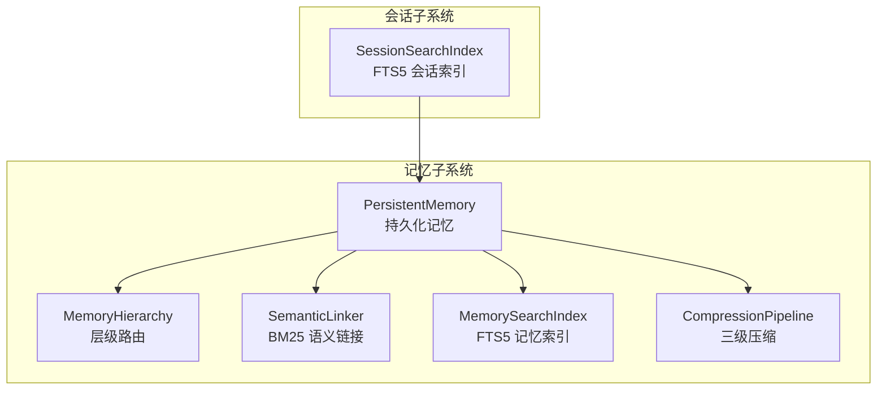
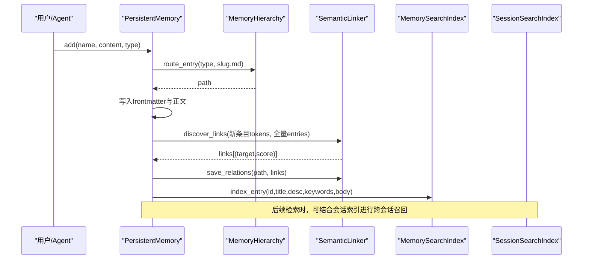
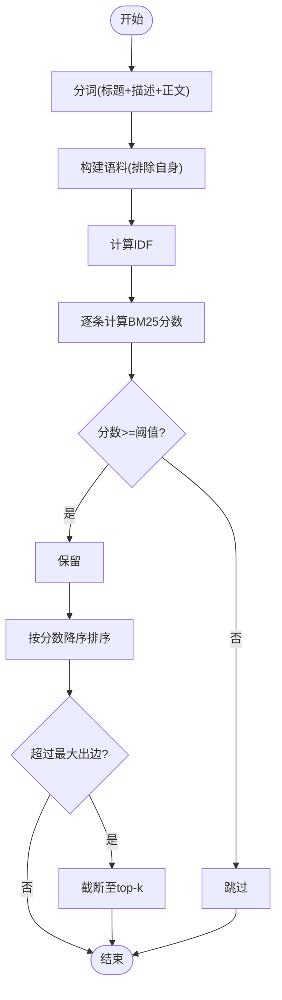
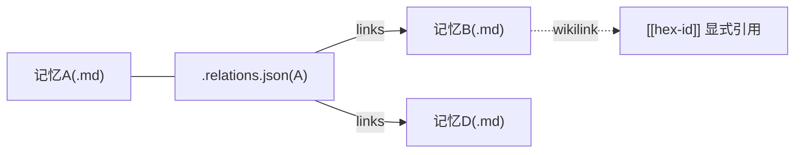
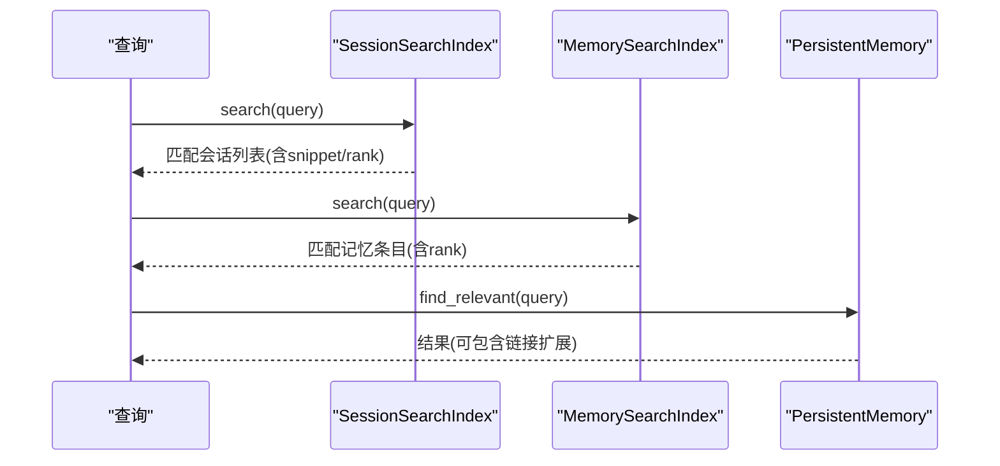
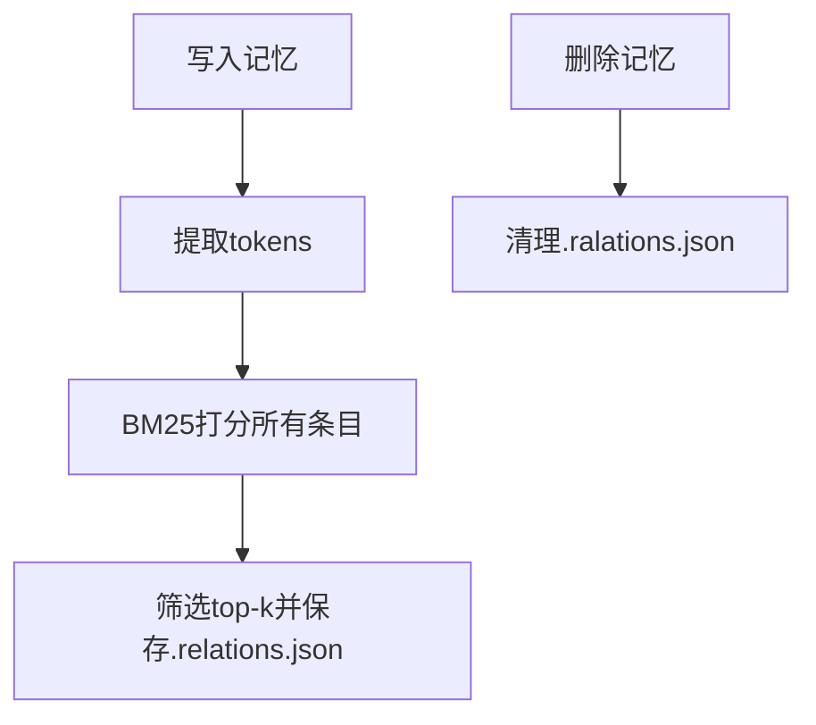
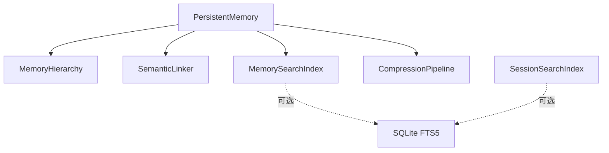

# 语义链接系统

<cite>
**本文引用的文件**
- [agent/src/memory/semantic_links.py](file://agent/src/memory/semantic_links.py)
- [agent/src/memory/search_index.py](file://agent/src/memory/search_index.py)
- [agent/src/memory/persistent.py](file://agent/src/memory/persistent.py)
- [agent/src/memory/hierarchy.py](file://agent/src/memory/hierarchy.py)
- [agent/src/memory/compression.py](file://agent/src/memory/compression.py)
- [agent/src/session/search.py](file://agent/src/session/search.py)
</cite>

## 目录
1. [简介](#简介)
2. [项目结构](#项目结构)
3. [核心组件](#核心组件)
4. [架构总览](#架构总览)
5. [详细组件分析](#详细组件分析)
6. [依赖关系分析](#依赖关系分析)
7. [性能考量](#性能考量)
8. [故障排查指南](#故障排查指南)
9. [结论](#结论)
10. [附录](#附录)

## 简介
本文件面向 Vibe-Trading 的“语义链接系统”，系统性说明跨会话记忆中的实体关系识别与构建、上下文关联、知识图谱（以文件侧车 + FTS5 索引形式）构建、链接权重计算、相似度度量与相关性排序机制；并覆盖跨会话记忆召回策略、自动链接发现与动态更新、链接质量评估、冲突解决与版本控制，以及语义搜索的实现与应用场景。

该系统由三层能力组成：
- 持久化记忆层：基于 Markdown 前元数据与层级目录组织记忆条目，提供重要性衰减、去重、压缩等能力。
- 语义链接层：通过 BM25 相似度在记忆条目间自动发现并维护关系，并以 .relations.json 侧车文件存储。
- 检索增强层：使用 SQLite FTS5 对记忆和会话消息建立倒排索引，实现 O(log n) 全文检索与相关性排序。

## 项目结构
语义链接系统主要位于 agent/src/memory 与 agent/src/session 两个子系统中：
- memory：负责持久化记忆、层级路由、BM25 语义链接、FTS5 记忆索引、压缩归档。
- session：负责跨会话消息的 FTS5 索引与检索，支撑跨会话语义召回。

图表来源
- [agent/src/memory/persistent.py:196-637](file://agent/src/memory/persistent.py#L196-L637)
- [agent/src/memory/hierarchy.py:34-436](file://agent/src/memory/hierarchy.py#L34-L436)
- [agent/src/memory/semantic_links.py:158-372](file://agent/src/memory/semantic_links.py#L158-L372)
- [agent/src/memory/search_index.py:113-481](file://agent/src/memory/search_index.py#L113-L481)
- [agent/src/memory/compression.py:160-353](file://agent/src/memory/compression.py#L160-L353)
- [agent/src/session/search.py:60-365](file://agent/src/session/search.py#L60-L365)

章节来源
- [agent/src/memory/persistent.py:196-637](file://agent/src/memory/persistent.py#L196-L637)
- [agent/src/memory/hierarchy.py:34-436](file://agent/src/memory/hierarchy.py#L34-L436)
- [agent/src/memory/semantic_links.py:158-372](file://agent/src/memory/semantic_links.py#L158-L372)
- [agent/src/memory/search_index.py:113-481](file://agent/src/memory/search_index.py#L113-L481)
- [agent/src/memory/compression.py:160-353](file://agent/src/memory/compression.py#L160-L353)
- [agent/src/session/search.py:60-365](file://agent/src/session/search.py#L60-L365)

## 核心组件
- PersistentMemory：跨会话持久化记忆的核心入口，负责读写 .md 记忆条目、维护 MEMORY.md 索引、调用层级路由、触发语义链接发现与 FTS5 索引更新。
- SemanticLinker：基于 BM25 的语义链接发现器，输出 top-k 相关条目并写入 .relations.json 侧车文件，支持解析显式 wikilink 引用。
- MemorySearchIndex：基于 SQLite FTS5 的记忆全文检索索引，支持增量索引、批量重建、CJK 优化与查询安全过滤。
- SessionSearchIndex：基于 SQLite FTS5 的跨会话消息检索索引，支持按会话聚合结果与片段高亮。
- MemoryHierarchy：将记忆按类型路由到 category 子目录，支持关键词重叠优先级扫描与迁移修复。
- CompressionPipeline：三级压缩（raw → daily → digest），保留关键句或摘要，并提供信息保留率估算。

章节来源
- [agent/src/memory/persistent.py:196-637](file://agent/src/memory/persistent.py#L196-L637)
- [agent/src/memory/semantic_links.py:158-372](file://agent/src/memory/semantic_links.py#L158-L372)
- [agent/src/memory/search_index.py:113-481](file://agent/src/memory/search_index.py#L113-L481)
- [agent/src/session/search.py:60-365](file://agent/src/session/search.py#L60-L365)
- [agent/src/memory/hierarchy.py:34-436](file://agent/src/memory/hierarchy.py#L34-L436)
- [agent/src/memory/compression.py:160-353](file://agent/src/memory/compression.py#L160-L353)

## 架构总览
下图展示从“新增/更新记忆”到“语义链接发现与索引更新”的端到端流程，以及“跨会话检索”如何借助会话索引与记忆索引协同工作。

图表来源
- [agent/src/memory/persistent.py:462-578](file://agent/src/memory/persistent.py#L462-L578)
- [agent/src/memory/hierarchy.py:70-90](file://agent/src/memory/hierarchy.py#L70-L90)
- [agent/src/memory/semantic_links.py:179-230](file://agent/src/memory/semantic_links.py#L179-L230)
- [agent/src/memory/search_index.py:207-239](file://agent/src/memory/search_index.py#L207-L239)
- [agent/src/session/search.py:137-192](file://agent/src/session/search.py#L137-L192)

## 详细组件分析

### 实体关系抽取与链接权重计算（BM25）
- 分词策略：采用与持久化模块一致的 token 正则，兼容多语言脚本（含 CJK）。
- IDF 计算：文档频率统计后应用 BM25 风格的 IDF 公式，避免负值。
- 评分函数：对每个候选文档计算 BM25 分数，考虑词频、文档长度归一化与平均文档长度。
- 阈值与上限：最小分数阈值过滤低相关度链接；限制最大出边数量，防止图爆炸。
- 显式引用：支持解析 [[6位十六进制id]] 形式的 wikilink，作为强信号补充。

图表来源
- [agent/src/memory/semantic_links.py:63-150](file://agent/src/memory/semantic_links.py#L63-L150)
- [agent/src/memory/semantic_links.py:179-230](file://agent/src/memory/semantic_links.py#L179-L230)

章节来源
- [agent/src/memory/semantic_links.py:63-150](file://agent/src/memory/semantic_links.py#L63-L150)
- [agent/src/memory/semantic_links.py:179-230](file://agent/src/memory/semantic_links.py#L179-L230)
- [agent/src/memory/semantic_links.py:321-344](file://agent/src/memory/semantic_links.py#L321-L344)

### 上下文关联与知识图谱构建
- 图谱表示：以 .md 为节点，.relations.json 为边（目标文件名 + 分数），形成轻量级有向图。
- 自动发现：在新增/更新记忆时，基于 BM25 自动发现 top-k 相关条目并持久化。
- 显式关联：支持在正文中嵌入 [[hex-id]] 形式的显式链接，便于人工标注强关系。
- 读取扩展：检索结果可按链接扩展，纳入相关条目以提升召回广度。

图表来源
- [agent/src/memory/semantic_links.py:232-319](file://agent/src/memory/semantic_links.py#L232-L319)
- [agent/src/memory/persistent.py:418-437](file://agent/src/memory/persistent.py#L418-L437)

章节来源
- [agent/src/memory/semantic_links.py:232-319](file://agent/src/memory/semantic_links.py#L232-L319)
- [agent/src/memory/persistent.py:418-437](file://agent/src/memory/persistent.py#L418-L437)

### 跨会话记忆召回策略
- 会话索引：SessionSearchIndex 对跨会话消息建立 FTS5 倒排索引，支持按会话聚合结果与片段高亮。
- 记忆索引：MemorySearchIndex 对记忆条目建立 FTS5 倒排索引，支持 CJK 优化与查询安全过滤。
- 组合召回：先通过会话索引定位相关会话，再映射到对应记忆条目；或直接对记忆索引检索，必要时扩展链接邻居。
- 自动重建：首次空检索且磁盘存在条目时，自动重建索引，保证一致性。

图表来源
- [agent/src/session/search.py:216-267](file://agent/src/session/search.py#L216-L267)
- [agent/src/memory/search_index.py:252-302](file://agent/src/memory/search_index.py#L252-L302)
- [agent/src/memory/persistent.py:358-437](file://agent/src/memory/persistent.py#L358-L437)

章节来源
- [agent/src/session/search.py:216-267](file://agent/src/session/search.py#L216-L267)
- [agent/src/memory/search_index.py:252-302](file://agent/src/memory/search_index.py#L252-L302)
- [agent/src/memory/persistent.py:358-437](file://agent/src/memory/persistent.py#L358-L437)

### 自动链接发现与动态更新
- 写入路径：新增记忆时，提取 tokens 并对全量条目计算 BM25，保存 top-k 链接。
- 删除路径：删除记忆时清理其 .relations.json 侧车，保持图一致。
- 原子写入：使用临时文件 + rename 的方式确保并发安全与崩溃恢复。
- 版本控制：.relations.json 包含 version 字段，便于未来格式演进与兼容性检查。

图表来源
- [agent/src/memory/persistent.py:539-563](file://agent/src/memory/persistent.py#L539-L563)
- [agent/src/memory/semantic_links.py:232-281](file://agent/src/memory/semantic_links.py#L232-L281)
- [agent/src/memory/semantic_links.py:360-372](file://agent/src/memory/semantic_links.py#L360-L372)

章节来源
- [agent/src/memory/persistent.py:539-563](file://agent/src/memory/persistent.py#L539-L563)
- [agent/src/memory/semantic_links.py:232-281](file://agent/src/memory/semantic_links.py#L232-L281)
- [agent/src/memory/semantic_links.py:360-372](file://agent/src/memory/semantic_links.py#L360-L372)

### 链接质量评估、冲突解决与版本控制
- 质量评估：
  - 链接分数：BM25 分数反映主题相似性，配合最小阈值过滤噪声。
  - 重要性衰减：记忆条目重要性随时间衰减并结合访问次数提升，影响检索排序。
  - 压缩保留率：压缩前后 Jaccard 重叠估计信息保留程度。
- 冲突解决：
  - 显式 vs 隐式：wikilink 显式引用可作为强信号；BM25 隐式链接用于补充弱关系。
  - 去重与限边：限制最大出边数量，避免图过密；重复内容滑动窗口去重。
- 版本控制：
  - .relations.json 包含 version 与 updated_at，便于升级与审计。
  - 索引重建：FTS5 支持 rebuild，保证索引与数据一致。

章节来源
- [agent/src/memory/persistent.py:75-91](file://agent/src/memory/persistent.py#L75-L91)
- [agent/src/memory/persistent.py:440-461](file://agent/src/memory/persistent.py#L440-L461)
- [agent/src/memory/compression.py:336-353](file://agent/src/memory/compression.py#L336-L353)
- [agent/src/memory/semantic_links.py:232-319](file://agent/src/memory/semantic_links.py#L232-L319)
- [agent/src/memory/search_index.py:304-355](file://agent/src/memory/search_index.py#L304-L355)

### 语义搜索的实现与应用场景
- 记忆搜索：
  - FTS5 倒排索引，O(log n) 检索；CJK 字符展开为 unigram + bigram 提升匹配。
  - 查询安全：对用户输入进行清洗与转义，防止注入。
  - 结果映射：将 FTS5 结果映射回完整记忆条目，支持链接扩展。
- 会话搜索：
  - 跨会话消息索引，按会话聚合结果，返回 snippet 与 rank。
  - 支持从文件系统重建索引，便于离线同步。
- 应用场景：
  - 研究回溯：快速定位历史讨论与证据。
  - 知识复用：在新任务中召回相关概念与经验。
  - 决策辅助：结合链接网络，提供上下文丰富的建议。

章节来源
- [agent/src/memory/search_index.py:33-61](file://agent/src/memory/search_index.py#L33-L61)
- [agent/src/memory/search_index.py:357-445](file://agent/src/memory/search_index.py#L357-L445)
- [agent/src/session/search.py:194-214](file://agent/src/session/search.py#L194-L214)
- [agent/src/session/search.py:269-329](file://agent/src/session/search.py#L269-L329)

## 依赖关系分析
- 模块耦合：
  - PersistentMemory 依赖 MemoryHierarchy、SemanticLinker、MemorySearchIndex 与 CompressionPipeline。
  - SemanticLinker 独立于其他模块，仅依赖标准库与正则。
  - MemorySearchIndex 与 SessionSearchIndex 均依赖 SQLite FTS5，彼此解耦。
- 外部依赖：
  - SQLite FTS5 不可用时，检索降级为空结果或回退到内存扫描。
  - 平台差异：Windows 下文件锁行为不同，已做兼容处理。
- 循环依赖：
  - 通过延迟导入避免循环依赖（如 PersistentMemory 内部按需导入 SearchIndex 与 Linker）。

图表来源
- [agent/src/memory/persistent.py:539-578](file://agent/src/memory/persistent.py#L539-L578)
- [agent/src/memory/search_index.py:160-173](file://agent/src/memory/search_index.py#L160-L173)
- [agent/src/session/search.py:113-119](file://agent/src/session/search.py#L113-L119)

章节来源
- [agent/src/memory/persistent.py:539-578](file://agent/src/memory/persistent.py#L539-L578)
- [agent/src/memory/search_index.py:160-173](file://agent/src/memory/search_index.py#L160-L173)
- [agent/src/session/search.py:113-119](file://agent/src/session/search.py#L113-L119)

## 性能考量
- 时间复杂度：
  - 链接发现：O(N·T)，N 为条目数，T 为平均文档长度；通过阈值与 top-k 限制实际开销。
  - 检索：FTS5 近似 O(log n)；CJK 展开增加常数因子但提升召回。
- 空间复杂度：
  - 索引：FTS5 倒排表占用额外磁盘空间；可通过定期重建控制大小。
  - 链接：每条记录最多 K 条出边，K 受配置限制。
- I/O 优化：
  - 原子写入减少竞争与损坏风险。
  - WAL 模式提升并发读性能。
- 降级策略：
  - FTS5 不可用时，检索返回空结果，不影响主流程。

[本节为通用性能讨论，不直接分析具体文件]

## 故障排查指南
- 链接未生成：
  - 检查是否启用链接功能与环境变量配置。
  - 查看日志中“semantic link discovery failed”提示。
  - 确认 .relations.json 是否存在及版本兼容。
- 检索无结果：
  - 检查 FTS5 是否可用；若不可用，尝试重建索引。
  - 验证查询是否被安全过滤为空。
  - 确认条目是否已正确索引（title/description/keywords/body）。
- 并发写入异常：
  - 检查文件锁获取是否超时。
  - 观察是否有临时文件残留，必要时清理。
- 压缩失败：
  - 确认 archive 目录可写。
  - 查看压缩前后的保留率估计，判断是否过度压缩。

章节来源
- [agent/src/memory/persistent.py:539-578](file://agent/src/memory/persistent.py#L539-L578)
- [agent/src/memory/semantic_links.py:260-281](file://agent/src/memory/semantic_links.py#L260-L281)
- [agent/src/memory/search_index.py:160-173](file://agent/src/memory/search_index.py#L160-L173)
- [agent/src/memory/compression.py:258-290](file://agent/src/memory/compression.py#L258-L290)

## 结论
Vibe-Trading 语义链接系统通过 BM25 相似度、FTS5 倒排索引与层级目录组织，实现了高效、可扩展的跨会话记忆管理与知识图谱构建。系统在链接发现、检索性能、并发安全与降级策略方面具备工程化保障，适用于交易研究、策略复盘与知识复用等多类场景。未来可进一步引入向量相似度、图算法与可视化界面，增强关系挖掘与交互体验。

[本节为总结性内容，不直接分析具体文件]

## 附录
- 环境变量与开关：
  - VT_MEMORY_LINKS：启用语义链接。
  - VT_MEMORY_FTS_INDEX：启用记忆 FTS5 索引。
  - VT_MEMORY_HIERARCHY：启用层级目录。
  - VT_MEMORY_COMPRESSION：启用三级压缩。
  - VT_MEMORY_DECAY / VT_MEMORY_QUALITY：控制重要性衰减与质量评分。
- 文件格式：
  - 记忆条目：Markdown + frontmatter。
  - 链接侧车：.relations.json（version、links、updated_at）。
  - 索引数据库：~/.vibe-trading/memory_index.db 与 sessions.db。

[本节为补充信息，不直接分析具体文件]