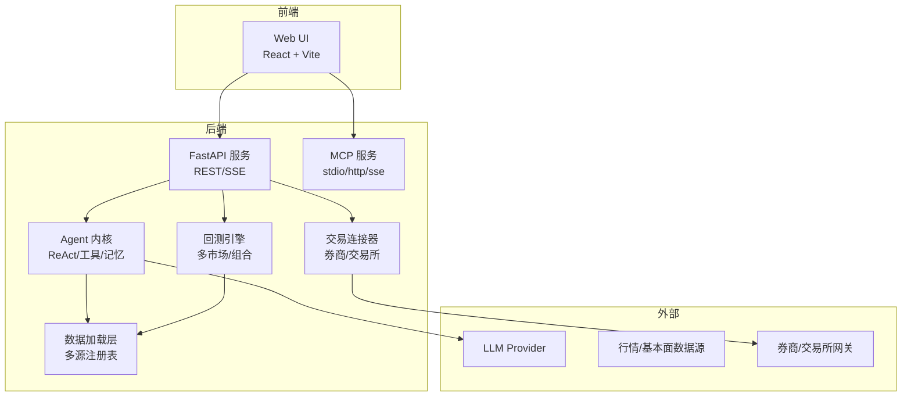
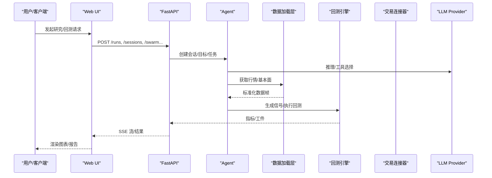
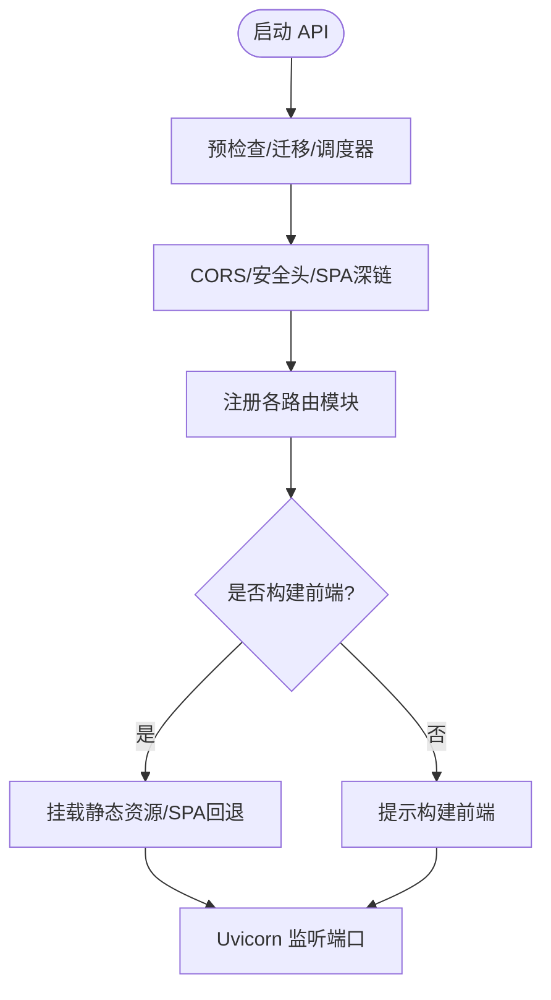
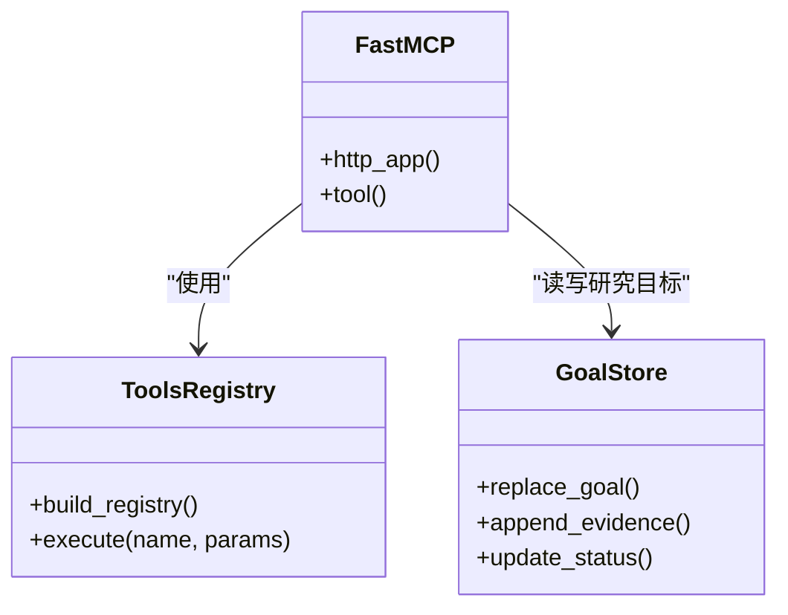
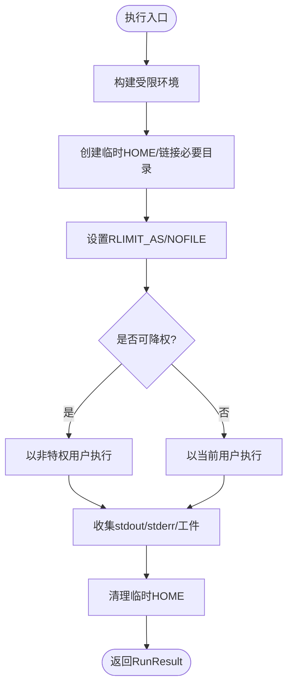
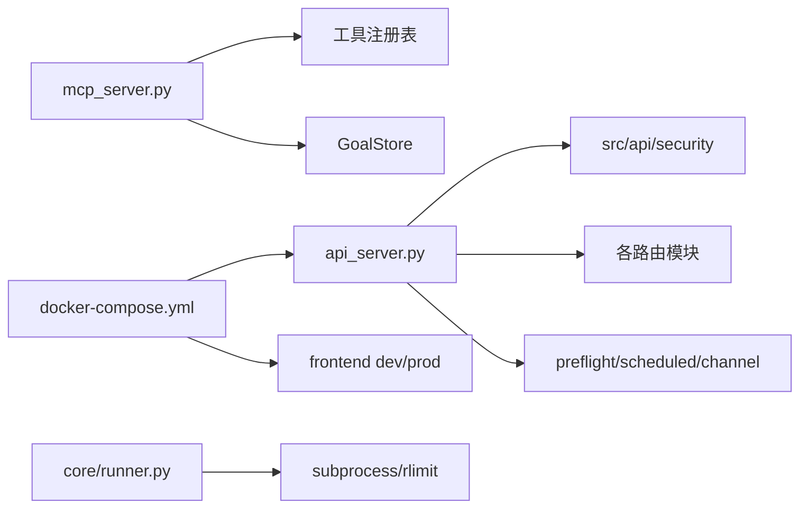

# 系统概览

<cite>
**本文引用的文件**
- [README.md](file://README.md)
- [README_zh.md](file://README_zh.md)
- [api_server.py](file://agent/api_server.py)
- [mcp_server.py](file://agent/mcp_server.py)
- [docker-compose.yml](file://docker-compose.yml)
- [runner.py](file://agent/src/core/runner.py)
- [__init__.py](file://agent/src/__init__.py)
- [config/__init__.py](file://agent/src/config/__init__.py)
</cite>

## 目录
1. [简介](#简介)
2. [项目结构](#项目结构)
3. [核心组件](#核心组件)
4. [架构总览](#架构总览)
5. [详细组件分析](#详细组件分析)
6. [依赖关系分析](#依赖关系分析)
7. [性能与扩展性](#性能与扩展性)
8. [故障排查指南](#故障排查指南)
9. [结论](#结论)
10. [附录](#附录)

## 简介
Vibe-Trading 是一个前后端分离、面向研究与交易的智能体平台。后端以 FastAPI 提供 REST/SSE/MCP 接口，前端为 React + Vite 的 Web UI；通过 MCP 暴露研究工具，结合多市场回测引擎、数据加载器与交易连接器，形成“AI 代理 → 量化回测 → 数据管理 → 交易集成”的闭环。系统支持 Docker Compose 一键部署，内置安全加固（沙箱执行、最小权限、只读根文件系统）与可观测性（运行产物、审计账本、SSE 心跳）。

## 项目结构
- 后端（Python）：FastAPI API Server、MCP Server、Agent 内核、回测引擎、数据加载器、会话与记忆、Swarm 编排、渠道通道等。
- 前端（React + Vite）：Web UI，提供聊天、Alpha 库、运行详情、对比、相关性等页面。
- 桌面壳（Electron）：可选宿主进程，负责后端生命周期管理与本地安全存储。
- 部署：Docker Compose 编排后端与开发期前端，持久化用户数据与运行产物。

图表来源
- [api_server.py:163-183](file://agent/api_server.py#L163-L183)
- [mcp_server.py:69-81](file://agent/mcp_server.py#L69-L81)
- [docker-compose.yml:1-90](file://docker-compose.yml#L1-L90)

章节来源
- [README_zh.md:1425-1488](file://README_zh.md#L1425-L1488)
- [api_server.py:163-183](file://agent/api_server.py#L163-L183)
- [mcp_server.py:69-81](file://agent/mcp_server.py#L69-L81)
- [docker-compose.yml:1-90](file://docker-compose.yml#L1-L90)

## 核心组件
- API 服务：FastAPI 应用，挂载中间件与安全策略，统一注册 runs/sessions/system/settings/uploads/channels/swarm/live/alpha/auth 等路由模块，启动时执行预检查并可选启动频道运行时。
- MCP 服务：基于 FastMCP 的工具总线，暴露研究、回测、因子、数据、新闻、机构持仓、Swarm、交易连接器读取等工具；网络传输具备 Host/Origin 白名单防护，默认仅环回可达。
- Agent 内核：ReAct 循环、上下文压缩、工具批处理、技能加载、持久记忆、会话状态、追踪与审计。
- 回测引擎：多市场引擎（股票、期货、外汇、期权、组合），按标的与市场规则执行，产出指标与风险透视工件。
- 数据管理层：统一 Loader 注册表与 fallback 链，覆盖 A 股、美股、港股、加密货币、外汇、期货等；支持本地缓存与 OHLC 完整性校验。
- 交易集成：Connector-first 架构，支持多家券商/交易所，区分模拟/实盘边界，订单前置守卫与审计。

章节来源
- [api_server.py:127-183](file://agent/api_server.py#L127-L183)
- [mcp_server.py:86-128](file://agent/mcp_server.py#L86-L128)
- [README_zh.md:1425-1488](file://README_zh.md#L1425-L1488)

## 架构总览
系统采用前后端分离与微服务式模块化设计：
- 前端通过 REST/SSE 与 API 交互，或通过 MCP 直接调用工具。
- API 作为编排层，协调 Agent、回测、数据与交易。
- MCP 作为工具总线，供任意 MCP 客户端（Claude Desktop、Cursor、OpenClaw 等）复用能力。
- 数据层通过注册表与 fallback 机制屏蔽异构数据源差异。
- 交易层通过 Connector 抽象隔离不同券商/交易所实现。

图表来源
- [api_server.py:163-183](file://agent/api_server.py#L163-L183)
- [mcp_server.py:69-81](file://agent/mcp_server.py#L69-L81)

章节来源
- [api_server.py:163-183](file://agent/api_server.py#L163-L183)
- [mcp_server.py:69-81](file://agent/mcp_server.py#L69-L81)

## 详细组件分析

### API 服务（FastAPI）
- 职责：组装应用、注册路由、中间件、生命周期钩子、静态资源与 SPA 深链回退。
- 关键流程：
  - 启动时执行预检查、迁移旧状态、启动定时研究执行器，可选自动启动频道运行时。
  - 挂载 CORS、安全头、SPA 深链回退等中间件。
  - 模块化注册 runs/sessions/system/settings/uploads/channels/swarm/live/alpha/auth 路由。
  - 生产模式提供前端静态资源，开发模式启动 Vite 热更新。

图表来源
- [api_server.py:127-183](file://agent/api_server.py#L127-L183)
- [api_server.py:321-395](file://agent/api_server.py#L321-L395)

章节来源
- [api_server.py:127-183](file://agent/api_server.py#L127-L183)
- [api_server.py:321-395](file://agent/api_server.py#L321-L395)

### MCP 服务（工具总线）
- 职责：暴露研究/回测/数据/交易读取等工具，支持 stdio/http/sse 传输；网络传输具备 DNS 重绑定防护（Host/Origin 白名单）。
- 关键特性：
  - 工具注册表懒加载，按需构建。
  - 会话 ID 解析：未指定时使用进程级稳定 ID。
  - 参数容错：对 list/dict 字符串参数进行 JSON 解码。
  - 安全：默认禁用 shell 工具，需显式环境变量或 CLI 开关启用。

图表来源
- [mcp_server.py:69-81](file://agent/mcp_server.py#L69-L81)
- [mcp_server.py:319-344](file://agent/mcp_server.py#L319-L344)
- [mcp_server.py:530-594](file://agent/mcp_server.py#L530-L594)

章节来源
- [mcp_server.py:69-81](file://agent/mcp_server.py#L69-L81)
- [mcp_server.py:319-344](file://agent/mcp_server.py#L319-L344)
- [mcp_server.py:530-594](file://agent/mcp_server.py#L530-L594)

### 回测执行器（Runner）
- 职责：在受限环境中执行生成的回测脚本，收集日志与工件，保障安全与资源上限。
- 关键机制：
  - 环境裁剪：仅允许必要的环境变量进入子进程。
  - 沙箱 HOME：临时 HOME 仅暴露必要路径，避免访问真实 ~/.vibe-trading 敏感数据。
  - 资源限制：POSIX 下通过 rlimit 限制虚拟内存与文件描述符。
  - 特权降级：在容器内尝试切换到非特权用户执行。
  - 工件规范：定义 equity/metrics/trades/positions/run_card 等输出契约。

图表来源
- [runner.py:372-620](file://agent/src/core/runner.py#L372-L620)

章节来源
- [runner.py:372-620](file://agent/src/core/runner.py#L372-L620)

### 配置与路径
- 职责：集中加载 Agent 配置、运行时路径、数据目录与覆盖合并。
- 关键点：
  - 提供 get_config_path/get_data_dir/get_runtime_root 等路径访问器。
  - 支持 load_agent_config/load_runtime_agent_config/load_swarm_agent_config 与 merge/sanitize 覆盖。

章节来源
- [config/__init__.py:1-25](file://agent/src/config/__init__.py#L1-L25)

## 依赖关系分析
- API 服务依赖：
  - 安全与模型：security/models/helpers/state
  - 路由模块：runs/sessions/system/settings/uploads/channels/swarm/live/alpha/auth
  - 生命周期：preflight、scheduled_research_executor、channel_runtime
- MCP 服务依赖：
  - FastMCP、工具注册表、GoalStore、市场数据工具
- 回测 Runner 依赖：
  - 子进程执行、资源限制、沙箱 HOME、工件规范
- 部署依赖：
  - Docker Compose 编排后端与前端，命名卷持久化用户数据与运行产物

图表来源
- [api_server.py:163-183](file://agent/api_server.py#L163-L183)
- [mcp_server.py:319-344](file://agent/mcp_server.py#L319-L344)
- [runner.py:372-620](file://agent/src/core/runner.py#L372-L620)
- [docker-compose.yml:1-90](file://docker-compose.yml#L1-L90)

章节来源
- [api_server.py:163-183](file://agent/api_server.py#L163-L183)
- [mcp_server.py:319-344](file://agent/mcp_server.py#L319-L344)
- [runner.py:372-620](file://agent/src/core/runner.py#L372-L620)
- [docker-compose.yml:1-90](file://docker-compose.yml#L1-L90)

## 性能与扩展性
- 数据层：
  - 多源注册表与 fallback 链提升鲁棒性；可选本地缓存减少重复下载与限流影响。
  - OHLC 完整性校验在 loader 边界集中丢弃脏 bar，保证后续计算正确性。
- 回测：
  - 多市场引擎按规则执行，组合引擎支持跨市场资金池与差异化规则。
  - Runner 通过 rlimit 与沙箱 HOME 控制资源与访问面，避免单任务拖垮系统。
- 可扩展性：
  - 插件化：Skills、Tools、Factors、Engines、Loaders、Connectors 均通过注册表发现与扩展。
  - 微服务式模块化：API 路由拆分至独立模块，便于维护与测试。
- 部署：
  - Docker Compose 提供资源限制（CPU/内存/PID）、只读根文件系统、tmpfs 写盘与命名卷持久化。

[本节为通用指导，不直接分析具体文件]

## 故障排查指南
- 启动问题：
  - 检查 API 预检查与迁移是否成功；确认端口占用与前端构建产物是否存在。
  - 若远程访问失败，确认是否设置 API_AUTH_KEY 或使用 localhost。
- 数据问题：
  - 观察 loader fallback 链是否命中；检查缓存开关与网络代理设置。
  - 关注 OHLC 合法性校验告警，定位异常数据源。
- 回测问题：
  - 查看 Runner 子进程 stdout/stderr 日志；确认沙箱 HOME 与允许的运行根目录。
  - 调整 RLIMIT_AS 与环境变量以满足长周期/分钟级回测需求。
- 安全与权限：
  - 确认 MCP 网络传输的 Host/Origin 白名单；仅在必要时启用 shell 工具。
  - 检查 Docker 容器的 capabilities、no-new-privileges 与只读根文件系统配置。

章节来源
- [api_server.py:127-183](file://agent/api_server.py#L127-L183)
- [mcp_server.py:131-140](file://agent/mcp_server.py#L131-L140)
- [runner.py:480-620](file://agent/src/core/runner.py#L480-L620)
- [docker-compose.yml:40-66](file://docker-compose.yml#L40-L66)

## 结论
Vibe-Trading 通过前后端分离与模块化微服务设计，将 AI 代理、量化回测、数据管理与交易集成有机整合。其插件化注册表机制使系统具备高度可扩展性；安全沙箱与资源限制确保在生产环境中的稳健运行；Docker Compose 简化了部署与运维。未来可在更多市场、数据源与交易连接器上持续扩展，同时保持严格的审计与可观测性。

[本节为总结，不直接分析具体文件]

## 附录
- 技术栈要点：
  - 后端：Python + FastAPI + Uvicorn
  - 前端：React 19 + Vite + TypeScript
  - 桌面壳：Electron（可选）
  - 部署：Docker + Docker Compose
- 运行环境要求：
  - Python 3.11+；Node 22（前端开发）
  - 可选 Ollama 本地 LLM（通过 host.docker.internal 访问）
  - 推荐设置 API_AUTH_KEY 用于远程访问保护
- 启动流程：
  - 安装依赖 → 准备 .env → 启动 API（含预检查/路由注册）→ 可选启动频道/调度器 → 前端构建或开发模式 → 浏览器访问
- 服务发现与负载均衡：
  - 单体部署为主；如需水平扩展，可在 API 前加反向代理（如 Nginx）做负载均衡，并结合消息队列与分布式存储扩展会话与运行状态。

章节来源
- [README.md:1-182](file://README.md#L1-L182)
- [docker-compose.yml:1-90](file://docker-compose.yml#L1-L90)
- [api_server.py:321-395](file://agent/api_server.py#L321-L395)