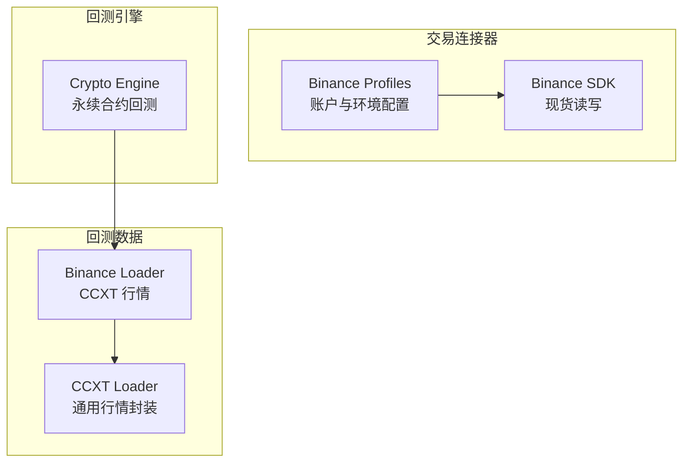
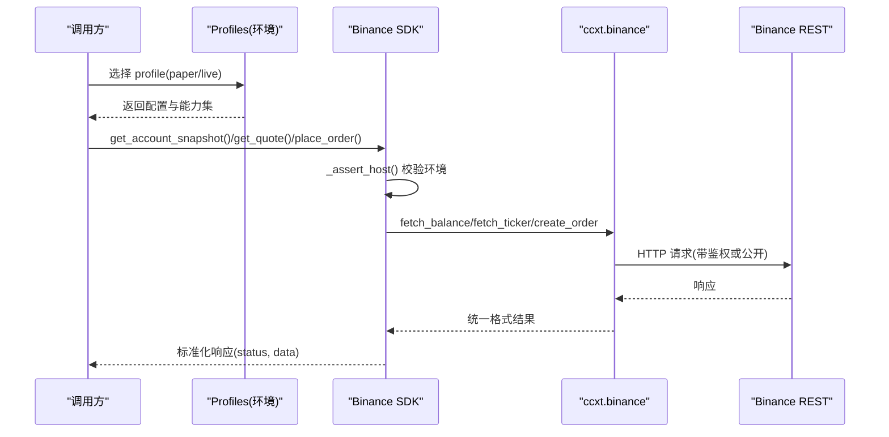
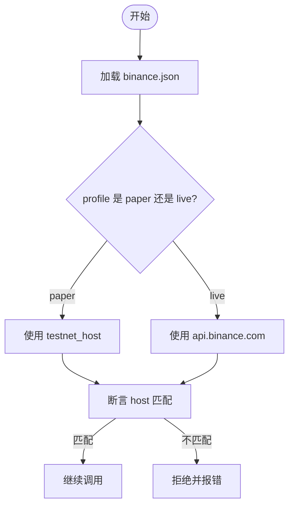
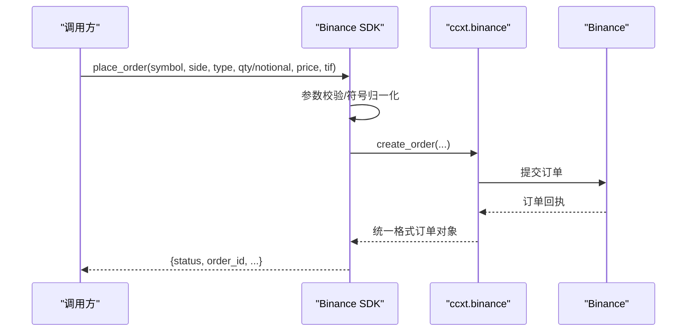
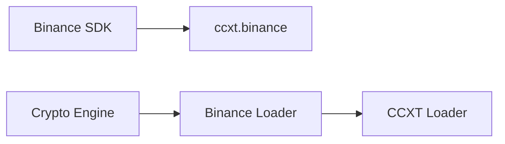

# Binance 加密货币交易所集成

<cite>
**本文引用的文件**
- [agent/src/trading/connectors/binance/sdk.py](file://agent/src/trading/connectors/binance/sdk.py)
- [agent/src/trading/connectors/binance/profiles.py](file://agent/src/trading/connectors/binance/profiles.py)
- [agent/backtest/loaders/binance_loader.py](file://agent/backtest/loaders/binance_loader.py)
- [agent/backtest/loaders/ccxt_loader.py](file://agent/backtest/loaders/ccxt_loader.py)
- [agent/backtest/engines/crypto.py](file://agent/backtest/engines/crypto.py)
</cite>

## 目录
1. [简介](#简介)
2. [项目结构](#项目结构)
3. [核心组件](#核心组件)
4. [架构总览](#架构总览)
5. [详细组件分析](#详细组件分析)
6. [依赖关系分析](#依赖关系分析)
7. [性能与速率限制](#性能与速率限制)
8. [故障排查指南](#故障排查指南)
9. [结论](#结论)
10. [附录](#附录)

## 简介
本文件面向在 Vibe-Trading 中集成 Binance 的工程师与策略开发者，系统性说明：
- 认证方式、环境隔离（测试网/实盘）与权限管理
- 现货交易实现（订单类型、参数约束、下单与撤单流程）
- 行情数据获取（K线、报价、历史数据）
- 合约回测能力（永续合约引擎、资金费率、强平规则）
- 错误处理、重试机制与异常恢复策略
- 部署配置要点与监控建议

本项目通过 ccxt 统一接口对接 Binance 现货 REST API；回测阶段提供基于 CCXT 的行情加载器与永续合约回测引擎。期权交易在本仓库中未提供直接实现，详见“附录”。

## 项目结构
围绕 Binance 的关键代码分布在以下位置：
- 交易连接器（现货）：agent/src/trading/connectors/binance
- 行情加载器（回测）：agent/backtest/loaders
- 永续合约回测引擎：agent/backtest/engines/crypto.py

图表来源
- [agent/src/trading/connectors/binance/sdk.py:1-22](file://agent/src/trading/connectors/binance/sdk.py#L1-L22)
- [agent/src/trading/connectors/binance/profiles.py:1-71](file://agent/src/trading/connectors/binance/profiles.py#L1-L71)
- [agent/backtest/loaders/binance_loader.py:1-45](file://agent/backtest/loaders/binance_loader.py#L1-L45)
- [agent/backtest/loaders/ccxt_loader.py:1-200](file://agent/backtest/loaders/ccxt_loader.py#L1-L200)
- [agent/backtest/engines/crypto.py:1-200](file://agent/backtest/engines/crypto.py#L1-L200)

章节来源
- [agent/src/trading/connectors/binance/sdk.py:1-22](file://agent/src/trading/connectors/binance/sdk.py#L1-L22)
- [agent/src/trading/connectors/binance/profiles.py:1-71](file://agent/src/trading/connectors/binance/profiles.py#L1-L71)
- [agent/backtest/loaders/binance_loader.py:1-45](file://agent/backtest/loaders/binance_loader.py#L1-L45)
- [agent/backtest/loaders/ccxt_loader.py:1-200](file://agent/backtest/loaders/ccxt_loader.py#L1-L200)
- [agent/backtest/engines/crypto.py:1-200](file://agent/backtest/engines/crypto.py#L1-L200)

## 核心组件
- 连接器配置与环境隔离
  - 支持 paper/live-readonly/live 三种 profile，分别对应测试网、实盘只读、实盘可写
  - 通过 host 白名单强制区分测试网与实盘，避免密钥误用
- 现货交易
  - 支持市价单（含按计价资产金额下单）、限价单
  - 支持 IOC/FOK/GTC 等成交方式映射
  - 下单前进行严格参数校验，失败即关闭（fail-closed）
- 行情与账户
  - 账户快照、持仓（现货以余额体现）、挂单查询、最近成交
  - 最新报价与历史 K 线（多周期）
- 回测数据与引擎
  - 专用 Binance Loader 与通用 CCXT Loader
  - 永续合约回测引擎（资金费率、强平、滑点与手续费模型）

章节来源
- [agent/src/trading/connectors/binance/sdk.py:82-152](file://agent/src/trading/connectors/binance/sdk.py#L82-L152)
- [agent/src/trading/connectors/binance/sdk.py:267-405](file://agent/src/trading/connectors/binance/sdk.py#L267-L405)
- [agent/src/trading/connectors/binance/sdk.py:423-547](file://agent/src/trading/connectors/binance/sdk.py#L423-L547)
- [agent/backtest/loaders/binance_loader.py:23-45](file://agent/backtest/loaders/binance_loader.py#L23-L45)
- [agent/backtest/loaders/ccxt_loader.py:184-200](file://agent/backtest/loaders/ccxt_loader.py#L184-L200)
- [agent/backtest/engines/crypto.py:41-130](file://agent/backtest/engines/crypto.py#L41-L130)

## 架构总览
下图展示从上层调用到 Binance 现货 REST 的端到端路径，以及回测数据流。

图表来源
- [agent/src/trading/connectors/binance/sdk.py:217-264](file://agent/src/trading/connectors/binance/sdk.py#L217-L264)
- [agent/src/trading/connectors/binance/sdk.py:267-405](file://agent/src/trading/connectors/binance/sdk.py#L267-L405)
- [agent/src/trading/connectors/binance/sdk.py:423-547](file://agent/src/trading/connectors/binance/sdk.py#L423-L547)
- [agent/src/trading/connectors/binance/sdk.py:628-662](file://agent/src/trading/connectors/binance/sdk.py#L628-L662)

## 详细组件分析

### 认证、环境与权限管理
- 配置文件
  - 用户级配置路径：~/.vibe-trading/binance.json
  - 字段包括 api_key、api_secret、profile、testnet_host、timeout、readonly
- 环境隔离
  - testnet_host 默认指向测试网域名；live 固定为 api.binance.com
  - 每次请求前执行 host 白名单校验，不匹配则拒绝
- 权限控制
  - profiles 定义四种内置 profile：paper、live-readonly、paper-trade、live-trade
  - live-trade 标注 requires_mandate，需在上层策略/审批门控后放行下单

图表来源
- [agent/src/trading/connectors/binance/sdk.py:157-193](file://agent/src/trading/connectors/binance/sdk.py#L157-L193)
- [agent/src/trading/connectors/binance/sdk.py:643-662](file://agent/src/trading/connectors/binance/sdk.py#L643-L662)
- [agent/src/trading/connectors/binance/profiles.py:14-70](file://agent/src/trading/connectors/binance/profiles.py#L14-L70)

章节来源
- [agent/src/trading/connectors/binance/sdk.py:82-152](file://agent/src/trading/connectors/binance/sdk.py#L82-L152)
- [agent/src/trading/connectors/binance/sdk.py:157-193](file://agent/src/trading/connectors/binance/sdk.py#L157-L193)
- [agent/src/trading/connectors/binance/sdk.py:643-662](file://agent/src/trading/connectors/binance/sdk.py#L643-L662)
- [agent/src/trading/connectors/binance/profiles.py:14-70](file://agent/src/trading/connectors/binance/profiles.py#L14-L70)

### 现货交易：订单类型与下单流程
- 支持的订单类型
  - 市价单：支持 quantity（基础资产数量）或 notional（计价资产金额）
  - 限价单：必须提供 quantity 与 limit_price
- 成交方式（time_in_force）
  - day → GTC；gtc → GTC；ioc → IOC；fok → FOK
- 下单参数校验
  - side 必须 buy/sell；order_type 必须 market/limit
  - quantity 与 notional 二选一且为正数；限价单禁止 notional
- 下单流程
  - 解析 symbol（支持 BTC/USDT、BTC-USDT、BTCUSDT）
  - 构建 ccxt create_order 参数
  - 捕获异常并返回统一错误结构

图表来源
- [agent/src/trading/connectors/binance/sdk.py:423-547](file://agent/src/trading/connectors/binance/sdk.py#L423-L547)
- [agent/src/trading/connectors/binance/sdk.py:59-79](file://agent/src/trading/connectors/binance/sdk.py#L59-L79)

章节来源
- [agent/src/trading/connectors/binance/sdk.py:412-547](file://agent/src/trading/connectors/binance/sdk.py#L412-L547)

### 账户信息、持仓与挂单
- 账户快照：返回非零余额（free/used/total）
- 持仓：现货无“仓位”概念，由非零余额映射为 position 形状
- 挂单与成交：
  - 获取全部挂单；若平台要求指定 symbol，降级为 note 而非失败
  - 可选拉取最近成交（fetch_my_trades），同样具备降级逻辑

章节来源
- [agent/src/trading/connectors/binance/sdk.py:267-352](file://agent/src/trading/connectors/binance/sdk.py#L267-L352)

### 行情数据获取
- 最新报价：统一格式 bid/ask/last/high/low/volume/time
- 历史 K 线：支持 1m/5m/15m/30m/1h/4h/1d/1w/1M
- 回测数据加载器：
  - Binance Loader 专用于 Binance spot/USD-M swap 的 OHLCV 读取
  - CCXT Loader 提供通用封装、代理、超时与预算控制

章节来源
- [agent/src/trading/connectors/binance/sdk.py:355-405](file://agent/src/trading/connectors/binance/sdk.py#L355-L405)
- [agent/backtest/loaders/binance_loader.py:23-45](file://agent/backtest/loaders/binance_loader.py#L23-L45)
- [agent/backtest/loaders/ccxt_loader.py:184-200](file://agent/backtest/loaders/ccxt_loader.py#L184-L200)

### 合约交易（回测）
- 当前仓库未提供实盘合约下单连接器；提供永续合约回测引擎
- 引擎特性
  - 24/7 交易、Maker/Taker 手续费分离、滑点
  - 资金费率结算（每 8 小时）
  - 强平规则：维持保证金比率阈值触发
  - 支持隔离/全仓模式与严格模式（perpetual_strict）
- 市场风险源
  - 默认使用 ccxt:binanceusdm 作为市场风险数据来源

章节来源
- [agent/backtest/engines/crypto.py:1-200](file://agent/backtest/engines/crypto.py#L1-L200)

### 特殊订单功能
- 市价单按计价资产金额下单（notional）：通过 ccxt 的 quoteOrderQty 参数实现
- 成交方式映射：day→GTC，支持 IOC/FOK/GTC
- 注意：当前连接器仅暴露现货下单；止损单等高级类型不在本连接器内实现

章节来源
- [agent/src/trading/connectors/binance/sdk.py:412-547](file://agent/src/trading/connectors/binance/sdk.py#L412-L547)

## 依赖关系分析
- 运行时依赖
  - ccxt：可选依赖，缺失时健康检查会报告状态
  - pandas：回测数据计算
- 模块耦合
  - Binance SDK 依赖 ccxt.binance 与本地配置
  - Binance Loader 继承自 CCXT Loader，复用代理、超时与预算控制
  - Crypto Engine 消费 Loader 提供的 OHLCV 与资金费率数据

图表来源
- [agent/src/trading/connectors/binance/sdk.py:608-640](file://agent/src/trading/connectors/binance/sdk.py#L608-L640)
- [agent/backtest/loaders/binance_loader.py:15-45](file://agent/backtest/loaders/binance_loader.py#L15-L45)
- [agent/backtest/loaders/ccxt_loader.py:184-200](file://agent/backtest/loaders/ccxt_loader.py#L184-L200)
- [agent/backtest/engines/crypto.py:180-200](file://agent/backtest/engines/crypto.py#L180-L200)

章节来源
- [agent/src/trading/connectors/binance/sdk.py:608-640](file://agent/src/trading/connectors/binance/sdk.py#L608-L640)
- [agent/backtest/loaders/binance_loader.py:15-45](file://agent/backtest/loaders/binance_loader.py#L15-L45)
- [agent/backtest/loaders/ccxt_loader.py:184-200](file://agent/backtest/loaders/ccxt_loader.py#L184-L200)
- [agent/backtest/engines/crypto.py:180-200](file://agent/backtest/engines/crypto.py#L180-L200)

## 性能与速率限制
- 速率限制
  - ccxt 客户端启用 enableRateLimit，自动限速
  - 网络超时：SDK 默认 15 秒；回测可通过环境变量 CCXT_TIMEOUT_MS 调整
- 预算与重试
  - 回测侧设置 CCXT_FETCH_BUDGET_S 限制单次抓取耗时，避免长时间阻塞
  - 重试调度委托给 base 模块的 retry_with_budget/cached_loader_fetch
- 代理支持
  - 通过 ALL_PROXY/HTTP_PROXY/HTTPS_PROXY 注入代理配置
- 建议
  - 生产环境合理调大 timeout，结合业务 SLA
  - 对高频行情拉取采用分页与缓存，避免触发交易所限频

章节来源
- [agent/src/trading/connectors/binance/sdk.py:628-640](file://agent/src/trading/connectors/binance/sdk.py#L628-L640)
- [agent/backtest/loaders/ccxt_loader.py:50-92](file://agent/backtest/loaders/ccxt_loader.py#L50-L92)

## 故障排查指南
- 常见错误与定位
  - 配置缺失：check_status 会报告缺少 api_key/api_secret
  - 依赖缺失：ccxt 未安装将报告状态 error
  - 环境不匹配：_assert_host 抛出配置错误，阻止访问错误主机
  - 需要 symbol 的接口：当平台要求 symbol 时，降级为 note 而非失败
- 下单失败
  - 参数校验失败：side/order_type/quantity/notional/price/tif 不合法
  - 执行异常：任何 ccxt/auth/network 异常均被捕获并返回错误
- 建议步骤
  - 先运行 check_status 确认连接与健康
  - 核对 profile 与 host 是否一致
  - 逐步缩小问题范围：symbol 归一化、参数合法性、网络与代理

章节来源
- [agent/src/trading/connectors/binance/sdk.py:217-264](file://agent/src/trading/connectors/binance/sdk.py#L217-L264)
- [agent/src/trading/connectors/binance/sdk.py:423-547](file://agent/src/trading/connectors/binance/sdk.py#L423-L547)
- [agent/src/trading/connectors/binance/sdk.py:616-625](file://agent/src/trading/connectors/binance/sdk.py#L616-L625)

## 结论
- 本项目通过 ccxt 提供了稳健的 Binance 现货连接器，具备严格的 host 隔离与参数校验，适合研究与模拟交易
- 回测体系完善：专用 Binance Loader + 通用 CCXT Loader + 永续合约引擎，覆盖主流量化场景
- 实盘合约与期权交易未在连接器层实现；如需扩展，可参考现有模式新增合约/期权适配器
- 生产部署应重视：配置安全、速率限制、超时与预算、代理与监控告警

## 附录
- 资金划转
  - 当前连接器未暴露资金划转接口；可在更高层服务中基于 ccxt 或其他官方 SDK 扩展
- 期权交易
  - 仓库未包含 Binance 期权连接器；如需接入，建议参照现货连接器模式新增适配器，并补充权限与风控门控
- 部署与监控建议
  - 配置：集中管理 binance.json，最小权限原则，定期轮换密钥
  - 监控：记录每次请求的 profile/host、耗时、状态码与错误类别；对失败率与延迟设置阈值告警
  - 治理：live-trade 必须经 mandate 审批；所有写入操作审计留痕