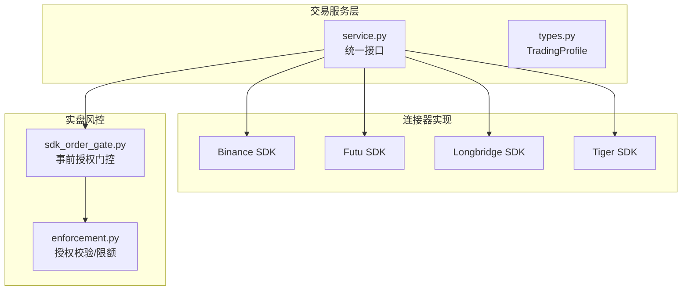
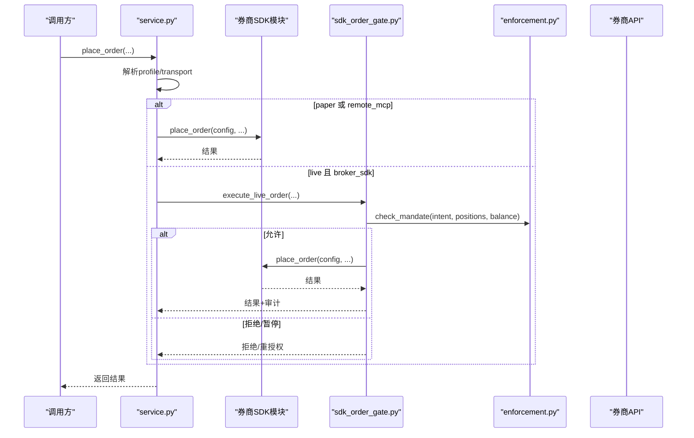
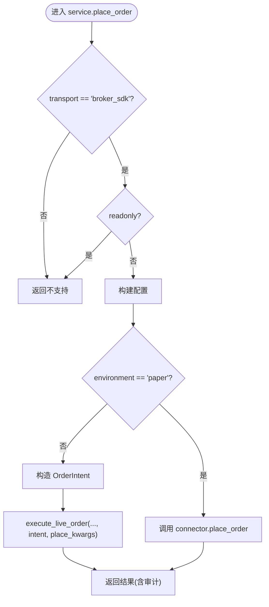
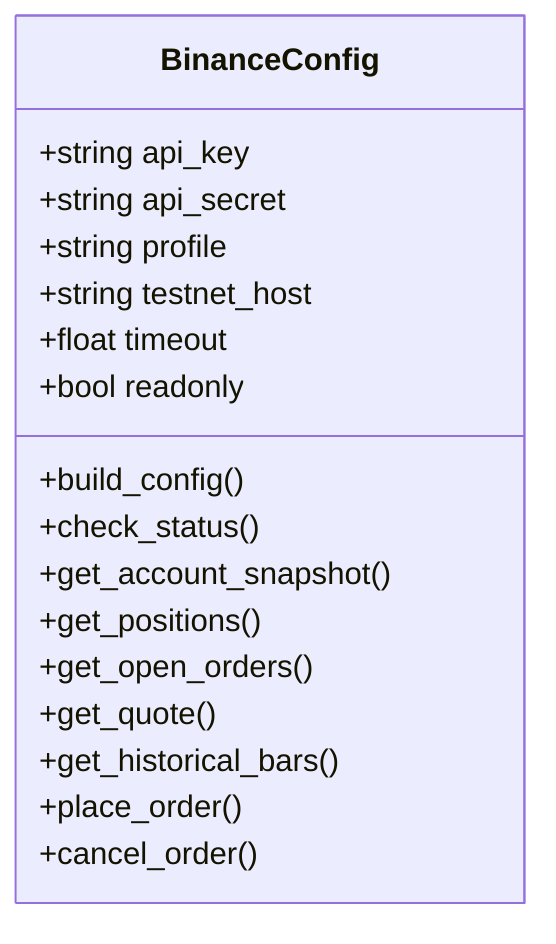
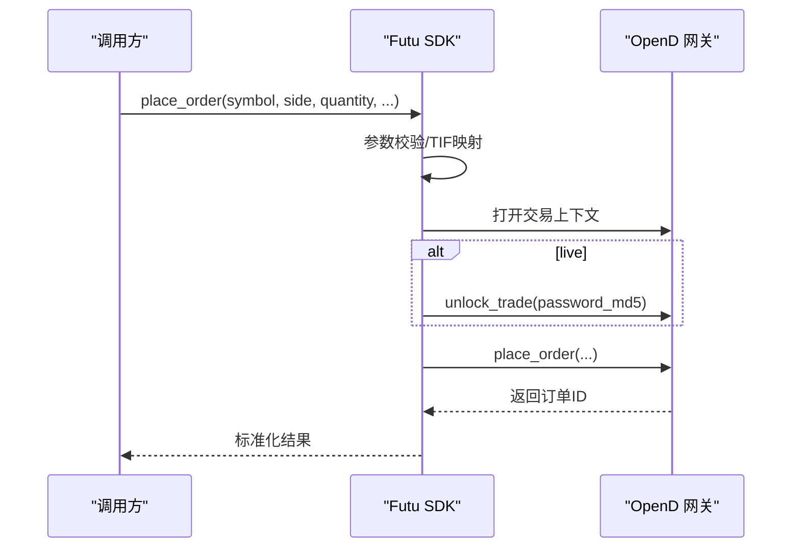
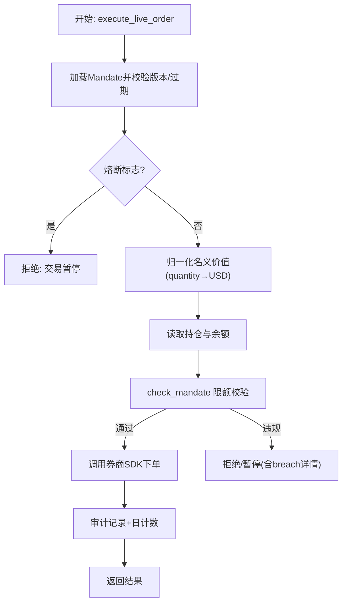
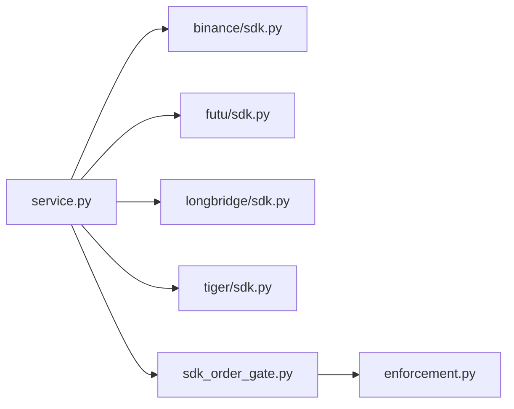

# 交易连接器集成

<cite>
**本文引用的文件**
- [service.py](file://agent/src/trading/service.py)
- [types.py](file://agent/src/trading/types.py)
- [binance/sdk.py](file://agent/src/trading/connectors/binance/sdk.py)
- [futu/sdk.py](file://agent/src/trading/connectors/futu/sdk.py)
- [longbridge/sdk.py](file://agent/src/trading/connectors/longbridge/sdk.py)
- [tiger/sdk.py](file://agent/src/trading/connectors/tiger/sdk.py)
- [sdk_order_gate.py](file://agent/src/live/sdk_order_gate.py)
- [enforcement.py](file://agent/src/live/enforcement.py)
</cite>

## 目录
1. [简介](#简介)
2. [项目结构](#项目结构)
3. [核心组件](#核心组件)
4. [架构总览](#架构总览)
5. [详细组件分析](#详细组件分析)
6. [依赖关系分析](#依赖关系分析)
7. [性能考虑](#性能考虑)
8. [故障排查指南](#故障排查指南)
9. [结论](#结论)
10. [附录](#附录)

## 简介
本文件为 Vibe-Trading 交易连接器集成的架构文档，聚焦于抽象层设计、统一订单接口与券商适配机制。内容覆盖已实现的 Binance、富途（Futu）、长桥（Longbridge）、老虎（Tiger）等连接器的认证方式与 API 封装；解释订单生命周期管理、风险控制（事前授权与限额校验、熔断、审计）与异常处理策略；并提供自定义连接器开发指南（SDK 集成、协议适配与安全要点），以及实盘部署模式与监控方案建议。

## 项目结构
交易连接器位于 agent/src/trading 下，采用“服务层 + 连接器模块”的分层组织：
- 服务层（service.py）：提供统一的读/写接口（账户、持仓、订单、报价、历史行情、下单、撤单等），按 profile 的 transport 路由到本地 TWS、远程 MCP 或直接 SDK。
- 类型定义（types.py）：统一描述 TradingProfile（id、connector、label、environment、transport、capabilities、readonly、config、notes）。
- 连接器实现（connectors/*）：每个券商一个子包，包含 classification/profiles/sdk 等，暴露统一的 read/write 函数签名。
- 实盘风控（src/live）：事前授权门控（mandate gate）、熔断（halt）、审计（audit）、日计数（daily count）与指令归一化。

图表来源
- [service.py:17-29](file://agent/src/trading/service.py#L17-L29)
- [types.py:20-51](file://agent/src/trading/types.py#L20-L51)
- [sdk_order_gate.py:59-157](file://agent/src/live/sdk_order_gate.py#L59-L157)
- [enforcement.py:455-617](file://agent/src/live/enforcement.py#L455-L617)

章节来源
- [service.py:1-120](file://agent/src/trading/service.py#L1-L120)
- [types.py:1-52](file://agent/src/trading/types.py#L1-L52)

## 核心组件
- 统一配置与能力声明：TradingProfile 描述连接器身份、环境（paper/live）、传输方式（local_tws/remote_mcp/broker_sdk）、能力集与只读标记。
- 统一读接口：check_connection/get_account/get_positions/get_open_orders/get_quote/get_history，按 profile.transport 路由到具体实现。
- 统一写接口：place_order/cancel_order/close_position/edit_position_stops 等，仅对 broker_sdk 且非 readonly 生效；live 路径强制经过事前授权门控与审计。
- 券商适配器：每个 connector 的 sdk.py 暴露 build_config/check_status/get_account_snapshot/get_positions/get_open_orders/get_quote/get_historical_bars/place_order/cancel_order 等统一函数。
- 事前授权门控：execute_live_order/execute_live_action 在调用券商 SDK 前执行 mandate 校验、熔断检查、数量/名义价值归一化、持仓与余额读取、限额检查、审计记录与日计数。

章节来源
- [service.py:42-147](file://agent/src/trading/service.py#L42-L147)
- [service.py:279-342](file://agent/src/trading/service.py#L279-L342)
- [sdk_order_gate.py:59-157](file://agent/src/live/sdk_order_gate.py#L59-L157)

## 架构总览
下图展示从上层工具/CLI/MCP 到券商 SDK 的完整调用链，包括纸盘直连与实盘事前授权门控。

图表来源
- [service.py:279-342](file://agent/src/trading/service.py#L279-L342)
- [sdk_order_gate.py:59-157](file://agent/src/live/sdk_order_gate.py#L59-L157)
- [enforcement.py:455-617](file://agent/src/live/enforcement.py#L455-L617)

## 详细组件分析

### 抽象层与服务路由（service.py）
- 路由策略：根据 profile.transport 选择 local_tws（IBKR 本地 TWS）、broker_sdk（直接调用券商 SDK 模块）或远程 MCP。
- 统一读：get_account/get_positions/get_open_orders/get_quote/get_history 均通过 _with_profile 包装并附加 profile 上下文。
- 统一写：place_order 仅支持 broker_sdk 且非 readonly；live 路径构造 OrderIntent 并调用 execute_live_order，完成授权、熔断、限额与审计。
- 取消与关闭：cancel_order/close_position 走 _route_sdk_write，风险降低型操作可绕过部分限制但仍需审计。

图表来源
- [service.py:279-342](file://agent/src/trading/service.py#L279-L342)

章节来源
- [service.py:17-29](file://agent/src/trading/service.py#L17-L29)
- [service.py:42-147](file://agent/src/trading/service.py#L42-L147)
- [service.py:279-342](file://agent/src/trading/service.py#L279-L342)

### 统一数据模型（types.py）
- TradingProfile：稳定 id、connector key、显示标签、环境（paper/live）、传输方式、能力集、只读标志、连接器默认配置与备注。
- Transport：local_tws、remote_mcp、broker_sdk。
- READ_CAPABILITIES：声明标准读能力集合，便于能力协商与降级。

章节来源
- [types.py:1-52](file://agent/src/trading/types.py#L1-L52)

### 券商适配器：Binance（现货）
- 认证与环境：ccxt 封装 binance；testnet 与 live 通过 set_sandbox_mode 与 host 分离；check_status 会断言 host 与 profile 一致，防止错配。
- 统一读：account/positions/orders/quote/history 均返回标准化 envelope（status、profile、is_testnet、paper_guard 等）。
- 下单与撤单：place_order/cancel_order 严格参数校验（quantity/notional 互斥、限价价格正数、TIF 映射），失败即关闭（fail-closed）。
- 安全要点：host 白名单校验、密钥与测试网隔离、可选依赖 ccxt 检测。

图表来源
- [binance/sdk.py:82-152](file://agent/src/trading/connectors/binance/sdk.py#L82-L152)
- [binance/sdk.py:217-405](file://agent/src/trading/connectors/binance/sdk.py#L217-L405)
- [binance/sdk.py:423-600](file://agent/src/trading/connectors/binance/sdk.py#L423-L600)

章节来源
- [binance/sdk.py:59-152](file://agent/src/trading/connectors/binance/sdk.py#L59-L152)
- [binance/sdk.py:217-405](file://agent/src/trading/connectors/binance/sdk.py#L217-L405)
- [binance/sdk.py:423-600](file://agent/src/trading/connectors/binance/sdk.py#L423-L600)

### 券商适配器：富途（Futu）
- 认证与环境：本地 OpenD 网关（默认 127.0.0.1:11111），通过 trd_env（SIMULATE/REAL）区分纸盘/实盘；check_status 探测端口并验证账户环境。
- 统一读：账户、持仓、订单、报价、历史 K 线均通过 OpenSecTradeContext/OpenQuoteContext 获取并规范化。
- 下单与撤单：live 需要解锁交易上下文（密码 MD5 环境变量），paper 不解锁；所有错误以 envelope 形式返回。
- 安全要点：trd_env 强校验、OpenD 可达性检查、密码哈希由环境变量注入。

图表来源
- [futu/sdk.py:407-539](file://agent/src/trading/connectors/futu/sdk.py#L407-L539)
- [futu/sdk.py:617-643](file://agent/src/trading/connectors/futu/sdk.py#L617-L643)

章节来源
- [futu/sdk.py:223-393](file://agent/src/trading/connectors/futu/sdk.py#L223-L393)
- [futu/sdk.py:407-539](file://agent/src/trading/connectors/futu/sdk.py#L407-L539)
- [futu/sdk.py:617-643](file://agent/src/trading/connectors/futu/sdk.py#L617-L643)

### 券商适配器：长桥（Longbridge）
- 认证与环境：App Key + App Secret + Access Token；无运行时纸/实盘区分字段，因此以“配置声明”作为 guard（paper_guard="config_declared"）。
- 统一读：账户、持仓、订单、报价、K 线通过 TradeContext/QuoteContext 获取并标准化。
- 下单与撤单：仅支持纸盘（结构性限制），任何非 paper 配置直接拒绝；参数严格校验（quantity 必填、TIF 仅 Day）。
- 安全要点：凭据原子解析与来源追踪、公开配置脱敏、结构性拒绝 live 下单。

章节来源
- [longbridge/sdk.py:58-171](file://agent/src/trading/connectors/longbridge/sdk.py#L58-L171)
- [longbridge/sdk.py:220-428](file://agent/src/trading/connectors/longbridge/sdk.py#L220-L428)
- [longbridge/sdk.py:449-619](file://agent/src/trading/connectors/longbridge/sdk.py#L449-L619)

### 券商适配器：老虎（Tiger）
- 认证与环境：RSA 私钥 + tiger_id + 账号；17 位数字账号视为纸盘，其他为实盘；check_status 校验账号格式与环境匹配。
- 统一读：账户资产、持仓、订单、报价、K 线通过 TradeClient/QuoteClient 获取并标准化。
- 下单与撤单：参数严格校验；paper 账户强制 DAY TIF；reject/inactive 状态被识别并拒绝上报。
- 安全要点：账号格式强校验、私钥路径存在性检查、版本兼容的调用回退。

章节来源
- [tiger/sdk.py:61-147](file://agent/src/trading/connectors/tiger/sdk.py#L61-L147)
- [tiger/sdk.py:186-319](file://agent/src/trading/connectors/tiger/sdk.py#L186-L319)
- [tiger/sdk.py:333-489](file://agent/src/trading/connectors/tiger/sdk.py#L333-L489)

### 实盘事前授权门控与风控（sdk_order_gate.py + enforcement.py）
- 流程要点：
  - 加载 Mandate 并校验版本与过期时间。
  - 检查熔断标志（halt_flag_set）。
  - 将 quantity 归一化为 USD 名义价值（优先 connector 报价，其次数据加载器）。
  - 读取当前持仓与账户余额。
  - 调用 check_mandate 进行多维限额校验（排除列表、允许品种、资产类别、单笔名义上限、总敞口、杠杆、日交易次数、资金上限、流动性/市值门槛）。
  - 允许则执行券商 SDK 下单；拒绝则返回结构化拒绝信息（含 breach 详情与是否需重新授权）。
  - 成功写入审计事件并递增日计数。
- 关键数据结构：OrderIntent（符号、方向、USD 名义、数量、品种类型、资产类别）、BreachEvent（违规类型、限额值、尝试值、建议动作等）。

图表来源
- [sdk_order_gate.py:59-157](file://agent/src/live/sdk_order_gate.py#L59-L157)
- [sdk_order_gate.py:317-438](file://agent/src/live/sdk_order_gate.py#L317-L438)
- [enforcement.py:455-617](file://agent/src/live/enforcement.py#L455-L617)

章节来源
- [sdk_order_gate.py:59-157](file://agent/src/live/sdk_order_gate.py#L59-L157)
- [sdk_order_gate.py:317-438](file://agent/src/live/sdk_order_gate.py#L317-L438)
- [enforcement.py:111-177](file://agent/src/live/enforcement.py#L111-L177)
- [enforcement.py:455-617](file://agent/src/live/enforcement.py#L455-L617)

## 依赖关系分析
- 服务层依赖各券商 SDK 模块，通过动态 import 加载（_SDK_CONNECTOR_MODULES 映射）。
- 实盘门控依赖 enforcement 模块进行纯决策计算，依赖 audit/daily_count/halt 等子系统。
- 各连接器依赖各自第三方 SDK（ccxt、futu-api、longbridge/longport、tigeropen），并以可选依赖方式检测可用性。

图表来源
- [service.py:17-29](file://agent/src/trading/service.py#L17-L29)
- [sdk_order_gate.py:59-157](file://agent/src/live/sdk_order_gate.py#L59-L157)
- [enforcement.py:455-617](file://agent/src/live/enforcement.py#L455-L617)

章节来源
- [service.py:17-29](file://agent/src/trading/service.py#L17-L29)
- [sdk_order_gate.py:59-157](file://agent/src/live/sdk_order_gate.py#L59-L157)

## 性能考虑
- 连接器读接口尽量使用批量查询（如历史 K 线 limit 控制、分页键），避免频繁小请求。
- 实盘门控中 quote 获取失败会降级为 None 并导致拒绝（fail-closed），建议在高频场景缓存最近报价以降低网络抖动影响。
- 长桥/富途等本地网关连接应确保 TCP 端口可达与超时合理设置，避免阻塞主循环。
- 审计与日计数在临界区（锁）内执行，注意并发下的锁争用与日志开销。

[本节为通用指导，无需特定文件引用]

## 故障排查指南
- 连接器未配置或缺少依赖：
  - Binance：ccxt 未安装或 API Key/Secret 缺失 → check_status 报告 error。
  - Futu：OpenD 未启动或端口不可达 → 提示启动 OpenD 并确认 API 端口。
  - Longbridge：凭据冲突或部分缺失 → 报告 credentials_missing/partial/conflict。
  - Tiger：私钥路径不存在或账号格式不符 → 报告配置错误。
- 纸盘/实盘错配：
  - Binance：host 与 profile 不一致 → 拒绝。
  - Futu：trd_env 与 profile 不匹配 → 拒绝。
  - Tiger：账号位数与 profile 不匹配 → 拒绝。
  - Longbridge：非 paper 配置下单 → 结构性拒绝。
- 实盘下单被拒：
  - Mandate 缺失/过期 → 拒绝并要求重新授权。
  - 熔断开启 → 拒绝。
  - 限额违规（单笔名义、总敞口、杠杆、日次数、资金上限、流动性/市值门槛）→ 返回 breach 详情与是否需重新授权。
- 常见错误定位：
  - 查看 check_status 返回的 config/sdk/connection_state/error_code。
  - 查看下单返回中的 status/error 与 live_action 审计记录。
  - 核对 profile 的 capabilities 与 readonly 标志。

章节来源
- [binance/sdk.py:217-264](file://agent/src/trading/connectors/binance/sdk.py#L217-L264)
- [futu/sdk.py:223-272](file://agent/src/trading/connectors/futu/sdk.py#L223-L272)
- [longbridge/sdk.py:220-301](file://agent/src/trading/connectors/longbridge/sdk.py#L220-L301)
- [tiger/sdk.py:186-230](file://agent/src/trading/connectors/tiger/sdk.py#L186-L230)
- [sdk_order_gate.py:59-157](file://agent/src/live/sdk_order_gate.py#L59-L157)

## 结论
Vibe-Trading 的交易连接器体系通过统一的服务层与标准化的连接器 SDK 接口，实现了多券商接入的一致性与可扩展性。结合事前授权门控与严格的 fail-closed 策略，系统在保障交易安全的同时提供了灵活的纸盘/实盘切换与丰富的风控能力。对于新增券商，遵循统一接口契约、实现环境隔离与参数校验、接入审计与日计数，即可快速集成并投入生产。

[本节为总结性内容，无需特定文件引用]

## 附录

### 自定义交易连接器开发指南
- 步骤概览：
  1) 在 connectors/<your_broker>/sdk.py 中实现统一接口：build_config、check_status、get_account_snapshot、get_positions、get_open_orders、get_quote、get_historical_bars、place_order、cancel_order。
  2) 在 service.py 的 _SDK_CONNECTOR_MODULES 中注册 connector key 到模块路径。
  3) 若为本地网关（如 OpenD/TWS），实现端口可达性检查与上下文生命周期管理。
  4) 实现纸盘/实盘隔离：通过 host 白名单、trd_env、账号格式或访问令牌等方式进行强校验。
  5) 参数校验与失败即关闭：对所有输入做严格校验，错误以 envelope 返回而非抛出异常。
  6) 审计与日计数：write_live_action 与 increment_daily_count 在允许的执行路径中调用。
- 安全要点：
  - 密钥与敏感配置落盘权限控制（owner-only）。
  - 环境变量注入（如密码哈希）避免明文传递。
  - 明确标注 paper_guard 类型（host_separated、trd_env_acc_list、config_declared 等）。
- 协议适配：
  - 统一 period 到各 SDK 的时间粒度映射。
  - 统一 symbol 格式（BASE/QUOTE、市场前缀等）。
  - 统一 order_type/time_in_force 到 SDK 枚举的映射。
- 监控与诊断：
  - 提供 check_status 健康报告（config/sdk/host/gateway/account）。
  - 在异常路径记录结构化错误码与消息，便于前端与运维面板展示。

[本节为通用指导，无需特定文件引用]

### 实盘交易部署模式与监控方案
- 部署模式：
  - 纸盘：直连券商沙箱或本地网关，用于策略验证与回归测试。
  - 实盘：启用事前授权门控、熔断开关、审计与日计数；建议独立进程运行，最小权限原则。
- 监控方案：
  - 健康检查：周期性调用 check_status，关注 connection_state 与 error_code。
  - 订单流监控：订阅/轮询 get_open_orders 与 executions，跟踪成交与挂单状态。
  - 风控看板：展示 Mandate 有效期、熔断状态、日交易次数、限额使用情况。
  - 审计日志：集中收集 write_live_action 输出，支持回溯与合规审计。

[本节为通用指导，无需特定文件引用]