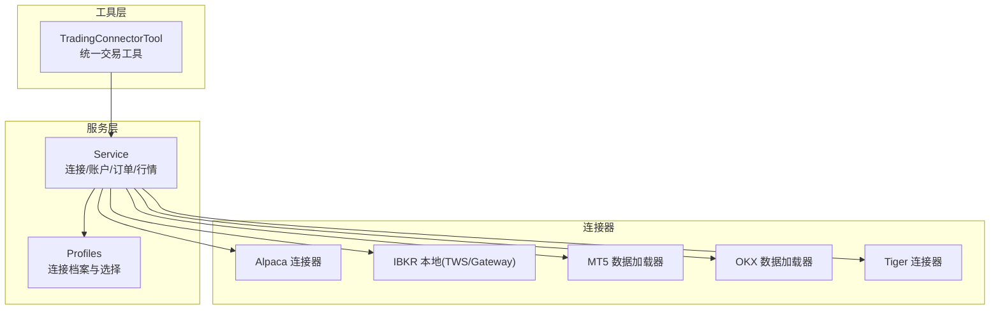
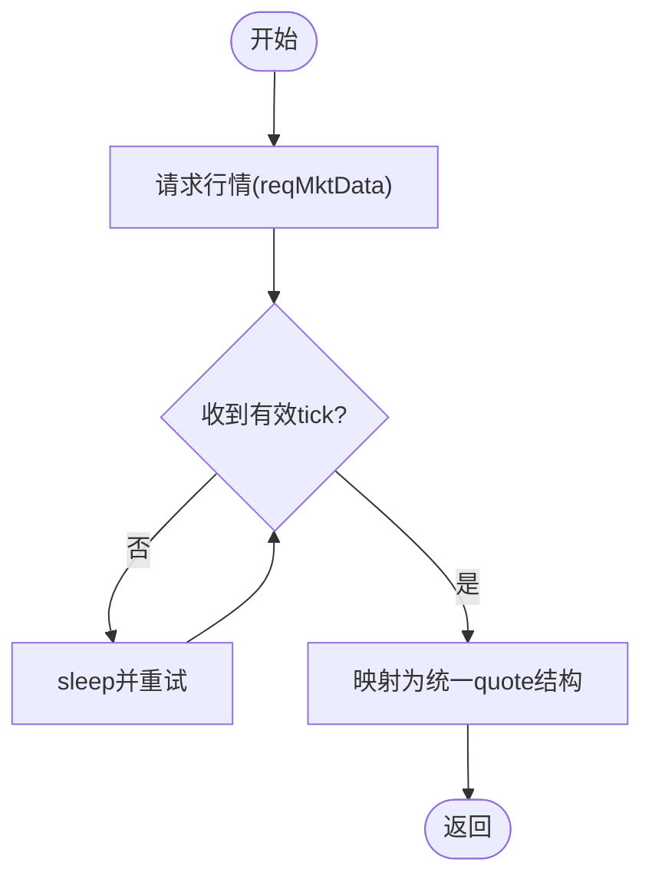
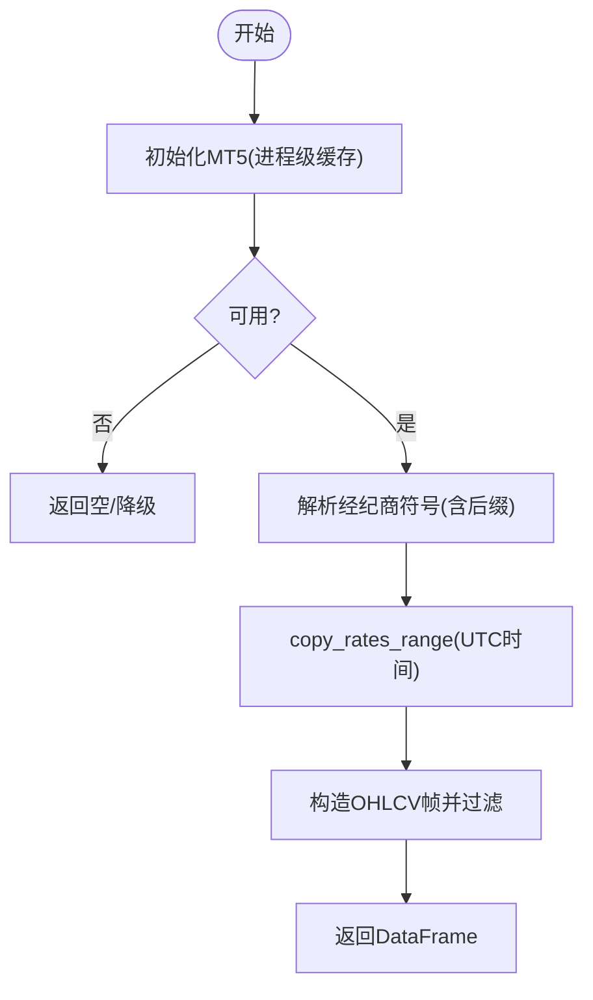
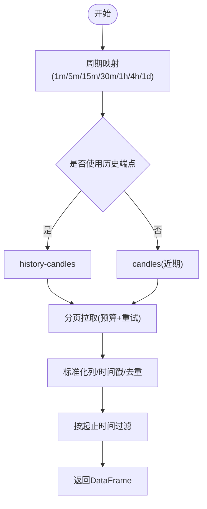
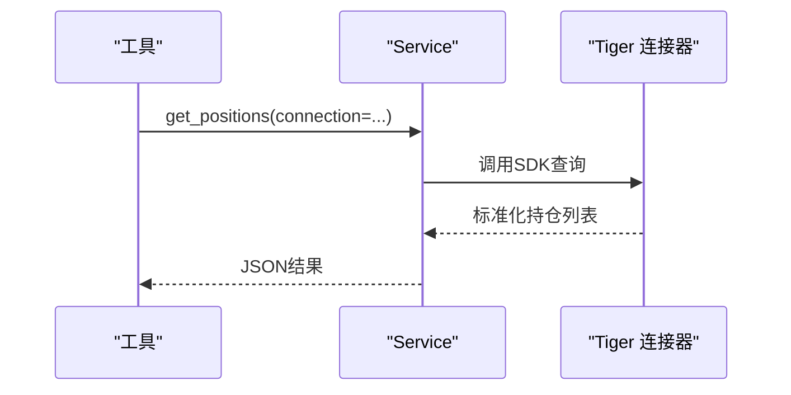
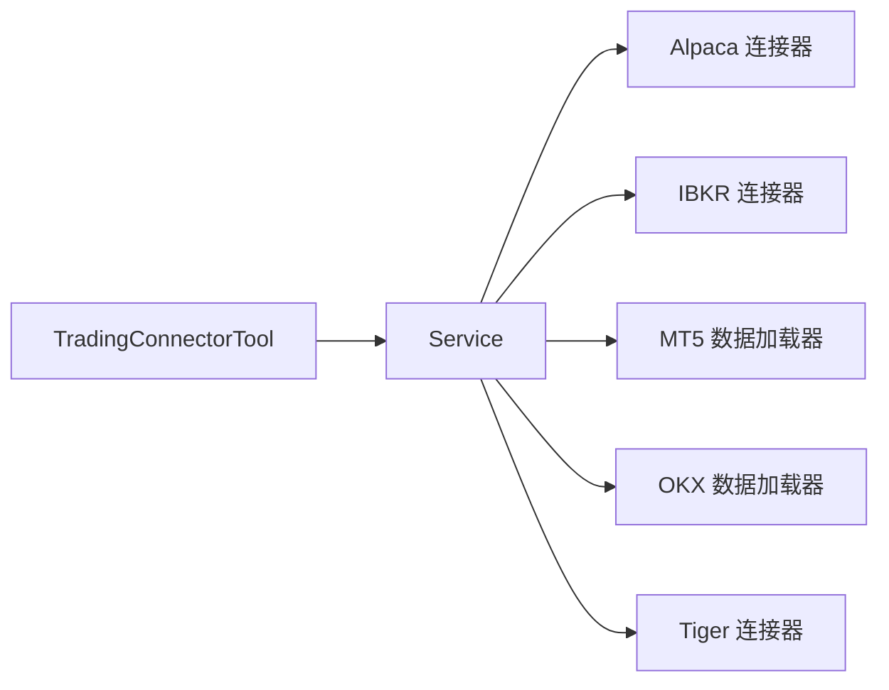

# 其他券商平台集成

<cite>
**本文引用的文件**
- [trading_connector_tool.py](file://agent/src/tools/trading_connector_tool.py)
- [service.py](file://agent/src/trading/service.py)
- [profiles.py](file://agent/src/trading/profiles.py)
- [alpaca/sdk.py](file://agent/src/trading/connectors/alpaca/sdk.py)
- [alpaca/classification.py](file://agent/src/trading/connectors/alpaca/classification.py)
- [alpaca/profiles.py](file://agent/src/trading/connectors/alpaca/profiles.py)
- [ibkr/local.py](file://agent/src/trading/connectors/ibkr/local.py)
- [ibkr/classification.py](file://agent/src/trading/connectors/ibkr/classification.py)
- [ibkr/profiles.py](file://agent/src/trading/connectors/ibkr/profiles.py)
- [mt5_loader.py](file://agent/backtest/loaders/mt5_loader.py)
- [okx.py](file://agent/backtest/loaders/okx.py)
- [tiger/sdk.py](file://agent/src/trading/connectors/tiger/sdk.py)
- [tiger/classification.py](file://agent/src/trading/connectors/tiger/classification.py)
- [tiger/profiles.py](file://agent/src/trading/connectors/tiger/profiles.py)
- [test_alpaca_tap_routing.py](file://agent/tests/test_alpaca_tap_routing.py)
- [test_ibkr_local.py](file://agent/tests/test_ibkr_local.py)
</cite>

## 目录
1. [简介](#简介)
2. [项目结构](#项目结构)
3. [核心组件](#核心组件)
4. [架构总览](#架构总览)
5. [详细组件分析](#详细组件分析)
6. [依赖关系分析](#依赖关系分析)
7. [性能与限制](#性能与限制)
8. [故障排查指南](#故障排查指南)
9. [结论](#结论)
10. [附录：平台选择与最佳实践](#附录：平台选择与最佳实践)

## 简介
本文件面向“其他券商平台”的集成，覆盖 Alpaca、Interactive Brokers（IBKR）、MetaTrader 5（MT5）、OKX、Tiger 等平台的接入方式、认证机制、API 限制与性能特点。文档同时给出统一接入层与标准化接口说明，帮助在不同平台间快速切换与扩展。内容基于仓库中的连接器实现、数据加载器与测试用例进行归纳总结。

## 项目结构
本项目采用“连接器 + 工具层 + 服务层”的分层设计：
- 连接器层：各券商 SDK/协议适配（Alpaca、IBKR、MT5、OKX、Tiger 等）
- 工具层：统一的交易工具入口（下单、查询、历史行情等），屏蔽底层差异
- 服务层：连接管理、配置与路由、合规门控（如 Mandate/Kill Switch）
- 回测数据加载器：按市场类型提供 OHLCV 数据源（MT5 外汇/贵金属、OKX 加密货币）



图表来源
- [trading_connector_tool.py:139-160](file://agent/src/tools/trading_connector_tool.py#L139-L160)
- [service.py](file://agent/src/trading/service.py)
- [profiles.py](file://agent/src/trading/profiles.py)

章节来源
- [trading_connector_tool.py:139-160](file://agent/src/tools/trading_connector_tool.py#L139-L160)

## 核心组件
- 统一交易工具：提供查看连接、账户、持仓、报价、历史、下单、撤单等能力，参数中支持 connection/host/port/client_id/account 等覆盖项，便于多环境切换。
- 连接档案：通过 profiles 管理不同券商的连接配置与默认选择。
- 服务层：封装 check_connection/get_account/get_positions/get_quote/get_history/place_order/cancel_order/search_instruments 等通用操作，向上暴露稳定接口。
- 合规前置：实盘下单需经过 Mandate/Kill Switch 等风控门控，确保失败关闭（fail-closed）。

章节来源
- [trading_connector_tool.py:208-504](file://agent/src/tools/trading_connector_tool.py#L208-L504)
- [profiles.py](file://agent/src/trading/profiles.py)
- [service.py](file://agent/src/trading/service.py)

## 架构总览
下图展示了从工具到服务再到具体连接器的调用路径，以及合规门控在实盘下单时的拦截点。

```mermaid
sequenceDiagram
participant U as "用户/策略"
participant Tool as "TradingConnectorTool"
participant Svc as "Service"
participant Gate as "合规门控(Mandate/KillSwitch)"
participant C as "连接器(Alpaca/IBKR/MT5/OKX/Tiger)"
U->>Tool : 调用 trading_place_order(...)
Tool->>Svc : place_order(symbol, side, ...)
alt 实盘
Svc->>Gate : 校验授权/风控
Gate-->>Svc : allow/deny/halt
opt 允许
Svc->>C : 下单
C-->>Svc : 结果
else 拒绝或中止
Svc-->>Tool : 错误/阻断
end
else 模拟盘
Svc->>C : 下单
C-->>Svc : 结果
end
Svc-->>Tool : 标准化响应
Tool-->>U : JSON 结果
```

图表来源
- [trading_connector_tool.py:431-504](file://agent/src/tools/trading_connector_tool.py#L431-L504)
- [service.py](file://agent/src/trading/service.py)

## 详细组件分析

### Alpaca 连接器
- 功能特性
  - 支持订单路由至 TAP（交易审批代理），开启后所有写操作需经人工审批；读操作自动放行。
  - 支持账户快照、持仓、挂单、报价、历史 K 线等标准接口。
  - 支持时间框架映射与字段归一化（例如将 API 缩写键转换为统一字段名）。
- 认证方式
  - 通过配置文件/环境变量注入密钥占位符，TAP 转发时以占位形式传递，避免明文泄露。
  - 可通过环境变量覆盖凭证名称，实现多环境隔离。
- API 限制与性能
  - 当 TAP 启用时，下单/取消等写操作会走 TAP 网关；若被拒绝则失败关闭。
  - 历史与报价读取可走 TAP 或直接 SDK，取决于开关状态。
- 差异化能力
  - 支持算法交易与高级订单类型的桥接由上层策略与连接器共同决定；当前工具层暴露 market/limit 等基础类型，更复杂类型可由连接器扩展。
- 关键流程（下单）
```mermaid
sequenceDiagram
participant T as "工具"
participant A as "Alpaca 连接器"
participant F as "TAP 转发"
T->>A : place_order(...)
alt TAP 启用
A->>F : forward(target, method, body, cred_headers)
F-->>A : decision(forwarded/denied/error)
opt forwarded
A-->>T : 标准化订单结果(via=tap)
else denied/error
A-->>T : 错误(失败关闭)
end
else TAP 禁用
A-->>T : 直接SDK路径结果
end
```

图表来源
- [test_alpaca_tap_routing.py:33-123](file://agent/tests/test_alpaca_tap_routing.py#L33-L123)
- [alpaca/sdk.py](file://agent/src/trading/connectors/alpaca/sdk.py)

章节来源
- [test_alpaca_tap_routing.py:33-123](file://agent/tests/test_alpaca_tap_routing.py#L33-L123)
- [alpaca/sdk.py](file://agent/src/trading/connectors/alpaca/sdk.py)
- [alpaca/classification.py](file://agent/src/trading/connectors/alpaca/classification.py)
- [alpaca/profiles.py](file://agent/src/trading/connectors/alpaca/profiles.py)

### Interactive Brokers（IBKR）本地连接器
- 功能特性
  - 通过本地 TWS/Gateway 连接，支持账户摘要、持仓、报价、历史 K 线等只读操作。
  - 支持连接池与引用计数，释放最后一个引用时断开连接。
  - 报价获取会轮询等待有效 tick，跳过 NaN 值直至数据就绪。
- 认证方式
  - 使用本地配置文件（host/port/client_id/account）与 TWS/Gateway 会话；纸账户与实账户有严格匹配检查。
- API 限制与性能
  - 依赖 ib_async 库与 TCP 端口可达性；可用性探测会检查 SDK 安装与端口连通。
  - 历史数据拉取受终端设置（最大K线数）影响。
- 差异化能力
  - 适合股票、期权、期货等多资产类别；本地模式对网络依赖低、延迟可控。
- 关键流程（报价）


图表来源
- [test_ibkr_local.py:237-315](file://agent/tests/test_ibkr_local.py#L237-L315)
- [ibkr/local.py](file://agent/src/trading/connectors/ibkr/local.py)

章节来源
- [test_ibkr_local.py:110-163](file://agent/tests/test_ibkr_local.py#L110-L163)
- [test_ibkr_local.py:237-315](file://agent/tests/test_ibkr_local.py#L237-L315)
- [ibkr/local.py](file://agent/src/trading/connectors/ibkr/local.py)
- [ibkr/classification.py](file://agent/src/trading/connectors/ibkr/classification.py)
- [ibkr/profiles.py](file://agent/src/trading/connectors/ibkr/profiles.py)

### MetaTrader 5（MT5）数据加载器
- 功能特性
  - 从本地 MT5 终端拉取外汇/贵金属 OHLCV，用于回测与实时数据获取。
  - 支持多种周期（1m/5m/15m/30m/1h/4h/1d/1w/1M），大小写兼容。
  - 自动解析经纪商符号后缀（如 Exness 的 EURUSDm），并进行去重与缓存。
- 认证方式
  - 依赖已登录的 MT5 终端；可选 mt5.json 指定登录信息、服务器、超时与终端路径。
- API 限制与性能
  - 历史深度受终端“图表最大K线数”限制；初始化可能耗时（进程级缓存）。
  - 失败不抛异常，逐符号降级，交由回测链路的回退机制处理。
- 差异化能力
  - 原生对接经纪商符号与交易时段，适合外汇/差价合约场景。
- 关键流程（拉取）


图表来源
- [mt5_loader.py:79-108](file://agent/backtest/loaders/mt5_loader.py#L79-L108)
- [mt5_loader.py:121-147](file://agent/backtest/loaders/mt5_loader.py#L121-L147)
- [mt5_loader.py:186-251](file://agent/backtest/loaders/mt5_loader.py#L186-L251)

章节来源
- [mt5_loader.py:1-251](file://agent/backtest/loaders/mt5_loader.py#L1-L251)

### OKX 数据加载器（加密货币）
- 功能特性
  - 通过 V5 公开 REST 接口获取 K 线，支持近期与历史端点自动切换。
  - 支持代理配置（ALL_PROXY/HTTP_PROXY/HTTPS_PROXY），增强网络稳定性。
  - 分页拉取，带预算控制与重试，处理 429/5xx 与业务码非 0 的情况。
- 认证方式
  - 公开行情无需鉴权。
- API 限制与性能
  - 近期端点仅覆盖有限深度；历史端点用于长周期回测。
  - 分钟级周期页上限更高，整体拉取受预算与速率限制约束。
- 差异化能力
  - 适用于现货/合约等加密资产的多周期回测与数据对齐。
- 关键流程（拉取）


图表来源
- [okx.py:34-69](file://agent/backtest/loaders/okx.py#L34-L69)
- [okx.py:109-125](file://agent/backtest/loaders/okx.py#L109-L125)
- [okx.py:131-208](file://agent/backtest/loaders/okx.py#L131-L208)
- [okx.py:220-373](file://agent/backtest/loaders/okx.py#L220-L373)

章节来源
- [okx.py:1-373](file://agent/backtest/loaders/okx.py#L1-L373)

### Tiger 连接器
- 功能特性
  - 提供账户、持仓、订单、行情等标准能力，遵循统一工具与服务层契约。
  - 支持分类与配置档案，便于多环境管理。
- 认证方式
  - 通过 profiles 管理凭据与环境变量，与统一连接选择机制一致。
- API 限制与性能
  - 受限于 Tiger 官方 SDK/接口速率与配额；建议在批量拉取时结合缓存与分页。
- 差异化能力
  - 适合亚洲市场股票、ETF、指数等品种的交易与研究。
- 关键流程（示例：查询）


图表来源
- [tiger/sdk.py](file://agent/src/trading/connectors/tiger/sdk.py)
- [tiger/classification.py](file://agent/src/trading/connectors/tiger/classification.py)
- [tiger/profiles.py](file://agent/src/trading/connectors/tiger/profiles.py)

章节来源
- [tiger/sdk.py](file://agent/src/trading/connectors/tiger/sdk.py)
- [tiger/classification.py](file://agent/src/trading/connectors/tiger/classification.py)
- [tiger/profiles.py](file://agent/src/trading/connectors/tiger/profiles.py)

## 依赖关系分析
- 工具层依赖服务层提供的统一函数（check_connection/get_account/get_positions/get_quote/get_history/place_order/cancel_order/search_instruments）。
- 服务层根据 connection profile 路由到对应连接器（Alpaca/IBKR/MT5/OKX/Tiger）。
- 回测数据加载器独立于交易连接器，但共享周期映射与数据格式约定。



图表来源
- [trading_connector_tool.py:139-160](file://agent/src/tools/trading_connector_tool.py#L139-L160)
- [service.py](file://agent/src/trading/service.py)

章节来源
- [trading_connector_tool.py:139-160](file://agent/src/tools/trading_connector_tool.py#L139-L160)

## 性能与限制
- Alpaca
  - TAP 启用时写操作需人工审批，增加延迟但提升安全性；读操作通常较快。
  - 历史与报价读取可直连 SDK 或通过 TAP，注意网络与配额。
- IBKR
  - 本地模式依赖 TWS/Gateway 与 ib_async；端口可达性与 SDK 安装是关键。
  - 报价轮询与连接池管理优化了资源占用与稳定性。
- MT5
  - 历史深度受终端设置限制；初始化可能较慢，建议进程级缓存。
  - 外汇/贵金属符号解析与后缀发现提升兼容性。
- OKX
  - 公开接口无鉴权；历史端点更适合长周期回测。
  - 代理与重试机制提高弱网环境下的鲁棒性。
- Tiger
  - 受官方 SDK 速率限制；建议批量拉取时使用分页与缓存。

[本节为通用指导，不直接分析具体文件]

## 故障排查指南
- 连接不可用
  - 检查连接档案与覆盖参数（host/port/client_id/account）。
  - 对于 IBKR，确认 ib_async 安装与 TCP 端口可达。
- 数据为空或失败
  - MT5：确认终端已登录且符号存在；检查“图表最大K线数”。
  - OKX：检查代理设置与网络；关注 429/5xx 与业务码非 0 的重试日志。
- 下单被拒绝或阻断
  - 实盘下单需通过 Mandate/Kill Switch；若被 deny/halt，检查授权与风控规则。
  - Alpaca TAP 模式下，write 操作需审批；被拒绝将失败关闭。
- 报价延迟或 NaN
  - IBKR 报价会轮询直到有效 tick；若出现 NaN 会继续重试。

章节来源
- [test_ibkr_local.py:155-163](file://agent/tests/test_ibkr_local.py#L155-L163)
- [test_ibkr_local.py:237-315](file://agent/tests/test_ibkr_local.py#L237-L315)
- [test_alpaca_tap_routing.py:82-98](file://agent/tests/test_alpaca_tap_routing.py#L82-L98)
- [okx.py:291-322](file://agent/backtest/loaders/okx.py#L291-L322)

## 结论
本项目通过统一工具与服务层，将 Alpaca、IBKR、MT5、OKX、Tiger 等不同券商/数据源的能力抽象为标准接口，既保证了跨平台一致性，又保留了各平台的特色能力（如 Alpaca 的 TAP 审批、IBKR 的多资产本地连接、MT5 的外汇原生数据、OKX 的加密资产历史数据、Tiger 的亚洲市场支持）。在实盘场景中，合规门控与失败关闭策略确保了交易安全。

[本节为总结，不直接分析具体文件]

## 附录：平台选择与最佳实践
- 平台对比要点
  - 资产类别：IBKR 多资产（股/期/汇/商品），MT5 外汇/差价合约，OKX 加密资产，Tiger 亚洲股票/ETF，Alpaca 美股为主。
  - 算法与高级订单：由连接器与上层策略共同决定；当前工具层暴露 market/limit，复杂类型可扩展。
  - 成本与配额：关注各平台 API 速率、历史数据深度与费用模型。
- 适用场景
  - 回测研究：优先使用 MT5（外汇）与 OKX（加密）的历史数据加载器。
  - 实盘交易：IBKR 本地模式适合多资产与低延迟；Alpaca TAP 适合强管控；Tiger 适合亚洲市场。
- 最佳实践
  - 使用连接档案与覆盖参数管理多环境。
  - 实盘下单前执行 check_connection 与合规检查。
  - 批量拉取数据时结合缓存、分页与预算控制。
  - 对网络不稳定环境启用代理与重试（OKX）。
  - 监控与日志：记录失败与降级路径，便于定位问题。

[本节为通用指导，不直接分析具体文件]