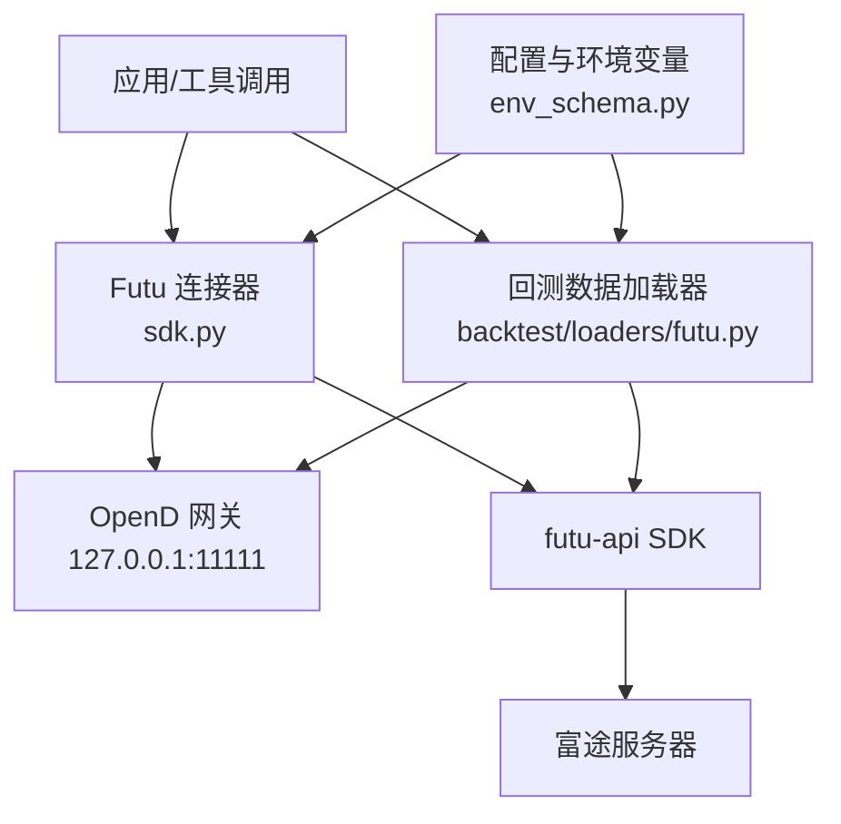
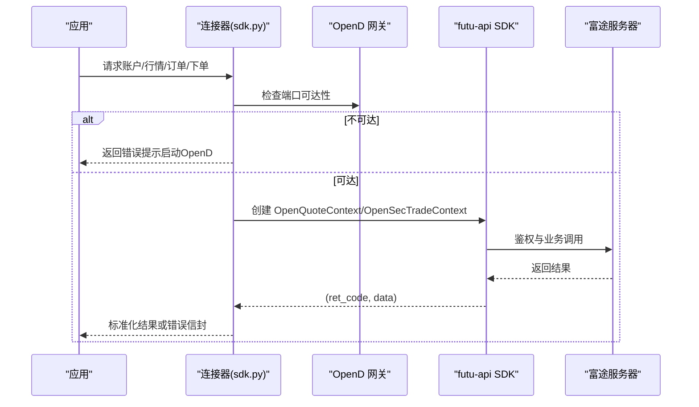
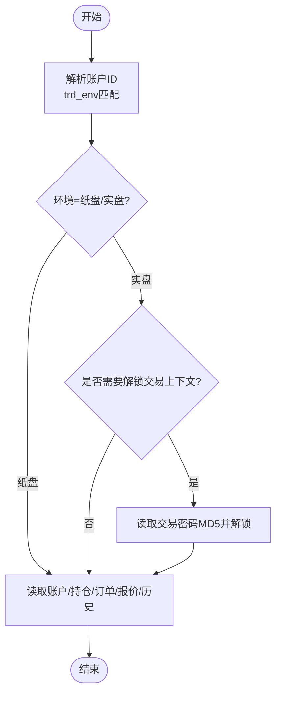
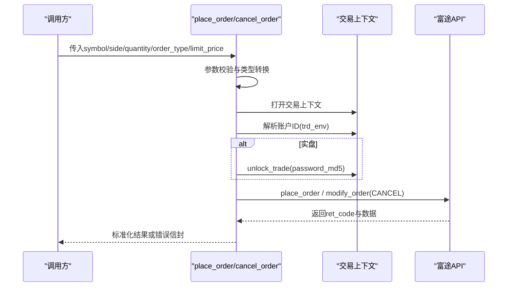
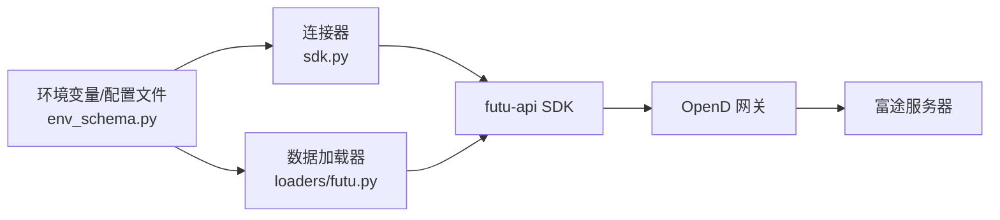

# 富途证券集成

<cite>
**本文引用的文件**
- [agent/src/trading/connectors/futu/sdk.py](file://agent/src/trading/connectors/futu/sdk.py)
- [agent/src/trading/connectors/futu/profiles.py](file://agent/src/trading/connectors/futu/profiles.py)
- [agent/src/trading/connectors/futu/__init__.py](file://agent/src/trading/connectors/futu/__init__.py)
- [agent/backtest/loaders/futu.py](file://agent/backtest/loaders/futu.py)
- [agent/tests/test_futu_loader.py](file://agent/tests/test_futu_loader.py)
- [agent/src/config/env_schema.py](file://agent/src/config/env_schema.py)
</cite>

## 目录
1. [简介](#简介)
2. [项目结构](#项目结构)
3. [核心组件](#核心组件)
4. [架构总览](#架构总览)
5. [详细组件分析](#详细组件分析)
6. [依赖关系分析](#依赖关系分析)
7. [性能与可靠性](#性能与可靠性)
8. [故障排查指南](#故障排查指南)
9. [结论](#结论)
10. [附录](#附录)

## 简介
本文件面向需要在本地部署并集成富途 OpenD 的开发者，系统性说明富途连接方式、安全认证机制、多市场（港股、美股、A股）交易能力、订单管理、成交回报与持仓管理流程，以及实时行情订阅、历史数据获取和账户信息查询的实现方案。文档同时覆盖本地客户端部署、网络连接管理与异常处理策略，帮助读者在模拟盘与实盘环境之间安全切换。

## 项目结构
围绕富途集成的关键代码分布在以下模块：
- 连接器层：通过官方 futu-api SDK 封装对本地 OpenD 的连接与读写操作，提供账户、持仓、订单、报价、历史K线等只读能力，并在受控条件下支持下单/撤单。
- 回测数据加载器：基于 futu-api 拉取港股与A股的OHLCV数据，支持分页、缓存与标准化输出。
- 配置与环境变量：集中定义富途主机、端口、交易密码MD5等环境变量，并提供持久化配置文件路径。
- 预置交易画像：内置纸盘/实盘只读/可下单等多类 profile，自动区分 SIMULATE/REAL 环境并做身份守卫。

图表来源
- [agent/src/trading/connectors/futu/sdk.py:1-25](file://agent/src/trading/connectors/futu/sdk.py#L1-L25)
- [agent/backtest/loaders/futu.py:106-139](file://agent/backtest/loaders/futu.py#L106-L139)
- [agent/src/config/env_schema.py:164-165](file://agent/src/config/env_schema.py#L164-L165)

章节来源
- [agent/src/trading/connectors/futu/sdk.py:1-25](file://agent/src/trading/connectors/futu/sdk.py#L1-L25)
- [agent/backtest/loaders/futu.py:106-139](file://agent/backtest/loaders/futu.py#L106-L139)
- [agent/src/config/env_schema.py:164-165](file://agent/src/config/env_schema.py#L164-L165)

## 核心组件
- FutuConfig：连接参数对象，包含本地网关地址、端口、交易商、市场过滤、账户ID、超时等；支持从映射构建、覆盖与持久化。
- 连接器函数族：账户快照、持仓查询、未平仓订单、最新报价、历史K线；下单与撤单（受控）。
- 环境守卫：通过 trd_env 字段严格区分纸盘(SIMULATE)与实盘(REAL)，防止误用。
- 数据加载器：FutuLoader 负责港股/A股历史数据拉取、分页、标准化与缓存。
- 预置 Profile：提供纸盘只读、实盘只读、纸盘可下单、实盘可下单（需授权）四类画像。

章节来源
- [agent/src/trading/connectors/futu/sdk.py:71-158](file://agent/src/trading/connectors/futu/sdk.py#L71-L158)
- [agent/src/trading/connectors/futu/profiles.py:14-80](file://agent/src/trading/connectors/futu/profiles.py#L14-L80)
- [agent/backtest/loaders/futu.py:106-139](file://agent/backtest/loaders/futu.py#L106-L139)

## 架构总览
富途集成采用“本地 OpenD 网关 + SDK”的安全模式：
- 本地 OpenD 运行在用户机器上，持有富途登录态；应用仅通过本地 TCP 与 OpenD 通信，不接触富途凭证。
- 每次连接前进行端口探测，若网关不可达则快速失败，避免SDK堆栈暴露。
- 账户选择依据 trd_env 匹配 profile 的环境，确保纸盘/实盘隔离。
- 实盘下单需要解锁交易上下文，使用交易密码的 MD5 作为口令，且必须来自受信任的环境变量。

图表来源
- [agent/src/trading/connectors/futu/sdk.py:664-703](file://agent/src/trading/connectors/futu/sdk.py#L664-L703)
- [agent/src/trading/connectors/futu/sdk.py:223-272](file://agent/src/trading/connectors/futu/sdk.py#L223-L272)

## 详细组件分析

### 连接器与账户/持仓/订单/行情/历史
- 账户快照：通过交易上下文查询资金资产，返回账户ID、环境、资产明细。
- 持仓查询：按环境解析账户后拉取当前持仓列表。
- 未平仓订单：可选附带近期成交记录。
- 最新报价：按标的代码获取市场快照。
- 历史K线：支持分钟/小时/日/周/月周期，内部映射到 SDK 的 KLType。

图表来源
- [agent/src/trading/connectors/futu/sdk.py:275-393](file://agent/src/trading/connectors/futu/sdk.py#L275-L393)
- [agent/src/trading/connectors/futu/sdk.py:617-643](file://agent/src/trading/connectors/futu/sdk.py#L617-L643)

章节来源
- [agent/src/trading/connectors/futu/sdk.py:275-393](file://agent/src/trading/connectors/futu/sdk.py#L275-L393)
- [agent/src/trading/connectors/futu/sdk.py:617-643](file://agent/src/trading/connectors/futu/sdk.py#L617-L643)

### 订单管理与成交回报
- 下单：支持市价/限价单，要求明确数量；不支持名义金额下单。下单前校验参数合法性，连接网关并解析账户，实盘需解锁交易上下文。
- 撤单：按订单号取消，同样遵循账户解析与环境解锁逻辑。
- 成交回报：可通过“未平仓订单”接口附带近期成交记录，用于对账与追踪。

图表来源
- [agent/src/trading/connectors/futu/sdk.py:407-539](file://agent/src/trading/connectors/futu/sdk.py#L407-L539)
- [agent/src/trading/connectors/futu/sdk.py:542-614](file://agent/src/trading/connectors/futu/sdk.py#L542-L614)

章节来源
- [agent/src/trading/connectors/futu/sdk.py:407-539](file://agent/src/trading/connectors/futu/sdk.py#L407-L539)
- [agent/src/trading/connectors/futu/sdk.py:542-614](file://agent/src/trading/connectors/futu/sdk.py#L542-L614)

### 多市场交易能力（港股、美股、A股）
- 连接器默认交易商为 FUTUSECURITIES，市场过滤默认 HK；可通过配置调整 filter_trdmarket 以适配不同市场。
- 数据加载器支持港股与A股 OHLCV 拉取，符号格式自动转换（如 700.HK → HK.00700，000001.SZ → SZ.000001）。
- 美股标的可通过富途 OpenD 提供的代码体系接入（例如 US.AAPL），由连接器统一处理大小写与周期映射。

章节来源
- [agent/src/trading/connectors/futu/sdk.py:71-93](file://agent/src/trading/connectors/futu/sdk.py#L71-L93)
- [agent/backtest/loaders/futu.py:39-55](file://agent/backtest/loaders/futu.py#L39-L55)

### 期权交易与融资融券
- 连接器当前未直接暴露期权合约与融资融券专用接口；如需扩展，可在现有交易上下文基础上增加对应 API 调用，并沿用 trd_env 与解锁逻辑。
- 建议在新增功能时保持 fail-closed 的错误模型与账户环境守卫。

[本节为概念性说明，不直接分析具体文件]

### 实时行情订阅、历史数据与账户查询
- 实时行情：通过 OpenQuoteContext 获取市场快照；可扩展为订阅式接口（需结合富途 SDK 的订阅能力）。
- 历史数据：FutuLoader 支持分页拉取、标准化与缓存，适用于回测与离线分析。
- 账户查询：通过 OpenSecTradeContext 获取资金与资产信息，并返回结构化结果。

章节来源
- [agent/src/trading/connectors/futu/sdk.py:336-393](file://agent/src/trading/connectors/futu/sdk.py#L336-L393)
- [agent/backtest/loaders/futu.py:140-253](file://agent/backtest/loaders/futu.py#L140-L253)

### 本地客户端部署、网络连接管理与异常处理
- 本地部署：安装 futu-api 并启动富途 OpenD，确保本地端口（默认 127.0.0.1:11111）开放。
- 连接管理：每次连接前执行 TCP 端口探测；不可达时返回清晰错误，避免 SDK 堆栈泄露。
- 异常处理：所有错误路径均返回标准化错误信封（status: error），便于上层统一处理；账户环境不匹配抛出专门异常。

章节来源
- [agent/src/trading/connectors/futu/sdk.py:664-679](file://agent/src/trading/connectors/futu/sdk.py#L664-L679)
- [agent/src/trading/connectors/futu/sdk.py:712-753](file://agent/src/trading/connectors/futu/sdk.py#L712-L753)

## 依赖关系分析
- 连接器依赖 futu-api SDK，并通过 OpenD 网关访问富途服务。
- 数据加载器依赖 futu-api 的行情接口，具备本地缓存以减少网络开销。
- 配置与环境变量集中管理富途主机、端口与交易密码MD5。

图表来源
- [agent/src/config/env_schema.py:164-165](file://agent/src/config/env_schema.py#L164-L165)
- [agent/src/config/env_schema.py:294-294](file://agent/src/config/env_schema.py#L294-L294)
- [agent/src/trading/connectors/futu/sdk.py:656-703](file://agent/src/trading/connectors/futu/sdk.py#L656-L703)
- [agent/backtest/loaders/futu.py:118-139](file://agent/backtest/loaders/futu.py#L118-L139)

章节来源
- [agent/src/config/env_schema.py:164-165](file://agent/src/config/env_schema.py#L164-L165)
- [agent/src/config/env_schema.py:294-294](file://agent/src/config/env_schema.py#L294-L294)
- [agent/src/trading/connectors/futu/sdk.py:656-703](file://agent/src/trading/connectors/futu/sdk.py#L656-L703)
- [agent/backtest/loaders/futu.py:118-139](file://agent/backtest/loaders/futu.py#L118-L139)

## 性能与可靠性
- 连接前探测：避免无效连接导致的长耗时与堆栈噪音。
- 分页与缓存：历史数据拉取支持分页键与本地缓存，减少重复请求与网关压力。
- 标准化输出：将 SDK 返回的数据转换为统一结构，提升下游处理效率与一致性。
- 失败关闭：所有错误路径返回结构化错误，便于监控与重试策略。

章节来源
- [agent/backtest/loaders/futu.py:176-253](file://agent/backtest/loaders/futu.py#L176-L253)
- [agent/src/trading/connectors/futu/sdk.py:664-679](file://agent/src/trading/connectors/futu/sdk.py#L664-L679)

## 故障排查指南
- 无法连接 OpenD：检查本地端口是否开放、OpenD 是否已启动并登录；健康检查会返回网关状态与错误信息。
- 缺少 futu-api：安装可选依赖后重试；健康检查会报告依赖缺失。
- 账户环境不匹配：确认所选 profile 的 trd_env 与实际账户一致；若配置了 acc_id，需确保其环境与 profile 匹配。
- 实盘下单失败：检查交易密码 MD5 环境变量是否正确设置；解锁失败会返回明确错误。

章节来源
- [agent/src/trading/connectors/futu/sdk.py:223-272](file://agent/src/trading/connectors/futu/sdk.py#L223-L272)
- [agent/src/trading/connectors/futu/sdk.py:617-643](file://agent/src/trading/connectors/futu/sdk.py#L617-L643)
- [agent/src/trading/connectors/futu/sdk.py:712-753](file://agent/src/trading/connectors/futu/sdk.py#L712-L753)

## 结论
本集成通过本地 OpenD 网关与官方 SDK 实现了安全、可控的富途接入，覆盖港股、美股、A股的多市场数据与交易能力。连接器提供账户、持仓、订单、行情与历史数据的标准化接口，并在纸盘/实盘间进行严格隔离。数据加载器支持高效的历史数据拉取与缓存。整体设计强调失败关闭、错误透明与可观测性，适合在生产环境中稳健运行。

[本节为总结性内容，不直接分析具体文件]

## 附录

### 环境变量与配置
- 数据源配置：
  - FUTU_HOST：富途 OpenD 主机地址（默认 127.0.0.1）
  - FUTU_PORT：富途 OpenD 端口（默认 11111）
- 交易配置：
  - FUTU_TRADE_PWD_MD5：富途交易密码的 MD5 值（实盘下单必需）

章节来源
- [agent/src/config/env_schema.py:164-165](file://agent/src/config/env_schema.py#L164-L165)
- [agent/src/config/env_schema.py:294-294](file://agent/src/config/env_schema.py#L294-L294)

### 测试要点
- 符号映射：港股/A股代码正确转换为富途格式。
- 周期映射：支持的周期映射到 SDK 的 KLType，不支持的周期快速失败。
- 可用性检测：主机/端口缺失或连接失败时返回不可用。
- 分页与去重：分页键传递、重复时间戳保留最后一页值。

章节来源
- [agent/tests/test_futu_loader.py:81-124](file://agent/tests/test_futu_loader.py#L81-L124)
- [agent/tests/test_futu_loader.py:167-206](file://agent/tests/test_futu_loader.py#L167-L206)
- [agent/tests/test_futu_loader.py:226-333](file://agent/tests/test_futu_loader.py#L226-L333)