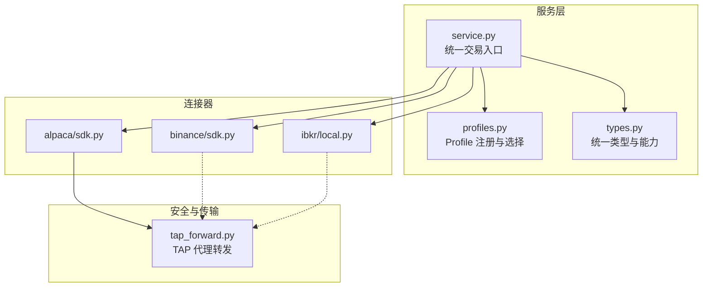
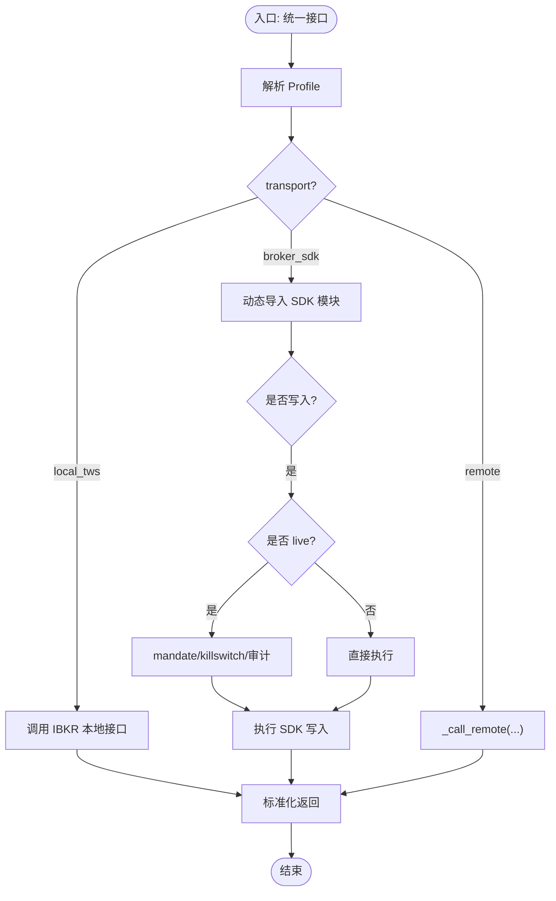
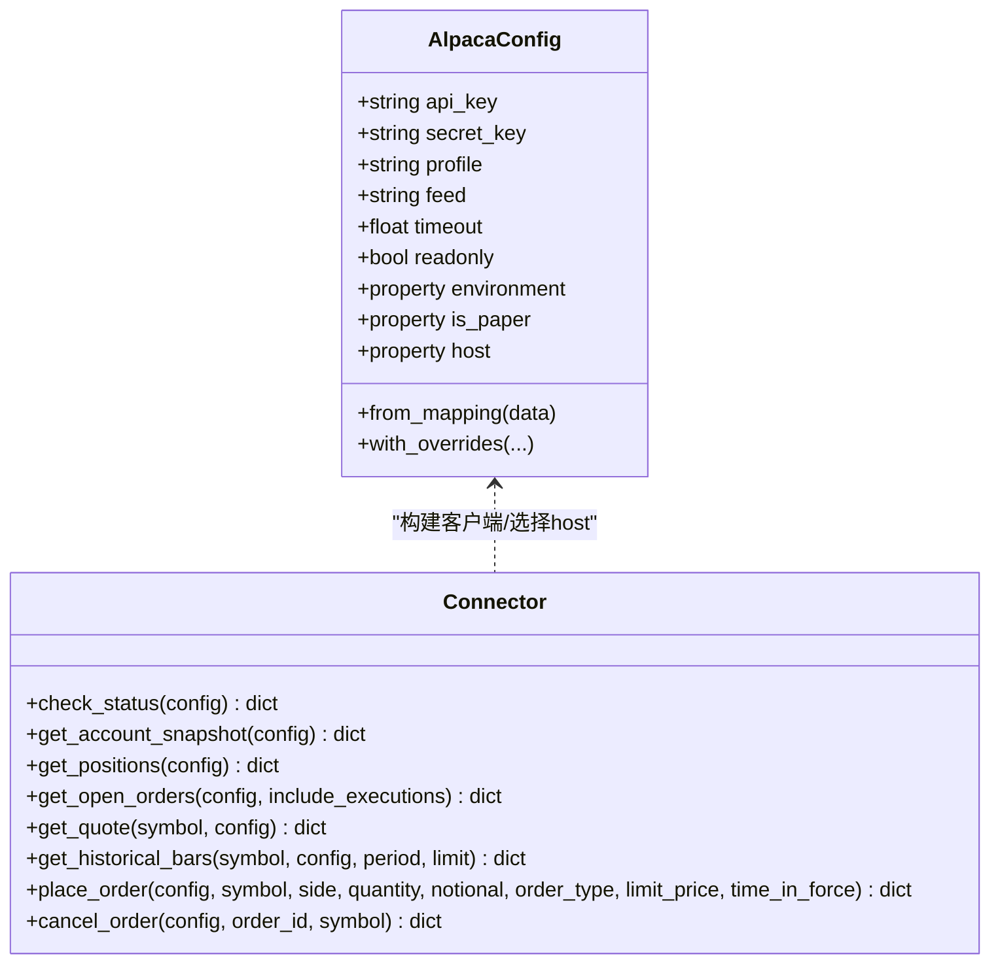
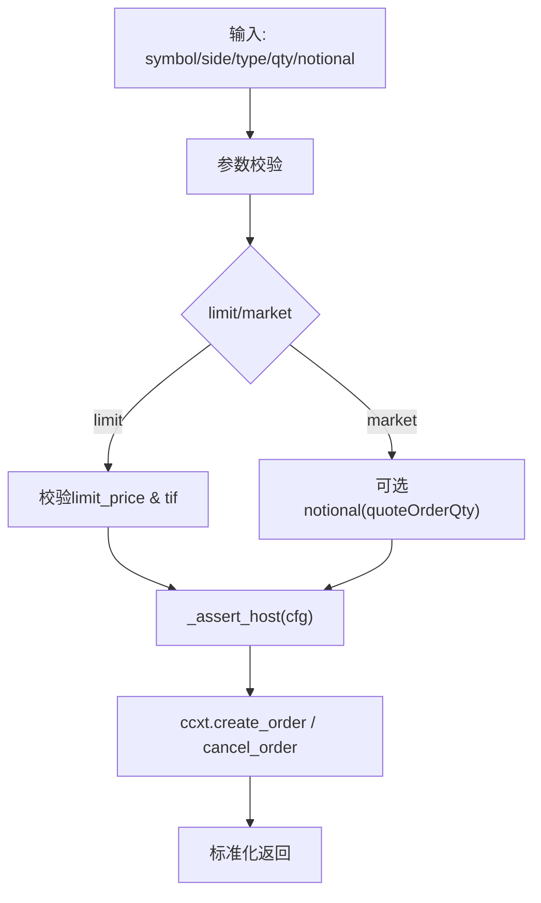
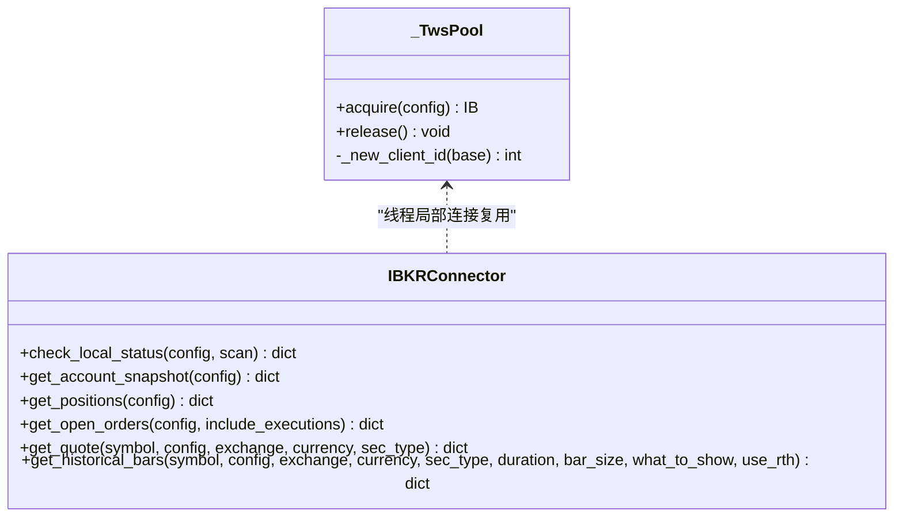
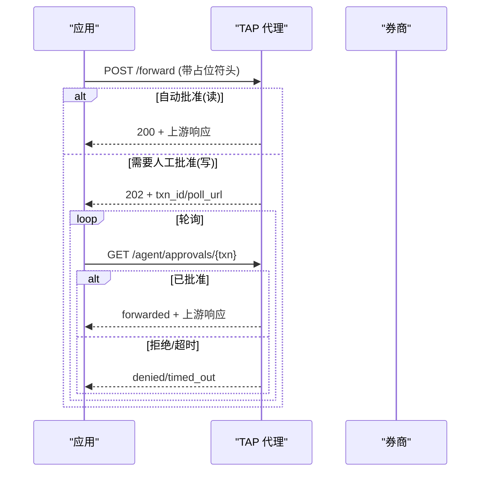
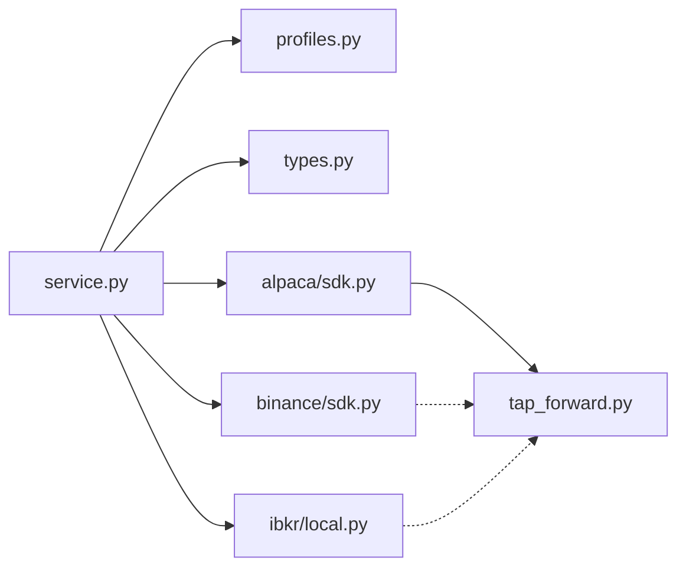

# 连接器架构设计

<cite>
**本文引用的文件**
- [service.py](file://agent/src/trading/service.py)
- [profiles.py](file://agent/src/trading/profiles.py)
- [types.py](file://agent/src/trading/types.py)
- [alpaca/sdk.py](file://agent/src/trading/connectors/alpaca/sdk.py)
- [binance/sdk.py](file://agent/src/trading/connectors/binance/sdk.py)
- [ibkr/local.py](file://agent/src/trading/connectors/ibkr/local.py)
- [tap_forward.py](file://agent/src/trading/tap_forward.py)
</cite>

## 目录
1. [简介](#简介)
2. [项目结构](#项目结构)
3. [核心组件](#核心组件)
4. [架构总览](#架构总览)
5. [详细组件分析](#详细组件分析)
6. [依赖关系分析](#依赖关系分析)
7. [性能考量](#性能考量)
8. [故障排查指南](#故障排查指南)
9. [结论](#结论)
10. [附录](#附录)

## 简介
本文件系统化阐述 Vibe-Trading 交易连接器架构，重点覆盖：
- 统一连接器抽象层的设计原理与接口规范（账户、持仓、订单、行情、历史数据）
- 订单生命周期管理与错误处理机制（含风控前置校验、审计记录）
- 连接器的注册机制、配置管理与动态加载实现
- 多券商适配模式（协议转换、数据标准化、认证方式统一）
- 连接器开发指南（SDK 集成、API 封装、安全最佳实践）
- 连接池管理、连接状态监控与故障转移策略

## 项目结构
Vibe-Trading 的交易子系统以“服务层 + 连接器模块”的方式组织：
- 服务层（service.py）提供统一的交易操作入口，按 profile 的 transport 路由到不同连接器路径
- 连接器模块（connectors/*）针对具体券商或本地网关实现统一接口
- 配置文件与 Profile 注册（profiles.py）集中管理可用连接器及其能力
- 类型定义（types.py）定义统一的数据模型与能力枚举
- TAP 代理（tap_forward.py）提供可选的凭据隔离与人工审批通道



**图表来源**
- [service.py:1-120](file://agent/src/trading/service.py#L1-L120)
- [profiles.py:1-100](file://agent/src/trading/profiles.py#L1-L100)
- [types.py:1-52](file://agent/src/trading/types.py#L1-L52)
- [alpaca/sdk.py:1-120](file://agent/src/trading/connectors/alpaca/sdk.py#L1-L120)
- [binance/sdk.py:1-120](file://agent/src/trading/connectors/binance/sdk.py#L1-L120)
- [ibkr/local.py:1-120](file://agent/src/trading/connectors/ibkr/local.py#L1-L120)
- [tap_forward.py:1-120](file://agent/src/trading/tap_forward.py#L1-L120)

**章节来源**
- [service.py:1-120](file://agent/src/trading/service.py#L1-L120)
- [profiles.py:1-100](file://agent/src/trading/profiles.py#L1-L100)
- [types.py:1-52](file://agent/src/trading/types.py#L1-L52)

## 核心组件
- 统一接口规范
  - 读取类接口：账户快照、持仓、挂单、报价、历史K线
  - 写入类接口：下单、撤单、平仓、复制交易等（受风控与审计约束）
- 配置与 Profile
  - 每个连接器维护独立配置文件（如 alpaca.json、binance.json、ibkr-local.json）
  - profiles.py 汇总所有内置 Profile，支持选择与持久化
- 动态加载
  - service.py 通过映射表将 connector key 动态导入对应 SDK 模块
- 安全与合规
  - 纸盘/实盘环境由 host 分离或端口/客户端ID区分
  - 实盘写入需经过 mandate gate、kill switch、审计记录
  - 可选 TAP 代理进行凭据隔离与人工审批

**章节来源**
- [service.py:13-66](file://agent/src/trading/service.py#L13-L66)
- [profiles.py:24-41](file://agent/src/trading/profiles.py#L24-L41)
- [alpaca/sdk.py:143-179](file://agent/src/trading/connectors/alpaca/sdk.py#L143-L179)
- [binance/sdk.py:157-205](file://agent/src/trading/connectors/binance/sdk.py#L157-L205)
- [ibkr/local.py:121-153](file://agent/src/trading/connectors/ibkr/local.py#L121-L153)
- [tap_forward.py:1-22](file://agent/src/trading/tap_forward.py#L1-L22)

## 架构总览
下图展示从调用方到券商的完整链路，包括 Profile 解析、连接器动态加载、读写分流、TAP 代理与安全门控。

```mermaid
sequenceDiagram
participant Caller as "调用方"
participant Service as "service.py"
participant Profiles as "profiles.py"
participant Module as "connector sdk.py"
participant TAP as "tap_forward.py"
participant Broker as "券商/本地网关"
Caller->>Service : 调用统一接口(例 : place_order/get_account)
Service->>Profiles : profile_by_id()
Profiles-->>Service : TradingProfile
alt transport == broker_sdk
Service->>Module : build_config(profile.config, overrides)
opt 写入且为 live
Service->>Service : 风控前置(mandate/killswitch/审计)
end
opt TAP 启用
Service->>Module : 调用SDK方法
Module->>TAP : forward(target, method, headers)
TAP-->>Module : 决策/上游响应
Module-->>Service : 标准化结果
else 直连
Module->>Broker : 直接SDK/REST调用
Broker-->>Module : 原始响应
Module-->>Service : 标准化结果
end
else transport == local_tws
Service->>Module : 本地IBKR接口
Module->>Broker : TWS/IB Gateway
Broker-->>Module : 原始响应
Module-->>Service : 标准化结果
else remote
Service->>Service : _call_remote(...)
end
Service-->>Caller : 统一返回体(status, data/error)
```

**图表来源**
- [service.py:42-117](file://agent/src/trading/service.py#L42-L117)
- [service.py:279-342](file://agent/src/trading/service.py#L279-L342)
- [alpaca/sdk.py:261-296](file://agent/src/trading/connectors/alpaca/sdk.py#L261-L296)
- [binance/sdk.py:217-264](file://agent/src/trading/connectors/binance/sdk.py#L217-L264)
- [ibkr/local.py:165-218](file://agent/src/trading/connectors/ibkr/local.py#L165-L218)
- [tap_forward.py:99-188](file://agent/src/trading/tap_forward.py#L99-L188)

## 详细组件分析

### 统一接口与服务路由（service.py）
- 路由策略
  - local_tws：走 IBKR 本地只读路径
  - broker_sdk：动态导入对应 connector SDK 模块并调用统一接口
  - remote：通过远程工具调用
- 写操作保护
  - 仅 broker_sdk 且非 readonly 允许下单/撤单等
  - live 环境强制进入 mandate gate、kill switch、审计记录
- 标准化返回
  - 所有接口返回包含 status、profile、environment、transport 的统一信封



**图表来源**
- [service.py:42-117](file://agent/src/trading/service.py#L42-L117)
- [service.py:279-342](file://agent/src/trading/service.py#L279-L342)

**章节来源**
- [service.py:13-66](file://agent/src/trading/service.py#L13-L66)
- [service.py:279-342](file://agent/src/trading/service.py#L279-L342)

### Alpaca 连接器（alpaca/sdk.py）
- 配置与鉴权
  - 支持 paper/live 环境分离，host 固定为各自域名
  - 可选 TAP 代理：请求头使用占位符，服务端注入真实密钥
- 读取接口
  - 账户、持仓、挂单、报价、历史K线均返回标准化结构
- 写入接口
  - 下单/撤单在 TAP 模式下经人工审批；直连模式使用官方 SDK
- 健康检查
  - check_status 报告 SDK 可用性、TAP 状态、host 分离、账户信息



**图表来源**
- [alpaca/sdk.py:65-138](file://agent/src/trading/connectors/alpaca/sdk.py#L65-L138)
- [alpaca/sdk.py:261-296](file://agent/src/trading/connectors/alpaca/sdk.py#L261-L296)
- [alpaca/sdk.py:429-577](file://agent/src/trading/connectors/alpaca/sdk.py#L429-L577)
- [alpaca/sdk.py:668-748](file://agent/src/trading/connectors/alpaca/sdk.py#L668-L748)

**章节来源**
- [alpaca/sdk.py:143-179](file://agent/src/trading/connectors/alpaca/sdk.py#L143-L179)
- [alpaca/sdk.py:261-296](file://agent/src/trading/connectors/alpaca/sdk.py#L261-L296)
- [alpaca/sdk.py:429-577](file://agent/src/trading/connectors/alpaca/sdk.py#L429-L577)
- [alpaca/sdk.py:668-748](file://agent/src/trading/connectors/alpaca/sdk.py#L668-L748)

### Binance 连接器（binance/sdk.py）
- 配置与环境
  - 通过 testnet_host 与 LIVE_HOST 实现纸盘/实盘隔离
  - 使用 ccxt 统一客户端，标准化符号与时间框架
- 数据标准化
  - 符号归一化（BTCUSDT -> BTC/USDT）
  - OHLCV 行转换为命名字段
- 写入接口
  - 下单/撤单遵循参数校验与 host 分离守卫
- 健康检查
  - check_status 报告 SDK、host 分离、账户余额数量



**图表来源**
- [binance/sdk.py:423-547](file://agent/src/trading/connectors/binance/sdk.py#L423-L547)
- [binance/sdk.py:550-600](file://agent/src/trading/connectors/binance/sdk.py#L550-L600)
- [binance/sdk.py:217-264](file://agent/src/trading/connectors/binance/sdk.py#L217-L264)

**章节来源**
- [binance/sdk.py:157-205](file://agent/src/trading/connectors/binance/sdk.py#L157-L205)
- [binance/sdk.py:217-264](file://agent/src/trading/connectors/binance/sdk.py#L217-L264)
- [binance/sdk.py:423-547](file://agent/src/trading/connectors/binance/sdk.py#L423-L547)
- [binance/sdk.py:550-600](file://agent/src/trading/connectors/binance/sdk.py#L550-L600)

### IBKR 本地连接器（ibkr/local.py）
- 连接池
  - 线程局部连接池，避免 client ID 冲突，按引用计数释放连接
- 只读访问
  - 账户摘要、持仓、挂单、报价、历史K线
- 健康检查
  - 扫描默认端口、检测 SDK 可用性、尝试获取账户摘要
- 安全
  - 纸盘配置与实际账户不匹配时抛出异常



**图表来源**
- [ibkr/local.py:429-503](file://agent/src/trading/connectors/ibkr/local.py#L429-L503)
- [ibkr/local.py:165-218](file://agent/src/trading/connectors/ibkr/local.py#L165-L218)
- [ibkr/local.py:241-425](file://agent/src/trading/connectors/ibkr/local.py#L241-L425)

**章节来源**
- [ibkr/local.py:121-153](file://agent/src/trading/connectors/ibkr/local.py#L121-L153)
- [ibkr/local.py:165-218](file://agent/src/trading/connectors/ibkr/local.py#L165-L218)
- [ibkr/local.py:241-425](file://agent/src/trading/connectors/ibkr/local.py#L241-L425)
- [ibkr/local.py:429-503](file://agent/src/trading/connectors/ibkr/local.py#L429-L503)

### TAP 代理（tap_forward.py）
- 凭据隔离
  - 使用占位符头，服务端注入真实密钥
- 人工审批
  - 写操作阻塞等待人类批准，支持超时与轮询
- 安全属性
  - allowed_hosts 限制目标主机，防止密钥泄露



**图表来源**
- [tap_forward.py:99-188](file://agent/src/trading/tap_forward.py#L99-L188)

**章节来源**
- [tap_forward.py:1-22](file://agent/src/trading/tap_forward.py#L1-L22)
- [tap_forward.py:99-188](file://agent/src/trading/tap_forward.py#L99-L188)

## 依赖关系分析
- 服务层依赖
  - profiles.py：Profile 列表与选择
  - types.py：统一类型与能力枚举
  - connectors/*：动态导入 SDK 模块
  - tap_forward.py：可选的安全代理
- 连接器内部依赖
  - 各连接器依赖其第三方库（alpaca-py、ccxt、ib_async），并提供可用性检查
- 外部依赖
  - 券商 API 或本地网关（TWS/IB Gateway）



**图表来源**
- [service.py:13-66](file://agent/src/trading/service.py#L13-L66)
- [profiles.py:1-100](file://agent/src/trading/profiles.py#L1-L100)
- [types.py:1-52](file://agent/src/trading/types.py#L1-L52)
- [alpaca/sdk.py:1-120](file://agent/src/trading/connectors/alpaca/sdk.py#L1-L120)
- [binance/sdk.py:1-120](file://agent/src/trading/connectors/binance/sdk.py#L1-L120)
- [ibkr/local.py:1-120](file://agent/src/trading/connectors/ibkr/local.py#L1-L120)
- [tap_forward.py:1-120](file://agent/src/trading/tap_forward.py#L1-L120)

**章节来源**
- [service.py:13-66](file://agent/src/trading/service.py#L13-L66)
- [profiles.py:1-100](file://agent/src/trading/profiles.py#L1-L100)
- [types.py:1-52](file://agent/src/trading/types.py#L1-L52)

## 性能考量
- 连接池与复用
  - IBKR 本地连接器使用线程局部连接池，减少重复连接开销
- 网络超时与重试
  - 各连接器设置合理超时；TAP 代理对写操作采用轮询与超时控制
- 数据标准化
  - 统一返回结构降低上层处理成本
- 资源隔离
  - TAP 代理将凭据隔离在服务端，降低客户端负载与风险

[本节为通用指导，无需特定文件来源]

## 故障排查指南
- 常见错误与定位
  - 配置缺失：check_status 会报告缺失字段
  - 依赖未安装：connector 提供 availability 检查
  - 环境不匹配：IBKR 纸盘配置与实际账户不符时报错
  - TAP 未配置或拒绝：返回结构化错误与决策原因
- 建议步骤
  - 先运行 check_status 确认 SDK 与配置
  - 检查 profile 的 transport 与 readonly 标志
  - 若启用 TAP，确认代理地址与 agent key 存在
  - 查看返回体的 error 与 decision 字段定位问题

**章节来源**
- [alpaca/sdk.py:261-296](file://agent/src/trading/connectors/alpaca/sdk.py#L261-L296)
- [binance/sdk.py:217-264](file://agent/src/trading/connectors/binance/sdk.py#L217-L264)
- [ibkr/local.py:165-218](file://agent/src/trading/connectors/ibkr/local.py#L165-L218)
- [tap_forward.py:99-188](file://agent/src/trading/tap_forward.py#L99-L188)

## 结论
该架构通过统一接口、动态加载、配置与 Profile 管理、以及可选的 TAP 代理，实现了多券商适配与强安全边界。读写分离、环境隔离与审计记录确保生产级可靠性。新增连接器只需实现统一接口并纳入注册即可无缝接入。

[本节为总结性内容，无需特定文件来源]

## 附录

### 连接器开发指南
- 接口规范
  - 必须实现：build_config、check_status、get_account_snapshot、get_positions、get_open_orders、get_quote、get_historical_bars
  - 可选实现：place_order、cancel_order、close_position 等写入接口（受服务层管控）
- 配置管理
  - 提供 from_mapping/with_overrides/load_config/save_config
  - 明确纸盘/实盘 host 或端口策略，并在 check_status 中验证
- 安全最佳实践
  - 优先使用 host 分离或端口隔离
  - 启用 TAP 代理进行凭据隔离与人工审批
  - 对所有写入操作进行参数校验与失败关闭
- 数据标准化
  - 统一符号格式、时间框架、OHLCV 字段
  - 返回体包含 status、profile、environment、transport 等元信息

**章节来源**
- [service.py:13-66](file://agent/src/trading/service.py#L13-L66)
- [alpaca/sdk.py:143-179](file://agent/src/trading/connectors/alpaca/sdk.py#L143-L179)
- [binance/sdk.py:157-205](file://agent/src/trading/connectors/binance/sdk.py#L157-L205)
- [ibkr/local.py:121-153](file://agent/src/trading/connectors/ibkr/local.py#L121-L153)
- [tap_forward.py:1-22](file://agent/src/trading/tap_forward.py#L1-L22)