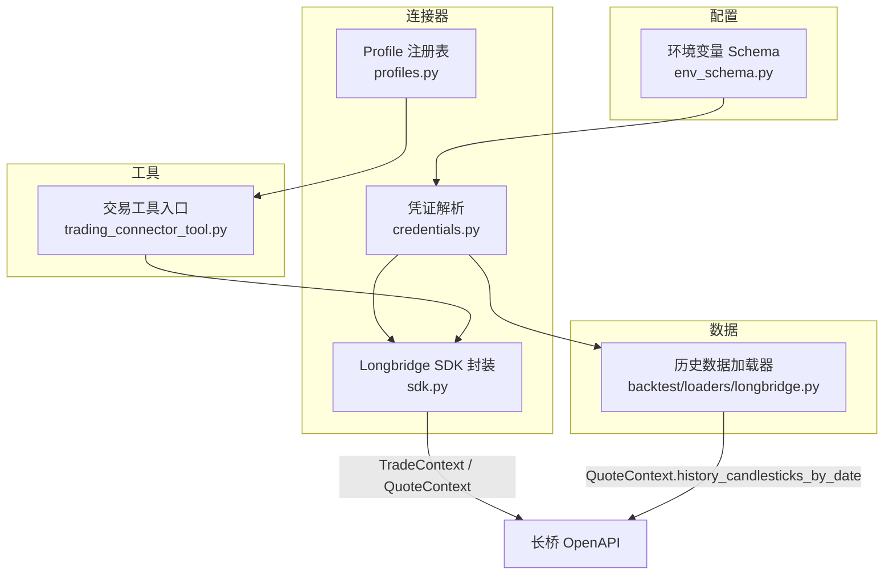
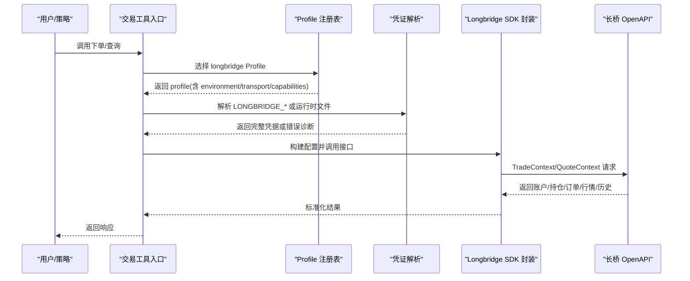
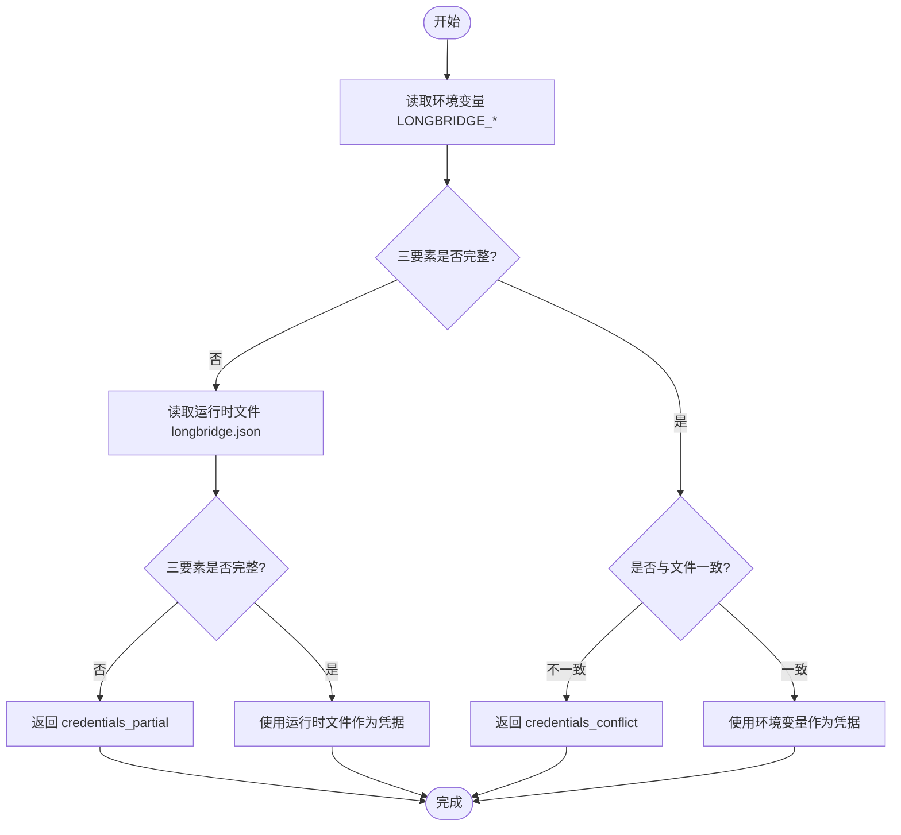
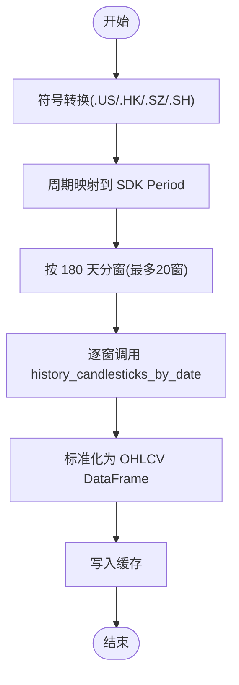
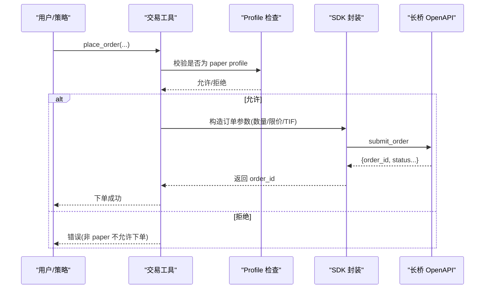
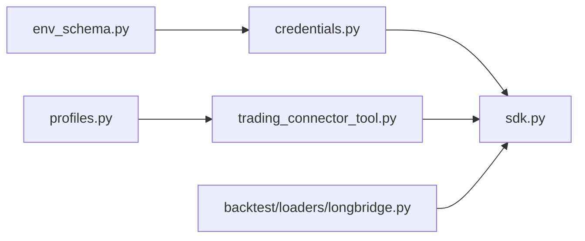

# 长桥证券集成

<cite>
**本文引用的文件**
- [agent/src/trading/connectors/longbridge/sdk.py](file://agent/src/trading/connectors/longbridge/sdk.py)
- [agent/src/trading/connectors/longbridge/credentials.py](file://agent/src/trading/connectors/longbridge/credentials.py)
- [agent/src/trading/connectors/longbridge/profiles.py](file://agent/src/trading/connectors/longbridge/profiles.py)
- [agent/backtest/loaders/longbridge.py](file://agent/backtest/loaders/longbridge.py)
- [agent/src/config/env_schema.py](file://agent/src/config/env_schema.py)
- [agent/tests/test_longbridge_runtime.py](file://agent/tests/test_longbridge_runtime.py)
- [agent/tests/test_longbridge_loader.py](file://agent/tests/test_longbridge_loader.py)
- [agent/src/tools/trading_connector_tool.py](file://agent/src/tools/trading_connector_tool.py)
</cite>

## 目录
1. [简介](#简介)
2. [项目结构](#项目结构)
3. [核心组件](#核心组件)
4. [架构总览](#架构总览)
5. [详细组件分析](#详细组件分析)
6. [依赖关系分析](#依赖关系分析)
7. [性能与限制](#性能与限制)
8. [故障排查指南](#故障排查指南)
9. [结论](#结论)
10. [附录：部署与配置](#附录：部署与配置)

## 简介
本文件面向在 Vibe-Trading 中集成“长桥（Longbridge/LongPort OpenAPI）”的开发者与运维人员，系统性说明以下要点：
- SDK 初始化与认证流程（环境变量与运行时文件的原子化凭证解析）
- 权限管理与只读/交易能力边界（基于 Profile 的能力声明）
- 全球多市场历史数据获取（美股、港股；A股通过符号约定支持）
- 股票下单（仅模拟盘）、订单生命周期与成交确认
- 实时行情推送与历史数据查询的实现方式
- 账户信息同步（资产、持仓、订单）
- 云端与本地部署的配置差异

## 项目结构
围绕长桥集成的关键代码分布在以下模块：
- 连接器 SDK 封装：提供账户、持仓、订单、行情、历史的只读访问与模拟盘下单
- 凭证解析：从环境变量或运行时文件原子化选择并校验三要素（App Key、App Secret、Access Token）
- Profile 注册表：声明 longbridge 的连接身份、环境（paper/live）、传输类型与能力集合
- 回测数据加载器：封装 QuoteContext 拉取 OHLCV 历史数据，自动分窗与缓存
- 配置与环境变量：定义 LONGBRIDGE_* 环境变量映射
- 工具层：统一交易下单入口，将 LLM 调用参数规范化后路由到具体连接器

图表来源
- [agent/src/trading/connectors/longbridge/sdk.py:34-78](file://agent/src/trading/connectors/longbridge/sdk.py#L34-L78)
- [agent/src/trading/connectors/longbridge/credentials.py:49-130](file://agent/src/trading/connectors/longbridge/credentials.py#L49-L130)
- [agent/src/trading/connectors/longbridge/profiles.py:12-55](file://agent/src/trading/connectors/longbridge/profiles.py#L12-L55)
- [agent/backtest/loaders/longbridge.py:200-240](file://agent/backtest/loaders/longbridge.py#L200-L240)
- [agent/src/config/env_schema.py:193-195](file://agent/src/config/env_schema.py#L193-L195)
- [agent/src/tools/trading_connector_tool.py:440-487](file://agent/src/tools/trading_connector_tool.py#L440-L487)

章节来源
- [agent/src/trading/connectors/longbridge/sdk.py:34-78](file://agent/src/trading/connectors/longbridge/sdk.py#L34-L78)
- [agent/src/trading/connectors/longbridge/credentials.py:49-130](file://agent/src/trading/connectors/longbridge/credentials.py#L49-L130)
- [agent/src/trading/connectors/longbridge/profiles.py:12-55](file://agent/src/trading/connectors/longbridge/profiles.py#L12-L55)
- [agent/backtest/loaders/longbridge.py:200-240](file://agent/backtest/loaders/longbridge.py#L200-L240)
- [agent/src/config/env_schema.py:193-195](file://agent/src/config/env_schema.py#L193-L195)
- [agent/src/tools/trading_connector_tool.py:440-487](file://agent/src/tools/trading_connector_tool.py#L440-L487)

## 核心组件
- 连接器 SDK 封装（只读 + 模拟盘下单）
  - 提供账户、持仓、订单、行情、历史等只读接口；下单仅在 paper profile 下允许
  - 通过 TradeContext/QuoteContext 与长桥 OpenAPI 交互
- 凭证解析
  - 从环境变量或运行时文件原子化选择完整三要素，冲突或缺失时给出诊断
- Profile 注册表
  - 声明 longbridge-paper-sdk、longbridge-paper-trade、longbridge-live-sdk-readonly 三种内置 Profile
  - 明确 readonly 与 capabilities，避免误用 live 下单
- 历史数据加载器
  - 使用 QuoteContext 拉取 OHLCV，自动按窗口拆分请求，标准化时间戳为无时区 UTC
- 配置与环境变量
  - 通过 LONGBRIDGE_APP_KEY/LONGBRIDGE_APP_SECRET/LONGBRIDGE_ACCESS_TOKEN 注入凭据
- 交易工具入口
  - 统一参数校验与路由，最终调用对应连接器的 place_order

章节来源
- [agent/src/trading/connectors/longbridge/sdk.py:335-563](file://agent/src/trading/connectors/longbridge/sdk.py#L335-L563)
- [agent/src/trading/connectors/longbridge/credentials.py:49-130](file://agent/src/trading/connectors/longbridge/credentials.py#L49-L130)
- [agent/src/trading/connectors/longbridge/profiles.py:12-55](file://agent/src/trading/connectors/longbridge/profiles.py#L12-L55)
- [agent/backtest/loaders/longbridge.py:200-240](file://agent/backtest/loaders/longbridge.py#L200-L240)
- [agent/src/config/env_schema.py:193-195](file://agent/src/config/env_schema.py#L193-L195)
- [agent/src/tools/trading_connector_tool.py:440-487](file://agent/src/tools/trading_connector_tool.py#L440-L487)

## 架构总览
下图展示从工具调用到长桥 OpenAPI 的端到端流程，包括凭证解析、Profile 选择、SDK 上下文创建与 API 调用。

图表来源
- [agent/src/tools/trading_connector_tool.py:440-487](file://agent/src/tools/trading_connector_tool.py#L440-L487)
- [agent/src/trading/connectors/longbridge/profiles.py:12-55](file://agent/src/trading/connectors/longbridge/profiles.py#L12-L55)
- [agent/src/trading/connectors/longbridge/credentials.py:49-130](file://agent/src/trading/connectors/longbridge/credentials.py#L49-L130)
- [agent/src/trading/connectors/longbridge/sdk.py:668-707](file://agent/src/trading/connectors/longbridge/sdk.py#L668-L707)

## 详细组件分析

### 认证与权限管理
- 凭证来源与优先级
  - 优先使用完整的环境变量三要素；若存在且与运行时文件不一致则判定冲突
  - 否则回退到运行时文件；任一缺失会报告 missing/partial/conflict 诊断
- 环境标识与只读约束
  - 长桥未暴露纸盘/实盘的运行时区分字段，因此以“配置声明”为准，并在响应中附带 paper_guard="config_declared"
  - live 默认以只读 Profile 暴露；下单仅限 paper profile
- 能力声明
  - 内置 Profile 明确 capabilities，如 account.read、positions.read、orders.read、quotes.read、history.read；trade 能力仅在 paper-trade 中开放

图表来源
- [agent/src/trading/connectors/longbridge/credentials.py:49-130](file://agent/src/trading/connectors/longbridge/credentials.py#L49-L130)
- [agent/src/trading/connectors/longbridge/sdk.py:34-78](file://agent/src/trading/connectors/longbridge/sdk.py#L34-L78)
- [agent/src/trading/connectors/longbridge/profiles.py:12-55](file://agent/src/trading/connectors/longbridge/profiles.py#L12-L55)

章节来源
- [agent/src/trading/connectors/longbridge/credentials.py:49-130](file://agent/src/trading/connectors/longbridge/credentials.py#L49-L130)
- [agent/src/trading/connectors/longbridge/sdk.py:34-78](file://agent/src/trading/connectors/longbridge/sdk.py#L34-L78)
- [agent/src/trading/connectors/longbridge/profiles.py:12-55](file://agent/src/trading/connectors/longbridge/profiles.py#L12-L55)

### 全球多市场历史数据（美股、港股、A股）
- 市场支持
  - 加载器声明 markets={"us_equity", "hk_equity"}，并通过符号后缀识别 A 股（如 .SZ/.SH）
- 符号转换
  - 不带后缀默认视为美股；带后缀保持原样
- 周期映射
  - 支持 1m/5m/15m/30m/1h/1d/1w/1M 等，内部映射到 SDK Period 枚举
- 分窗与上限
  - 单次请求约 1000 根 K 线，自动按 180 天窗口切分，最多 20 个窗口
  - 超出窗口预算的请求显式失败，避免静默截断
- 数据标准化
  - 输出 OHLCV 列，时间戳转为无时区 UTC，空值填充与排序

图表来源
- [agent/backtest/loaders/longbridge.py:89-156](file://agent/backtest/loaders/longbridge.py#L89-L156)
- [agent/backtest/loaders/longbridge.py:159-197](file://agent/backtest/loaders/longbridge.py#L159-L197)
- [agent/backtest/loaders/longbridge.py:255-412](file://agent/backtest/loaders/longbridge.py#L255-L412)

章节来源
- [agent/backtest/loaders/longbridge.py:89-156](file://agent/backtest/loaders/longbridge.py#L89-L156)
- [agent/backtest/loaders/longbridge.py:159-197](file://agent/backtest/loaders/longbridge.py#L159-L197)
- [agent/backtest/loaders/longbridge.py:255-412](file://agent/backtest/loaders/longbridge.py#L255-L412)

### 股票交易与订单生命周期（仅模拟盘）
- 下单入口
  - 工具层统一接收 symbol/side/quantity/notional/order_type/limit_price/time_in_force
  - 数值参数严格校验，非有限值直接拒绝
- 长桥下单约束
  - 仅接受 quantity（不接受 notional-only）
  - TIF 仅支持 day；order_type 支持 market/limit
  - 必须为 paper profile，否则直接返回错误
- 订单状态归一化
  - 将 SDK 返回的状态归一化为小写 bare 名称，过滤今日订单中的已终结状态，得到 open_orders
- 订单生命周期
  - 提交 -> 返回 order_id -> 轮询/回调获取状态 -> 成交确认

图表来源
- [agent/src/tools/trading_connector_tool.py:440-487](file://agent/src/tools/trading_connector_tool.py#L440-L487)
- [agent/src/trading/connectors/longbridge/sdk.py:431-563](file://agent/src/trading/connectors/longbridge/sdk.py#L431-L563)
- [agent/src/trading/connectors/longbridge/sdk.py:344-363](file://agent/src/trading/connectors/longbridge/sdk.py#L344-L363)

章节来源
- [agent/src/tools/trading_connector_tool.py:440-487](file://agent/src/tools/trading_connector_tool.py#L440-L487)
- [agent/src/trading/connectors/longbridge/sdk.py:431-563](file://agent/src/trading/connectors/longbridge/sdk.py#L431-L563)
- [agent/src/trading/connectors/longbridge/sdk.py:344-363](file://agent/src/trading/connectors/longbridge/sdk.py#L344-L363)

### 实时行情推送与历史数据查询
- 实时行情
  - 通过 QuoteContext 订阅/拉取；当前连接器主要暴露历史与快照类接口
- 历史数据
  - 使用 backtest loader 的 LongbridgeLoader.fetch，自动分窗、标准化与缓存
  - 支持多周期、多标的批量拉取

章节来源
- [agent/backtest/loaders/longbridge.py:200-240](file://agent/backtest/loaders/longbridge.py#L200-L240)
- [agent/backtest/loaders/longbridge.py:255-412](file://agent/backtest/loaders/longbridge.py#L255-L412)

### 账户信息同步（资产、持仓、订单）
- 账户与持仓
  - 通过 SDK 的账户与持仓接口获取，返回包含 profile 与 paper_guard 的标准化结构
- 订单
  - 可获取今日订单并过滤出 open_orders；状态归一化处理兼容不同 SDK 版本

章节来源
- [agent/src/trading/connectors/longbridge/sdk.py:335-363](file://agent/src/trading/connectors/longbridge/sdk.py#L335-L363)

### 期权与基金交易
- 当前实现范围
  - 连接器与加载器聚焦于股票（美股、港股、A 股）的历史数据与股票下单（仅模拟盘）
  - 未在本仓库中发现期权或基金的专用下单/行情实现
- 建议
  - 如需扩展，可参照股票路径新增对应的 SDK 封装与 Loader，复用凭证与 Profile 机制

[本节为概念性说明，不直接分析具体文件]

## 依赖关系分析
- 环境变量到凭据
  - env_schema 定义 LONGBRIDGE_* 字段，被 credentials 读取并解析
- 凭证到连接器
  - credentials 输出完整凭据后，sdk.py 构建 TradeContext/QuoteContext
- Profile 到工具
  - profiles.py 声明 longbridge 的内置 Profile，工具层据此选择能力与行为
- 加载器到 SDK
  - backtest loader 依赖 QuoteContext 进行历史数据拉取

图表来源
- [agent/src/config/env_schema.py:193-195](file://agent/src/config/env_schema.py#L193-L195)
- [agent/src/trading/connectors/longbridge/credentials.py:49-130](file://agent/src/trading/connectors/longbridge/credentials.py#L49-L130)
- [agent/src/trading/connectors/longbridge/sdk.py:668-707](file://agent/src/trading/connectors/longbridge/sdk.py#L668-L707)
- [agent/src/trading/connectors/longbridge/profiles.py:12-55](file://agent/src/trading/connectors/longbridge/profiles.py#L12-L55)
- [agent/backtest/loaders/longbridge.py:200-240](file://agent/backtest/loaders/longbridge.py#L200-L240)
- [agent/src/tools/trading_connector_tool.py:440-487](file://agent/src/tools/trading_connector_tool.py#L440-L487)

章节来源
- [agent/src/config/env_schema.py:193-195](file://agent/src/config/env_schema.py#L193-L195)
- [agent/src/trading/connectors/longbridge/credentials.py:49-130](file://agent/src/trading/connectors/longbridge/credentials.py#L49-L130)
- [agent/src/trading/connectors/longbridge/sdk.py:668-707](file://agent/src/trading/connectors/longbridge/sdk.py#L668-L707)
- [agent/src/trading/connectors/longbridge/profiles.py:12-55](file://agent/src/trading/connectors/longbridge/profiles.py#L12-L55)
- [agent/backtest/loaders/longbridge.py:200-240](file://agent/backtest/loaders/longbridge.py#L200-L240)
- [agent/src/tools/trading_connector_tool.py:440-487](file://agent/src/tools/trading_connector_tool.py#L440-L487)

## 性能与限制
- 历史数据分窗
  - 单请求约 1000 根 K 线，超过 180 天自动分窗，最多 20 窗；超限时显式报错
- 缓存
  - 同一 source/symbol/timeframe/date range 的结果会被缓存，减少重复网络请求
- 时间戳标准化
  - 所有时间戳统一为无时区 UTC，便于跨市场对齐
- 下单限制
  - 仅支持 quantity 下单；notional-only 不支持
  - TIF 仅支持 day；order_type 支持 market/limit
- 只读与纸盘
  - live 默认只读；下单仅限 paper profile；纸盘/实盘由配置声明而非 API 区分

章节来源
- [agent/backtest/loaders/longbridge.py:62-67](file://agent/backtest/loaders/longbridge.py#L62-L67)
- [agent/backtest/loaders/longbridge.py:135-156](file://agent/backtest/loaders/longbridge.py#L135-L156)
- [agent/backtest/loaders/longbridge.py:159-197](file://agent/backtest/loaders/longbridge.py#L159-L197)
- [agent/src/trading/connectors/longbridge/sdk.py:431-563](file://agent/src/trading/connectors/longbridge/sdk.py#L431-L563)
- [agent/src/trading/connectors/longbridge/sdk.py:34-78](file://agent/src/trading/connectors/longbridge/sdk.py#L34-L78)

## 故障排查指南
- 凭证问题
  - 缺少/部分/冲突：查看诊断码 credentials_missing/credentials_partial/credentials_conflict 及缺失字段
  - 环境变量与运行时文件不一致会触发冲突
- SDK 未安装
  - 导入失败时抛出依赖错误；需安装可选依赖
- 日期范围超限
  - 超过最大窗口预算会显式报错，应缩小时间范围或分批拉取
- 下单失败
  - 非 paper profile 直接拒绝；notional-only 不支持；TIF 必须为 day；symbol 必填
- 状态与连接
  - 通过 /live/status 可查看 longbridge 的 auth 状态、capabilities、connection_state 等

章节来源
- [agent/src/trading/connectors/longbridge/credentials.py:49-130](file://agent/src/trading/connectors/longbridge/credentials.py#L49-L130)
- [agent/backtest/loaders/longbridge.py:135-156](file://agent/backtest/loaders/longbridge.py#L135-L156)
- [agent/src/trading/connectors/longbridge/sdk.py:431-563](file://agent/src/trading/connectors/longbridge/sdk.py#L431-L563)
- [agent/tests/test_longbridge_runtime.py:47-67](file://agent/tests/test_longbridge_runtime.py#L47-L67)
- [agent/tests/test_longbridge_runtime.py:178-207](file://agent/tests/test_longbridge_runtime.py#L178-L207)
- [agent/tests/test_longbridge_runtime.py:249-267](file://agent/tests/test_longbridge_runtime.py#L249-L267)
- [agent/tests/test_longbridge_runtime.py:325-342](file://agent/tests/test_longbridge_runtime.py#L325-L342)
- [agent/tests/test_longbridge_runtime.py:408-427](file://agent/tests/test_longbridge_runtime.py#L408-L427)
- [agent/tests/test_longbridge_loader.py:17-33](file://agent/tests/test_longbridge_loader.py#L17-L33)
- [agent/tests/test_longbridge_loader.py:85-143](file://agent/tests/test_longbridge_loader.py#L85-L143)

## 结论
- 本项目对长桥的集成以“安全、只读优先、纸盘下单”为原则，通过 Profile 与能力声明确保最小权限
- 历史数据加载具备分窗、缓存与标准化能力，满足回测需求
- 下单路径严格限定于 paper profile，避免误触实盘
- 凭证解析兼顾环境变量与运行时文件，并提供清晰的诊断信息
- 如需扩展期权/基金或更多市场，可沿用现有模式新增 Loader/Connector

[本节为总结性内容，不直接分析具体文件]

## 附录：部署与配置

### 环境变量与配置文件
- 环境变量
  - LONGBRIDGE_APP_KEY
  - LONGBRIDGE_APP_SECRET
  - LONGBRIDGE_ACCESS_TOKEN
- 运行时文件
  - 位于运行根目录的 longbridge.json，包含 app_key/app_secret/access_token/profile/region/timeout/readonly
- 区域与主机
  - global -> openapi.longbridge.com
  - cn -> openapi.longbridge.cn

章节来源
- [agent/src/config/env_schema.py:193-195](file://agent/src/config/env_schema.py#L193-L195)
- [agent/src/trading/connectors/longbridge/sdk.py:34-78](file://agent/src/trading/connectors/longbridge/sdk.py#L34-L78)
- [agent/src/trading/connectors/longbridge/sdk.py:174-208](file://agent/src/trading/connectors/longbridge/sdk.py#L174-L208)

### 云端与本地部署差异
- 本地开发
  - 设置 LONGBRIDGE_* 环境变量或使用 longbridge.json；选择 paper profile 进行模拟盘测试
- 云端生产
  - 建议使用环境变量注入凭据；启用只读 Profile 用于监控与数据拉取
  - 如需下单，仅允许纸盘 Profile；结合平台的安全策略与审计日志
- 状态观测
  - 通过 /live/status 查看 longbridge 的 auth/connection_state/capabilities/readonly 等指标

章节来源
- [agent/tests/test_longbridge_runtime.py:47-67](file://agent/tests/test_longbridge_runtime.py#L47-L67)
- [agent/tests/test_longbridge_runtime.py:178-207](file://agent/tests/test_longbridge_runtime.py#L178-L207)
- [agent/tests/test_longbridge_runtime.py:249-267](file://agent/tests/test_longbridge_runtime.py#L249-L267)
- [agent/tests/test_longbridge_runtime.py:325-342](file://agent/tests/test_longbridge_runtime.py#L325-L342)
- [agent/tests/test_longbridge_runtime.py:408-427](file://agent/tests/test_longbridge_runtime.py#L408-L427)