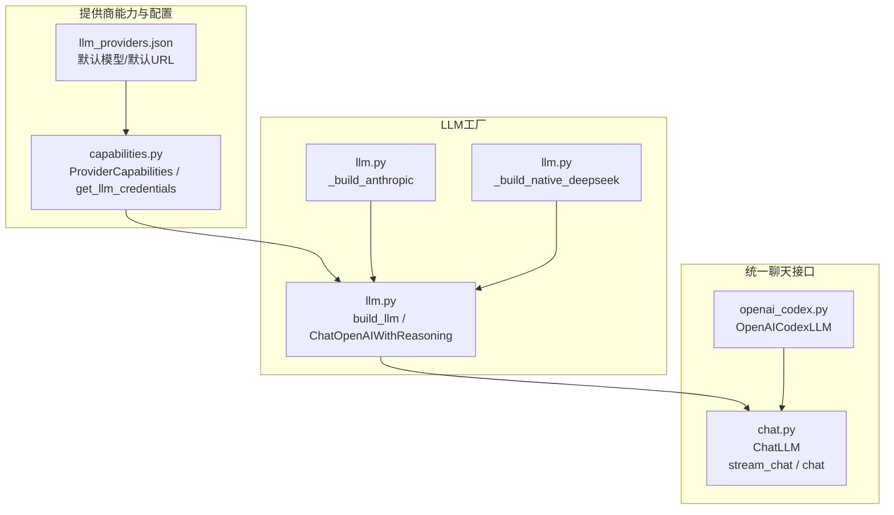
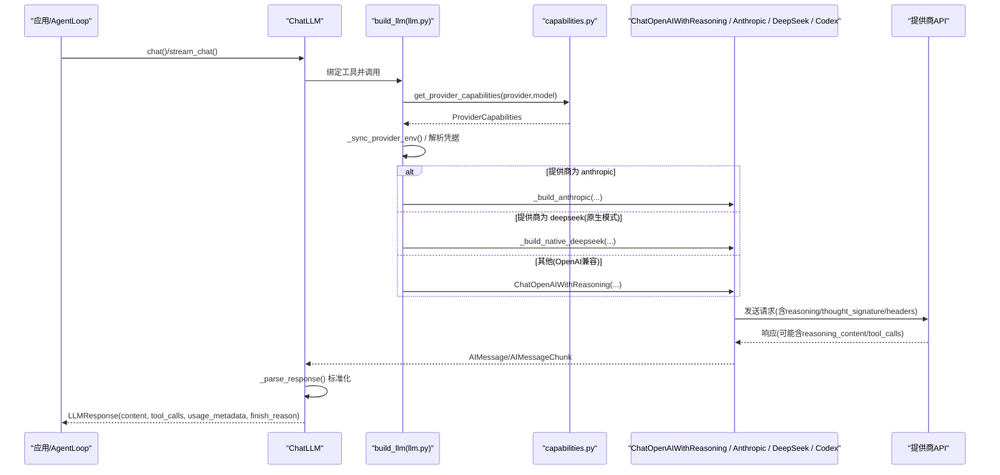
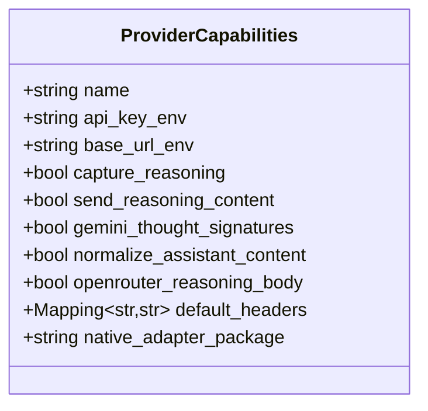
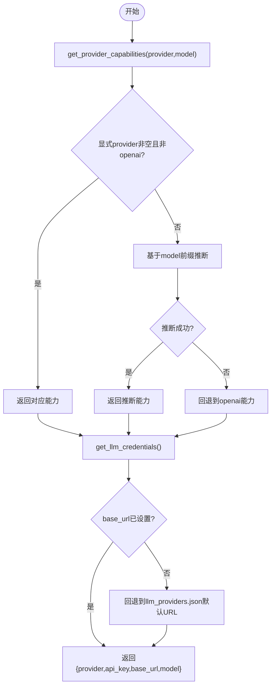
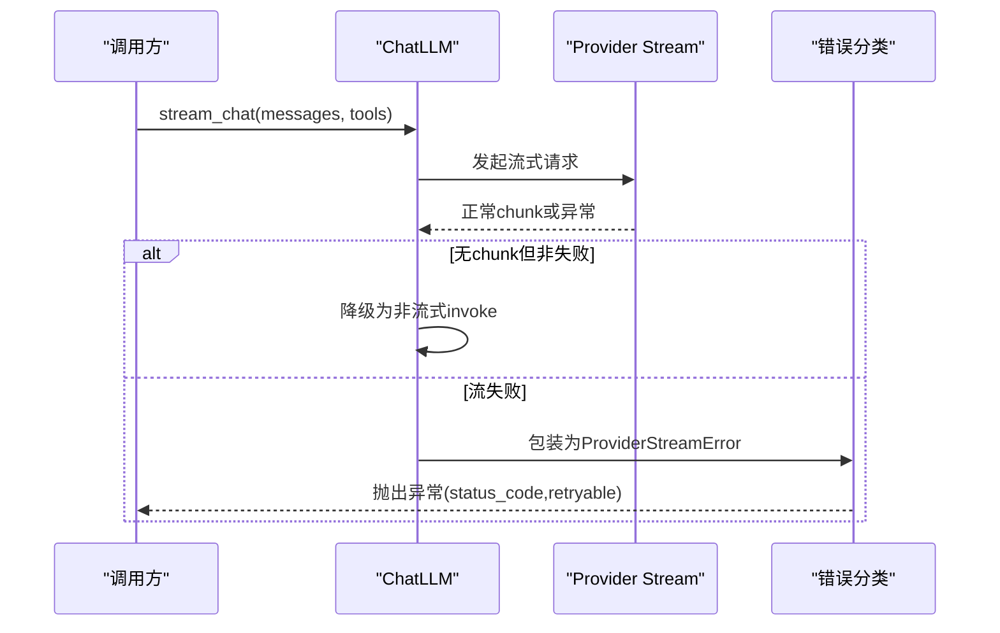
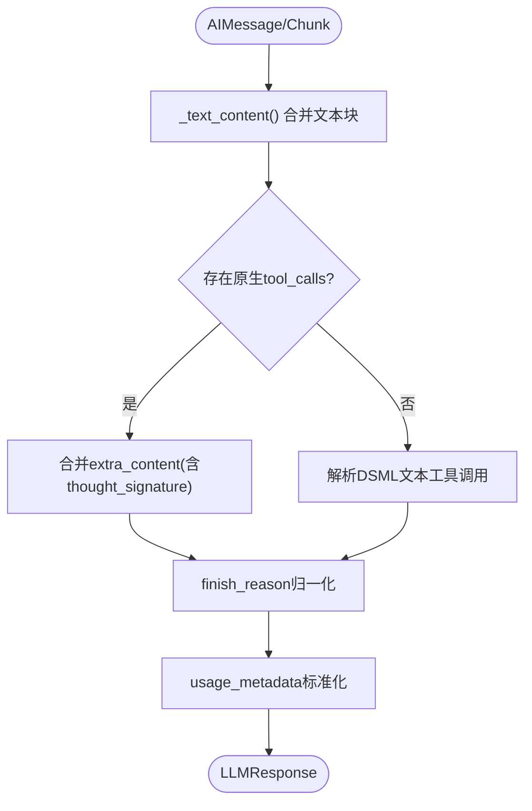
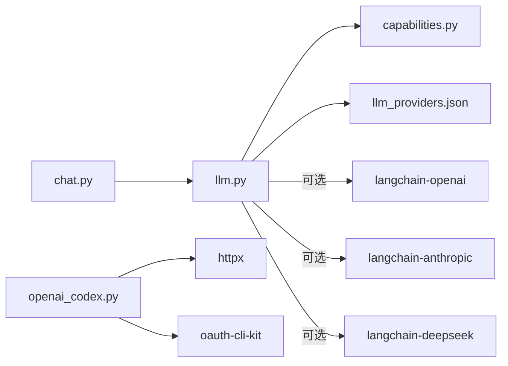

# LLM提供商集成

<cite>
**本文引用的文件**
- [agent/src/providers/__init__.py](file://agent/src/providers/__init__.py)
- [agent/src/providers/capabilities.py](file://agent/src/providers/capabilities.py)
- [agent/src/providers/chat.py](file://agent/src/providers/chat.py)
- [agent/src/providers/llm.py](file://agent/src/providers/llm.py)
- [agent/src/providers/openai_codex.py](file://agent/src/providers/openai_codex.py)
- [agent/src/providers/llm_providers.json](file://agent/src/providers/llm_providers.json)
- [agent/tests/test_llm.py](file://agent/tests/test_llm.py)
- [agent/tests/test_llm_provider_defaults.py](file://agent/tests/test_llm_provider_defaults.py)
</cite>

## 目录
1. [简介](#简介)
2. [项目结构](#项目结构)
3. [核心组件](#核心组件)
4. [架构总览](#架构总览)
5. [详细组件分析](#详细组件分析)
6. [依赖关系分析](#依赖关系分析)
7. [性能考虑](#性能考虑)
8. [故障排除指南](#故障排除指南)
9. [结论](#结论)
10. [附录：新增提供商接入指南](#附录：新增提供商接入指南)

## 简介
本文件面向 Vibe-Trading 的 LLM 提供商集成层，系统性说明如何以统一接口对接 OpenAI、Anthropic、DeepSeek、Moonshot/Kimi、Gemini、Groq、DashScope/Qwen、Zhipu/GLM、NVIDIA、iFlytek Spark、MiniMax、Mimo、Z.ai、ModelScope、Ollama 等 20+ 提供商。文档重点覆盖：
- 多提供商能力检测与差异化处理（reasoning 内容捕获/回写、工具调用签名、响应规范化）
- 提供商发现机制、环境变量解析与默认 URL 策略
- 认证流程、请求头定制与错误处理
- 如何扩展新提供商（能力定义、适配器实现、测试用例）
- 性能优化建议与常见问题排查

## 项目结构
LLM 提供商集成位于 agent/src/providers 目录下，采用“能力声明 + 工厂构建 + 统一聊天接口”的分层设计：
- capabilities.py：声明各提供商的能力元数据（API Key/Base URL 环境变量名、reasoning 行为、默认请求头等），并提供凭据解析与默认 URL 解析。
- llm.py：提供 build_llm 工厂，根据配置选择原生或兼容路径（Anthropic、DeepSeek、OpenAI 兼容），并注入 reasoning、thought signature、请求头等。
- chat.py：对外暴露 ChatLLM，封装同步/流式调用、工具调用解析、DSML 文本工具调用解析、响应标准化与错误包装。
- openai_codex.py：独立实现 OpenAI Codex OAuth 路径，包含令牌刷新、SSE 事件流、工具调用映射。
- llm_providers.json：提供商目录清单，维护每个提供商的默认模型、默认 Base URL、是否必需 API Key 等。

图表来源
- [agent/src/providers/capabilities.py:14-44](file://agent/src/providers/capabilities.py#L14-L44)
- [agent/src/providers/llm.py:1020-1135](file://agent/src/providers/llm.py#L1020-L1135)
- [agent/src/providers/chat.py:272-398](file://agent/src/providers/chat.py#L272-L398)
- [agent/src/providers/openai_codex.py:605-711](file://agent/src/providers/openai_codex.py#L605-L711)

章节来源
- [agent/src/providers/__init__.py:1-6](file://agent/src/providers/__init__.py#L1-L6)
- [agent/src/providers/capabilities.py:14-44](file://agent/src/providers/capabilities.py#L14-L44)
- [agent/src/providers/llm.py:1020-1135](file://agent/src/providers/llm.py#L1020-L1135)
- [agent/src/providers/chat.py:272-398](file://agent/src/providers/chat.py#L272-L398)
- [agent/src/providers/openai_codex.py:605-711](file://agent/src/providers/openai_codex.py#L605-L711)
- [agent/src/providers/llm_providers.json:1-216](file://agent/src/providers/llm_providers.json#L1-L216)

## 核心组件
- ProviderCapabilities：描述单个提供商的能力开关与环境变量命名空间，包括 reasoning 捕获/回写、Gemini thought signature 支持、助手内容规范化、OpenRouter/Requesty 专用 reasoning body、默认请求头等。
- get_llm_credentials：集中解析 provider → 环境变量 → 凭据链，并在未设置 base_url 时回退到 llm_providers.json 中的 default_base_url。
- build_llm：根据 LANGCHAIN_PROVIDER/LANGCHAIN_MODEL_NAME 及能力配置，构造 Anthropic 原生、DeepSeek 原生或 OpenAI 兼容客户端；注入 reasoning_effort、extra_body.reasoning、请求头等。
- ChatLLM：统一聊天接口，封装 bind_tools、invoke/stream、DSML 工具调用解析、finish_reason 归一化、content_filter 检测、usage_metadata 透传。
- OpenAICodexLLM：独立适配 ChatGPT Codex OAuth 路径，负责令牌获取/刷新、SSE 事件流解析、工具调用映射。

章节来源
- [agent/src/providers/capabilities.py:14-44](file://agent/src/providers/capabilities.py#L14-L44)
- [agent/src/providers/capabilities.py:220-353](file://agent/src/providers/capabilities.py#L220-L353)
- [agent/src/providers/llm.py:1020-1135](file://agent/src/providers/llm.py#L1020-L1135)
- [agent/src/providers/chat.py:272-514](file://agent/src/providers/chat.py#L272-L514)
- [agent/src/providers/openai_codex.py:605-711](file://agent/src/providers/openai_codex.py#L605-L711)

## 架构总览
下图展示了从上层调用到具体提供商的完整链路，包括能力检测、凭据解析、适配器选择、请求头注入与响应标准化。

图表来源
- [agent/src/providers/chat.py:299-398](file://agent/src/providers/chat.py#L299-L398)
- [agent/src/providers/llm.py:1020-1135](file://agent/src/providers/llm.py#L1020-L1135)
- [agent/src/providers/capabilities.py:220-353](file://agent/src/providers/capabilities.py#L220-L353)

## 详细组件分析

### 能力检测与差异化处理（ProviderCapabilities）
- reasoning 内容处理：
  - capture_reasoning：在入站消息中捕获 reasoning_content/reasoning，供后续使用（如 Moonshot、DeepSeek、Zhipu）。
  - send_reasoning_content：出站 assistant 历史中必须携带 reasoning_content（Moonshot/Kimi 要求严格）。
  - normalize_assistant_content：将 content=None 规范化为空字符串，避免某些提供商拒绝空内容。
- 工具调用签名：
  - gemini_thought_signatures：对 Gemini 的 thought signature 进行往返传递，确保下一轮不被拒绝。
- 请求体差异：
  - openrouter_reasoning_body：对 OpenRouter/Requesty 通过 extra_body.reasoning.effort 开启推理强度。
- 默认请求头：
  - default_headers：为特定提供商注入 User-Agent 等头部（如 Moonshot）。

图表来源
- [agent/src/providers/capabilities.py:14-44](file://agent/src/providers/capabilities.py#L14-L44)

章节来源
- [agent/src/providers/capabilities.py:67-200](file://agent/src/providers/capabilities.py#L67-L200)
- [agent/src/providers/capabilities.py:220-353](file://agent/src/providers/capabilities.py#L220-L353)

### 提供商发现、环境变量与默认 URL 解析
- 提供商发现：
  - 显式 provider 优先；若 provider 为空或为 openai，则基于 model 前缀推断（gemini/deepseek/nvidia/glm/kimi/moonshot）。
  - 网关提供商（openrouter/requesty）不会被模型名推断覆盖。
- 环境变量解析：
  - 按 ProviderCapabilities 中的 api_key_env/base_url_env 读取；若未设置 base_url，则回退到 llm_providers.json 的 default_base_url。
  - 兼容 OPENAI_BASE_URL/OPENAI_API_BASE 作为通用回退。
- 默认 URL：
  - 通过 _provider_default_base_urls() 加载 llm_providers.json，提供稳定的默认端点（例如 Z.ai 的 coding 端点）。

图表来源
- [agent/src/providers/capabilities.py:203-247](file://agent/src/providers/capabilities.py#L203-L247)
- [agent/src/providers/capabilities.py:258-353](file://agent/src/providers/capabilities.py#L258-L353)
- [agent/src/providers/llm_providers.json:1-216](file://agent/src/providers/llm_providers.json#L1-L216)

章节来源
- [agent/src/providers/capabilities.py:203-353](file://agent/src/providers/capabilities.py#L203-L353)
- [agent/tests/test_llm_provider_defaults.py:147-179](file://agent/tests/test_llm_provider_defaults.py#L147-L179)

### 认证流程、请求头定制与错误处理
- 认证：
  - 标准提供商：通过各自 *_API_KEY 环境变量注入 Authorization Bearer。
  - OpenAI Codex：使用 oauth-cli-kit 管理会话，自动刷新 access token，必要时提示重新登录。
- 请求头定制：
  - 通过 ProviderCapabilities.default_headers 注入默认头（如 User-Agent）。
  - ChatOpenAIWithReasoning 会隔离环境中的 OpenAI 相关头（组织/项目/自定义头），仅对非 OpenAI 提供商移除不兼容头，并确保 Authorization 唯一。
- 错误处理：
  - ProviderStreamError：包装流式异常，区分可重试（超时、限流、5xx）与不可重试（4xx）。
  - CodexStreamError/CodexAuthenticationError：针对 Codex 的 HTTP 错误与认证失效。
  - 内容过滤：finish_reason 为 content_filter 时标记 content_filter_triggered。

图表来源
- [agent/src/providers/chat.py:117-187](file://agent/src/providers/chat.py#L117-L187)
- [agent/src/providers/chat.py:315-398](file://agent/src/providers/chat.py#L315-L398)
- [agent/src/providers/openai_codex.py:57-83](file://agent/src/providers/openai_codex.py#L57-L83)

章节来源
- [agent/src/providers/llm.py:109-164](file://agent/src/providers/llm.py#L109-L164)
- [agent/src/providers/chat.py:117-187](file://agent/src/providers/chat.py#L117-L187)
- [agent/src/providers/openai_codex.py:57-83](file://agent/src/providers/openai_codex.py#L57-L83)

### 响应规范化与工具调用处理
- 文本内容归一化：将 provider 返回的 content blocks 合并为纯文本。
- 工具调用：
  - 原生 tool_calls：提取 id/name/arguments，并合并 provider 特定的 extra_content（如 Gemini thought signature）。
  - DSML 文本工具调用：当 provider 以文本形式返回 DSML 标签时，正则解析为 ToolCallRequest。
- finish_reason 去重与标准化：处理重复后缀（tool_callstool_calls）与不同供应商的差异字段。
- usage_metadata：透传真实 token 计数，便于成本审计。

图表来源
- [agent/src/providers/chat.py:34-49](file://agent/src/providers/chat.py#L34-L49)
- [agent/src/providers/chat.py:226-269](file://agent/src/providers/chat.py#L226-L269)
- [agent/src/providers/chat.py:425-514](file://agent/src/providers/chat.py#L425-L514)

章节来源
- [agent/src/providers/chat.py:226-269](file://agent/src/providers/chat.py#L226-L269)
- [agent/src/providers/chat.py:425-514](file://agent/src/providers/chat.py#L425-L514)

### 适配器实现要点
- ChatOpenAIWithReasoning：
  - 捕获 reasoning_content 并回写到 outbound payload。
  - 注入 Gemini thought signatures，防止下一轮被拒。
  - 隔离环境头，避免跨提供商污染。
- Anthropic：
  - 动态子类化 ChatAnthropic，遇到 temperature 不支持时自动移除并重试一次。
- DeepSeek：
  - 可选 langchain-deepseek 原生适配器；否则回退到 OpenAI 兼容路径。
- OpenAICodexLLM：
  - 独立 SSE 事件流解析，工具调用参数拼接，token 刷新与锁定。

章节来源
- [agent/src/providers/llm.py:91-423](file://agent/src/providers/llm.py#L91-L423)
- [agent/src/providers/llm.py:630-733](file://agent/src/providers/llm.py#L630-L733)
- [agent/src/providers/llm.py:569-614](file://agent/src/providers/llm.py#L569-L614)
- [agent/src/providers/openai_codex.py:210-245](file://agent/src/providers/openai_codex.py#L210-L245)
- [agent/src/providers/openai_codex.py:605-711](file://agent/src/providers/openai_codex.py#L605-L711)

## 依赖关系分析
- 模块耦合：
  - chat.py 依赖 llm.py 的 build_llm 与 capabilities.py 的凭据解析。
  - llm.py 依赖 capabilities.py 的能力与目录，以及可选的 langchain-openai/langchain-anthropic/langchain-deepseek。
  - openai_codex.py 独立于 LangChain，直接通过 httpx 与 Codex 后端交互。
- 外部依赖：
  - httpx：用于禁用代理或 Codex SSE 流。
  - dotenv：加载 .env 文件（优先级：~/.vibe-trading/.env → agent/.env → CWD/.env）。
  - oauth-cli-kit：Codex OAuth 令牌管理。

图表来源
- [agent/src/providers/chat.py:15-18](file://agent/src/providers/chat.py#L15-L18)
- [agent/src/providers/llm.py:18-43](file://agent/src/providers/llm.py#L18-L43)
- [agent/src/providers/openai_codex.py:24-40](file://agent/src/providers/openai_codex.py#L24-L40)

章节来源
- [agent/src/providers/llm.py:18-43](file://agent/src/providers/llm.py#L18-L43)
- [agent/src/providers/openai_codex.py:24-40](file://agent/src/providers/openai_codex.py#L24-L40)

## 性能考虑
- 流式优先与非流式降级：当 provider 不支持 SSE 或返回空 chunk 时，自动降级为 invoke，保证可用性。
- 温度参数自适应：Kimi/Moonshot 推理模型强制 temperature=1.0；Anthropic 某些模型不支持 temperature，自动移除并重试。
- 请求头隔离：避免环境中的 OpenAI 专属头污染其他提供商请求，减少无效请求与错误。
- 代理控制：可通过环境变量禁用系统代理，避免企业代理干扰直连。
- Token 缓存与刷新：Codex 使用本地存储与并发锁，避免重复刷新与竞争条件。

[本节为通用指导，无需特定文件引用]

## 故障排除指南
- 常见错误与定位：
  - HTML 响应而非 JSON：通常 base_url 指向网站根而非 API 根，需修正为 /v1 或对应 API 路径。
  - 401/403 认证失败：检查 API Key 是否正确；Codex 需要重新登录。
  - content_filter_triggered：提供商内容审核拦截，需调整输入或模型。
  - 无流式输出：部分端点不支持 SSE，会自动降级为非流式。
- 诊断信息：
  - 使用 provider_diagnostics() 获取红acted 的诊断快照（provider/model/base_url/env/proxy/packages/capabilities）。
  - 日志中包含 .env 来源标签（不含绝对路径）、代理信息与包版本。

章节来源
- [agent/src/providers/chat.py:117-187](file://agent/src/providers/chat.py#L117-L187)
- [agent/src/providers/llm.py:905-1017](file://agent/src/providers/llm.py#L905-L1017)
- [agent/src/providers/openai_codex.py:57-83](file://agent/src/providers/openai_codex.py#L57-L83)

## 结论
Vibe-Trading 的 LLM 提供商集成通过能力声明、工厂构建与统一聊天接口，实现了 20+ 提供商的统一接入与差异化处理。其核心优势在于：
- 能力驱动的 reasoning 与工具调用签名处理
- 灵活的环境变量与默认 URL 解析
- 健壮的认证与错误处理
- 可扩展的适配器体系，便于新增提供商

[本节为总结性内容，无需特定文件引用]

## 附录：新增提供商接入指南
要新增一个 LLM 提供商，请按以下步骤操作：

1. 定义能力与凭据
   - 在 capabilities.py 中添加 ProviderCapabilities 实例，指定 name、api_key_env、base_url_env，并根据需要启用 capture_reasoning/send_reasoning_content/gemini_thought_signatures/normalize_assistant_content/openrouter_reasoning_body/default_headers。
   - 在 _PROVIDERS 字典中注册该提供商。

2. 添加默认模型与默认 URL
   - 在 llm_providers.json 中添加条目，包含 name、label、api_key_env、base_url_env、default_model、default_base_url、api_key_required 等。

3. 适配器实现（如需）
   - 若提供商有原生 SDK（如 Anthropic/DeepSeek），在 llm.py 中实现 _build_* 函数，并在 build_llm 中路由。
   - 若为 OpenAI 兼容，可直接使用 ChatOpenAIWithReasoning，并通过 capabilities 控制行为。
   - 若为特殊协议（如 Codex），参考 openai_codex.py 实现独立适配器。

4. 环境变量与默认 URL 回退
   - 确保 get_llm_credentials 能正确解析新提供商的 *_BASE_URL，并在缺失时回退到 llm_providers.json 的 default_base_url。

5. 测试用例
   - 编写单元测试验证：
     - 能力别名与模型推断（如 glm→zhipu、kimi→moonshot）
     - 环境变量映射（*_API_KEY/*_BASE_URL → OPENAI_*）
     - 默认模型与默认 URL 一致性
     - 流式与非流式行为、错误分类与重试策略

示例参考路径
- 能力定义与注册：[agent/src/providers/capabilities.py:67-200](file://agent/src/providers/capabilities.py#L67-L200)
- 默认模型与 URL 目录：[agent/src/providers/llm_providers.json:1-216](file://agent/src/providers/llm_providers.json#L1-L216)
- 适配器路由与构建：[agent/src/providers/llm.py:1020-1135](file://agent/src/providers/llm.py#L1020-L1135)
- 测试用例参考：[agent/tests/test_llm.py:19-120](file://agent/tests/test_llm.py#L19-L120)、[agent/tests/test_llm_provider_defaults.py:41-179](file://agent/tests/test_llm_provider_defaults.py#L41-L179)

章节来源
- [agent/src/providers/capabilities.py:67-200](file://agent/src/providers/capabilities.py#L67-L200)
- [agent/src/providers/llm_providers.json:1-216](file://agent/src/providers/llm_providers.json#L1-L216)
- [agent/src/providers/llm.py:1020-1135](file://agent/src/providers/llm.py#L1020-L1135)
- [agent/tests/test_llm.py:19-120](file://agent/tests/test_llm.py#L19-L120)
- [agent/tests/test_llm_provider_defaults.py:41-179](file://agent/tests/test_llm_provider_defaults.py#L41-L179)