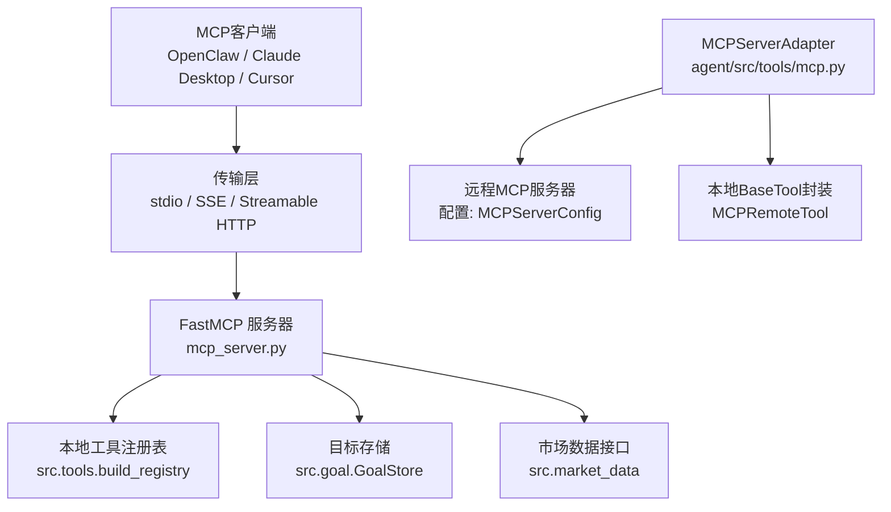
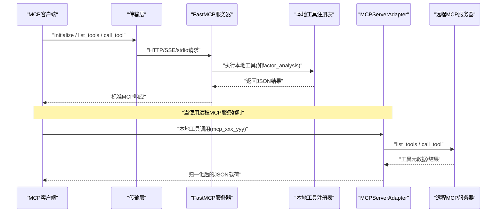
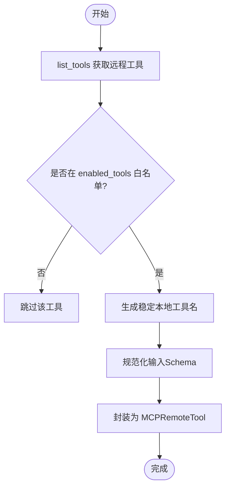
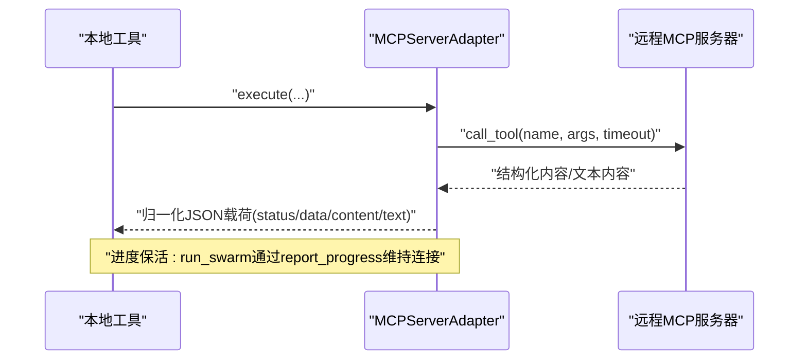
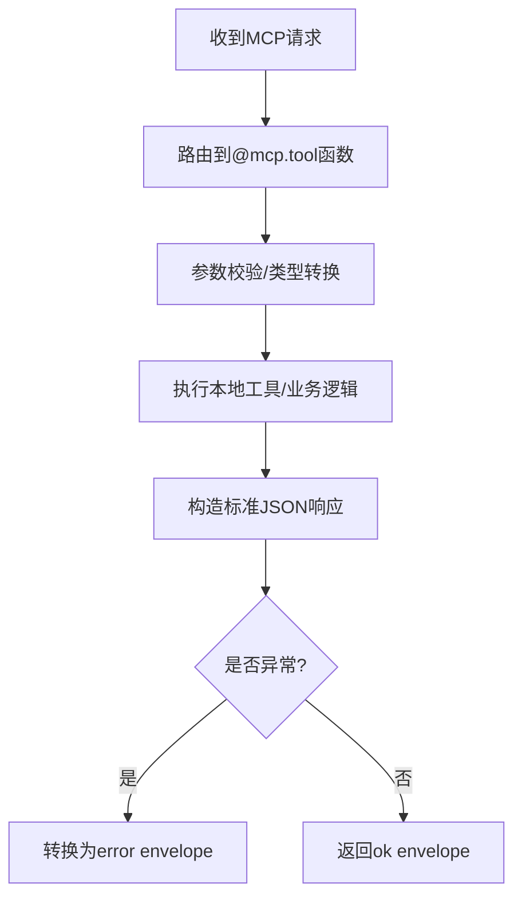
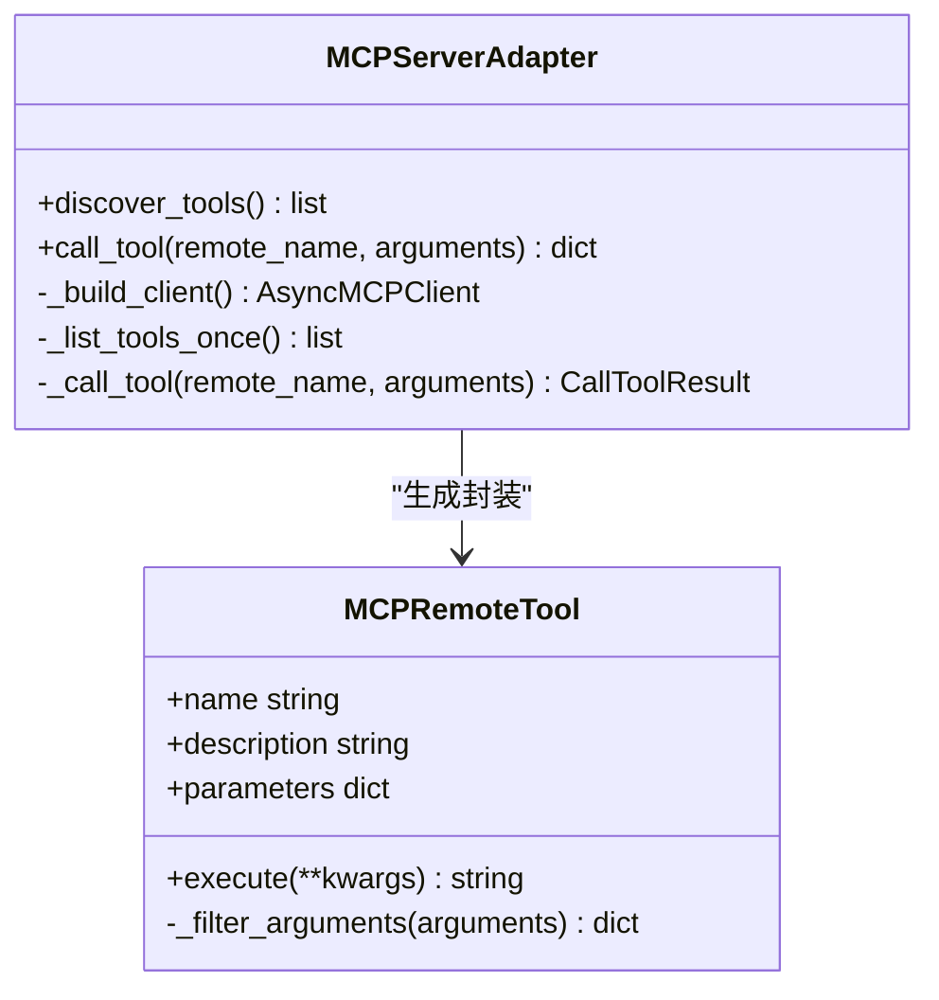
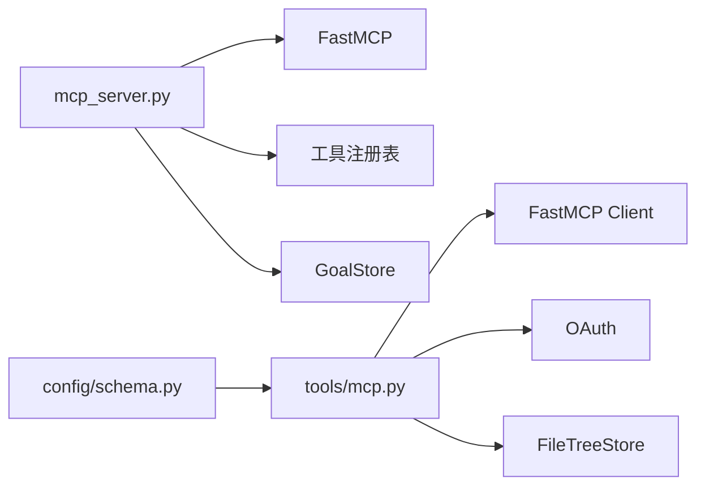

# MCP协议支持

<cite>
**本文引用的文件**
- [agent/mcp_server.py](file://agent/mcp_server.py)
- [agent/src/tools/mcp.py](file://agent/src/tools/mcp.py)
- [agent/src/config/schema.py](file://agent/src/config/schema.py)
- [agent/src/channelsui/mcp_presets_api.py](file://agent/src/channelsui/mcp_presets_api.py)
- [agent/tests/test_mcp_new_tools.py](file://agent/tests/test_mcp_new_tools.py)
</cite>

## 目录
1. [简介](#简介)
2. [项目结构](#项目结构)
3. [核心组件](#核心组件)
4. [架构总览](#架构总览)
5. [详细组件分析](#详细组件分析)
6. [依赖关系分析](#依赖关系分析)
7. [性能与可靠性](#性能与可靠性)
8. [故障排查指南](#故障排查指南)
9. [结论](#结论)
10. [附录](#附录)

## 简介
本文件为 Vibe-Trading 的 Model Context Protocol（MCP）支持提供完整技术文档，覆盖服务器端点、客户端SDK适配、消息格式规范、工具注册机制（动态发现、参数校验、权限控制）、连接管理（传输层、重试策略）、路由实现（请求转发、响应聚合、错误传播）、自定义工具开发、协议版本兼容与安全考虑、性能优化建议以及调试与监控方法。目标是帮助开发者快速理解并扩展Vibe-Trading的MCP能力，同时确保安全性与稳定性。

## 项目结构
Vibe-Trading对MCP的支持由“服务端”和“客户端适配器”两部分组成：
- 服务端：基于FastMCP暴露大量金融研究工具，支持stdio、SSE与Streamable HTTP三种传输；内置Host/Origin白名单防护，默认仅允许回环地址访问网络端口。
- 客户端适配器：将外部MCP服务器（如券商或数据服务）的工具动态发现并包装成本地BaseTool，统一调用、重试、结果归一化与错误处理。

图表来源
- [agent/mcp_server.py:69-81](file://agent/mcp_server.py#L69-L81)
- [agent/src/tools/mcp.py:370-535](file://agent/src/tools/mcp.py#L370-L535)
- [agent/src/config/schema.py:349-411](file://agent/src/config/schema.py#L349-L411)

章节来源
- [agent/mcp_server.py:1-120](file://agent/mcp_server.py#L1-L120)
- [agent/src/tools/mcp.py:1-120](file://agent/src/tools/mcp.py#L1-L120)
- [agent/src/config/schema.py:1-50](file://agent/src/config/schema.py#L1-L50)

## 核心组件
- FastMCP服务器实例：创建并注册工具，提供HTTP/SSE/stdio端点，内置安全中间件。
- 工具注册与镜像：通过装饰器@mcp.tool注册本地工具；部分工具直接委托给本地工具注册表执行。
- 客户端适配器：根据配置构建不同传输的FastMCP客户端，动态发现远程工具，生成稳定的本地工具名，过滤参数，调用并归一化结果。
- 配置模型：MCPServerConfig定义传输、超时、鉴权、工具白名单等；对在线券商进行严格限制，禁止通配符开启写操作。
- 预设提及规范化：在WebSocket通道中标准化MCP预设提及，便于UI展示与路由。

章节来源
- [agent/mcp_server.py:495-1599](file://agent/mcp_server.py#L495-L1599)
- [agent/src/tools/mcp.py:143-207](file://agent/src/tools/mcp.py#L143-L207)
- [agent/src/config/schema.py:349-492](file://agent/src/config/schema.py#L349-L492)
- [agent/src/channelsui/mcp_presets_api.py:8-20](file://agent/src/channelsui/mcp_presets_api.py#L8-L20)

## 架构总览
下图展示了从客户端到服务端再到本地工具注册表的请求流，以及客户端适配器如何桥接远程MCP服务器。

图表来源
- [agent/mcp_server.py:495-1599](file://agent/mcp_server.py#L495-L1599)
- [agent/src/tools/mcp.py:439-589](file://agent/src/tools/mcp.py#L439-L589)

## 详细组件分析

### 服务器端点与传输
- 传输类型：stdio（默认进程内）、SSE（遗留）、Streamable HTTP（当前规范默认）。
- 网络端点：/mcp用于Streamable HTTP；SSE为遗留路径。
- 安全中间件：Host与Origin白名单，默认仅允许127.0.0.1、::1、localhost；防止DNS重绑定攻击。
- 启动方式：命令行指定传输类型；环境变量可启用shell工具（默认关闭）。

章节来源
- [agent/mcp_server.py:25-35](file://agent/mcp_server.py#L25-L35)
- [agent/mcp_server.py:131-317](file://agent/mcp_server.py#L131-L317)
- [agent/mcp_server.py:102-128](file://agent/mcp_server.py#L102-L128)

### 工具注册机制
- 动态工具发现：客户端适配器通过list_tools获取远程工具元数据，按enabled_tools白名单过滤，生成稳定本地名称。
- 参数验证：本地工具签名使用Pydantic注解与BeforeValidator，自动解码JSON字符串形式的列表/字典参数，避免客户端anyOf序列化问题。
- 权限控制：在线券商（Robinhood、IBKR）禁止通配符enabledTools=["*"]，必须显式列出只读工具；OAuth作用域受限，禁止写入范围。

图表来源
- [agent/src/tools/mcp.py:401-437](file://agent/src/tools/mcp.py#L401-L437)
- [agent/src/tools/mcp.py:289-324](file://agent/src/tools/mcp.py#L289-L324)
- [agent/src/config/schema.py:458-492](file://agent/src/config/schema.py#L458-L492)

章节来源
- [agent/src/tools/mcp.py:143-207](file://agent/src/tools/mcp.py#L143-L207)
- [agent/src/tools/mcp.py:289-324](file://agent/src/tools/mcp.py#L289-L324)
- [agent/src/config/schema.py:145-180](file://agent/src/config/schema.py#L145-L180)
- [agent/src/config/schema.py:458-492](file://agent/src/config/schema.py#L458-L492)

### WebSocket连接管理
- 传输抽象：客户端适配器支持stdio、SSE、Streamable HTTP；不维护长连接池，每次调用通过上下文管理器创建/释放客户端。
- 心跳检测：服务端工具（如run_swarm）通过Context.report_progress定期发送进度帧，作为传输保活；客户端据此保持连接活跃。
- 重连策略：客户端适配器对list_tools等操作支持一次瞬态失败重试；call_tool不自动重试以避免副作用重复执行。

图表来源
- [agent/src/tools/mcp.py:564-589](file://agent/src/tools/mcp.py#L564-L589)
- [agent/mcp_server.py:1403-1513](file://agent/mcp_server.py#L1403-L513)

章节来源
- [agent/src/tools/mcp.py:537-627](file://agent/src/tools/mcp.py#L537-L627)
- [agent/mcp_server.py:1403-1513](file://agent/mcp_server.py#L1403-L1513)

### MCP路由实现
- 请求转发：@mcp.tool装饰的方法接收参数后，委托给本地工具注册表执行或直接调用业务模块（如市场数据、期权定价、模式识别）。
- 响应聚合：所有工具返回标准JSON信封（status ok/error），包含data、content、text等字段，便于客户端统一处理。
- 错误传播：异常被捕获并转换为error_type与error消息；远程工具错误通过_extract_result_error提取可读信息。

图表来源
- [agent/mcp_server.py:411-457](file://agent/mcp_server.py#L411-L457)
- [agent/src/tools/mcp.py:958-1061](file://agent/src/tools/mcp.py#L958-L1061)

章节来源
- [agent/mcp_server.py:495-1599](file://agent/mcp_server.py#L495-L1599)
- [agent/src/tools/mcp.py:958-1061](file://agent/src/tools/mcp.py#L958-L1061)

### 自定义MCP工具开发
- 工具定义：使用@mcp.tool装饰器声明函数签名与参数类型；参数可使用Annotated与BeforeValidator增强校验。
- 执行环境：工具通过本地工具注册表执行，支持沙箱隔离（如write_file/read_file受工作区路径限制）。
- 沙箱隔离：输出目录与文件路径需通过allowed_write_roots与resolve_safe_path校验，防止越权写入。

图表来源
- [agent/src/tools/mcp.py:370-694](file://agent/src/tools/mcp.py#L370-L694)

章节来源
- [agent/mcp_server.py:495-1599](file://agent/mcp_server.py#L495-L1599)
- [agent/src/tools/mcp.py:629-694](file://agent/src/tools/mcp.py#L629-L694)

### 协议版本兼容性
- 传输规范：Streamable HTTP为当前MCP规范默认（2025-03-26+），SSE为遗留；客户端需支持InitializeRequest协商。
- 参数兼容：BeforeValidator解码JSON字符串形式的列表/字典，兼容Claude Desktop/Claude Code等客户端的anyOf序列化行为。
- 结果兼容：优先使用structured_content，兼容旧版data字段；对非对象返回值进行解包处理。

章节来源
- [agent/mcp_server.py:25-35](file://agent/mcp_server.py#L25-L35)
- [agent/mcp_server.py:411-457](file://agent/mcp_server.py#L411-L457)
- [agent/src/tools/mcp.py:958-1042](file://agent/src/tools/mcp.py#L958-L1042)

### 安全考虑
- 网络访问控制：Host/Origin白名单，默认仅回环地址；防止浏览器页面通过DNS重绑定调用本地MCP。
- 工具权限：在线券商禁止通配符enabledTools，必须显式列出只读工具；OAuth作用域限制，禁止写入范围。
- Shell工具：默认关闭，需显式环境变量或命令行启用；避免远程命令执行风险。
- 文件写入：路径需通过白名单校验，防止越权写入系统目录。

章节来源
- [agent/mcp_server.py:131-317](file://agent/mcp_server.py#L131-L317)
- [agent/src/config/schema.py:458-492](file://agent/src/config/schema.py#L458-L492)
- [agent/mcp_server.py:102-128](file://agent/mcp_server.py#L102-L128)

### 性能优化建议
- 工具发现缓存：客户端适配器对list_tools结果进行线程安全缓存，减少重复发现开销。
- 超时配置：tool_timeout与init_timeout分离，冷启动服务器给予更长初始化时间。
- 数据裁剪：市场数据工具支持max_rows裁剪，避免超大响应导致令牌预算超限。
- 进度保活：长任务通过report_progress持续发送进度帧，避免客户端超时断开。

章节来源
- [agent/src/tools/mcp.py:62-84](file://agent/src/tools/mcp.py#L62-L84)
- [agent/src/tools/mcp.py:521-535](file://agent/src/tools/mcp.py#L521-L535)
- [agent/mcp_server.py:1542-1586](file://agent/mcp_server.py#L1542-L1586)
- [agent/mcp_server.py:1403-1513](file://agent/mcp_server.py#L1403-L1513)

## 依赖关系分析
- 服务端依赖：FastMCP、Pydantic、本地工具注册表、市场数据接口、目标存储。
- 客户端适配器依赖：FastMCP客户端、OAuth、FileTreeStore（持久化token）、本地BaseTool框架。
- 配置依赖：MCPServerConfig、AgentConfig，对在线券商进行强约束。

图表来源
- [agent/mcp_server.py:69-81](file://agent/mcp_server.py#L69-L81)
- [agent/src/tools/mcp.py:17-41](file://agent/src/tools/mcp.py#L17-L41)
- [agent/src/config/schema.py:349-411](file://agent/src/config/schema.py#L349-L411)

章节来源
- [agent/mcp_server.py:69-81](file://agent/mcp_server.py#L69-L81)
- [agent/src/tools/mcp.py:17-41](file://agent/src/tools/mcp.py#L17-L41)
- [agent/src/config/schema.py:349-411](file://agent/src/config/schema.py#L349-L411)

## 性能与可靠性
- 重试策略：list_tools支持一次瞬态失败重试；call_tool不重试以避免副作用重复。
- 超时管理：init_timeout默认取tool_timeout与30秒的最大值，适应冷启动场景。
- 错误分类：区分连接级瞬态错误与工具业务错误，避免误重试。
- 资源清理：客户端通过上下文管理器确保连接正确释放，避免资源泄漏。

章节来源
- [agent/src/tools/mcp.py:591-627](file://agent/src/tools/mcp.py#L591-L627)
- [agent/src/tools/mcp.py:1081-1118](file://agent/src/tools/mcp.py#L1081-L1118)

## 故障排查指南
- 工具未生效：检查enabled_tools白名单与在线券商作用域限制；确认URL主机匹配在线券商后缀。
- 连接失败：查看传输类型与URL配置；确认HTTPS与OAuth设置；检查Host/Origin白名单。
- 参数错误：确认客户端是否正确序列化anyOf参数；必要时使用BeforeValidator解码JSON字符串。
- 长任务超时：确保工具通过report_progress发送进度帧；调整wait_seconds与init_timeout。

章节来源
- [agent/src/config/schema.py:458-492](file://agent/src/config/schema.py#L458-L492)
- [agent/mcp_server.py:1403-1513](file://agent/mcp_server.py#L1403-L1513)
- [agent/src/tools/mcp.py:411-457](file://agent/src/tools/mcp.py#L411-L457)

## 结论
Vibe-Trading的MCP支持提供了完整的服务器端点、客户端适配器、工具注册与权限控制机制，支持多种传输与协议版本兼容。通过严格的安全中间件、参数校验与错误处理，确保了系统的健壮性与可扩展性。开发者可基于现有架构轻松添加自定义工具，并利用缓存、超时与进度保活等机制优化性能与可靠性。

## 附录
- 测试用例：test_mcp_new_tools.py验证MCP工具镜像、描述一致性、订单工具泄露防护等。
- 预设提及：mcp_presets_api.py提供WebSocket通道中的MCP预设提及标准化。

章节来源
- [agent/tests/test_mcp_new_tools.py:26-214](file://agent/tests/test_mcp_new_tools.py#L26-L214)
- [agent/src/channelsui/mcp_presets_api.py:8-20](file://agent/src/channelsui/mcp_presets_api.py#L8-L20)