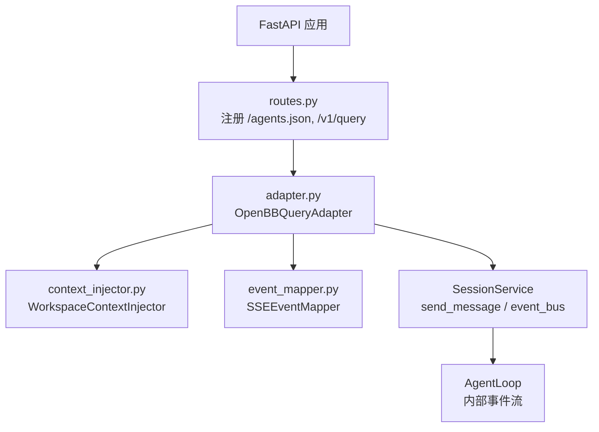
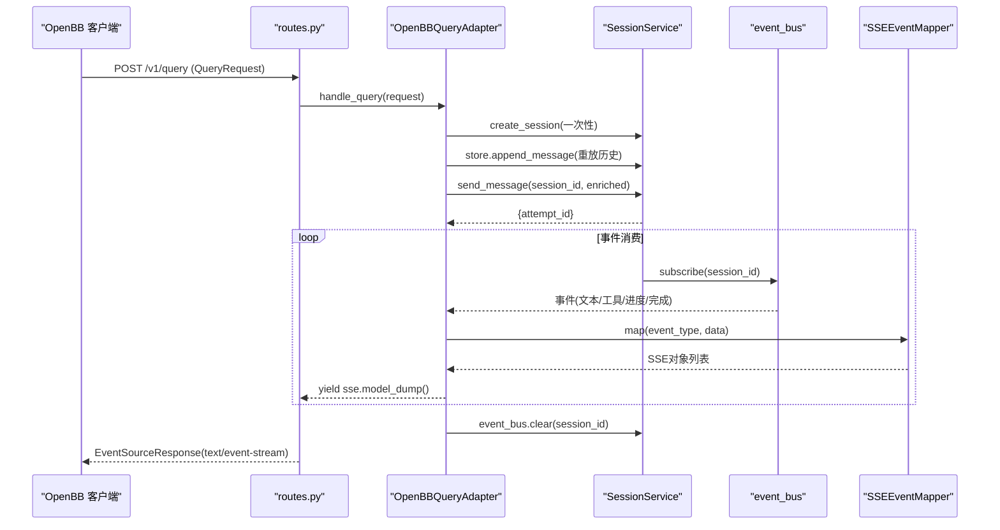
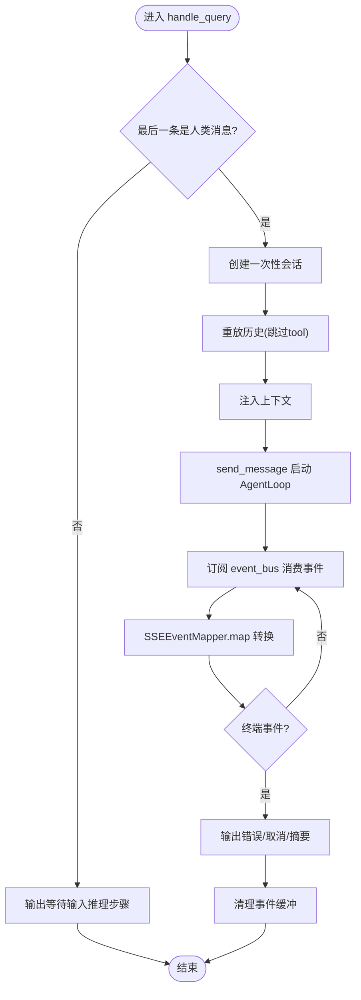
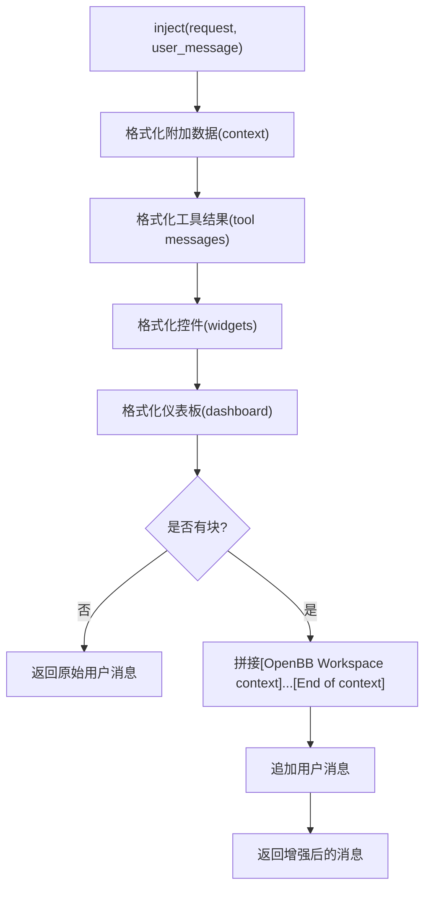
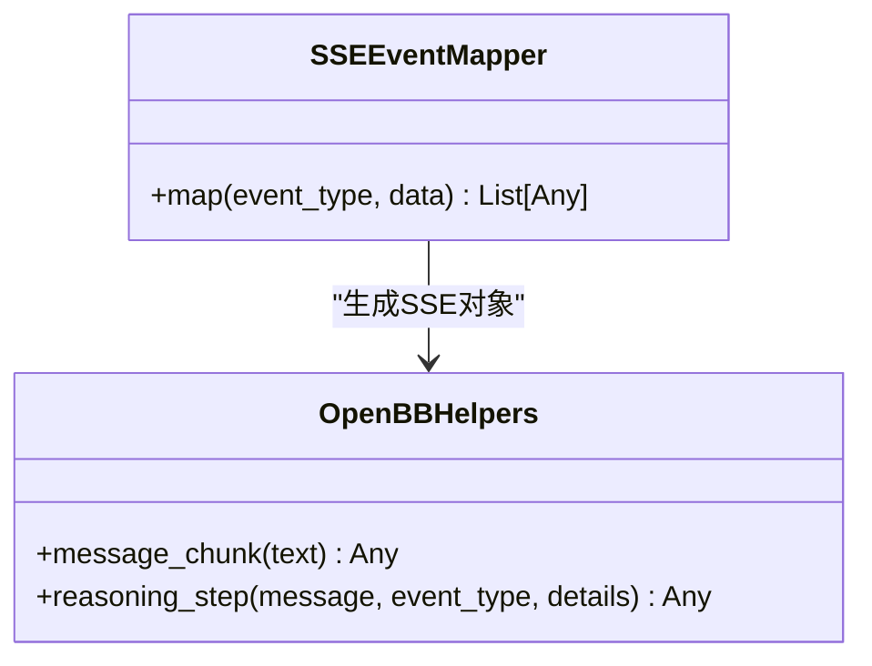
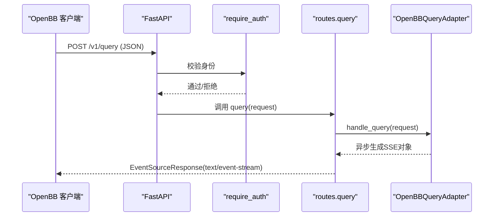
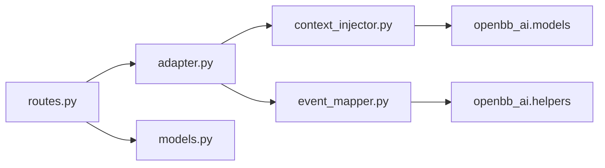
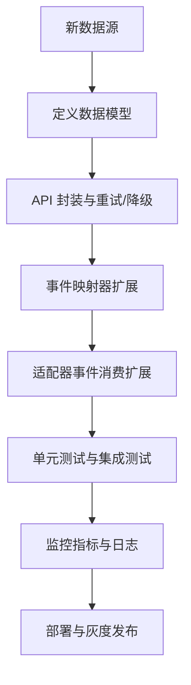

# OpenBB Bridge集成

<cite>
**本文档引用的文件**
- [agent/src/openbb_bridge/__init__.py](file://agent/src/openbb_bridge/__init__.py)
- [agent/src/openbb_bridge/adapter.py](file://agent/src/openbb_bridge/adapter.py)
- [agent/src/openbb_bridge/context_injector.py](file://agent/src/openbb_bridge/context_injector.py)
- [agent/src/openbb_bridge/event_mapper.py](file://agent/src/openbb_bridge/event_mapper.py)
- [agent/src/openbb_bridge/models.py](file://agent/src/openbb_bridge/models.py)
- [agent/src/openbb_bridge/routes.py](file://agent/src/openbb_bridge/routes.py)
- [agent/tests/test_openbb_bridge/test_adapter.py](file://agent/tests/test_openbb_bridge/test_adapter.py)
- [agent/tests/test_openbb_bridge/test_context_injector.py](file://agent/tests/test_openbb_bridge/test_context_injector.py)
- [agent/tests/test_openbb_bridge/test_event_mapper.py](file://agent/tests/test_openbb_bridge/test_event_mapper.py)
- [agent/tests/test_openbb_bridge/test_routes.py](file://agent/tests/test_openbb_bridge/test_routes.py)
</cite>

## 目录
1. [简介](#简介)
2. [项目结构](#项目结构)
3. [核心组件](#核心组件)
4. [架构总览](#架构总览)
5. [详细组件分析](#详细组件分析)
6. [依赖关系分析](#依赖关系分析)
7. [性能与缓存策略](#性能与缓存策略)
8. [监控指标与可观测性](#监控指标与可观测性)
9. [故障排查指南](#故障排查指南)
10. [结论](#结论)
11. [附录：扩展新数据源适配器](#附录：扩展新数据源适配器)

## 简介
本文件为 Vibe-Trading 的 OpenBB Workspace 桥接集成提供完整技术文档。该桥接以“适配器模式”将 OpenBB Workspace 的无状态查询协议映射到 Vibe-Trading 的会话驱动 AgentLoop，并通过事件映射器将内部细粒度事件转换为 OpenBB SSE 流。上下文注入器将工作区上下文（显式数据、工具结果、仪表板与控件元信息）压缩并注入用户消息，确保模型在调用自有数据工具时获得充分意图与约束。路由层暴露 /agents.json 发现端点与 /v1/query SSE 查询端点，完成认证、适配与流式响应。

## 项目结构
OpenBB Bridge 位于 agent/src/openbb_bridge 下，采用分层职责清晰的设计：
- __init__.py：可选安装入口，安全注册路由，失败不破坏主服务
- routes.py：FastAPI 路由，定义 /agents.json 与 /v1/query
- adapter.py：请求适配与生命周期管理（创建一次性会话、重放历史、消费事件）
- context_injector.py：上下文注入（数据预算控制、工具结果提取、控件与仪表板元信息）
- event_mapper.py：事件映射（Vibe-Trading 事件 -> OpenBB SSE 对象）
- models.py：Pydantic 模型（AgentManifest）

图表来源
- [agent/src/openbb_bridge/routes.py:82-162](file://agent/src/openbb_bridge/routes.py#L82-L162)
- [agent/src/openbb_bridge/adapter.py:57-126](file://agent/src/openbb_bridge/adapter.py#L57-L126)
- [agent/src/openbb_bridge/context_injector.py:78-127](file://agent/src/openbb_bridge/context_injector.py#L78-L127)
- [agent/src/openbb_bridge/event_mapper.py:47-144](file://agent/src/openbb_bridge/event_mapper.py#L47-L144)

章节来源
- [agent/src/openbb_bridge/__init__.py:27-58](file://agent/src/openbb_bridge/__init__.py#L27-L58)
- [agent/src/openbb_bridge/routes.py:1-162](file://agent/src/openbb_bridge/routes.py#L1-L162)

## 核心组件
- OpenBBQueryAdapter：封装一次 OpenBB 查询的生命周期，创建一次性会话、重放历史、注入上下文、发送消息、消费事件并终止处理。
- WorkspaceContextInjector：将 OpenBB 工作区上下文（上下文数据、工具结果、控件与仪表板元信息）压缩成自然语言前缀注入用户消息，严格控制字符预算。
- SSEEventMapper：将 Vibe-Trading 内部事件（text_delta、tool_call、tool_result、compact、stream_reset、goal.updated、mcp.warning、attempt.started 等）映射为 OpenBB SSE 对象；过滤静默事件与未知事件。
- FastAPI 路由：/agents.json 返回代理清单（名称、描述、端点、特性），/v1/query 接收 QueryRequest 并以 SSE 流式返回结果，具备认证与跨域保护。

章节来源
- [agent/src/openbb_bridge/adapter.py:57-126](file://agent/src/openbb_bridge/adapter.py#L57-L126)
- [agent/src/openbb_bridge/context_injector.py:78-127](file://agent/src/openbb_bridge/context_injector.py#L78-L127)
- [agent/src/openbb_bridge/event_mapper.py:47-144](file://agent/src/openbb_bridge/event_mapper.py#L47-L144)
- [agent/src/openbb_bridge/routes.py:82-162](file://agent/src/openbb_bridge/routes.py#L82-L162)

## 架构总览
OpenBB Workspace 是无状态的，每次 /v1/query 携带完整对话历史。Bridge 为每个请求创建一次性 Vibe-Trading 会话，重放历史（除 tool 消息外），注入上下文后通过 SessionService.send_message 触发 AgentLoop，并订阅 event_bus 将事件转为 SSE 流。终端事件（attempt.completed/failed/cancelled）触发收尾逻辑，清理事件缓冲。

图表来源
- [agent/src/openbb_bridge/routes.py:118-157](file://agent/src/openbb_bridge/routes.py#L118-L157)
- [agent/src/openbb_bridge/adapter.py:82-126](file://agent/src/openbb_bridge/adapter.py#L82-L126)
- [agent/src/openbb_bridge/adapter.py:130-166](file://agent/src/openbb_bridge/adapter.py#L130-L166)
- [agent/src/openbb_bridge/event_mapper.py:50-144](file://agent/src/openbb_bridge/event_mapper.py#L50-L144)

## 详细组件分析

### 适配器 OpenBBQueryAdapter
职责：
- 解析请求，提取最后一条人类消息，判断是否执行
- 创建一次性会话并重放历史（跳过 tool 角色消息）
- 注入上下文（由 WorkspaceContextInjector 完成）
- 调用 SessionService.send_message 启动 AgentLoop
- 订阅 event_bus，按终端事件结束流，清理缓冲

关键流程：
- handle_query：入口，构造 enriched 消息，发送并消费事件
- _consume_events：过滤心跳、非当前 attempt 的事件，映射并输出 SSE
- _finalize：根据终端事件输出错误/取消/摘要
- _create_ephemeral_session：生成带标题的一次性会话
- _replay_history：将历史写入 store，避免重复索引与二次尝试

图表来源
- [agent/src/openbb_bridge/adapter.py:82-126](file://agent/src/openbb_bridge/adapter.py#L82-L126)
- [agent/src/openbb_bridge/adapter.py:130-201](file://agent/src/openbb_bridge/adapter.py#L130-L201)
- [agent/src/openbb_bridge/adapter.py:205-264](file://agent/src/openbb_bridge/adapter.py#L205-L264)

章节来源
- [agent/src/openbb_bridge/adapter.py:57-317](file://agent/src/openbb_bridge/adapter.py#L57-L317)
- [agent/tests/test_openbb_bridge/test_adapter.py:83-214](file://agent/tests/test_openbb_bridge/test_adapter.py#L83-L214)

### 上下文注入器 WorkspaceContextInjector
职责：
- 将 OpenBB 工作区上下文（context 数据、tool 结果、widgets、dashboard）压缩为自然语言前缀
- 严格控制字符预算（MAX_DATA_CHARS=8000），对超长内容截断并标记
- 明确声明控件值未附带，引导模型使用自身数据工具获取

处理顺序：
1. 附加数据（context items）：优先注入真实数据，共享预算
2. 工具结果（tool 角色消息中的 data）：提取 content，共享预算
3. 控件元信息（widgets.primary/secondary/extra）：仅名称与参数，限制数量与长度
4. 仪表板信息（workspace_state.current_dashboard_info）：名称与活动标签

图表来源
- [agent/src/openbb_bridge/context_injector.py:78-127](file://agent/src/openbb_bridge/context_injector.py#L78-L127)
- [agent/src/openbb_bridge/context_injector.py:131-250](file://agent/src/openbb_bridge/context_injector.py#L131-L250)
- [agent/src/openbb_bridge/context_injector.py:259-345](file://agent/src/openbb_bridge/context_injector.py#L259-L345)

章节来源
- [agent/src/openbb_bridge/context_injector.py:1-345](file://agent/src/openbb_bridge/context_injector.py#L1-L345)
- [agent/tests/test_openbb_bridge/test_context_injector.py:86-218](file://agent/tests/test_openbb_bridge/test_context_injector.py#L86-L218)

### 事件映射器 SSEEventMapper
职责：
- 将 Vibe-Trading 事件映射为 OpenBB SSE 对象（message_chunk、reasoning_step）
- 过滤静默事件（reasoning_delta、thinking_done、tool_progress、tool_heartbeat、llm_usage、stream_start、message.received、attempt.created、session.created）
- 将 text_delta 转换为 message_chunk
- 将 tool_call/tool_result 转换为 reasoning_step，包含工具名、状态、耗时与预览
- 将 compact/stream_reset/goal.updated/mcp.warning/attempt.started 转换为相应推理步骤

图表来源
- [agent/src/openbb_bridge/event_mapper.py:47-144](file://agent/src/openbb_bridge/event_mapper.py#L47-L144)

章节来源
- [agent/src/openbb_bridge/event_mapper.py:1-144](file://agent/src/openbb_bridge/event_mapper.py#L1-L144)
- [agent/tests/test_openbb_bridge/test_event_mapper.py:12-58](file://agent/tests/test_openbb_bridge/test_event_mapper.py#L12-L58)

### REST API 设计（OpenBB 路由）
端点：
- GET /agents.json：返回代理清单（name、description、image、endpoints.query、features）
- POST /v1/query：接收 QueryRequest，返回 SSE 流（text/event-stream）

认证与安全：
- /v1/query 使用 require_auth 依赖，支持本地回环免密与远程需 Bearer Token
- 拒绝跨站浏览器 POST（Origin 与 Sec-Fetch-Site 检查）
- /agents.json 为公开发现端点，不含敏感信息

请求验证：
- 使用 openbb_ai.models.QueryRequest 进行结构化校验
- 适配器内部对空消息、非人类最后消息进行防御性处理

响应格式化：
- 通过 EventSourceResponse 以 SSE 流式返回
- 异常路径输出 reasoning_step 与 message_chunk 的错误提示

图表来源
- [agent/src/openbb_bridge/routes.py:105-157](file://agent/src/openbb_bridge/routes.py#L105-L157)
- [agent/tests/test_openbb_bridge/test_routes.py:55-162](file://agent/tests/test_openbb_bridge/test_routes.py#L55-L162)

章节来源
- [agent/src/openbb_bridge/routes.py:1-162](file://agent/src/openbb_bridge/routes.py#L1-L162)
- [agent/tests/test_openbb_bridge/test_routes.py:1-162](file://agent/tests/test_openbb_bridge/test_routes.py#L1-L162)

## 依赖关系分析
- routes.py 依赖 adapter.py、models.py，并通过 sys.modules 获取 host 的 require_auth
- adapter.py 依赖 context_injector.py、event_mapper.py，以及 SessionService（外部模块）
- context_injector.py 依赖 openbb_ai.models（Widget、DataContent、RawContext、DashboardInfo 等）
- event_mapper.py 依赖 openbb_ai.helpers（message_chunk、reasoning_step）
- 测试覆盖各组件行为与边界条件

图表来源
- [agent/src/openbb_bridge/routes.py:30-34](file://agent/src/openbb_bridge/routes.py#L30-L34)
- [agent/src/openbb_bridge/adapter.py:35-39](file://agent/src/openbb_bridge/adapter.py#L35-L39)
- [agent/src/openbb_bridge/context_injector.py:24-29](file://agent/src/openbb_bridge/context_injector.py#L24-L29)
- [agent/src/openbb_bridge/event_mapper.py:15-22](file://agent/src/openbb_bridge/event_mapper.py#L15-L22)

章节来源
- [agent/src/openbb_bridge/routes.py:1-162](file://agent/src/openbb_bridge/routes.py#L1-L162)
- [agent/src/openbb_bridge/adapter.py:1-317](file://agent/src/openbb_bridge/adapter.py#L1-L317)
- [agent/src/openbb_bridge/context_injector.py:1-345](file://agent/src/openbb_bridge/context_injector.py#L1-L345)
- [agent/src/openbb_bridge/event_mapper.py:1-144](file://agent/src/openbb_bridge/event_mapper.py#L1-L144)

## 性能与缓存策略
- 一次性会话：每个 /v1/query 请求创建独立会话，避免跨会话历史泄漏与内存累积；结束后清理事件缓冲
- 适配器缓存：按 session_service 实例 ID 缓存 OpenBBQueryAdapter，减少重复绑定开销
- 上下文预算：严格限制附加数据与工具结果的字符数，防止首调 LLM 调用过大
- 事件过滤：静默事件被丢弃，降低 SSE 噪声与带宽消耗
- 建议优化：
  - 在高并发场景下，评估 SessionService 与 event_bus 的背压与队列容量
  - 对大上下文数据考虑分页或摘要策略，进一步降低首调成本
  - 对工具结果 preview 字段做更严格的裁剪，避免过长传输

章节来源
- [agent/src/openbb_bridge/adapter.py:117-126](file://agent/src/openbb_bridge/adapter.py#L117-L126)
- [agent/src/openbb_bridge/routes.py:65-79](file://agent/src/openbb_bridge/routes.py#L65-L79)
- [agent/src/openbb_bridge/context_injector.py:31-41](file://agent/src/openbb_bridge/context_injector.py#L31-L41)
- [agent/src/openbb_bridge/event_mapper.py:24-39](file://agent/src/openbb_bridge/event_mapper.py#L24-L39)

## 监控指标与可观测性
- 日志记录：
  - openbb_bridge 日志用于导入失败、路由注册、事件映射异常、上下文注入异常等
  - 适配器在发送失败、历史重放失败、事件消费异常时记录警告/错误
- 可观测性建议：
  - 增加请求级追踪（request_id）以便关联 SSE 流
  - 统计事件类型分布（text_delta、tool_call、tool_result、terminal events）
  - 记录上下文注入大小与截断次数，评估预算阈值
  - 监控 /v1/query 的延迟分位与错误率

章节来源
- [agent/src/openbb_bridge/__init__.py:38-56](file://agent/src/openbb_bridge/__init__.py#L38-L56)
- [agent/src/openbb_bridge/adapter.py:105-114](file://agent/src/openbb_bridge/adapter.py#L105-L114)
- [agent/src/openbb_bridge/adapter.py:252-264](file://agent/src/openbb_bridge/adapter.py#L252-L264)
- [agent/src/openbb_bridge/event_mapper.py:138-143](file://agent/src/openbb_bridge/event_mapper.py#L138-L143)
- [agent/src/openbb_bridge/context_injector.py:124-126](file://agent/src/openbb_bridge/context_injector.py#L124-L126)

## 故障排查指南
常见问题与定位：
- 路由未注册：检查 try_register_openbb_routes 的导入与异常捕获日志
- 运行时不可用：/v1/query 返回“Vibe-Trading session runtime is not enabled”，需启用 ENABLE_SESSION_RUNTIME
- 认证失败：远程请求需设置 API_AUTH_KEY 并提供正确 Bearer Token；跨站 POST 会被拒绝
- 事件流中断：检查终端事件（attempt.failed/cancelled）与错误消息；确认 event_bus 已清理
- 上下文过大：检查 DATA_TRUNCATION_MARKER 出现位置，调整预算或精简数据

章节来源
- [agent/src/openbb_bridge/__init__.py:38-56](file://agent/src/openbb_bridge/__init__.py#L38-L56)
- [agent/src/openbb_bridge/routes.py:123-140](file://agent/src/openbb_bridge/routes.py#L123-L140)
- [agent/tests/test_openbb_bridge/test_routes.py:89-152](file://agent/tests/test_openbb_bridge/test_routes.py#L89-L152)
- [agent/src/openbb_bridge/adapter.py:168-201](file://agent/src/openbb_bridge/adapter.py#L168-L201)

## 结论
OpenBB Bridge 通过适配器模式将 OpenBB 的无状态查询无缝接入 Vibe-Trading 的会话驱动 AgentLoop，借助上下文注入器与事件映射器实现高保真、低噪声的实时数据流。路由层提供安全的发现与查询接口，配合一次性会话与预算控制保障稳定性与性能。整体设计解耦、可扩展，便于新增数据源适配器与功能扩展。

## 附录：扩展新数据源适配器
目标：在不侵入 Vibe-Trading 核心组件的前提下，新增一个数据源适配器，使其可通过 OpenBB Bridge 暴露给 Workspace。

步骤与要点：
1. 数据模型定义
   - 定义统一的数据结构（如市场数据、新闻事件、财务数据），与现有 models.py 风格一致
   - 若需要新的上下文项，可在 context_injector.py 中扩展渲染逻辑，保持预算控制

2. API 封装
   - 在 adapter.py 中扩展事件消费逻辑，将新数据源的响应映射为 SSE 对象
   - 在 event_mapper.py 中新增事件类型映射（例如 market_data_update、news_alert、financial_report）

3. 错误处理
   - 对网络超时、数据缺失、格式异常进行统一捕获与降级
   - 通过 reasoning_step 输出 WARNING/ERROR，保证前端可见

4. 测试覆盖
   - 编写单元测试验证事件映射、上下文注入、适配器行为
   - 编写集成测试验证 /v1/query 端到端流式响应

5. 性能与缓存
   - 对高频数据（如 tick 数据）考虑本地缓存与去抖
   - 对大体积数据（如财报 PDF）进行摘要与分页加载

6. 监控与指标
   - 记录新事件类型的计数、延迟、错误率
   - 跟踪上下文注入大小与截断情况

[本节为概念性指导，不直接分析具体代码文件]