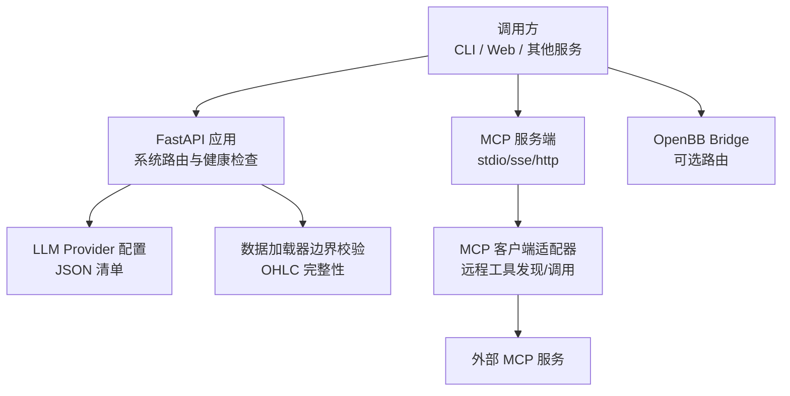
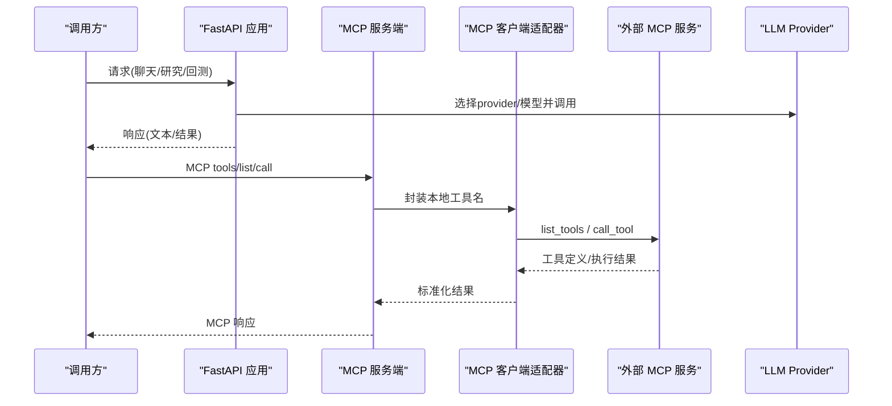
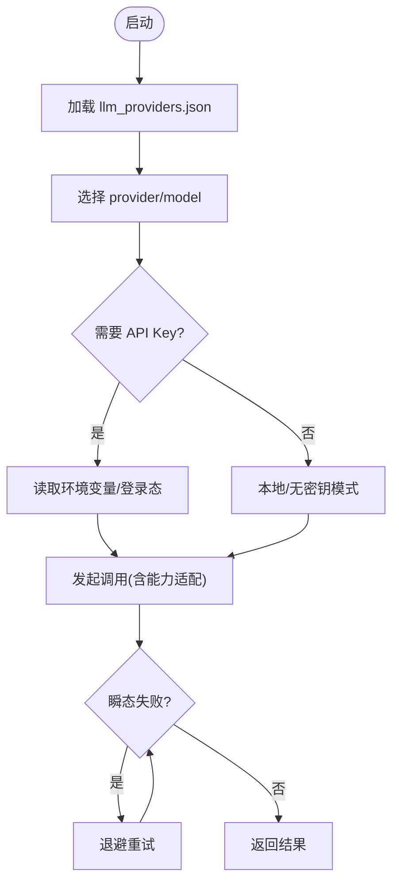
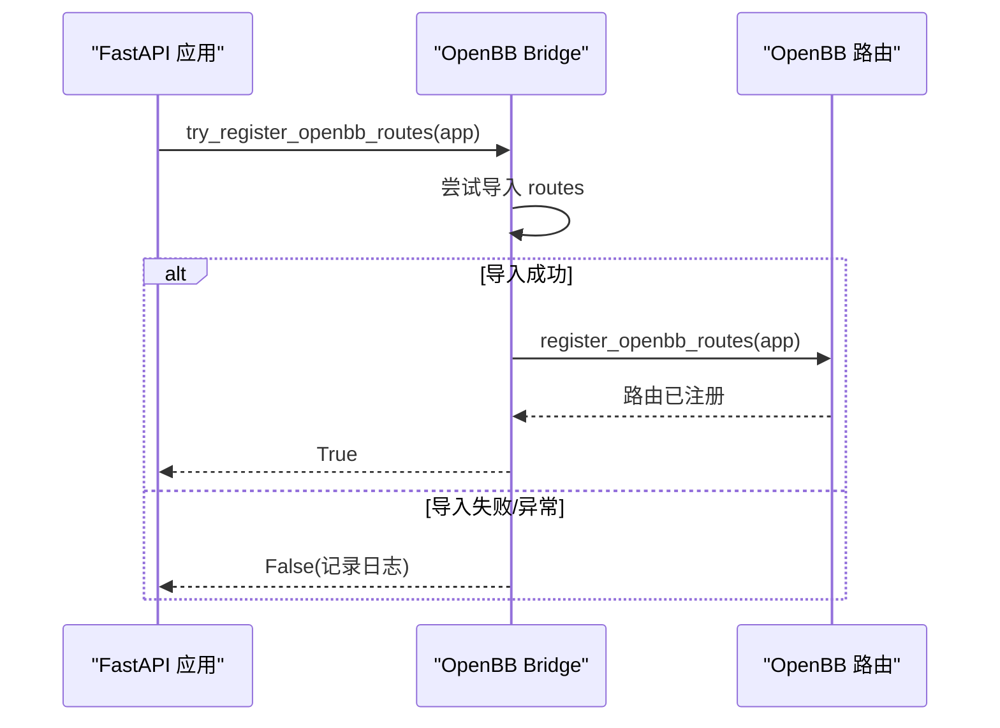
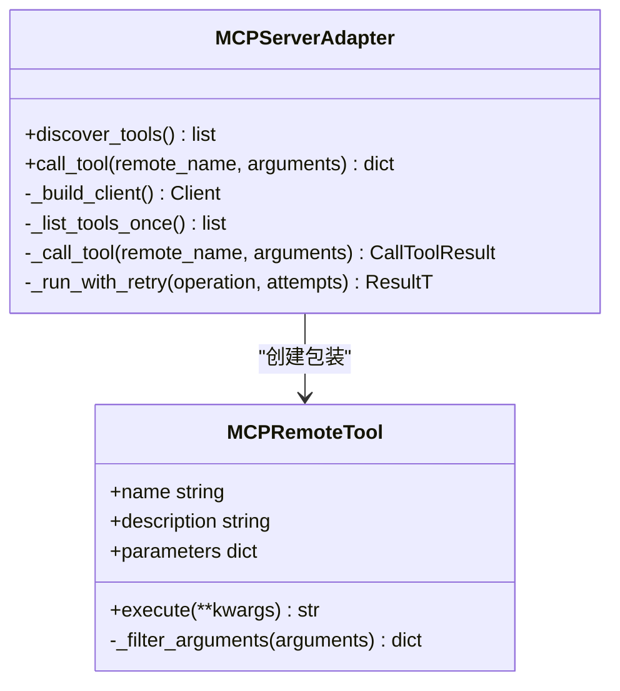
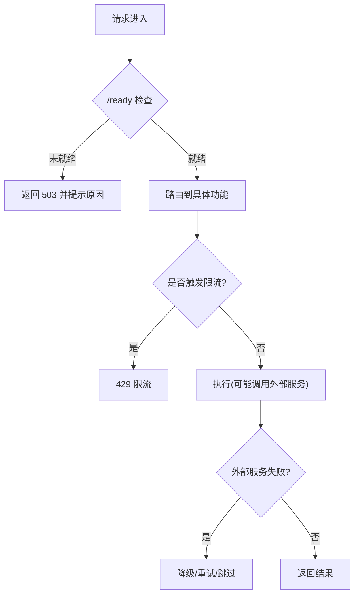
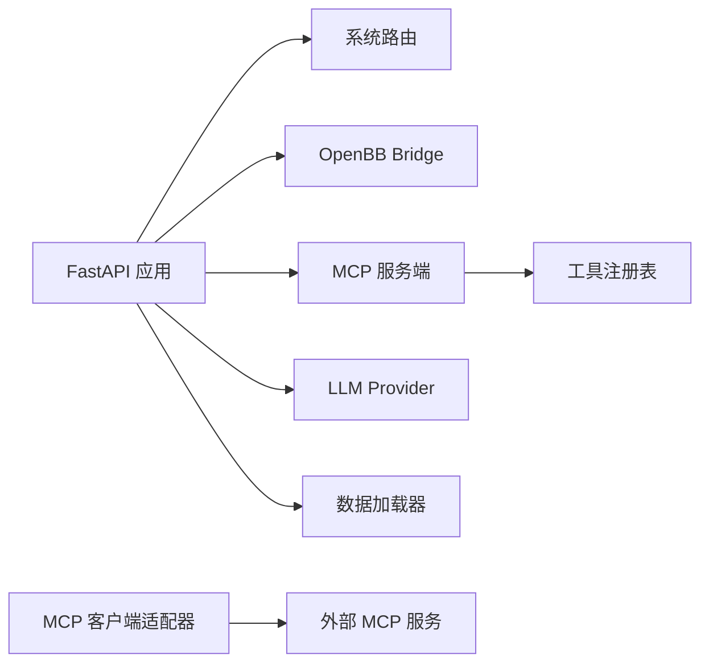

# 外部服务集成

<cite>
**本文引用的文件**
- [mcp_server.py](file://agent/mcp_server.py)
- [mcp.py](file://agent/src/tools/mcp.py)
- [__init__.py](file://agent/src/openbb_bridge/__init__.py)
- [routes.py](file://agent/src/openbb_bridge/routes.py)
- [llm_providers.json](file://agent/src/providers/llm_providers.json)
- [system_routes.py](file://agent/src/api/system_routes.py)
- [base.py](file://agent/backtest/loaders/base.py)
</cite>

## 目录
1. [简介](#简介)
2. [项目结构](#项目结构)
3. [核心组件](#核心组件)
4. [架构总览](#架构总览)
5. [详细组件分析](#详细组件分析)
6. [依赖关系分析](#依赖关系分析)
7. [性能考虑](#性能考虑)
8. [故障排查指南](#故障排查指南)
9. [结论](#结论)
10. [附录](#附录)

## 简介
本架构文档面向 Vibe-Trading 的外部服务集成，重点说明：
- 外部服务发现机制、能力检测与动态加载策略
- LLM 提供商集成（多供应商、能力层、凭据与环境）
- OpenBB Bridge 集成（可选安装、路由挂载、失败不阻断）
- MCP 协议支持（stdio/SSE/Streamable HTTP、工具发现、安全网关）
- 服务健康检查、负载均衡与熔断降级
- 服务注册与发现、API 网关与服务编排方案
- 微服务治理、监控告警与日志收集策略
- 外部服务集成的安全与性能优化建议

## 项目结构
Vibe-Trading 在“外部服务集成”相关的关键位置如下：
- MCP 服务端：提供 stdio/SSE/HTTP 传输，暴露研究工具，内置 Host/Origin 守卫与限流
- MCP 客户端适配器：为外部 MCP 服务器生成本地工具包装，支持发现缓存、重试与 OAuth 持久化
- OpenBB Bridge：可选集成，按需挂载路由，失败时不影响主 API
- LLM Provider 配置：集中式 JSON 描述各供应商默认模型、基地址、环境变量与鉴权方式
- 系统路由：健康检查、就绪探针、速率限制、关闭端点等

图表来源
- [system_routes.py:211-241](file://agent/src/api/system_routes.py#L211-L241)
- [mcp_server.py:69-316](file://agent/mcp_server.py#L69-L316)
- [mcp.py:143-206](file://agent/src/tools/mcp.py#L143-L206)
- [__init__.py:27-57](file://agent/src/openbb_bridge/__init__.py#L27-L57)
- [base.py:50-73](file://agent/backtest/loaders/base.py#L50-L73)

章节来源
- [system_routes.py:211-241](file://agent/src/api/system_routes.py#L211-L241)
- [mcp_server.py:69-316](file://agent/mcp_server.py#L69-L316)
- [mcp.py:143-206](file://agent/src/tools/mcp.py#L143-L206)
- [__init__.py:27-57](file://agent/src/openbb_bridge/__init__.py#L27-L57)
- [base.py:50-73](file://agent/backtest/loaders/base.py#L50-L73)

## 核心组件
- LLM 提供商集成
  - 通过集中式 JSON 声明每个 provider 的默认模型、基地址、环境变量与是否必需 API Key
  - 运行时根据配置选择 provider/model，并注入凭据与环境变量
  - 对特殊 provider 的能力差异进行适配（如 reasoning、thought signature、User-Agent 等）
- OpenBB Bridge
  - 可选安装；启动时尝试挂载路由，若缺失或异常则记录日志并返回禁用状态，确保主 API 不受影响
- MCP 协议支持
  - 服务端：支持 stdio、SSE、Streamable HTTP；网络传输附带 Host/Origin 守卫，防止 DNS 重绑定攻击
  - 客户端：动态发现远端工具，生成稳定本地命名，支持重试、超时、OAuth 令牌持久化
- 健康检查与可用性
  - /live 进程存活；/ready 检查 LLM provider 配置与凭据是否可用；/correlation 等计算接口带滑动窗口限流
- 数据质量与安全
  - 数据加载器边界统一校验 OHLC 完整性，丢弃结构性脏数据，避免回测指标失真

章节来源
- [llm_providers.json:1-216](file://agent/src/providers/llm_providers.json#L1-L216)
- [__init__.py:27-57](file://agent/src/openbb_bridge/__init__.py#L27-L57)
- [mcp_server.py:131-316](file://agent/mcp_server.py#L131-L316)
- [mcp.py:370-635](file://agent/src/tools/mcp.py#L370-L635)
- [system_routes.py:211-329](file://agent/src/api/system_routes.py#L211-L329)
- [base.py:50-73](file://agent/backtest/loaders/base.py#L50-L73)

## 架构总览
下图展示外部服务集成在 Vibe-Trading 中的整体交互：调用方通过 FastAPI 或 MCP 访问内部能力；LLM Provider 由配置驱动；OpenBB Bridge 按需挂载；MCP 客户端适配器负责与外部 MCP 服务通信。

图表来源
- [mcp_server.py:69-316](file://agent/mcp_server.py#L69-L316)
- [mcp.py:143-206](file://agent/src/tools/mcp.py#L143-L206)
- [llm_providers.json:1-216](file://agent/src/providers/llm_providers.json#L1-L216)

## 详细组件分析

### LLM 提供商集成
- 配置驱动：集中式 JSON 声明各 provider 的默认模型、基地址、环境变量与鉴权类型
- 动态选择：运行时读取配置，解析凭据与环境，必要时进行能力适配（如 reasoning、thought signature、User-Agent）
- 可靠性：对特定 provider 的协议差异进行隔离处理，避免全局 shim 污染；流式失败具备上下文错误与自动重试

图表来源
- [llm_providers.json:1-216](file://agent/src/providers/llm_providers.json#L1-L216)

章节来源
- [llm_providers.json:1-216](file://agent/src/providers/llm_providers.json#L1-L216)

### OpenBB Bridge 集成
- 可选安装：仅在安装了可选 extra 时尝试导入并挂载路由
- 失败不阻断：导入失败或注册异常会记录日志并返回 False，保证主 API 继续运行
- 路由挂载：成功后注册 /agents.json 与 /v1/query 等端点，将 AgentLoop 暴露为 OpenBB Workspace 自定义 agent

图表来源
- [__init__.py:27-57](file://agent/src/openbb_bridge/__init__.py#L27-L57)
- [routes.py:1-200](file://agent/src/openbb_bridge/routes.py#L1-L200)

章节来源
- [__init__.py:27-57](file://agent/src/openbb_bridge/__init__.py#L27-L57)
- [routes.py:1-200](file://agent/src/openbb_bridge/routes.py#L1-L200)

### MCP 协议支持（服务端与客户端）
- 服务端
  - 传输：stdio、SSE、Streamable HTTP；网络传输启用 Host/Origin 守卫，默认仅允许环回主机
  - 工具注册：懒加载技能与工具注册表，支持 shell 工具显式启用开关
  - 会话与审计：为研究目标与证据追加提供标准工具，支持审计行与生命周期更新
- 客户端
  - 工具发现：list_tools 支持短暂失败重试，结果缓存于内存，避免重复探测
  - 名称稳定：远程工具映射为稳定的本地名称，冲突时自动去重
  - 调用封装：参数过滤、超时控制、OAuth 令牌持久化存储、结果标准化

图表来源
- [mcp.py:370-635](file://agent/src/tools/mcp.py#L370-L635)
- [mcp.py:629-694](file://agent/src/tools/mcp.py#L629-L694)

章节来源
- [mcp_server.py:69-316](file://agent/mcp_server.py#L69-L316)
- [mcp.py:143-206](file://agent/src/tools/mcp.py#L143-L206)
- [mcp.py:370-635](file://agent/src/tools/mcp.py#L370-L635)
- [mcp.py:629-694](file://agent/src/tools/mcp.py#L629-L694)

### 服务健康检查、负载均衡与熔断降级
- 健康检查
  - /live：进程存活即可
  - /ready：检查 LLM provider 配置与凭据是否可用，未就绪返回 503
- 负载均衡
  - 当前实现为单进程内联速率限制（滑动窗口），适用于单机部署；生产环境建议在网关层做横向扩展与连接池复用
- 熔断降级
  - OpenBB Bridge 失败不阻断主 API
  - MCP 客户端对 list_tools 支持短暂失败重试；工具调用设置超时，避免长时间阻塞
  - 数据加载器边界校验 OHLC 完整性，丢弃结构性脏数据，保障回测稳定性

图表来源
- [system_routes.py:211-329](file://agent/src/api/system_routes.py#L211-L329)
- [mcp.py:537-627](file://agent/src/tools/mcp.py#L537-L627)
- [base.py:50-73](file://agent/backtest/loaders/base.py#L50-L73)

章节来源
- [system_routes.py:211-329](file://agent/src/api/system_routes.py#L211-L329)
- [mcp.py:537-627](file://agent/src/tools/mcp.py#L537-L627)
- [base.py:50-73](file://agent/backtest/loaders/base.py#L50-L73)

### 服务注册与发现、API 网关与服务编排
- 服务注册与发现
  - MCP 服务端通过 FastMCP 暴露工具列表；客户端通过 list_tools 动态发现能力
  - OpenBB Bridge 按需注册路由，失败可观测且不影响主服务
- API 网关
  - 建议在前置网关层实现：鉴权、限流、TLS 终止、Host/Origin 校验、请求/响应日志
  - 本项目在网络传输层已内置 Host/Origin 守卫，适合本地/受控环境使用
- 服务编排
  - 通过 MCP 工具组合研究流程（例如：数据获取 → 因子分析 → 回测 → 报告）
  - 结合研究目标（Goal）与证据追加，形成可审计的工作流

章节来源
- [mcp_server.py:69-316](file://agent/mcp_server.py#L69-L316)
- [mcp.py:143-206](file://agent/src/tools/mcp.py#L143-L206)
- [__init__.py:27-57](file://agent/src/openbb_bridge/__init__.py#L27-L57)

### 微服务治理、监控告警与日志收集
- 治理
  - 工具级超时、重试与失败分类（瞬态/非瞬态）
  - 数据质量门控（OHLC 完整性校验）
- 监控告警
  - 健康检查端点供编排平台探测
  - 建议接入指标采集（QPS、延迟、错误率、限流命中）与告警规则（持续 503、高错误率）
- 日志收集
  - 关键路径记录结构化日志（导入失败、注册失败、限流、重试）
  - 建议集中化日志（ELK/Loki）与链路追踪（TraceID 贯穿请求）

[本节为通用指导，不直接分析具体文件]

### 外部服务集成的安全考虑
- 网络安全
  - MCP 网络传输启用 Host/Origin 守卫，默认仅允许环回主机，防止 DNS 重绑定
  - 建议在生产网关层增加 CORS 白名单、IP 白名单与 WAF
- 身份与授权
  - LLM Provider 凭据通过环境变量管理；OAuth 模式有独立登录流程
  - 敏感接口建议统一鉴权（Bearer Token），并在网关层强制
- 数据安全
  - 数据加载器边界校验结构性脏数据，避免下游污染
  - 工具输出脱敏与严格 JSON 序列化，避免泄露敏感信息

章节来源
- [mcp_server.py:131-316](file://agent/mcp_server.py#L131-L316)
- [base.py:50-73](file://agent/backtest/loaders/base.py#L50-L73)

### 性能优化建议
- 连接与超时
  - MCP 客户端 init_timeout 与 tool_timeout 分离，冷启动与调用超时互不干扰
  - 合理设置超时与重试次数，避免雪崩
- 缓存
  - MCP 工具发现结果缓存，减少重复探测
  - 数据缓存（可选）用于历史行情拉取，降低网络与限流压力
- 并发与限流
  - 计算密集型接口（如相关性矩阵）采用滑动窗口限流
  - 网关层做横向扩展与连接池复用
- 数据质量
  - 前置校验 OHLC 完整性，减少无效计算与错误传播

章节来源
- [mcp.py:521-535](file://agent/src/tools/mcp.py#L521-L535)
- [system_routes.py:62-98](file://agent/src/api/system_routes.py#L62-L98)
- [base.py:50-73](file://agent/backtest/loaders/base.py#L50-L73)

## 依赖关系分析
- 组件耦合
  - FastAPI 应用依赖系统路由提供健康检查与限流
  - MCP 服务端依赖 FastMCP 暴露工具，依赖工具注册表懒加载
  - MCP 客户端适配器依赖 FastMCP 客户端，支持多种传输与 OAuth
  - OpenBB Bridge 可选依赖 openbb SDK，失败不影响主服务
- 外部依赖
  - LLM Provider 通过 JSON 配置，运行时解析凭据与环境
  - 数据加载器统一校验 OHLC 完整性，作为数据质量门控

图表来源
- [system_routes.py:166-241](file://agent/src/api/system_routes.py#L166-L241)
- [mcp_server.py:69-316](file://agent/mcp_server.py#L69-L316)
- [mcp.py:143-206](file://agent/src/tools/mcp.py#L143-L206)
- [llm_providers.json:1-216](file://agent/src/providers/llm_providers.json#L1-L216)
- [base.py:50-73](file://agent/backtest/loaders/base.py#L50-L73)

章节来源
- [system_routes.py:166-241](file://agent/src/api/system_routes.py#L166-L241)
- [mcp_server.py:69-316](file://agent/mcp_server.py#L69-L316)
- [mcp.py:143-206](file://agent/src/tools/mcp.py#L143-L206)
- [llm_providers.json:1-216](file://agent/src/providers/llm_providers.json#L1-L216)
- [base.py:50-73](file://agent/backtest/loaders/base.py#L50-L73)

## 性能考虑
- 冷启动与初始化
  - MCP 客户端 init_timeout 应大于 tool_timeout，避免冷启动误判
- 重试与退避
  - 仅对瞬态错误重试，避免幂等性风险（工具调用不自动重试）
- 缓存与批处理
  - 工具发现结果缓存；批量数据拉取优先走缓存
- 限流与背压
  - 计算接口使用滑动窗口限流；网关层做全局限流与队列

[本节为通用指导，不直接分析具体文件]

## 故障排查指南
- 常见问题
  - OpenBB Bridge 未生效：检查可选依赖是否安装，查看日志中“bridge disabled”或“failed to import”
  - MCP 工具不可用：确认 list_tools 是否成功，检查 enabledTools 白名单与名称冲突
  - 健康检查失败：/ready 返回 503 时检查 provider/model/凭据配置
  - 数据异常：检查 OHLC 完整性校验是否丢弃了脏数据
- 定位步骤
  - 查看系统路由健康检查与限流命中情况
  - 检查 MCP 客户端适配器日志（重试、超时、认证失败）
  - 核对 LLM Provider 配置与环境变量
  - 验证数据加载器边界校验结果

章节来源
- [__init__.py:27-57](file://agent/src/openbb_bridge/__init__.py#L27-L57)
- [mcp.py:537-627](file://agent/src/tools/mcp.py#L537-L627)
- [system_routes.py:211-329](file://agent/src/api/system_routes.py#L211-L329)
- [base.py:50-73](file://agent/backtest/loaders/base.py#L50-L73)

## 结论
Vibe-Trading 的外部服务集成以“配置驱动 + 动态发现 + 安全网关 + 质量门控”为核心：
- LLM Provider 通过集中配置与能力适配实现多供应商接入
- OpenBB Bridge 以可选方式增强生态兼容，失败不阻断
- MCP 提供标准化的工具发现与调用，内置安全与可靠性机制
- 健康检查与限流保障服务可用性，数据质量门控提升回测稳健性
- 生产环境建议在前置网关层完善鉴权、限流、监控与日志，以实现完整的微服务治理

[本节为总结，不直接分析具体文件]

## 附录
- 术语
  - MCP：Model Context Protocol，模型上下文协议
  - SSE：Server-Sent Events，服务器推送事件
  - Streamable HTTP：可流式 HTTP 传输
  - OHLC：开盘价、最高价、最低价、收盘价
- 参考
  - 健康检查端点：/live、/health、/ready
  - 计算接口限流：/correlation、/correlation/regime
  - MCP 传输：stdio、SSE、Streamable HTTP

[本节为补充信息，不直接分析具体文件]