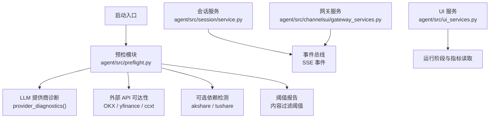
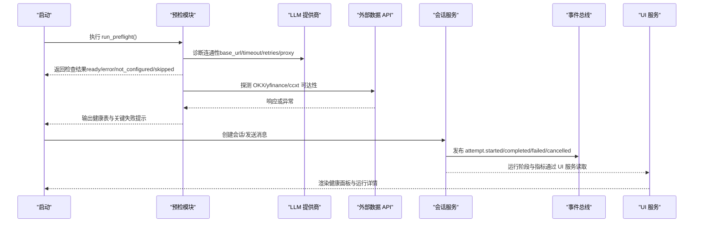
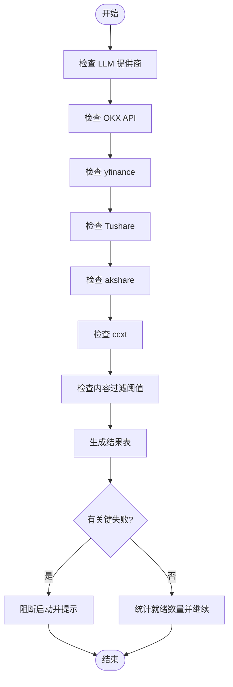
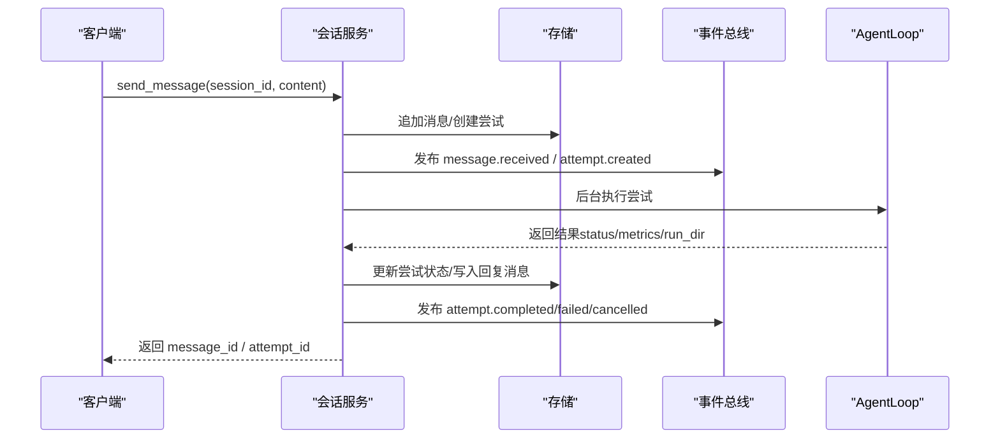
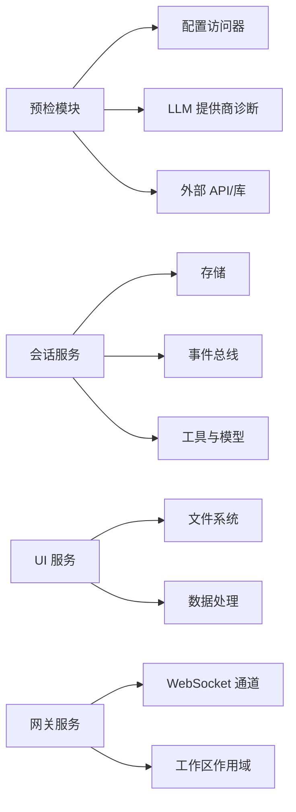

# 服务发现与健康检查

<cite>
**本文引用的文件**
- [agent/src/preflight.py](file://agent/src/preflight.py)
- [agent/tests/test_preflight.py](file://agent/tests/test_preflight.py)
- [agent/src/channelsui/gateway_services.py](file://agent/src/channelsui/gateway_services.py)
- [agent/src/ui_services.py](file://agent/src/ui_services.py)
- [agent/src/session/service.py](file://agent/src/session/service.py)
- [agent/src/config/env_schema.py](file://agent/src/config/env_schema.py)
</cite>

## 目录
1. [简介](#简介)
2. [项目结构](#项目结构)
3. [核心组件](#核心组件)
4. [架构总览](#架构总览)
5. [详细组件分析](#详细组件分析)
6. [依赖关系分析](#依赖关系分析)
7. [性能考量](#性能考量)
8. [故障排查指南](#故障排查指南)
9. [结论](#结论)
10. [附录](#附录)

## 简介
本文件聚焦 Vibe-Trading 的“服务发现与健康检查”机制，围绕启动前预检（preflight）、运行时健康探测、状态管理与告警阈值展开。内容涵盖：
- 动态服务扫描与依赖关系管理：通过预检模块对 LLM 提供商、数据源与外部 API 进行连通性检测与可用性判定。
- 版本兼容性提示：基于配置与环境变量推断运行能力与限制。
- 健康检查实现：主动探测（HTTP/网络可达性）、被动监控（事件总线与任务生命周期）、阈值告警（内容过滤阈值等）。
- 预检机制（preflight）：数据库连接、外部 API 可达性与资源配额检查的扩展方式。
- 服务状态管理：状态持久化、变更通知与恢复策略。
- 新增检查项：如何添加新的服务检查逻辑、配置告警规则与仪表板集成。
- 高可用实践：故障转移、负载均衡与服务编排建议。

## 项目结构
Vibe-Trading 将“启动前健康检查”集中在 preflight 模块，结合会话服务的事件总线与 UI 服务的数据聚合，形成从启动到运行时的健康观测闭环。

图表来源
- [agent/src/preflight.py:265-318](file://agent/src/preflight.py#L265-L318)
- [agent/src/session/service.py:158-246](file://agent/src/session/service.py#L158-L246)
- [agent/src/ui_services.py:192-219](file://agent/src/ui_services.py#L192-L219)
- [agent/src/channelsui/gateway_services.py:254-293](file://agent/src/channelsui/gateway_services.py#L254-L293)

章节来源
- [agent/src/preflight.py:1-318](file://agent/src/preflight.py#L1-L318)
- [agent/src/session/service.py:1-605](file://agent/src/session/service.py#L1-L605)
- [agent/src/ui_services.py:1-640](file://agent/src/ui_services.py#L1-L640)
- [agent/src/channelsui/gateway_services.py:1-302](file://agent/src/channelsui/gateway_services.py#L1-L302)

## 核心组件
- 预检模块（Preflight）
  - 负责在启动时执行一系列健康检查，包括 LLM 提供商连通性、外部数据源可达性、可选依赖安装情况以及内容过滤阈值报告。
  - 关键数据结构 CheckResult 用于统一表达检查结果（名称、状态、消息、影响范围、是否关键）。
  - 入口 run_preflight 汇总并输出结果表，同时根据关键检查失败决定是否阻断启动。
- 会话服务（SessionService）
  - 负责会话生命周期、尝试（attempt）调度与执行，并通过事件总线发布状态变更事件。
  - 提供取消当前运行的能力，确保长时间构建注册表或执行中的任务可被中断。
- UI 服务（UI Services）
  - 提供运行阶段推断、日志收集、指标读取与价格序列重建等能力，便于前端展示系统健康与运行状态。
- 网关服务（GatewayServices）
  - 为 WebSocket 通道提供工作区作用域、媒体处理、转录桥接等服务，支持会话上下文与权限控制。

章节来源
- [agent/src/preflight.py:21-318](file://agent/src/preflight.py#L21-L318)
- [agent/src/session/service.py:53-246](file://agent/src/session/service.py#L53-L246)
- [agent/src/ui_services.py:192-219](file://agent/src/ui_services.py#L192-L219)
- [agent/src/channelsui/gateway_services.py:74-133](file://agent/src/channelsui/gateway_services.py#L74-L133)

## 架构总览
下图展示了从启动预检到运行时健康监控的整体流程：预检模块在启动阶段探测各依赖；会话服务在执行过程中通过事件总线广播状态；UI 服务读取运行产物以呈现健康视图；网关服务为前端提供会话与工作区上下文。

图表来源
- [agent/src/preflight.py:32-134](file://agent/src/preflight.py#L32-L134)
- [agent/src/preflight.py:137-252](file://agent/src/preflight.py#L137-L252)
- [agent/src/session/service.py:158-246](file://agent/src/session/service.py#L158-L246)
- [agent/src/ui_services.py:192-219](file://agent/src/ui_services.py#L192-L219)

## 详细组件分析

### 预检模块（Preflight）
- 功能要点
  - LLM 提供商检查：读取环境变量与诊断信息，验证 base URL、超时、重试与代理设置；针对 OpenAI Codex 走 OAuth 登录状态校验。
  - 外部 API 检查：OKX 公开 API 调用测试；yfinance 包存在性与基本可用性；ccxt 与 akshare 的安装检测。
  - 内容过滤阈值：读取配置阈值并在预检表中显示。
  - 关键失败阻断：若关键检查未通过，启动将被阻止并给出明确提示。
- 数据结构
  - CheckResult：包含 name、status、message、impact、critical 字段，用于标准化检查结果。
- 执行流程
  - run_preflight 依次调用各检查函数，生成结果列表，并以表格形式输出；统计 ready 数量并提示关键失败。

图表来源
- [agent/src/preflight.py:265-318](file://agent/src/preflight.py#L265-L318)
- [agent/src/preflight.py:32-134](file://agent/src/preflight.py#L32-L134)
- [agent/src/preflight.py:137-252](file://agent/src/preflight.py#L137-L252)

章节来源
- [agent/src/preflight.py:1-318](file://agent/src/preflight.py#L1-L318)
- [agent/tests/test_preflight.py:1-120](file://agent/tests/test_preflight.py#L1-L120)

### 会话服务（SessionService）
- 功能要点
  - 会话创建、消息发送、尝试调度与执行。
  - 并发控制：通过线程池限制并发 AgentLoop，避免资源耗尽；使用 in-flight 集合保证同一会话仅有一个运行中的尝试。
  - 取消机制：支持取消当前运行或构建阶段的异步任务。
  - 事件发布：通过事件总线发布 attempt 生命周期事件（started/completed/failed/cancelled），供前端订阅。
- 状态管理
  - 尝试状态更新与持久化，附带运行目录、指标与耗时等元数据。
  - 工具调用轨迹记录，便于回溯与调试。

图表来源
- [agent/src/session/service.py:158-246](file://agent/src/session/service.py#L158-L246)
- [agent/src/session/service.py:248-345](file://agent/src/session/service.py#L248-L345)
- [agent/src/session/service.py:346-440](file://agent/src/session/service.py#L346-L440)

章节来源
- [agent/src/session/service.py:1-605](file://agent/src/session/service.py#L1-L605)

### UI 服务（UI Services）
- 功能要点
  - 运行阶段推断：根据 artifacts 与 state.json 判断当前运行处于 planning/design/coding/backtest/review/done/failed 等阶段。
  - 日志收集：读取 stdout/stderr/compile_error 文件，限制行数并标记来源。
  - 指标与价格序列：从 metrics.csv 与 price_series.csv/ohlcv_*.csv 读取数据，必要时重建历史价格序列。
- 健康可视化
  - 将运行阶段、交易标记、指标系列与日志整合为前端可用的数据结构，便于仪表板展示系统健康与运行细节。

章节来源
- [agent/src/ui_services.py:192-219](file://agent/src/ui_services.py#L192-L219)
- [agent/src/ui_services.py:222-254](file://agent/src/ui_services.py#L222-L254)
- [agent/src/ui_services.py:355-486](file://agent/src/ui_services.py#L355-L486)

### 网关服务（GatewayServices）
- 功能要点
  - 工作区作用域解析与持久化，确保会话上下文安全隔离。
  - 媒体路径签名与本地文件存在性检查。
  - 转录事件桥接，记录用户消息与生成内容的元数据。
  - 会话管理器适配，使 WebSocket 通道能读取会话文件并填充元数据。

章节来源
- [agent/src/channelsui/gateway_services.py:74-133](file://agent/src/channelsui/gateway_services.py#L74-L133)
- [agent/src/channelsui/gateway_services.py:153-168](file://agent/src/channelsui/gateway_services.py#L153-L168)
- [agent/src/channelsui/gateway_services.py:171-224](file://agent/src/channelsui/gateway_services.py#L171-L224)
- [agent/src/channelsui/gateway_services.py:227-293](file://agent/src/channelsui/gateway_services.py#L227-L293)

## 依赖关系分析
- 预检模块依赖
  - 配置访问器：读取环境变量与配置项（如 LLM provider/model、Tushare token、内容过滤阈值）。
  - 外部库：requests（HTTP 探测）、yfinance、tushare、akshare、ccxt（可选依赖）。
  - 提供商诊断：provider_diagnostics 获取 base_url、timeout、retries、proxy 等信息。
- 会话服务依赖
  - 存储与事件总线：SessionStore 与 EventBus 用于持久化与实时事件。
  - 工具与模型：ChatLLM、AgentLoop、PersistentMemory、工具注册表构建。
- UI 服务依赖
  - 文件系统：读取 runs 目录下的 artifacts、logs、state.json 等。
  - 数据处理：pandas（重建价格序列）、csv/json 解析。
- 网关服务依赖
  - 工作区路径与安全：WorkspaceScopeError 防止越权访问。
  - 会话适配器：兼容不同会话管理器接口。

图表来源
- [agent/src/preflight.py:18-318](file://agent/src/preflight.py#L18-L318)
- [agent/src/session/service.py:158-440](file://agent/src/session/service.py#L158-L440)
- [agent/src/ui_services.py:100-486](file://agent/src/ui_services.py#L100-L486)
- [agent/src/channelsui/gateway_services.py:74-293](file://agent/src/channelsui/gateway_services.py#L74-L293)

章节来源
- [agent/src/preflight.py:1-318](file://agent/src/preflight.py#L1-L318)
- [agent/src/session/service.py:1-605](file://agent/src/session/service.py#L1-L605)
- [agent/src/ui_services.py:1-640](file://agent/src/ui_services.py#L1-L640)
- [agent/src/channelsui/gateway_services.py:1-302](file://agent/src/channelsui/gateway_services.py#L1-L302)

## 性能考量
- 预检模块
  - 使用 find_spec 检测 akshare 是否存在，避免重导入开销。
  - HTTP 探测设置合理超时与禁止自动重定向，减少不必要请求。
- 会话服务
  - 线程池限制并发 AgentLoop，避免默认执行器过载。
  - 事件总线批量发布，降低频繁 IO 的影响。
- UI 服务
  - 日志读取限制行数，避免大文件拖慢界面。
  - 价格序列重建按需触发，减少不必要的计算。

[本节提供通用指导，不直接分析具体文件]

## 故障排查指南
- 预检失败
  - LLM 提供商不可达：检查 base URL、代理、超时与重试配置；OpenAI Codex 需完成 OAuth 登录。
  - 外部 API 错误：确认网络连通性与 API 返回码；查看具体异常类型与消息。
  - 可选依赖缺失：安装相应包或接受功能降级。
- 会话执行问题
  - 并发冲突：同一会话仅允许一个运行中的尝试，遇到 409 需等待或取消。
  - 取消失败：确认任务是否仍在构建注册表阶段，必要时取消异步任务。
  - 指标缺失：检查运行目录 artifacts 中 metrics.csv 是否存在且可读。
- UI 展示异常
  - 运行阶段无法识别：检查 state.json 与 artifacts 完整性。
  - 日志为空：确认 logs 目录下 stdout/stderr/compile_error 是否存在。

章节来源
- [agent/src/preflight.py:32-134](file://agent/src/preflight.py#L32-L134)
- [agent/src/preflight.py:137-252](file://agent/src/preflight.py#L137-L252)
- [agent/src/session/service.py:158-246](file://agent/src/session/service.py#L158-L246)
- [agent/src/ui_services.py:222-254](file://agent/src/ui_services.py#L222-L254)

## 结论
Vibe-Trading 通过预检模块在启动阶段快速定位关键依赖的健康状况，并结合会话服务的事件总线与 UI 服务的运行状态聚合，形成完整的健康观测体系。该设计具备良好的可扩展性：新增检查项只需遵循 CheckResult 规范并接入 run_preflight；告警阈值可通过环境变量配置；仪表板集成则依赖事件总线与 UI 服务的数据接口。在高可用方面，建议配合故障转移、负载均衡与服务编排的最佳实践，进一步提升系统的稳定性与可维护性。

[本节总结性内容，不直接分析具体文件]

## 附录

### 如何添加新的服务检查项
- 步骤
  - 定义检查函数：返回 CheckResult，包含名称、状态、消息、影响范围与是否关键。
  - 接入 run_preflight：将新检查函数加入 checks 列表。
  - 配置告警阈值：通过环境变量（如内容过滤阈值）调整行为。
  - 仪表板集成：利用事件总线与 UI 服务展示检查结果与运行状态。
- 示例参考
  - LLM 提供商检查：验证 base URL、OAuth 状态与诊断信息。
  - 外部 API 检查：OKX/yfinance/ccxt 的可达性与可用性。
  - 可选依赖检查：akshare/tushare 的安装与配置。

章节来源
- [agent/src/preflight.py:21-318](file://agent/src/preflight.py#L21-L318)
- [agent/tests/test_preflight.py:1-120](file://agent/tests/test_preflight.py#L1-L120)

### 健康检查阈值与配置
- 内容过滤警告阈值：通过 CONTENT_FILTER_WARNING_THRESHOLD 配置，默认值可在环境模式中查看。
- 心跳与重试间隔：vt_heartbeat_interval_s、vt_stream_retry_delay_s 等参数影响运行时健康探测频率与重试策略。
- 会话超时：VIBE_TRADING_SSE_TIMEOUT 控制 SSE 连接超时。

章节来源
- [agent/src/config/env_schema.py:332-359](file://agent/src/config/env_schema.py#L332-L359)

### 高可用最佳实践
- 故障转移
  - 多 LLM 提供商：在主提供商不可用时切换到备用提供商。
  - 数据源冗余：当某数据源不可用时，回退到其他可用源。
- 负载均衡
  - 外部 API 请求限流与重试：避免瞬时流量冲击导致服务抖动。
  - 会话并发控制：限制 AgentLoop 并发数，防止资源耗尽。
- 服务编排
  - 启动顺序：先执行预检，再启动会话服务与 UI 服务。
  - 健康探针：定期探测关键依赖，结合事件总线上报状态。

[本节提供通用指导，不直接分析具体文件]