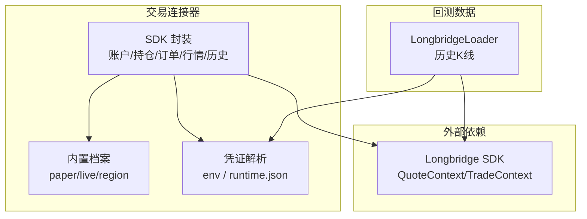
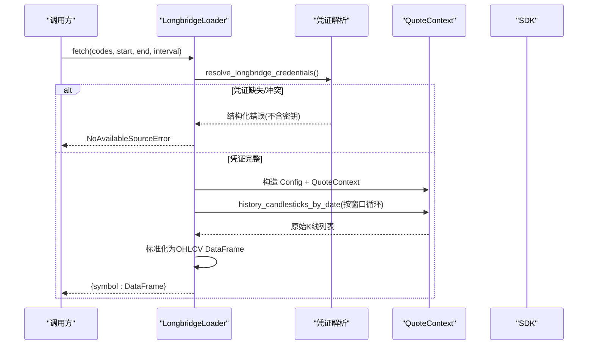
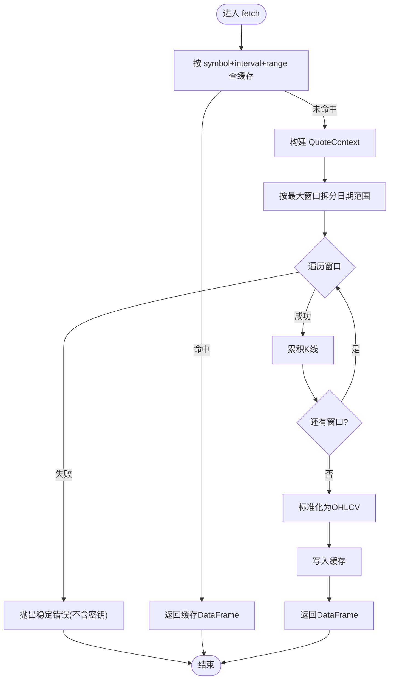
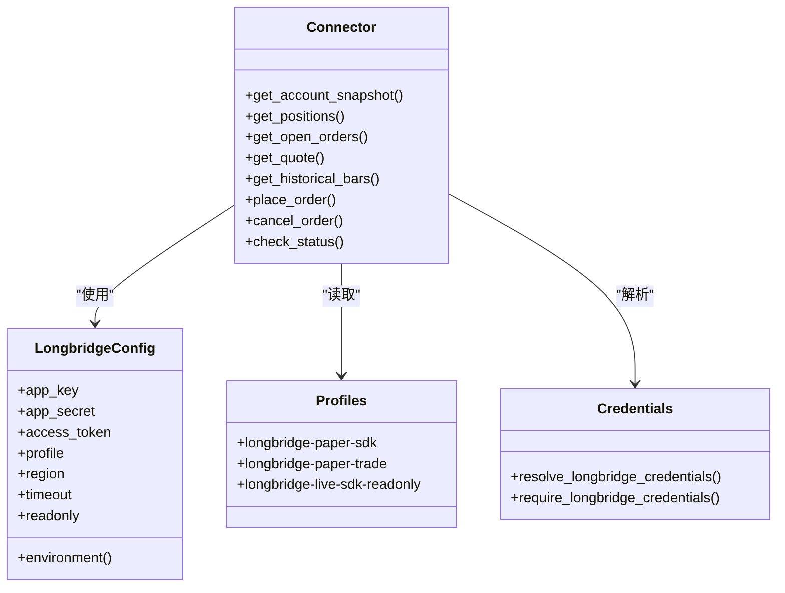
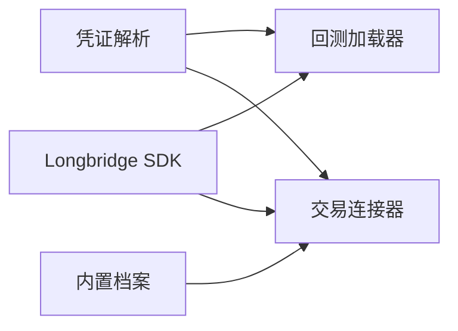

# Longbridge 港美股数据

<cite>
**本文引用的文件**
- [agent/backtest/loaders/longbridge.py](file://agent/backtest/loaders/longbridge.py)
- [agent/src/trading/connectors/longbridge/sdk.py](file://agent/src/trading/connectors/longbridge/sdk.py)
- [agent/src/trading/connectors/longbridge/credentials.py](file://agent/src/trading/connectors/longbridge/credentials.py)
- [agent/src/trading/connectors/longbridge/profiles.py](file://agent/src/trading/connectors/longbridge/profiles.py)
- [agent/tests/test_longbridge_loader.py](file://agent/tests/test_longbridge_loader.py)
- [agent/tests/test_longbridge_credentials.py](file://agent/tests/test_longbridge_credentials.py)
- [agent/tests/test_longbridge_runtime.py](file://agent/tests/test_longbridge_runtime.py)
</cite>

## 目录
1. [简介](#简介)
2. [项目结构](#项目结构)
3. [核心组件](#核心组件)
4. [架构总览](#架构总览)
5. [详细组件分析](#详细组件分析)
6. [依赖关系分析](#依赖关系分析)
7. [性能与优化](#性能与优化)
8. [故障排查指南](#故障排查指南)
9. [结论](#结论)
10. [附录](#附录)

## 简介
本文件为 Vibe-Trading 项目中 Longbridge（LongPort OpenAPI）港美股数据与交易能力的集成文档。内容覆盖：
- 认证机制与权限控制：环境变量与运行时文件的原子化凭证解析、冲突检测、错误码与诊断信息脱敏。
- 连接与上下文管理：基于官方 SDK 的 QuoteContext/TradeContext 构建与使用，无显式关闭的连接池由 SDK 管理。
- 数据格式转换与时间戳处理：统一 OHLCV 字段、时区归一化为无时区 UTC、区间窗口拆分避免静默截断。
- 高频与批量优化：按日窗口切分历史 K 线、缓存层复用、请求合并与失败回退策略。
- 应用案例：港股/美股历史回测、实时报价快照、账户与持仓读取、模拟盘下单与撤单。

## 项目结构
围绕 Longbridge 的关键代码分布在以下位置：
- 回测数据加载器：封装 LongPort OpenAPI 的历史 K 线获取，负责符号映射、周期映射、日期窗口拆分、结果标准化与缓存。
- 交易连接器：提供只读账户/持仓/订单/行情/历史接口，以及仅支持模拟盘的下单/撤单能力。
- 凭证解析：从环境变量或运行时 JSON 文件中原子选择完整且一致的三件套（App Key、App Secret、Access Token）。
- 内置配置档案：声明 paper/live 环境、区域、能力集与只读约束。

**图表来源**
- [agent/backtest/loaders/longbridge.py:200-412](file://agent/backtest/loaders/longbridge.py#L200-L412)
- [agent/src/trading/connectors/longbridge/sdk.py:1-800](file://agent/src/trading/connectors/longbridge/sdk.py#L1-L800)
- [agent/src/trading/connectors/longbridge/credentials.py:1-167](file://agent/src/trading/connectors/longbridge/credentials.py#L1-L167)
- [agent/src/trading/connectors/longbridge/profiles.py:1-56](file://agent/src/trading/connectors/longbridge/profiles.py#L1-L56)

**章节来源**
- [agent/backtest/loaders/longbridge.py:200-412](file://agent/backtest/loaders/longbridge.py#L200-L412)
- [agent/src/trading/connectors/longbridge/sdk.py:1-800](file://agent/src/trading/connectors/longbridge/sdk.py#L1-L800)
- [agent/src/trading/connectors/longbridge/credentials.py:1-167](file://agent/src/trading/connectors/longbridge/credentials.py#L1-L167)
- [agent/src/trading/connectors/longbridge/profiles.py:1-56](file://agent/src/trading/connectors/longbridge/profiles.py#L1-L56)

## 核心组件
- LongbridgeLoader（回测数据）
  - 职责：将项目符号映射为 LongPort 符号；将周期映射为 SDK Period；按最大窗口拆分日期范围；调用 history_candlesticks_by_date；标准化为 OHLCV DataFrame；写入缓存。
  - 关键行为：不支持的周期直接拒绝；超长日期范围明确报错；异常不泄露敏感信息；缓存命中则无需网络。
- SDK 封装（交易连接器）
  - 职责：构建 TradeContext/QuoteContext；暴露账户余额、持仓、今日订单、开放订单、报价、历史 K 线；仅支持模拟盘下单/撤单；健康检查与状态报告。
  - 关键行为：profile 决定环境（paper/live）；region 决定主机域名；所有公开配置输出对密钥脱敏；错误码稳定可观测。
- 凭证解析
  - 职责：从环境变量或运行时 JSON 中解析三件套；若两者都存在则比较是否一致，不一致视为冲突；任一不完整则返回缺失字段；对外抛出结构化错误。
  - 关键行为：诊断信息不包含任何密钥值；空字符串视为缺失；JSON 解析失败视为无效并降级到“缺失”。
- 内置档案
  - 职责：声明 longbridge-paper-sdk、longbridge-paper-trade、longbridge-live-sdk-readonly 三种 profile；限定能力集与只读属性；notes 说明纸盘/实盘不可自验证。

**章节来源**
- [agent/backtest/loaders/longbridge.py:200-412](file://agent/backtest/loaders/longbridge.py#L200-L412)
- [agent/src/trading/connectors/longbridge/sdk.py:1-800](file://agent/src/trading/connectors/longbridge/sdk.py#L1-L800)
- [agent/src/trading/connectors/longbridge/credentials.py:1-167](file://agent/src/trading/connectors/longbridge/credentials.py#L1-L167)
- [agent/src/trading/connectors/longbridge/profiles.py:1-56](file://agent/src/trading/connectors/longbridge/profiles.py#L1-L56)

## 架构总览
下图展示从上层工具/回测到 Longbridge SDK 的调用链与数据流。

**图表来源**
- [agent/backtest/loaders/longbridge.py:255-412](file://agent/backtest/loaders/longbridge.py#L255-L412)
- [agent/src/trading/connectors/longbridge/credentials.py:49-130](file://agent/src/trading/connectors/longbridge/credentials.py#L49-L130)

## 详细组件分析

### 回测数据加载器（LongbridgeLoader）
- 符号映射：无后缀默认追加 .US；已有后缀原样使用。
- 周期映射：支持 1D/1W/1M/1H/1m/5m/15m/30m；未支持的周期立即拒绝。
- 日期窗口：单次调用上限约 1000 根 K 线，实现按最多 180 天窗口顺序拆分，限制最大窗口数防止无限循环。
- 数据标准化：抽取 open/high/low/close/volume；trade_date 转为无时区 UTC；丢弃空行；排序索引。
- 缓存：先查缓存，命中即返回；未命中再建 SDK 上下文并拉取；成功后写回缓存。
- 错误处理：初始化失败、窗口请求失败均转换为稳定错误消息，不泄露密钥；日期非法拒绝。

**图表来源**
- [agent/backtest/loaders/longbridge.py:135-197](file://agent/backtest/loaders/longbridge.py#L135-L197)
- [agent/backtest/loaders/longbridge.py:255-412](file://agent/backtest/loaders/longbridge.py#L255-L412)

**章节来源**
- [agent/backtest/loaders/longbridge.py:89-197](file://agent/backtest/loaders/longbridge.py#L89-L197)
- [agent/backtest/loaders/longbridge.py:200-412](file://agent/backtest/loaders/longbridge.py#L200-L412)
- [agent/tests/test_longbridge_loader.py:17-34](file://agent/tests/test_longbridge_loader.py#L17-L34)
- [agent/tests/test_longbridge_loader.py:194-253](file://agent/tests/test_longbridge_loader.py#L194-L253)
- [agent/tests/test_longbridge_loader.py:256-330](file://agent/tests/test_longbridge_loader.py#L256-L330)

### 交易连接器（SDK 封装）
- 配置与档案
  - 通过 build_config 原子解析凭证，叠加 profile 与 region；保存/读取用户级配置文件；公开配置输出对密钥脱敏。
  - 内置档案定义 paper/live 环境、能力集与只读约束；paper 允许下单，live 只读。
- 只读接口
  - 账户余额、持仓、今日订单、开放订单、报价（含深度最佳买卖价）、历史 K 线。
  - 健康检查 check_status 会尝试拉取账户快照以确认连通性，并返回稳定的 connection_state 与 error_code。
- 下单与撤单（仅模拟盘）
  - 首检 environment 必须为 paper；参数校验严格（side/order_type/tif/quantity/limit_price）；调用 TradeContext 提交；失败包裹为稳定错误对象。
- 周期与枚举
  - 将 period 映射到 SDK Period；AdjustType 优先 NoAdjust；兼容新旧 SDK 包名。

**图表来源**
- [agent/src/trading/connectors/longbridge/sdk.py:58-171](file://agent/src/trading/connectors/longbridge/sdk.py#L58-L171)
- [agent/src/trading/connectors/longbridge/profiles.py:12-55](file://agent/src/trading/connectors/longbridge/profiles.py#L12-L55)
- [agent/src/trading/connectors/longbridge/credentials.py:21-130](file://agent/src/trading/connectors/longbridge/credentials.py#L21-L130)

**章节来源**
- [agent/src/trading/connectors/longbridge/sdk.py:1-800](file://agent/src/trading/connectors/longbridge/sdk.py#L1-L800)
- [agent/src/trading/connectors/longbridge/profiles.py:1-56](file://agent/src/trading/connectors/longbridge/profiles.py#L1-L56)
- [agent/src/trading/connectors/longbridge/credentials.py:1-167](file://agent/src/trading/connectors/longbridge/credentials.py#L1-L167)

### 凭证解析与权限控制
- 来源优先级与一致性
  - 若环境变量完整：优先采用；若同时存在运行时文件，需逐字段比对，不一致则判定冲突。
  - 若环境变量不完整：退回运行时文件；若仍不完整：标记缺失字段。
  - 若两者皆不存在：全部缺失。
- 错误模型
  - credentials_missing：无任何来源或来源为空。
  - credentials_partial：来源存在但不完整。
  - credentials_conflict：来源完整但字段不一致。
- 安全与脱敏
  - 所有诊断与错误消息不包含密钥值；公开配置输出对 app_key/app_secret/access_token 进行掩码。
- 权限边界
  - 通过 profile 声明环境（paper/live），并通过 capabilities 控制可用能力；live 只读 profile 不提供下单能力。

**章节来源**
- [agent/src/trading/connectors/longbridge/credentials.py:49-130](file://agent/src/trading/connectors/longbridge/credentials.py#L49-L130)
- [agent/tests/test_longbridge_credentials.py:41-172](file://agent/tests/test_longbridge_credentials.py#L41-L172)
- [agent/src/trading/connectors/longbridge/sdk.py:220-318](file://agent/src/trading/connectors/longbridge/sdk.py#L220-L318)
- [agent/src/trading/connectors/longbridge/profiles.py:12-55](file://agent/src/trading/connectors/longbridge/profiles.py#L12-L55)

### 数据格式转换、时间戳与字段映射
- 符号映射：无后缀默认 .US；保留原有市场后缀。
- 周期映射：1D/1W/1M/1H/1m/5m/15m/30m 等映射至 SDK Period；未知周期拒绝。
- 时间戳：将 SDK 返回的时间戳统一转换为无时区 UTC；去除带时区表示以避免跨时区歧义。
- 字段映射：统一为 open/high/low/close/volume；volume 缺失补零；丢弃空价格行；按 trade_date 排序。

**章节来源**
- [agent/backtest/loaders/longbridge.py:89-133](file://agent/backtest/loaders/longbridge.py#L89-L133)
- [agent/backtest/loaders/longbridge.py:159-197](file://agent/backtest/loaders/longbridge.py#L159-L197)
- [agent/tests/test_longbridge_loader.py:36-52](file://agent/tests/test_longbridge_loader.py#L36-L52)

### 连接池管理与错误恢复
- 连接池：QuoteContext/TradeContext 由 SDK 内部管理；模块注释明确无需显式关闭。
- 错误恢复
  - 初始化失败：捕获并返回稳定错误，不泄露密钥。
  - 窗口请求失败：中断当前标的拉取并抛出稳定错误，不缓存部分结果。
  - 健康检查：check_status 尝试账户快照，根据异常类型映射为 network_unreachable/authentication_failed/broker_error。
- 幂等与重试建议
  - 外层可按业务策略对短期网络抖动重试；注意速率限制与配额。

**章节来源**
- [agent/backtest/loaders/longbridge.py:334-409](file://agent/backtest/loaders/longbridge.py#L334-L409)
- [agent/src/trading/connectors/longbridge/sdk.py:220-318](file://agent/src/trading/connectors/longbridge/sdk.py#L220-L318)
- [agent/tests/test_longbridge_loader.py:256-330](file://agent/tests/test_longbridge_loader.py#L256-L330)

### 高频数据获取、批量查询与缓存策略
- 历史 K 线批量
  - 按最大窗口拆分日期范围，避免单次请求过大导致截断；限制最大窗口数量防止极端请求。
  - 多标的并行：可在上层并发多个标的的 fetch，共享同一 SDK 上下文（由 SDK 管理连接池）。
- 实时报价
  - 通过 get_quote 获取最新报价，并结合 depth 提取最佳买卖价；适合盘中监控。
- 缓存
  - 回测加载器在内存层缓存已拉取的 DataFrame；完全命中时无网络开销。
  - 生产侧可结合外部缓存（如 Redis）对热点标的/周期做持久化缓存，注意失效策略与一致性。

**章节来源**
- [agent/backtest/loaders/longbridge.py:135-197](file://agent/backtest/loaders/longbridge.py#L135-L197)
- [agent/backtest/loaders/longbridge.py:288-307](file://agent/backtest/loaders/longbridge.py#L288-L307)
- [agent/src/trading/connectors/longbridge/sdk.py:392-428](file://agent/src/trading/connectors/longbridge/sdk.py#L392-L428)

### 应用案例
- 港美股历史回测
  - 使用 LongbridgeLoader 拉取 AAPL.US、700.HK 等多标的日/分钟线，标准化后输入因子计算与回测引擎。
- 跨境投资研究
  - 通过 get_quote 获取实时报价与买卖盘口，结合基本面/事件驱动信号进行跨市场对比。
- 多市场策略
  - 组合港股与美股同板块标的，利用统一 OHLCV 格式进行协整/配对交易或相对强弱策略。
- 模拟盘交易
  - 使用 longbridge-paper-trade profile 进行下单与撤单；所有订单走模拟账户，避免误触实盘。

[本节为概念性说明，不直接分析具体文件]

## 依赖关系分析
- 模块耦合
  - Loader 依赖凭证解析与 SDK；Connector 同样依赖凭证解析与 SDK；Profiles 提供静态配置。
- 外部依赖
  - 可选依赖 longbridge SDK；未安装时返回明确的 sdk_missing 状态。
- 潜在环路
  - 各模块单向依赖，未发现循环导入风险。

**图表来源**
- [agent/backtest/loaders/longbridge.py:200-412](file://agent/backtest/loaders/longbridge.py#L200-L412)
- [agent/src/trading/connectors/longbridge/sdk.py:1-800](file://agent/src/trading/connectors/longbridge/sdk.py#L1-L800)
- [agent/src/trading/connectors/longbridge/credentials.py:1-167](file://agent/src/trading/connectors/longbridge/credentials.py#L1-L167)
- [agent/src/trading/connectors/longbridge/profiles.py:1-56](file://agent/src/trading/connectors/longbridge/profiles.py#L1-L56)

**章节来源**
- [agent/backtest/loaders/longbridge.py:200-412](file://agent/backtest/loaders/longbridge.py#L200-L412)
- [agent/src/trading/connectors/longbridge/sdk.py:1-800](file://agent/src/trading/connectors/longbridge/sdk.py#L1-L800)
- [agent/src/trading/connectors/longbridge/credentials.py:1-167](file://agent/src/trading/connectors/longbridge/credentials.py#L1-L167)
- [agent/src/trading/connectors/longbridge/profiles.py:1-56](file://agent/src/trading/connectors/longbridge/profiles.py#L1-L56)

## 性能与优化
- 减少网络调用
  - 充分利用内存缓存；相同 symbol+interval+date range 的请求直接命中。
- 降低单次请求压力
  - 按 180 天窗口拆分长跨度历史；限制最大窗口数，避免极端请求。
- 并发与吞吐
  - 上层可对多标的并发 fetch；SDK 内部维护连接池，合理设置超时与重试。
- 数据体积控制
  - 按需选择周期与 limit；分钟线数据量较大，建议在批处理中分页与压缩存储。
- 健康检查
  - 启动前调用 check_status，快速识别网络/认证问题，避免后续任务浪费。

[本节为通用指导，不直接分析具体文件]

## 故障排查指南
- 常见错误与定位
  - 凭证缺失/部分/冲突：查看错误码与缺失字段；确保环境变量与运行时文件一致且完整。
  - SDK 未安装：状态报告中的 sdk_installed 为 False；按提示安装依赖。
  - 网络不可达/认证失败/券商错误：根据 connection_state 与 error_code 分类处理。
  - 历史数据为空：检查标的与市场、日期范围与交易日历；确认未被窗口限制截断。
- 日志与诊断
  - 所有错误消息不包含密钥；可通过 status 接口获取脱敏后的配置摘要。
- 复现与回归
  - 参考测试用例：凭证解析、加载器窗口拆分、异常路径与脱敏行为。

**章节来源**
- [agent/src/trading/connectors/longbridge/sdk.py:220-318](file://agent/src/trading/connectors/longbridge/sdk.py#L220-L318)
- [agent/tests/test_longbridge_credentials.py:145-172](file://agent/tests/test_longbridge_credentials.py#L145-L172)
- [agent/tests/test_longbridge_loader.py:256-330](file://agent/tests/test_longbridge_loader.py#L256-L330)
- [agent/tests/test_longbridge_runtime.py:325-343](file://agent/tests/test_longbridge_runtime.py#L325-L343)

## 结论
本项目对 Longbridge 的集成遵循“安全、稳健、可观测”的原则：
- 凭证解析原子化且诊断脱敏，避免误配与泄露。
- 历史数据按窗口拆分与缓存，兼顾正确性与性能。
- 交易能力以 profile 与 capabilities 严格约束，模拟盘下单与实盘只读隔离清晰。
- 通过健康检查与稳定错误码，提升运维可观测性与排障效率。

[本节为总结性内容，不直接分析具体文件]

## 附录
- 常用周期与映射
  - 1D/1W/1M/1H/1m/5m/15m/30m；未支持周期将被拒绝。
- 符号约定
  - 无后缀默认 .US；保留原有市场后缀（如 .HK/.SH/.SZ）。
- 配置键
  - LONGBRIDGE_APP_KEY、LONGBRIDGE_APP_SECRET、LONGBRIDGE_ACCESS_TOKEN；运行时文件 longbridge.json。
- 状态字段
  - configured、credential_source、sdk_installed、connection_state、error_code、last_checked_at。

[本节为补充说明，不直接分析具体文件]