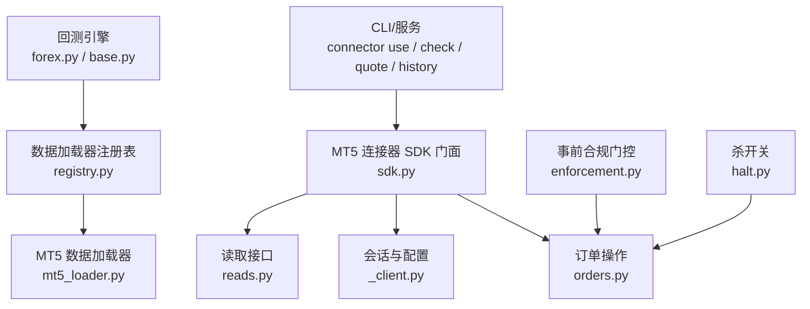
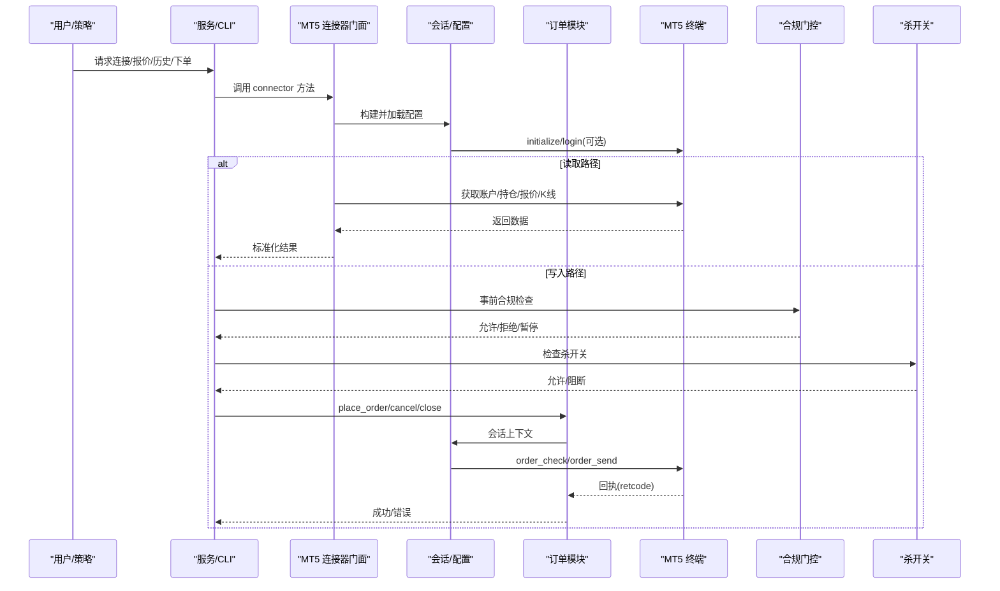
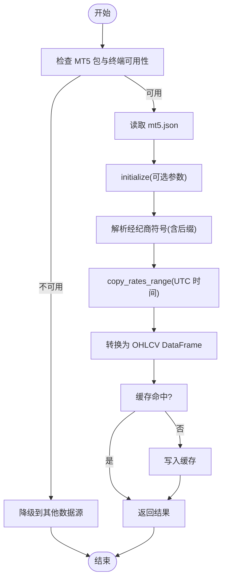
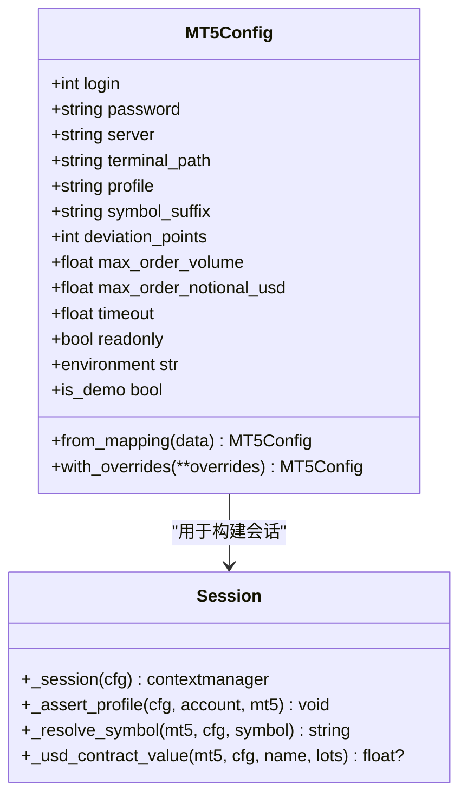
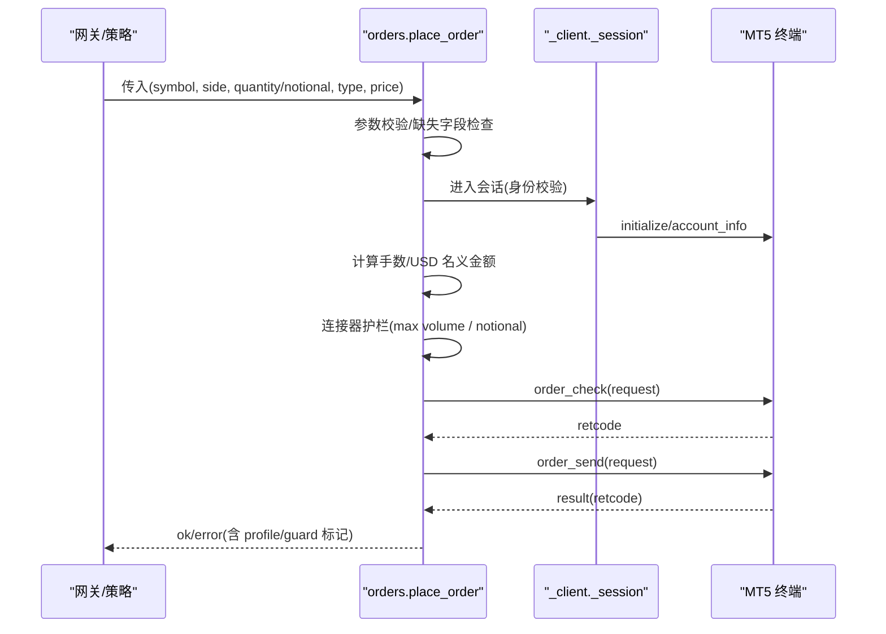
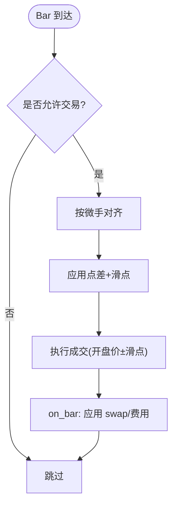
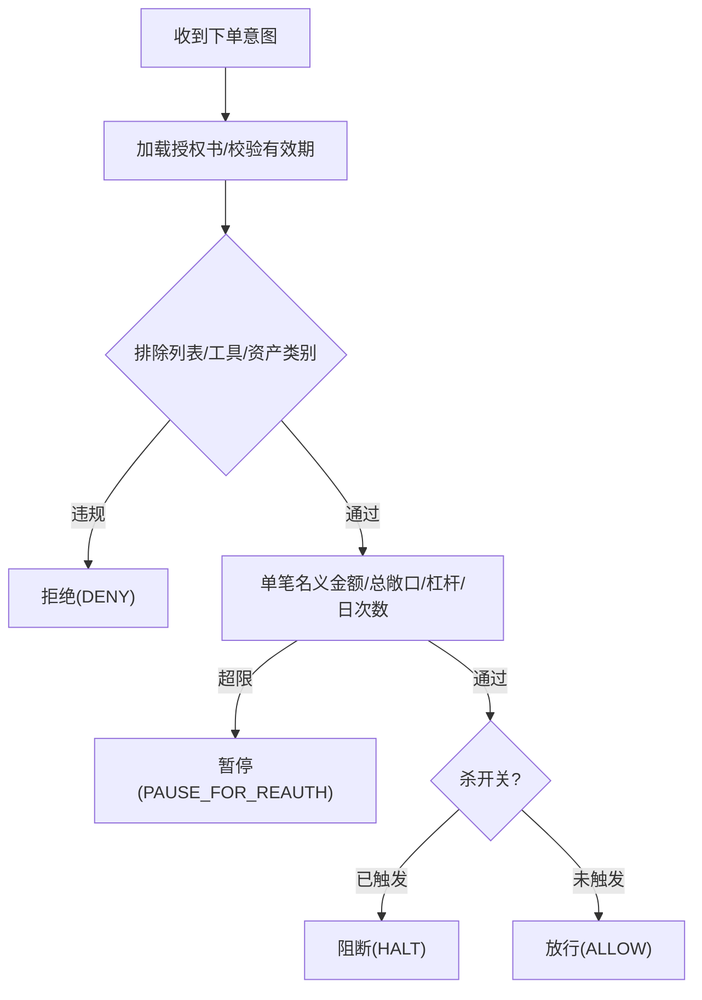
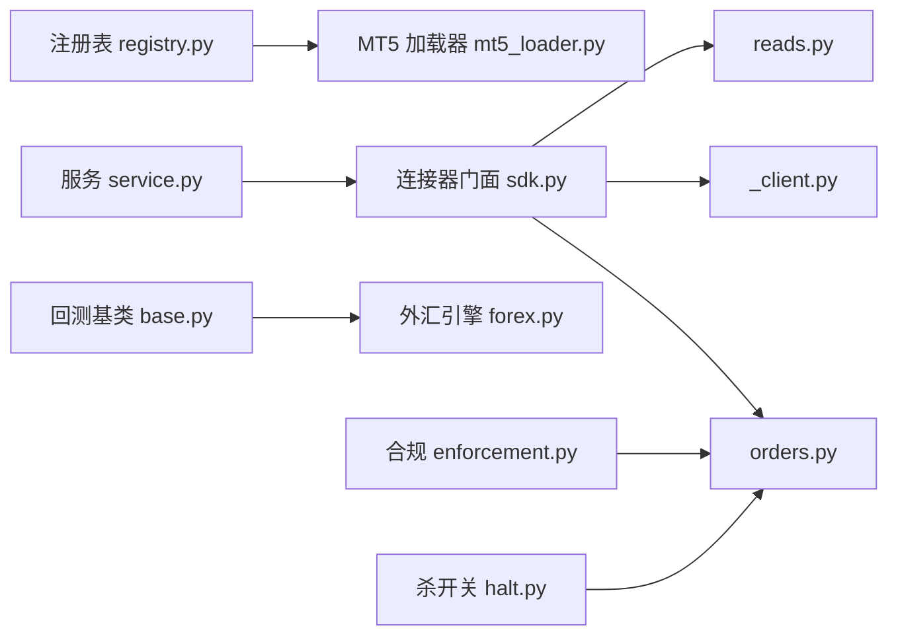

# MT5 外汇期货

<cite>
**本文引用的文件**
- [agent/backtest/loaders/mt5_loader.py](file://agent/backtest/loaders/mt5_loader.py)
- [agent/backtest/loaders/registry.py](file://agent/backtest/loaders/registry.py)
- [agent/backtest/engines/forex.py](file://agent/backtest/engines/forex.py)
- [agent/backtest/engines/base.py](file://agent/backtest/engines/base.py)
- [agent/src/trading/connectors/mt5/__init__.py](file://agent/src/trading/connectors/mt5/__init__.py)
- [agent/src/trading/connectors/mt5/_client.py](file://agent/src/trading/connectors/mt5/_client.py)
- [agent/src/trading/connectors/mt5/orders.py](file://agent/src/trading/connectors/mt5/orders.py)
- [agent/src/trading/connectors/mt5/sdk.py](file://agent/src/trading/connectors/mt5/sdk.py)
- [agent/src/trading/service.py](file://agent/src/trading/service.py)
- [agent/src/live/enforcement.py](file://agent/src/live/enforcement.py)
- [agent/src/live/halt.py](file://agent/src/live/halt.py)
- [agent/cli/_legacy.py](file://agent/cli/_legacy.py)
- [README_zh.md](file://README_zh.md)
</cite>

## 目录
1. [简介](#简介)
2. [项目结构](#项目结构)
3. [核心组件](#核心组件)
4. [架构总览](#架构总览)
5. [详细组件分析](#详细组件分析)
6. [依赖关系分析](#依赖关系分析)
7. [性能考量](#性能考量)
8. [故障排查指南](#故障排查指南)
9. [结论](#结论)
10. [附录](#附录)

## 简介
本文件面向在 MetaTrader 5（MT5）终端环境下进行外汇、期货与差价合约（CFD）交易的工程实现，系统性说明：
- 如何通过本地运行的 MT5 终端接入外汇市场数据与交易通道；
- 账户认证、订单执行与风险管理机制；
- K线数据获取、技术指标计算与回测引擎集成；
- 外汇策略、套利策略与趋势跟踪策略的落地方案；
- 专业外汇交易、机构级风控与自动化交易的应用案例。

本项目通过“连接器 + 回测引擎 + 指令门控”的分层设计，将 MT5 作为可选的数据源与交易通道，并在读/写路径上分别提供严格的安全边界与可审计的执行流程。

## 项目结构
围绕 MT5 的关键代码分布在以下模块：
- 数据加载：MT5 历史数据加载器，优先从本地终端拉取外汇/贵金属 OHLCV；不可用时自动降级到其它数据源。
- 交易连接器：封装 MT5 终端会话、配置、身份校验、下单/撤单/平仓等读写接口。
- 回测引擎：外汇专用引擎与通用基类，支持滑点、点差、隔夜利息、杠杆与仓位管理。
- 指令门控：统一的事前合规检查（授权书、限额、杀开关），确保任何真实资金下单都受约束。
- CLI/服务：暴露统一的连接器选择、账户查询、报价与历史查询命令，以及服务路由。

图表来源
- [agent/src/trading/connectors/mt5/sdk.py:1-66](file://agent/src/trading/connectors/mt5/sdk.py#L1-L66)
- [agent/src/trading/connectors/mt5/_client.py:237-300](file://agent/src/trading/connectors/mt5/_client.py#L237-L300)
- [agent/src/trading/connectors/mt5/orders.py:59-158](file://agent/src/trading/connectors/mt5/orders.py#L59-L158)
- [agent/backtest/loaders/registry.py:149-155](file://agent/backtest/loaders/registry.py#L149-L155)
- [agent/backtest/loaders/mt5_loader.py:170-251](file://agent/backtest/loaders/mt5_loader.py#L170-L251)
- [agent/backtest/engines/forex.py:56-137](file://agent/backtest/engines/forex.py#L56-L137)
- [agent/src/live/enforcement.py:455-617](file://agent/src/live/enforcement.py#L455-L617)
- [agent/src/live/halt.py:1-34](file://agent/src/live/halt.py#L1-L34)

章节来源
- [agent/backtest/loaders/registry.py:149-155](file://agent/backtest/loaders/registry.py#L149-L155)
- [agent/backtest/loaders/mt5_loader.py:1-251](file://agent/backtest/loaders/mt5_loader.py#L1-L251)
- [agent/src/trading/connectors/mt5/sdk.py:1-66](file://agent/src/trading/connectors/mt5/sdk.py#L1-L66)
- [agent/src/trading/connectors/mt5/_client.py:1-380](file://agent/src/trading/connectors/mt5/_client.py#L1-L380)
- [agent/src/trading/connectors/mt5/orders.py:1-408](file://agent/src/trading/connectors/mt5/orders.py#L1-L408)
- [agent/backtest/engines/forex.py:1-137](file://agent/backtest/engines/forex.py#L1-L137)
- [agent/backtest/engines/base.py:377-800](file://agent/backtest/engines/base.py#L377-L800)
- [agent/src/live/enforcement.py:1-798](file://agent/src/live/enforcement.py#L1-L798)
- [agent/src/live/halt.py:1-34](file://agent/src/live/halt.py#L1-L34)
- [agent/src/trading/service.py:1-34](file://agent/src/trading/service.py#L1-L34)
- [README_zh.md:1171-1201](file://README_zh.md#L1171-L1201)

## 核心组件
- MT5 数据加载器：从本地 MT5 终端按区间拉取外汇/贵金属 K 线，支持多周期映射、符号后缀发现、缓存与失败降级。
- MT5 连接器：进程级会话管理、账户身份双向校验、USD 名义金额定价钩子、订单/撤单/平仓。
- 外汇回测引擎：点差/滑点模型、微手单位、隔夜利息、杠杆与保证金、24x5 无限制执行。
- 事前合规门控：授权书（Mandate）、限额（单笔名义金额、总敞口、杠杆、日交易次数）、资产类别与工具白名单、杀开关。
- CLI/服务：连接器选择、账户快照、报价与历史查询的统一入口。

章节来源
- [agent/backtest/loaders/mt5_loader.py:170-251](file://agent/backtest/loaders/mt5_loader.py#L170-L251)
- [agent/src/trading/connectors/mt5/_client.py:54-126](file://agent/src/trading/connectors/mt5/_client.py#L54-L126)
- [agent/src/trading/connectors/mt5/orders.py:42-158](file://agent/src/trading/connectors/mt5/orders.py#L42-L158)
- [agent/backtest/engines/forex.py:56-137](file://agent/backtest/engines/forex.py#L56-L137)
- [agent/src/live/enforcement.py:455-617](file://agent/src/live/enforcement.py#L455-L617)
- [agent/src/trading/service.py:1-34](file://agent/src/trading/service.py#L1-L34)

## 架构总览
下图展示从 CLI/服务到 MT5 终端的端到端调用链，包括数据与交易两条路径，以及合规门控与杀开关的拦截点。

图表来源
- [agent/src/trading/connectors/mt5/sdk.py:1-66](file://agent/src/trading/connectors/mt5/sdk.py#L1-L66)
- [agent/src/trading/connectors/mt5/_client.py:237-300](file://agent/src/trading/connectors/mt5/_client.py#L237-L300)
- [agent/src/trading/connectors/mt5/orders.py:59-158](file://agent/src/trading/connectors/mt5/orders.py#L59-L158)
- [agent/src/live/enforcement.py:455-617](file://agent/src/live/enforcement.py#L455-L617)
- [agent/src/live/halt.py:1-34](file://agent/src/live/halt.py#L1-L34)

## 详细组件分析

### MT5 数据加载器（历史 K 线）
- 功能要点
  - 仅 Windows，需安装可选扩展并运行登录的 MT5 终端。
  - 共享配置文件 mt5.json（与交易连接器共用）。
  - 周期映射：分钟/小时/日/周/月，大小写敏感处理。
  - 符号解析：支持原始名、规范化基础名、后缀发现（如 Exness 的 EURUSDm）。
  - 时间范围：UTC 时区转换，避免本地时区偏移导致的数据错位。
  - 失败降级：单个标的失败不影响批次，整体不可用则回退到 akshare/yfinance/local。
- 复杂度与性能
  - 初始化一次进程内缓存，减少重复 attach 开销。
  - 符号解析结果缓存，降低 symbols_get 调用频率。
  - 批量 fetch 使用缓存键（source/symbol/timeframe/date range）去重。

图表来源
- [agent/backtest/loaders/mt5_loader.py:61-108](file://agent/backtest/loaders/mt5_loader.py#L61-L108)
- [agent/backtest/loaders/mt5_loader.py:121-147](file://agent/backtest/loaders/mt5_loader.py#L121-L147)
- [agent/backtest/loaders/mt5_loader.py:150-167](file://agent/backtest/loaders/mt5_loader.py#L150-L167)
- [agent/backtest/loaders/mt5_loader.py:182-251](file://agent/backtest/loaders/mt5_loader.py#L182-L251)

章节来源
- [agent/backtest/loaders/mt5_loader.py:1-251](file://agent/backtest/loaders/mt5_loader.py#L1-L251)
- [agent/backtest/loaders/registry.py:149-155](file://agent/backtest/loaders/registry.py#L149-L155)

### MT5 连接器（会话、配置、身份校验、USD 定价）
- 会话生命周期
  - 进程级锁保护，避免并发访问 MT5 API。
  - 每次会话 initialize → 读取 account_info → 身份校验 → 执行业务 → shutdown。
- 身份与环境隔离
  - paper 必须对应 DEMO 账户，live 必须对应 REAL 账户；contest 账户一律拒绝。
  - 登录号 pin 校验，防止误连其他账户。
- USD 名义金额定价钩子
  - 基于合约规模与报价中间价，支持基础货币为 USD、计价货币为 USD 或交叉汇率换算。
  - 无法定价时 fail-closed，上游拒绝。

图表来源
- [agent/src/trading/connectors/mt5/_client.py:54-126](file://agent/src/trading/connectors/mt5/_client.py#L54-L126)
- [agent/src/trading/connectors/mt5/_client.py:237-300](file://agent/src/trading/connectors/mt5/_client.py#L237-L300)
- [agent/src/trading/connectors/mt5/_client.py:303-380](file://agent/src/trading/connectors/mt5/_client.py#L303-L380)

章节来源
- [agent/src/trading/connectors/mt5/_client.py:1-380](file://agent/src/trading/connectors/mt5/_client.py#L1-L380)
- [agent/src/trading/connectors/mt5/__init__.py:1-15](file://agent/src/trading/connectors/mt5/__init__.py#L1-L15)

### 订单执行（下单、撤单、平仓）
- 下单流程
  - 参数校验（方向、类型、数量/名义金额二选一、限价单价格必填）。
  - 体积计算：支持按手数或 USD 名义金额换算到手数，向下取整至最小步进。
  - 连接器级护栏：最大手数与最大 USD 名义金额（demo 与 live 均生效）。
  - 预检与发送：order_check → order_send，retcode 判定。
- 撤单/平仓
  - 挂单取消与持仓关闭均走 ticket 钉住路径，确保只减风险。
  - 对冲账户注意：反向下单会开对冲仓，平仓需通过 ticket 指定。

图表来源
- [agent/src/trading/connectors/mt5/orders.py:59-158](file://agent/src/trading/connectors/mt5/orders.py#L59-L158)
- [agent/src/trading/connectors/mt5/orders.py:228-276](file://agent/src/trading/connectors/mt5/orders.py#L228-L276)
- [agent/src/trading/connectors/mt5/orders.py:278-334](file://agent/src/trading/connectors/mt5/orders.py#L278-L334)
- [agent/src/trading/connectors/mt5/orders.py:336-393](file://agent/src/trading/connectors/mt5/orders.py#L336-L393)

章节来源
- [agent/src/trading/connectors/mt5/orders.py:1-408](file://agent/src/trading/connectors/mt5/orders.py#L1-L408)

### 外汇回测引擎（点差、滑点、隔夜利息、杠杆）
- 市场规则
  - 24x5 交易，无方向限制；标准手=100,000 基础货币单位。
  - 成本以点差+滑点体现，无显式佣金（ECN 场景可扩展）。
  - 每日收盘应用 swap（隔夜利息）。
- 执行细节
  - 滑点：根据品种 pip 值与点差配置计算买入/卖出价差。
  - 仓位四舍五入：按微手（1000 单位）对齐。
  - 基准价格：使用前一收盘价或结算价，避免未来函数。

图表来源
- [agent/backtest/engines/forex.py:56-137](file://agent/backtest/engines/forex.py#L56-L137)
- [agent/backtest/engines/base.py:468-538](file://agent/backtest/engines/base.py#L468-L538)

章节来源
- [agent/backtest/engines/forex.py:1-137](file://agent/backtest/engines/forex.py#L1-L137)
- [agent/backtest/engines/base.py:377-800](file://agent/backtest/engines/base.py#L377-L800)

### 事前合规门控与杀开关
- 授权书（Mandate）检查顺序
  - 排除列表 → 工具白名单 → 资产类别 → 单笔名义金额 → 总敞口 → 杠杆 → 日交易次数 → 资金上限（防御性）。
  - 任何不可解析或缺失数据均 fail-closed 拒绝。
- 杀开关（Halt）
  - 全局或按经纪商的文件哨兵，存在即阻断所有 live 下单。
  - CLI 提供触发与恢复命令。

图表来源
- [agent/src/live/enforcement.py:455-617](file://agent/src/live/enforcement.py#L455-L617)
- [agent/src/live/halt.py:1-34](file://agent/src/live/halt.py#L1-L34)
- [agent/cli/_legacy.py:3619-3662](file://agent/cli/_legacy.py#L3619-L3662)

章节来源
- [agent/src/live/enforcement.py:1-798](file://agent/src/live/enforcement.py#L1-L798)
- [agent/src/live/halt.py:1-34](file://agent/src/live/halt.py#L1-L34)
- [agent/cli/_legacy.py:3599-3672](file://agent/cli/_legacy.py#L3599-L3672)

### 服务与 CLI 集成
- 连接器选择与能力探测
  - 通过 service 路由将“broker_sdk”连接器（含 mt5）动态导入，暴露统一读接口。
- 常用命令
  - 选择连接器、检查连接、查看账户、报价与历史查询。
  - 配置 mt5.json（登录、密码、服务器、后缀、单笔上限等）。

章节来源
- [agent/src/trading/service.py:1-34](file://agent/src/trading/service.py#L1-L34)
- [README_zh.md:1171-1201](file://README_zh.md#L1171-L1201)

## 依赖关系分析
- 数据加载器注册表将 forex 市场优先路由到 mt5 loader，若不可用则回退到 akshare/yfinance/local。
- 连接器门面 sdk.py 聚合 _client、orders、reads 的对外接口，便于 service 动态导入。
- 回测引擎 base.py 提供通用执行循环，forex.py 实现外汇市场规则。
- 合规门控与杀开关独立于具体连接器，对所有 live 写入路径生效。

图表来源
- [agent/backtest/loaders/registry.py:149-155](file://agent/backtest/loaders/registry.py#L149-L155)
- [agent/src/trading/connectors/mt5/sdk.py:1-66](file://agent/src/trading/connectors/mt5/sdk.py#L1-L66)
- [agent/backtest/engines/base.py:377-800](file://agent/backtest/engines/base.py#L377-L800)
- [agent/backtest/engines/forex.py:56-137](file://agent/backtest/engines/forex.py#L56-L137)
- [agent/src/live/enforcement.py:455-617](file://agent/src/live/enforcement.py#L455-L617)
- [agent/src/live/halt.py:1-34](file://agent/src/live/halt.py#L1-L34)

章节来源
- [agent/backtest/loaders/registry.py:149-155](file://agent/backtest/loaders/registry.py#L149-L155)
- [agent/src/trading/connectors/mt5/sdk.py:1-66](file://agent/src/trading/connectors/mt5/sdk.py#L1-L66)
- [agent/backtest/engines/base.py:377-800](file://agent/backtest/engines/base.py#L377-L800)
- [agent/backtest/engines/forex.py:56-137](file://agent/backtest/engines/forex.py#L56-L137)
- [agent/src/live/enforcement.py:455-617](file://agent/src/live/enforcement.py#L455-L617)
- [agent/src/live/halt.py:1-34](file://agent/src/live/halt.py#L1-L34)

## 性能考量
- 终端初始化与符号解析缓存：避免重复 initialize 与 symbols_get 带来的延迟。
- 批量 fetch 缓存：按 source/symbol/timeframe/date range 去重，减少重复网络/终端调用。
- 时区处理：统一 UTC 时间戳，避免本地时区偏移导致的范围错位。
- 回测优化：向量化对齐、ffill 限制、numpy 矩阵运算，减少 pandas 开销。
- 连接器锁：进程级互斥，保证 MT5 API 线程安全。

[本节为通用指导，不直接分析具体文件]

## 故障排查指南
- 无法导入 MT5 包
  - 现象：连接器报告依赖缺失。
  - 处理：安装可选扩展并确保在 Windows 环境运行。
- 终端未运行或未登录
  - 现象：initialize 失败或 last_error 非空。
  - 处理：启动 MT5 终端并登录到配置的服务器与账号。
- 账户环境不匹配
  - 现象：paper 配置但终端为 real，或反之。
  - 处理：切换正确账户或修改配置。
- 符号不存在或无法选择
  - 现象：symbols_get 无匹配或 Market Watch 选择失败。
  - 处理：检查 symbol_suffix 与经纪商实际名称，必要时调整。
- 订单被拒
  - 现象：order_check 或 order_send 返回非 DONE。
  - 处理：查看 retcode 与 comment，核对填充模式、滑点、最小手数与名义金额上限。
- 杀开关触发
  - 现象：所有 live 下单被阻断。
  - 处理：检查并清除 HALT 哨兵文件后恢复。

章节来源
- [agent/src/trading/connectors/mt5/_client.py:173-191](file://agent/src/trading/connectors/mt5/_client.py#L173-L191)
- [agent/src/trading/connectors/mt5/_client.py:237-300](file://agent/src/trading/connectors/mt5/_client.py#L237-L300)
- [agent/src/trading/connectors/mt5/orders.py:150-158](file://agent/src/trading/connectors/mt5/orders.py#L150-L158)
- [agent/src/live/halt.py:1-34](file://agent/src/live/halt.py#L1-L34)
- [agent/cli/_legacy.py:3619-3662](file://agent/cli/_legacy.py#L3619-L3662)

## 结论
本项目将 MT5 作为可选的外汇数据与交易通道，通过严格的会话管理、身份校验与 USD 名义金额定价钩子，结合回测引擎与事前合规门控，实现了从研究到实盘的一致性与安全性。对于外汇交易、套利与趋势跟踪策略，可在回测中验证逻辑，再通过授权书与限额控制上线，配合杀开关保障极端情况下的风险控制。

[本节为总结，不直接分析具体文件]

## 附录
- 配置示例与命令
  - 配置文件路径与字段：登录、密码、服务器、后缀、单笔手数与名义金额上限、超时等。
  - 常用命令：选择连接器、检查连接、账户信息、报价与历史查询。
- 策略实现建议
  - 外汇趋势跟踪：基于多周期信号与滑点/点差建模，回测评估换手与收益风险比。
  - 套利策略：跨品种/跨期价差回归与均值回归，关注流动性与交易成本。
  - 机构级风控：授权书硬约束、单笔与总敞口限额、杠杆上限、日交易次数、资金上限与杀开关组合。

章节来源
- [README_zh.md:1171-1201](file://README_zh.md#L1171-L1201)
- [agent/src/live/enforcement.py:455-617](file://agent/src/live/enforcement.py#L455-L617)
- [agent/backtest/engines/forex.py:56-137](file://agent/backtest/engines/forex.py#L56-L137)